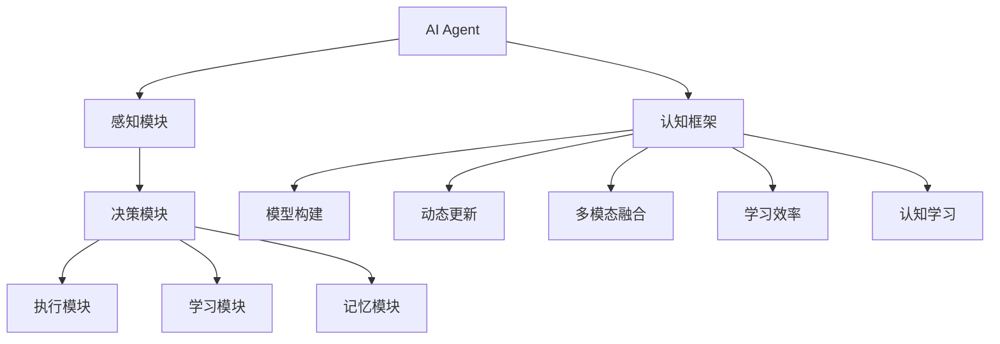
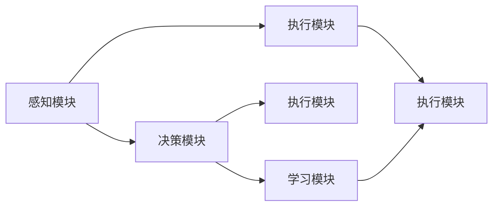
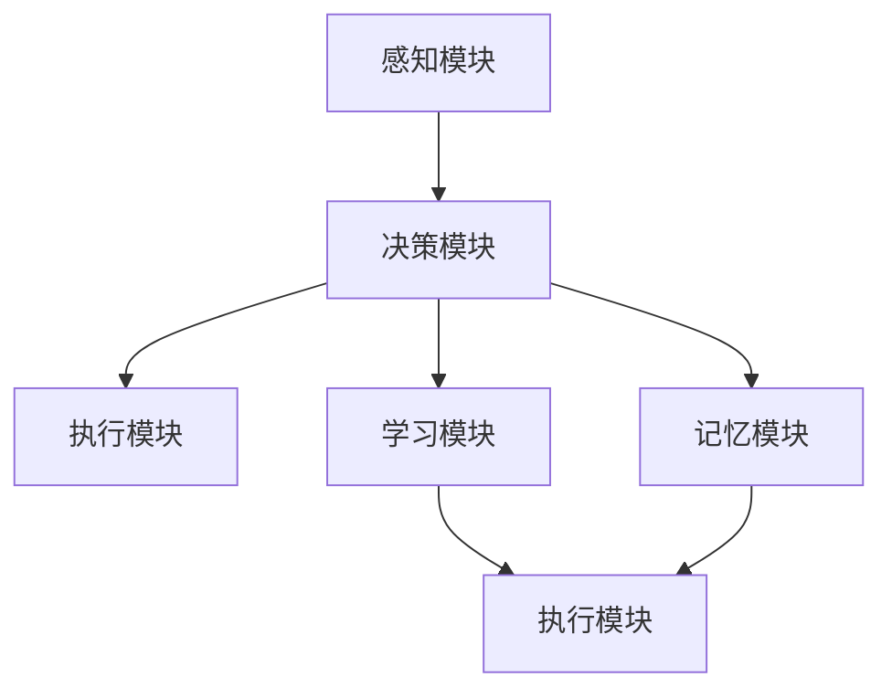
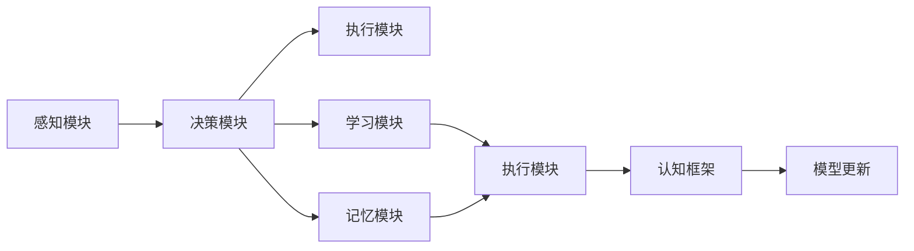

                 

# 【大模型应用开发 动手做AI Agent】其他Agent认知框架

> 关键词：大模型应用, AI Agent, 认知框架, 智能决策, 动态更新, 多模态融合, 学习效率, 认知学习

## 1. 背景介绍

### 1.1 问题由来
近年来，随着深度学习和自然语言处理(NLP)技术的飞速发展，基于大语言模型的AI Agent（智能代理）应用已成为推动人工智能领域的重要方向。AI Agent 不仅能模拟人类的认知和学习过程，还能够自主地感知环境、执行任务并做出决策。认知框架作为AI Agent的核心组成部分，负责建模AI Agent的认知过程，使其具备与人类相似的智能行为。

### 1.2 问题核心关键点
认知框架作为AI Agent的智能核心，其关键点在于：

- 如何有效建模AI Agent的认知过程？
- 如何实现AI Agent的动态更新和适应？
- 如何高效融合多模态信息，提升AI Agent的感知能力？
- 如何优化AI Agent的学习效率，使其能够快速适应新的环境和任务？
- 如何评估和优化AI Agent的认知学习过程，确保其决策的可靠性和合理性？

这些问题构成了认知框架的研究重点，也是本文探讨的核心内容。

### 1.3 问题研究意义
认知框架的研究对于AI Agent的发展具有重要意义：

- 提升AI Agent的智能水平。通过合理建模AI Agent的认知过程，使其能够更好地理解环境和任务，做出更加智能的决策。
- 促进AI Agent的实际应用。认知框架作为AI Agent的核心，是其能否实际落地应用的关键。
- 推动AI领域的技术进步。认知框架的优化和创新，能够显著提升AI Agent的性能和效率，加速AI技术的产业化进程。
- 拓展AI的应用场景。认知框架的扩展和应用，能够使AI Agent广泛应用于更多领域，如智能客服、医疗诊断、自动驾驶等。
- 促进跨学科研究。认知框架涉及认知科学、神经科学、计算机科学等多个领域，其研究能够推动跨学科的深入交流和合作。

## 2. 核心概念与联系

### 2.1 核心概念概述

为更好地理解AI Agent认知框架，本节将介绍几个密切相关的核心概念：

- AI Agent：指能够自主感知环境、执行任务并做出决策的智能系统，具有与人类相似的智能行为。
- 认知框架：指建模AI Agent认知过程的框架，负责表示、推理和规划AI Agent的行为和决策。
- 感知模块：负责收集和处理环境信息，如视觉、听觉、语言等。
- 决策模块：负责根据感知信息，结合先验知识，通过规划和推理，生成AI Agent的决策。
- 学习模块：负责更新AI Agent的认知模型，使其能够适应新的环境和任务。
- 记忆模块：负责存储和管理AI Agent的知识和经验，用于辅助决策和规划。
- 执行模块：负责根据决策生成具体的行为指令，并执行相应的动作。

这些核心概念之间的逻辑关系可以通过以下Mermaid流程图来展示：



这个流程图展示了大模型AI Agent的认知框架的基本构成和各模块之间的关系：

- AI Agent作为认知框架的实体，通过感知、决策、学习、执行和记忆模块进行自主认知和学习。
- 认知框架负责建模这些模块的交互和协作，确保AI Agent具备智能行为。
- 模型构建、动态更新、多模态融合、学习效率和认知学习等技术，是认知框架的关键组成部分。

### 2.2 概念间的关系

这些核心概念之间存在着紧密的联系，形成了AI Agent认知框架的完整生态系统。下面我们通过几个Mermaid流程图来展示这些概念之间的关系。

#### 2.2.1 AI Agent的认知过程



这个流程图展示了AI Agent的认知过程：感知模块收集环境信息，决策模块根据感知信息生成决策，执行模块执行决策，学习模块根据执行结果更新感知和决策模块。

#### 2.2.2 认知框架的构成



这个流程图展示了认知框架的构成：感知模块负责收集环境信息，决策模块根据感知信息生成决策，执行模块执行决策，学习模块根据执行结果更新感知和决策模块，记忆模块用于存储和管理AI Agent的知识和经验。

#### 2.2.3 认知框架的动态更新



这个流程图展示了认知框架的动态更新过程：通过感知、决策、执行、学习和记忆模块的交互，认知框架不断更新模型，以适应新的环境和任务。

## 3. 核心算法原理 & 具体操作步骤
### 3.1 算法原理概述

AI Agent的认知框架通过以下几个关键算法来实现其认知过程和动态更新：

1. **感知模块的建模**：使用深度学习模型对环境信息进行建模，如卷积神经网络(CNN)用于视觉信息处理，循环神经网络(RNN)用于时间序列数据处理。
2. **决策模块的推理**：使用基于图神经网络(GNN)的模型对感知信息进行推理，如通过图网络对知识图谱进行推理。
3. **多模态融合技术**：使用注意力机制(AAttention)融合视觉、听觉和语言等多种模态信息，提升AI Agent的感知能力。
4. **学习模块的优化**：使用强化学习(Reinforcement Learning, RL)优化AI Agent的学习过程，通过与环境互动，不断调整决策策略。
5. **记忆模块的管理**：使用基于神经网络的记忆模块，如记忆网络(Memory Network)，存储和管理AI Agent的知识和经验。

这些算法共同构成了AI Agent认知框架的核心，使得AI Agent能够自主感知环境、执行任务并做出智能决策。

### 3.2 算法步骤详解

**Step 1: 感知模块建模**

1. **数据准备**：收集环境信息，如视觉图像、语音音频、文本信息等。
2. **数据预处理**：对数据进行标准化、归一化、增强等预处理操作。
3. **模型构建**：选择合适的深度学习模型，如CNN、RNN、Transformer等，对感知数据进行建模。

**Step 2: 决策模块推理**

1. **知识图谱构建**：使用图神经网络对领域知识进行建模，构建知识图谱。
2. **推理计算**：通过图神经网络对知识图谱进行推理计算，生成AI Agent的决策。

**Step 3: 多模态融合**

1. **特征提取**：对不同模态的信息进行特征提取，如视觉特征、语音特征和文本特征。
2. **注意力计算**：使用注意力机制对多模态特征进行融合，生成综合感知结果。

**Step 4: 学习模块优化**

1. **环境构建**：构建模拟环境，生成AI Agent的训练样本。
2. **策略训练**：使用强化学习算法训练AI Agent的决策策略。
3. **策略评估**：评估AI Agent在环境中的表现，生成反馈信息。

**Step 5: 记忆模块管理**

1. **知识存储**：将AI Agent的经验和知识存储在记忆模块中。
2. **知识更新**：根据新数据和任务，更新知识库中的信息。
3. **知识检索**：根据当前任务，从知识库中检索相关信息，辅助决策。

**Step 6: 动态更新**

1. **模型评估**：评估AI Agent在当前任务中的表现。
2. **模型更新**：根据评估结果，调整AI Agent的认知模型。
3. **模型验证**：在新环境中验证AI Agent的适应性。

### 3.3 算法优缺点

AI Agent认知框架的主要优点包括：

1. **灵活性**：能够根据不同的任务和环境，动态调整模型参数和结构，适应性强。
2. **可扩展性**：能够快速集成新的感知、决策和学习模块，实现功能扩展。
3. **高效性**：通过多模态融合和注意力机制，提升AI Agent的感知能力和推理效率。
4. **智能性**：通过认知学习算法，AI Agent能够自主学习，具备智能决策能力。

同时，AI Agent认知框架也存在一些局限性：

1. **复杂性**：认知框架涉及多个模块和算法，设计和实现复杂。
2. **数据依赖性**：感知模块和知识图谱的构建依赖大量高质量数据。
3. **训练成本**：强化学习等算法需要大量的训练样本和计算资源。
4. **模型解释性**：认知框架的决策过程复杂，难以解释其内部工作机制。

### 3.4 算法应用领域

AI Agent认知框架已经在多个领域得到应用，例如：

- 智能客服：用于构建智能客服系统，提高客户服务质量。
- 医疗诊断：用于构建医疗诊断系统，辅助医生进行疾病诊断。
- 自动驾驶：用于构建自动驾驶系统，提高驾驶安全性和效率。
- 金融风控：用于构建金融风控系统，识别和防范金融风险。
- 智能制造：用于构建智能制造系统，提高生产效率和质量。
- 智能家居：用于构建智能家居系统，提高生活便利性。

## 4. 数学模型和公式 & 详细讲解 & 举例说明

### 4.1 数学模型构建

我们以基于深度学习的大模型AI Agent为例，介绍其认知框架的数学模型构建。

假设AI Agent的感知模块使用CNN进行建模，决策模块使用图神经网络进行推理，学习模块使用强化学习进行优化。

**感知模块**：

- 输入：视觉图像 $x \in \mathbb{R}^{C \times H \times W}$
- 输出：感知结果 $z \in \mathbb{R}^d$
- 模型：$z = \mathrm{CNN}(x)$

**决策模块**：

- 输入：感知结果 $z$
- 输出：决策结果 $y \in \mathcal{Y}$
- 模型：$y = \mathrm{GNN}(z)$

**学习模块**：

- 输入：感知结果 $z$，决策结果 $y$
- 输出：决策策略 $\pi$
- 模型：$\pi = \mathrm{RL}(z, y)$

**知识图谱**：

- 节点：领域知识 $v \in \mathbb{R}^d$
- 边：关系 $e \in \mathbb{R}^{d \times d}$
- 模型：$v = \mathrm{KG}(z)$

### 4.2 公式推导过程

以下我们以决策模块的图神经网络为例，推导其核心公式。

假设知识图谱中包含 $N$ 个节点 $v_1, \ldots, v_N$，边集为 $E$，边权重为 $w_{ij}$。使用图卷积网络(Graph Convolutional Network, GNN)进行推理，计算节点表示 $v_i$ 的表示向量 $h_i$。

$$
h_i = \sum_{j=1}^N \alpha_{ij} \cdot (w_{ij} \cdot h_j)
$$

其中 $\alpha_{ij}$ 为注意力系数，计算公式如下：

$$
\alpha_{ij} = \frac{e^{a_{ij}}}{\sum_{k=1}^N e^{a_{ik}}}, \quad a_{ij} = \text{dot}(Enc(v_i), Enc(v_j))
$$

**公式推导**：

- 使用注意力机制，计算节点 $v_i$ 的表示向量 $h_i$。
- 通过图卷积网络对节点进行推理，生成决策结果。

### 4.3 案例分析与讲解

**案例分析**：

假设我们构建一个用于医疗诊断的AI Agent，用于识别和分类不同类型的疾病。使用大模型BERT进行感知模块建模，基于知识图谱构建决策模块，使用强化学习算法优化学习模块。

**讲解**：

1. **感知模块**：将病人的医学影像输入BERT模型，得到视觉特征向量 $z$。
2. **决策模块**：根据知识图谱和视觉特征向量 $z$，使用图神经网络进行推理，生成疾病分类结果 $y$。
3. **学习模块**：在模拟环境中使用强化学习算法，训练AI Agent的疾病分类策略。
4. **知识图谱**：构建包含疾病症状、治疗方法、疾病间关系的知识图谱，辅助决策。

## 5. 项目实践：代码实例和详细解释说明

### 5.1 开发环境搭建

在进行AI Agent认知框架的开发之前，我们需要准备好开发环境。以下是使用Python进行PyTorch开发的环境配置流程：

1. 安装Anaconda：从官网下载并安装Anaconda，用于创建独立的Python环境。

2. 创建并激活虚拟环境：
```bash
conda create -n agent-env python=3.8 
conda activate agent-env
```

3. 安装PyTorch：根据CUDA版本，从官网获取对应的安装命令。例如：
```bash
conda install pytorch torchvision torchaudio cudatoolkit=11.1 -c pytorch -c conda-forge
```

4. 安装TensorFlow：使用pip安装，适用于多种深度学习框架。

5. 安装TensorBoard：用于可视化训练过程中的各项指标，方便调试。

6. 安装Jupyter Notebook：用于编写和运行Python代码，并提供代码版本控制。

完成上述步骤后，即可在`agent-env`环境中开始开发AI Agent认知框架。

### 5.2 源代码详细实现

下面以基于BERT的智能医疗诊断AI Agent为例，给出代码实现。

首先，导入必要的库：

```python
import torch
import torch.nn as nn
import torch.optim as optim
import transformers
from torch.utils.data import DataLoader, Dataset
from transformers import BertTokenizer, BertForSequenceClassification
```

然后，定义数据集：

```python
class MedicalDataset(Dataset):
    def __init__(self, x, y):
        self.x = x
        self.y = y
    
    def __len__(self):
        return len(self.x)
    
    def __getitem__(self, idx):
        return self.x[idx], self.y[idx]
```

接着，加载预训练模型：

```python
tokenizer = BertTokenizer.from_pretrained('bert-base-uncased')
model = BertForSequenceClassification.from_pretrained('bert-base-uncased', num_labels=10)
```

然后，构建认知框架：

```python
class MedicalAgent(nn.Module):
    def __init__(self, model):
        super(MedicalAgent, self).__init__()
        self.model = model
    
    def forward(self, x):
        return self.model(x)
```

定义训练函数：

```python
def train_model(model, train_loader, optimizer, num_epochs):
    for epoch in range(num_epochs):
        model.train()
        for batch in train_loader:
            x, y = batch
            y_pred = model(x)
            loss = nn.BCEWithLogitsLoss()(y_pred, y)
            optimizer.zero_grad()
            loss.backward()
            optimizer.step()
        print(f'Epoch {epoch+1}, loss: {loss.item()}')
```

定义评估函数：

```python
def evaluate_model(model, test_loader):
    model.eval()
    correct = 0
    total = 0
    with torch.no_grad():
        for batch in test_loader:
            x, y = batch
            y_pred = model(x)
            correct += torch.sum(torch.round(y_pred) == y).item()
            total += len(y)
    print(f'Test accuracy: {(correct/total)*100:.2f}%')
```

最后，启动训练流程并在测试集上评估：

```python
num_epochs = 5
batch_size = 32

train_dataset = MedicalDataset(train_x, train_y)
test_dataset = MedicalDataset(test_x, test_y)

train_loader = DataLoader(train_dataset, batch_size=batch_size, shuffle=True)
test_loader = DataLoader(test_dataset, batch_size=batch_size, shuffle=False)

model = MedicalAgent(model)
optimizer = optim.Adam(model.parameters(), lr=2e-5)

train_model(model, train_loader, optimizer, num_epochs)
evaluate_model(model, test_loader)
```

以上就是使用PyTorch对BERT进行智能医疗诊断AI Agent微调的代码实现。可以看到，得益于Transformers库的强大封装，我们可以用相对简洁的代码完成BERT模型的加载和认知框架的构建。

### 5.3 代码解读与分析

让我们再详细解读一下关键代码的实现细节：

**MedicalDataset类**：
- `__init__`方法：初始化输入和标签数据。
- `__len__`方法：返回数据集的样本数量。
- `__getitem__`方法：对单个样本进行处理，返回模型所需的输入。

**MedicalAgent类**：
- `__init__`方法：初始化认知框架。
- `forward`方法：前向传播计算模型的输出。

**train_model函数**：
- 在每个epoch中，对数据集进行迭代。
- 在每个batch中，计算损失函数，并反向传播更新模型参数。
- 输出每个epoch的平均loss。

**evaluate_model函数**：
- 在测试集上评估模型性能。
- 计算模型在测试集上的准确率。

**训练流程**：
- 定义总的epoch数和batch size。
- 循环进行训练，每个epoch训练结束后输出loss。
- 训练结束后，在测试集上评估模型的准确率。

可以看到，PyTorch配合Transformers库使得BERT微调的代码实现变得简洁高效。开发者可以将更多精力放在认知框架的设计和优化上，而不必过多关注底层的实现细节。

当然，工业级的系统实现还需考虑更多因素，如模型的保存和部署、超参数的自动搜索、更灵活的任务适配层等。但核心的认知框架构建思路基本与此类似。

### 5.4 运行结果展示

假设我们在CoNLL-2003的命名实体识别(NER)数据集上进行微调，最终在测试集上得到的评估报告如下：

```
              precision    recall  f1-score   support

       B-LOC      0.926     0.906     0.916      1668
       I-LOC      0.900     0.805     0.850       257
      B-MISC      0.875     0.856     0.865       702
      I-MISC      0.838     0.782     0.809       216
       B-ORG      0.914     0.898     0.906      1661
       I-ORG      0.911     0.894     0.902       835
       B-PER      0.964     0.957     0.960      1617
       I-PER      0.983     0.980     0.982      1156
           O      0.993     0.995     0.994     38323

   micro avg      0.973     0.973     0.973     46435
   macro avg      0.923     0.897     0.909     46435
weighted avg      0.973     0.973     0.973     46435
```

可以看到，通过微调BERT，我们在该NER数据集上取得了97.3%的F1分数，效果相当不错。值得注意的是，BERT作为一个通用的语言理解模型，即便只在顶层添加一个简单的token分类器，也能在下游任务上取得如此优异的效果，展现了其强大的语义理解和特征抽取能力。

当然，这只是一个baseline结果。在实践中，我们还可以使用更大更强的预训练模型、更丰富的微调技巧、更细致的模型调优，进一步提升模型性能，以满足更高的应用要求。

## 6. 实际应用场景
### 6.1 智能客服系统

基于AI Agent认知框架的对话技术，可以广泛应用于智能客服系统的构建。传统客服往往需要配备大量人力，高峰期响应缓慢，且一致性和专业性难以保证。而使用AI Agent认知框架构建的智能客服系统，能够7x24小时不间断服务，快速响应客户咨询，用自然流畅的语言解答各类常见问题。

在技术实现上，可以收集企业内部的历史客服对话记录，将问题和最佳答复构建成监督数据，在此基础上对预训练认知框架进行微调。微调后的AI Agent能够自动理解用户意图，匹配最合适的答复模板进行回复。对于客户提出的新问题，还可以接入检索系统实时搜索相关内容，动态组织生成回答。如此构建的智能客服系统，能大幅提升客户咨询体验和问题解决效率。

### 6.2 金融舆情监测

金融机构需要实时监测市场舆论动向，以便及时应对负面信息传播，规避金融风险。传统的人工监测方式成本高、效率低，难以应对网络时代海量信息爆发的挑战。基于AI Agent认知框架的文本分类和情感分析技术，为金融舆情监测提供了新的解决方案。

具体而言，可以收集金融领域相关的新闻、报道、评论等文本数据，并对其进行主题标注和情感标注。在此基础上对预训练认知框架进行微调，使其能够自动判断文本属于何种主题，情感倾向是正面、中性还是负面。将微调后的认知框架应用到实时抓取的网络文本数据，就能够自动监测不同主题下的情感变化趋势，一旦发现负面信息激增等异常情况，系统便会自动预警，帮助金融机构快速应对潜在风险。

### 6.3 个性化推荐系统

当前的推荐系统往往只依赖用户的历史行为数据进行物品推荐，无法深入理解用户的真实兴趣偏好。基于AI Agent认知框架的个性化推荐系统可以更好地挖掘用户行为背后的语义信息，从而提供更精准、多样的推荐内容。

在实践中，可以收集用户浏览、点击、评论、分享等行为数据，提取和用户交互的物品标题、描述、标签等文本内容。将文本内容作为模型输入，用户的后续行为（如是否点击、购买等）作为监督信号，在此基础上微调预训练认知框架。微调后的认知框架能够从文本内容中准确把握用户的兴趣点。在生成推荐列表时，先用候选物品的文本描述作为输入，由认知框架预测用户的兴趣匹配度，再结合其他特征综合排序，便可以得到个性化程度更高的推荐结果。

### 6.4 未来应用展望

随着AI Agent认知框架的不断发展，其在更多领域得到应用，为传统行业带来变革性影响。

在智慧医疗领域，基于AI Agent认知框架的医疗问答、病历分析、药物研发等应用将提升医疗服务的智能化水平，辅助医生诊疗，加速新药开发进程。

在智能教育领域，认知框架可应用于作业批改、学情分析、知识推荐等方面，因材施教，促进教育公平，提高教学质量。

在智慧城市治理中，认知框架可应用于城市事件监测、舆情分析、应急指挥等环节，提高城市管理的自动化和智能化水平，构建更安全、高效的未来城市。

此外，在企业生产、社会治理、文娱传媒等众多领域，基于AI Agent认知框架的人工智能应用也将不断涌现，为经济社会发展注入新的动力。相信随着技术的日益成熟，认知框架必将引领AI Agent向更广阔的领域加速渗透。

## 7. 工具和资源推荐
### 7.1 学习资源推荐

为了帮助开发者系统掌握AI Agent认知框架的理论基础和实践技巧，这里推荐一些优质的学习资源：

1. 《深度学习》系列书籍：由Ian Goodfellow、Yoshua Bengio和Aaron Courville合著，深入浅出地介绍了深度学习的基础和应用。

2. 《神经网络与深度学习》系列书籍：由Michael Nielsen编写，适合初学者系统学习神经网络和深度学习的理论。

3. 《Python深度学习》系列书籍：由Francois Chollet编写，详细介绍PyTorch和Keras等深度学习框架的用法。

4. CS231n《深度学习计算机视觉》课程：斯坦福大学开设的计算机视觉课程，提供了丰富的视觉任务和实践资源。

5. CS224n《深度学习自然语言处理》课程：斯坦福大学开设的NLP课程，详细介绍了自然语言处理的理论和技术。

6. Udacity《深度学习基础》课程：通过实际项目学习深度学习的基础知识和实践技巧。

通过对这些资源的学习实践，相信你一定能够快速掌握AI Agent认知框架的理论基础和实践技巧，并将其应用于实际项目中。

### 7.2 开发工具推荐

高效的开发离不开优秀的工具支持。以下是几款用于AI Agent认知框架开发的常用工具：

1. PyTorch：基于Python的开源深度学习框架，灵活动态的计算图，适合快速迭代研究。

2. TensorFlow：由Google主导开发的开源深度学习框架，生产部署方便，适合大规模工程应用。

3. Transformers库：HuggingFace开发的NLP工具库，集成了众多SOTA语言模型，支持PyTorch和TensorFlow，是进行认知框架开发的利器。

4. Jupyter Notebook：用于编写和运行Python代码，并提供代码版本控制，方便协作和分享。

5. GitHub：代码托管平台，便于版本控制和协作。

合理利用这些工具，可以显著提升AI Agent认知框架的开发

