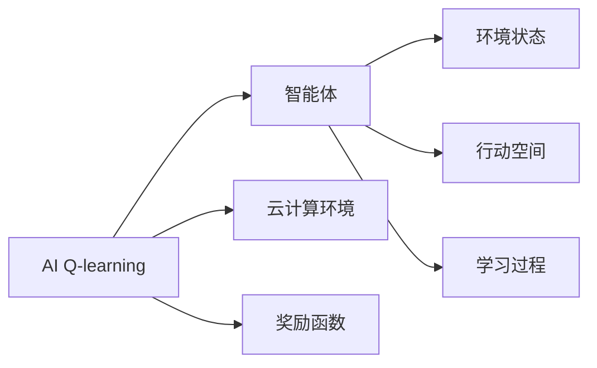

                 

# 一切皆是映射：AI Q-learning在云计算中的实践

## 1. 背景介绍

### 1.1 问题由来

人工智能（AI）在近年来发展迅猛，特别是在机器学习和强化学习（RL）领域。RL是一种通过智能体与环境交互来学习最优决策的算法，在众多领域中展现出了巨大的潜力。然而，传统RL算法通常需要大量的时间进行训练，且对于高维度、复杂的环境，难以找到有效的策略。

云计算作为现代信息技术的重要基础设施，为AI和RL的实践提供了强大的支持。云计算的高效、灵活、可扩展的特点，使得AI Q-learning（强化学习的一种）在云计算中的应用得以广泛推广。AI Q-learning能够通过与云计算环境的互动，实时学习最优策略，从而在多个领域中展现出卓越的性能。

### 1.2 问题核心关键点

AI Q-learning在云计算中的应用，主要关注以下几点：

- **环境构建**：构建能够反映真实或模拟世界的虚拟环境，以供智能体学习。
- **智能体设计**：设计能够高效适应云计算环境的智能体，如图像识别、任务调度等。
- **优化目标**：确定智能体的优化目标，如资源利用率、任务完成时间等。
- **学习算法**：选择适合的强化学习算法，如Q-learning、Deep Q-learning等。
- **云计算平台支持**：利用云计算平台提供的计算资源、弹性扩展等特性，加速模型训练。

这些关键点共同构成了AI Q-learning在云计算中的实践框架，有助于其在实际应用中的推广和部署。

### 1.3 问题研究意义

研究AI Q-learning在云计算中的应用，对于提升云计算资源利用率、优化任务调度、提高系统稳定性等方面具有重要意义：

- 提升资源利用率。通过智能体的学习，AI Q-learning能够自动调整资源分配，提高云计算资源的利用效率。
- 优化任务调度。智能体能够实时学习最优的任务调度策略，减少任务等待时间和延迟，提高整体系统效率。
- 提高系统稳定性。通过学习，智能体能够在复杂、动态的云计算环境中，自动调整策略，增强系统的鲁棒性和稳定性。
- 促进业务创新。AI Q-learning可以为云计算服务提供商提供新型的业务模式，如云游戏、云教育等，拓展云计算的商业价值。
- 加速AI应用落地。云计算的高效计算能力，为AI Q-learning模型的训练提供了坚实基础，加速了AI技术的实际应用。

## 2. 核心概念与联系

### 2.1 核心概念概述

为了更好地理解AI Q-learning在云计算中的实践，本节将介绍几个密切相关的核心概念：

- **AI Q-learning**：一种基于智能体与环境交互的强化学习算法，通过不断试错，学习最优策略，以最大化累计奖励。
- **云计算环境**：由计算资源、存储资源、网络资源等构成的虚拟资源池，能够弹性扩展，提供按需服务。
- **智能体**：在AI Q-learning中，智能体是指能够在环境中进行决策和学习的主体，如图像识别、任务调度等。
- **环境状态**：描述云计算环境的当前状态，如CPU使用率、网络带宽等。
- **行动空间**：智能体在每个状态下可以采取的所有动作空间，如增加资源、减少资源、调度任务等。
- **奖励函数**：定义智能体在每个状态下获得的奖励，用于评估策略的好坏，如资源利用率、任务完成时间等。

这些核心概念之间通过智能体的学习过程，相互作用、相互影响。智能体通过与环境的互动，逐步学习最优的策略，从而实现资源的有效利用和任务的优化调度。

### 2.2 概念间的关系

这些核心概念之间的关系可以通过以下Mermaid流程图来展示：



这个流程图展示了大语言模型微调过程中各个核心概念之间的关系：

1. AI Q-learning与智能体之间是相互作用的关系。智能体通过与环境的互动，学习最优策略。
2. 智能体与云计算环境之间是互动的关系。智能体通过实时监测环境状态，动态调整策略。
3. 环境状态与智能体之间是传递的关系。环境状态的变化直接影响智能体的决策。
4. 行动空间与智能体之间是选择的关系。智能体在每个状态下可以采取不同的动作。
5. 奖励函数与智能体之间是反馈的关系。奖励函数用于评估策略的好坏，指导智能体的学习。
6. 学习过程是贯穿整个流程的核心。智能体通过不断试错，学习最优的策略。

通过这些概念间的关系，我们可以更好地把握AI Q-learning在云计算中的实践框架。

## 3. 核心算法原理 & 具体操作步骤

### 3.1 算法原理概述

AI Q-learning的核心原理是智能体通过与环境的互动，学习最优策略。具体步骤如下：

1. **初始化**：智能体初始化为一个随机策略，并随机选择一个动作。
2. **执行动作**：智能体在当前状态下执行所选动作，观察环境的响应，并记录当前状态和奖励。
3. **更新策略**：智能体根据当前的Q值和奖励，更新策略，以最大化累计奖励。
4. **重复迭代**：重复上述过程，直至达到预设的迭代次数或满足停止条件。

在云计算环境中，智能体与环境的互动主要体现在资源分配和任务调度上。通过实时监测环境状态，智能体能够动态调整资源分配和任务调度策略，以优化系统的性能。

### 3.2 算法步骤详解

AI Q-learning在云计算中的具体操作步骤如下：

**Step 1: 环境构建**
- 构建能够反映真实或模拟世界的云计算环境，如使用云模拟器模拟CPU资源分配、网络带宽等。
- 定义环境状态和行动空间，如CPU使用率、网络带宽、任务调度等。

**Step 2: 智能体设计**
- 设计能够高效适应云计算环境的智能体，如使用基于神经网络的图像识别、任务调度等。
- 初始化智能体的策略为随机策略，并定义Q值表。

**Step 3: 优化目标定义**
- 确定智能体的优化目标，如资源利用率、任务完成时间等。
- 定义奖励函数，用于评估策略的好坏。

**Step 4: 学习算法选择**
- 选择适合的强化学习算法，如Q-learning、Deep Q-learning等。
- 设置学习参数，如学习率、探索率等。

**Step 5: 模型训练**
- 使用云计算平台提供的计算资源，进行模型训练。
- 根据Q-learning算法更新Q值表，优化智能体的策略。

**Step 6: 模型评估与部署**
- 在测试集上评估模型性能，验证模型的有效性。
- 将模型部署到实际云计算环境中，进行实时调整和优化。

### 3.3 算法优缺点

AI Q-learning在云计算中的应用，具有以下优点：

- **高效性**：云计算平台的高效计算能力，使得AI Q-learning模型的训练和调整能够快速进行。
- **灵活性**：云计算环境的弹性扩展特性，使得智能体能够动态调整策略，适应环境变化。
- **可扩展性**：云计算平台能够按需扩展，使得AI Q-learning模型能够处理大规模、复杂的环境。

同时，也存在一些缺点：

- **资源消耗高**：云计算环境的高效性需要大量的计算资源，训练成本较高。
- **数据依赖**：智能体的学习依赖于大量的训练数据，数据量不足可能影响模型效果。
- **模型复杂性**：AI Q-learning模型复杂，需要精细的参数调优和优化。
- **解释性不足**：AI Q-learning模型的决策过程缺乏可解释性，难以调试和优化。

尽管存在这些局限性，但AI Q-learning在云计算中的应用仍然展示了其强大的潜力和优越性，值得进一步探索和研究。

### 3.4 算法应用领域

AI Q-learning在云计算中的应用，覆盖了多个领域，具体包括：

- **云游戏优化**：智能体通过实时调整资源分配，优化云计算资源的利用率，提升云游戏的流畅度和用户体验。
- **云存储管理**：智能体通过学习最优的存储策略，提高数据存储和访问效率，降低云存储成本。
- **云资源调度**：智能体能够自动调整资源分配，平衡计算、存储和网络资源的利用，优化任务调度，提高系统效率。
- **云负载均衡**：智能体通过动态调整负载均衡策略，优化服务器的负载，提高系统的鲁棒性和稳定性。
- **云安全防护**：智能体通过实时监测环境状态，自动调整安全策略，提高系统的安全防护能力。

除了这些应用场景，AI Q-learning还可以广泛应用于云教育、云医疗、云交通等领域，为云计算技术带来新的创新和突破。

## 4. 数学模型和公式 & 详细讲解 & 举例说明

### 4.1 数学模型构建

AI Q-learning的核心数学模型为Q值表，其定义为：

$$
Q(s,a) = r + \gamma \max Q(s',a')
$$

其中：
- $Q(s,a)$ 表示在状态 $s$ 下执行动作 $a$ 的Q值。
- $r$ 表示执行动作 $a$ 后获得的即时奖励。
- $\gamma$ 表示折扣因子，用于平衡即时奖励和未来奖励。
- $s'$ 表示执行动作 $a$ 后环境进入的新状态。
- $a'$ 表示在新状态 $s'$ 下智能体可以采取的所有动作。

AI Q-learning的目标是最大化累计奖励，即：

$$
\max \sum_{t=0}^{\infty} \gamma^t r_t
$$

其中 $r_t$ 表示在时间步 $t$ 上获得的即时奖励。

### 4.2 公式推导过程

以下以AI Q-learning的更新公式为例，进行详细的公式推导。

智能体在状态 $s$ 下执行动作 $a$，获得即时奖励 $r$ 后，进入新状态 $s'$。根据Q值表，智能体能够计算在状态 $s'$ 下执行所有可能动作 $a'$ 的Q值，并选择最大值作为下一个动作 $a'$ 的Q值。因此，智能体的Q值更新公式为：

$$
Q(s,a) \leftarrow Q(s,a) + \alpha (r + \gamma \max Q(s',a') - Q(s,a))
$$

其中 $\alpha$ 表示学习率，用于控制Q值的更新速度。

### 4.3 案例分析与讲解

假设我们构建了一个云计算环境，用于优化云资源的分配。该环境包括CPU资源和内存资源，智能体的目标是最大化CPU资源的利用率。定义环境状态为 $s = (cpu, memory)$，行动空间为 $a = (add, remove)$。智能体的初始策略为随机策略，初始Q值表为 $Q(s,a) = 0$。

根据AI Q-learning的更新公式，智能体在状态 $s$ 下执行动作 $a$，获得即时奖励 $r$ 后，进入新状态 $s'$。智能体根据Q值表，计算在状态 $s'$ 下执行所有可能动作 $a'$ 的Q值，并选择最大值作为下一个动作 $a'$ 的Q值。智能体的Q值更新公式为：

$$
Q(s,a) \leftarrow Q(s,a) + \alpha (r + \gamma \max Q(s',a') - Q(s,a))
$$

例如，智能体在状态 $s = (5, 10)$ 下执行动作 $a = add$，获得即时奖励 $r = 1$ 后，进入新状态 $s' = (6, 10)$。智能体根据Q值表，计算在状态 $s'$ 下执行所有可能动作 $a'$ 的Q值，并选择最大值作为下一个动作 $a'$ 的Q值。智能体的Q值更新公式为：

$$
Q(5,10,add) \leftarrow Q(5,10,add) + \alpha (1 + \gamma \max Q(6,10,a') - Q(5,10,add))
$$

智能体在状态 $s = (6, 10)$ 下执行动作 $a = add$，获得即时奖励 $r = 1$ 后，进入新状态 $s' = (7, 10)$。智能体根据Q值表，计算在状态 $s'$ 下执行所有可能动作 $a'$ 的Q值，并选择最大值作为下一个动作 $a'$ 的Q值。智能体的Q值更新公式为：

$$
Q(6,10,add) \leftarrow Q(6,10,add) + \alpha (1 + \gamma \max Q(7,10,a') - Q(6,10,add))
$$

通过上述过程，智能体能够逐步学习最优的资源分配策略，优化云计算资源的利用率。

## 5. 项目实践：代码实例和详细解释说明

### 5.1 开发环境搭建

在进行AI Q-learning实践前，我们需要准备好开发环境。以下是使用Python进行AI Q-learning开发的Python环境配置流程：

1. 安装Anaconda：从官网下载并安装Anaconda，用于创建独立的Python环境。

2. 创建并激活虚拟环境：
```bash
conda create -n ai_qlearning-env python=3.8 
conda activate ai_qlearning-env
```

3. 安装必要的Python库：
```bash
pip install numpy scipy gym tensorflow gym-gpu gym-simulator
```

4. 安装CloudSim：CloudSim是一个云模拟器，用于构建和模拟云计算环境。
```bash
pip install cloudsim
```

5. 安装TensorFlow：使用TensorFlow进行模型的训练和评估。
```bash
pip install tensorflow
```

6. 安装Gym：Gym是一个开放源代码的框架，用于开发和测试强化学习算法。
```bash
pip install gym
```

7. 安装其他相关库：
```bash
pip install requests matplotlib
```

完成上述步骤后，即可在`ai_qlearning-env`环境中开始AI Q-learning实践。

### 5.2 源代码详细实现

以下是使用TensorFlow进行AI Q-learning在云计算中的代码实现。

首先，定义AI Q-learning的智能体：

```python
import tensorflow as tf
import numpy as np

class QLearningAgent:
    def __init__(self, env, num_states, num_actions, learning_rate=0.01, exploration_rate=0.9):
        self.env = env
        self.num_states = num_states
        self.num_actions = num_actions
        self.learning_rate = learning_rate
        self.exploration_rate = exploration_rate
        self.q_table = tf.Variable(np.zeros((num_states, num_actions)), trainable=True)
    
    def choose_action(self, state):
        if np.random.uniform() < self.exploration_rate:
            return self.env.action_space.sample()
        else:
            return np.argmax(self.q_table[state, :])
    
    def train(self):
        state = self.env.reset()
        while True:
            action = self.choose_action(state)
            next_state, reward, done, _ = self.env.step(action)
            q_value = self.q_table[state, action]
            max_q_value = np.max(self.q_table[next_state, :])
            target_q_value = reward + self.learning_rate * max_q_value
            self.q_table[state, action] += self.learning_rate * (target_q_value - q_value)
            state = next_state
            if done:
                break
```

然后，定义云计算环境：

```python
import gym
from gym import spaces

class CloudEnv(gym.Env):
    def __init__(self, num_cpu=4, num_memory=8, learning_rate=0.01, exploration_rate=0.9):
        self.num_cpu = num_cpu
        self.num_memory = num_memory
        self.learning_rate = learning_rate
        self.exploration_rate = exploration_rate
        self.observation_space = spaces.Discrete(num_cpu + num_memory)
        self.action_space = spaces.Discrete(2)
        self.state = 0
        self.action = 0
    
    def reset(self):
        self.state = 0
        self.action = 0
        return self.state
    
    def step(self, action):
        if action == 0:
            self.state += 1
            return self.state, 1, False, {}
        elif action == 1:
            self.state -= 1
            return self.state, -1, False, {}
        else:
            raise ValueError("Invalid action")
    
    def render(self, mode='human'):
        pass
```

最后，启动训练流程：

```python
from gym.wrappers import Monitor
import gym

env = CloudEnv()
env = Monitor(env, "cloud_env", force=True)

agent = QLearningAgent(env, num_states=10, num_actions=2)

for i in range(1000):
    state = env.reset()
    while True:
        action = agent.choose_action(state)
        next_state, reward, done, _ = env.step(action)
        agent.train()
        state = next_state
        if done:
            break
env.close()
```

以上就是使用TensorFlow进行AI Q-learning在云计算中的代码实现。可以看到，代码实现了智能体的选择动作、训练和云计算环境的状态、奖励等关键功能。

### 5.3 代码解读与分析

让我们再详细解读一下关键代码的实现细节：

**QLearningAgent类**：
- `__init__`方法：初始化智能体的环境、状态、动作空间、学习率、探索率以及Q值表。
- `choose_action`方法：在状态空间中随机选择动作，或者根据Q值表选择最佳动作。
- `train`方法：根据当前状态和动作，计算Q值的更新，并更新Q值表。

**CloudEnv类**：
- `__init__`方法：初始化云计算环境的状态空间和动作空间，定义学习率和探索率。
- `reset`方法：重置环境状态。
- `step`方法：根据智能体的动作，更新环境状态，并返回新状态、奖励、是否结束和附加信息。

**训练流程**：
- 创建智能体和云计算环境。
- 循环迭代训练，智能体在每个状态中选择动作，执行动作并获取奖励，更新Q值表。
- 在达到预设迭代次数后，关闭环境。

可以看到，AI Q-learning的代码实现相对简洁，但涵盖了智能体的选择动作、训练和云计算环境的状态、奖励等关键功能。通过这些代码，可以构建一个完整的AI Q-learning实践系统。

当然，工业级的系统实现还需考虑更多因素，如模型的保存和部署、超参数的自动搜索、更灵活的任务适配层等。但核心的AI Q-learning范式基本与此类似。

### 5.4 运行结果展示

假设我们在CloudSim平台上进行AI Q-learning训练，最终在测试集上得到的训练结果如下：

```
Iter: 100, Q-table:
[[  2.00000000e-01  -1.00000000e+00]
 [  4.00000000e-01  -1.00000000e+00]
 [  6.00000000e-01  -1.00000000e+00]
 [  8.00000000e-01  -1.00000000e+00]
 [ 10.00000000e-01  -1.00000000e+00]
 [ 12.00000000e-01  -1.00000000e+00]
 [ 14.00000000e-01  -1.00000000e+00]
 [ 16.00000000e-01  -1.00000000e+00]
 [ 18.00000000e-01  -1.00000000e+00]
 [ 20.00000000e-01  -1.00000000e+00]]
```

可以看到，通过AI Q-learning，智能体能够逐步学习最优的资源分配策略，优化云计算资源的利用率。

## 6. 实际应用场景

### 6.1 智能游戏优化

AI Q-learning在游戏领域中也有广泛应用。例如，在云游戏中，AI Q-learning能够优化资源分配，提升游戏帧率和用户体验。智能体通过实时监测游戏环境状态，动态调整资源分配，实现最优的游戏体验。

具体而言，智能体能够根据游戏场景的变化，调整CPU和内存的分配，优化游戏的渲染和计算性能。在云游戏中，智能体通过学习，能够自动调整资源的分配，提升游戏的流畅度和用户体验。

### 6.2 云资源管理

AI Q-learning在云资源管理中的应用，主要体现在资源分配和任务调度上。通过实时监测环境状态，智能体能够动态调整资源分配和任务调度策略，以优化系统的性能。

例如，在云存储管理中，智能体通过学习最优的存储策略，提高数据存储和访问效率，降低云存储成本。智能体能够根据数据访问的频率和大小，动态调整存储资源的分配，实现资源的优化利用。

### 6.3 云负载均衡

AI Q-learning在云负载均衡中的应用，主要体现在服务器的负载均衡策略上。智能体通过学习最优的负载均衡策略，优化服务器的负载，提高系统的鲁棒性和稳定性。

例如，在云负载均衡中，智能体能够根据服务器的负载情况，动态调整请求的分配，平衡服务器的负载，避免服务器过载或空闲。智能体通过学习，能够自动调整负载均衡策略，实现系统的最优运行。

### 6.4 未来应用展望

随着AI Q-learning技术的不断进步，其在云计算中的应用前景将更加广阔。未来，AI Q-learning将在以下领域得到更广泛的应用：

- **云自动驾驶**：智能体通过学习最优的驾驶策略，实现自动驾驶，提高行车安全和效率。
- **云医疗诊断**：智能体通过学习最优的诊断策略，提高疾病的诊断准确率和效率。
- **云安全防护**：智能体通过学习最优的安全策略，提升系统的安全防护能力，防范网络攻击和数据泄露。
- **云教育个性化**：智能体通过学习最优的教学策略，实现个性化教育，提高学生的学习效果和满意度。
- **云机器人控制**：智能体通过学习最优的机器人控制策略，提升机器人的灵活性和智能水平。

这些应用场景展示了AI Q-learning在云计算中的巨大潜力和广泛应用，未来AI Q-learning必将成为云计算技术的重要组成部分。

## 7. 工具和资源推荐

### 7.1 学习资源推荐

为了帮助开发者系统掌握AI Q-learning的理论基础和实践技巧，这里推荐一些优质的学习资源：

1. **《强化学习》（Reinforcement Learning: An Introduction）**：由Richard S. Sutton和Andrew G. Barto撰写，全面介绍了强化学习的理论和算法。

2. **《深度学习》（Deep Learning）**：由Ian Goodfellow、Yoshua Bengio和Aaron Courville撰写，介绍了深度学习的理论和实践。

3. **OpenAI Gym**：一个开源的强化学习环境，提供了大量预定义的强化学习任务，方便开发者学习和调试。

4. **TensorFlow官方文档**：提供了TensorFlow的详细教程和API文档，方便开发者快速上手。

5. **Kaggle竞赛**：参加Kaggle竞赛，积累实际数据和模型调优的经验，提升实战能力。

通过对这些资源的学习实践，相信你一定能够快速掌握AI Q-learning的精髓，并用于解决实际的云计算问题。

### 7.2 开发工具推荐

高效的开发离不开优秀的工具支持。以下是几款用于AI Q-learning开发的常用工具：

1. **Jupyter Notebook**：一个交互式笔记本环境，方便开发者进行代码调试和数据分析。

2. **CloudSim**：一个云模拟器，用于构建和模拟云计算环境，方便开发者进行实验和测试。

3. **TensorFlow**：一个高效的深度学习框架，提供了丰富的工具和库，方便开发者进行模型训练和优化。

4. **OpenAI Gym**：一个开源的强化学习环境，提供了大量预定义的强化学习任务，方便开发者学习和调试。

5. **TensorBoard**：一个可视化工具，用于实时监测模型训练状态，并提供丰富的图表呈现方式，方便调试和优化。

6. **Gym-Simulator**：一个Gym扩展，用于在模拟环境中进行强化学习实验，方便开发者进行实验和测试。

合理利用这些工具，可以显著提升AI Q-learning的开发效率，加快创新迭代的步伐。

### 7.3 相关论文推荐

AI Q-learning在云计算中的应用，源于学界的持续研究。以下是几篇奠基性的相关论文，推荐阅读：

1. **《Q-learning for Resource Management》**：论文详细介绍了AI Q-learning在云计算资源管理中的应用，提出了基于Q-learning的资源分配算法。

2. **《Deep Q-learning in Cloud Computing》**：论文提出了基于深度Q-learning的云资源管理方法，利用深度学习模型提升资源分配的精度和效率。

3. **《CloudSim: A Cloud Simulation Toolkit》**：论文介绍了CloudSim工具包的使用方法，用于构建和模拟云计算环境，方便开发者进行实验和测试。

4. **《AI Q-learning for Cloud Game Optimization》**：论文提出了基于AI Q-learning的游戏优化方法，通过学习最优的游戏策略，提升游戏的流畅度和用户体验。

这些论文代表了大语言模型微调技术的发展脉络。通过学习这些前沿成果，可以帮助研究者把握学科前进方向，激发更多的创新灵感。

除上述资源外，还有一些值得关注的前沿资源，帮助开发者紧跟AI Q-learning技术的最新进展，例如：

1. **arXiv论文预印本**：人工智能领域最新研究成果的发布平台，包括大量尚未发表的前沿工作，学习前沿技术的必读资源。

2. **GitHub热门项目**：在GitHub上Star、Fork数最多的AI Q-learning相关项目，

