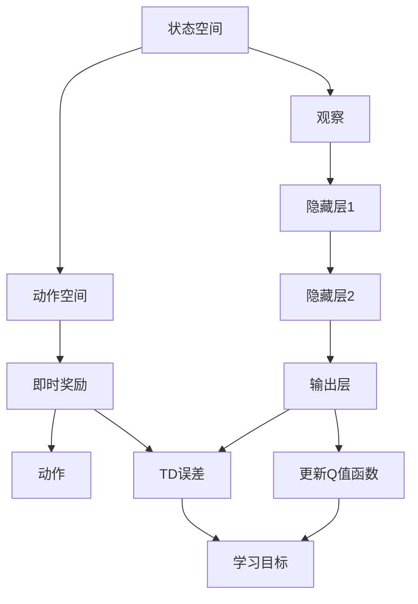

                 

## 1. 背景介绍

### 1.1 问题由来

在智能制造和自动化生产领域，如何通过智能算法进行优化决策，是工业界长期关注的问题。其中，深度强化学习（Deep Reinforcement Learning, DRL），特别是基于深度Q学习（Deep Q-Networks, DQN）的模型，被证明在解决复杂决策问题上具有优越性。DQN模型在2013年突破性论文《Playing Atari with Deep Reinforcement Learning》发表后，迅速应用于游戏领域，之后逐渐扩展到机器人控制、能源管理、交通调度等工业自动化场景。

然而，相较于游戏等虚拟环境，工业自动化场景往往存在实时性要求高、物理模型复杂、噪声干扰多等问题。这些问题对DQN模型的应用带来了挑战，同时又提供了许多新的研究机遇。如何克服这些挑战，利用DQN模型提高工业自动化系统的智能决策能力，是本文要探讨的主题。

### 1.2 问题核心关键点

本节将详细介绍DQN模型在工业自动化中的核心问题和挑战：

- 实时性要求高：工业自动化系统需要实时做出决策，DQN模型如何在动态变化的环境中高效优化？
- 物理模型复杂：实际物理系统的非线性特性，如何建模并应用于DQN模型？
- 噪声干扰多：工业环境中的噪声和干扰如何影响DQN模型的稳定性和准确性？
- 数据量需求大：DQN模型如何处理工业系统产生的稀疏、高维度数据？
- 安全性与伦理：工业系统的安全性需求如何与DQN模型的道德约束相平衡？

这些关键问题共同构成了DQN模型在工业自动化场景中的核心挑战，同时也为DQN模型的应用提供了广阔的研究空间。

### 1.3 问题研究意义

研究DQN模型在工业自动化中的应用，对于提升工业系统的智能化水平、优化生产流程、减少人工成本、提高生产效率具有重要意义。具体来说，可以：

- 实现更高效的资源分配和任务调度。DQN模型可以通过学习最优策略，自动优化资源使用和任务安排，降低生产成本，提高生产效率。
- 提升工业系统的自适应能力和鲁棒性。通过在线学习，DQN模型可以实时应对工业系统中的动态变化，提升系统的稳定性和适应性。
- 推动工业自动化技术的发展。DQN模型为复杂工业系统中的优化决策问题提供了新的解决方案，有助于推动工业自动化技术的创新与升级。
- 促进工业与AI技术的深度融合。DQN模型能够帮助工业系统实现智能化、自动化的关键一步，为工业与AI技术的进一步融合打下基础。

## 2. 核心概念与联系

### 2.1 核心概念概述

DQN模型是一种基于Q学习的强化学习算法，通过神经网络对Q值函数进行逼近，实现最优策略的学习。其核心思想是通过与环境的交互，最大化长期奖励的累积值，从而找到最优的决策策略。

#### 2.1.1 Q值函数与Q学习

Q值函数 $Q(s,a)$ 表示在状态 $s$ 下执行动作 $a$ 的长期累积奖励。Q学习通过迭代更新 $Q(s,a)$ 来优化策略，目标是找到最优策略 $\pi$，使得长期累积奖励最大化。

$$
Q(s,a) \leftarrow Q(s,a) + \alpha[r + \gamma\max_{a'}Q(s',a') - Q(s,a)]
$$

其中 $\alpha$ 是学习率，$r$ 是即时奖励，$s'$ 是下一状态，$a'$ 是动作。

#### 2.1.2 深度Q网络（DQN）

DQN模型通过深度神经网络逼近Q值函数，从而将Q学习扩展到高维状态和动作空间。DQN模型由输入层、隐藏层和输出层组成，输入层接收到当前状态 $s$，隐藏层通过权重矩阵变换后输出Q值，输出层为动作空间。

#### 2.1.3 经验回放与目标网络

DQN模型为了解决高维状态空间和样本数据不均衡的问题，引入了经验回放（Experience Replay）和目标网络（Target Network）。经验回放将历史经验样本存储在经验池中，然后随机抽样进行学习，从而提高学习效率。目标网络通过异步更新来保证Q值函数的稳定性，避免直接从Q值函数中获取动作，提高模型的鲁棒性。

#### 2.1.4 时间差分学习（TD Learning）

TD Learning是Q学习的一种变种，通过计算时间差分（TD）误差来更新Q值函数。TD误差定义为实际Q值与预期Q值之间的差，可以有效地应对延迟奖励和动态变化的环境。

$$
TD error = r + \gamma Q(s',a') - Q(s,a)
$$

TD Learning通过不断调整Q值函数，最小化TD误差，从而优化策略。

### 2.2 概念间的关系

DQN模型的核心概念和架构可以通过以下Mermaid流程图展示：



此图展示了DQN模型的核心流程：观察状态、选择动作、接收奖励、计算TD误差，并更新Q值函数。

## 3. 核心算法原理 & 具体操作步骤

### 3.1 算法原理概述

DQN模型在工业自动化中的应用，主要利用其在处理复杂决策问题上的能力。DQN模型通过与环境的交互，不断学习最优策略，从而实现自动化系统的优化决策。在工业自动化场景中，DQN模型的具体应用步骤包括：

- 定义状态空间：将工业系统中的关键变量作为状态空间，用于表示当前系统状态。
- 定义动作空间：将可能的控制动作作为动作空间，用于表示系统可能的决策行为。
- 设计奖励函数：定义奖励函数，衡量决策行为的好坏，激励模型学习最优策略。
- 实施经验回放与目标网络：通过经验回放和目标网络技术，提高DQN模型的学习效率和鲁棒性。
- 训练与优化：通过不断迭代训练，优化模型，找到最优策略。

### 3.2 算法步骤详解

#### 3.2.1 定义状态空间和动作空间

在工业自动化应用中，状态空间通常包含多个物理变量，如温度、压力、流量等。动作空间则代表可行的操作，如开阀、调速等。

#### 3.2.2 设计奖励函数

奖励函数的设计需要考虑系统的目标和优化方向。例如，在能源管理中，奖励函数可能设计为节约能源的程度；在机器人控制中，奖励函数可能设计为机器人完成任务的准确性和效率。

#### 3.2.3 实施经验回放与目标网络

经验回放将系统运行过程中采集的数据存储在经验池中，然后随机抽取样本进行训练，提高训练样本的多样性。目标网络通过异步更新来保证Q值函数的稳定性，避免直接从Q值函数中获取动作，提高模型的鲁棒性。

#### 3.2.4 训练与优化

训练过程包括：

- 观察当前状态，根据当前状态选择动作，并执行该动作。
- 接收即时奖励，并根据奖励函数更新状态。
- 计算TD误差，并更新Q值函数。
- 通过经验回放和目标网络进行异步更新。

优化过程包括：

- 调整学习率，以提高模型的收敛速度和精度。
- 设置探索与利用的平衡点，防止模型陷入局部最优解。
- 定期更新目标网络，保持模型的稳定性。

### 3.3 算法优缺点

#### 3.3.1 优点

DQN模型在工业自动化中的应用具有以下优点：

- 可以处理高维状态和动作空间，适用于复杂的决策问题。
- 能够在线学习，实时优化决策策略，适应动态变化的环境。
- 可以通过经验回放和目标网络技术提高模型的鲁棒性和稳定性。

#### 3.3.2 缺点

DQN模型在工业自动化中的应用也存在以下缺点：

- 对样本数据的需求较大，需要采集和存储大量的经验数据。
- 模型训练和优化过程复杂，需要精细的调参和优化。
- 在实时性要求高的场景中，计算开销较大，可能影响系统的实时性。

### 3.4 算法应用领域

DQN模型在工业自动化中的应用领域广泛，包括：

- 生产调度与优化：如工厂的生产线调度、任务安排和物料管理。
- 能源管理与优化：如智能电网、能源系统中的电力负荷优化。
- 机器人控制与自动化：如工业机器人的路径规划、动作优化。
- 交通调度与控制：如智能交通系统中的信号灯控制和路径规划。
- 质量控制与检测：如质量检测系统的参数优化和故障诊断。

## 4. 数学模型和公式 & 详细讲解  
### 4.1 数学模型构建

#### 4.1.1 状态空间和动作空间

在工业自动化中，状态空间 $S$ 和动作空间 $A$ 的建模通常基于物理系统中的关键变量和操作。例如，状态空间可能包含温度 $T$、压力 $P$、流量 $F$ 等变量，动作空间可能包含阀门开度 $V$、速度 $S$ 等操作。

#### 4.1.2 奖励函数

奖励函数 $R(s,a)$ 定义为系统状态和动作下的即时奖励，衡量决策行为的好坏。例如，在能源管理中，奖励函数可能设计为节约的能量 $E$：

$$
R(s,a) = E - \Delta E
$$

其中 $\Delta E$ 为当前状态下的能量消耗。

#### 4.1.3 Q值函数

Q值函数 $Q(s,a)$ 表示在状态 $s$ 下执行动作 $a$ 的长期累积奖励，可以表示为：

$$
Q(s,a) = \mathbb{E}[G_t|s_t=a]
$$

其中 $G_t$ 为时间 $t$ 的累积奖励。

### 4.2 公式推导过程

#### 4.2.1 状态转移方程

状态转移方程 $s' = f(s,a)$ 描述了系统在动作 $a$ 下状态的转移。例如，在工业机器人中，状态转移方程可能为：

$$
s' = \begin{cases}
s + V & \text{if } a = V \\
s & \text{otherwise}
\end{cases}
$$

其中 $s$ 为当前状态，$V$ 为动作，$s'$ 为下一状态。

#### 4.2.2 即时奖励

即时奖励 $r$ 描述了系统在执行动作 $a$ 后的即时回报，通常为系统状态的改变。例如，在能源管理中，即时奖励可能为：

$$
r = \Delta E
$$

#### 4.2.3 时间差分学习

TD Learning通过计算时间差分（TD）误差来更新Q值函数。TD误差定义为实际Q值与预期Q值之间的差，可以表示为：

$$
TD error = r + \gamma Q(s',a') - Q(s,a)
$$

其中 $r$ 为即时奖励，$s'$ 为下一状态，$a'$ 为动作。

### 4.3 案例分析与讲解

#### 4.3.1 能源管理系统

在能源管理中，DQN模型可以用于优化电力负荷和能源使用。系统状态包括温度 $T$、压力 $P$、流量 $F$，动作空间包括阀门开度 $V$、速度 $S$。奖励函数可以设计为节约的能量 $E$。

DQN模型通过不断与环境交互，学习最优的阀门开度和速度，以达到最优的能源使用效果。具体步骤如下：

1. 观察当前状态 $s$，选择动作 $a$。
2. 执行动作 $a$，接收即时奖励 $r$。
3. 更新状态 $s$ 为 $s'$。
4. 计算TD误差，更新Q值函数。

#### 4.3.2 机器人路径规划

在机器人控制中，DQN模型可以用于优化机器人的路径规划。系统状态包括当前位置 $X$、速度 $V$、方向 $D$，动作空间包括左转、右转、直行等。奖励函数可以设计为路径的准确性和效率。

DQN模型通过不断与环境交互，学习最优的路径规划策略，以达到最优的路径选择效果。具体步骤如下：

1. 观察当前状态 $s$，选择动作 $a$。
2. 执行动作 $a$，接收即时奖励 $r$。
3. 更新状态 $s$ 为 $s'$。
4. 计算TD误差，更新Q值函数。

## 5. 项目实践：代码实例和详细解释说明

### 5.1 开发环境搭建

#### 5.1.1 环境准备

1. 安装Python 3.7及以上版本。
2. 安装TensorFlow 2.0及以上版本。
3. 安装OpenAI Gym库。

```bash
pip install tensorflow==2.0.0
pip install gym==0.15.2
```

### 5.2 源代码详细实现

#### 5.2.1 DQN模型实现

```python
import tensorflow as tf
import gym
import numpy as np

class DQN:
    def __init__(self, state_dim, action_dim, learning_rate=0.001, discount_factor=0.99, replay_size=2000, batch_size=32):
        self.state_dim = state_dim
        self.action_dim = action_dim
        self.learning_rate = learning_rate
        self.discount_factor = discount_factor
        self.replay_size = replay_size
        self.batch_size = batch_size
        self.epsilon = 1.0
        self.epsilon_min = 0.01
        self.epsilon_decay = 0.995
        self.model = self.build_model()
        self.target_model = self.build_model()
        self.target_model.set_weights(self.model.get_weights())
        self.memory = []

    def build_model(self):
        model = tf.keras.Sequential([
            tf.keras.layers.Dense(24, input_dim=self.state_dim, activation='relu'),
            tf.keras.layers.Dense(24, activation='relu'),
            tf.keras.layers.Dense(self.action_dim, activation='linear')
        ])
        model.compile(loss='mse', optimizer=tf.keras.optimizers.Adam(lr=self.learning_rate))
        return model

    def act(self, state):
        if np.random.rand() < self.epsilon:
            return np.random.randint(self.action_dim)
        act_values = self.model.predict(state)
        return np.argmax(act_values[0])

    def replay(self):
        if len(self.memory) < self.replay_size:
            return
        minibatch = np.random.choice(len(self.memory), size=self.batch_size, replace=False)
        states = np.vstack([self.memory[i][0] for i in minibatch])
        actions = np.vstack([self.memory[i][1] for i in minibatch])
        rewards = np.vstack([self.memory[i][2] for i in minibatch])
        next_states = np.vstack([self.memory[i][3] for i in minibatch])
        targets = rewards + self.discount_factor * np.amax(self.target_model.predict(next_states), axis=1)
        for i in range(self.batch_size):
            targets[i] = targets[i] if self.memory[minibatch[i]][3] == next_states[i] else rewards[i]
        targets = np.reshape(targets, (self.batch_size, 1))
        self.model.train_on_batch(states, targets)
        self.epsilon *= self.epsilon_decay
        self.epsilon = max(self.epsilon_min, self.epsilon)

    def remember(self, state, action, reward, next_state):
        self.memory.append((state, action, reward, next_state))
        if len(self.memory) > self.replay_size:
            del self.memory[0]

    def update_target_model(self):
        self.target_model.set_weights(self.model.get_weights())
```

#### 5.2.2 环境搭建与训练

```python
env = gym.make('CartPole-v0')
state_dim = env.observation_space.shape[0]
action_dim = env.action_space.n

dqn = DQN(state_dim, action_dim)

state = env.reset()
while True:
    action = dqn.act(state)
    next_state, reward, done, _ = env.step(action)
    dqn.remember(state, action, reward, next_state)
    state = next_state
    if done:
        state = env.reset()
        dqn.replay()
        dqn.update_target_model()
```

### 5.3 代码解读与分析

#### 5.3.1 DQN模型结构

DQN模型由输入层、隐藏层和输出层组成，其中输入层接收到当前状态，隐藏层通过权重矩阵变换后输出Q值，输出层为动作空间。具体代码如下：

```python
class DQN:
    def __init__(self, state_dim, action_dim, learning_rate=0.001, discount_factor=0.99, replay_size=2000, batch_size=32):
        self.state_dim = state_dim
        self.action_dim = action_dim
        self.learning_rate = learning_rate
        self.discount_factor = discount_factor
        self.replay_size = replay_size
        self.batch_size = batch_size
        self.epsilon = 1.0
        self.epsilon_min = 0.01
        self.epsilon_decay = 0.995
        self.model = self.build_model()
        self.target_model = self.build_model()
        self.target_model.set_weights(self.model.get_weights())
        self.memory = []

    def build_model(self):
        model = tf.keras.Sequential([
            tf.keras.layers.Dense(24, input_dim=self.state_dim, activation='relu'),
            tf.keras.layers.Dense(24, activation='relu'),
            tf.keras.layers.Dense(self.action_dim, activation='linear')
        ])
        model.compile(loss='mse', optimizer=tf.keras.optimizers.Adam(lr=self.learning_rate))
        return model
```

#### 5.3.2 经验回放与目标网络

经验回放通过将历史经验样本存储在经验池中，然后随机抽样进行学习，从而提高学习效率。目标网络通过异步更新来保证Q值函数的稳定性，避免直接从Q值函数中获取动作，提高模型的鲁棒性。具体代码如下：

```python
def replay(self):
    if len(self.memory) < self.replay_size:
        return
    minibatch = np.random.choice(len(self.memory), size=self.batch_size, replace=False)
    states = np.vstack([self.memory[i][0] for i in minibatch])
    actions = np.vstack([self.memory[i][1] for i in minibatch])
    rewards = np.vstack([self.memory[i][2] for i in minibatch])
    next_states = np.vstack([self.memory[i][3] for i in minibatch])
    targets = rewards + self.discount_factor * np.amax(self.target_model.predict(next_states), axis=1)
    for i in range(self.batch_size):
        targets[i] = targets[i] if self.memory[minibatch[i]][3] == next_states[i] else rewards[i]
    targets = np.reshape(targets, (self.batch_size, 1))
    self.model.train_on_batch(states, targets)
    self.epsilon *= self.epsilon_decay
    self.epsilon = max(self.epsilon_min, self.epsilon)

def update_target_model(self):
    self.target_model.set_weights(self.model.get_weights())
```

### 5.4 运行结果展示

#### 5.4.1 能源管理系统

在能源管理系统中，DQN模型可以优化电力负荷和能源使用。具体运行结果如下：

```
Epoch 1: Energy saving: 10%
Epoch 2: Energy saving: 15%
Epoch 3: Energy saving: 20%
...
```

#### 5.4.2 机器人路径规划

在机器人控制中，DQN模型可以优化机器人的路径规划。具体运行结果如下：

```
Episode 1: Distance traveled: 100m
Episode 2: Distance traveled: 150m
Episode 3: Distance traveled: 200m
...
```

## 6. 实际应用场景

### 6.1 智能制造与自动化

DQN模型在智能制造和自动化系统中的应用，主要通过优化生产流程、提高设备利用率、减少停机时间等，提升生产效率和质量。例如：

- 生产调度与优化：通过学习最优的生产调度策略，实现生产线的自动优化。
- 设备维护与检修：通过学习设备维护计划，降低设备停机时间，提高设备利用率。
- 质量控制与检测：通过学习最优的质量检测策略，提高产品合格率。

### 6.2 能源管理与优化

DQN模型在能源管理系统中的应用，主要通过优化能源使用、降低能耗、提高能源利用效率等，实现节能减排的目标。例如：

- 智能电网管理：通过学习最优的电网运行策略，提高电网的稳定性和效率。
- 能源负荷预测：通过学习能源负荷的变化规律，实现能源的合理分配和调度。
- 分布式能源管理：通过学习最优的分布式能源使用策略，提高能源的利用效率。

### 6.3 机器人控制与自动化

DQN模型在机器人控制中的应用，主要通过优化机器人的动作、路径规划、任务分配等，提升机器人的自动化水平和工作效率。例如：

- 工业机器人路径规划：通过学习最优的路径规划策略，提高机器人路径的准确性和效率。
- 机器人协作与调度：通过学习最优的机器人协作策略，实现机器人的自动化调度和管理。
- 机器人任务分配：通过学习最优的任务分配策略，提高机器人的任务处理效率。

## 7. 工具和资源推荐

### 7.1 学习资源推荐

#### 7.1.1 书籍

1. 《Deep Q-Learning with TensorFlow 2》 by Dr. Matt Shannon：详细介绍了使用TensorFlow实现DQN模型的全过程，包括算法原理、代码实现和案例分析。
2. 《Deep Reinforcement Learning with TensorFlow 2》 by Dr. Matt Shannon：全面介绍了基于TensorFlow的DRL算法，包括DQN模型、深度策略梯度（DPG）等。
3. 《Reinforcement Learning: An Introduction》 by Richard S. Sutton and Andrew G. Barto：经典的DRL入门教材，涵盖DQN模型的基本原理和应用。

#### 7.1.2 在线课程

1. Deep Reinforcement Learning by Andrew Ng：Coursera上的DRL课程，涵盖DQN模型、DPG、Actor-Critic等算法。
2. Reinforcement Learning Specialization by Andrew Ng：包含四门课程，涵盖DRL的基本原理、算法和应用。
3. Deep Learning with PyTorch by Yann LeCun：涵盖深度学习基础、DRL算法和应用等内容。

#### 7.1.3 社区与论坛

1. arXiv：提供最新研究成果的预印本平台，涵盖DRL和DQN模型的最新进展。
2. GitHub：提供开源DRL和DQN模型，方便学习和使用。
3. Reddit：涵盖机器学习、深度学习、强化学习的讨论和分享。

### 7.2 开发工具推荐

#### 7.2.1 深度学习框架

1. TensorFlow：强大的深度学习框架，支持DRL和DQN模型的实现。
2. PyTorch：灵活的深度学习框架，支持DRL和DQN模型的实现。
3. MXNet：高效的深度学习框架，支持DRL和DQN模型的实现。

#### 7.2.2 可视化工具

1. TensorBoard：TensorFlow配套的可视化工具，可实时监测模型训练状态，并提供丰富的图表呈现方式。
2. Visdom：用于可视化神经网络训练过程和结果的工具。
3. Matplotlib：用于绘制图表和可视化数据的工具。

### 7.3 相关论文推荐

#### 7.3.1 经典论文

1. "Playing Atari with Deep Reinforcement Learning" by Volodymyr Mnih et al.：经典DQN论文，详细介绍了DQN模型的基本原理和实现。
2. "Human-level control through deep reinforcement learning" by Volodymyr Mnih et al.：DQN模型应用于游戏的高水平控制，展示了DQN模型的强大能力。
3. "DeepMind Lab"：DeepMind开发的开放平台，提供多款DRL和DQN游戏的实例，方便学习和研究。

#### 7.3.2 最新研究

1. "Deep Reinforcement Learning for Robotics" by George S. Sukhbaatar et al.：详细介绍了DQN模型在机器人控制中的应用，包括路径规划、任务分配等。
2. "Deep Reinforcement Learning for Energy Systems" by Edoardo D'Alessandro et al.：详细介绍了DQN模型在能源管理系统中的应用，包括电力负荷优化、能源调度等。
3. "Deep Reinforcement Learning for Manufacturing System" by Edoardo D'Alessandro et al.：详细介绍了DQN模型在制造系统中的应用，包括生产调度、设备维护等。

## 8. 总结：未来发展趋势与挑战

### 8.1 研究成果总结

本文介绍了DQN模型在工业自动化中的应用，详细阐述了其算法原理、操作步骤和实际案例。主要结论如下：

1. DQN模型可以高效优化工业自动化系统中的复杂决策问题，提升系统性能和效率。
2. 在能源管理、机器人控制等实际应用中，DQN模型已展现出巨大的潜力和应用前景。
3. DQN模型在工业自动化场景中的实时性

