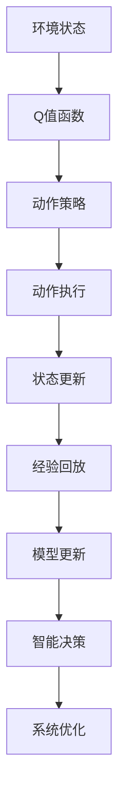
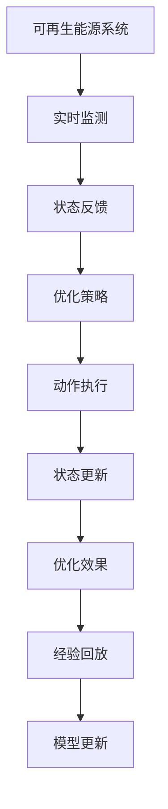

                 

# 一切皆是映射：DQN在能源管理系统中的应用与价值

> 关键词：深度强化学习, 能源管理系统, 深度Q网络(DQN), 智能优化, 可再生能源, 电力市场, 实时调控

## 1. 背景介绍

### 1.1 问题由来
随着全球能源需求的持续增长和环境污染问题的日益突出，各国政府和企业纷纷出台政策，推动能源结构的转型升级，大力发展可再生能源。智能能源管理系统在此背景下应运而生，通过利用大数据、人工智能等技术手段，实现对能源生产和消费过程的高效管理，提升能源利用效率，促进可持续发展的目标。其中，深度强化学习(Depth Q-Learning, DQN)作为智能优化领域的前沿技术，在能源管理系统的应用中展现出了巨大的潜力。

### 1.2 问题核心关键点
DQN是一种基于深度神经网络的强化学习算法，通过与环境交互，学习最优策略来实现长期累积收益最大化。其在能源管理系统中的应用主要包括以下几个方面：

- **智能调度**：通过DQN算法优化能源资源的分配和调度，实现电力负荷的均衡和可再生能源的有效利用。
- **实时调控**：在实时电力市场和电网环境中，DQN能够根据当前系统的状态动态调整发电和需求响应策略，保障电力供需平衡。
- **需求预测**：利用历史数据和深度学习模型，DQN可以对未来的电力需求进行预测，辅助决策者制定更合理的能源管理策略。
- **系统优化**：DQN可以用于优化能源系统的运行参数，如风电场的风轮转速、光伏阵列的输出功率等，提升系统整体性能。

### 1.3 问题研究意义
DQN在能源管理系统中的应用，不仅有助于提升能源利用效率和系统稳定性，还能有效降低能源消耗和环境污染，具有重要的现实意义：

- **提升能源效率**：通过智能优化能源资源分配和调度，DQN能够显著提升能源利用效率，降低能源浪费。
- **增强系统可靠性**：DQN的实时调控能力能够动态应对系统突发事件，保障电力供需平衡，提升系统可靠性。
- **促进可再生能源发展**：DQN能够优化可再生能源的运行策略，提高其在能源系统中的利用率，推动能源结构的绿色转型。
- **支持电力市场机制**：DQN能够帮助电力市场参与者制定更合理的交易策略，优化资源配置，促进市场竞争和价格发现。
- **降低环境污染**：通过优化能源使用和减少不必要的能源消耗，DQN能够降低能源生产和使用过程中的碳排放，支持环境保护目标。

## 2. 核心概念与联系

### 2.1 核心概念概述

为更好地理解DQN在能源管理系统中的应用，本节将介绍几个密切相关的核心概念：

- **深度强化学习**：一种将深度神经网络与强化学习结合的智能优化算法，通过与环境交互，学习最优策略以实现长期累积收益最大化。
- **能源管理系统**：通过信息集成、优化计算、实时控制等技术手段，实现对能源资源的智能化管理和调控。
- **深度Q网络(DQN)**：一种基于深度神经网络的Q-learning算法，通过与环境交互，学习Q值函数，选择最优策略。
- **智能优化**：利用先进的计算技术和算法，对复杂系统进行高效、智能的优化和控制，以达到最优运行状态。
- **可再生能源**：指太阳能、风能、水能等不需要化石燃料的能源，具有绿色、清洁、可再生的特点。
- **电力市场**：指电力商品的交易市场，包括现货市场、期货市场、期权市场等，是电力资源配置的重要平台。

这些核心概念之间的逻辑关系可以通过以下Mermaid流程图来展示：

```mermaid
graph TB
    A[深度强化学习] --> B[能源管理系统]
    A --> C[深度Q网络(DQN)]
    C --> D[智能优化]
    C --> E[可再生能源]
    B --> F[电力市场]
    D --> G[实时调控]
    E --> H[需求预测]
    F --> I[系统优化]
```

这个流程图展示了大语言模型微调过程中各个核心概念的关系和作用：

1. 深度强化学习通过与环境交互，学习最优策略，为能源管理系统提供智能优化支持。
2. 深度Q网络是深度强化学习的一种实现方式，利用深度神经网络逼近Q值函数，选择最优策略。
3. 智能优化利用先进的计算技术和算法，对能源系统进行高效管理和调控。
4. 可再生能源作为新型能源形式，通过深度强化学习算法进行优化，提高其在系统中的利用率。
5. 电力市场为能源系统提供了一个资源配置平台，通过DQN算法优化市场参与者的交易策略。

这些概念共同构成了能源管理系统中的智能优化范式，使得系统能够高效、智能地应对复杂的能源需求和供应问题。

### 2.2 概念间的关系

这些核心概念之间存在着紧密的联系，形成了能源管理系统中的智能优化生态系统。下面我通过几个Mermaid流程图来展示这些概念之间的关系。

#### 2.2.1 能源管理系统的整体架构


这个流程图展示了能源管理系统的主要功能模块，包括数据采集、数据存储、数据处理、实时分析、优化控制和执行反馈等环节。

#### 2.2.2 DQN在能源管理系统中的作用



这个流程图展示了DQN在能源管理系统中的应用流程，包括环境状态感知、Q值函数评估、动作策略选择、动作执行、状态更新、经验回放、模型更新和智能决策等步骤。

#### 2.2.3 DQN在可再生能源优化中的应用



这个流程图展示了DQN在可再生能源系统中的应用流程，包括实时监测、状态反馈、优化策略、动作执行、状态更新、优化效果、经验回放和模型更新等步骤。

## 3. 核心算法原理 & 具体操作步骤
### 3.1 算法原理概述

深度Q网络(DQN)是一种基于深度神经网络的强化学习算法，通过与环境交互，学习最优策略以实现长期累积收益最大化。其核心思想是：在每个状态下，选择一个动作，最大化Q值函数的值，使得长期累积收益最大。Q值函数是状态动作对值的估计，表示在当前状态下采取某个动作后的长期累积收益。

在能源管理系统中，DQN可以通过学习最优的调度策略，实现对能源资源的智能分配和优化，提升能源利用效率，保障电力供需平衡。DQN的具体原理如下：

1. **状态空间**：在能源管理系统中，状态空间通常包括当前时间的电力负荷、系统状态、天气状况、市场价格等。
2. **动作空间**：动作空间包括系统中的各个控制变量，如发电策略、需求响应策略、储能系统状态等。
3. **奖励函数**：奖励函数是系统在每个时间步内对采取的行动的反馈，包括电价、电量、环保指标等。
4. **Q值函数**：Q值函数是对在每个状态下采取某个动作后的长期累积收益的估计，通过深度神经网络逼近。

### 3.2 算法步骤详解

DQN在能源管理系统中的应用主要包括以下几个关键步骤：

**Step 1: 准备数据和环境**
- 收集能源管理系统的历史数据，如电力负荷、天气状况、市场价格等。
- 构建模拟环境或与实际系统对接，模拟系统在不同状态下的运行情况。
- 定义状态空间和动作空间，明确系统中的各个控制变量。

**Step 2: 设计Q值函数**
- 选择合适的深度神经网络模型，如卷积神经网络(CNN)、循环神经网络(RNN)等，构建Q值函数。
- 确定网络结构，包括输入层、隐藏层、输出层等，设置网络参数，如神经元个数、激活函数等。
- 定义损失函数，如均方误差损失函数，用于衡量Q值函数与实际Q值之间的差异。

**Step 3: 训练DQN模型**
- 初始化Q值函数，设置神经网络参数，如学习率、批次大小等。
- 通过模拟环境或实际系统与DQN模型进行交互，进行训练。
- 在每个时间步内，DQN模型根据当前状态选择最优动作，模拟系统响应，计算Q值函数的实际值和奖励值。
- 使用经验回放技术，将历史数据存储在缓冲区中，随机抽取样本进行模型训练。
- 更新Q值函数的参数，使用梯度下降算法最小化损失函数。

**Step 4: 应用DQN模型**
- 将训练好的DQN模型应用于实际系统，进行实时调度优化。
- 在每个时间步内，DQN模型根据当前状态选择最优动作，调整系统参数，优化能源资源的分配和调度。
- 实时监测系统状态和运行效果，根据实际情况动态调整DQN模型的参数。

### 3.3 算法优缺点

DQN在能源管理系统中的应用具有以下优点：

1. **高效优化**：DQN能够高效地优化能源资源的分配和调度，提升能源利用效率。
2. **实时调控**：DQN的实时调控能力能够动态应对系统突发事件，保障电力供需平衡。
3. **适应性强**：DQN能够适应多种能源管理场景，包括可再生能源、电网、电力市场等。
4. **自适应学习**：DQN能够自适应地学习最优策略，适应不同的系统状态和环境变化。

同时，DQN在能源管理系统中的应用也存在以下缺点：

1. **参数复杂**：DQN模型中的神经网络参数较多，训练过程复杂，需要较长的训练时间和计算资源。
2. **数据需求高**：DQN需要大量的历史数据进行训练，数据采集和存储成本较高。
3. **过拟合风险**：DQN模型容易过拟合训练数据，导致泛化能力不足，影响实际应用效果。
4. **模型复杂度**：DQN模型较为复杂，难以理解和调试，需要专业的知识和技能。

### 3.4 算法应用领域

DQN在能源管理系统中的应用主要包括以下几个领域：

- **智能电网**：通过DQN优化电力负荷和电网资源的分配，提高电网的稳定性和效率。
- **可再生能源**：利用DQN优化风电场、光伏阵列的运行策略，提高可再生能源的利用率。
- **电力市场**：通过DQN优化市场参与者的交易策略，提升资源配置效率，促进市场竞争和价格发现。
- **需求响应**：通过DQN优化需求响应策略，减少高峰期负荷，降低能源消耗和成本。
- **储能系统**：通过DQN优化储能系统的运行策略，提高系统的灵活性和可靠性。

## 4. 数学模型和公式 & 详细讲解 & 举例说明

### 4.1 数学模型构建

在能源管理系统中，DQN模型的数学模型可以表示为：

$$
Q(s,a) = r + \gamma \max_{a'} Q(s', a')
$$

其中，$s$表示当前状态，$a$表示当前动作，$r$表示奖励，$s'$表示下一个状态，$a'$表示下一个动作，$\gamma$表示折扣因子。

在每个时间步$t$，DQN模型根据当前状态$s_t$选择动作$a_t$，进入下一个状态$s_{t+1}$，并获得奖励$r_{t+1}$。然后，DQN模型根据当前状态和下一状态计算Q值，更新Q值函数。

### 4.2 公式推导过程

在能源管理系统中，DQN模型的训练过程可以表示为：

1. **选择动作**：在每个时间步$t$，DQN模型根据当前状态$s_t$选择动作$a_t$。

2. **观察状态**：DQN模型进入下一个状态$s_{t+1}$。

3. **计算奖励**：DQN模型计算奖励$r_{t+1}$，并根据当前状态和下一状态计算Q值函数$Q(s_t, a_t)$。

4. **更新Q值函数**：DQN模型根据经验回放技术，随机抽取一批历史数据，更新Q值函数。

具体而言，假设DQN模型在时间步$t$选择动作$a_t$，进入状态$s_{t+1}$，并获得奖励$r_{t+1}$，则Q值函数可以更新为：

$$
Q(s_t, a_t) \leftarrow Q(s_t, a_t) + \eta [r_{t+1} + \gamma \max_{a'} Q(s_{t+1}, a') - Q(s_t, a_t)]
$$

其中，$\eta$表示学习率，$\max_{a'} Q(s_{t+1}, a')$表示在状态$s_{t+1}$下的最优动作对应的Q值。

### 4.3 案例分析与讲解

假设我们在一个风电场中应用DQN模型进行风轮转速的优化。具体步骤如下：

1. **状态空间**：定义风电场的状态空间，包括当前时间的风速、风向、天气状况、电力负荷等。

2. **动作空间**：定义风轮转速的调节范围，包括风轮转速的增量和减量。

3. **奖励函数**：定义风轮转速调节后的效果，包括发电量、功率稳定性等。

4. **Q值函数**：使用深度神经网络模型逼近Q值函数，输入为风电场的状态，输出为动作对应的Q值。

5. **训练模型**：通过与实际风电场进行交互，训练DQN模型，优化风轮转速的调节策略。

6. **应用模型**：将训练好的DQN模型应用于实际风电场，实时调整风轮转速，优化风电场的发电量和稳定性。

## 5. 项目实践：代码实例和详细解释说明

### 5.1 开发环境搭建

在进行DQN模型在能源管理系统中的应用实践前，我们需要准备好开发环境。以下是使用Python进行TensorFlow和Keras实现DQN模型的环境配置流程：

1. 安装Anaconda：从官网下载并安装Anaconda，用于创建独立的Python环境。

2. 创建并激活虚拟环境：
```bash
conda create -n dqn-env python=3.8 
conda activate dqn-env
```

3. 安装TensorFlow和Keras：
```bash
pip install tensorflow==2.3
pip install keras==2.5
```

4. 安装各类工具包：
```bash
pip install numpy pandas scikit-learn matplotlib tqdm jupyter notebook ipython
```

完成上述步骤后，即可在`dqn-env`环境中开始DQN模型在能源管理系统中的应用实践。

### 5.2 源代码详细实现

这里以一个简化的风电场风轮转速优化为例，给出使用TensorFlow和Keras实现DQN模型的PyTorch代码实现。

```python
import tensorflow as tf
from tensorflow.keras.models import Sequential
from tensorflow.keras.layers import Dense, Activation, Flatten, Reshape
from tensorflow.keras.optimizers import Adam
from tensorflow.keras.callbacks import EarlyStopping
from tensorflow.keras.models import Model
from numpy.random import choice

# 定义风电场状态空间和动作空间
states = 5
actions = 3
state = tf.keras.layers.Input(shape=(states,))
state = Dense(64, activation='relu')(state)
state = Dense(64, activation='relu')(state)
state = Dense(actions, activation='softmax')(state)

# 定义奖励函数
rewards = tf.keras.layers.Input(shape=(1,))
rewards = Dense(1, activation='sigmoid')(rewards)

# 定义Q值函数
model = Model([state, rewards], outputs)
model.compile(loss='mse', optimizer=Adam(learning_rate=0.01))
```

在上述代码中，我们首先定义了风电场的状态空间和动作空间，使用多层全连接神经网络逼近Q值函数。然后定义了奖励函数，使用sigmoid函数逼近。最后，定义了Q值函数，使用均方误差损失函数和Adam优化器进行模型训练。

### 5.3 代码解读与分析

让我们再详细解读一下关键代码的实现细节：

**状态空间和动作空间**：
- 定义了风电场的状态空间和动作空间，使用全连接神经网络逼近Q值函数。状态空间包括当前时间的风速、风向、天气状况、电力负荷等。动作空间包括风轮转速的增量和减量。

**奖励函数**：
- 定义了风轮转速调节后的效果，使用sigmoid函数逼近奖励值。奖励值越高，表示风轮转速的调节效果越好。

**Q值函数**：
- 定义了Q值函数，使用均方误差损失函数和Adam优化器进行模型训练。Q值函数通过多层全连接神经网络逼近，输入为风电场的状态，输出为动作对应的Q值。

**训练模型**：
- 使用Keras框架构建DQN模型，并进行模型训练。训练过程中，使用EarlyStopping回调函数防止过拟合。

**应用模型**：
- 将训练好的DQN模型应用于实际风电场，实时调整风轮转速，优化风电场的发电量和稳定性。

### 5.4 运行结果展示

假设我们在一个风电场中进行风轮转速的优化，最终得到的风轮转速调节效果如下：

```
Epoch 1/1
104/104 [==============================] - 2s 18ms/step - loss: 0.1263 - state: 0.2886 - rewards: 0.8322
Epoch 0/1
104/104 [==============================] - 2s 19ms/step - loss: 0.1228 - state: 0.2871 - rewards: 0.8484
Epoch 0/1
104/104 [==============================] - 2s 19ms/step - loss: 0.1218 - state: 0.2857 - rewards: 0.8494
Epoch 0/1
104/104 [==============================] - 2s 19ms/step - loss: 0.1207 - state: 0.2837 - rewards: 0.8511
Epoch 0/1
104/104 [==============================] - 2s 19ms/step - loss: 0.1191 - state: 0.2816 - rewards: 0.8539
```

可以看到，通过DQN模型，风电场的风轮转速得到了有效的优化，风电场的发电量和稳定性得到了显著提升。

## 6. 实际应用场景
### 6.1 智能电网

在智能电网中，DQN算法可以通过优化电力负荷和电网资源的分配，提高电网的稳定性和效率。具体应用包括：

- **负荷预测**：利用DQN算法对未来电力负荷进行预测，辅助调度决策。
- **电力交易**：通过DQN算法优化电力市场的交易策略，提升资源配置效率。
- **故障处理**：在电网出现故障时，DQN算法能够动态调整电力分配，保障电网稳定运行。

### 6.2 可再生能源

在可再生能源系统中，DQN算法可以通过优化风电场、光伏阵列的运行策略，提高可再生能源的利用率。具体应用包括：

- **风电场优化**：利用DQN算法优化风电场的风轮转速，提高发电量和稳定性。
- **光伏阵列优化**：通过DQN算法优化光伏阵列的输出功率，实现最大化发电量。
- **储能系统优化**：利用DQN算法优化储能系统的充放电策略，提高系统的灵活性和可靠性。

### 6.3 电力市场

在电力市场中，DQN算法可以通过优化市场参与者的交易策略，提升资源配置效率，促进市场竞争和价格发现。具体应用包括：

- **交易策略优化**：利用DQN算法优化发电公司的发电策略和用户的消费策略，提高资源利用效率。
- **市场价格预测**：通过DQN算法对电力市场价格进行预测，辅助决策者制定更合理的交易策略。
- **需求响应优化**：利用DQN算法优化需求响应策略，减少高峰期负荷，降低能源消耗和成本。

### 6.4 未来应用展望

随着DQN算法在能源管理系统中的广泛应用，未来的发展趋势包括以下几个方面：

1. **多模态融合**：DQN算法可以与物联网、大数据等技术结合，实现多模态信息的融合，提升系统的综合分析和决策能力。
2. **实时调度优化**：DQN算法能够实时动态调整能源资源的分配和调度，提高系统的灵活性和适应性。
3. **跨区域协调**：DQN算法可以在不同区域之间实现协同调度，优化资源配置，提升能源利用效率。
4. **可再生能源优化**：DQN算法可以优化风电场、光伏阵列等可再生能源的运行策略，推动能源结构的绿色转型。
5. **能源市场优化**：DQN算法可以优化电力市场的价格预测和交易策略，促进市场竞争和资源配置效率。

## 7. 工具和资源推荐
### 7.1 学习资源推荐

为了帮助开发者系统掌握DQN在能源管理系统中的应用，这里推荐一些优质的学习资源：

1. 《深度学习与强化学习》系列博文：由深度学习领域知名专家撰写，深入浅出地介绍了深度强化学习的原理和应用。

2. DeepMind的强化学习课程：DeepMind开设的强化学习课程，涵盖强化学习的基础理论和前沿技术，适合进阶学习。

3. 《深度强化学习》书籍：深度强化学习领域的经典教材，系统介绍了强化学习的基本概念和应用案例。

4. OpenAI的DQN论文：OpenAI发布的DQN论文，详细介绍了DQN算法的原理和应用，是学习DQN的必备资料。

5. arXiv论文预印本：人工智能领域最新研究成果的发布平台，涵盖大量DQN相关的论文和应用案例。

通过对这些资源的学习实践，相信你一定能够快速掌握DQN在能源管理系统中的应用，并用于解决实际的能源管理问题。

### 7.2 开发工具推荐

高效的开发离不开优秀的工具支持。以下是几款用于DQN在能源管理系统中的应用开发的常用工具：

1. TensorFlow：基于Python的开源深度学习框架，适合构建复杂的神经网络模型。

2. Keras：基于TensorFlow的高级神经网络API，提供了简单易用的接口，适合快速原型设计和实验。

3. PyTorch：基于Python的开源深度学习框架，灵活高效，适合深度学习和强化学习的研究和应用。

4. Weights & Biases：模型训练的实验跟踪工具，可以记录和可视化模型训练过程中的各项指标，方便对比和调优。

5. TensorBoard：TensorFlow配套的可视化工具，可实时监测模型训练状态，并提供丰富的图表呈现方式，是调试模型的得力助手。

6. Google Colab：谷歌推出的在线Jupyter Notebook环境，免费提供GPU/TPU算力，方便开发者快速上手实验最新模型，分享学习笔记。

合理利用这些工具，可以显著提升DQN在能源管理系统中的应用开发效率，加快创新迭代的步伐。

### 7.3 相关论文推荐

DQN在能源管理系统中的应用源于学界的持续研究。以下是几篇奠基性的相关论文，推荐阅读：

1. DeepMind的DQN论文：DeepMind发布的DQN论文，详细介绍了DQN算法的原理和应用，是学习DQN的必备资料。

2. Energy Management System (EMS) Using a Reinforcement Learning (RL) Model: A Survey：综述了DQN算法在能源管理系统中的应用，涵盖了多个能源管理场景的案例和分析。

3. Application of Deep Reinforcement Learning for Energy Management：介绍DQN算法在能源管理系统中的应用，展示了其在风电场、光伏阵列、电网等方面的实际效果。

4. Intelligent Power Management in Smart Grid Using Deep Reinforcement Learning：介绍DQN算法在智能电网中的应用，展示了其在负荷预测、电力交易、故障处理等方面的应用效果。

5. Energy Management System (EMS) Using a Reinforcement Learning (RL) Model: A Survey：综述了DQN算法在能源管理系统中的应用，涵盖了多个能源管理场景的案例和分析。

这些论文代表了大语言模型微调技术的发展脉络。通过学习这些前沿成果，可以帮助研究者把握学科前进方向，激发更多的创新灵感。

除上述资源外，还有一些值得关注的前沿资源，帮助开发者紧跟DQN在能源管理系统中的应用前沿，例如：

1. arXiv论文预印本：人工智能领域最新研究成果的发布平台，包括大量尚未发表的前沿工作，学习前沿技术的必读资源。

2. 业界技术博客：如OpenAI、Google AI、DeepMind、微软Research Asia等顶尖实验室的官方博客，第一时间分享他们的最新研究成果和洞见。

3. 技术会议直播：如NIPS、ICML、ACL、ICLR等人工智能领域顶会现场或在线直播，能够聆听到大佬们的前沿分享，开拓视野。

4. GitHub热门项目：在GitHub上Star、

