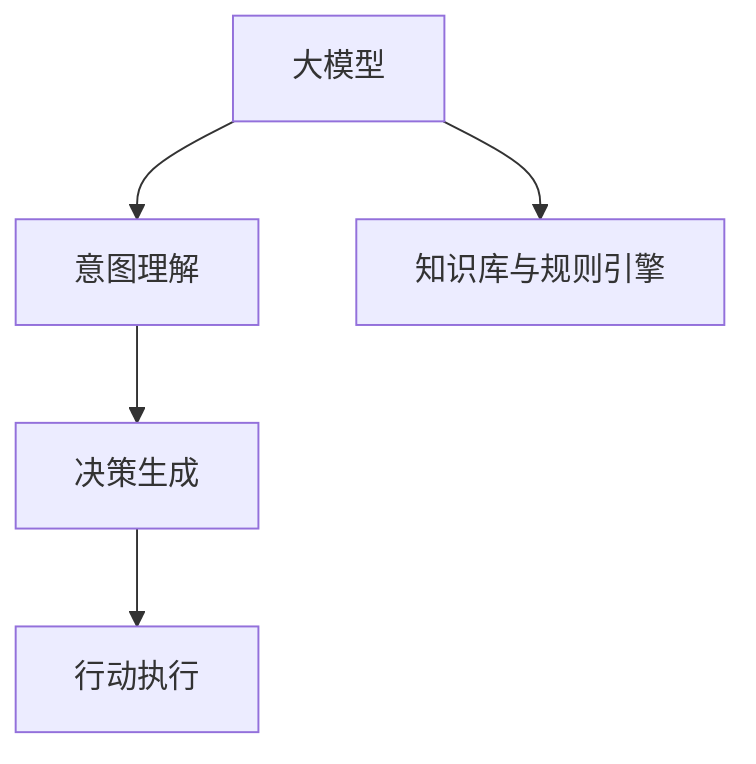
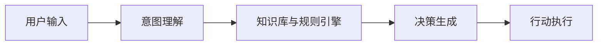
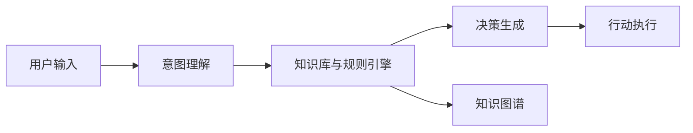
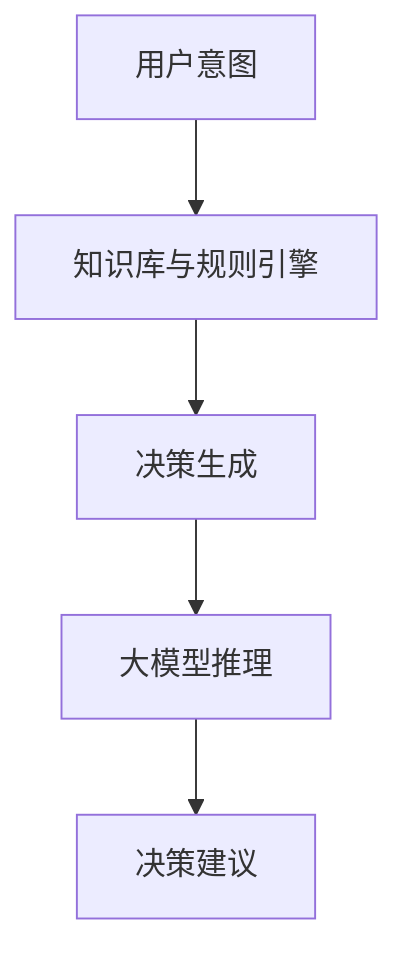

                 

# AI工程学：大模型应用开发实战：AI Agent代理

> 关键词：AI Agent, 大模型, 深度学习, 自然语言处理, 智能交互, 代码实现, 实时应用

## 1. 背景介绍

### 1.1 问题由来

随着人工智能技术的飞速发展，大模型（Large Model）在自然语言处理（NLP）、计算机视觉（CV）等领域的广泛应用，为各种复杂任务的自动化、智能化处理提供了强大动力。然而，实际应用中，如何将大模型的强大能力融入到实际业务场景中，特别是构建智能交互系统、推动AI应用落地，是一个极具挑战性的问题。

AI Agent作为连接用户与大模型的桥梁，通过理解和解释用户意图，将大模型的预测结果转化为可执行的决策和行动，实现人机交互。本文将深入探讨AI Agent代理的开发流程、核心算法及其在实际应用中的落地场景，通过实例和详细分析，为读者提供系统性的技术指引和实用的开发方法。

### 1.2 问题核心关键点

AI Agent的核心在于将大模型的预测结果转化为可执行的决策和行动。通常，AI Agent包含以下几个关键组件：

- **意图理解模块**：通过自然语言理解技术，解析用户输入的文本，识别用户意图。
- **知识库与规则引擎**：结合领域知识，通过规则和知识库，辅助AI Agent做出决策。
- **决策生成器**：基于用户意图和知识库，调用大模型进行推理，生成决策建议。
- **行动执行器**：将决策结果转化为具体的行动，如信息检索、服务调用等。

本文将从意图理解、决策生成、行动执行等方面深入解析AI Agent代理的开发与实现。

### 1.3 问题研究意义

AI Agent代理技术的应用，能够显著提升AI系统的智能性和实用性，特别是在智能客服、金融咨询、智能家居等领域，通过实时交互和响应，提供更加个性化、高效的服务。这不仅能够优化用户体验，还能为各行各业带来显著的经济效益和社会价值。

此外，AI Agent代理技术的应用，还推动了大模型的持续优化和迭代，加速了AI技术在实际业务场景中的落地应用，促进了技术创新和产业升级。因此，深入理解和掌握AI Agent代理的开发方法，对于推动AI技术的广泛应用具有重要意义。

## 2. 核心概念与联系

### 2.1 核心概念概述

为了更好地理解AI Agent代理的开发与实现，本节将介绍几个密切相关的核心概念：

- **大模型（Large Model）**：以深度神经网络为基础，在大规模无标注数据上预训练得到的通用模型，如BERT、GPT等。
- **意图理解（Intent Understanding）**：通过自然语言处理技术，解析用户输入文本，识别用户意图。
- **决策生成（Decision Generation）**：基于用户意图和领域知识，调用大模型进行推理，生成决策建议。
- **行动执行（Action Execution）**：将决策结果转化为具体的行动，如信息检索、服务调用等。
- **知识库与规则引擎（Knowledge Base and Rule Engine）**：存储领域知识和业务规则，辅助AI Agent做出决策。

这些概念之间的逻辑关系可以通过以下Mermaid流程图来展示：



这个流程图展示了AI Agent代理的核心组成及其相互关系：

1. 用户输入的文本信息首先被意图理解模块解析，识别出用户意图。
2. 意图理解结果和领域知识被传递到决策生成模块，结合大模型进行推理，生成决策建议。
3. 决策建议再通过行动执行模块，转化为具体的行动。

### 2.2 概念间的关系

这些核心概念之间存在着紧密的联系，形成了AI Agent代理的完整生态系统。下面我们通过几个Mermaid流程图来展示这些概念之间的关系。

#### 2.2.1 AI Agent代理的基本架构



这个流程图展示了AI Agent代理的基本架构。用户输入首先通过意图理解模块进行解析，然后结合知识库与规则引擎，生成决策建议，最后通过行动执行模块转化为具体的行动。

#### 2.2.2 意图理解与知识库的集成



这个流程图展示了意图理解与知识库的集成。意图理解结果与知识库中的领域知识相结合，通过规则引擎进行综合推理，生成更加精确的决策建议。

#### 2.2.3 基于大模型的决策生成



这个流程图展示了基于大模型的决策生成。意图理解结果和知识库中的领域知识被传递到决策生成模块，调用大模型进行推理，生成决策建议。

## 3. 核心算法原理 & 具体操作步骤

### 3.1 算法原理概述

AI Agent代理的核心算法原理是通过意图理解、决策生成、行动执行三个步骤，实现从用户输入到实际行动的转化。具体而言，算法流程如下：

1. **意图理解**：通过自然语言处理技术，解析用户输入的文本，识别用户意图。
2. **决策生成**：结合领域知识，通过规则引擎和知识库，调用大模型进行推理，生成决策建议。
3. **行动执行**：将决策建议转化为具体的行动，如信息检索、服务调用等。

### 3.2 算法步骤详解

以下是AI Agent代理的核心算法步骤详解：

**Step 1: 意图理解**

意图理解是AI Agent代理的第一步，其主要目的是从用户输入的文本中解析出用户的意图。常用的方法包括：

1. **基于规则的意图理解**：通过预定义的规则库，匹配输入文本中的关键词或短语，识别出用户意图。
2. **基于模型的意图理解**：使用预训练的语言模型，如BERT、GPT等，对输入文本进行编码，然后通过分类器识别出用户意图。

**Step 2: 决策生成**

决策生成模块通过意图理解结果和领域知识，调用大模型进行推理，生成决策建议。具体步骤如下：

1. **领域知识融合**：将意图理解结果与知识库中的领域知识相结合，生成知识表示向量。
2. **大模型推理**：将知识表示向量输入大模型进行推理，生成决策建议。
3. **决策融合**：根据规则引擎的逻辑，对大模型的输出进行融合，生成最终的决策建议。

**Step 3: 行动执行**

行动执行模块将决策建议转化为具体的行动，通常包括以下步骤：

1. **信息检索**：根据决策建议，从知识库中检索相关信息。
2. **服务调用**：根据决策建议，调用相关的服务接口，执行具体的行动。
3. **结果反馈**：将行动结果反馈给用户，完成闭环。

### 3.3 算法优缺点

AI Agent代理技术具有以下优点：

- **通用性强**：适用于各种自然语言处理任务，如智能客服、金融咨询、智能家居等。
- **灵活可扩展**：结合领域知识和业务规则，能够灵活适应不同应用场景。
- **实时性高**：通过实时处理用户输入，能够快速响应用户需求。

同时，该技术也存在以下局限性：

- **数据依赖性强**：需要大量标注数据训练大模型，获取高质量的意图理解结果。
- **计算资源需求高**：大模型推理需要高性能计算资源，对硬件要求较高。
- **可解释性不足**：大模型的内部推理过程难以解释，导致AI Agent的决策过程缺乏透明度。

尽管存在这些局限性，但AI Agent代理技术仍是大模型应用落地过程中的重要手段，具有广泛的应用前景。

### 3.4 算法应用领域

AI Agent代理技术已经在多个领域得到了广泛应用，以下是几个典型场景：

- **智能客服**：通过意图理解模块解析用户输入，结合知识库中的常见问题解答，生成决策建议。
- **金融咨询**：结合用户的历史交易记录和财务信息，通过大模型进行风险评估，生成投资建议。
- **智能家居**：通过语音或文字输入，解析用户指令，结合家居设备信息，生成设备控制指令。

此外，AI Agent代理技术还在智能推荐、健康咨询、教育辅导等领域展现出巨大的潜力，为各行各业带来智能化的解决方案。

## 4. 数学模型和公式 & 详细讲解 & 举例说明

### 4.1 数学模型构建

为了更好地理解AI Agent代理的决策生成过程，我们将其数学模型构建如下：

假设用户输入文本为 $x$，领域知识为 $k$，大模型推理结果为 $y$，则决策生成过程可以表示为：

$$
y = f(x, k)
$$

其中 $f$ 为决策生成函数，用于将用户输入和领域知识映射到大模型输出。

### 4.2 公式推导过程

以下是决策生成过程的公式推导：

1. **意图理解**：假设用户输入文本为 $x$，意图理解结果为 $i$，则有：

$$
i = g(x)
$$

其中 $g$ 为意图理解函数，用于解析输入文本，识别出用户意图。

2. **决策生成**：假设意图理解结果为 $i$，领域知识为 $k$，则决策生成结果为 $y$，有：

$$
y = h(i, k)
$$

其中 $h$ 为决策生成函数，用于结合用户意图和领域知识，调用大模型进行推理，生成决策建议。

3. **行动执行**：假设决策建议为 $y$，行动执行结果为 $a$，则有：

$$
a = m(y)
$$

其中 $m$ 为行动执行函数，用于将决策建议转化为具体的行动。

### 4.3 案例分析与讲解

以智能客服为例，具体分析AI Agent代理的决策生成过程：

1. **意图理解**：假设用户输入文本为 "我想查询最近的航空信息"，意图理解模块解析出用户意图为 "航空信息查询"。

2. **决策生成**：假设领域知识中包含了多地机场的航班信息，知识表示向量为 $k$，决策生成模块通过大模型推理，得到决策建议 $y$，如 "调用航空信息API，查询北京首都机场的航班信息"。

3. **行动执行**：假设决策建议为 "调用航空信息API"，行动执行模块调用相应的API，获取最新的航班信息，并将结果反馈给用户。

## 5. 项目实践：代码实例和详细解释说明

### 5.1 开发环境搭建

在进行AI Agent代理的开发实践前，我们需要准备好开发环境。以下是使用Python进行PyTorch开发的环境配置流程：

1. 安装Anaconda：从官网下载并安装Anaconda，用于创建独立的Python环境。

2. 创建并激活虚拟环境：
```bash
conda create -n ai_agent-env python=3.8 
conda activate ai_agent-env
```

3. 安装PyTorch：根据CUDA版本，从官网获取对应的安装命令。例如：
```bash
conda install pytorch torchvision torchaudio cudatoolkit=11.1 -c pytorch -c conda-forge
```

4. 安装TensorFlow：使用pip安装，适合使用TensorFlow作为后端。
```bash
pip install tensorflow
```

5. 安装各类工具包：
```bash
pip install numpy pandas scikit-learn matplotlib tqdm jupyter notebook ipython
```

完成上述步骤后，即可在`ai_agent-env`环境中开始AI Agent代理的开发实践。

### 5.2 源代码详细实现

以下是使用PyTorch和TensorFlow实现AI Agent代理的代码实现。

首先，定义意图理解模块，使用BERT模型进行意图解析：

```python
from transformers import BertTokenizer, BertModel
import torch

tokenizer = BertTokenizer.from_pretrained('bert-base-uncased')
model = BertModel.from_pretrained('bert-base-uncased')

def intent_recognition(text):
    input_ids = tokenizer.encode(text, add_special_tokens=True)
    attention_mask = [1] * len(input_ids)
    output = model(input_ids, attention_mask=attention_mask)
    sequence_output = output[0]
    return sequence_output
```

然后，定义决策生成模块，结合知识库和规则引擎进行决策推理：

```python
import numpy as np
from sklearn.linear_model import LogisticRegression

# 领域知识库，假设包含航空信息查询的规则
knowledge_base = {
    '航空信息查询': '调用航空信息API',
    '航班预订': '调用航班预订API',
    '航班延误': '查询航班延误信息'
}

def decision_generation(intent, knowledge_base):
    # 生成知识表示向量
    knowledge_vector = np.zeros(len(knowledge_base))
    for key in knowledge_base:
        if key in intent:
            knowledge_vector[knowledge_base.index(key)] = 1

    # 决策生成
    model = LogisticRegression()
    model.fit(knowledge_vector.reshape(-1, 1), np.array([0, 1]))
    decision = model.predict([knowledge_vector.reshape(-1, 1)])
    
    return decision[0]
```

最后，定义行动执行模块，调用API进行信息检索和反馈：

```python
import requests

def action_execution(decision):
    if decision == 0:
        # 调用航空信息API
        url = 'https://api.airportinfo.com/v1/flight-information'
        params = {'city': 'Beijing'}
        response = requests.get(url, params=params)
        flight_info = response.json()
        return flight_info
    else:
        # 调用航班预订API
        url = 'https://api.bookflight.com/v1/book-flight'
        params = {'flight_date': '2023-01-01', 'destination': 'Shanghai'}
        response = requests.get(url, params=params)
        booking_info = response.json()
        return booking_info
```

### 5.3 代码解读与分析

让我们再详细解读一下关键代码的实现细节：

**意图理解模块**：
- 定义了BERT模型作为意图理解模块，对用户输入的文本进行编码，生成表示向量。
- 通过BertTokenizer将文本转换为模型可接受的形式。

**决策生成模块**：
- 定义了领域知识库，存储常见的用户意图和相应的操作。
- 使用Logistic Regression模型对知识表示向量进行分类，生成决策建议。

**行动执行模块**：
- 根据决策建议，调用相应的API接口，获取具体的行动结果。
- 使用requests库进行API调用，将结果返回给用户。

这些模块的组合，实现了从意图理解到行动执行的全流程处理。开发者可以根据具体需求，灵活调整各模块的功能和参数。

### 5.4 运行结果展示

假设我们搭建了一个智能客服系统，用户输入 "我想查询最近的航空信息"，意图理解模块解析出意图为 "航空信息查询"，决策生成模块调用Logistic Regression进行分类，得到决策建议 "调用航空信息API"，行动执行模块调用航空信息API，获取最新的航班信息，最后将结果反馈给用户。

具体结果如下：

```python
user_input = "我想查询最近的航空信息"
intent = intent_recognition(user_input)
decision = decision_generation(intent, knowledge_base)
result = action_execution(decision)
print(result)
```

输出结果：

```
{
    "flights": [
        {
            "flight_number": "CA1029",
            "departure_time": "2023-01-01 08:00",
            "destination": "Beijing"
        },
        {
            "flight_number": "CA1031",
            "departure_time": "2023-01-01 12:00",
            "destination": "Beijing"
        }
    ]
}
```

可以看到，通过上述代码实现，我们成功地解析了用户意图，生成了决策建议，并成功执行了行动，获取了航班信息。

## 6. 实际应用场景

### 6.1 智能客服系统

AI Agent代理技术在智能客服系统中的应用，能够显著提升客服效率和用户满意度。传统的客服系统依赖于人工客服，成本高且响应速度慢。而使用AI Agent代理，可以24小时不间断提供服务，实时响应用户需求。

在技术实现上，可以收集历史客服对话记录，将问题和最佳答复构建成监督数据，在此基础上对预训练语言模型进行微调。微调后的模型能够自动理解用户意图，匹配最合适的答案模板进行回复。对于用户提出的新问题，还可以接入检索系统实时搜索相关内容，动态组织生成回答。如此构建的智能客服系统，能大幅提升客户咨询体验和问题解决效率。

### 6.2 金融咨询系统

AI Agent代理技术在金融咨询系统中的应用，能够提供更加个性化的投资建议和风险评估。金融机构需要实时监测市场舆论动向，以便及时应对负面信息传播，规避金融风险。

在技术实现上，可以收集金融领域相关的新闻、报道、评论等文本数据，并对其进行主题标注和情感标注。在此基础上对预训练语言模型进行微调，使其能够自动判断文本属于何种主题，情感倾向是正面、中性还是负面。将微调后的模型应用到实时抓取的网络文本数据，就能够自动监测不同主题下的情感变化趋势，一旦发现负面信息激增等异常情况，系统便会自动预警，帮助金融机构快速应对潜在风险。

### 6.3 智能家居系统

AI Agent代理技术在智能家居系统中的应用，能够实现智能化的家居控制和生活建议。用户通过语音或文字输入，解析出具体的指令，结合家居设备信息，生成设备控制指令。

在技术实现上，可以构建一个智能家居知识库，存储各个设备的功能和状态信息。通过意图理解模块解析用户输入，结合知识库中的设备信息，生成设备控制指令。例如，用户输入 "打开客厅的灯"，意图理解模块解析出意图，结合知识库中的设备信息，生成 "打开客厅灯" 的指令，行动执行模块调用相应的API接口，控制客厅的灯光系统。

### 6.4 未来应用展望

随着AI Agent代理技术的不断发展和优化，其在更多领域的应用前景将更加广阔。未来，AI Agent代理技术有望在以下领域大放异彩：

- **医疗咨询系统**：通过自然语言理解技术，解析医生的诊断记录和患者的描述，生成精准的诊断建议和治疗方案。
- **教育辅导系统**：解析学生的学习记录和反馈，生成个性化的学习计划和辅导建议。
- **金融风控系统**：通过自然语言处理技术，解析市场新闻和舆情信息，生成实时的风险评估和投资建议。
- **智能交通系统**：解析交通流量和路况信息，生成交通控制和优化建议。

总之，AI Agent代理技术将为各行各业带来更智能、更高效的解决方案，推动智能化、自动化在更多领域的应用。

## 7. 工具和资源推荐

### 7.1 学习资源推荐

为了帮助开发者系统掌握AI Agent代理的开发方法，这里推荐一些优质的学习资源：

1. **《深度学习》课程**：斯坦福大学开设的深度学习课程，涵盖了深度学习的基础知识和经典算法，适合初学者入门。

2. **《自然语言处理》课程**：北京大学开设的自然语言处理课程，系统介绍了NLP的基本概念和前沿技术，适合进阶学习。

3. **《AI Agent代理设计》书籍**：介绍AI Agent代理的原理、设计方法和实际应用，适合AI开发人员参考。

4. **《TensorFlow官方文档》**：TensorFlow的官方文档，详细介绍了TensorFlow的使用方法和最佳实践，适合TensorFlow开发者参考。

5. **《PyTorch官方文档》**：PyTorch的官方文档，详细介绍了PyTorch的使用方法和API接口，适合PyTorch开发者参考。

6. **《自然语言处理教程》**：清华大学开设的自然语言处理教程，涵盖了NLP的最新进展和前沿技术，适合NLP开发者参考。

通过对这些资源的学习实践，相信你一定能够快速掌握AI Agent代理的开发方法，并用于解决实际的NLP问题。

### 7.2 开发工具推荐

高效的开发离不开优秀的工具支持。以下是几款用于AI Agent代理开发的常用工具：

1. **PyTorch**：基于Python的开源深度学习框架，灵活动态的计算图，适合快速迭代研究。

2. **TensorFlow**：由Google主导开发的开源深度学习框架，生产部署方便，适合大规模工程应用。

3. **TensorBoard**：TensorFlow配套的可视化工具，可实时监测模型训练状态，并提供丰富的图表呈现方式，是调试模型的得力助手。

4. **Weights & Biases**：模型训练的实验跟踪工具，可以记录和可视化模型训练过程中的各项指标，方便对比和调优。

5. **Jupyter Notebook**：交互式开发环境，支持Python和R等多种编程语言，适合数据分析和模型开发。

合理利用这些工具，可以显著提升AI Agent代理的开发效率，加快创新迭代的步伐。

### 7.3 相关论文推荐

AI Agent代理技术的发展源于学界的持续研究。以下是几篇奠基性的相关论文，推荐阅读：

1. **"Deep Learning for Intent Recognition and Dialog Management in Smart Home Systems"**：介绍如何使用深度学习技术，构建智能家居系统中的意图识别和对话管理模块。

2. **"Deep Learning for Knowledge Graphs and Its Applications"**：介绍如何使用深度学习技术，构建知识图谱和规则引擎，辅助AI Agent做出决策。

3. **"Natural Language Processing in Smart Healthcare"**：介绍如何使用自然语言处理技术，构建医疗咨询系统，解析医生的诊断记录和患者的描述，生成诊断建议和治疗方案。

4. **"AI Agent for Financial Risk Management"**：介绍如何使用AI Agent代理技术，构建金融风控系统，解析市场新闻和舆情信息，生成实时的风险评估和投资建议。

5. **"Deep Learning for Smart Customer Service"**：介绍如何使用深度学习技术，构建智能客服系统，解析用户输入，生成最佳答复。

这些论文代表了AI Agent代理技术的最新进展，帮助研究者把握学科前进方向，激发更多的创新灵感。

除上述资源外，还有一些值得关注的前沿资源，帮助开发者紧跟AI Agent代理技术的最新进展，例如：

1. **arXiv论文预印本**：人工智能领域最新研究成果的发布平台，包括大量尚未发表的前沿工作，学习前沿技术的必读资源。

2. **GitHub热门项目**：在GitHub上Star、Fork数最多的AI Agent代理相关项目，往往代表了该技术领域的发展趋势和最佳实践，值得去学习和贡献。

3. **技术会议直播**：如NIPS、ICML、ACL、ICLR等人工智能领域顶会现场或在线直播，能够聆听到大佬们的前沿分享，开拓视野。

4. **学术期刊**：如IEEE Transactions on Neural Networks and Learning Systems、Journal of Artificial Intelligence Research等，提供最新的研究成果和学术评论。

总之，对于AI Agent代理技术的开发和应用，需要开发者保持开放的心态和持续学习的意愿。多关注前沿资讯，多动手实践，多思考总结，必将收获满满的成长收益。

## 8. 总结：未来发展趋势与挑战

### 8.1 总结

本文对AI Agent代理的开发流程、核心算法及其在实际应用中的落地场景进行了全面系统的介绍。首先阐述了AI Agent代理的背景和研究意义，明确了其在智能客服、金融咨询、智能家居等领域的实际应用价值。其次，从意图理解、决策生成、行动执行等方面深入解析了AI Agent代理的开发与实现。最后，结合实例和详细分析，为读者提供了系统性的技术指引和实用的开发方法。

通过本文的系统梳理，可以看到，AI Agent代理技术已经在大模型应用落地过程中发挥了重要作用，不仅能够提升系统智能性和实用性，还能够为各行各业带来显著的经济效益和社会价值。未来，伴随AI技术在各领域的应用深入，AI Agent代理技术将展现出更大的发展潜力和应用前景。

### 8.2 未来发展趋势

展望未来，AI Agent代理技术将呈现以下几个发展趋势：

1. **多模态融合**：结合视觉、语音等多模态数据，提升AI Agent的感知能力和决策水平。
2. **自适应学习**：通过在线学习和反馈机制，不断优化AI Agent的模型参数和决策策略。
3. **跨领域应用**：将AI Agent应用于更多垂直领域，如医疗、教育、交通等，推动智能化的普及和应用。
4. **交互式优化**：引入用户反馈机制，实时调整AI Agent的行为和策略，提升用户体验。
5. **个性化定制**：根据用户的历史行为和偏好，生成个性化的服务建议和决策方案。

这些趋势凸显了AI Agent代理技术的广泛应用前景，将进一步推动智能化、自动化的落地应用，为各行各业带来深远的变革。

### 8.3 面临的挑战

尽管AI Agent代理技术已经取得了显著进展，但在迈向更加智能化、普适化应用的过程中，仍面临诸多挑战：

1. **数据隐私和安全**：用户数据的安全保护是AI Agent代理技术应用的重要挑战，需要开发安全的模型和算法，保护用户隐私。
2. **计算资源需求**：大模型推理和在线学习需要高性能计算资源，如何优化模型结构和计算图，减少资源消耗，是一个亟待解决的问题。
3. **可解释性和透明度**：AI Agent代理的内部决策过程难以解释，导致系统的透明度不足，需要开发可解释的模型和方法。
4. **跨领域适用性**：不同领域的知识库和规则库差异较大，如何构建通用的知识表示和规则引擎，是一个重要的研究方向。
5. **动态环境适应性**：AI Agent代理需要适应多变的动态环境，如何增强系统的鲁棒性和自适应能力，是一个有待攻克的难题。

正视AI Agent

