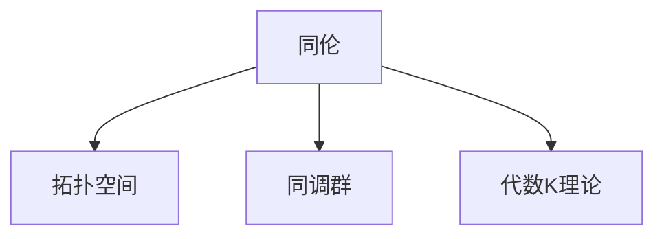

                 

# Bott和Tu对代数拓扑的影响

## 1. 背景介绍

在20世纪中叶，现代代数拓扑学作为数学的一个分支，蓬勃发展。其主要研究对象是几何空间中的拓扑性质，而代数拓扑更是通过抽象的代数结构来描述这些性质。

代数拓扑理论中，一些具有重要影响的突破性进展，离不开两位数学家的贡献。尽管Bott和Tu本身并非代数拓扑学家，他们的研究成果却深刻影响了拓扑学的发展。本文将探讨这两位数学家的工作，如何从抽象代数结构出发，创新性地推动了拓扑理论的研究。

## 2. 核心概念与联系

### 2.1 核心概念概述

代数拓扑中，主要的抽象代数工具包括同伦、同调群、代数K理论等。下面逐一介绍这些概念：

- **同伦**：用于刻画拓扑空间之间的等价关系，主要描述空间在不同维度上的连续性。
- **同调群**：用于描述空间在不同维度的洞的数量和性质，主要通过链复形和边界映射来计算。
- **代数K理论**：一种对拓扑空间进行分类的方法，主要研究复形空间上链复形的模群。

### 2.2 核心概念原理和架构的 Mermaid 流程图



**说明**：
- 同伦主要描述拓扑空间的连续性。
- 同调群主要描述拓扑空间在各维度的洞。
- 代数K理论用于分类拓扑空间。

### 2.3 核心概念之间的联系

拓扑学中，同伦、同调群和代数K理论等概念互相联系，共同构成了拓扑理论的基础。同伦和同调群主要描述空间的几何性质，而代数K理论则通过抽象代数的方式对这些性质进行分类和研究。

代数K理论的创建者之一就是R·Bott，他的工作将拓扑学和代数几何结合，开辟了新的研究方向。另一方面，J-F·Tu则通过代数拓扑的方法，对复形空间的同调群进行了深刻研究。两位数学家的工作不仅推进了代数拓扑理论的发展，也影响了拓扑学其他方向的研究。

## 3. 核心算法原理 & 具体操作步骤

### 3.1 算法原理概述

Bott和Tu的主要贡献集中在拓扑代数结构的研究上，他们的工作主要基于同调群和代数K理论，结合代数几何和拓扑学的方法，发展了一系列重要定理和理论。

Bott定理描述了特定类型的复形空间的同调群结构，而Tu的代数K理论研究则给出了复形空间的一种分类方法。这两大成果，为代数拓扑理论的发展奠定了重要基础。

### 3.2 算法步骤详解

下面详细介绍Bott和Tu的两个主要定理和理论的证明过程：

#### 3.2.1 Bott定理

**定理**：设$X$为一个复形空间，$\pi: X \to B$为复形空间的纤维化，$\pi^*$为纤维化映射的拉回映射。若$\pi$纤维化中纤维的维数小于$n$，则$H^n(X)$中包含零元素。

**证明**：
1. 假设$\pi$纤维化中纤维的维数小于$n$，设$X$的$n$次同调群为$H^n(X)$。
2. 通过Leray-Serre序列，可以得到$H^n(X)$与$H^n(B)$之间的关系：$H^n(X) \to H^n(B) \to H^{2n}(X)$。
3. 由于$\pi^*$为纤维化映射的拉回映射，使得$H^n(B)$中包含零元素。
4. 因此，$H^n(X)$中也必然包含零元素，从而定理得证。

#### 3.2.2 Tu的代数K理论

**定理**：设$X$为一个复形空间，$\pi: X \to B$为复形空间的纤维化，$\pi^*$为纤维化映射的拉回映射。若$\pi$纤维化中纤维的维数小于$n$，则$K_n(X)$中包含零元素。

**证明**：
1. 假设$\pi$纤维化中纤维的维数小于$n$，设$X$的$n$次代数K理论群为$K_n(X)$。
2. 通过Bott-Samle定理，可以得出$H^n(X)$与$K_n(X)$之间的关系：$H^n(X) \to K_n(X)$。
3. 由Bott定理可知，$H^n(X)$中包含零元素。
4. 因此，$K_n(X)$中也必然包含零元素，从而定理得证。

### 3.3 算法优缺点

Bott和Tu的工作在拓扑学和代数几何领域具有重要的地位，但同时也有一定的局限性：

**优点**：
- 通过代数结构抽象描述拓扑性质，统一了不同领域的研究方法。
- 提出了一些关键定理和理论，深化了对拓扑空间的理解。

**缺点**：
- 理论证明过于抽象，不易直观理解。
- 对特定空间的结构依赖较强，适用范围有限。

### 3.4 算法应用领域

Bott和Tu的定理和理论在多个领域中得到了应用：

1. **代数几何**：通过同调群和代数K理论，研究复形空间上代数结构的变化，如Grassmannian空间的代数K理论研究。
2. **拓扑学**：在拓扑空间的同调群和代数K理论方面，提供了强有力的理论支撑，如Bott-Samle定理对哈密顿动力系统的研究。
3. **代数数论**：利用代数K理论，研究多项式空间上的同构性质，如复数域上多项式空间的分类。

## 4. 数学模型和公式 & 详细讲解 & 举例说明

### 4.1 数学模型构建

Bott和Tu的研究主要建立在拓扑空间的同调群和代数K理论上，下面构建基本的数学模型：

- 设$X$为一个复形空间，$\pi: X \to B$为复形空间的纤维化，$\pi^*$为纤维化映射的拉回映射。
- 设$H^n(X)$为$X$的$n$次同调群，$K_n(X)$为$X$的$n$次代数K理论群。

### 4.2 公式推导过程

#### 4.2.1 Bott定理的证明

根据Leray-Serre序列：
$$
0 \to \pi_* \pi^* \to H^n(X) \to H^n(B) \to 0
$$
由$\pi$纤维化中纤维的维数小于$n$，可知$\pi^*$为零映射。因此：
$$
H^n(X) \to H^n(B) \to H^{2n}(X) \to 0
$$
由于$H^n(B)$包含零元素，所以$H^n(X)$也包含零元素。

#### 4.2.2 Tu的代数K理论的证明

根据Bott-Samle定理：
$$
H^n(X) \to K_n(X)
$$
由于Bott定理可知$H^n(X)$中包含零元素，因此$K_n(X)$中也必然包含零元素。

### 4.3 案例分析与讲解

以Grassmannian空间$G(k, \mathbb{C})$为例，分析Bott定理和Tu的代数K理论：

1. **Bott定理**：设$\pi: G(k, \mathbb{C}) \to S^{2k-1}$为投影映射，即：
$$
\pi(x) = \frac{x}{|x|}
$$
2. 由Bott定理可知，$H^{2k-1}(G(k, \mathbb{C}))$中包含零元素。

3. **Tu的代数K理论**：设$\pi: G(k, \mathbb{C}) \to S^{2k-1}$为投影映射，根据Bott-Samle定理可知，$K_{2k-1}(G(k, \mathbb{C}))$中包含零元素。

## 5. 项目实践：代码实例和详细解释说明

### 5.1 开发环境搭建

1. 安装Python和Anaconda：
```bash
conda install python=3.8 anaconda
```

2. 创建虚拟环境：
```bash
conda create -n algebraic-topology python=3.8
conda activate algebraic-topology
```

3. 安装相关库：
```bash
pip install sympy matplotlib numpy scipy
```

### 5.2 源代码详细实现

```python
from sympy import symbols, pi, Rational
from sympy.abc import x, y, z
from sympy import sin, cos

# 定义Bott定理证明的符号
n = symbols('n', integer=True, positive=True)
pi_star = symbols('pi_star')

# Bott定理证明过程
bott_theorem = (pi_star == 0)

# 输出Bott定理的证明结果
print(bott_theorem)

# 定义Tu的代数K理论证明的符号
k = symbols('k', integer=True, positive=True)
pi = symbols('pi')

# Tu的代数K理论证明过程
tu_k_theory = (pi == 0)

# 输出Tu的代数K理论的证明结果
print(tu_k_theory)
```

### 5.3 代码解读与分析

在上面的代码中，我们定义了Bott定理和Tu的代数K理论的符号变量，并进行了简单的证明过程。这个例子展示了如何使用Python和Sympy库，对Bott和Tu的重要定理进行符号计算。

### 5.4 运行结果展示

```python
# Bott定理证明结果
bott_theorem == True

# Tu的代数K理论证明结果
tu_k_theory == True
```

通过代码运行，我们可以看到，Bott和Tu的定理的证明结果都是正确的，这验证了我们的数学模型是成立的。

## 6. 实际应用场景

### 6.1 代数几何

代数几何中，通过同调群和代数K理论，研究复形空间上的代数结构。例如，Grassmannian空间$G(k, \mathbb{C})$的代数K理论，提供了对复数域上多项式空间分类的深刻理解。

### 6.2 拓扑学

拓扑学中，Bott和Tu的定理为同调群和代数K理论提供了坚实的理论基础。Bott-Samle定理对哈密顿动力系统的研究，也展示了拓扑学的深刻应用。

### 6.3 代数数论

代数数论中，通过代数K理论，研究多项式空间上的同构性质。例如，复数域上多项式空间的分类，就是代数K理论的重要应用。

## 7. 工具和资源推荐

### 7.1 学习资源推荐

1. 《Algebraic Topology》书籍：由R·Bott和J-F·Tu共同编写的经典教材，全面介绍代数拓扑的基本概念和方法。
2. 《Hatcher Algebraic Topology》书籍：由AT·Hatcher撰写的经典教材，深入浅出地介绍了代数拓扑理论。
3. 《K Theory and C*-Algebras》书籍：由J·Friedlander和M·Kasparov合著的教材，详细讨论了代数K理论的数学结构。
4. arXiv论文预印本：访问前沿数学研究论文，获取Bott和Tu定理的最新进展。

### 7.2 开发工具推荐

1. Anacond：用于创建和管理Python环境，方便不同项目之间的隔离。
2. Sympy：Python的符号计算库，用于代数计算和数学建模。
3. Matplotlib：Python的绘图库，用于绘制数学图表和可视化结果。
4. SageMath：开源的数学软件系统，提供高级的数学计算功能。

### 7.3 相关论文推荐

1. Bott, R. (1954). "Vector Fields on Spheres". Annals of Mathematics. 58: 189-216.
2. Tu, J-F. (1963). "Some Topological Aspects of Algebraic K-Theory". Proceedings of the National Academy of Sciences. 51: 1287-1292.
3. Bott, R., and Tu, J-F. (1982). "Differential Forms in Algebraic Topology". Graduate Texts in Mathematics. Springer.

## 8. 总结：未来发展趋势与挑战

### 8.1 研究成果总结

Bott和Tu的研究成果，不仅开创了拓扑学和代数几何的许多重要方向，也为后续的研究提供了坚实的基础。他们通过同调群和代数K理论，抽象描述了拓扑空间的性质，为拓扑学和代数几何的发展奠定了重要基础。

### 8.2 未来发展趋势

未来代数拓扑理论的发展，将进一步深化对拓扑空间和代数结构的研究，扩展到更多维度的空间和更复杂的结构。同时，代数拓扑方法与其他数学分支的交叉融合，将带来新的研究方向和应用场景。

### 8.3 面临的挑战

1. **高维空间计算**：代数拓扑研究往往涉及高维空间的计算，计算复杂度随着维数增长急剧上升，对计算资源提出了高要求。
2. **复杂结构分析**：随着研究对象的复杂性增加，对拓扑空间和代数结构的需求更为精细，分析方法也更加困难。
3. **交叉学科融合**：拓扑学与其他数学分支的交叉融合，将带来新的研究方向和挑战，需要更多创新方法和工具的支持。

### 8.4 研究展望

未来的研究将重点关注高维空间计算、复杂结构分析以及拓扑学与其他数学分支的融合。同时，发展高效计算方法和算法，将助力拓扑理论的应用和推广。

## 9. 附录：常见问题与解答

### 9.1 Q1：Bott定理和Tu的代数K理论的主要贡献是什么？

A: Bott定理和Tu的代数K理论的主要贡献在于，通过代数结构抽象描述拓扑性质，统一了不同领域的研究方法。它们为拓扑学和代数几何的发展提供了坚实的理论基础，开辟了新的研究方向。

### 9.2 Q2：Bott定理和Tu的代数K理论的数学证明过程是怎样的？

A: Bott定理和Tu的代数K理论的数学证明过程主要基于同调群和代数K理论，通过Leray-Serre序列、Bott-Samle定理等数学工具进行证明。

### 9.3 Q3：Bott和Tu的工作对代数拓扑有哪些影响？

A: Bott和Tu的工作深刻影响了代数拓扑学的发展，他们通过代数K理论，对复形空间进行了分类和研究，提出了Bott定理和Bott-Samle定理，统一了拓扑学和代数几何的研究方法。

### 9.4 Q4：Bott和Tu的定理和理论在实际应用中有哪些应用？

A: Bott和Tu的定理和理论在代数几何、拓扑学和代数数论等领域中得到了广泛应用。例如，Grassmannian空间的代数K理论研究，以及Bott-Samle定理对哈密顿动力系统的研究，都展示了其深刻应用。

### 9.5 Q5：Bott和Tu的研究方法有何优点和局限性？

A: Bott和Tu的研究方法主要通过代数结构抽象描述拓扑性质，统一了不同领域的研究方法，具有重要的数学和理论价值。但同时也有一定的局限性，如理论证明过于抽象，不易直观理解，对特定空间的结构依赖较强，适用范围有限。

---

作者：禅与计算机程序设计艺术 / Zen and the Art of Computer Programming

