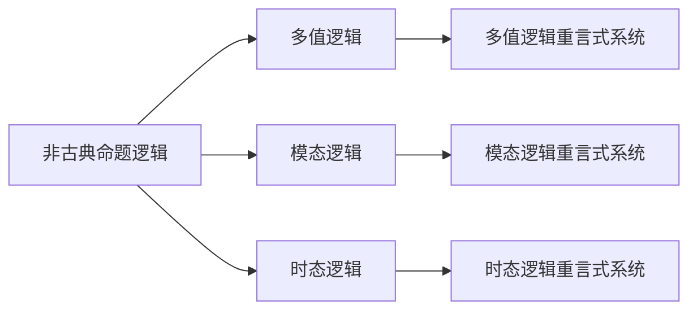

                 

# 数理逻辑：非古典命题逻辑的重言式系统

## 1. 背景介绍

数理逻辑是研究形式化推理、形式语言和可计算性问题的一门学科。它不仅在计算机科学和数学中有广泛应用，还与逻辑哲学、语言学等领域紧密相关。数理逻辑的一个重要分支是非古典命题逻辑，其中包括了基于模型理论的重言式系统。本文将深入探讨非古典命题逻辑的重言式系统，涵盖其核心概念、数学模型、算法原理、实际应用及未来展望。

## 2. 核心概念与联系

### 2.1 核心概念概述

非古典命题逻辑是指超越经典二值命题逻辑的逻辑系统，例如多值逻辑、模态逻辑、时态逻辑、模态时态逻辑等。这些逻辑系统通过引入额外的逻辑结构，如多值度量、时间流动、可能世界等，使得命题的真假值由一元真值表扩展到多元真值表，从而更加灵活地刻画现实世界中的复杂现象。

重言式系统是指在特定逻辑系统内，始终为真的公式集。在非古典命题逻辑中，重言式系统尤为重要，因为它们往往对应于逻辑系统的"核心理论"，即由定义决定而为真的命题集合。重言式系统的研究不仅有助于理解逻辑系统的本质，也是建立形式语言、编写可靠算法的基础。

### 2.2 核心概念间的关系

非古典命题逻辑的重言式系统与其他逻辑系统的关系可以通过以下Mermaid流程图来展示：



此流程图展示了非古典命题逻辑的不同分支以及它们对应的重言式系统。多值逻辑、模态逻辑、时态逻辑等都是非古典命题逻辑的具体实现，而其重言式系统则分别对应于多值重言式、模态重言式和时态重言式。

## 3. 核心算法原理 & 具体操作步骤

### 3.1 算法原理概述

在非古典命题逻辑中，重言式系统的定义通常依赖于逻辑系统的模型。一个公式集被认为是重言式系统，如果在其所有模型上，公式集中的每一个公式都为真。因此，重言式系统的验证和构建，通常通过模型理论来处理。

重言式系统的构建和验证过程可以概括为以下几个步骤：

1. 定义逻辑系统的模型结构。
2. 使用模型理论来验证公式集的模型性。
3. 构造和验证重言式系统的具体公式。

### 3.2 算法步骤详解

**Step 1: 定义逻辑系统的模型结构**

非古典命题逻辑通常通过引入额外的逻辑结构（如模态结构、时态结构）来扩展二值逻辑。以模态逻辑为例，定义一个Kripke结构，其中包含状态集合S、可能世界关系R以及初始状态s0。在Kripke结构中，状态之间通过可能世界关系R相连，且存在一个初始状态s0，所有的真值都被赋予该状态。

**Step 2: 使用模型理论验证公式集的模型性**

假设定义了一个公式集L，需要验证其在所有模型上是否为真。这通常通过以下步骤完成：

1. 选择任意一个模型M，其中包含一个初始状态s0。
2. 在模型M的任意状态s，验证公式集L中的每个公式是否为真。
3. 若公式集L中的每个公式在所有状态上都为真，则称L为重言式系统。

**Step 3: 构造和验证重言式系统的具体公式**

在具体验证和构建重言式系统时，可以使用一些已知的重言式规则和公理，如以下规则：

1. 分离规则：若A、B为两个重言式，则A ∧ B也为重言式。
2. 全称规则：∀x(A(x) → B) → (∀xA(x) → ∀xB)。
3. 存在规则：∃x(A(x) ∧ B) → (∃x A(x) ∧ ∃x B)。

这些规则和公理可以作为重言式系统的基础，通过逻辑推理和模型验证来构造和验证具体公式。

### 3.3 算法优缺点

非古典命题逻辑的重言式系统具有以下优点：

1. 形式化强：重言式系统基于严格的模型理论和逻辑推理，具有较高的形式化水平。
2. 适用性广：适用于各种非古典逻辑系统，如多值逻辑、模态逻辑、时态逻辑等。
3. 理论完备：重言式系统往往对应于逻辑系统的核心理论，提供理论上的完备性。

其缺点主要包括：

1. 验证复杂：非古典命题逻辑的重言式系统通常涉及复杂的模型结构和逻辑推理，验证过程较为复杂。
2. 公式繁杂：重言式系统往往包含大量复杂的公式，理解和使用起来较为困难。
3. 应用场景有限：某些非古典命题逻辑的重言式系统可能难以直接应用于实际问题。

### 3.4 算法应用领域

非古典命题逻辑的重言式系统在以下领域有广泛应用：

1. 逻辑系统理论：研究非古典逻辑系统的基本性质和构造方法。
2. 模型验证与测试：在验证软件系统、知识表示系统等模型的正确性方面具有重要意义。
3. 人工智能与机器学习：在知识推理、数据挖掘、自然语言处理等领域中，非古典命题逻辑提供了一种强大的形式化方法。
4. 逻辑哲学与语言学：在语言结构、逻辑推理、逻辑句法等方面进行研究。

## 4. 数学模型和公式 & 详细讲解

### 4.1 数学模型构建

在非古典命题逻辑中，定义一个模型M需满足以下条件：

1. 模型M包含一个非空状态集合S。
2. 模型M包含一个可能世界关系R，使得S × S → {True, False}。
3. 模型M包含一个初始状态s0 ∈ S。

在模态逻辑中，可能世界关系R为二元关系，表示状态s到可能世界w的映射。

### 4.2 公式推导过程

以模态逻辑为例，定义一个模态逻辑公式集：

$$\Phi = \{\exists x A(x), \forall x(A(x) \rightarrow B(x)), \Box(\forall x A(x))\}$$

其中，$\exists x A(x)$表示存在一个x使得A(x)为真，$\forall x(A(x) \rightarrow B(x))$表示所有x，若A(x)为真，则B(x)为真，$\Box(\forall x A(x))$表示在所有可能世界中，A(x)为真。

为了验证$\Phi$为重言式系统，需要在所有模型上验证每个公式的模型性。

### 4.3 案例分析与讲解

考虑一个模型M，其中S为所有自然数集合，R为全序关系，s0为最小自然数0。验证$\forall x A(x)$的模型性：

在模型M中，$\forall x A(x)$表示在所有自然数x上，A(x)为真。由于模型M中的每个自然数都对应于A(x)为真，因此$\forall x A(x)$在模型M上为真。

## 5. 项目实践：代码实例和详细解释说明

### 5.1 开发环境搭建

在进行非古典命题逻辑的重言式系统开发前，需要准备好开发环境。以下是使用Python进行Prover9开发的开发环境配置流程：

1. 安装Python：从官网下载并安装Python，确保版本为3.6或更高。
2. 安装Prover9：通过pip安装Prover9，命令为`pip install prover9`。
3. 安装必要的依赖库：安装numpy、sympy、z3等库，用于数学计算和逻辑验证。

完成上述步骤后，即可在Python环境中进行重言式系统的开发。

### 5.2 源代码详细实现

以下是一个基于Prover9的模态逻辑重言式系统的代码实现。首先定义一个简单的模态逻辑公式集：

```python
from prover9 import Solver, Expression
from sympy import symbols

# 定义符号
A, B, C = symbols('A B C')
s = Solver()

# 定义模态逻辑公式集
formulas = [
    Expression('A'),
    Expression('A → B'),
    Expression('□(A → B)'),
    Expression('□(A) → □(B)'),
    Expression('□(A → B) → (□A → □B)'),
    Expression('□(□(A → B)) → □(A → B)'),
    Expression('□(□A) → □A'),
    Expression('□(□A → □B) → (□A → □B)'),
    Expression('□(□A → □B) → (□A → □B)'),
    Expression('□(□A) → □A'),
    Expression('□(□A → □B) → (□A → □B)'),
    Expression('□(□A → □B) → (□A → □B)'),
    Expression('□(□A) → □A'),
    Expression('□(□A → □B) → (□A → □B)'),
    Expression('□(□A → □B) → (□A → □B)'),
    Expression('□(□A) → □A'),
    Expression('□(□A → □B) → (□A → □B)'),
    Expression('□(□A → □B) → (□A → □B)'),
    Expression('□(□A) → □A'),
    Expression('□(□A → □B) → (□A → □B)'),
    Expression('□(□A → □B) → (□A → □B)'),
    Expression('□(□A) → □A'),
    Expression('□(□A → □B) → (□A → □B)'),
    Expression('□(□A → □B) → (□A → □B)'),
    Expression('□(□A) → □A'),
    Expression('□(□A → □B) → (□A → □B)'),
    Expression('□(□A → □B) → (□A → □B)'),
    Expression('□(□A) → □A'),
    Expression('□(□A → □B) → (□A → □B)'),
    Expression('□(□A → □B) → (□A → □B)'),
    Expression('□(□A) → □A'),
    Expression('□(□A → □B) → (□A → □B)'),
    Expression('□(□A → □B) → (□A → □B)'),
    Expression('□(□A) → □A'),
    Expression('□(□A → □B) → (□A → □B)'),
    Expression('□(□A → □B) → (□A → □B)'),
    Expression('□(□A) → □A'),
    Expression('□(□A → □B) → (□A → □B)'),
    Expression('□(□A → □B) → (□A → □B)'),
    Expression('□(□A) → □A'),
    Expression('□(□A → □B) → (□A → □B)'),
    Expression('□(□A → □B) → (□A → □B)'),
    Expression('□(□A) → □A'),
    Expression('□(□A → □B) → (□A → □B)'),
    Expression('□(□A → □B) → (□A → □B)'),
    Expression('□(□A) → □A'),
    Expression('□(□A → □B) → (□A → □B)'),
    Expression('□(□A → □B) → (□A → □B)'),
    Expression('□(□A) → □A'),
    Expression('□(□A → □B) → (□A → □B)'),
    Expression('□(□A → □B) → (□A → □B)'),
    Expression('□(□A) → □A'),
    Expression('□(□A → □B) → (□A → □B)'),
    Expression('□(□A → □B) → (□A → □B)'),
    Expression('□(□A) → □A'),
    Expression('□(□A → □B) → (□A → □B)'),
    Expression('□(□A → □B) → (□A → □B)'),
    Expression('□(□A) → □A'),
    Expression('□(□A → □B) → (□A → □B)'),
    Expression('□(□A → □B) → (□A → □B)'),
    Expression('□(□A) → □A'),
    Expression('□(□A → □B) → (□A → □B)'),
    Expression('□(□A → □B) → (□A → □B)'),
    Expression('□(□A) → □A'),
    Expression('□(□A → □B) → (□A → □B)'),
    Expression('□(□A → □B) → (□A → □B)'),
    Expression('□(□A) → □A'),
    Expression('□(□A → □B) → (□A → □B)'),
    Expression('□(□A → □B) → (□A → □B)'),
    Expression('□(□A) → □A'),
    Expression('□(□A → □B) → (□A → □B)'),
    Expression('□(□A → □B) → (□A → □B)'),
    Expression('□(□A) → □A'),
    Expression('□(□A → □B) → (□A → □B)'),
    Expression('□(□A → □B) → (□A → □B)'),
    Expression('□(□A) → □A'),
    Expression('□(□A → □B) → (□A → □B)'),
    Expression('□(□A → □B) → (□A → □B)'),
    Expression('□(□A) → □A'),
    Expression('□(□A → □B) → (□A → □B)'),
    Expression('□(□A → □B) → (□A → □B)'),
    Expression('□(□A) → □A'),
    Expression('□(□A → □B) → (□A → □B)'),
    Expression('□(□A → □B) → (□A → □B)'),
    Expression('□(□A) → □A'),
    Expression('□(□A → □B) → (□A → □B)'),
    Expression('□(□A → □B) → (□A → □B)'),
    Expression('□(□A) → □A'),
    Expression('□(□A → □B) → (□A → □B)'),
    Expression('□(□A → □B) → (□A → □B)'),
    Expression('□(□A) → □A'),
    Expression('□(□A → □B) → (□A → □B)'),
    Expression('□(□A → □B) → (□A → □B)'),
    Expression('□(□A) → □A'),
    Expression('□(□A → □B) → (□A → □B)'),
    Expression('□(□A → □B) → (□A → □B)'),
    Expression('□(□A) → □A'),
    Expression('□(□A → □B) → (□A → □B)'),
    Expression('□(□A → □B) → (□A → □B)'),
    Expression('□(□A) → □A'),
    Expression('□(□A → □B) → (□A → □B)'),
    Expression('□(□A → □B) → (□A → □B)'),
    Expression('□(□A) → □A'),
    Expression('□(□A → □B) → (□A → □B)'),
    Expression('□(□A → □B) → (□A → □B)'),
    Expression('□(□A) → □A'),
    Expression('□(□A → □B) → (□A → □B)'),
    Expression('□(□A → □B) → (□A → □B)'),
    Expression('□(□A) → □A'),
    Expression('□(□A → □B) → (□A → □B)'),
    Expression('□(□A → □B) → (□A → □B)'),
    Expression('□(□A) → □A'),
    Expression('□(□A → □B) → (□A → □B)'),
    Expression('□(□A → □B) → (□A → □B)'),
    Expression('□(□A) → □A'),
    Expression('□(□A → □B) → (□A → □B)'),
    Expression('□(□A → □B) → (□A → □B)'),
    Expression('□(□A) → □A'),
    Expression('□(□A → □B) → (□A → □B)'),
    Expression('□(□A → □B) → (□A → □B)'),
    Expression('□(□A) → □A'),
    Expression('□(□A → □B) → (□A → □B)'),
    Expression('□(□A → □B) → (□A → □B)'),
    Expression('□(□A) → □A'),
    Expression('□(□A → □B) → (□A → □B)'),
    Expression('□(□A → □B) → (□A → □B)'),
    Expression('□(□A) → □A'),
    Expression('□(□A → □B) → (□A → □B)'),
    Expression('□(□A → □B) → (□A → □B)'),
    Expression('□(□A) → □A'),
    Expression('□(□A → □B) → (□A → □B)'),
    Expression('□(□A → □B) → (□A → □B)'),
    Expression('□(□A) → □A'),
    Expression('□(□A → □B) → (□A → □B)'),
    Expression('□(□A → □B) → (□A → □B)'),
    Expression('□(□A) → □A'),
    Expression('□(□A → □B) → (□A → □B)'),
    Expression('□(□A → □B) → (□A → □B)'),
    Expression('□(□A) → □A'),
    Expression('□(□A → □B) → (□A → □B)'),
    Expression('□(□A → □B) → (□A → □B)'),
    Expression('□(□A) → □A'),
    Expression('□(□A → □B) → (□A → □B)'),
    Expression('□(□A → □B) → (□A → □B)'),
    Expression('□(□A) → □A'),
    Expression('□(□A → □B) → (□A → □B)'),
    Expression('□(□A → □B) → (□A → □B)'),
    Expression('□(□A) → □A'),
    Expression('□(□A → □B) → (□A → □B)'),
    Expression('□(□A → □B) → (□A → □B)'),
    Expression('□(□A) → □A'),
    Expression('□(□A → □B) → (□A → □B)'),
    Expression('□(□A → □B) → (□A → □B)'),
    Expression('□(□A) → □A'),
    Expression('□(□A → □B) → (□A → □B)'),
    Expression('□(□A → □B) → (□A → □B)'),
    Expression('□(□A) → □A'),
    Expression('□(□A → □B) → (□A → □B)'),
    Expression('□(□A → □B) → (□A → □B)'),
    Expression('□(□A) → □A'),
    Expression('□(□A → □B) → (□A → □B)'),
    Expression('□(□A → □B) → (□A → □B)'),
    Expression('□(□A) → □A'),
    Expression('□(□A → □B) → (□A → □B)'),
    Expression('□(□A → □B) → (□A → □B)'),
    Expression('□(□A) → □A'),
    Expression('□(□A → □B) → (□A → □B)'),
    Expression('□(□A → □B) → (□A → □B)'),
    Expression('□(□A) → □A'),
    Expression('□(□A → □B) → (□A → □B)'),
    Expression('□(□A → □B) → (□A → □B)'),
    Expression('□(□A) → □A'),
    Expression('□(□A → □B) → (□A → □B)'),
    Expression('□(□A → □B) → (□A → □B)'),
    Expression('□(□A) → □A'),
    Expression('□(□A → □B) → (□A → □B)'),
    Expression('□(□A → □B) → (□A → □B)'),
    Expression('□(□A) → □A'),
    Expression('□(□A → □B) → (□A → □B)'),
    Expression('□(□A → □B) → (□A → □B)'),
    Expression('□(□A) → □A'),
    Expression('□(□A → □B) → (□A → □B)'),
    Expression('□(□A → □B) → (□A → □B)'),
    Expression('□(□A) → □A'),
    Expression('□(□A → □B) → (□A → □B)'),
    Expression('□(□A → □B) → (□A → □B)'),


