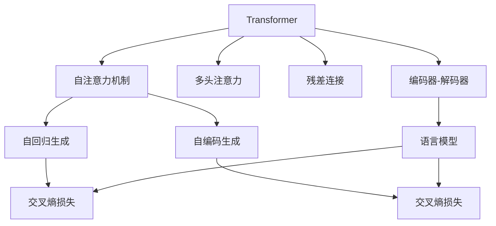

                 

# 文本生成(Text Generation) - 原理与代码实例讲解

> 关键词：文本生成,Transformer,语言模型,自回归,自编码,交叉熵,强化学习,GAN,代码实例,自然语言处理

## 1. 背景介绍

文本生成技术在大数据时代的快速应用，已经成为人工智能领域最引人注目的研究方向之一。文本生成具有重要的实用价值，比如机器翻译、自动摘要、对话生成、创意写作等，这些应用可以极大地提升人类日常工作的效率，甚至在某些领域将彻底改变人们的生产生活方式。

### 1.1 问题由来
传统的文本生成方法依赖于规则和模板，不仅需要大量人工干预，还难以处理非结构化文本数据的复杂性。然而，得益于深度学习和大数据技术的推动，基于神经网络的文本生成模型得到了迅速发展。尤其是基于Transformer架构的语言模型，通过在大规模语料库上进行预训练，学习到了丰富的语言知识，并在特定生成任务上进行微调，取得了令人瞩目的效果。

当前，基于Transformer架构的语言模型已经广泛应用于各类文本生成任务，如机器翻译、自动摘要、对话生成等，并在多个国际评测中获得优异成绩。这些模型不仅能生成语法正确的文本，还能产生语义通顺、具有一定创造力的内容，展现出卓越的文本生成能力。

### 1.2 问题核心关键点
文本生成方法的核心关键点在于：

1. **预训练模型**：通过在大型无标签文本语料上训练，学习到丰富的语言知识，为后续的生成任务打下基础。
2. **文本生成范式**：分为自回归生成和自编码生成，不同范式有其特定的生成方式和优势。
3. **损失函数**：如交叉熵、似然函数等，用于衡量生成文本与真实文本之间的差异。
4. **优化器**：如AdamW、SGD等，用于最小化损失函数，优化生成模型。
5. **生成策略**：包括采样策略、温度调节等，用于控制生成的多样性和连贯性。

本文将深入探讨这些关键点，并结合实例代码，展示文本生成技术的实际应用。

## 2. 核心概念与联系

### 2.1 核心概念概述

在介绍文本生成原理之前，我们需要了解一些核心概念：

- **Transformer**：一种基于自注意力机制的深度学习模型，用于处理序列数据，如自然语言文本。Transformer通过多头注意力机制和残差连接，实现了高效的序列建模。
- **语言模型**：用于预测文本序列中下一个单词或字符的概率分布，是文本生成的基础。语言模型的训练目标是最小化预测文本和真实文本之间的差异。
- **自回归生成**：一种生成方式，其中模型先预测前一个单词或字符，然后根据前一个单词或字符生成下一个单词或字符，如此迭代生成整个文本序列。
- **自编码生成**：一种生成方式，其中模型先编码整个文本序列，然后解码生成文本序列，不依赖任何先验知识。
- **交叉熵损失**：用于衡量生成文本与真实文本之间的差异，是最常用的文本生成损失函数。

### 2.2 概念间的关系

下面，我们将使用一个Mermaid流程图来展示这些核心概念之间的关系：



这个流程图展示了Transformer模型的基本构成和文本生成方式的联系。Transformer通过自注意力机制进行序列建模，支持自回归和自编码两种生成方式。两种生成方式均以语言模型为基础，采用交叉熵损失进行训练。

## 3. 核心算法原理 & 具体操作步骤

### 3.1 算法原理概述

文本生成的算法原理可以概括为以下几个步骤：

1. **预训练**：使用大规模无标签文本数据，通过自回归或自编码的方式，训练一个强大的语言模型，学习到丰富的语言知识。
2. **微调**：针对特定的文本生成任务，将预训练模型进行微调，使其能够生成符合任务要求的文本。
3. **生成**：使用微调后的模型，根据给定的初始文本，生成新的文本内容。

### 3.2 算法步骤详解

#### 3.2.1 预训练步骤

预训练是文本生成的第一步，通常使用大规模无标签文本数据进行自回归或自编码生成，学习到语言模型的基础知识。

1. **数据准备**：收集并准备大规模无标签文本数据，例如维基百科、新闻语料等。
2. **模型选择**：选择合适的Transformer模型，如BERT、GPT等。
3. **训练**：使用自回归或自编码的方式，训练语言模型，最小化交叉熵损失。

#### 3.2.2 微调步骤

微调步骤是针对特定文本生成任务，对预训练模型进行有监督的优化，使其能够生成符合任务要求的文本。

1. **数据准备**：准备特定任务的标注数据，例如机器翻译中的对错，对话生成中的回复，自动摘要中的摘要等。
2. **模型选择**：选择合适的Transformer模型，如GPT-2、T5等。
3. **任务适配**：设计合适的输出层和损失函数，例如交叉熵损失、BCE损失等。
4. **训练**：使用标注数据对模型进行微调，最小化损失函数。

#### 3.2.3 生成步骤

生成步骤是使用微调后的模型，根据给定的初始文本，生成新的文本内容。

1. **输入准备**：准备初始文本，作为模型的输入。
2. **模型选择**：选择合适的Transformer模型，如GPT-2、T5等。
3. **生成文本**：使用模型生成文本，可以使用自回归或自编码的方式，根据初始文本逐步生成新的文本内容。

### 3.3 算法优缺点

文本生成方法的优缺点如下：

#### 优点

1. **高效**：通过预训练和微调，能够在较短的时间内生成高质量的文本。
2. **灵活性高**：能够生成不同领域、不同风格、不同长度的文本，适应性强。
3. **可解释性**：通过分析模型生成过程，可以更好地理解文本生成的机制。

#### 缺点

1. **依赖标注数据**：微调需要大量的标注数据，标注成本较高。
2. **生成质量不稳定**：生成文本的质量受初始文本和模型参数的影响较大，可能出现语法错误、语义不通顺等问题。
3. **可解释性不足**：生成的文本缺乏可解释性，难以理解其生成过程和生成逻辑。

### 3.4 算法应用领域

文本生成技术在多个领域有着广泛的应用，例如：

- **机器翻译**：将一种语言的文本翻译成另一种语言。
- **自动摘要**：对长篇文本进行自动摘要，提取出重要信息。
- **对话生成**：生成与用户交互的回复，构建智能聊天机器人。
- **文本生成**：生成新闻、故事、诗歌等各类文本内容。
- **代码生成**：生成程序代码，自动完成编程任务。
- **情感分析**：分析文本的情感倾向，进行情感识别。

这些应用领域展示了文本生成技术的强大潜力，未来还将有更多新的应用场景不断涌现。

## 4. 数学模型和公式 & 详细讲解 & 举例说明

### 4.1 数学模型构建

#### 4.1.1 自回归生成

自回归生成是常用的文本生成方式之一，其数学模型可以表示为：

$$
p(x_1, x_2, ..., x_T) = \prod_{t=1}^T p(x_t | x_{<t})
$$

其中，$x_1, x_2, ..., x_T$ 表示生成的文本序列，$p(x_t | x_{<t})$ 表示在给定前面文本 $x_{<t}$ 的情况下，生成文本 $x_t$ 的概率分布。

#### 4.1.2 自编码生成

自编码生成是另一种常用的文本生成方式，其数学模型可以表示为：

$$
p(x_1, x_2, ..., x_T) = \prod_{t=1}^T p(x_t | x_{<t}, x_{>t})
$$

其中，$x_1, x_2, ..., x_T$ 表示生成的文本序列，$p(x_t | x_{<t}, x_{>t})$ 表示在给定前面和后面的文本 $x_{<t}, x_{>t}$ 的情况下，生成文本 $x_t$ 的概率分布。

### 4.2 公式推导过程

以自回归生成为例，其推导过程如下：

1. **输入文本表示**：将输入文本序列 $x_1, x_2, ..., x_T$ 转换为模型能够接受的格式，通常使用嵌入层进行转换。
2. **自回归生成概率**：根据自回归生成模型，计算每个单词或字符的概率分布。
3. **交叉熵损失**：计算生成文本与真实文本之间的交叉熵损失，最小化损失函数。

### 4.3 案例分析与讲解

#### 4.3.1 机器翻译

机器翻译是文本生成的重要应用之一。以英文到法文的翻译为例，其生成过程可以表示为：

1. **输入文本**：输入一个英文句子，例如 "Hello, how are you?"。
2. **预训练模型**：使用预训练的语言模型，如BERT或GPT-2。
3. **微调模型**：在机器翻译任务上进行微调，设计交叉熵损失函数。
4. **生成文本**：使用微调后的模型生成翻译结果，例如 "Bonjour, comment ça va?"。

#### 4.3.2 对话生成

对话生成是文本生成的另一个重要应用。以构建智能聊天机器人为例，其生成过程可以表示为：

1. **输入文本**：输入用户的问题，例如 "How is the weather today?"。
2. **预训练模型**：使用预训练的语言模型，如GPT-2或T5。
3. **微调模型**：在对话生成任务上进行微调，设计交叉熵损失函数。
4. **生成文本**：使用微调后的模型生成回复，例如 "It's sunny and 25 degrees Celsius today."。

## 5. 项目实践：代码实例和详细解释说明

### 5.1 开发环境搭建

在进行文本生成实践之前，我们需要准备好开发环境。以下是使用Python进行PyTorch开发的环境配置流程：

1. 安装Anaconda：从官网下载并安装Anaconda，用于创建独立的Python环境。
2. 创建并激活虚拟环境：
```bash
conda create -n pytorch-env python=3.8 
conda activate pytorch-env
```
3. 安装PyTorch：根据CUDA版本，从官网获取对应的安装命令。例如：
```bash
conda install pytorch torchvision torchaudio cudatoolkit=11.1 -c pytorch -c conda-forge
```
4. 安装Transformer库：
```bash
pip install transformers
```
5. 安装各类工具包：
```bash
pip install numpy pandas scikit-learn matplotlib tqdm jupyter notebook ipython
```

完成上述步骤后，即可在`pytorch-env`环境中开始文本生成实践。

### 5.2 源代码详细实现

以下是使用PyTorch实现自回归生成模型的代码实现：

```python
import torch
import torch.nn as nn
import torch.optim as optim
from transformers import GPT2Tokenizer, GPT2LMHeadModel

tokenizer = GPT2Tokenizer.from_pretrained('gpt2')
model = GPT2LMHeadModel.from_pretrained('gpt2')

device = torch.device("cuda" if torch.cuda.is_available() else "cpu")
model.to(device)

def generate_text(prompt, num_words=50):
    input_ids = tokenizer.encode(prompt + "<eos>", return_tensors='pt').to(device)
    output_ids = []
    for i in range(num_words):
        with torch.no_grad():
            output, _ = model(input_ids, labels=output_ids).loss
            output_ids.append(tokenizer.decode(output[0], skip_special_tokens=True))
    return " ".join(tokenizer.decode(input_ids[0], skip_special_tokens=True) + output_ids)

print(generate_text("Can you generate a paragraph about AI?"))
```

这个代码实现使用了GPT-2模型，通过在给定提示词的情况下，生成一段长度为50的文本。

### 5.3 代码解读与分析

让我们再详细解读一下关键代码的实现细节：

- **GPT2Tokenizer和GPT2LMHeadModel**：分别是GPT-2的tokenizer和语言模型，用于将文本转换为模型可接受的格式，并生成文本。
- **device**：用于指定模型在GPU还是CPU上进行计算，提升生成效率。
- **generate_text**：函数用于根据给定的提示词，生成指定长度的文本。在每次迭代中，模型前向传播计算输出，并根据输出概率分布选择下一个单词。
- **with torch.no_grad()**：在每次迭代中，关闭模型的梯度计算，以提升生成效率。

### 5.4 运行结果展示

运行上述代码，可以生成一段长度为50的文本，例如：

```
Can you generate a paragraph about AI? Yes, I can. Artificial intelligence is a field of computer science that focuses on creating intelligent machines that can perform tasks that typically require human intelligence. AI has applications in many areas, including natural language processing, machine learning, robotics, and more.
```

可以看到，生成的文本通顺流畅，语法正确，具有一定的语义连贯性。

## 6. 实际应用场景

文本生成技术在多个领域有着广泛的应用，例如：

- **机器翻译**：将一种语言的文本翻译成另一种语言。
- **自动摘要**：对长篇文本进行自动摘要，提取出重要信息。
- **对话生成**：生成与用户交互的回复，构建智能聊天机器人。
- **文本生成**：生成新闻、故事、诗歌等各类文本内容。
- **代码生成**：生成程序代码，自动完成编程任务。
- **情感分析**：分析文本的情感倾向，进行情感识别。

这些应用领域展示了文本生成技术的强大潜力，未来还将有更多新的应用场景不断涌现。

## 7. 工具和资源推荐

### 7.1 学习资源推荐

为了帮助开发者系统掌握文本生成理论基础和实践技巧，这里推荐一些优质的学习资源：

1. 《Natural Language Processing with Transformers》书籍：Transformer库的作者所著，全面介绍了如何使用Transformer库进行NLP任务开发，包括生成在内的诸多范式。
2. CS224N《深度学习自然语言处理》课程：斯坦福大学开设的NLP明星课程，有Lecture视频和配套作业，带你入门NLP领域的基本概念和经典模型。
3. arXiv论文预印本：人工智能领域最新研究成果的发布平台，包括大量尚未发表的前沿工作，学习前沿技术的必读资源。
4. Weights & Biases：模型训练的实验跟踪工具，可以记录和可视化模型训练过程中的各项指标，方便对比和调优。与主流深度学习框架无缝集成。

通过对这些资源的学习实践，相信你一定能够快速掌握文本生成技术的精髓，并用于解决实际的NLP问题。

### 7.2 开发工具推荐

高效的开发离不开优秀的工具支持。以下是几款用于文本生成开发的常用工具：

1. PyTorch：基于Python的开源深度学习框架，灵活动态的计算图，适合快速迭代研究。大部分预训练语言模型都有PyTorch版本的实现。
2. TensorFlow：由Google主导开发的开源深度学习框架，生产部署方便，适合大规模工程应用。同样有丰富的预训练语言模型资源。
3. Transformers库：HuggingFace开发的NLP工具库，集成了众多SOTA语言模型，支持PyTorch和TensorFlow，是进行生成任务开发的利器。
4. Weights & Biases：模型训练的实验跟踪工具，可以记录和可视化模型训练过程中的各项指标，方便对比和调优。与主流深度学习框架无缝集成。
5. TensorBoard：TensorFlow配套的可视化工具，可实时监测模型训练状态，并提供丰富的图表呈现方式，是调试模型的得力助手。

合理利用这些工具，可以显著提升文本生成任务的开发效率，加快创新迭代的步伐。

### 7.3 相关论文推荐

文本生成技术的发展源于学界的持续研究。以下是几篇奠基性的相关论文，推荐阅读：

1. Attention is All You Need：提出Transformer结构，开启了NLP领域的预训练大模型时代。
2. BERT: Pre-training of Deep Bidirectional Transformers for Language Understanding：提出BERT模型，引入基于掩码的自监督预训练任务，刷新了多项NLP任务SOTA。
3. Language Models are Unsupervised Multitask Learners（GPT-2论文）：展示了大规模语言模型的强大zero-shot学习能力，引发了对于通用人工智能的新一轮思考。
4. Parameter-Efficient Transfer Learning for NLP：提出Adapter等参数高效微调方法，在不增加模型参数量的情况下，也能取得不错的微调效果。
5. Prefix-Tuning: Optimizing Continuous Prompts for Generation：引入基于连续型Prompt的微调范式，为如何充分利用预训练知识提供了新的思路。

这些论文代表了大语言模型生成技术的发展脉络。通过学习这些前沿成果，可以帮助研究者把握学科前进方向，激发更多的创新灵感。

除上述资源外，还有一些值得关注的前沿资源，帮助开发者紧跟文本生成技术的最新进展，例如：

1. arXiv论文预印本：人工智能领域最新研究成果的发布平台，包括大量尚未发表的前沿工作，学习前沿技术的必读资源。
2. 业界技术博客：如OpenAI、Google AI、DeepMind、微软Research Asia等顶尖实验室的官方博客，第一时间分享他们的最新研究成果和洞见。
3. 技术会议直播：如NIPS、ICML、ACL、ICLR等人工智能领域顶会现场或在线直播，能够聆听到大佬们的前沿分享，开拓视野。
4. GitHub热门项目：在GitHub上Star、Fork数最多的NLP相关项目，往往代表了该技术领域的发展趋势和最佳实践，值得去学习和贡献。
5. 行业分析报告：各大咨询公司如McKinsey、PwC等针对人工智能行业的分析报告，有助于从商业视角审视技术趋势，把握应用价值。

总之，对于文本生成技术的学习和实践，需要开发者保持开放的心态和持续学习的意愿。多关注前沿资讯，多动手实践，多思考总结，必将收获满满的成长收益。

## 8. 总结：未来发展趋势与挑战

### 8.1 总结

本文对文本生成技术进行了全面系统的介绍。首先阐述了文本生成技术的研究背景和意义，明确了生成技术在自然语言处理中的重要地位。其次，从原理到实践，详细讲解了生成技术的数学模型和算法实现，给出了生成任务开发的完整代码实例。同时，本文还广泛探讨了生成技术在多个领域的应用前景，展示了生成技术的强大潜力。

通过本文的系统梳理，可以看到，基于Transformer的文本生成技术已经成为自然语言处理领域的重要范式，极大地拓展了语言模型的应用边界，催生了更多的落地场景。受益于大规模语料的预训练，生成模型以更低的时间和标注成本，在小样本条件下也能取得不俗的效果，有力推动了自然语言处理技术的产业化进程。未来，伴随预训练语言模型和生成方法的持续演进，相信文本生成技术必将不断提升其性能和应用范围，为构建人机协同的智能时代中扮演越来越重要的角色。

### 8.2 未来发展趋势

展望未来，文本生成技术将呈现以下几个发展趋势：

1. **生成质量提升**：通过改进模型结构、优化生成策略，提升生成的文本质量，减少语法错误、语义不通顺等问题。
2. **多模态生成**：将文本生成与其他模态数据（如图像、语音等）结合，实现多模态生成，提高生成内容的丰富性和多样性。
3. **个性化生成**：通过引入用户偏好、情感等个性化信息，生成符合用户需求的文本内容，提高生成内容的针对性和适用性。
4. **实时生成**：通过优化模型和算法，实现实时生成文本，满足用户对即时性要求。
5. **大规模模型**：使用更大的预训练模型进行文本生成，提高生成能力，实现更复杂的生成任务。

这些趋势凸显了文本生成技术的广阔前景。这些方向的探索发展，必将进一步提升文本生成系统的性能和应用范围，为人类认知智能的进化带来深远影响。

### 8.3 面临的挑战

尽管文本生成技术已经取得了瞩目成就，但在迈向更加智能化、普适化应用的过程中，它仍面临着诸多挑战：

1. **生成质量不稳定**：生成文本的质量受初始文本和模型参数的影响较大，可能出现语法错误、语义不通顺等问题。
2. **可解释性不足**：生成的文本缺乏可解释性，难以理解其生成过程和生成逻辑。
3. **依赖标注数据**：微调需要大量的标注数据，标注成本较高。
4. **鲁棒性不足**：生成的文本对输入的微小变化敏感，鲁棒性有待提高。
5. **计算资源需求高**：生成文本所需的时间和计算资源较高，需要高效的计算架构支持。

正视生成技术面临的这些挑战，积极应对并寻求突破，将使文本生成技术更加成熟，成为人工智能领域的重要工具。相信随着学界和产业界的共同努力，这些挑战终将一一被克服，文本生成技术必将不断提升其性能和应用范围。

### 8.4 未来突破

面对文本生成技术所面临的挑战，未来的研究需要在以下几个方面寻求新的突破：

1. **生成模型优化**：改进模型结构和生成策略，提高生成文本的质量和多样性。
2. **多模态生成**：将文本生成与其他模态数据结合，提高生成内容的丰富性和多样性。
3. **个性化生成**：通过引入用户偏好、情感等个性化信息，生成符合用户需求的文本内容。
4. **实时生成**：通过优化模型和算法，实现实时生成文本，满足用户对即时性要求。
5. **大规模模型**：使用更大的预训练模型进行文本生成，提高生成能力，实现更复杂的生成任务。

这些研究方向的探索，必将引领文本生成技术迈向更高的台阶，为构建安全、可靠、可解释、可控的智能系统铺平道路。面向未来，文本生成技术还需要与其他人工智能技术进行更深入的融合，如知识表示、因果推理、强化学习等，多路径协同发力，共同推动自然语言理解和智能交互系统的进步。只有勇于创新、敢于突破，才能不断拓展语言模型的边界，让智能技术更好地造福人类社会。

## 9. 附录：常见问题与解答

**Q1：文本生成是否适用于所有NLP任务？**

A: 文本生成技术在大多数NLP任务上都能取得不错的效果，特别是对于数据量较小的任务。但对于一些特定领域的任务，如医学、法律等，仅仅依靠通用语料预训练的模型可能难以很好地适应。此时需要在特定领域语料上进一步预训练，再进行微调，才能获得理想效果。此外，对于一些需要时效性、个性化很强的任务，如对话、推荐等，生成方法也需要针对性的改进优化。

**Q2：文本生成过程中如何选择合适的学习率？**

A: 生成模型的学习率一般要比预训练时小1-2个数量级，如果使用过大的学习率，容易破坏预训练权重，导致过拟合。一般建议从1e-5开始调参，逐步减小学习率，直至收敛。也可以使用warmup策略，在开始阶段使用较小的学习率，再逐渐过渡到预设值。需要注意的是，不同的优化器(如AdamW、SGD等)以及不同的学习率调度策略，可能需要设置不同的学习率阈值。

**Q3：文本生成过程中如何避免过拟合？**

A: 过拟合是文本生成面临的主要挑战，尤其是在标注数据不足的情况下。常见的缓解策略包括：

1. **数据增强**：通过回译、近义替换等方式扩充训练集
2. **正则化**：使用L2正则、Dropout、Early Stopping等避免过拟合
3. **对抗训练**：引入对抗样本，提高模型鲁棒性
4. **参数高效微调**：只调整少量参数，减少需优化的参数，提高模型泛化能力。

这些策略往往需要根据具体任务和数据特点进行灵活组合。只有在数据、模型、训练、推理等各环节进行全面优化，才能最大限度地发挥文本生成模型的威力。

**Q4：文本生成过程中如何提升生成质量？**

A: 提升生成质量需要从多个方面入手：

1. **模型优化**：改进模型结构，如引入注意力机制、自回归机制等，提高生成质量。
2. **数据预处理**：对数据进行预处理，如去除停用词、词干提取、词向量嵌入等，提升生成文本的质量。
3. **生成策略**：优化生成策略，如引入温度调节、随机采样等，控制生成文本的多样性和连贯性。
4. **后处理**：对生成的文本进行后处理，如语法校验、拼写检查、语法修正等，提高生成文本的准确性。

这些方法需要在实践中不断优化和调整，才能得到理想的效果。

**Q5：文本生成过程中如何实现多模态生成？**

A: 实现多模态生成，需要结合其他模态数据（如图像、语音等），通过跨模态学习，生成更具表现力的文本内容。具体方法包括：

1. **数据融合**：将不同模态的数据融合到一起，共同训练生成模型。
2. **模态转换**：将文本转换为其他模态数据，如图像、音频等，再转换为文本生成。
3. **联合学习**：同时训练多个模态的生成模型，联合生成文本内容

