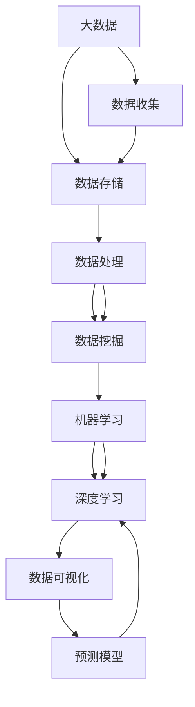
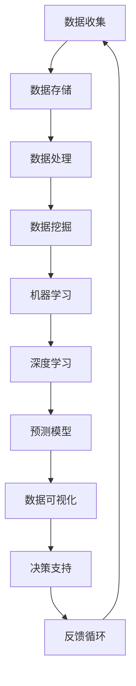

                 

# 未来发展中的大数据与AI

> 关键词：大数据,人工智能,深度学习,机器学习,数据挖掘,机器学习算法,算法优化,数据预处理,数据可视化,预测模型

## 1. 背景介绍

### 1.1 问题由来
随着互联网、物联网、云计算等技术的迅猛发展，全球数据量呈爆炸式增长。以每年约50%的速度增长的大数据，不仅为各行各业带来了前所未有的数据机会，也带来了巨大的数据管理与分析挑战。如何有效处理、挖掘、利用这些海量数据，成为了当前大数据领域的关键问题。与此同时，人工智能(AI)技术的快速发展，使其在数据驱动决策、自动化运营、智能服务等方面发挥了越来越重要的作用。大数据与AI技术的结合，为解决上述问题提供了全新的思路和手段。

### 1.2 问题核心关键点
大数据与AI技术的结合，可以从数据收集、数据存储、数据处理、数据分析、模型训练、模型应用等多个环节，提升数据驱动决策的科学性和准确性。

- **数据收集**：通过传感器、社交媒体、应用系统等手段，高效收集海量数据。
- **数据存储**：利用分布式文件系统、云存储、数据湖等技术，存储和管理大规模数据。
- **数据处理**：运用数据清洗、数据转换、特征工程等技术，提高数据质量。
- **数据分析**：采用统计分析、机器学习、深度学习等方法，挖掘数据价值。
- **模型训练**：通过构建模型、训练参数、优化算法等环节，训练高效预测模型。
- **模型应用**：将训练好的模型部署到实际应用中，实现自动化、智能化的决策支持。

### 1.3 问题研究意义
大数据与AI的结合，能够帮助企业实现以下目标：

1. **提升决策质量**：基于数据的预测和决策，能够显著提升企业决策的科学性和准确性。
2. **优化运营效率**：通过智能监控、预测分析等手段，实现自动化的流程优化和运营管理。
3. **创新服务模式**：结合AI技术，提供个性化、精准化的智能服务，提升用户体验。
4. **加速产品迭代**：利用数据驱动的研发流程，加速产品的研发和迭代。
5. **赋能行业转型**：通过数据和AI技术，推动各行各业的数字化转型，提升行业整体竞争力。

## 2. 核心概念与联系

### 2.1 核心概念概述

为更好地理解大数据与AI的结合，我们介绍以下关键概念：

- **大数据 (Big Data)**：指规模巨大、高速增长、类型多样的数据集合。常见的数据类型包括结构化数据、半结构化数据、非结构化数据等。
- **人工智能 (Artificial Intelligence, AI)**：通过计算机模拟人脑思维方式，实现智能决策和自动化处理。AI技术包括机器学习、深度学习、自然语言处理、计算机视觉等。
- **深度学习 (Deep Learning, DL)**：一种基于人工神经网络的机器学习方法，通过多层次的特征提取，实现复杂的模式识别和决策。
- **机器学习 (Machine Learning, ML)**：利用数据训练模型，使模型能够自主进行数据分类、回归、预测等任务。
- **数据挖掘 (Data Mining)**：从大数据中提取有价值的信息和知识，支持数据驱动的决策。
- **数据预处理 (Data Preprocessing)**：通过数据清洗、数据转换、特征工程等技术，提高数据质量，为后续分析或训练提供支持。
- **数据可视化 (Data Visualization)**：将数据以图形、图表等形式展示，帮助人们直观理解数据。
- **预测模型 (Prediction Model)**：通过模型训练，实现对未来事件的预测，包括时间序列预测、分类预测、回归预测等。

这些核心概念之间存在紧密联系，共同构成了大数据与AI结合的完整生态系统。通过理解这些核心概念，我们可以更好地把握大数据与AI技术的本质和应用场景。

### 2.2 概念间的关系

这些核心概念之间的关系可以通过以下Mermaid流程图来展示：



这个流程图展示了大数据与AI结合的核心概念及其之间的关系：

1. 大数据通过数据收集获得，存放在分布式文件系统或云存储中，经过数据处理和数据挖掘，为机器学习和深度学习提供数据支持。
2. 机器学习和深度学习训练预测模型，用于数据分析和决策支持。
3. 数据可视化帮助理解和解释预测模型。
4. 预测模型通过数据反馈和模型迭代，不断提升预测能力。

这些概念共同构成了大数据与AI结合的完整流程，使其能够在多个场景中发挥强大的分析能力和决策支持作用。

### 2.3 核心概念的整体架构

最后，我们用一个综合的流程图来展示这些核心概念在大数据与AI结合过程中的整体架构：



这个综合流程图展示了从数据收集到决策支持的全流程，其中反馈循环表示数据和模型的持续优化。通过这些流程图，我们可以更清晰地理解大数据与AI结合的整体流程和作用机制。

## 3. 核心算法原理 & 具体操作步骤
### 3.1 算法原理概述

大数据与AI的结合，本质上是通过算法模型从数据中提取有用信息和知识，并用于决策支持的过程。其核心算法包括机器学习算法、深度学习算法、统计分析方法等。

在机器学习中，常见的算法包括线性回归、逻辑回归、决策树、支持向量机等。这些算法通过训练数据集，构建预测模型，用于分类、回归、聚类等任务。

深度学习算法包括卷积神经网络(CNN)、循环神经网络(RNN)、长短时记忆网络(LSTM)等。这些算法通过多层神经网络结构，实现特征自动提取和复杂模式识别。

统计分析方法包括主成分分析(PCA)、独立成分分析(ICA)、关联规则学习(APR)等。这些方法通过数据降维、特征提取、关联分析等手段，提高数据处理和挖掘的效果。

### 3.2 算法步骤详解

大数据与AI结合的核心算法步骤主要包括数据收集、数据预处理、模型训练、模型应用等环节。

**Step 1: 数据收集**
- 使用传感器、社交媒体、应用系统等手段，高效收集海量数据。
- 确定数据收集的范围、频率、格式等，保证数据的时效性和完整性。

**Step 2: 数据预处理**
- 对原始数据进行清洗、去重、转换等处理，保证数据质量。
- 对数据进行特征工程，提取和构造有用特征，提升模型的预测能力。

**Step 3: 模型训练**
- 选择合适的算法和模型，利用预处理后的数据进行训练。
- 利用交叉验证、网格搜索等技术，寻找最优的模型参数。
- 通过迭代训练，不断优化模型性能。

**Step 4: 模型应用**
- 将训练好的模型部署到实际应用中，实现自动化决策支持。
- 根据应用场景，进行模型的调参和优化，提升应用效果。

### 3.3 算法优缺点

大数据与AI结合的优势包括：

1. **数据驱动决策**：通过分析海量数据，发现数据背后的规律和趋势，提供科学、准确的决策支持。
2. **自动化运营**：利用AI技术实现自动化的流程优化和运营管理，提升效率和准确性。
3. **个性化服务**：结合AI技术，提供个性化、精准化的智能服务，提升用户体验。
4. **加速产品迭代**：利用数据驱动的研发流程，加速产品的研发和迭代，缩短上市时间。
5. **赋能行业转型**：通过数据和AI技术，推动各行各业的数字化转型，提升行业整体竞争力。

但同时也存在以下缺点：

1. **数据隐私问题**：在数据收集和处理过程中，可能存在隐私泄露和数据安全问题。
2. **算法偏见问题**：由于训练数据的不均衡或数据质量问题，模型可能存在偏见，导致不公平或歧视性的决策。
3. **计算资源消耗大**：大数据和AI技术需要大量的计算资源和存储空间，对硬件和网络环境要求较高。
4. **模型解释性不足**：复杂模型如深度学习，通常难以解释其决策过程，影响模型的可信度和可控性。
5. **应用复杂度高**：在大数据和AI技术的结合过程中，涉及多个环节和多种技术，应用复杂度较高。

### 3.4 算法应用领域

大数据与AI结合的应用领域广泛，涵盖各行各业。以下是几个典型应用场景：

- **金融领域**：通过大数据和AI技术，实现风险控制、欺诈检测、智能投顾、客户服务等。
- **医疗健康**：利用大数据和AI技术，进行疾病预测、精准医疗、患者管理、健康监测等。
- **零售电商**：通过大数据和AI技术，实现客户细分、库存管理、销售预测、个性化推荐等。
- **智能制造**：结合大数据和AI技术，进行质量控制、设备维护、生产优化、供应链管理等。
- **交通出行**：利用大数据和AI技术，进行智能交通管理、出行预测、路况监测、应急调度等。
- **智慧城市**：结合大数据和AI技术，实现智慧交通、智慧安防、智慧环保、智慧医疗等。
- **教育培训**：通过大数据和AI技术，进行学生评估、个性化教学、内容推荐、学习分析等。

## 4. 数学模型和公式 & 详细讲解  
### 4.1 数学模型构建

在大数据与AI结合的过程中，数学模型起着至关重要的作用。常见的数学模型包括线性回归模型、逻辑回归模型、决策树模型、卷积神经网络模型等。

以线性回归模型为例，其数学模型可以表示为：

$$
y = \beta_0 + \beta_1 x_1 + \beta_2 x_2 + \cdots + \beta_p x_p + \epsilon
$$

其中 $y$ 为因变量，$x_1, x_2, \cdots, x_p$ 为自变量，$\beta_0, \beta_1, \cdots, \beta_p$ 为模型参数，$\epsilon$ 为误差项。线性回归的目标是最小化误差项 $\epsilon$，以拟合最优的线性模型。

### 4.2 公式推导过程

以下我们以线性回归模型为例，推导其参数估计公式。

假设已知 $n$ 个样本点 $(\boldsymbol{x}_i, y_i)$，其中 $\boldsymbol{x}_i = (x_{i1}, x_{i2}, \cdots, x_{ip})^T$，目标是最小化误差项 $\epsilon$。线性回归的目标函数可以表示为：

$$
L(\boldsymbol{\beta}) = \frac{1}{2} \sum_{i=1}^n (y_i - \boldsymbol{x}_i^T \boldsymbol{\beta})^2
$$

通过求偏导数，得到参数估计公式：

$$
\hat{\boldsymbol{\beta}} = (\boldsymbol{X}^T \boldsymbol{X})^{-1} \boldsymbol{X}^T \boldsymbol{y}
$$

其中 $\boldsymbol{X}$ 为自变量矩阵，$\boldsymbol{y}$ 为因变量向量。

在实际应用中，可以通过矩阵计算高效求解该参数估计公式，从而得到最优的模型参数。

### 4.3 案例分析与讲解

以金融领域的信用评分为例，利用线性回归模型进行客户信用评分。假设已知客户的历史信用数据 $(x_1, x_2, \cdots, x_6)$，如信用卡使用情况、贷款还款记录、工作稳定性等，目标是为每个客户预测其信用评分 $y$。

假设模型参数 $\boldsymbol{\beta} = (\beta_0, \beta_1, \cdots, \beta_6)$，通过已知数据进行线性回归训练，得到最优参数估计值 $\hat{\boldsymbol{\beta}}$。利用该模型可以对新客户进行信用评分预测。

## 5. 项目实践：代码实例和详细解释说明
### 5.1 开发环境搭建

在进行大数据与AI结合的实践前，我们需要准备好开发环境。以下是使用Python进行Pandas和Scikit-learn开发的开发环境配置流程：

1. 安装Anaconda：从官网下载并安装Anaconda，用于创建独立的Python环境。

2. 创建并激活虚拟环境：
```bash
conda create -n pytorch-env python=3.8 
conda activate pytorch-env
```

3. 安装必要的库：
```bash
pip install numpy pandas scikit-learn matplotlib jupyter notebook ipython
```

完成上述步骤后，即可在`pytorch-env`环境中开始大数据与AI结合的实践。

### 5.2 源代码详细实现

以下是一个简单的数据预处理和线性回归模型训练的Python代码实现：

```python
import numpy as np
from sklearn.linear_model import LinearRegression
from sklearn.model_selection import train_test_split
from sklearn.metrics import mean_squared_error, r2_score

# 加载数据
X = np.loadtxt('credit_score.csv', delimiter=',')
y = np.loadtxt('credit_score_target.csv', delimiter=',')

# 划分训练集和测试集
X_train, X_test, y_train, y_test = train_test_split(X, y, test_size=0.2, random_state=42)

# 构建线性回归模型
model = LinearRegression()

# 训练模型
model.fit(X_train, y_train)

# 预测并评估模型
y_pred = model.predict(X_test)
mse = mean_squared_error(y_test, y_pred)
r2 = r2_score(y_test, y_pred)

print('均方误差: {:.2f}'.format(mse))
print('R^2: {:.2f}'.format(r2))
```

在这个示例中，我们使用了Pandas和Scikit-learn库进行数据加载、划分、模型训练、预测和评估。通过简单的代码实现，我们可以看到线性回归模型在大数据处理中的应用。

### 5.3 代码解读与分析

让我们再详细解读一下关键代码的实现细节：

**加载数据**：
- 使用`np.loadtxt`函数加载数据，支持多种数据格式，如CSV、TXT等。
- 注意指定数据的分隔符和文件路径，确保数据加载的正确性。

**模型训练**：
- 使用`LinearRegression`类创建线性回归模型，初始化参数。
- 使用`fit`方法对模型进行训练，传入训练数据。

**模型预测**：
- 使用`predict`方法对测试集数据进行预测，得到预测结果。

**模型评估**：
- 使用`mean_squared_error`和`r2_score`函数计算预测结果的均方误差和R^2得分，评估模型性能。
- 均方误差表示预测值与真实值之间的平均偏差。
- R^2得分表示模型解释数据变异的比例，值越接近1表示模型越好。

**代码实现**：
- 通过简单的数据加载、划分、模型训练、预测和评估，可以看到线性回归模型在大数据处理中的应用。
- 代码实现简洁高效，能够快速完成数据处理和模型训练。

## 6. 实际应用场景
### 6.1 智能客服系统

大数据与AI结合的智能客服系统，能够自动理解客户咨询意图，快速响应客户需求，提升客户满意度。

通过收集客户的历史咨询记录、语音数据、文本数据等，可以构建客户行为特征和咨询意图模型。利用该模型，可以对新客户咨询进行意图识别和情感分析，匹配最佳回答模板，自动生成回复，实现自动化客服服务。

**案例分析**：
- 假设某电商平台的客服系统，利用客户的历史咨询数据进行训练，构建客户行为和意图模型。
- 当新客户咨询“退换货”时，系统自动识别该咨询意图，根据模型预测最佳回答模板，生成自动化回复，提升客户满意度。

### 6.2 金融风控系统

大数据与AI结合的金融风控系统，能够实时监控客户行为，识别潜在风险，降低金融欺诈和信用风险。

通过收集客户的交易记录、社交媒体数据、网络行为数据等，可以构建客户行为风险模型。利用该模型，可以对客户进行实时监控，识别异常交易行为，进行风险预警和防控。

**案例分析**：
- 假设某银行的信用卡风控系统，利用客户的信用卡交易数据进行训练，构建客户行为风险模型。
- 当客户出现异常交易行为时，系统自动预警并采取防控措施，降低信用风险和金融欺诈。

### 6.3 医疗诊断系统

大数据与AI结合的医疗诊断系统，能够帮助医生进行疾病诊断和辅助治疗。

通过收集患者的病历数据、影像数据、基因数据等，可以构建疾病诊断模型。利用该模型，可以对患者进行疾病诊断，提供治疗建议，辅助医生进行决策。

**案例分析**：
- 假设某医院的医疗诊断系统，利用患者的病历数据进行训练，构建疾病诊断模型。
- 当患者进入医院进行检查时，系统自动进行疾病诊断，提供治疗建议，辅助医生进行诊断和治疗。

## 7. 工具和资源推荐
### 7.1 学习资源推荐

为了帮助开发者系统掌握大数据与AI结合的理论基础和实践技巧，这里推荐一些优质的学习资源：

1. **《机器学习实战》**：斯坦福大学Andrew Ng教授的经典教材，详细介绍了机器学习的基本概念和算法实现。
2. **《深度学习》**：Ian Goodfellow等编著的深度学习经典教材，深入浅出地介绍了深度学习的原理和应用。
3. **《Python数据科学手册》**：Jake VanderPlas等编著的数据科学工具书，介绍了Pandas、NumPy、Scikit-learn等常用工具的实现和使用。
4. **《数据科学入门》**：Coursera平台提供的入门课程，涵盖数据科学的基本概念和实战项目。
5. **Kaggle**：数据科学竞赛平台，提供了大量的数据集和实战项目，帮助开发者提高实践能力。

通过对这些资源的学习实践，相信你一定能够快速掌握大数据与AI结合的精髓，并用于解决实际的业务问题。

### 7.2 开发工具推荐

高效的开发离不开优秀的工具支持。以下是几款用于大数据与AI结合开发的常用工具：

1. **Jupyter Notebook**：开源的交互式编程环境，支持多种编程语言和数据处理工具，如Python、R、Scala等。
2. **TensorFlow**：由Google主导开发的开源深度学习框架，生产部署方便，适合大规模工程应用。
3. **Pandas**：开源的数据处理和分析工具，支持多种数据格式和操作，如CSV、Excel、SQL等。
4. **Scikit-learn**：开源的机器学习库，提供了多种算法和工具，支持数据预处理、模型训练、评估等。
5. **Hadoop**：开源的分布式计算平台，支持大规模数据处理和分析，适合大数据应用场景。
6. **Apache Spark**：开源的大数据处理和计算框架，支持多种数据源和计算任务，适合大数据实时分析。
7. **Tableau**：数据可视化工具，支持多种数据源和图表展示，帮助人们直观理解数据。

合理利用这些工具，可以显著提升大数据与AI结合任务的开发效率，加快创新迭代的步伐。

### 7.3 相关论文推荐

大数据与AI结合的研究源于学界的持续研究。以下是几篇奠基性的相关论文，推荐阅读：

1. **《机器学习》**：Tom Mitchell著的经典教材，详细介绍了机器学习的基本概念和算法实现。
2. **《深度学习》**：Ian Goodfellow等编著的深度学习经典教材，深入浅出地介绍了深度学习的原理和应用。
3. **《大数据技术：大规模数据处理与分析》**：王星、顾全面等编著的数据库技术书籍，介绍了大数据技术的实现和应用。
4. **《分布式大数据处理框架：Hadoop和Spark》**：李凯军编著的分布式计算书籍，介绍了Hadoop和Spark的实现和应用。
5. **《大数据与人工智能结合：理论与实践》**：陈飞等编著的数据科学书籍，介绍了大数据与AI结合的理论和实践方法。

这些论文代表了大数据与AI结合研究的发展脉络。通过学习这些前沿成果，可以帮助研究者把握学科前进方向，激发更多的创新灵感。

除上述资源外，还有一些值得关注的前沿资源，帮助开发者紧跟大数据与AI结合技术的最新进展，例如：

1. **arXiv论文预印本**：人工智能领域最新研究成果的发布平台，包括大量尚未发表的前沿工作，学习前沿技术的必读资源。
2. **Google AI博客**：Google AI团队发布的最新研究和技术进展，涵盖深度学习、机器学习、自然语言处理等多个领域。
3. **Microsoft Research博客**：Microsoft Research团队发布的最新研究和技术进展，涵盖数据科学、人工智能、计算机视觉等多个领域。
4. **KDnuggets**：数据科学社区网站，提供最新的技术文章、教程和实战案例。
5. **DataCamp**：在线数据科学学习平台，提供丰富的课程和实战项目，帮助开发者提高实践能力。

总之，对于大数据与AI结合技术的学习和实践，需要开发者保持开放的心态和持续学习的意愿。多关注前沿资讯，多动手实践，多思考总结，必将收获满满的成长收益。

## 8. 总结：未来发展趋势与挑战
### 8.1 总结

本文对大数据与AI结合的理论与实践进行了全面系统的介绍。首先阐述了大数据与AI结合的研究背景和意义，明确了其在大数据处理、AI算法优化、数据可视化、预测模型训练等方面的重要价值。其次，从原理到实践，详细讲解了大数据与AI结合的数学模型和关键算法步骤，给出了详细的代码实现和案例分析。同时，本文还广泛探讨了大数据与AI结合在智能客服、金融风控、医疗诊断等多个领域的应用前景，展示了其在各行业中的强大应用潜力。最后，本文精选了大数据与AI结合的相关学习资源、开发工具和经典论文，力求为读者提供全方位的技术指引。

通过本文的系统梳理，可以看到，大数据与AI结合技术正在成为企业智能化转型的重要引擎，其应用前景广阔，能够显著提升企业决策质量、运营效率和客户体验。未来，伴随大数据与AI技术的持续演进，必将在更多领域带来变革性影响。

### 8.2 未来发展趋势

展望未来，大数据与AI结合技术将呈现以下几个发展趋势：

1. **深度学习技术持续发展**：深度学习算法的不断优化和普及，将进一步提升大数据处理和分析的精度和效率。
2. **联邦学习兴起**：联邦学习通过分布式训练，保护数据隐私，成为未来数据共享和协同学习的趋势。
3. **自动化机器学习普及**：自动化机器学习平台，如AutoML，将极大降低数据科学家和开发者的工作量，推动机器学习应用的普及。
4. **多模态数据融合**：结合图像、语音、文本等多种模态数据，提升数据的综合分析能力，拓展AI应用场景。
5. **边缘计算发展**：边缘计算将数据处理和分析从云端迁移至设备端，提升数据处理的实时性和效率。
6. **AI伦理和可解释性提升**：AI技术的应用需要考虑伦理和可解释性问题，提升模型的透明性和可信度。
7. **AI与业务结合更紧密**：AI技术将更深入地融入业务流程，推动企业数字化转型的加速。

以上趋势凸显了大数据与AI结合技术的广阔前景。这些方向的探索发展，必将进一步提升大数据与AI结合的性能和应用范围，为各行各业带来新的变革。

### 8.3 面临的挑战

尽管大数据与AI结合技术已经取得了瞩目成就，但在迈向更加智能化、普适化应用的过程中，它仍面临着诸多挑战：

1. **数据隐私和安全问题**：在大数据处理过程中，如何保护用户隐私和数据安全，防止数据泄露和滥用，是亟需解决的问题。
2. **模型泛化能力不足**：模型在训练数据和测试数据之间的泛化性能不足，导致模型在新数据上的表现不佳。
3. **计算资源消耗大**：大数据和AI技术需要大量的计算资源和存储空间，对硬件和网络环境要求较高。
4. **模型解释性不足**：复杂模型如深度学习，通常难以解释其决策过程，影响模型的可信度和可控性。
5. **应用复杂度高**：在大数据和AI技术的结合过程中，涉及多个环节和多种技术，应用复杂度较高。
6. **技术标准化不足**：不同的大数据和AI平台和工具之间的兼容性不足，导致应用开发和维护成本高。
7. **人才匮乏**：大数据和AI技术需要复合型人才，但目前市场上这类人才较为稀缺，难以满足实际需求。

正视大数据与AI结合面临的这些挑战，积极应对并寻求突破，将是大数据与AI结合技术走向成熟的必由之路。

### 8.4 研究展望

面对大数据与AI结合所面临的种种挑战，未来的研究需要在以下几个方面寻求新的突破：

1. **探索高效数据处理和分析技术**：开发高效的数据处理和分析算法，提升数据处理的实时性和效率。
2. **研究数据隐私保护技术**：研究数据隐私保护方法，保护用户隐私和数据安全。
3. **优化深度学习算法**：优化深度学习算法，提升模型的泛化能力和解释性。
4. **开发自动化机器学习平台**：开发自动化机器学习平台，降低模型开发和调参的难度。
5. **促进多模态数据融合**：研究多模态数据的融合方法，提升数据的综合分析能力。
6. **推动AI伦理

