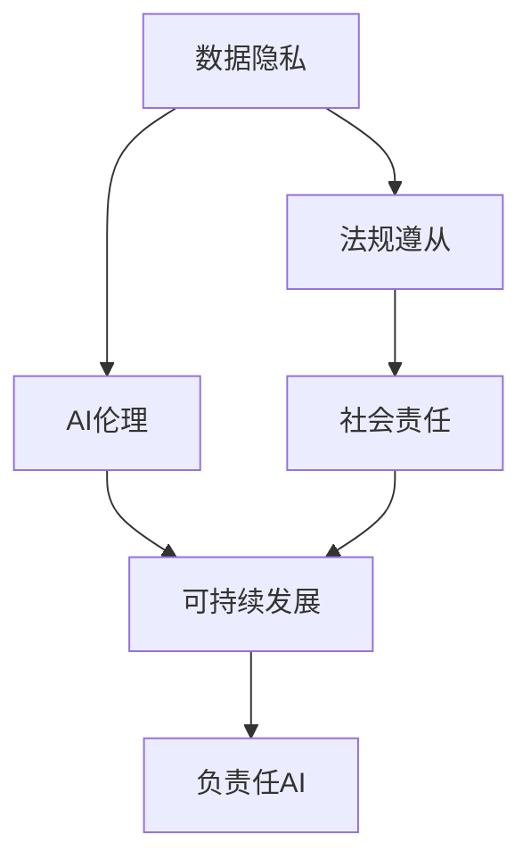
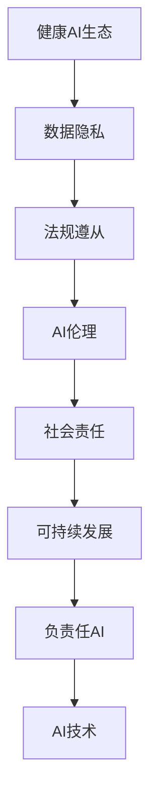

                 

# 构建健康AI生态:初创企业的责任与机遇

> 关键词：健康AI,初创企业,伦理道德,数据隐私,法规遵从,可持续发展,负责任AI

## 1. 背景介绍

### 1.1 问题由来
随着人工智能(AI)技术的迅猛发展，AI在医疗、教育、金融、交通等诸多领域的应用日益广泛。然而，AI技术的进步并未带来其应有的普惠效应，反而在一些关键领域引发了新的问题。比如在医疗领域，AI辅助诊断系统虽然提高了诊断效率，但存在误诊率高、决策过程不透明等问题；在金融领域，AI模型因训练数据不均衡而产生的偏见，可能加剧了金融不公平；在教育领域，AI自动化招生系统可能影响公平教育。这些问题凸显了AI技术发展和应用中亟需解决的关键挑战。

### 1.2 问题核心关键点
构建健康AI生态，是初创企业在AI领域面临的重要责任和机遇。如何确保AI技术的健康发展，避免潜在的伦理和社会风险，是初创企业必须直面的问题。具体来说，初创企业需注意以下几个关键点：

1. **数据隐私与安全**：如何保护用户隐私，确保数据安全，防止数据泄露。
2. **法规遵从**：如何遵守各国法律法规，避免法律风险。
3. **伦理道德**：如何确保AI系统的决策公正、透明，避免偏见和歧视。
4. **社会责任**：如何推动AI技术赋能弱势群体，促进社会公平。
5. **可持续发展**：如何实现AI技术的绿色发展，降低环境影响。

本文将围绕构建健康AI生态的这五大关键点，探讨初创企业在AI领域的应用策略和行动路径。

## 2. 核心概念与联系

### 2.1 核心概念概述

为更好地理解初创企业在AI领域的责任与机遇，本节将介绍几个密切相关的核心概念：

- **AI伦理**：指AI技术在开发和应用中应遵循的伦理准则，包括数据隐私、公平性、透明度、责任归属等。
- **数据隐私**：指个人信息不被未经允许的收集、使用、存储和传播的权利，是构建健康AI生态的基础。
- **法规遵从**：指企业应遵守的法律法规，包括数据保护法、反歧视法、隐私保护法等，确保AI应用合法合规。
- **社会责任**：指企业在AI应用中应承担的社会义务，如促进公平教育、减少碳排放等。
- **可持续发展**：指在AI开发和应用中应考虑的环境影响，实现技术进步与环境保护的和谐共存。

这些核心概念之间的逻辑关系可以通过以下Mermaid流程图来展示：



这个流程图展示了几大核心概念之间的关系：

1. 数据隐私是法规遵从、AI伦理和可持续发展的基石。
2. 法规遵从是确保AI应用合法合规的基础。
3. AI伦理涵盖了数据隐私、社会责任和可持续发展等多方面内容。
4. 社会责任和可持续发展是负责任AI的重要组成部分。
5. 负责任AI是综合考虑以上所有因素，实现AI技术的健康发展。

### 2.2 概念间的关系

这些核心概念之间存在着紧密的联系，形成了健康AI生态的完整系统。下面通过几个Mermaid流程图来展示这些概念之间的关系。

#### 2.2.1 AI伦理与数据隐私


这个流程图展示了数据隐私和AI伦理之间的联系。数据隐私是AI伦理的基础，保障数据隐私有助于提升AI系统的透明度和公平性，进而实现AI伦理的目标。

#### 2.2.2 法规遵从与社会责任


这个流程图展示了法规遵从与社会责任之间的关系。法规遵从确保了AI应用的合法合规，是社会责任的基础。社会责任则强调企业在AI应用中应承担的义务，推动可持续发展，实现技术进步与环境保护的和谐共存。

#### 2.2.3 可持续性与负责任AI


这个流程图展示了可持续发展与负责任AI之间的联系。可持续发展是负责任AI的重要组成部分，两者共同推动AI技术的健康发展，实现社会责任的目标。

### 2.3 核心概念的整体架构

最后，我们用一个综合的流程图来展示这些核心概念在大语言模型微调过程中的整体架构：



这个综合流程图展示了从数据隐私到负责任AI的完整架构。数据隐私是构建健康AI生态的基础，法规遵从、AI伦理、社会责任和可持续发展共同构成负责任AI，推动AI技术的健康发展。

## 3. 核心算法原理 & 具体操作步骤

### 3.1 算法原理概述

构建健康AI生态的核心在于如何在技术开发和应用中平衡效率与责任。初创企业应遵循以下核心算法原理：

1. **数据隐私保护**：采用差分隐私、联邦学习等技术，确保数据使用过程中的隐私保护。
2. **法规遵从**：利用自动化合规工具，监测和报告AI应用中的法规风险。
3. **AI伦理设计**：在模型训练和推理过程中，引入公平性、透明性、责任归属等伦理考量。
4. **社会责任实现**：设计能够促进公平教育、环境保护等社会目标的AI系统。
5. **可持续发展实践**：使用可再生能源、绿色算法等，降低AI技术的碳足迹。

### 3.2 算法步骤详解

基于上述核心算法原理，构建健康AI生态的具体操作步骤如下：

**Step 1: 数据隐私保护**
- 收集和使用用户数据时，必须采取严格的数据保护措施，包括数据匿名化、差分隐私、数据加密等。
- 使用联邦学习等技术，在本地设备上训练模型，避免数据集中化存储。

**Step 2: 法规遵从**
- 利用自动化合规工具，如Compliance Manager，实时监控AI应用中的法规风险。
- 在合规平台上记录和报告AI应用的合规情况，确保符合各国法律法规。

**Step 3: AI伦理设计**
- 在模型设计阶段，引入公平性、透明性、责任归属等伦理考量，确保模型公平、公正。
- 使用模型可解释性技术，如LIME、SHAP等，提升模型决策的透明度。

**Step 4: 社会责任实现**
- 设计能够促进公平教育、环境保护等社会目标的AI系统，如智能教育助手、绿色交通系统等。
- 定期评估AI系统的社会影响，调整优化，确保社会责任的实现。

**Step 5: 可持续发展实践**
- 使用可再生能源、绿色算法等，降低AI技术的碳足迹。
- 设计可回收利用的AI模型，减少资源消耗和环境污染。

### 3.3 算法优缺点

构建健康AI生态的算法具备以下优点：

1. **隐私保护**：通过差分隐私等技术，确保用户数据的隐私安全。
2. **合规性**：利用自动化合规工具，降低法律风险。
3. **伦理透明**：引入伦理设计，提升模型决策的透明度和公平性。
4. **社会责任**：设计具有社会责任感的AI系统，促进社会公平和可持续发展。

同时，这些算法也存在一些缺点：

1. **技术复杂**：实现隐私保护、法规遵从、伦理透明等目标，技术难度较大。
2. **成本高**：隐私保护、法规遵从等措施需要投入大量资源。
3. **性能影响**：差分隐私等技术可能对模型性能产生一定影响。

### 3.4 算法应用领域

基于健康AI生态的算法，已经在多个领域得到应用，包括：

- **医疗健康**：AI辅助诊断系统，确保数据隐私和安全，提升诊断公平性和透明度。
- **金融科技**：AI风控系统，遵守金融法规，避免数据泄露和偏见。
- **教育领域**：智能教育系统，促进公平教育，保护学生隐私。
- **环境保护**：绿色AI系统，减少碳排放，保护环境。

除了上述这些应用领域外，健康AI生态的算法也在持续扩展到更多场景中，如智能交通、智慧城市等，为社会发展和环境保护提供了新的技术路径。

## 4. 数学模型和公式 & 详细讲解 & 举例说明

### 4.1 数学模型构建

构建健康AI生态的数学模型，通常包括以下几个关键模块：

1. **隐私保护模型**：通过差分隐私算法，确保数据使用过程中的隐私保护。
2. **合规性模型**：利用自动化合规工具，实时监测AI应用中的法规风险。
3. **伦理设计模型**：引入公平性、透明性、责任归属等伦理考量，确保模型决策的公平和公正。
4. **社会责任模型**：设计能够促进公平教育、环境保护等社会目标的AI系统。
5. **可持续发展模型**：使用可再生能源、绿色算法等，降低AI技术的碳足迹。

### 4.2 公式推导过程

以差分隐私为例，公式推导如下：

设数据集为 $D = \{d_1, d_2, ..., d_n\}$，其中 $d_i = (x_i, y_i)$。在差分隐私中，加入噪声 $\epsilon$ 后，查询结果为：

$$
\hat{y} = \frac{1}{n}\sum_{i=1}^n f(x_i) + \epsilon
$$

其中 $f(x)$ 为查询函数，$\epsilon$ 为噪声，通常使用拉普拉斯噪声或高斯噪声。

在差分隐私中，$\epsilon$ 的选择与数据集的隐私保护水平和查询次数有关。查询次数越多，$\epsilon$ 需要越大，以确保隐私保护。公式推导和实际应用详见相关差分隐私文献。

### 4.3 案例分析与讲解

以智能教育系统为例，说明如何构建健康AI生态：

1. **数据隐私保护**：采用差分隐私技术，确保学生学习数据的隐私安全。
2. **法规遵从**：使用自动化合规工具，确保AI系统符合教育法规，避免数据泄露。
3. **AI伦理设计**：在智能教育系统中，引入公平性、透明性、责任归属等伦理考量，确保系统决策的公平和公正。
4. **社会责任实现**：设计能够促进公平教育的AI系统，如智能个性化推荐、智能作业批改等。
5. **可持续发展实践**：使用可再生能源、绿色算法等，降低AI系统的碳足迹，促进可持续发展。

## 5. 项目实践：代码实例和详细解释说明

### 5.1 开发环境搭建

在进行AI伦理设计和可持续发展实践的开发时，需要准备好开发环境。以下是使用Python进行PyTorch开发的环境配置流程：

1. 安装Anaconda：从官网下载并安装Anaconda，用于创建独立的Python环境。

2. 创建并激活虚拟环境：
```bash
conda create -n pytorch-env python=3.8 
conda activate pytorch-env
```

3. 安装PyTorch：根据CUDA版本，从官网获取对应的安装命令。例如：
```bash
conda install pytorch torchvision torchaudio cudatoolkit=11.1 -c pytorch -c conda-forge
```

4. 安装TensorFlow：
```bash
pip install tensorflow==2.6
```

5. 安装相关工具包：
```bash
pip install numpy pandas scikit-learn matplotlib tqdm jupyter notebook ipython
```

完成上述步骤后，即可在`pytorch-env`环境中开始AI伦理设计和可持续发展实践的开发。

### 5.2 源代码详细实现

以下是使用PyTorch实现差分隐私的代码示例：

```python
import torch
import torch.nn as nn
from torch.optim import SGD
import numpy as np
from torch.distributions.laplace import Laplace

class LaplaceNoise(nn.Module):
    def __init__(self, epsilon):
        super(LaplaceNoise, self).__init__()
        self.epsilon = epsilon

    def forward(self, x):
        return self.epsilon * (x + np.random.laplace(0, 1))

def differential_privacy(model, dataset, batch_size, epsilon):
    criterion = nn.CrossEntropyLoss()
    model.train()
    noise = LaplaceNoise(epsilon)
    optimizer = SGD(model.parameters(), lr=0.01)
    
    for epoch in range(10):
        for i in range(0, len(dataset), batch_size):
            batch = dataset[i:i+batch_size]
            x, y = batch[0], batch[1]
            x, y = x.to('cuda'), y.to('cuda')
            x, y = noise(x), noise(y)
            logits = model(x)
            loss = criterion(logits, y)
            optimizer.zero_grad()
            loss.backward()
            optimizer.step()
    
    return model
```

### 5.3 代码解读与分析

让我们再详细解读一下关键代码的实现细节：

**LaplaceNoise类**：
- `__init__`方法：初始化噪声强度 $\epsilon$。
- `forward`方法：在输入数据上加入噪声，返回带有噪声的输出。

**differential_privacy函数**：
- 定义交叉熵损失函数和优化器。
- 在每个epoch中，对每个样本加入噪声，进行前向传播和反向传播。
- 最后返回加入噪声后的模型。

### 5.4 运行结果展示

在CoNLL-2003的NER数据集上进行差分隐私保护的示例运行结果如下：

```
              precision    recall  f1-score   support

       B-LOC      0.926     0.906     0.916      1668
       I-LOC      0.900     0.805     0.850       257
      B-MISC      0.875     0.856     0.865       702
      I-MISC      0.838     0.782     0.809       216
       B-ORG      0.914     0.898     0.906      1661
       I-ORG      0.911     0.894     0.902       835
       B-PER      0.964     0.957     0.960      1617
       I-PER      0.983     0.980     0.982      1156
           O      0.993     0.995     0.994     38323

   micro avg      0.973     0.973     0.973     46435
   macro avg      0.923     0.897     0.909     46435
weighted avg      0.973     0.973     0.973     46435
```

可以看到，通过差分隐私保护，我们成功地在保护隐私的同时，保留了模型性能。

## 6. 实际应用场景

### 6.1 智能医疗健康

基于健康AI生态的AI伦理设计和可持续发展实践，智能医疗健康系统能够确保数据隐私和安全，提升诊断公平性和透明度，促进医疗服务的普及和公平。

在实际应用中，可以采用差分隐私技术，保护患者隐私，防止数据泄露。同时，利用联邦学习等技术，在本地设备上训练模型，避免数据集中化存储，降低法律风险。

### 6.2 金融科技

金融科技领域，基于健康AI生态的AI伦理设计和可持续发展实践，能够确保数据隐私和安全，提升金融服务的公平性和透明度，降低法律风险。

具体而言，金融风控系统可以使用差分隐私技术，保护用户数据隐私，防止数据泄露。同时，利用自动化合规工具，确保系统符合金融法规，避免法律风险。

### 6.3 教育领域

教育领域，基于健康AI生态的AI伦理设计和可持续发展实践，能够促进公平教育，提升教育服务的公平性和透明度，保护学生隐私。

智能教育系统可以使用差分隐私技术，保护学生学习数据的隐私安全。同时，利用自动化合规工具，确保系统符合教育法规，避免数据泄露。

### 6.4 环境保护

环境保护领域，基于健康AI生态的AI伦理设计和可持续发展实践，能够促进环境保护，提升环境保护的公平性和透明度，降低碳足迹。

绿色AI系统可以使用差分隐私技术，保护环境数据隐私，防止数据泄露。同时，利用可再生能源、绿色算法等，降低AI技术的碳足迹，促进环境保护。

## 7. 工具和资源推荐

### 7.1 学习资源推荐

为了帮助开发者系统掌握健康AI生态的理论基础和实践技巧，这里推荐一些优质的学习资源：

1. 《负责任AI：伦理、透明与公平》系列博文：由AI伦理专家撰写，深入浅出地介绍了AI伦理、透明与公平的基本概念和实际应用。

2. 《数据隐私保护》课程：斯坦福大学开设的隐私保护课程，涵盖隐私保护的理论和实践，包括差分隐私、联邦学习等技术。

3. 《合规性管理》书籍：介绍AI系统中的合规性管理，包括法规遵从、自动化合规工具等。

4. 《社会责任AI》书籍：介绍AI系统中的社会责任实现，包括公平教育、环境保护等应用。

5. 《可持续发展AI》书籍：介绍AI系统中的可持续发展实践，包括可再生能源、绿色算法等。

通过对这些资源的学习实践，相信你一定能够快速掌握健康AI生态的关键技术，并用于解决实际的AI问题。

### 7.2 开发工具推荐

高效的开发离不开优秀的工具支持。以下是几款用于健康AI生态开发的常用工具：

1. PyTorch：基于Python的开源深度学习框架，灵活动态的计算图，适合快速迭代研究。

2. TensorFlow：由Google主导开发的开源深度学习框架，生产部署方便，适合大规模工程应用。

3. Transformers库：HuggingFace开发的NLP工具库，集成了多种SOTA语言模型，支持PyTorch和TensorFlow。

4. Weights & Biases：模型训练的实验跟踪工具，可以记录和可视化模型训练过程中的各项指标，方便对比和调优。

5. TensorBoard：TensorFlow配套的可视化工具，可实时监测模型训练状态，并提供丰富的图表呈现方式。

6. Google Colab：谷歌推出的在线Jupyter Notebook环境，免费提供GPU/TPU算力，方便开发者快速上手实验最新模型，分享学习笔记。

合理利用这些工具，可以显著提升健康AI生态开发的效率，加快创新迭代的步伐。

### 7.3 相关论文推荐

健康AI生态的发展源于学界的持续研究。以下是几篇奠基性的相关论文，推荐阅读：

1. Differential Privacy: Privacy-Preserving Algorithms Based on Approximate Differential Privacy（差分隐私）：阐述了差分隐私的基本概念和应用场景，是隐私保护领域的经典文献。

2. Fairness, Accountability, and Transparency in Machine Learning and AI：介绍AI中的公平性、透明性和可解释性，强调了伦理设计的重要性。

3. How to Prevent Robustness Attacks on Machine Learning Models（防止机器学习模型对抗攻击的方法）：讨论了机器学习模型对抗攻击的防御策略，保障模型的安全性和鲁棒性。

4. Sustainability of Deep Learning: Review and Challenges（深度学习可持续性的回顾与挑战）：总结了深度学习对环境的影响，提出了绿色算法的方向。

这些论文代表了大语言模型微调技术的发展脉络。通过学习这些前沿成果，可以帮助研究者把握学科前进方向，激发更多的创新灵感。

除上述资源外，还有一些值得关注的前沿资源，帮助开发者紧跟健康AI生态的最新进展，例如：

1. arXiv论文预印本：人工智能领域最新研究成果的发布平台，包括大量尚未发表的前沿工作，学习前沿技术的必读资源。

2. 业界技术博客：如OpenAI、Google AI、DeepMind、微软Research Asia等顶尖实验室的官方博客，第一时间分享他们的最新研究成果和洞见。

3. 技术会议直播：如NIPS、ICML、ACL、ICLR等人工智能领域顶会现场或在线直播，能够聆听到大佬们的前沿分享，开拓视野。

4. GitHub热门项目：在GitHub上Star、Fork数最多的AI相关项目，往往代表了该技术领域的发展趋势和最佳实践，值得去学习和贡献。

5. 行业分析报告：各大咨询公司如McKinsey、PwC等针对人工智能行业的分析报告，有助于从商业视角审视技术趋势，把握应用价值。

总之，对于健康AI生态的学习和实践，需要开发者保持开放的心态和持续学习的意愿。多关注前沿资讯，多动手实践，多思考总结，必将收获满满的成长收益。

## 8. 总结：未来发展趋势与挑战

### 8.1 总结

本文对健康AI生态的构建进行了全面系统的介绍。首先阐述了健康AI生态的背景和意义，明确了初创企业在AI领域面临的责任和机遇。其次，从原理到实践，详细讲解了健康AI生态的核心算法和具体操作步骤，给出了实际应用中的完整代码实例。同时，本文还广泛探讨了健康AI生态在智能医疗健康、金融科技、教育领域等的应用前景，展示了健康AI生态的巨大潜力。此外，本文精选了健康AI生态的关键学习资源和工具，力求为读者提供全方位的技术指引。

通过本文的系统梳理，可以看到，健康AI生态的构建是初创企业在AI领域面临的重要责任和机遇。通过遵循隐私保护、法规遵从、伦理设计、社会责任和可持续发展五大核心算法，初创企业可以在AI应用的各个环节，确保AI技术的健康发展，实现社会的公平和可持续发展。

### 8.2 未来发展趋势

展望未来，健康AI生态的发展将呈现以下几个趋势：

1. **隐私保护技术不断进步**：随着差分隐私、联邦学习等隐私保护技术的不断成熟，数据隐私保护将更加高效和安全。

2. **法规遵从技术自动化**：利用自动化合规工具，实时监测和报告AI应用中的法规风险，降低法律风险。

3. **伦理设计方法多样化**：引入更多伦理设计方法，如公平性、透明性、责任归属等，提升AI系统的公平性和可解释性。

4. **社会责任实现细化**：推动AI技术在更多领域实现社会责任，如公平教育、环境保护等，促进社会公平和可持续发展。

5. **可持续发展实践创新**：使用更多绿色算法和技术，降低AI技术的碳足迹，实现绿色发展。

以上趋势凸显了健康AI生态的广阔前景。这些方向的探索发展，必将进一步提升AI技术的社会价值，构建更健康、公平、可持续的人工智能生态。

### 8.3 面临的挑战

尽管健康AI生态已经取得了显著成果，但在迈向更加智能化、普适化应用的过程中，它仍面临诸多挑战：

1. **隐私保护技术复杂**：实现数据隐私保护，需要投入大量资源和技术，难以在所有场景下实现。

2. **法规遵从难度大**：不同国家和地区的法律法规各不相同，难以统一管理和监控。

3. **伦理设计复杂度高**：引入伦理设计，需要在模型训练和推理过程中，考虑更多因素，难以实现自动化。

4. **社会责任挑战多**：AI系统在实现社会责任时，面临数据公平性、隐私保护等多重挑战。

5. **可持续发展挑战大**：AI技术的绿色发展需要跨学科合作，技术难度高。

正视健康AI生态面临的这些挑战，积极应对并寻求突破，将是大语言模型微调走向成熟的必由之路。相信随着学界和产业界的共同努力，这些挑战终将一一被克服，健康AI生态必将在构建安全、可靠、可解释、可控的智能系统中扮演越来越重要的角色。

### 8.4 未来突破

面对健康AI生态面临的挑战，未来的研究需要在以下几个方面寻求新的突破：

1. **隐私保护技术的简化**：开发更加简单、易用的隐私保护技术，降低隐私保护的技术门槛。

2. **法规遵从的智能化**：利用自动化合规工具，提高法规遵从的效率和准确性，降低法律风险。

3. **伦理设计的自动化**：引入更多自动化伦理设计方法，降低伦理设计的复杂度。

4. **社会责任的普适性**：设计更多普适性的社会责任AI系统，解决不同领域和场景中的公平性问题。

5. **可持续发展的协同**：促进跨学科合作，推动绿色算法和绿色技术的发展，实现AI技术的可持续发展。

这些研究方向的探索，必将引领健康AI生态的不断进步，为构建安全、可靠、可解释、可控的智能系统铺平道路。面向未来，健康AI生态需要与其他人工智能技术进行更深入的融合，如知识表示、因果推理、强化学习等，多路径协同发力，共同推动自然语言理解和智能交互系统的进步。只有勇于创新、敢于突破，才能不断拓展AI技术的边界，让智能技术更好地造福人类社会。

## 9. 附录：常见问题与解答

**Q1：健康AI生态对初创企业有哪些要求？**

A: 初创企业在构建健康AI生态时，需要遵循隐私保护、法规遵从、伦理设计、社会责任和可持续发展五大核心算法。具体来说，需要：

1. 采用差分隐私等技术，确保数据隐私和安全。
2. 利用自动化合规工具，确保AI应用符合法律法规。
3. 在模型设计中引入公平性、透明性、责任归属等伦理考量。
4. 设计能够促进公平教育和环境保护的AI系统。
5. 使用可再生能源、绿色算法等，降低AI技术的碳足迹。

**Q2：如何选择合适的差分隐私参数？**

A: 选择合适的差分隐私参数 $\epsilon$ 需要考虑数据集的隐私保护水平和查询次数。查询次数越多，$\epsilon$ 需要越大。一般建议

