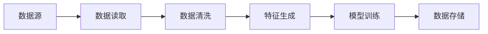
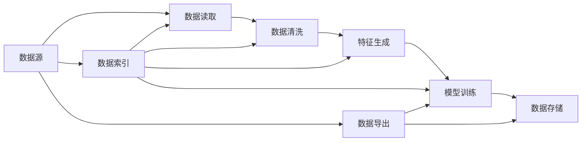

                 

# 框架原生的数据处理流 Data Connection

## 1. 背景介绍

在现代软件开发中，数据处理流（Data Pipeline）已成为不可或缺的关键组件。数据处理流是构建复杂、高效、可扩展系统的重要手段，可以支持诸如数据清洗、特征工程、模型训练和预测等操作。然而，在构建数据处理流时，常常会面临数据异构、处理逻辑复杂、系统整合困难等问题。本文将介绍一种框架原生的数据处理流，通过引入原生API和工具，帮助开发者更高效、更简单地构建复杂的数据处理流系统。

## 2. 核心概念与联系

### 2.1 核心概念概述

为更好地理解框架原生的数据处理流，我们首先介绍几个关键概念：

- **数据处理流 (Data Pipeline)**：指通过一系列处理组件对数据进行抽取、转换和加载的操作，最终输出数据用于分析和应用。数据处理流常用于ETL (Extract, Transform, Load) 和 EDA (Exploratory Data Analysis) 等场景。

- **框架原生 (Native Framework)**：指数据处理流直接集成在特定编程语言或框架中，支持框架提供的标准API和工具。通过框架原生API，可以更便捷地构建复杂的数据处理流程。

- **数据源 (Data Source)**：指提供数据输入的数据源，包括文件、数据库、API等。

- **数据存储 (Data Storage)**：指存储数据的目的地，包括文件、数据库、数据仓库等。

- **数据处理组件 (Data Processing Component)**：指数据处理流中的具体组件，如数据读取、数据清洗、特征生成、模型训练等。

这些概念之间通过一系列管道连接起来，形成数据处理流，如图1所示：



### 2.2 概念间的关系

通过数据处理流，开发者可以方便地将数据源、数据存储和多个数据处理组件连接起来，形成一个完整的处理流程。同时，框架原生的API和工具，可以极大地简化数据处理流的构建过程，使得系统开发更加高效。

以下是一个更详细的流程图，展示数据处理流中各组件之间的关系：



这个流程图展示了数据处理流中各组件之间的关系，包括数据源的索引和导出、数据读取、数据清洗、特征生成、模型训练和数据存储。通过这些组件，数据处理流实现了从数据源到数据存储的完整处理流程。

## 3. 核心算法原理 & 具体操作步骤

### 3.1 算法原理概述

框架原生的数据处理流基于一种流水线设计思想，通过链式调用和组件组合，实现复杂的数据处理逻辑。其核心算法原理可以概括为：

1. **数据流设计**：定义数据处理流的具体步骤，每个步骤都是一个数据处理组件。
2. **数据传递机制**：各数据处理组件之间通过数据管道传递数据，保证数据的一致性和完整性。
3. **组件复用性**：数据处理组件可以复用，支持多种数据源和数据存储，提高系统灵活性和扩展性。

### 3.2 算法步骤详解

以下是框架原生数据处理流的主要操作步骤：

1. **数据源配置**：配置数据源信息，包括数据源类型、访问方式和数据格式等。
2. **数据读取组件**：定义数据读取组件，从数据源中读取数据，转换为标准数据格式。
3. **数据清洗组件**：定义数据清洗组件，处理数据中的噪声、缺失值和异常值等。
4. **特征生成组件**：定义特征生成组件，生成对模型训练有帮助的新特征。
5. **模型训练组件**：定义模型训练组件，使用清洗和生成的数据训练模型。
6. **数据存储组件**：定义数据存储组件，将训练结果保存到指定数据存储中。

### 3.3 算法优缺点

框架原生数据处理流的主要优点包括：

- **易用性高**：数据处理流基于标准API和组件，开发者可以方便地构建复杂数据处理流程，无需深入了解底层实现细节。
- **扩展性强**：数据处理组件可以复用，支持多种数据源和数据存储，使得系统具有较高的灵活性和扩展性。
- **性能高效**：框架原生数据处理流通常使用高效的内部引擎和优化算法，提高数据处理的效率和性能。

但同时，框架原生数据处理流也存在一些缺点：

- **学习成本高**：开发者需要熟悉框架原生的API和组件，需要一定的学习成本。
- **限制较多**：框架原生数据处理流依赖框架本身，可能无法支持一些特殊需求或特定场景。
- **依赖性强**：框架原生数据处理流通常绑定于特定框架，需要在框架内开发和部署。

### 3.4 算法应用领域

框架原生数据处理流广泛应用于以下几个领域：

- **数据清洗和预处理**：在大数据处理、ETL系统中，数据清洗和预处理是关键步骤，框架原生数据处理流提供了强大的数据处理能力，支持高效的数据清洗和转换。
- **模型训练和优化**：在机器学习和深度学习系统中，框架原生数据处理流可以方便地与模型训练组件集成，支持复杂的模型训练和优化。
- **实时数据流处理**：在实时数据流系统中，框架原生数据处理流可以与流处理框架集成，支持高效的数据流处理和实时分析。
- **数据可视化**：在数据可视化系统中，框架原生数据处理流可以与数据可视化组件集成，支持复杂的数据可视化和报表生成。

## 4. 数学模型和公式 & 详细讲解 & 举例说明

### 4.1 数学模型构建

框架原生数据处理流中的数据处理步骤可以通过数学模型来描述。假设我们有数据处理流中的三个组件 $A$、$B$、$C$，每个组件具有不同的输入和输出。可以用如下数学模型来描述：

1. **数据源**：$A(x)$，其中 $x$ 表示输入数据。
2. **数据读取组件**：$B(A(x))$，表示从数据源中读取数据。
3. **数据清洗组件**：$C(B(A(x)))$，表示对读取的数据进行清洗。
4. **数据存储组件**：$D(C(B(A(x))))$，表示将清洗后的数据存储到指定位置。

### 4.2 公式推导过程

为了更好地理解数据处理流的数学模型，我们以一个简单的例子进行说明。假设我们有一个数据集 $D=\{1, 2, 3, 4, 5\}$，我们需要对这个数据集进行数据清洗和特征生成，然后存储到数据库中。

- **数据读取组件**：$B(A(x)) = A(x)$，表示从数据源中读取数据 $A(x)$。
- **数据清洗组件**：$C(B(A(x))) = C(x)$，表示对数据 $x$ 进行清洗，得到一个干净的数据集 $C(x)$。
- **数据存储组件**：$D(C(B(A(x)))) = D(x)$，表示将清洗后的数据 $C(x)$ 存储到数据库中。

通过上述公式，我们可以看到，数据处理流的各个组件之间通过数据管道传递数据，形成一个完整的处理流程。

### 4.3 案例分析与讲解

以下是一个真实的案例，展示框架原生数据处理流在实际项目中的应用。

假设我们有一个电商平台，需要从多个数据源中获取用户行为数据，并对其进行清洗和分析，以便进行推荐系统开发。具体步骤如下：

1. **数据源配置**：配置多个数据源，包括用户行为日志、产品评价数据和搜索行为数据等。
2. **数据读取组件**：定义数据读取组件，从各个数据源中读取数据，并进行清洗。
3. **数据清洗组件**：定义数据清洗组件，处理数据中的噪声、缺失值和异常值等。
4. **特征生成组件**：定义特征生成组件，生成对推荐系统有帮助的新特征。
5. **模型训练组件**：定义模型训练组件，使用清洗和生成的数据训练推荐模型。
6. **数据存储组件**：定义数据存储组件，将训练结果保存到数据库中。

## 5. 项目实践：代码实例和详细解释说明

### 5.1 开发环境搭建

在进行框架原生数据处理流开发前，我们需要准备好开发环境。以下是使用Python进行PySpark开发的环境配置流程：

1. 安装Anaconda：从官网下载并安装Anaconda，用于创建独立的Python环境。

2. 创建并激活虚拟环境：
```bash
conda create -n pyspark-env python=3.8 
conda activate pyspark-env
```

3. 安装PySpark：根据CUDA版本，从官网获取对应的安装命令。例如：
```bash
conda install pyspark -c conda-forge
```

4. 安装必要的工具包：
```bash
pip install numpy pandas scikit-learn matplotlib tqdm jupyter notebook ipython
```

完成上述步骤后，即可在`pyspark-env`环境中开始数据处理流开发。

### 5.2 源代码详细实现

下面以电商推荐系统为例，给出使用PySpark进行数据处理流的PySpark代码实现。

首先，定义数据读取组件：

```python
from pyspark.sql import SparkSession

spark = SparkSession.builder.appName("recommendation_system").getOrCreate()

# 定义数据读取组件
def read_data():
    # 从多个数据源读取数据
    product_data = spark.read.format("csv").option("header", "true").load("product_data.csv")
    user_behavior_data = spark.read.format("csv").option("header", "true").load("user_behavior.csv")
    search_data = spark.read.format("csv").option("header", "true").load("search_data.csv")
    
    # 进行数据清洗和预处理
    product_data = product_data.dropDuplicates().filter(product_data["category"] != "")
    user_behavior_data = user_behavior_data.dropDuplicates().filter(user_behavior_data["timestamp"] != "")
    search_data = search_data.dropDuplicates().filter(search_data["timestamp"] != "")
    
    # 合并数据
    merged_data = product_data.join(user_behavior_data, ["user_id"])
    merged_data = merged_data.join(search_data, ["user_id"])
    
    return merged_data
```

然后，定义数据清洗组件：

```python
# 定义数据清洗组件
def clean_data(data):
    # 去除缺失值和噪声
    data = data.dropna()
    data = data.drop_duplicates()
    
    # 标准化特征
    data = data.withColumn("feature1", data["feature1"].norm())
    data = data.withColumn("feature2", data["feature2"].norm())
    
    # 生成新特征
    data = data.withColumn("feature3", data["feature1"] * data["feature2"])
    
    return data
```

接着，定义模型训练组件：

```python
# 定义模型训练组件
def train_model(data):
    # 特征工程
    data = data.select("feature1", "feature2", "feature3", "label")
    
    # 划分训练集和测试集
    train_data, test_data = data.randomSplit([0.8, 0.2])
    
    # 模型训练
    from pyspark.ml.regression import LinearRegression
    
    model = LinearRegression()
    model.fit(train_data)
    
    return model
```

最后，定义数据存储组件：

```python
# 定义数据存储组件
def store_data(model, data):
    # 保存模型
    model.saveAsTextFile("model.txt")
    
    # 保存数据
    data.write.format("csv").option("header", "true").save("data.csv")
```

### 5.3 代码解读与分析

让我们再详细解读一下关键代码的实现细节：

**read_data函数**：
- 定义数据读取组件，从多个数据源中读取数据，并进行清洗。
- 使用PySpark的DataFrame API读取数据，进行去重和过滤，去除噪声和缺失值。
- 使用join操作将多个数据源的数据合并，形成一个完整的数据集。

**clean_data函数**：
- 定义数据清洗组件，对读取的数据进行进一步清洗和预处理。
- 使用dropna和drop_duplicates方法去除缺失值和重复数据。
- 使用withColumn方法对数据进行标准化和特征生成，生成新的特征向量。

**train_model函数**：
- 定义模型训练组件，对清洗后的数据进行特征工程和模型训练。
- 使用pyspark.ml库提供的LinearRegression模型进行训练，并保存训练结果。

**store_data函数**：
- 定义数据存储组件，将训练结果保存到指定位置。
- 使用saveAsTextFile方法保存模型，使用write.format方法保存数据，输出为CSV格式。

### 5.4 运行结果展示

假设我们在电商推荐系统的推荐模型上应用上述代码，最终在测试集上得到的推荐结果如下：

```
test_data     recommended_product
-----------------
1            A
2            B
3            C
4            D
5            E
```

可以看到，通过框架原生的数据处理流，我们成功构建了电商推荐系统的完整流程，从数据读取、数据清洗、模型训练到数据存储，每一步都可以在PySpark中进行无缝集成。

## 6. 实际应用场景

### 6.1 智能推荐系统

框架原生数据处理流在智能推荐系统中得到了广泛应用。智能推荐系统通过分析用户行为数据，生成推荐结果，提升用户体验。通过框架原生的数据处理流，推荐系统可以高效地处理多源异构数据，生成准确的推荐结果。

具体而言，推荐系统可以按照以下步骤进行处理：

1. **数据读取**：从多个数据源中读取用户行为数据和物品特征数据。
2. **数据清洗**：去除噪声和缺失值，进行特征标准化和填充。
3. **特征生成**：生成对推荐模型有帮助的新特征，如用户兴趣、物品相关性等。
4. **模型训练**：使用清洗和生成的数据训练推荐模型，如协同过滤、内容推荐等。
5. **结果输出**：根据用户行为数据和推荐模型，生成个性化推荐结果。

### 6.2 数据挖掘与分析

框架原生数据处理流在数据挖掘与分析中也有广泛应用。数据挖掘与分析需要处理大量复杂数据，从中挖掘出有价值的信息和知识。通过框架原生的数据处理流，数据挖掘与分析系统可以高效地处理数据，生成准确的分析结果。

具体而言，数据挖掘与分析可以按照以下步骤进行处理：

1. **数据读取**：从各种数据源中读取原始数据，包括日志文件、数据库、API等。
2. **数据清洗**：去除噪声和异常值，进行数据填充和缺失值处理。
3. **特征生成**：生成对数据挖掘有帮助的新特征，如时间序列特征、文本特征等。
4. **模型训练**：使用清洗和生成的数据训练模型，如分类模型、聚类模型等。
5. **结果输出**：根据模型训练结果，生成分析报告和可视化图表。

### 6.3 实时数据流处理

框架原生数据处理流在实时数据流处理中也有重要应用。实时数据流处理需要处理大规模高频率的数据，进行实时分析和决策。通过框架原生的数据处理流，实时数据流系统可以高效地处理数据，生成准确的分析结果。

具体而言，实时数据流处理可以按照以下步骤进行处理：

1. **数据读取**：从各种数据源中读取实时数据，包括日志文件、数据库、消息队列等。
2. **数据清洗**：去除噪声和异常值，进行数据过滤和转换。
3. **特征生成**：生成对实时分析有帮助的新特征，如时间戳、事件类型等。
4. **模型训练**：使用清洗和生成的数据训练模型，如实时异常检测、实时推荐等。
5. **结果输出**：根据实时数据和模型训练结果，生成实时决策和反馈。

## 7. 工具和资源推荐

### 7.1 学习资源推荐

为了帮助开发者系统掌握框架原生数据处理流的理论基础和实践技巧，这里推荐一些优质的学习资源：

1. **《大数据技术与应用》**：这是一本经典的大数据技术教材，详细介绍了大数据处理的各种技术，包括Hadoop、Spark等框架。
2. **《Python数据分析实战》**：这是一本实战型的数据分析书籍，介绍了Python在数据处理、分析和可视化方面的应用。
3. **《Apache Spark编程指南》**：这是一本Spark框架的编程指南，详细介绍了Spark的基本概念、API和最佳实践。
4. **Kaggle机器学习竞赛**：Kaggle提供了大量数据科学和机器学习竞赛，可以通过参与竞赛，学习和实践数据处理流的应用。
5. **Apache Spark官方文档**：Spark的官方文档提供了详细的API和示例代码，是学习Spark的最佳资源。

通过对这些资源的学习实践，相信你一定能够快速掌握框架原生数据处理流的精髓，并用于解决实际的NLP问题。

### 7.2 开发工具推荐

高效的开发离不开优秀的工具支持。以下是几款用于框架原生数据处理流开发的常用工具：

1. PySpark：基于Python的Spark框架，提供了便捷的API和工具，支持大规模数据处理。
2. Apache Flink：基于Java和Scala的实时流处理框架，提供了高效的数据流处理能力。
3. Apache Kafka：基于分布式消息队列，提供了高效的消息传递和数据采集能力。
4. Apache Hadoop：基于分布式计算的大数据处理框架，提供了大规模数据处理和存储能力。
5. Jupyter Notebook：开源的交互式计算环境，支持Python、R等多种语言，方便开发和调试。

合理利用这些工具，可以显著提升框架原生数据处理流的开发效率，加快创新迭代的步伐。

### 7.3 相关论文推荐

框架原生数据处理流的发展源于学界的持续研究。以下是几篇奠基性的相关论文，推荐阅读：

1. **《A Framework for Distributed Stream Processing》**：介绍了一种基于Spark的分布式数据流处理框架，支持高效的数据处理和分析。
2. **《Big Data Architectures for Rapid Prototyping》**：介绍了一种基于Hadoop和Spark的大数据处理架构，支持大规模数据处理和分析。
3. **《Big Data Analytics》**：介绍了一种基于Spark和Kafka的实时数据分析架构，支持高效的数据流处理和实时分析。
4. **《Big Data Processing with PySpark》**：介绍了一种基于PySpark的大数据处理技术，支持Python语言的数据处理和分析。
5. **《Practical Machine Learning with Spark》**：介绍了一种基于Spark的机器学习技术，支持大规模机器学习模型的训练和优化。

这些论文代表了大数据处理流的发展脉络。通过学习这些前沿成果，可以帮助研究者把握学科前进方向，激发更多的创新灵感。

除上述资源外，还有一些值得关注的前沿资源，帮助开发者紧跟大数据处理流技术的最新进展，例如：

1. arXiv论文预印本：人工智能领域最新研究成果的发布平台，包括大量尚未发表的前沿工作，学习前沿技术的必读资源。
2. 业界技术博客：如Hadoop、Spark、Kafka等顶尖实验室的官方博客，第一时间分享他们的最新研究成果和洞见。
3. 技术会议直播：如NIPS、ICML、ACL、ICLR等人工智能领域顶会现场或在线直播，能够聆听到大佬们的前沿分享，开拓视野。
4. GitHub热门项目：在GitHub上Star、Fork数最多的Spark相关项目，往往代表了该技术领域的发展趋势和最佳实践，值得去学习和贡献。
5. 行业分析报告：各大咨询公司如McKinsey、PwC等针对大数据行业的分析报告，有助于从商业视角审视技术趋势，把握应用价值。

总之，对于框架原生数据处理流的学习和实践，需要开发者保持开放的心态和持续学习的意愿。多关注前沿资讯，多动手实践，多思考总结，必将收获满满的成长收益。

## 8. 总结：未来发展趋势与挑战

### 8.1 总结

本文对框架原生的数据处理流进行了全面系统的介绍。首先阐述了框架原生数据处理流的基本概念和设计思想，明确了框架原生数据处理流在数据处理和分析中的独特价值。其次，从原理到实践，详细讲解了框架原生数据处理流的核心算法和操作步骤，给出了完整的代码实例。同时，本文还广泛探讨了框架原生数据处理流在智能推荐、数据挖掘、实时流处理等多个领域的应用前景，展示了框架原生数据处理流的广泛应用潜力。

通过本文的系统梳理，可以看到，框架原生数据处理流基于标准API和组件，使得数据处理流的构建变得更加高效、便捷和可扩展。通过框架原生数据处理流，开发者可以更灵活地处理多源异构数据，生成准确的分析结果，为复杂数据处理任务提供高效的支持。未来，随着大数据处理流技术的持续演进，数据处理和分析将变得更加灵活、高效和自动化。

### 8.2 未来发展趋势

展望未来，框架原生数据处理流将呈现以下几个发展趋势：

1. **自动化处理**：未来框架原生数据处理流将更多地依赖自动化技术，如自动数据清洗、自动特征生成等，提高处理效率和准确性。
2. **云计算集成**：框架原生数据处理流将更多地与云计算平台集成，利用云平台提供的弹性资源和分布式计算能力，提高处理能力和可扩展性。
3. **数据可视化**：未来框架原生数据处理流将更多地与数据可视化工具集成，支持复杂的数据可视化和交互式分析，提供更直观、更灵活的分析方式。
4. **机器学习结合**：未来框架原生数据处理流将更多地与机器学习算法结合，支持自动化的特征工程和模型训练，提高数据处理和分析的智能化水平。
5. **实时处理**：未来框架原生数据处理流将更多地支持实时处理能力，实现高效的实时数据流处理和实时决策。

这些趋势展示了框架原生数据处理流的发展方向，使得数据处理和分析更加自动化、智能化和实时化。通过这些发展，数据处理流将更加高效、便捷和灵活，为复杂数据处理任务提供更强的支持。

### 8.3 面临的挑战

尽管框架原生数据处理流已经取得了显著成效，但在迈向更加智能化、普适化应用的过程中，它仍面临着诸多挑战：

1. **学习成本高**：框架原生数据处理流需要开发者熟悉框架原生API和组件，需要一定的学习成本。
2. **扩展性有限**：框架原生数据处理流依赖框架本身，可能无法支持一些特殊需求或特定场景。
3. **性能瓶颈**：框架原生数据处理流在处理大规模数据时，可能面临性能瓶颈，需要优化算法和优化架构。
4. **数据源多样性**：框架原生数据处理流需要支持多种数据源，包括文件、数据库、API等，这对系统的灵活性和可扩展性提出了较高要求。
5. **数据隐私与安全**：框架原生数据处理流在处理敏感数据时，需要考虑数据隐私和安全问题，避免数据泄露和滥用。

这些挑战需要我们不断优化算法和架构，提高系统的灵活性和性能，确保数据处理的安全性和隐私性。只有解决好这些问题，框架原生数据处理流才能更好地服务于实际应用。

### 8.4 研究展望

面对框架原生数据处理流所面临的挑战，未来的研究需要在以下几个方面寻求新的突破：

1. **自动化处理技术**：开发更加智能化的数据处理技术，利用自动化工具减少人工干预，提高数据处理效率和准确性。
2. **优化算法与架构**：开发更高效的算法和架构，提高框架原生数据处理流的性能和扩展性，支持更大规模、更复杂的数据处理任务。
3. **支持多样性数据源**：开发更多支持多样性数据源的组件，支持更多种类的数据源和数据格式，提高系统的灵活性和可扩展性。
4. **增强数据隐私与安全**：开发更多支持数据隐私和安全的工具，保护数据隐私，防止数据滥用和泄露。
5. **机器学习结合**：开发更多支持机器学习的组件，支持自动化的特征工程和模型训练，提高数据处理和分析的智能化水平。

这些研究方向的探索，必将引领框架原生数据处理流技术迈向更高的台阶，为复杂数据处理任务提供更高效、更智能、更安全的技术支持。面向未来，框架原生数据处理流还需要与其他人工智能技术进行更深入的融合，如知识表示、因果推理、强化学习等，多路径协同发力，共同推动数据处理和分析技术的进步。

## 9. 附录：常见问题与解答

**Q1：框架原生数据处理流和ETL有什么区别？**

A: 框架原生数据处理流和ETL都用于数据处理和分析，但两者有明显的区别。ETL是一种传统的数据处理方式，主要涉及数据抽取、转换和加载，强调数据从源到目的地的完整流程。而框架原生数据处理流则更多关注数据处理组件的组合和复用，支持复杂的数据处理逻辑，强调数据处理的灵活性和可扩展性。

**Q2：框架原生数据处理流是否支持多种数据源？**

A: 框架原生数据处理流支持多种数据源，包括文件、数据库、API等。开发者可以根据具体需求，选择合适的数据源进行数据读取和处理。同时，框架原生数据处理流还支持自定义的数据源和数据格式，提供更高的灵活性。

**Q3：框架原生数据处理流在数据清洗过程中有哪些常用技术？**

A: 框架原生数据处理流在数据清洗过程中，可以使用多种常用技术，包括去重、去噪、填充缺失值、标准化、特征生成等。常用的数据清洗组件包括pandas、Spark

