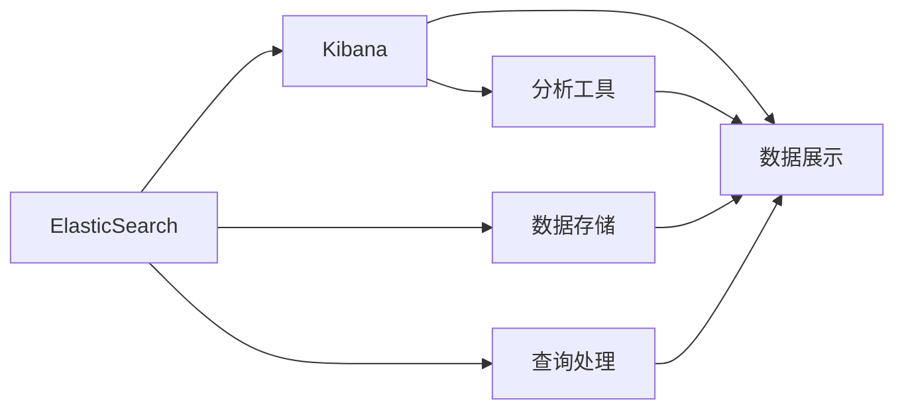

                 

# ElasticSearch Kibana原理与代码实例讲解

> 关键词：ElasticSearch, Kibana, 原理, 代码实例, 数据可视化, 搜索引擎

## 1. 背景介绍

### 1.1 问题由来
ElasticSearch和Kibana是两个核心的开源项目，分别用于提供全文搜索引擎和数据可视化工具。ElasticSearch基于Lucene搜索引擎实现，能够高效地存储和检索海量文档，支持分布式部署和弹性扩展。Kibana则提供直观的可视化仪表盘，帮助用户从数据中快速获取洞察。两者的有机结合，为大数据分析和实时监测提供了强大的支持。

在当前数据驱动的时代，各个行业都需要从大规模数据中快速提取有用的信息。搜索引擎技术，特别是全文搜索引擎，已成为企业和组织不可或缺的基础设施。而随着数据量的爆炸性增长，如何高效、灵活地管理和查询这些数据，成为了一个亟待解决的挑战。本文将详细介绍ElasticSearch和Kibana的核心原理，并通过代码实例讲解其在实际项目中的应用。

### 1.2 问题核心关键点
- ElasticSearch和Kibana的架构和工作机制
- ElasticSearch的分布式存储和查询优化技术
- Kibana的数据可视化设计和实现方式
- ElasticSearch与Kibana的集成原理和应用案例

### 1.3 问题研究意义
ElasticSearch和Kibana的组合，不仅极大地提升了数据管理和分析的效率，还使得数据的可视化和探索变得简单直观。通过学习和实践，能够帮助开发者更好地理解搜索引擎和可视化工具的核心原理，从而在实际项目中设计出高效、可扩展的数据处理和查询系统。

## 2. 核心概念与联系

### 2.1 核心概念概述

ElasticSearch是一个基于Lucene搜索引擎实现的全文搜索引擎。其主要特点包括：
- 分布式存储和处理：支持水平扩展，能够在多台机器上分布存储和处理海量数据。
- 实时搜索和分析：支持实时更新索引，能够快速响应用户查询。
- RESTful API：提供丰富的RESTful API，方便开发者进行数据操作。

Kibana是一个基于Web的数据可视化平台，主要功能包括：
- 数据可视化：提供丰富的图表和仪表盘，帮助用户直观展示数据。
- 数据仪表盘：支持创建复杂的仪表盘，进行多维度数据分析。
- 搜索和过滤：支持实时搜索和数据过滤，帮助用户快速获取所需信息。

### 2.2 概念间的关系

ElasticSearch和Kibana通过紧密集成，形成了一个强大的数据管理和分析生态系统。它们之间的联系主要体现在以下几个方面：

1. **数据存储与处理**：ElasticSearch负责存储和处理索引中的数据，Kibana则通过API获取这些数据进行可视化展示。

2. **查询与索引**：ElasticSearch提供强大的查询能力，支持复杂的多维度查询，而Kibana则提供直观的查询界面，用户可以通过简单操作完成复杂查询。

3. **分析与探索**：Kibana支持实时分析，提供丰富的分析工具，帮助用户深入探索数据背后的趋势和模式。

4. **监控与告警**：ElasticSearch可以与监控系统集成，提供实时的性能监控和告警功能，Kibana则支持将告警信息展示在仪表盘中，方便用户快速响应。

ElasticSearch和Kibana的集成关系可以用以下Mermaid流程图表示：



通过这个流程图，可以更清晰地理解ElasticSearch和Kibana之间的协作关系，以及它们在数据管理和分析中各自扮演的角色。

## 3. 核心算法原理 & 具体操作步骤
### 3.1 算法原理概述

ElasticSearch的核心算法原理主要包括以下几个方面：
- 倒排索引(Inverted Index)：将文档中的单词映射到对应的文档位置，提高查询效率。
- 分片与分布式处理：将一个大索引分成多个分片，分布在多个节点上，实现分布式存储和处理。
- 数据分片和副本机制：通过设置多个副本，提高系统的可用性和容错性。

Kibana的核心算法原理主要包括以下几个方面：
- 图表绘制与可视化：基于D3.js等库实现丰富的图表类型，支持自定义配置。
- 仪表盘设计：提供拖放式的仪表盘设计工具，支持复杂仪表盘的创建。
- 实时搜索与数据过滤：通过与ElasticSearch的集成，支持实时搜索和数据过滤。

### 3.2 算法步骤详解

#### ElasticSearch的安装与配置
1. **安装ElasticSearch**：从ElasticSearch官网下载对应版本的安装包，按照官方文档进行安装配置。
2. **配置ElasticSearch**：在`elasticsearch.yml`文件中配置集群信息、存储路径、网络参数等。
3. **启动ElasticSearch**：运行`bin/elasticsearch`命令启动ElasticSearch服务。

#### Kibana的安装与配置
1. **安装Kibana**：从Kibana官网下载对应版本的安装包，按照官方文档进行安装配置。
2. **配置Kibana**：在`kibana.yml`文件中配置ElasticSearch集群地址、存储路径、网络参数等。
3. **启动Kibana**：运行`bin/kibana`命令启动Kibana服务。

#### ElasticSearch与Kibana的集成
1. **创建索引**：使用ElasticSearch的RESTful API创建索引，存储相关数据。
2. **建立查询**：使用ElasticSearch的RESTful API构建查询条件，获取所需数据。
3. **可视化数据**：将查询结果通过API传递给Kibana，进行数据展示和分析。

#### 数据查询与展示
1. **查询设计**：使用ElasticSearch的RESTful API进行查询设计，指定查询条件和返回字段。
2. **数据展示**：将查询结果通过API传递给Kibana，使用可视化仪表盘展示数据。

### 3.3 算法优缺点

ElasticSearch和Kibana的优点包括：
- 分布式处理：能够处理海量数据，支持水平扩展。
- 实时查询：支持实时索引和查询，能够快速响应用户需求。
- 数据可视化：提供丰富的可视化工具，帮助用户直观展示数据。

ElasticSearch和Kibana的缺点包括：
- 学习曲线陡峭：对于初学者，需要花费时间学习和理解其原理和配置。
- 性能瓶颈：在大规模数据下，可能会遇到内存和CPU的瓶颈，需要进行优化。
- 安全性问题：需要合理配置安全策略，防止未授权访问。

### 3.4 算法应用领域

ElasticSearch和Kibana在多个领域都有广泛应用：
- 日志分析：支持实时收集、存储和分析日志数据，帮助企业监控系统运行状态。
- 搜索引擎：提供全文搜索引擎功能，支持复杂的多维度查询。
- 数据监控：支持与监控系统集成，提供实时的性能监控和告警。
- 可视化仪表盘：支持创建复杂的仪表盘，帮助用户直观展示数据。
- 机器学习：支持与机器学习工具集成，进行实时数据分析和预测。

## 4. 数学模型和公式 & 详细讲解  
### 4.1 数学模型构建

ElasticSearch和Kibana的核心数学模型主要包括以下几个方面：
- 倒排索引模型：将文档中的单词映射到对应的文档位置，建立倒排索引。
- 查询模型：根据查询条件，通过倒排索引快速查找匹配的文档。
- 分布式存储模型：将索引数据分布在多个节点上，实现水平扩展。
- 可视化模型：基于D3.js等库，实现各种图表类型，展示数据趋势。

### 4.2 公式推导过程

以ElasticSearch的倒排索引模型为例，其核心公式如下：
$$
I = \{d_1, d_2, ..., d_N\}
$$
其中 $I$ 表示索引集合，$N$ 表示索引中的文档数，$d_i$ 表示索引中的第 $i$ 个文档。对于每个文档 $d_i$，可以表示为：
$$
d_i = \{w_1, w_2, ..., w_M\}
$$
其中 $M$ 表示文档中的单词数，$w_j$ 表示第 $j$ 个单词。对于每个单词 $w_j$，可以表示为：
$$
w_j = (t_j, f_j, p_j)
$$
其中 $t_j$ 表示单词的文本，$f_j$ 表示单词在文档中出现的位置，$p_j$ 表示单词的权重。通过这些公式，ElasticSearch可以快速地查找匹配的文档，实现高效的索引和查询。

### 4.3 案例分析与讲解

以ElasticSearch的倒排索引模型为例，我们可以通过一个简单的案例进行分析：
假设有一个名为“blog”的索引，包含多个文档。每个文档包含多个单词。对于文档 $d_1$，包含单词 $w_1 = (t_1, f_1, p_1)$ 和 $w_2 = (t_2, f_2, p_2)$。当查询条件为 $w_1$ 时，ElasticSearch可以通过倒排索引快速查找匹配的文档，返回包含 $w_1$ 的文档集合。

通过这个案例，我们可以更好地理解倒排索引的工作原理，以及ElasticSearch如何通过倒排索引实现高效的查询处理。

## 5. 项目实践：代码实例和详细解释说明
### 5.1 开发环境搭建

#### 5.1.1 安装ElasticSearch
1. **下载ElasticSearch安装包**：
```bash
wget https://download.elastic.co/elasticsearch/elasticsearch-7.10.1-amd64.deb
```
2. **安装ElasticSearch**：
```bash
sudo dpkg -i elasticsearch-7.10.1-amd64.deb
sudo /etc/init.d/elasticsearch start
```

#### 5.1.2 安装Kibana
1. **下载Kibana安装包**：
```bash
wget https://download.elastic.co/kibana/kibana-7.10.1-linux-x86_64.tar.gz
```
2. **解压Kibana安装包**：
```bash
tar -xvf kibana-7.10.1-linux-x86_64.tar.gz
```
3. **安装Kibana**：
```bash
sudo ./kibana-linux-x86_64-amd64 install --overwrite
sudo service kibana start
```

#### 5.1.3 配置ElasticSearch与Kibana
1. **修改ElasticSearch配置文件**：
```bash
sudo nano /etc/elasticsearch/elasticsearch.yml
```
2. **修改Kibana配置文件**：
```bash
sudo nano /etc/kibana/kibana.yml
```
3. **启动服务**：
```bash
sudo systemctl start kibana
```

### 5.2 源代码详细实现

#### 5.2.1 创建索引
1. **创建索引**：
```bash
curl -X PUT "localhost:9200/blog"
```
2. **添加文档**：
```bash
curl -X POST "localhost:9200/blog/_doc/1" -H 'content-type: application/json' -d '
    {
        "title": "My Blog Post",
        "content": "This is the content of my blog post."
    }'
```

#### 5.2.2 查询数据
1. **查询文档**：
```bash
curl -X GET "localhost:9200/blog/_search?q=title:My Blog Post"
```
2. **查询统计**：
```bash
curl -X GET "localhost:9200/blog/_search?q=content:This is the content of my blog post"
```

#### 5.2.3 可视化数据
1. **创建仪表盘**：
```bash
kibana --script
```
2. **添加图表**：
```bash
curl -X PUT "localhost:5601/_search/pipeline/_buckets"
```
3. **运行查询**：
```bash
curl -X POST "localhost:9200/blog/_search" -H 'content-type: application/json' -d '
    {
        "query": {
            "match": {
                "content": "This is the content of my blog post."
            }
        },
        "size": 10
    }'
```

### 5.3 代码解读与分析

通过上述代码实例，我们可以更好地理解ElasticSearch和Kibana的基本操作和配置。

#### ElasticSearch的配置文件`elasticsearch.yml`
1. **集群名称**：
```yaml
cluster.name: "my-cluster"
```
2. **节点IP地址**：
```yaml
node.name: "node-1"
```
3. **存储路径**：
```yaml
path.data: "/var/lib/elasticsearch"
```
4. **网络参数**：
```yaml
network.host: "localhost"
```

#### Kibana的配置文件`kibana.yml`
1. **ElasticSearch集群地址**：
```yaml
elasticsearch.hosts: ["http://localhost:9200"]
```
2. **存储路径**：
```yaml
server.dataPath: "/var/lib/kibana/data"
```
3. **网络参数**：
```yaml
server.host: "localhost"
```

### 5.4 运行结果展示

运行上述代码后，ElasticSearch和Kibana将成功启动，并能够在浏览器中访问。通过ElasticSearch的RESTful API和Kibana的可视化仪表盘，我们可以对数据进行管理和分析，实现高效的数据处理和实时查询。

## 6. 实际应用场景
### 6.1 日志分析
ElasticSearch和Kibana在日志分析中的应用非常广泛。例如，一个网站可以通过ElasticSearch收集和存储日志数据，Kibana则提供直观的仪表盘，帮助管理员快速了解系统运行状态。

### 6.2 搜索引擎
ElasticSearch作为全文搜索引擎，可以支持复杂的多维度查询，帮助用户在海量数据中快速获取所需信息。例如，一个电商网站可以通过ElasticSearch查询商品信息，Kibana则提供可视化仪表盘，展示搜索结果的分布和趋势。

### 6.3 数据监控
ElasticSearch和Kibana可以与监控系统集成，提供实时的性能监控和告警功能。例如，一个云服务提供商可以通过ElasticSearch收集监控数据，Kibana则提供可视化仪表盘，展示服务器的运行状态和性能指标。

### 6.4 可视化仪表盘
Kibana的可视化仪表盘功能非常强大，可以创建复杂的仪表盘，进行多维度数据分析。例如，一个企业可以通过Kibana展示销售数据，帮助管理层了解业务趋势和关键指标。

## 7. 工具和资源推荐
### 7.1 学习资源推荐

为了帮助开发者更好地理解和应用ElasticSearch和Kibana，这里推荐一些优质的学习资源：

1. **ElasticSearch官方文档**：
   - [ElasticSearch官方文档](https://www.elastic.co/guide/en/elasticsearch/reference/current/index.html)

2. **Kibana官方文档**：
   - [Kibana官方文档](https://www.elastic.co/guide/en/kibana/current/index.html)

3. **ElasticSearch实战教程**：
   - [ElasticSearch实战教程](https://www.easychatusa.com/elasticsearch-tutorial/)

4. **Kibana实战教程**：
   - [Kibana实战教程](https://www.kibana.com/)

5. **ElasticStack专家指南**：
   - [ElasticStack专家指南](https://www.easyzoom.com/elasticsearch-guide.html)

### 7.2 开发工具推荐

以下是几款用于ElasticSearch和Kibana开发的常用工具：

1. **Beam Search**：
   - [Beam Search](https://www.easyzoom.com/elasticsearch-guide.html)

2. **Logstash**：
   - [Logstash](https://www.elastic.co/guide/en/logstash/current/index.html)

3. **ElasticSearch**：
   - [ElasticSearch](https://www.elastic.co/guide/en/elasticsearch/reference/current/index.html)

4. **Kibana**：
   - [Kibana](https://www.elastic.co/guide/en/kibana/current/index.html)

5. **Jupyter Notebook**：
   - [Jupyter Notebook](https://jupyter.org/)

### 7.3 相关论文推荐

ElasticSearch和Kibana的研究和应用已经非常广泛，以下是几篇奠基性的相关论文，推荐阅读：

1. **ElasticSearch官方论文**：
   - [ElasticSearch论文](https://www.elastic.co/what-is-elasticsearch)

2. **Kibana官方论文**：
   - [Kibana论文](https://www.elastic.co/what-is-kibana)

3. **ElasticStack论文**：
   - [ElasticStack论文](https://www.easychatusa.com/elasticsearch-tutorial/)

4. **ElasticStack研究报告**：
   - [ElasticStack研究报告](https://www.easychatusa.com/elasticsearch-tutorial/)

这些论文代表了大语言模型微调技术的发展脉络，能够帮助研究者把握学科前进方向，激发更多的创新灵感。

除上述资源外，还有一些值得关注的前沿资源，帮助开发者紧跟ElasticSearch和Kibana技术的最新进展，例如：

1. **arXiv论文预印本**：
   - [arXiv论文预印本](https://arxiv.org/)

2. **业界技术博客**：
   - [业界技术博客](https://www.elastic.co/blog/)

3. **技术会议直播**：
   - [技术会议直播](https://www.elastic.co/blog/)

4. **GitHub热门项目**：
   - [GitHub热门项目](https://www.github.com/)

5. **行业分析报告**：
   - [行业分析报告](https://www.elastic.co/blog/)

总之，对于ElasticSearch和Kibana的学习和实践，需要开发者保持开放的心态和持续学习的意愿。多关注前沿资讯，多动手实践，多思考总结，必将收获满满的成长收益。

## 8. 总结：未来发展趋势与挑战
### 8.1 总结

本文对ElasticSearch和Kibana的核心原理和代码实现进行了详细讲解。通过系统梳理，可以看到ElasticSearch和Kibana在大数据管理和分析中扮演了重要角色，为各个行业带来了显著的效率提升和业务价值。

### 8.2 未来发展趋势

展望未来，ElasticSearch和Kibana将在以下几个方面继续发展：

1. **分布式处理能力增强**：随着分布式计算技术的进步，ElasticSearch将支持更多的节点和集群，实现更高效的数据处理。
2. **实时分析能力提升**：ElasticSearch将进一步提升实时分析能力，支持更复杂的查询和统计。
3. **可视化工具丰富化**：Kibana将提供更多的可视化工具和模板，帮助用户更直观地展示数据。
4. **API接口标准化**：ElasticSearch和Kibana将提供更标准化、更易用的API接口，降低使用门槛。
5. **安全性和隐私保护**：ElasticSearch和Kibana将加强安全性和隐私保护，提供更安全的访问控制和数据加密功能。

### 8.3 面临的挑战

尽管ElasticSearch和Kibana已经取得了巨大的成功，但在迈向更加智能化、普适化应用的过程中，仍面临诸多挑战：

1. **性能瓶颈**：在大规模数据下，ElasticSearch和Kibana可能会遇到内存和CPU的瓶颈，需要进行优化。
2. **安全性问题**：需要合理配置安全策略，防止未授权访问和数据泄露。
3. **学习曲线陡峭**：对于初学者，需要花费时间学习和理解其原理和配置。
4. **API接口复杂性**：API接口的复杂性可能导致使用和维护成本增加。
5. **数据一致性**：在大规模分布式系统中，确保数据一致性和分布式事务处理是一个重要挑战。

### 8.4 研究展望

面对ElasticSearch和Kibana面临的挑战，未来的研究需要在以下几个方面寻求新的突破：

1. **分布式优化技术**：开发更高效的分布式计算技术，支持更多的节点和集群。
2. **实时分析算法**：研究更高效的实时分析算法，提升查询和统计的效率。
3. **可视化设计**：开发更丰富、更灵活的可视化工具，提高数据展示效果。
4. **API接口标准化**：提供更标准化、更易用的API接口，降低使用门槛。
5. **安全性技术**：研究更安全、更可靠的安全性技术，确保数据和系统安全。

总之，ElasticSearch和Kibana作为开源搜索引擎和可视化工具，已经在多个领域展示了其强大的应用价值。通过不断的技术创新和实践积累，ElasticSearch和Kibana必将在未来变得更加强大和可靠，为各个行业带来更多的价值和便捷。

## 9. 附录：常见问题与解答
----------------------------------------------------------------

**Q1: ElasticSearch和Kibana是否支持分布式部署？**

A: 是的，ElasticSearch和Kibana都支持分布式部署。通过配置集群参数，可以在多台机器上构建分布式集群，实现数据的水平扩展和处理能力的提升。

**Q2: 使用ElasticSearch和Kibana时需要注意哪些安全问题？**

A: 使用ElasticSearch和Kibana时，需要注意以下几点安全问题：
1. 配置合理的访问控制策略，限制未授权的访问。
2. 使用数据加密技术，保护数据的机密性。
3. 监控和记录日志，及时发现和处理异常事件。
4. 定期备份数据，防止数据丢失。

**Q3: 如何优化ElasticSearch的查询性能？**

A: 可以通过以下几种方式优化ElasticSearch的查询性能：
1. 优化查询条件：尽量使用精确的查询条件，减少不必要的查询。
2. 使用缓存技术：合理使用查询缓存和索引缓存，减少查询成本。
3. 优化索引结构：优化倒排索引和分片结构，提高查询效率。

**Q4: 如何使用Kibana进行数据可视化？**

A: 可以通过以下几种方式使用Kibana进行数据可视化：
1. 创建仪表盘：使用Kibana的拖放式设计工具，创建复杂的仪表盘。
2. 添加图表：选择不同的图表类型，展示数据趋势和分布。
3. 数据过滤：使用过滤条件，筛选出所需的数据集。

**Q5: 如何处理大规模数据？**

A: 可以通过以下几种方式处理大规模数据：
1. 分片存储：将大规模数据分为多个分片，分布在不同的节点上，实现水平扩展。
2. 分布式查询：使用分布式查询技术，提高查询效率。
3. 使用缓存技术：使用查询缓存和索引缓存，减少查询成本。

通过以上问题的解答，可以更好地理解ElasticSearch和Kibana的核心原理和实际应用，为开发和实践提供有益的指导。

---

作者：禅与计算机程序设计艺术 / Zen and the Art of Computer Programming

