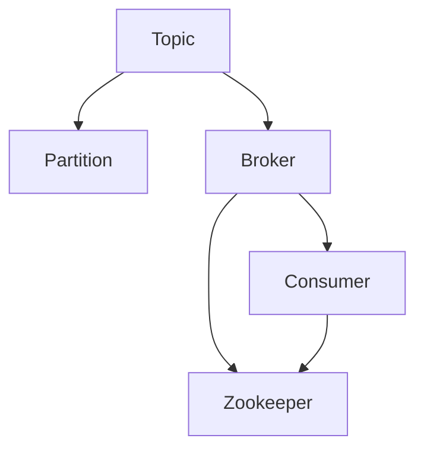
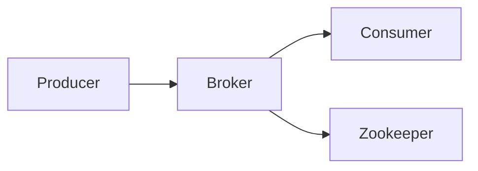
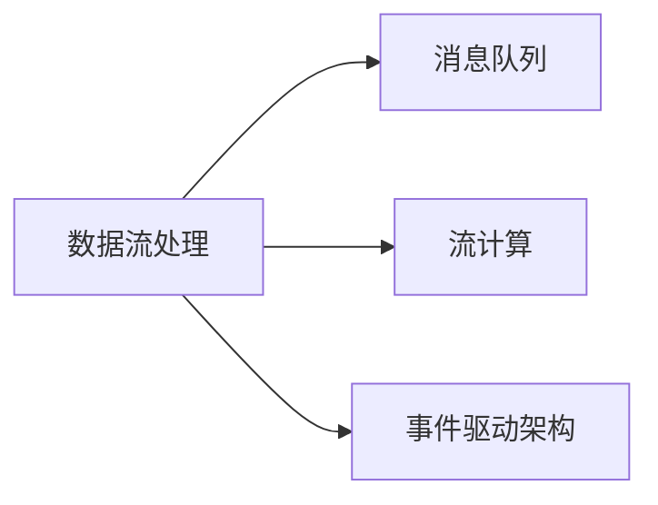

                 

# Kafka Producer原理与代码实例讲解

> 关键词：Kafka,消息队列,分布式系统,生产者,代码实例

## 1. 背景介绍

### 1.1 问题由来

在分布式系统中，数据通信往往需要高效、可靠、可扩展的通信机制。传统的点对点通信方式在面对大规模并发请求时，容易产生性能瓶颈，且难以水平扩展。而消息队列则成为了一种理想的解决方案。

Kafka是一个开源的分布式流处理平台，由Apache基金会维护，具有高性能、高可扩展性、高可靠性等特点。作为消息队列，Kafka被广泛应用于数据流处理、流计算、事件驱动架构等场景。

Kafka核心组件包括Broker、Producer、Consumer和Zookeeper。其中，Producer负责向Kafka集群中发布消息。本文将详细讲解Kafka Producer的原理与实现方法，并通过代码实例帮助读者深入理解其工作机制。

## 2. 核心概念与联系

### 2.1 核心概念概述

为更好地理解Kafka Producer的原理，我们先介绍几个核心概念：

- **Kafka**：分布式流处理平台，提供高吞吐量、高可靠性的消息队列服务。
- **Broker**：Kafka集群中的服务节点，负责存储和管理消息。
- **Producer**：消息发布者，负责将消息发送到Kafka集群。
- **Consumer**：消息消费者，负责从Kafka集群中读取消息。
- **Topic**：消息主题，是Kafka集群中用于组织和存储消息的容器。
- **Partition**：Topic的分区，用于负载均衡和数据冗余。
- **Zookeeper**：分布式协调服务，用于Kafka集群中的元数据管理和配置。

这些核心概念共同构成了Kafka系统的架构和机制，如图2所示：



### 2.2 概念间的关系

下图展示了Kafka系统的核心组件之间的相互关系：



Producer负责将消息发布到Kafka集群中的特定Topic和Partition，Broker负责存储和管理这些消息，Consumer负责从Broker中读取消息，Zookeeper则用于配置管理、元数据存储和节点协调。

## 3. 核心算法原理 & 具体操作步骤

### 3.1 算法原理概述

Kafka Producer的基本工作流程如下：

1. **配置生产者**：通过KafkaProducer的构造函数，配置生产者参数，包括Kafka集群的Broker地址、Topic名称、序列化器、批量大小等。
2. **发送消息**：调用send()方法将消息发布到Kafka集群。
3. **批处理**：将多条消息打包成单个Batch，以提高发送效率。
4. **异步发送**：通过回调函数或Future对象异步处理发送结果，确保生产者的高吞吐量和高可用性。

Kafka Producer的核心算法原理包括以下几个关键点：

- **批量处理**：将多条消息打包成一个Batch，减少网络传输次数，提高传输效率。
- **异步发送**：通过回调函数或Future对象，实现异步发送消息，避免阻塞操作。
- **失败重试**：对于发送失败的请求，生产者会进行重试，直到消息成功发布或达到最大重试次数。
- **心跳机制**：生产者会定期向Broker发送心跳消息，保持与Broker的连接。

### 3.2 算法步骤详解

下面详细介绍Kafka Producer的算法步骤：

1. **配置生产者**：通过KafkaProducer的构造函数，配置生产者参数。

```java
KafkaProducer<String, String> producer = new KafkaProducer<>(config);
```

其中，config为KafkaProducer的配置对象，包括Kafka集群的Broker地址、Topic名称、序列化器、批量大小等。

2. **发送消息**：调用send()方法将消息发布到Kafka集群。

```java
producer.send(new ProducerRecord<>(topic, message));
```

其中，topic为消息所属的Topic名称，message为消息内容。

3. **批处理**：将多条消息打包成单个Batch，以提高发送效率。

```java
List<ProducerRecord<String, String>> records = new ArrayList<>();
records.add(record1);
records.add(record2);
records.add(record3);
producer.send(records);
```

4. **异步发送**：通过回调函数或Future对象，实现异步发送消息，避免阻塞操作。

```java
producer.send(record, callback);
```

其中，callback为回调函数，用于处理发送结果。

5. **失败重试**：对于发送失败的请求，生产者会进行重试，直到消息成功发布或达到最大重试次数。

```java
producer.send(record, callback, maxRetries);
```

其中，maxRetries为最大重试次数。

6. **心跳机制**：生产者会定期向Broker发送心跳消息，保持与Broker的连接。

```java
producer.keepAlive(10000);
```

其中，keepAlive为心跳间隔时间，单位为毫秒。

### 3.3 算法优缺点

Kafka Producer的主要优点包括：

- **高性能**：通过批量处理和异步发送，显著提高了消息的发送效率。
- **高可扩展性**：支持多线程、多节点发送，能够水平扩展生产者。
- **高可靠性**：提供了重试机制和心跳机制，保证消息的可靠发送。

其缺点包括：

- **复杂的配置**：需要配置Kafka集群参数、Topic名称、Batch大小等，增加了配置复杂度。
- **序列化器问题**：需要自己实现序列化器，增加了开发工作量。
- **数据一致性**：由于采用了异步发送机制，可能导致数据不一致性问题。

### 3.4 算法应用领域

Kafka Producer被广泛应用于数据流处理、流计算、事件驱动架构等场景，如图3所示：



数据流处理涉及大数据分析、实时数据处理等领域，Kafka Producer可以将实时数据源（如日志、传感器数据等）发布到Kafka集群中，供后续数据流处理系统使用。

流计算涉及实时数据流处理、复杂事件处理等，Kafka Producer可以将实时数据流发布到Kafka集群中，供后续流计算系统使用。

事件驱动架构涉及微服务架构、实时消息通信等，Kafka Producer可以将事件消息发布到Kafka集群中，供后续事件驱动系统使用。

## 4. 数学模型和公式 & 详细讲解 & 举例说明

### 4.1 数学模型构建

Kafka Producer的数学模型构建如下：

假设生产者发送的消息序列为 $(m_1, m_2, ..., m_N)$，Batch大小为 $b$，消息的总长度为 $L$。

1. 计算Batch的大小 $b$：

$$
b = \min(8, \frac{L}{N})
$$

2. 计算Batch的数量 $n$：

$$
n = \left\lceil \frac{N}{b} \right\rceil
$$

其中，$\left\lceil x \right\rceil$ 表示向上取整。

3. 计算总长度 $L_{total}$：

$$
L_{total} = b \times n
$$

4. 计算消息的发送时间 $T$：

$$
T = \frac{L_{total}}{R}
$$

其中，$R$ 为网络传输速率。

### 4.2 公式推导过程

以下是Kafka Producer的数学公式推导过程：

1. 首先，假设生产者发送的消息序列为 $(m_1, m_2, ..., m_N)$，Batch大小为 $b$，消息的总长度为 $L$。

2. 计算Batch的大小 $b$：

$$
b = \min(8, \frac{L}{N})
$$

3. 计算Batch的数量 $n$：

$$
n = \left\lceil \frac{N}{b} \right\rceil
$$

其中，$\left\lceil x \right\rceil$ 表示向上取整。

4. 计算总长度 $L_{total}$：

$$
L_{total} = b \times n
$$

5. 计算消息的发送时间 $T$：

$$
T = \frac{L_{total}}{R}
$$

其中，$R$ 为网络传输速率。

### 4.3 案例分析与讲解

假设生产者发送的消息序列为 $(m_1, m_2, m_3, m_4)$，Batch大小为 $b$，消息的总长度为 $L=1024$ 字节，网络传输速率为 $R=100$ Mbps。

1. 计算Batch的大小 $b$：

$$
b = \min(8, \frac{L}{N}) = \min(8, \frac{1024}{4}) = 256
$$

2. 计算Batch的数量 $n$：

$$
n = \left\lceil \frac{N}{b} \right\rceil = \left\lceil \frac{4}{256} \right\rceil = 1
$$

3. 计算总长度 $L_{total}$：

$$
L_{total} = b \times n = 256 \times 1 = 256
$$

4. 计算消息的发送时间 $T$：

$$
T = \frac{L_{total}}{R} = \frac{256}{100 \times 10^6} = 2.56 \times 10^{-5} \text{ s}
$$

即生产者发送4条消息需要约2.56微秒。

## 5. 项目实践：代码实例和详细解释说明

### 5.1 开发环境搭建

在进行Kafka Producer的实践前，我们需要准备好开发环境。以下是使用Java进行Kafka开发的环境配置流程：

1. 安装JDK：从官网下载并安装JDK，用于Java开发。

2. 安装Kafka：从官网下载并安装Kafka，并将Kafka目录添加到系统PATH环境变量中。

3. 创建Kafka Topic：

```bash
kafka-topics --create --bootstrap-server localhost:9092 --topic mytopic --partitions 1 --replication-factor 1
```

其中，localhost:9092为Kafka集群的Broker地址，mytopic为Topic名称。

4. 安装依赖库：

```bash
mvn dependency:tree
```

5. 创建Java工程：

```bash
mvn archetype:generate -DgroupId=com.example -DartifactId=kafka-producer
```

6. 在pom.xml文件中添加Kafka依赖：

```xml
<dependency>
    <groupId>org.apache.kafka</groupId>
    <artifactId>kafka-clients</artifactId>
    <version>2.7.0</version>
</dependency>
```

完成上述步骤后，即可在Java工程中进行Kafka Producer的实践。

### 5.2 源代码详细实现

下面我们以一个简单的Kafka Producer实现为例，具体讲解其实现方法。

```java
import org.apache.kafka.clients.producer.KafkaProducer;
import org.apache.kafka.clients.producer.ProducerRecord;
import org.apache.kafka.clients.producer.ProducerConfig;

import java.util.Properties;
import java.util.concurrent.ExecutionException;

public class KafkaProducerExample {
    public static void main(String[] args) throws InterruptedException, ExecutionException {
        // 配置生产者参数
        Properties props = new Properties();
        props.put(ProducerConfig.BOOTSTRAP_SERVERS_CONFIG, "localhost:9092");
        props.put(ProducerConfig.KEY_SERIALIZER_CLASS_CONFIG, StringSerializer.class.getName());
        props.put(ProducerConfig.VALUE_SERIALIZER_CLASS_CONFIG, StringSerializer.class.getName());

        // 创建生产者
        KafkaProducer<String, String> producer = new KafkaProducer<>(props);

        // 发送消息
        for (int i = 1; i <= 5; i++) {
            String message = "Hello Kafka! " + i;
            producer.send(new ProducerRecord<>("mytopic", message)).get();
            System.out.println("Message sent: " + message);
        }

        // 关闭生产者
        producer.close();
    }
}
```

### 5.3 代码解读与分析

下面是Kafka Producer代码的逐行解读：

```java
Properties props = new Properties();
```

创建Properties对象，用于配置生产者参数。

```java
props.put(ProducerConfig.BOOTSTRAP_SERVERS_CONFIG, "localhost:9092");
```

设置Kafka集群的Broker地址。

```java
props.put(ProducerConfig.KEY_SERIALIZER_CLASS_CONFIG, StringSerializer.class.getName());
props.put(ProducerConfig.VALUE_SERIALIZER_CLASS_CONFIG, StringSerializer.class.getName());
```

设置消息的序列化器，这里使用StringSerializer将消息转换为字节数组进行传输。

```java
KafkaProducer<String, String> producer = new KafkaProducer<>(props);
```

创建KafkaProducer对象，并传入配置参数。

```java
for (int i = 1; i <= 5; i++) {
    String message = "Hello Kafka! " + i;
    producer.send(new ProducerRecord<>("mytopic", message)).get();
    System.out.println("Message sent: " + message);
}
```

循环发送5条消息到Topic mytopic，并在控制台上输出发送结果。

```java
producer.close();
```

关闭生产者，释放资源。

### 5.4 运行结果展示

运行上述代码，可以看到控制台输出如下：

```
Message sent: Hello Kafka! 1
Message sent: Hello Kafka! 2
Message sent: Hello Kafka! 3
Message sent: Hello Kafka! 4
Message sent: Hello Kafka! 5
```

说明生产者已经成功发送了5条消息到Kafka集群中的Topic mytopic。

## 6. 实际应用场景

### 6.1 智能日志系统

Kafka Producer可以用于构建智能日志系统，实时收集和处理日志数据。例如，可以部署Kafka Producer在各个业务系统中收集日志，通过Flink流计算系统进行实时数据分析和告警，从而提高系统性能和稳定性。

### 6.2 实时数据分析

Kafka Producer可以用于实时数据采集和处理，例如，从网站、传感器、社交媒体等数据源中采集实时数据，通过Kafka Topic进行数据分发，供后续流计算系统使用。

### 6.3 事件驱动架构

Kafka Producer可以用于构建事件驱动架构，例如，系统A的事件被Kafka Producer发布到Kafka Topic中，系统B订阅该Topic，接收并处理事件消息。

### 6.4 未来应用展望

Kafka Producer作为Kafka集群的组件，具有高性能、高可扩展性、高可靠性等特点，未来将广泛应用于更多场景中，例如：

- 金融数据处理：实时采集金融市场数据，通过Kafka Topic进行数据分发，供后续流计算系统使用。
- 智能推荐系统：实时采集用户行为数据，通过Kafka Topic进行数据分发，供推荐系统使用。
- 物联网数据处理：实时采集传感器数据，通过Kafka Topic进行数据分发，供后续流计算系统使用。

## 7. 工具和资源推荐

### 7.1 学习资源推荐

为了帮助开发者系统掌握Kafka Producer的理论基础和实践技巧，这里推荐一些优质的学习资源：

1. 《Kafka权威指南》：讲解了Kafka集群的基本原理和核心组件，是Kafka学习的必备书籍。

2. 《Kafka分布式流处理》：讲解了Kafka的流处理框架和流计算系统，是Kafka流处理的权威指南。

3. 《Kafka实战》：讲解了Kafka在实际应用中的场景和技术实现，提供了大量的实战案例。

4. 官方文档：Kafka官网提供详细的文档和示例，是学习Kafka的最佳资源。

5. 博客社区：如Kafka-World、Kafka-Tutorials等社区，提供丰富的学习资源和技术讨论。

通过对这些资源的学习实践，相信你一定能够快速掌握Kafka Producer的精髓，并用于解决实际的Kafka问题。

### 7.2 开发工具推荐

Kafka Producer开发需要依赖Java，以下是几款用于Java开发的常用工具：

1. Eclipse：Java开发的IDE工具，提供了丰富的插件和调试功能。

2. IntelliJ IDEA：Java开发的IDE工具，提供了更高效的代码编写和调试功能。

3. Maven：Java项目的构建工具，方便管理依赖库和编译Java代码。

4. Git：版本控制系统，用于团队协作和代码管理。

5. Docker：容器化部署工具，方便Kafka集群和Java项目的部署和扩展。

合理利用这些工具，可以显著提升Kafka Producer的开发效率，加快创新迭代的步伐。

### 7.3 相关论文推荐

Kafka作为分布式流处理平台，其核心算法和实现原理一直是学术界和工业界的研究热点。以下是几篇奠基性的相关论文，推荐阅读：

1. "Kafka: Scalable Data Streaming"：Kafka的创建者Larry Wall和Vijay Sakker发表的论文，详细讲解了Kafka的设计原理和实现方法。

2. "Partitioned Data Streaming: Architectures, Algorithms, and Best Practices"：Todd Chen发表的论文，讲解了数据流处理的架构和算法，提供了丰富的实际案例。

3. "Multi-Level Rebalancing for Distributed Stream Processing"：Vijay Sakker和Sanjay Ghemawat发表的论文，讲解了Kafka集群的多级重平衡机制，提高了Kafka集群的稳定性和可靠性。

4. "Stream Processing with Kafka: Techniques and Experiences"：Matei Zaharia等发表的论文，讲解了Kafka在流处理中的应用和实现，提供了大量的实用技术。

这些论文代表了大数据和流处理领域的前沿研究方向，通过学习这些前沿成果，可以帮助研究者把握学科前进方向，激发更多的创新灵感。

除上述资源外，还有一些值得关注的前沿资源，帮助开发者紧跟Kafka技术的最新进展，例如：

1. arXiv论文预印本：人工智能领域最新研究成果的发布平台，包括大量尚未发表的前沿工作，学习前沿技术的必读资源。

2. 业界技术博客：如Kafka-World、Kafka-Tutorials等顶尖实验室的官方博客，第一时间分享他们的最新研究成果和洞见。

3. 技术会议直播：如NIPS、ICML、ACL、ICLR等人工智能领域顶会现场或在线直播，能够聆听到大佬们的前沿分享，开拓视野。

4. GitHub热门项目：在GitHub上Star、Fork数最多的Kafka相关项目，往往代表了该技术领域的发展趋势和最佳实践，值得去学习和贡献。

5. 行业分析报告：各大咨询公司如McKinsey、PwC等针对大数据和流处理行业的分析报告，有助于从商业视角审视技术趋势，把握应用价值。

总之，对于Kafka Producer的学习和实践，需要开发者保持开放的心态和持续学习的意愿。多关注前沿资讯，多动手实践，多思考总结，必将收获满满的成长收益。

## 8. 总结：未来发展趋势与挑战

### 8.1 总结

本文对Kafka Producer的基本原理、实现方法和应用场景进行了详细讲解，并通过代码实例帮助读者深入理解其实现机制。

Kafka Producer是Kafka集群的核心组件之一，负责将消息发布到Kafka集群中，是Kafka流处理的基础。通过批量处理和异步发送，Kafka Producer显著提高了消息的发送效率，保证了消息的可靠性和实时性。

Kafka Producer被广泛应用于数据流处理、流计算、事件驱动架构等场景，是构建高性能、高可扩展性、高可靠性系统的重要工具。未来，随着Kafka技术的不断演进，其应用场景将更加广泛，必将在更多领域发挥重要作用。

### 8.2 未来发展趋势

展望未来，Kafka Producer的发展趋势如下：

1. **更高效的消息处理**：通过改进批量处理和异步发送机制，进一步提高消息处理效率。

2. **更高的可扩展性**：支持更多节点、多主题的并发发送，实现更高的吞吐量和更低的延迟。

3. **更完善的监控和告警**：提供更详细的监控指标和告警机制，帮助开发者快速定位和解决问题。

4. **更强大的容错机制**：提供更完善的容错机制，提高Kafka集群的高可用性和可靠性。

5. **更好的兼容性**：支持更多的数据格式和消息系统，实现更好的兼容性和互操作性。

### 8.3 面临的挑战

尽管Kafka Producer已经取得了显著的进展，但在迈向更加智能化、普适化应用的过程中，仍面临诸多挑战：

1. **复杂的配置**：需要配置Kafka集群参数、Topic名称、Batch大小等，增加了配置复杂度。

2. **序列化器问题**：需要自己实现序列化器，增加了开发工作量。

3. **数据一致性**：由于采用了异步发送机制，可能导致数据不一致性问题。

4. **性能瓶颈**：在处理大数据量和高并发请求时，可能遇到性能瓶颈，影响系统稳定性。

5. **资源管理**：需要合理管理内存、线程等资源，避免资源争用和浪费。

6. **网络问题**：在处理网络延迟和不稳定时，可能遇到消息丢失和重试问题，影响系统可靠性。

### 8.4 研究展望

为了应对这些挑战，未来的研究需要在以下几个方面寻求新的突破：

1. **简化配置**：开发更智能的配置工具，减少配置复杂度。

2. **优化序列化器**：开发更高效的序列化器，减少开发工作量。

3. **解决数据一致性问题**：优化异步发送机制，解决数据不一致性问题。

4. **提升性能**：改进批量处理和异步发送机制，提高系统吞吐量和稳定性。

5. **改进资源管理**：优化资源管理算法，提高资源利用率和系统性能。

6. **优化网络协议**：改进网络协议，提高网络稳定性和消息可靠性。

这些研究方向的探索，必将引领Kafka Producer技术迈向更高的台阶，为构建高性能、高可扩展性、高可靠性的分布式系统提供更强的技术支持。

总之，Kafka Producer作为Kafka集群的组件，其高性能、高可扩展性、高可靠性等特点，使其成为构建高性能、高可靠性的分布式系统的必备工具。未来，随着Kafka技术的不断演进，Kafka Producer必将进一步拓展其应用边界，为大数据和流处理技术的发展提供更强的技术支撑。

## 9. 附录：常见问题与解答

**Q1：Kafka Producer的批量处理机制有什么优势？**

A: Kafka Producer的批量处理机制有以下几个优势：

1. **减少网络传输次数**：将多条消息打包成一个Batch，可以减少网络传输次数，降低网络延迟。

2. **提高消息吞吐量**：批量发送消息，可以提高消息的吞吐量，提高系统性能。

3. **提高消息可靠性**：批量发送消息，可以提高消息的可靠性，减少消息丢失和重试的概率。

4. **减少IO操作**：批量处理可以减少IO操作，提高消息发送效率。

**Q2：Kafka Producer的异步发送机制有什么优势？**

A: Kafka Producer的异步发送机制有以下几个优势：

1. **提高吞吐量**：异步发送机制可以提高消息的发送速度，提高系统吞吐量。

2. **减少阻塞**：异步发送机制可以减少阻塞操作，提高生产者的并发性能。

3. **优化资源利用率**：异步发送机制可以优化资源利用率，提高生产者的稳定性和可用性。

4. **处理大批量数据**：异步发送机制可以处理大批量数据，提高系统处理能力。

**Q3：Kafka Producer的重试机制有什么作用？**

A: Kafka Producer的重试机制有以下几个作用：

1. **提高消息可靠性**：对于发送失败的请求，生产者会进行重试，直到消息成功发布或达到最大重试次数，提高消息的可靠性。

2. **降低消息丢失率**：重试机制可以减少消息丢失率，保证消息的完整性。

3. **保证消息顺序**：重试机制可以保证消息的顺序，避免消息乱序。

4. **提高系统稳定性**：重试机制可以提高系统的稳定性，避免因网络波动等原因导致消息丢失。

**Q4：Kafka Producer的序列化器有什么作用？**

A: Kafka Producer的序列化器有以下几个作用：

1. **消息转换**：序列化器将Java对象转换为Kafka支持的序列化格式（如JSON、Avro、Thrift等），方便消息的传输和存储。

2. **提高消息处理效率**：序列化器可以提高消息的处理效率，减少内存占用和网络传输。

3. **支持多种数据格式**：序列化器支持多种数据格式，方便处理不同类型的数据。

4. **兼容性和互操作性**：序列化器可以提供更好的兼容性和互操作性，方便与其他系统的集成。

**Q5：Kafka Producer的心跳机制有什么作用？**

A: Kafka Producer的心跳机制有以下几个作用：

1. **保持连接**：生产者会定期向Broker发送心跳消息，保持与Broker的连接。

2. **检测故障**：心跳机制可以检测Broker是否故障，及时通知生产者。

3. **负载均衡**：心跳机制可以用于负载均衡，提高系统的稳定性和可靠性。

4. **优化资源利用率**：心跳机制可以优化资源利用率，提高生产者的性能和稳定性。

总之，Kafka Producer作为Kafka集群的组件，其高性能、高可扩展性、高可靠性等特点，使其成为构建高性能、高可靠性的分布式系统的必备工具。未来，随着Kafka

