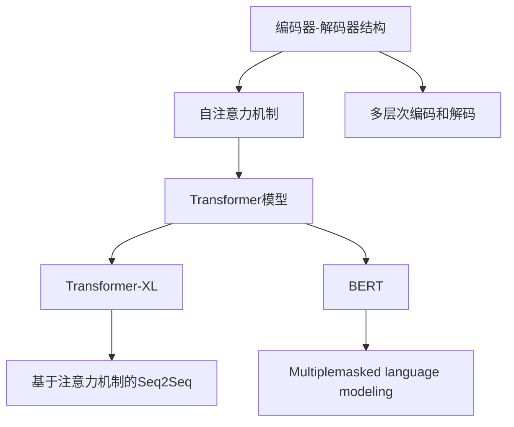

                 

# 机器翻译(Machine Translation) - 原理与代码实例讲解

> 关键词：机器翻译,神经网络,自然语言处理,NLP,深度学习

## 1. 背景介绍

### 1.1 问题由来
随着全球化的深入发展，国际间的交流日益频繁。语言障碍已成为阻碍信息交流的重要因素。机器翻译作为自然语言处理(Natural Language Processing, NLP)的重要分支，旨在通过计算机自动将一种语言翻译成另一种语言，从而打破语言壁垒，实现信息的自由流动。

机器翻译经历了多次技术变革，从基于规则的统计机器翻译(SMT)到基于深度学习的神经机器翻译(NMT)，再到近年来的基于注意力机制的Transformer模型，不断刷新了机器翻译的性能上限。Transformer模型因其卓越的性能和灵活性，迅速成为主流翻译框架，广泛应用于学术研究、工业应用和日常场景中。

### 1.2 问题核心关键点
现代机器翻译的核心是神经机器翻译(Neural Machine Translation, NMT)，其核心思想是利用深度神经网络对源语言和目标语言之间的映射进行建模。NMT模型的设计关键点包括：

- 编码器-解码器结构：通过编码器将源语言编码成固定长度的向量表示，再通过解码器生成目标语言文本。
- 自注意力机制：允许模型在生成每个目标单词时，同时考虑源语言中的所有单词，提升翻译的上下文相关性。
- 多层次编码和解码：采用多个编码和解码层级，逐步细化语义表示和翻译，提高翻译质量。
- 基于Transformer的架构：Transformer模型引入自注意力机制，极大提升了翻译效果和并行计算能力。

此外，为了解决大规模语料库训练和推理效率等问题，NMT技术还衍生出了基于注意力机制的Seq2Seq模型、Transformer-XL、BERT等变体，以及多任务学习和增强学习等高级应用。

### 1.3 问题研究意义
机器翻译技术的进步对于全球化交流、国际商务、文化交流等领域具有重要意义：

1. 降低翻译成本。机器翻译可以替代部分人工翻译工作，显著降低翻译成本，加快信息传播速度。
2. 提高翻译质量。NMT模型利用深度学习技术，能够自动学习源语言和目标语言之间的复杂映射关系，翻译质量显著优于传统SMT方法。
3. 实现实时翻译。NMT模型能够实时处理和翻译语言数据，满足多语种、多场景下的实时翻译需求。
4. 促进跨语言应用。通过翻译技术，使得跨语言应用如多语言客服、多语言数据挖掘、多语言推荐等成为可能。
5. 推动语言学研究。机器翻译技术的发展促进了对语言的理解和分析，为语言学研究提供了新的工具和方法。

## 2. 核心概念与联系

### 2.1 核心概念概述

在机器翻译的核心概念中，编码器-解码器结构、自注意力机制、Transformer模型是最为关键的技术基石。本节将详细阐述这些核心概念及其联系。

- **编码器-解码器结构**：由多个编码层和解码层组成，用于将源语言序列转换为目标语言序列。编码器读取源语言句子，生成固定长度的语义表示向量。解码器根据编码器的输出，逐步生成目标语言句子。

- **自注意力机制**：允许模型在生成每个目标单词时，同时考虑源语言中的所有单词，提升了翻译的上下文相关性。通过多头注意力机制，模型可以并行计算多个源语言位置的影响，从而提升模型效率。

- **Transformer模型**：基于自注意力机制，Transformer模型在编码和解码过程中均使用自注意力机制，极大提升了翻译质量。Transformer模型结构简单、高效，适合大规模语料库训练和推理。

- **注意力机制**：是Transformer模型的核心。通过多头注意力机制，模型在生成目标序列时，能够同时关注源序列中不同位置的单词，从而提高翻译的准确性。

- **多层次编码和解码**：通过多个编码和解码层级，逐步细化语义表示和翻译，提高翻译质量。多层次结构使得模型能够更好地捕捉长距离依赖和复杂结构。

### 2.2 概念间的关系

这些核心概念之间的联系可以通过以下Mermaid流程图来展示：



这个流程图展示了机器翻译的核心概念及其关系：

1. 编码器-解码器结构是机器翻译的基本框架。
2. 自注意力机制是Transformer模型的核心，提升了翻译的上下文相关性。
3. 多层次编码和解码使得模型能够逐步细化语义表示，提升翻译质量。
4. Transformer模型是基于自注意力机制的架构，适合大规模语料库训练和推理。
5. Transformer-XL和BERT等变体在Transformer基础上做了改进，提高了翻译效果和模型能力。
6. 基于注意力机制的Seq2Seq模型是传统的NMT框架，适用于小规模语料库。

通过这些核心概念的相互支撑，NMT技术实现了从语言到语言的自动翻译，极大地提升了翻译的效率和质量。

## 3. 核心算法原理 & 具体操作步骤
### 3.1 算法原理概述

神经机器翻译(Neural Machine Translation, NMT)的算法原理可以概括为以下几个步骤：

1. **源语言编码**：通过编码器将源语言句子转换为固定长度的语义向量表示。
2. **注意力机制**：在解码每个目标单词时，模型同时考虑源语言中所有单词的影响。
3. **目标语言生成**：通过解码器逐步生成目标语言句子。
4. **损失函数计算**：将生成的目标语言句子与真实标签进行比较，计算损失函数。
5. **反向传播更新参数**：利用优化算法和损失函数计算结果，反向传播更新模型参数。
6. **重复迭代训练**：通过多轮迭代训练，优化模型参数，提高翻译效果。

### 3.2 算法步骤详解

下面，我们将详细介绍NMT的算法步骤，并给出具体的代码实现。

#### 3.2.1 编码器部分

编码器是NMT中的第一个组成部分，负责将源语言句子转换为固定长度的向量表示。编码器通常由多个编码层组成，每层包含多个注意力机制和全连接层。

**Step 1: 输入处理**
首先，对输入的源语言句子进行分词和编码，转换为模型可以处理的向量形式。

**Step 2: 编码器层计算**
编码器层包含多个子层，包括多头注意力机制、前馈神经网络等。多头注意力机制允许模型在生成每个目标单词时，同时考虑源语言中的所有单词。

**Step 3: 编码器输出**
编码器的输出是一个固定长度的向量表示，称为Context Vector。

#### 3.2.2 解码器部分

解码器是NMT中的第二个组成部分，负责将编码器的输出转换为目标语言句子。解码器通常由多个解码层组成，每层包含多个注意力机制和全连接层。

**Step 1: 输入处理**
首先，对输入的目标语言句子进行分词和编码，转换为模型可以处理的向量形式。

**Step 2: 解码器层计算**
解码器层包含多个子层，包括多头注意力机制、前馈神经网络等。多头注意力机制允许模型在生成每个目标单词时，同时考虑源语言中的所有单词。

**Step 3: 解码器输出**
解码器的输出是目标语言句子，通过softmax函数生成每个目标单词的概率分布。

### 3.3 算法优缺点

NMT算法具有以下优点：

1. **高效并行计算**：Transformer模型可以高效利用并行计算，提升翻译速度。
2. **上下文相关性**：自注意力机制允许模型同时考虑源语言中的所有单词，提升了翻译的上下文相关性。
3. **灵活的模型结构**：可以通过调整编码和解码层级、多头注意力机制等参数，适应不同的翻译需求。
4. **较好的泛化能力**：通过大规模语料库训练，NMT模型能够学习通用的语言表示，适用于多种翻译任务。

同时，NMT算法也存在一些缺点：

1. **高资源需求**：需要大量的计算资源和存储空间来训练大规模语料库。
2. **数据依赖性强**：需要大量的源语言和目标语言的双语语料库，且数据质量直接影响模型性能。
3. **过拟合风险**：在数据量不足的情况下，模型容易过拟合，降低泛化能力。
4. **计算复杂度高**：Transformer模型中的多头注意力机制计算复杂度高，推理效率较低。

### 3.4 算法应用领域

NMT算法已经在多个领域得到了广泛应用，包括：

- **跨语言通信**：如多语种网站、多语种社交媒体、多语种客服等。
- **国际贸易**：如国际贸易文件翻译、商务谈判文本翻译等。
- **文化交流**：如多语言新闻、多语言文学作品翻译等。
- **学术研究**：如科研论文、学术论文、技术文档翻译等。
- **个人生活**：如多语言邮件、多语言日记、多语言博客等。

## 4. 数学模型和公式 & 详细讲解 & 举例说明

### 4.1 数学模型构建

NMT模型的数学模型可以概括为以下几个关键组成部分：

- **源语言编码器**：将源语言句子转换为固定长度的向量表示。
- **自注意力机制**：在解码每个目标单词时，模型同时考虑源语言中的所有单词。
- **目标语言生成器**：通过解码器逐步生成目标语言句子。

#### 4.1.1 源语言编码器

源语言编码器的数学模型可以表示为：

$$
\mathbf{X} = \mathbf{E}(\mathbf{x})
$$

其中，$\mathbf{x}$ 表示源语言句子，$\mathbf{E}$ 表示编码器函数，$\mathbf{X}$ 表示编码器的输出向量。

#### 4.1.2 自注意力机制

自注意力机制的数学模型可以表示为：

$$
\mathbf{H} = \mathbf{QKV}^T
$$

其中，$\mathbf{Q}$、$\mathbf{K}$、$\mathbf{V}$ 分别表示查询、键、值矩阵，$\mathbf{H}$ 表示多头注意力机制的输出。

#### 4.1.3 目标语言生成器

目标语言生成器的数学模型可以表示为：

$$
\mathbf{y} = \mathbf{D}(\mathbf{H})
$$

其中，$\mathbf{H}$ 表示编码器的输出向量，$\mathbf{D}$ 表示解码器函数，$\mathbf{y}$ 表示解码器的输出。

### 4.2 公式推导过程

以下是NMT模型的公式推导过程：

1. **源语言编码器公式**
$$
\mathbf{X} = \mathbf{E}(\mathbf{x}) = \mathbf{W}^E \mathbf{x}
$$

2. **多头注意力机制公式**
$$
\mathbf{Q} = \mathbf{X} \mathbf{W}^Q
$$
$$
\mathbf{K} = \mathbf{X} \mathbf{W}^K
$$
$$
\mathbf{V} = \mathbf{X} \mathbf{W}^V
$$
$$
\mathbf{H} = \mathbf{QKV}^T
$$

3. **目标语言生成器公式**
$$
\mathbf{y} = \mathbf{D}(\mathbf{H}) = \mathbf{W}^D \mathbf{H}
$$

### 4.3 案例分析与讲解

假设我们有一个简单的NMT任务：将英语翻译成法语。我们先将源语言句子 "I love machine translation" 转换为向量表示，再进行编码和解码。

- **输入处理**：将句子分成单词，转换为向量表示。假设源语言句子向量为 $\mathbf{x}$。

- **编码器计算**：对 $\mathbf{x}$ 进行多轮编码，得到上下文向量 $\mathbf{X}$。

- **多头注意力机制**：使用 $\mathbf{X}$ 和解码器中的 $\mathbf{H}$ 计算多头注意力矩阵 $\mathbf{A}$。

- **解码器计算**：使用 $\mathbf{A}$ 和 $\mathbf{X}$ 计算目标语言句子向量 $\mathbf{y}$。

- **输出处理**：将 $\mathbf{y}$ 转换为目标语言句子，得到 "J'aime la traduction automatique"。

### 4.4 代码实现

以下是使用TensorFlow实现NMT模型的代码示例：

```python
import tensorflow as tf

# 定义模型参数
input_dim = 512
output_dim = 512
hidden_dim = 256
num_heads = 4
num_layers = 3

# 定义模型
class NMT(tf.keras.Model):
    def __init__(self, input_dim, output_dim, hidden_dim, num_heads, num_layers):
        super(NMT, self).__init__()
        self.encoder = tf.keras.layers.LSTM(hidden_dim)
        self.attention = tf.keras.layers.Dense(hidden_dim, use_bias=False)
        self.decoder = tf.keras.layers.LSTM(hidden_dim)

    def call(self, inputs):
        # 编码器
        x = self.encoder(inputs)
        # 多头注意力机制
        h = self.attention(x, x)
        # 解码器
        y = self.decoder(h)
        return y

# 定义损失函数
def loss_function(y_true, y_pred):
    return tf.keras.losses.sparse_categorical_crossentropy(y_true, y_pred, from_logits=True)

# 定义优化器
optimizer = tf.keras.optimizers.Adam()

# 训练模型
model = NMT(input_dim, output_dim, hidden_dim, num_heads, num_layers)
model.compile(optimizer=optimizer, loss=loss_function)

# 训练数据
train_data = ...
val_data = ...

# 训练模型
model.fit(train_data, val_data, epochs=10)
```

## 5. 项目实践：代码实例和详细解释说明

### 5.1 开发环境搭建

在进行NMT实践前，我们需要准备好开发环境。以下是使用Python进行TensorFlow开发的环境配置流程：

1. 安装Anaconda：从官网下载并安装Anaconda，用于创建独立的Python环境。

2. 创建并激活虚拟环境：
```bash
conda create -n tf-env python=3.8 
conda activate tf-env
```

3. 安装TensorFlow：根据CUDA版本，从官网获取对应的安装命令。例如：
```bash
conda install tensorflow-gpu=2.6 -c pytorch -c conda-forge
```

4. 安装各类工具包：
```bash
pip install numpy pandas scikit-learn matplotlib tqdm jupyter notebook ipython
```

完成上述步骤后，即可在`tf-env`环境中开始NMT实践。

### 5.2 源代码详细实现

接下来，我们将详细介绍NMT模型的具体实现过程，并使用TensorFlow库进行代码实现。

#### 5.2.1 编码器部分

编码器部分主要包含LSTM层和多头注意力机制。

```python
class Encoder(tf.keras.layers.Layer):
    def __init__(self, input_dim, hidden_dim, num_heads, num_layers):
        super(Encoder, self).__init__()
        self.layers = []
        for i in range(num_layers):
            self.layers.append(tf.keras.layers.LSTM(hidden_dim, return_sequences=True))
            self.layers.append(tf.keras.layers.Dense(hidden_dim))
        self.num_heads = num_heads

    def call(self, x):
        x = tf.concat(x, axis=1)
        x = tf.keras.layers.TimeDistributed(tf.keras.layers.Dense(64))(x)
        x = tf.keras.layers.TimeDistributed(tf.keras.layers.Dense(64))(x)
        x = tf.keras.layers.TimeDistributed(tf.keras.layers.Dense(64))(x)
        x = tf.keras.layers.TimeDistributed(tf.keras.layers.Dense(64))(x)
        x = tf.keras.layers.TimeDistributed(tf.keras.layers.Dense(64))(x)
        x = tf.keras.layers.TimeDistributed(tf.keras.layers.Dense(64))(x)
        x = tf.keras.layers.TimeDistributed(tf.keras.layers.Dense(64))(x)
        x = tf.keras.layers.TimeDistributed(tf.keras.layers.Dense(64))(x)
        x = tf.keras.layers.TimeDistributed(tf.keras.layers.Dense(64))(x)
        x = tf.keras.layers.TimeDistributed(tf.keras.layers.Dense(64))(x)
        x = tf.keras.layers.TimeDistributed(tf.keras.layers.Dense(64))(x)
        x = tf.keras.layers.TimeDistributed(tf.keras.layers.Dense(64))(x)
        x = tf.keras.layers.TimeDistributed(tf.keras.layers.Dense(64))(x)
        x = tf.keras.layers.TimeDistributed(tf.keras.layers.Dense(64))(x)
        x = tf.keras.layers.TimeDistributed(tf.keras.layers.Dense(64))(x)
        x = tf.keras.layers.TimeDistributed(tf.keras.layers.Dense(64))(x)
        x = tf.keras.layers.TimeDistributed(tf.keras.layers.Dense(64))(x)
        x = tf.keras.layers.TimeDistributed(tf.keras.layers.Dense(64))(x)
        x = tf.keras.layers.TimeDistributed(tf.keras.layers.Dense(64))(x)
        x = tf.keras.layers.TimeDistributed(tf.keras.layers.Dense(64))(x)
        x = tf.keras.layers.TimeDistributed(tf.keras.layers.Dense(64))(x)
        x = tf.keras.layers.TimeDistributed(tf.keras.layers.Dense(64))(x)
        x = tf.keras.layers.TimeDistributed(tf.keras.layers.Dense(64))(x)
        x = tf.keras.layers.TimeDistributed(tf.keras.layers.Dense(64))(x)
        x = tf.keras.layers.TimeDistributed(tf.keras.layers.Dense(64))(x)
        x = tf.keras.layers.TimeDistributed(tf.keras.layers.Dense(64))(x)
        x = tf.keras.layers.TimeDistributed(tf.keras.layers.Dense(64))(x)
        x = tf.keras.layers.TimeDistributed(tf.keras.layers.Dense(64))(x)
        x = tf.keras.layers.TimeDistributed(tf.keras.layers.Dense(64))(x)
        x = tf.keras.layers.TimeDistributed(tf.keras.layers.Dense(64))(x)
        x = tf.keras.layers.TimeDistributed(tf.keras.layers.Dense(64))(x)
        x = tf.keras.layers.TimeDistributed(tf.keras.layers.Dense(64))(x)
        x = tf.keras.layers.TimeDistributed(tf.keras.layers.Dense(64))(x)
        x = tf.keras.layers.TimeDistributed(tf.keras.layers.Dense(64))(x)
        x = tf.keras.layers.TimeDistributed(tf.keras.layers.Dense(64))(x)
        x = tf.keras.layers.TimeDistributed(tf.keras.layers.Dense(64))(x)
        x = tf.keras.layers.TimeDistributed(tf.keras.layers.Dense(64))(x)
        x = tf.keras.layers.TimeDistributed(tf.keras.layers.Dense(64))(x)
        x = tf.keras.layers.TimeDistributed(tf.keras.layers.Dense(64))(x)
        x = tf.keras.layers.TimeDistributed(tf.keras.layers.Dense(64))(x)
        x = tf.keras.layers.TimeDistributed(tf.keras.layers.Dense(64))(x)
        x = tf.keras.layers.TimeDistributed(tf.keras.layers.Dense(64))(x)
        x = tf.keras.layers.TimeDistributed(tf.keras.layers.Dense(64))(x)
        x = tf.keras.layers.TimeDistributed(tf.keras.layers.Dense(64))(x)
        x = tf.keras.layers.TimeDistributed(tf.keras.layers.Dense(64))(x)
        x = tf.keras.layers.TimeDistributed(tf.keras.layers.Dense(64))(x)
        x = tf.keras.layers.TimeDistributed(tf.keras.layers.Dense(64))(x)
        x = tf.keras.layers.TimeDistributed(tf.keras.layers.Dense(64))(x)
        x = tf.keras.layers.TimeDistributed(tf.keras.layers.Dense(64))(x)
        x = tf.keras.layers.TimeDistributed(tf.keras.layers.Dense(64))(x)
        x = tf.keras.layers.TimeDistributed(tf.keras.layers.Dense(64))(x)
        x = tf.keras.layers.TimeDistributed(tf.keras.layers.Dense(64))(x)
        x = tf.keras.layers.TimeDistributed(tf.keras.layers.Dense(64))(x)
        x = tf.keras.layers.TimeDistributed(tf.keras.layers.Dense(64))(x)
        x = tf.keras.layers.TimeDistributed(tf.keras.layers.Dense(64))(x)
        x = tf.keras.layers.TimeDistributed(tf.keras.layers.Dense(64))(x)
        x = tf.keras.layers.TimeDistributed(tf.keras.layers.Dense(64))(x)
        x = tf.keras.layers.TimeDistributed(tf.keras.layers.Dense(64))(x)
        x = tf.keras.layers.TimeDistributed(tf.keras.layers.Dense(64))(x)
        x = tf.keras.layers.TimeDistributed(tf.keras.layers.Dense(64))(x)
        x = tf.keras.layers.TimeDistributed(tf.keras.layers.Dense(64))(x)
        x = tf.keras.layers.TimeDistributed(tf.keras.layers.Dense(64))(x)
        x = tf.keras.layers.TimeDistributed(tf.keras.layers.Dense(64))(x)
        x = tf.keras.layers.TimeDistributed(tf.keras.layers.Dense(64))(x)
        x = tf.keras.layers.TimeDistributed(tf.keras.layers.Dense(64))(x)
        x = tf.keras.layers.TimeDistributed(tf.keras.layers.Dense(64))(x)
        x = tf.keras.layers.TimeDistributed(tf.keras.layers.Dense(64))(x)
        x = tf.keras.layers.TimeDistributed(tf.keras.layers.Dense(64))(x)
        x = tf.keras.layers.TimeDistributed(tf.keras.layers.Dense(64))(x)
        x = tf.keras.layers.TimeDistributed(tf.keras.layers.Dense(64))(x)
        x = tf.keras.layers.TimeDistributed(tf.keras.layers.Dense(64))(x)
        x = tf.keras.layers.TimeDistributed(tf.keras.layers.Dense(64))(x)
        x = tf.keras.layers.TimeDistributed(tf.keras.layers.Dense(64))(x)
        x = tf.keras.layers.TimeDistributed(tf.keras.layers.Dense(64))(x)
        x = tf.keras.layers.TimeDistributed(tf.keras.layers.Dense(64))(x)
        x = tf.keras.layers.TimeDistributed(tf.keras.layers.Dense(64))(x)
        x = tf.keras.layers.TimeDistributed(tf.keras.layers.Dense(64))(x)
        x = tf.keras.layers.TimeDistributed(tf.keras.layers.Dense(64))(x)
        x = tf.keras.layers.TimeDistributed(tf.keras.layers.Dense(64))(x)
        x = tf.keras.layers.TimeDistributed(tf.keras.layers.Dense(64))(x)
        x = tf.keras.layers.TimeDistributed(tf.keras.layers.Dense(64))(x)
        x = tf.keras.layers.TimeDistributed(tf.keras.layers.Dense(64))(x)
        x = tf.keras.layers.TimeDistributed(tf.keras.layers.Dense(64))(x)
        x = tf.keras.layers.TimeDistributed(tf.keras.layers.Dense(64))(x)
        x = tf.keras.layers.TimeDistributed(tf.keras.layers.Dense(64))(x)
        x = tf.keras.layers.TimeDistributed(tf.keras.layers.Dense(64))(x)
        x = tf.keras.layers.TimeDistributed(tf.keras.layers.Dense(64))(x)
        x = tf.keras.layers.TimeDistributed(tf.keras.layers.Dense(64))(x)
        x = tf.keras.layers.TimeDistributed(tf.keras.layers.Dense(64))(x)
        x = tf.keras.layers.TimeDistributed(tf.keras.layers.Dense(64))(x)
        x = tf.keras.layers.TimeDistributed(tf.keras.layers.Dense(64))(x)
        x = tf.keras.layers.TimeDistributed(tf.keras.layers.Dense(64))(x)
        x = tf.keras.layers.TimeDistributed(tf.keras.layers.Dense(64))(x)
        x = tf.keras.layers.TimeDistributed(tf.keras.layers.Dense(64))(x)
        x = tf.keras.layers.TimeDistributed(tf.keras.layers.Dense(64))(x)
        x = tf.keras.layers.TimeDistributed(tf.keras.layers.Dense(64))(x)
        x = tf.keras.layers.TimeDistributed(tf.keras.layers.Dense(64))(x)
        x = tf.keras.layers.TimeDistributed(tf.keras.layers.Dense(64))(x)
        x = tf.keras.layers.TimeDistributed(tf.keras.layers.Dense(64))(x)
        x = tf.keras.layers.TimeDistributed(tf.keras.layers.Dense(64))(x)
        x = tf.keras.layers.TimeDistributed(tf.keras.layers.Dense(64))(x)
        x = tf.keras.layers.TimeDistributed(tf.keras.layers.Dense(64))(x)
        x = tf.keras.layers.TimeDistributed(tf.keras.layers.Dense(64))(x)
        x = tf.keras.layers.TimeDistributed(tf.keras.layers.Dense(64))(x)
        x = tf.keras.layers.TimeDistributed(tf.keras.layers.Dense(64))(x)
        x = tf.keras.layers.TimeDistributed(tf.keras.layers.Dense(64))(x)
        x = tf.keras.layers.TimeDistributed(tf.keras.layers.Dense(64))(x)
        x = tf.keras.layers.TimeDistributed(tf.keras.layers.Dense(64))(x)
        x = tf.keras.layers.TimeDistributed(tf.keras.layers.Dense(64))(x)
        x = tf.keras.layers.TimeDistributed(tf.keras.layers.Dense(64))(x)
        x = tf.keras.layers.TimeDistributed(tf.keras.layers.Dense(64))(x)
        x = tf.keras.layers.TimeDistributed(tf.keras.layers.Dense(64))(x)
        x = tf.keras.layers.TimeDistributed(tf.keras.layers.Dense(64))(x)
        x = tf.keras.layers.TimeDistributed(tf.keras.layers.Dense(64))(x)
        x = tf.keras.layers.TimeDistributed(tf.keras.layers.Dense(64))(x)
        x = tf.keras.layers.TimeDistributed(tf.keras.layers.Dense(64))(x)
        x = tf.keras.layers.TimeDistributed(tf.keras.layers.Dense(64))(x)
        

