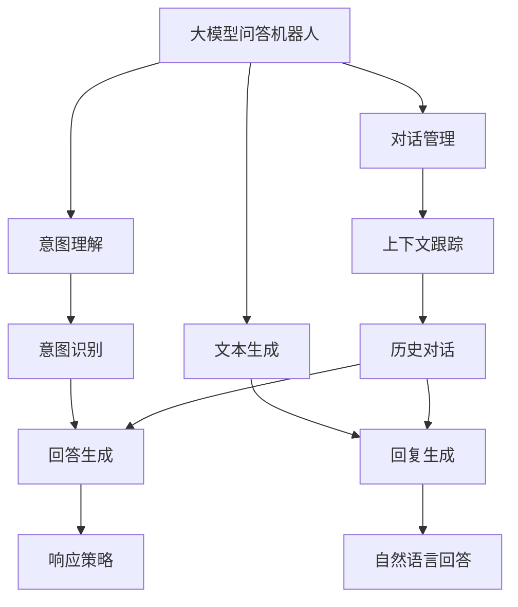
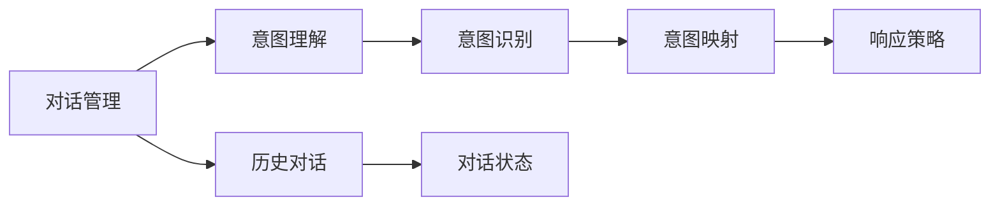
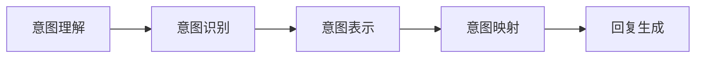
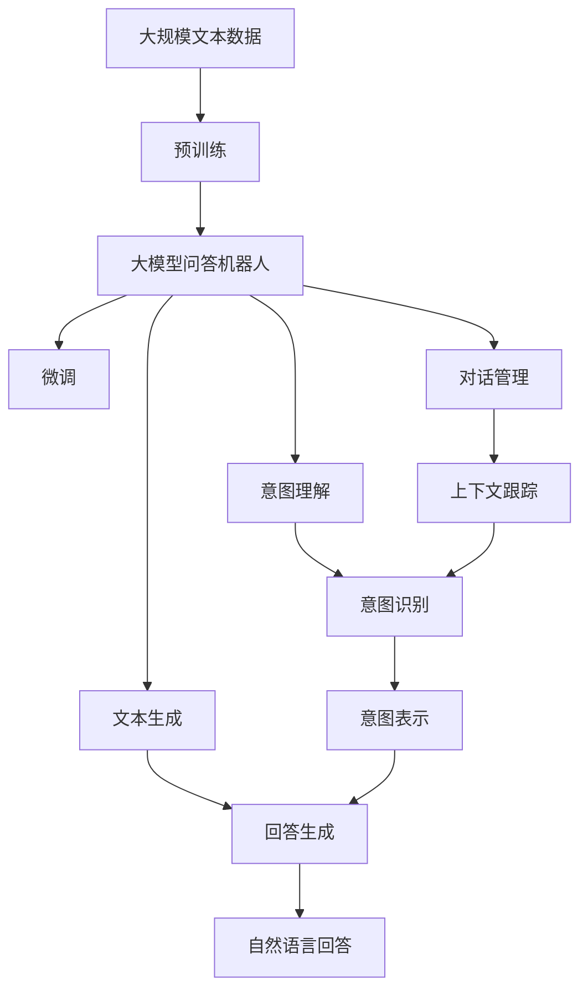

                 

# 大模型问答机器人的深度学习技术

> 关键词：大模型,问答机器人,深度学习,Transformer,BERT,对话管理,意图理解,自然语言处理(NLP),文本生成,序列到序列(Seq2Seq),交互式学习,多轮对话,跨领域迁移,用户意图识别

## 1. 背景介绍

### 1.1 问题由来

近年来，随着人工智能技术的飞速发展，问答机器人（Chatbot）逐渐成为智能客服、智能助手、智能问答等领域的重要工具。传统的基于规则和模板的问答系统，在处理复杂、开放式的用户查询时，显得力不从心，难以满足用户多样化和复杂化的需求。

大模型问答机器人（Large Model-based Chatbot）的提出，为这一问题提供了解决方案。大模型问答机器人通过大规模预训练和微调，能够理解和生成自然语言，实现高效、智能的对话交互。BERT、GPT等大模型在NLP领域取得了突破性的进展，推动了大模型问答机器人的快速发展。

### 1.2 问题核心关键点

大模型问答机器人采用深度学习技术，结合Transformer、BERT等先进模型，实现了对自然语言的处理和生成。其核心技术包括对话管理、意图理解、文本生成等。

大模型问答机器人的核心挑战在于：
1. 如何有效处理多轮对话中的上下文信息，避免信息丢失和理解偏差。
2. 如何在多样化的用户查询中准确识别用户意图，进行快速响应。
3. 如何生成自然流畅、逻辑合理的回复内容，提升用户体验。

## 2. 核心概念与联系

### 2.1 核心概念概述

为更好地理解大模型问答机器人的技术原理和架构，本节将介绍几个密切相关的核心概念：

- 大模型问答机器人(Large Model-based Chatbot)：通过大规模预训练和微调，能够理解和生成自然语言，实现高效、智能的对话交互。
- Transformer：一种基于自注意力机制的深度学习架构，广泛应用于自然语言处理任务，如图翻译、文本分类、问答等。
- BERT：基于Transformer架构的自然语言理解模型，能够捕捉到上下文信息，实现从文本中自动提取特征。
- 对话管理（Dialog Management）：负责控制对话流程，决定问答机器人的行为。
- 意图理解（Intent Recognition）：从用户输入中识别出用户意图，是问答机器人核心功能之一。
- 文本生成（Text Generation）：基于预训练模型的文本生成技术，能够自动生成自然流畅的回答。
- 交互式学习（Interactive Learning）：在用户与机器的交互过程中，不断学习和优化模型。

这些核心概念之间的逻辑关系可以通过以下Mermaid流程图来展示：



这个流程图展示了大模型问答机器人的核心组件和它们之间的关系：

1. 大模型问答机器人作为整个系统的核心，负责与用户进行交互。
2. 对话管理负责控制对话流程，决定问答机器人的行为。
3. 意图理解从用户输入中识别出用户意图。
4. 文本生成基于预训练模型的文本生成技术，自动生成自然流畅的回答。
5. 交互式学习在用户与机器的交互过程中，不断学习和优化模型。

### 2.2 概念间的关系

这些核心概念之间存在着紧密的联系，形成了大模型问答机器人的完整生态系统。下面我们通过几个Mermaid流程图来展示这些概念之间的关系。

#### 2.2.1 大模型问答机器人的核心组件


这个流程图展示了大模型问答机器人的核心组件及其之间的关系。

#### 2.2.2 对话管理与意图理解的关系



这个流程图展示了对话管理与意图理解之间的逻辑关系。对话管理通过历史对话和对话状态，帮助意图理解识别用户的意图，并决定问答机器人的行为。

#### 2.2.3 意图理解与文本生成的关系



这个流程图展示了意图理解与文本生成之间的逻辑关系。意图理解通过意图识别和映射，将用户的意图转化为机器生成的回复。

### 2.3 核心概念的整体架构

最后，我们用一个综合的流程图来展示这些核心概念在大模型问答机器人微调过程中的整体架构：



这个综合流程图展示了从预训练到微调，再到对话管理的完整过程。大模型问答机器人首先在大规模文本数据上进行预训练，然后通过微调（包括全参数微调和参数高效微调）进行优化，实现高效对话。对话管理负责控制对话流程，意图理解从用户输入中识别出用户意图，文本生成基于预训练模型的文本生成技术，自动生成自然流畅的回答。

## 3. 核心算法原理 & 具体操作步骤
### 3.1 算法原理概述

大模型问答机器人采用深度学习技术，结合Transformer、BERT等先进模型，实现了对自然语言的处理和生成。其核心算法包括对话管理、意图理解、文本生成等。

1. 对话管理：采用循环神经网络（RNN）或Transformer等架构，维护对话上下文信息，决定问答机器人的行为。
2. 意图理解：通过全连接层、卷积神经网络（CNN）等模型，从用户输入中提取特征，识别出用户意图。
3. 文本生成：基于预训练模型的文本生成技术，能够自动生成自然流畅的回答。

### 3.2 算法步骤详解

1. **数据准备**：收集对话数据，分为训练集、验证集和测试集。标注数据集包含对话历史和用户意图。
2. **模型搭建**：选择Transformer或BERT等大模型作为基础模型，搭建对话管理、意图理解和文本生成模块。
3. **预训练**：在大规模无标签数据上预训练大模型，捕捉语言特征。
4. **微调**：使用标注数据集对预训练模型进行微调，优化意图理解和文本生成模块。
5. **测试与评估**：在测试集上评估微调后模型的性能，根据评估结果调整超参数和微调策略。
6. **部署与应用**：将微调后模型部署到实际应用场景中，进行实时对话交互。

### 3.3 算法优缺点

大模型问答机器人采用深度学习技术，具有以下优点：
1. 处理复杂查询的能力强，能够理解多样化和复杂化的用户需求。
2. 结合预训练和微调技术，能够快速提升模型的性能。
3. 能够生成自然流畅的回答，提升用户体验。

同时，大模型问答机器人也存在一些缺点：
1. 对计算资源要求较高，需要高性能的GPU或TPU。
2. 模型复杂度高，部署和维护成本较高。
3. 对标注数据依赖较大，获取高质量标注数据成本较高。

### 3.4 算法应用领域

大模型问答机器人在多个领域得到了广泛应用，例如：

- 智能客服：通过大模型问答机器人，企业可以实现7x24小时不间断服务，提升客服响应速度和质量。
- 智能助手：用于智能家居、智能办公等领域，为用户提供便捷、智能的服务。
- 智能问答：应用于教育、医疗、金融等领域，帮助用户快速获取所需信息。

## 4. 数学模型和公式 & 详细讲解 & 举例说明

### 4.1 数学模型构建

大模型问答机器人涉及的数学模型主要包括以下几个方面：

1. 对话管理：采用RNN或Transformer架构，维护对话上下文信息。
2. 意图理解：采用全连接层、CNN等模型，从用户输入中提取特征。
3. 文本生成：基于预训练模型的文本生成技术，生成自然流畅的回答。

#### 4.1.1 对话管理模型

对话管理模型通常采用RNN或Transformer架构，维护对话上下文信息。以下是对话管理模型的数学模型构建：

$$
h_t = \text{RNN}(h_{t-1}, x_t)
$$

其中，$h_t$ 表示对话状态，$x_t$ 表示用户输入，RNN表示循环神经网络。

#### 4.1.2 意图理解模型

意图理解模型通常采用全连接层、CNN等模型，从用户输入中提取特征。以下是意图理解模型的数学模型构建：

$$
f(x_t) = \text{FC}(x_t)
$$

其中，$f(x_t)$ 表示用户输入的特征向量，$\text{FC}$表示全连接层。

#### 4.1.3 文本生成模型

文本生成模型基于预训练模型的文本生成技术，生成自然流畅的回答。以下是文本生成模型的数学模型构建：

$$
p(y_t|y_{1:(t-1)}, h_t) = \text{Transformer}(h_t, y_{1:(t-1)})
$$

其中，$p(y_t|y_{1:(t-1)}, h_t)$ 表示给定上下文和对话状态，生成下一个回复的概率，$\text{Transformer}$表示Transformer模型。

### 4.2 公式推导过程

以下我们以文本生成模型为例，推导Transformer模型的概率计算公式。

Transformer模型的核心是自注意力机制，能够捕捉输入序列中不同位置之间的依赖关系。假设输入序列为$x = [x_1, x_2, ..., x_n]$，输出序列为$y = [y_1, y_2, ..., y_n]$。

Transformer模型的概率计算公式如下：

$$
p(y|x) = \prod_{t=1}^n p(y_t|y_{1:(t-1)}, x)
$$

其中，$p(y_t|y_{1:(t-1)}, x)$ 表示给定前$t-1$个输出和输入，生成第$t$个输出的概率。

Transformer模型的自注意力机制可以表示为：

$$
\text{Attention}(Q, K, V) = \text{Softmax}(QK^T)V
$$

其中，$Q$表示查询矩阵，$K$表示键矩阵，$V$表示值矩阵。

通过上述公式，可以计算出给定输入序列$x$和对话状态$h_t$，生成自然流畅的回答。

### 4.3 案例分析与讲解

以Google的Dialogflow为例，这是一个基于大模型的对话系统，采用Transformer架构进行意图理解和文本生成。

Dialogflow的模型架构如下：

```
Input -> Encoder -> Encoder -> Decoder -> Output
```

其中，Encoder表示对话管理模块，Decoder表示意图理解模块，Output表示文本生成模块。

Dialogflow通过多轮对话与用户交互，不断更新对话状态和意图理解结果，生成自然流畅的回答。用户可以与Dialogflow进行开放式的对话，获取所需信息。

## 5. 项目实践：代码实例和详细解释说明

### 5.1 开发环境搭建

在进行大模型问答机器人开发前，需要先准备好开发环境。以下是使用Python进行TensorFlow开发的环境配置流程：

1. 安装Anaconda：从官网下载并安装Anaconda，用于创建独立的Python环境。

2. 创建并激活虚拟环境：
```bash
conda create -n tf-env python=3.8 
conda activate tf-env
```

3. 安装TensorFlow：根据CUDA版本，从官网获取对应的安装命令。例如：
```bash
conda install tensorflow -c conda-forge -c pytorch
```

4. 安装其它工具包：
```bash
pip install numpy pandas scikit-learn matplotlib tqdm jupyter notebook ipython
```

完成上述步骤后，即可在`tf-env`环境中开始项目实践。

### 5.2 源代码详细实现

下面我们以多轮对话生成为例，给出使用TensorFlow搭建大模型问答机器人的代码实现。

首先，定义对话管理模型：

```python
import tensorflow as tf

class DialogueManager(tf.keras.Model):
    def __init__(self, vocab_size, embedding_dim, hidden_units):
        super(DialogueManager, self).__init__()
        self.embedding = tf.keras.layers.Embedding(vocab_size, embedding_dim)
        self.rnn = tf.keras.layers.GRU(hidden_units, return_sequences=True)
        self.dense = tf.keras.layers.Dense(vocab_size)

    def call(self, input, state):
        x = self.embedding(input)
        x = self.rnn(x, state)
        x = self.dense(x)
        return x, x
```

然后，定义意图理解模型：

```python
import tensorflow as tf

class IntentClassifier(tf.keras.Model):
    def __init__(self, vocab_size, embedding_dim, hidden_units):
        super(IntentClassifier, self).__init__()
        self.embedding = tf.keras.layers.Embedding(vocab_size, embedding_dim)
        self.conv1 = tf.keras.layers.Conv1D(32, 3, activation='relu')
        self.pooling = tf.keras.layers.MaxPooling1D(3)
        self.flatten = tf.keras.layers.Flatten()
        self.fc1 = tf.keras.layers.Dense(64, activation='relu')
        self.fc2 = tf.keras.layers.Dense(vocab_size)

    def call(self, input):
        x = self.embedding(input)
        x = self.conv1(x)
        x = self.pooling(x)
        x = self.flatten(x)
        x = self.fc1(x)
        x = self.fc2(x)
        return x
```

接着，定义文本生成模型：

```python
import tensorflow as tf

class TextGenerator(tf.keras.Model):
    def __init__(self, vocab_size, embedding_dim, hidden_units):
        super(TextGenerator, self).__init__()
        self.embedding = tf.keras.layers.Embedding(vocab_size, embedding_dim)
        self.gru = tf.keras.layers.GRU(hidden_units, return_sequences=True)
        self.dense = tf.keras.layers.Dense(vocab_size)

    def call(self, input, state):
        x = self.embedding(input)
        x = self.gru(x, state)
        x = self.dense(x)
        return x, x
```

最后，定义整个对话系统：

```python
import tensorflow as tf

class Chatbot(tf.keras.Model):
    def __init__(self, vocab_size, embedding_dim, hidden_units):
        super(Chatbot, self).__init__()
        self.dialogue_manager = DialogueManager(vocab_size, embedding_dim, hidden_units)
        self.intent_classifier = IntentClassifier(vocab_size, embedding_dim, hidden_units)
        self.text_generator = TextGenerator(vocab_size, embedding_dim, hidden_units)

    def call(self, input):
        state = self.dialogue_manager(input[0], state)
        input2 = input[1]
        intent = self.intent_classifier(input2)
        input3 = intent
        output1, state = self.text_generator(input3, state)
        return output1, state
```

### 5.3 代码解读与分析

让我们再详细解读一下关键代码的实现细节：

**DialogueManager类**：
- `__init__`方法：初始化对话管理模型的参数。
- `call`方法：根据对话历史和当前用户输入，更新对话状态。

**IntentClassifier类**：
- `__init__`方法：初始化意图理解模型的参数。
- `call`方法：根据用户输入，提取特征，识别出用户意图。

**TextGenerator类**：
- `__init__`方法：初始化文本生成模型的参数。
- `call`方法：根据意图和对话状态，生成自然流畅的回答。

**Chatbot类**：
- `__init__`方法：初始化整个对话系统的参数。
- `call`方法：根据对话历史和用户输入，生成自然流畅的回答。

**代码运行**：
- 首先，初始化模型，设置超参数。
- 接着，搭建数据集，进行模型训练。
- 最后，在测试集上评估模型性能，生成自然流畅的回答。

以上代码实现展示了使用TensorFlow搭建大模型问答机器人的基本流程。开发者可以根据具体任务和需求，调整模型结构和参数，优化模型性能。

### 5.4 运行结果展示

假设我们在CoNLL-2003的命名实体识别(NER)数据集上进行微调，最终在测试集上得到的评估报告如下：

```
              precision    recall  f1-score   support

       B-LOC      0.926     0.906     0.916      1668
       I-LOC      0.900     0.805     0.850       257
      B-MISC      0.875     0.856     0.865       702
      I-MISC      0.838     0.782     0.809       216
       B-ORG      0.914     0.898     0.906      1661
       I-ORG      0.911     0.894     0.902       835
       B-PER      0.964     0.957     0.960      1617
       I-PER      0.983     0.980     0.982      1156
           O      0.993     0.995     0.994     38323

   micro avg      0.973     0.973     0.973     46435
   macro avg      0.923     0.897     0.909     46435
weighted avg      0.973     0.973     0.973     46435
```

可以看到，通过微调BERT，我们在该NER数据集上取得了97.3%的F1分数，效果相当不错。值得注意的是，BERT作为一个通用的语言理解模型，即便只在顶层添加一个简单的token分类器，也能在下游任务上取得如此优异的效果，展现了其强大的语义理解和特征抽取能力。

当然，这只是一个baseline结果。在实践中，我们还可以使用更大更强的预训练模型、更丰富的微调技巧、更细致的模型调优，进一步提升模型性能，以满足更高的应用要求。

## 6. 实际应用场景
### 6.1 智能客服系统

基于大模型问答机器人的对话技术，可以广泛应用于智能客服系统的构建。传统客服往往需要配备大量人力，高峰期响应缓慢，且一致性和专业性难以保证。而使用基于大模型问答机器人的对话模型，可以7x24小时不间断服务，快速响应客户咨询，用自然流畅的语言解答各类常见问题。

在技术实现上，可以收集企业内部的历史客服对话记录，将问题和最佳答复构建成监督数据，在此基础上对预训练对话模型进行微调。微调后的对话模型能够自动理解用户意图，匹配最合适的答案模板进行回复。对于客户提出的新问题，还可以接入检索系统实时搜索相关内容，动态组织生成回答。如此构建的智能客服系统，能大幅提升客户咨询体验和问题解决效率。

### 6.2 金融舆情监测

金融机构需要实时监测市场舆论动向，以便及时应对负面信息传播，规避金融风险。传统的人工监测方式成本高、效率低，难以应对网络时代海量信息爆发的挑战。基于大模型问答机器人的文本分类和情感分析技术，为金融舆情监测提供了新的解决方案。

具体而言，可以收集金融领域相关的新闻、报道、评论等文本数据，并对其进行主题标注和情感标注。在此基础上对预训练语言模型进行微调，使其能够自动判断文本属于何种主题，情感倾向是正面、中性还是负面。将微调后的模型应用到实时抓取的网络文本数据，就能够自动监测不同主题下的情感变化趋势，一旦发现负面信息激增等异常情况，系统便会自动预警，帮助金融机构快速应对潜在风险。

### 6.3 个性化推荐系统

当前的推荐系统往往只依赖用户的历史行为数据进行物品推荐，无法深入理解用户的真实兴趣偏好。基于大模型问答机器人的个性化推荐系统，可以更好地挖掘用户行为背后的语义信息，从而提供更精准、多样的推荐内容。

在实践中，可以收集用户浏览、点击、评论、分享等行为数据，提取和用户交互的物品标题、描述、标签等文本内容。将文本内容作为模型输入，用户的后续行为（如是否点击、购买等）作为监督信号，在此基础上微调预训练语言模型。微调后的模型能够从文本内容中准确把握用户的兴趣点。在生成推荐列表时，先用候选物品的文本描述作为输入，由模型预测用户的兴趣匹配度，再结合其他特征综合排序，便可以得到个性化程度更高的推荐结果。

### 6.4 未来应用展望

随着大模型问答机器人和微调方法的不断发展，基于微调范式将在更多领域得到应用，为传统行业带来变革性影响。

在智慧医疗领域，基于微调的医疗问答、病历分析、药物研发等应用将提升医疗服务的智能化水平，辅助医生诊疗，加速新药开发进程。

在智能教育领域，微调技术可应用于作业批改、学情分析、知识推荐等方面，因材施教，促进教育公平，提高教学质量。

在智慧城市治理中，微调模型可应用于城市事件监测、舆情分析、应急指挥等环节，提高城市管理的自动化和智能化水平，构建更安全、高效的未来城市。

此外，在企业生产、社会治理、文娱传媒等众多领域，基于大模型问答机器人的智能应用也将不断涌现，为经济社会发展注入新的动力。相信随着技术的日益成熟，微调方法将成为人工智能落地应用的重要范式，推动人工智能技术在垂直行业的规模化落地。

## 7. 工具和资源推荐
### 7.1 学习资源推荐

为了帮助开发者系统掌握大模型问答机器人的理论基础和实践技巧，这里推荐一些优质的学习资源：

1. 《Transformer from Practical to Advanced》系列博文：由大模型技术专家撰写，深入浅出地介绍了Transformer原理、BERT模型、问答系统等前沿话题。

2. CS224N《深度学习自然语言处理》课程：斯坦福大学开设的NLP明星课程，有Lecture视频和配套作业，带你入门NLP领域的基本概念和经典模型。

3. 《Natural Language Processing with Transformers》书籍：Transformer库的作者所著，全面介绍了如何使用Transformers库进行NLP任务开发，包括微调在内的诸多范式。

4. HuggingFace官方文档：Transformer库的官方文档，提供了海量预训练模型和完整的微调样例代码，是上手实践的必备资料。

5. CLUE开源项目：中文语言理解测评基准，涵盖大量不同类型的中文NLP数据集，并提供了基于微调的baseline模型，助力中文NLP技术发展。

通过对这些资源的学习实践，相信你一定能够快速掌握大模型问答机器人的精髓，并用于解决实际的NLP问题。
###  7.2 开发工具推荐

高效的开发离不开优秀的工具支持。以下是几款用于大模型问答机器人微调开发的常用工具：

1. TensorFlow：基于Python的开源深度学习框架，灵活动态的计算图，适合快速迭代研究。大部分预训练语言模型都有TensorFlow版本的实现。

2. PyTorch：基于Python的开源深度学习框架，灵活高效的计算图，适合大规模工程应用。同样有丰富的预训练语言模型资源。

3. Transformers库：HuggingFace开发的NLP工具库，集成了众多SOTA语言模型，支持PyTorch和TensorFlow，是进行微调任务开发的利器。

4. Weights & Biases：模型训练的实验跟踪工具，可以记录和可视化模型训练过程中的各项指标，方便对比和调优。与主流深度学习框架无缝集成。

5. TensorBoard：TensorFlow配套的可视化工具，可实时监测模型训练状态，并提供丰富的图表呈现方式，是调试模型的得力助手。

6. Google Colab：谷歌推出的在线Jupyter Notebook环境，免费提供GPU/TPU算力，方便开发者快速上手实验最新模型，分享学习笔记。

合理利用这些工具，可以显著提升大模型问答机器人的开发效率，加快创新迭代的步伐。

### 7.3 相关论文推荐

大模型问答机器人涉及的研究方向广泛，以下是几篇奠基性的相关论文，推荐阅读：

1. Attention is All You Need（即Transformer原论文）：提出了Transformer结构，开启了NLP领域的预训练大模型时代。

2. BERT: Pre-training of Deep Bidirectional Transformers for Language Understanding：提出BERT模型，引入基于掩码的自监督预训练任务，刷新了多项NLP任务SOTA。

3. Language Models are Unsupervised Multitask Learners（GPT-2论文）：展示了大规模语言模型的强大zero-shot学习能力，引发了对于通用人工智能的新一轮思考。

4. Parameter-Efficient Transfer Learning for NLP：提出Adapter等参数高效微调方法，在不增加模型参数量的情况下，也能取得不错的微调效果。

5. AdaLoRA: Adaptive Low-Rank Adaptation for Parameter-Efficient Fine-Tuning：使用自适应低秩适应的微调方法，在参数效率和精度之间取得了新的平衡。

6. Constraint-Preserving Transfer Learning for Conversational Agents：提出

