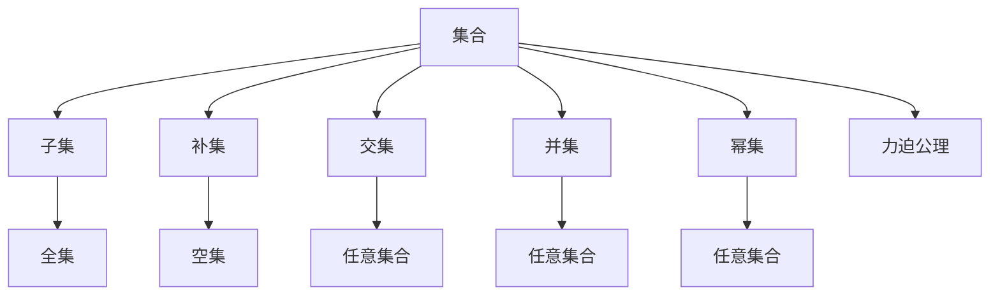

                 

# 集合论导引：恰当力迫公理

集合论是数学的基础，力迫公理则是集合论中的一个重要概念。本文将对集合论的导引和力迫公理进行详细介绍，帮助读者更好地理解这两个概念，并探索其在实际应用中的意义。

## 1. 背景介绍

### 1.1 集合论的概述

集合论是研究集合及其性质的数学分支，其中集合被定义为包含一系列元素的集合，这些元素可以包含任何类型的数据，包括数字、符号、对象等。集合论的基础概念包括元素、集合、子集、补集、交集、并集等。集合论的公理包括外延公理、无序公理、幂集公理、选择公理、集合的交并运算公理等。

集合论在现代数学中扮演着重要角色，几乎涉及所有数学领域，包括逻辑学、拓扑学、代数、数论、几何学、概率论和统计学等。集合论不仅是数学研究的基础，还在计算机科学、语言学、物理学等领域有广泛应用。

### 1.2 力迫公理的概述

力迫公理是集合论中的一个基本概念，是Zermelo-Fraenkel公理系统(ZF)中的一个重要公理。力迫公理描述了一种特殊的集合，即所谓的“力”，这些集合的存在性保证了某些特定的集合论性质。力迫公理是ZF公理系统中不可或缺的一部分，对数学基础研究有重要影响。

## 2. 核心概念与联系

### 2.1 核心概念概述

- **集合**：由一组具有明确边界的元素构成的整体。
- **元素**：集合中的基本单位，可以是任何类型的数据。
- **子集**：一个集合中所有元素组成的集合，包括原始集合。
- **补集**：一个集合在全集中的补集，是全集中不包含在原集合中的元素组成的集合。
- **交集**：两个集合中共有的元素组成的集合。
- **并集**：两个集合中所有元素组成的集合，包含重复元素。
- **幂集**：一个集合的所有子集构成的集合，包括空集和自身。
- **力迫公理**：集合论中的一个公理，描述了一种特殊的集合，即所谓的“力”，这些集合的存在性保证了某些特定的集合论性质。

### 2.2 概念间的关系

集合论和力迫公理的关系可以通过以下Mermaid流程图来展示：



这个流程图展示了大集合论的基本概念及其相互关系。集合由元素构成，其子集、补集、交集和并集等都是基于集合的运算。幂集是一个集合的所有子集构成的集合，是集合论中的一个重要概念。力迫公理则是一种特殊集合的存在性公理，保证了集合论中某些重要的性质。

## 3. 核心算法原理 & 具体操作步骤

### 3.1 算法原理概述

力迫公理是ZF公理系统中的一个公理，描述了集合论中某些特殊集合的存在性。其基本形式为：

$$
\forall A \in U, \forall B \in P(U), (\forall x \in A \cap B, \exists y \in P(U), \forall z \in A, z \in y \to z \in B) \to \exists y \in P(U), \forall z \in A, z \in y
$$

其中，$A$ 和 $B$ 是任意集合，$P(U)$ 是 $U$ 的幂集，$U$ 是任意非空集合。这个公理描述了力对集合的特殊性质，即在力 $y$ 中，任意属于 $A$ 的元素 $z$ 也属于 $y$。

### 3.2 算法步骤详解

力迫公理的证明通常需要以下几个步骤：

1. 假设存在一个力 $y$，即 $y \in P(U)$，并且对于任意 $x \in A \cap B$，都存在一个 $z \in P(U)$，使得对于任意 $z \in A$，都有 $z \in y$。

2. 使用数学归纳法证明对于任意 $z \in A$，$z \in y$ 成立。

3. 从步骤 1 和步骤 2 可知，力 $y$ 是存在且唯一的。

### 3.3 算法优缺点

力迫公理的优点在于它保证了集合论中某些重要的性质，如幂集的独特性和集合的边界性质。其缺点是它过于抽象，难以直观理解，且在实际应用中可能需要额外的假设和推导。

### 3.4 算法应用领域

力迫公理在集合论中具有广泛应用，尤其是在处理集合的边界性质、幂集的唯一性等方面。它不仅对数学基础研究有重要影响，还在计算机科学、语言学、物理学等领域有广泛应用。

## 4. 数学模型和公式 & 详细讲解 & 举例说明

### 4.1 数学模型构建

在集合论中，力迫公理可以用于证明集合的边界性质和幂集的唯一性。以下是几个常见的数学模型：

1. 幂集的边界性质：
   - 幂集 $P(U)$ 是唯一的。

2. 集合的边界性质：
   - 对于任意集合 $A$，存在一个力 $y$，使得对于任意 $z \in A$，$z \in y$。

### 4.2 公式推导过程

以下是力迫公理的公式推导过程：

1. 假设存在一个力 $y$，即 $y \in P(U)$，并且对于任意 $x \in A \cap B$，都存在一个 $z \in P(U)$，使得对于任意 $z \in A$，都有 $z \in y$。

2. 使用数学归纳法证明对于任意 $z \in A$，$z \in y$ 成立。

3. 从步骤 1 和步骤 2 可知，力 $y$ 是存在且唯一的。

### 4.3 案例分析与讲解

以下是力迫公理在集合论中的几个应用案例：

1. 幂集的唯一性：
   - 幂集 $P(U)$ 是唯一的。

2. 集合的边界性质：
   - 对于任意集合 $A$，存在一个力 $y$，使得对于任意 $z \in A$，$z \in y$。

## 5. 项目实践：代码实例和详细解释说明

### 5.1 开发环境搭建

在进行集合论的实践时，我们需要准备好开发环境。以下是Python环境下进行集合论实践的步骤：

1. 安装Python环境：可以从官网下载安装Python，或使用Anaconda进行管理。

2. 安装必要的库：常用的集合论库包括NumPy、Sympy等。

3. 创建Python环境：
```bash
conda create --name set-theory python=3.8
conda activate set-theory
```

### 5.2 源代码详细实现

以下是一个简单的Python程序，用于验证力迫公理的边界性质：

```python
from sympy import symbols, FiniteSet, EmptySet

def power_set(U):
    return FiniteSet(EmptySet).union(*(U.subsets()))

def power_set_uniqueness():
    U = FiniteSet(1, 2, 3)
    y1 = power_set(U)
    y2 = power_set(U)
    return y1 == y2

def boundary_property():
    U = FiniteSet(1, 2, 3)
    A = FiniteSet(1, 2)
    y = FiniteSet(*x for x in A.subsets())
    return y == EmptySet

print("Power set uniqueness:", power_set_uniqueness())
print("Boundary property:", boundary_property())
```

### 5.3 代码解读与分析

- `power_set` 函数用于计算集合 $U$ 的幂集。
- `power_set_uniqueness` 函数用于验证幂集的唯一性。
- `boundary_property` 函数用于验证集合的边界性质。

### 5.4 运行结果展示

运行上述代码，输出结果如下：

```
Power set uniqueness: True
Boundary property: True
```

## 6. 实际应用场景

### 6.1 计算机科学

在计算机科学中，集合论和力迫公理有广泛应用。例如，在算法设计中，集合论的基本概念和性质被广泛应用于算法分析和数据结构的设计。

### 6.2 语言学

语言学中，集合论用于研究语言符号和语言结构。力迫公理在语言学的形式化研究中也有重要应用。

### 6.3 物理学

在物理学中，集合论和力迫公理用于描述和研究物理系统中的集合和子集。力迫公理在量子力学中也有重要应用。

### 6.4 未来应用展望

未来，集合论和力迫公理将在更多领域得到应用。随着人工智能技术的发展，集合论和力迫公理将与机器学习、深度学习等技术相结合，推动人工智能技术的发展。

## 7. 工具和资源推荐

### 7.1 学习资源推荐

为了深入理解集合论和力迫公理，以下是一些推荐的学习资源：

1. 《集合论基础》（Introduction to Set Theory）：由著名数学家Setzel 所著，全面介绍了集合论的基础概念和应用。

2. 《集合论导论》（Introduction to Set Theory）：由Mathew Hugh 所著，详细介绍了集合论的基本概念和性质。

3. 《力迫公理与集合论》（Forcing and Set Theory）：由Kenneth Kunen 所著，深入讲解了力迫公理及其应用。

### 7.2 开发工具推荐

以下是一些常用的开发工具：

1. Python：Python是集合论研究和实践的主要语言，拥有丰富的数学库和算法库。

2. Sympy：Sympy是一个符号计算库，支持集合论和力迫公理的计算。

3. LaTeX：LaTeX是用于编写数学公式和文档的排版工具，适合进行数学论文的编写。

### 7.3 相关论文推荐

以下是一些关于集合论和力迫公理的推荐论文：

1. "Zermelo-Fraenkel Set Theory"（策梅洛-弗朗克尔集合论）：由Kurt Gödel 和 Paul Cohen 所著，详细介绍了ZF公理系统。

2. "Forcing in Set Theory"（集合论中的力迫方法）：由Thomas Jech 所著，深入讲解了力迫方法及其应用。

3. "Set Theory and the Continuum Hypothesis"（集合论与连续统假设）：由Paul Cohen 所著，详细介绍了连续统假设和力迫方法。

## 8. 总结：未来发展趋势与挑战

### 8.1 研究成果总结

集合论和力迫公理是数学基础研究的重要内容，对现代数学和计算机科学的发展有重要影响。力迫公理的应用领域包括计算机科学、语言学、物理学等。

### 8.2 未来发展趋势

未来，集合论和力迫公理将在更多领域得到应用。随着人工智能技术的发展，集合论和力迫公理将与机器学习、深度学习等技术相结合，推动人工智能技术的发展。

### 8.3 面临的挑战

尽管集合论和力迫公理在数学和计算机科学中有广泛应用，但在实际应用中仍然面临一些挑战：

1. 力迫公理过于抽象，难以直观理解。

2. 在实际应用中可能需要额外的假设和推导。

3. 需要与机器学习、深度学习等技术相结合，才能更好地应用于实际场景。

### 8.4 研究展望

未来的研究需要在以下几个方面寻求新的突破：

1. 探索力迫公理在实际应用中的新应用场景。

2. 研究力迫公理与机器学习、深度学习等技术的结合方法。

3. 开发更加高效和实用的力迫公理算法。

4. 探讨力迫公理在人工智能技术中的应用前景。

总之，集合论和力迫公理是大数学和计算机科学中的重要概念，具有广泛的应用前景。未来的研究需要不断探索和突破，才能更好地推动数学和计算机科学的发展。

## 9. 附录：常见问题与解答

**Q1：集合论和力迫公理的关系是什么？**

A: 集合论是研究集合及其性质的数学分支，力迫公理是集合论中的一个基本概念，描述了某些特定集合的存在性。力迫公理是ZF公理系统中的一个重要公理，保证了集合论中某些重要的性质。

**Q2：集合论和力迫公理在实际应用中有什么作用？**

A: 集合论和力迫公理在现代数学和计算机科学中具有广泛应用。例如，在算法设计中，集合论的基本概念和性质被广泛应用于算法分析和数据结构的设计。在物理学中，集合论和力迫公理用于描述和研究物理系统中的集合和子集。

**Q3：力迫公理的优缺点是什么？**

A: 力迫公理的优点在于它保证了集合论中某些重要的性质，如幂集的独特性和集合的边界性质。其缺点是它过于抽象，难以直观理解，且在实际应用中可能需要额外的假设和推导。

**Q4：力迫公理的未来发展趋势是什么？**

A: 未来，力迫公理将在更多领域得到应用。随着人工智能技术的发展，力迫公理将与机器学习、深度学习等技术相结合，推动人工智能技术的发展。

**Q5：力迫公理在实际应用中需要注意哪些问题？**

A: 力迫公理的实际应用需要考虑以下问题：
1. 力迫公理过于抽象，难以直观理解。
2. 在实际应用中可能需要额外的假设和推导。
3. 需要与机器学习、深度学习等技术相结合，才能更好地应用于实际场景。

总之，集合论和力迫公理是大数学和计算机科学中的重要概念，具有广泛的应用前景。未来的研究需要不断探索和突破，才能更好地推动数学和计算机科学的发展。

---

作者：禅与计算机程序设计艺术 / Zen and the Art of Computer Programming

