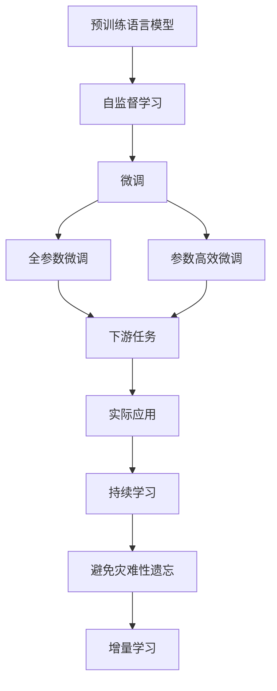
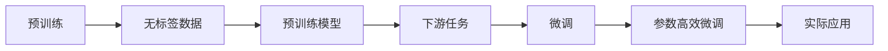
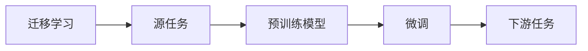
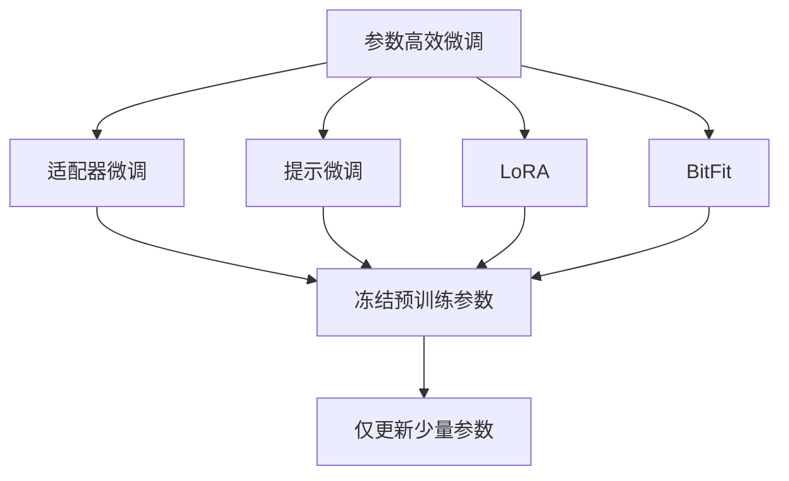
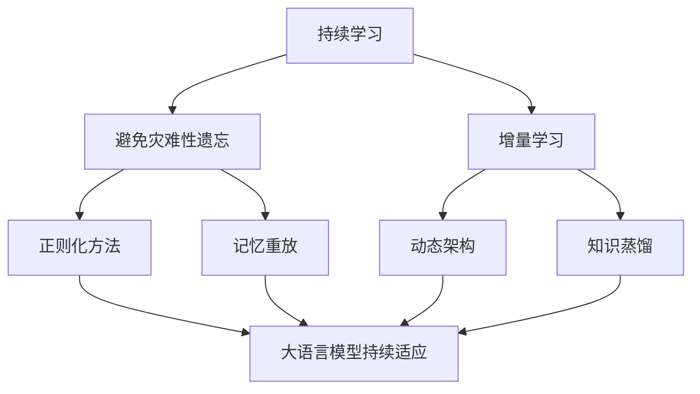
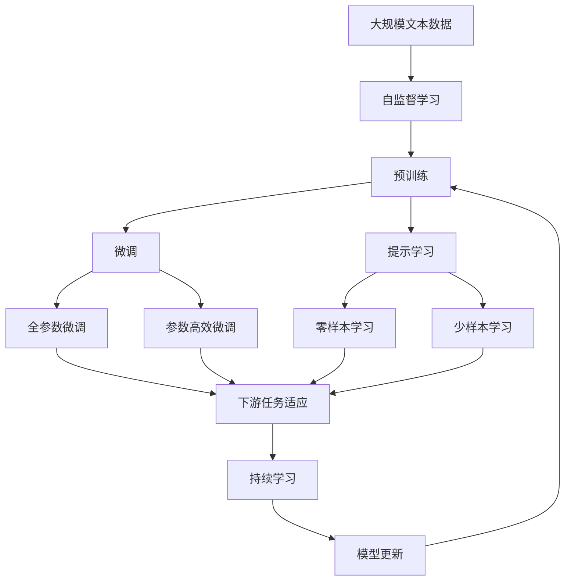

                 

# 预训练与微调的实战技巧

> 关键词：预训练,微调,Transformer,BERT,自监督学习,迁移学习,自然语言处理(NLP)

## 1. 背景介绍

### 1.1 问题由来

在人工智能领域，预训练与微调（Pre-training and Fine-tuning）是一对重要的技术手段，它们在大规模语言模型（Large Language Models, LLMs）如BERT、GPT等的发展中起到了关键作用。预训练是指在大规模无标签数据上训练模型，从而获得泛化能力强的语言表示。微调则是利用预训练模型在特定任务上的性能，通过少量标注数据对其进行细粒度调整，以适应具体的业务需求。

预训练与微调的结合使得模型能够有效利用大规模无标签数据进行知识学习，同时通过微调机制进行任务适配，提升模型的针对性和实用性。这一范式在自然语言处理（Natural Language Processing, NLP）领域取得了显著的进展，成为了实现NLP技术落地的重要方式。

### 1.2 问题核心关键点

预训练与微调的核心思想可以概括为“以小博大”，即在大规模无标签数据上预训练出强大的语言模型，然后通过在特定任务上的微调，使模型具备对新任务的适应能力。这一过程的有效性依赖于以下几个关键点：

- **预训练数据**：无标签数据的质量和多样性直接影响预训练的效果。
- **预训练模型**：模型的架构和参数配置决定了预训练的质量和泛化能力。
- **微调任务**：微调任务的选择和设计对模型的性能提升至关重要。
- **微调数据**：标注数据的质量和数量直接影响微调的效果。

### 1.3 问题研究意义

预训练与微调技术的核心意义在于其高效性和泛化能力。通过预训练，模型可以从大规模数据中学习到丰富的语言知识，而微调则使得模型能够快速适应特定任务，提升模型在实际应用中的表现。这一技术对NLP技术落地应用具有重要意义：

- **降低开发成本**：预训练模型可以作为基线，微调只需少量标注数据即可达到较高性能，降低了人工标注和模型训练的成本。
- **提升模型效果**：微调后的模型能够更好地适应特定任务，在特定领域内取得优异表现。
- **加速开发周期**：微调机制使得模型能够快速进行任务适配，缩短开发周期，加快项目进展。
- **促进技术创新**：微调过程涉及到模型优化和任务适配的多个层面，推动了NLP技术在多个方向上的创新。
- **赋能产业升级**：微调技术使得NLP技术更容易被各行各业所采用，为传统行业的数字化转型提供了新的技术路径。

## 2. 核心概念与联系

### 2.1 核心概念概述

为了更好地理解预训练与微调技术，我们将介绍几个关键概念：

- **预训练语言模型（Pre-training Language Model）**：通过在大量无标签数据上自监督学习训练得到的模型，能够获得泛化能力强的语言表示。
- **自监督学习（Self-supervised Learning）**：利用文本本身的结构信息，如掩码语言模型（Masked Language Model, MLM）和下一句预测（Next Sentence Prediction, NSP）等任务，训练语言模型。
- **微调（Fine-tuning）**：在预训练模型的基础上，使用特定任务的标注数据，通过有监督学习调整模型参数，使其适应新任务。
- **迁移学习（Transfer Learning）**：将一个领域学到的知识迁移到另一个领域，以提高模型的泛化能力和适应性。

这些概念之间的逻辑关系可以通过以下Mermaid流程图来展示：



这个流程图展示了预训练与微调的基本流程和关键技术：

1. 预训练语言模型通过自监督学习获得泛化能力强的语言表示。
2. 微调利用标注数据调整模型参数，使其适应特定任务。
3. 微调后的模型可以直接用于实际应用，如文本分类、问答、生成等。
4. 微调模型通过持续学习不断更新，以适应新的数据分布。

### 2.2 概念间的关系

这些核心概念之间存在着紧密的联系，形成了预训练与微调的整体生态系统。我们通过几个Mermaid流程图来展示这些概念之间的关系：

#### 2.2.1 预训练模型的学习范式



这个流程图展示了预训练模型的学习范式：通过自监督学习在无标签数据上训练得到预训练模型，然后在下游任务上进行微调。

#### 2.2.2 微调与迁移学习的关系



这个流程图展示了迁移学习的基本原理：通过微调将预训练模型从源任务迁移到下游任务。

#### 2.2.3 参数高效微调方法



这个流程图展示了几种常见的参数高效微调方法，包括适配器微调、提示微调、LoRA和BitFit。这些方法的共同特点是冻结大部分预训练参数，只更新少量参数，从而提高微调效率。

#### 2.2.4 持续学习在大语言模型中的应用



这个流程图展示了持续学习在大语言模型中的应用。持续学习的主要目标是避免灾难性遗忘和实现增量学习。通过正则化方法、记忆重放、动态架构和知识蒸馏等技术，可以使大语言模型持续适应新的任务和数据。

### 2.3 核心概念的整体架构

最后，我们用一个综合的流程图来展示这些核心概念在大语言模型预训练与微调过程中的整体架构：



这个综合流程图展示了从预训练到微调，再到持续学习的完整过程。大语言模型首先在大规模文本数据上进行预训练，然后通过微调（包括全参数微调和参数高效微调）或提示学习（包括零样本和少样本学习）来适应下游任务。最后，通过持续学习技术，模型可以不断更新和适应新的任务和数据。

## 3. 核心算法原理 & 具体操作步骤

### 3.1 算法原理概述

预训练与微调技术的核心思想是利用大规模无标签数据训练模型，然后通过微调机制在特定任务上进行调整。其核心思想可以概括为“以小博大”，即在大规模无标签数据上预训练出强大的语言模型，然后通过微调机制进行任务适配，提升模型的针对性和实用性。

具体来说，预训练过程是通过自监督学习任务训练语言模型，从而学习到语言的结构和语义知识。微调过程则是利用标注数据调整模型参数，使其适应特定任务。这一过程可以形式化地表示为：

$$
\theta = \mathop{\arg\min}_{\theta} \mathcal{L}(M_{\theta}, D)
$$

其中，$\theta$为模型参数，$M_{\theta}$为预训练语言模型，$D$为下游任务的标注数据集，$\mathcal{L}$为损失函数，用于衡量模型预测输出与真实标签之间的差异。

通过梯度下降等优化算法，微调过程不断更新模型参数$\theta$，最小化损失函数$\mathcal{L}$，使得模型输出逼近真实标签。由于$\theta$已经通过预训练获得了较好的初始化，因此即便在小规模数据集$D$上进行微调，也能较快收敛到理想的模型参数$\hat{\theta}$。

### 3.2 算法步骤详解

预训练与微调的基本流程包括数据准备、模型选择、微调设置和执行训练四个步骤：

**Step 1: 准备预训练模型和数据集**

1. **选择预训练模型**：根据任务类型选择合适的预训练语言模型，如BERT、GPT等。
2. **准备数据集**：将标注数据划分为训练集、验证集和测试集，确保数据质量与预训练数据分布一致。

**Step 2: 添加任务适配层**

1. **设计输出层**：根据任务类型设计合适的输出层，如线性分类器、解码器等。
2. **选择损失函数**：选择适合任务的损失函数，如交叉熵、均方误差等。

**Step 3: 设置微调超参数**

1. **选择优化算法**：如AdamW、SGD等，设置学习率、批大小、迭代轮数等。
2. **应用正则化技术**：如L2正则、Dropout、Early Stopping等，防止过拟合。
3. **冻结预训练参数**：只微调顶层，或全部参数都参与微调。

**Step 4: 执行梯度训练**

1. **前向传播**：将训练集数据输入模型，计算损失函数。
2. **反向传播**：计算梯度，根据优化算法和学习率更新模型参数。
3. **验证集评估**：周期性在验证集上评估模型性能，决定是否停止训练。
4. **重复迭代**：重复上述步骤直至模型收敛或达到预设轮数。

### 3.3 算法优缺点

预训练与微调技术具有以下优点：

1. **简单高效**：只需少量标注数据，即可快速获得优化效果。
2. **泛化能力强**：通过大规模预训练，模型具备较强的泛化能力。
3. **灵活性高**：可应用于各种NLP任务，设计简单的任务适配层即可实现微调。
4. **效果显著**：在诸多NLP任务上，基于微调的方法取得了优异的性能。

同时，该方法也存在以下局限性：

1. **依赖标注数据**：微调的效果很大程度上取决于标注数据的质量和数量。
2. **迁移能力有限**：当目标任务与预训练数据的分布差异较大时，微调的性能提升有限。
3. **负面效果传递**：预训练模型的偏见和有害信息可能通过微调传递到下游任务。
4. **可解释性不足**：微调模型的决策过程缺乏可解释性。

尽管存在这些局限性，但预训练与微调技术仍然是NLP领域的主流方法，未来仍有较大的发展空间。

### 3.4 算法应用领域

预训练与微调技术广泛应用于NLP的多个领域，包括但不限于：

- **文本分类**：如情感分析、主题分类等。
- **命名实体识别**：识别文本中的人名、地名、机构名等特定实体。
- **关系抽取**：从文本中抽取实体之间的语义关系。
- **问答系统**：对自然语言问题给出答案。
- **机器翻译**：将源语言文本翻译成目标语言。
- **文本摘要**：将长文本压缩成简短摘要。
- **对话系统**：使机器能够与人自然对话。
- **生成式任务**：如文本生成、对话生成等。

此外，预训练与微调技术还在知识图谱构建、智能客服、金融舆情监测、个性化推荐等多个领域得到了广泛应用，为NLP技术的发展提供了强大的动力。

## 4. 数学模型和公式 & 详细讲解  
### 4.1 数学模型构建

形式化地，假设预训练语言模型为$M_{\theta}$，其中$\theta$为模型参数。给定下游任务$T$的标注数据集$D=\{(x_i, y_i)\}_{i=1}^N, x_i \in \mathcal{X}, y_i \in \mathcal{Y}$。

定义模型$M_{\theta}$在数据样本$(x,y)$上的损失函数为$\ell(M_{\theta}(x),y)$，则在数据集$D$上的经验风险为：

$$
\mathcal{L}(\theta) = \frac{1}{N} \sum_{i=1}^N \ell(M_{\theta}(x_i),y_i)
$$

微调的优化目标是最小化经验风险，即找到最优参数：

$$
\theta^* = \mathop{\arg\min}_{\theta} \mathcal{L}(\theta)
$$

在实践中，我们通常使用基于梯度的优化算法（如SGD、Adam等）来近似求解上述最优化问题。设$\eta$为学习率，$\lambda$为正则化系数，则参数的更新公式为：

$$
\theta \leftarrow \theta - \eta \nabla_{\theta}\mathcal{L}(\theta) - \eta\lambda\theta
$$

其中 $\nabla_{\theta}\mathcal{L}(\theta)$ 为损失函数对参数 $\theta$ 的梯度，可通过反向传播算法高效计算。

### 4.2 公式推导过程

以下我们以二分类任务为例，推导交叉熵损失函数及其梯度的计算公式。

假设模型 $M_{\theta}$ 在输入 $x$ 上的输出为 $\hat{y}=M_{\theta}(x) \in [0,1]$，表示样本属于正类的概率。真实标签 $y \in \{0,1\}$。则二分类交叉熵损失函数定义为：

$$
\ell(M_{\theta}(x),y) = -[y\log \hat{y} + (1-y)\log (1-\hat{y})]
$$

将其代入经验风险公式，得：

$$
\mathcal{L}(\theta) = -\frac{1}{N}\sum_{i=1}^N [y_i\log M_{\theta}(x_i)+(1-y_i)\log(1-M_{\theta}(x_i))]
$$

根据链式法则，损失函数对参数 $\theta_k$ 的梯度为：

$$
\frac{\partial \mathcal{L}(\theta)}{\partial \theta_k} = -\frac{1}{N}\sum_{i=1}^N (\frac{y_i}{M_{\theta}(x_i)}-\frac{1-y_i}{1-M_{\theta}(x_i)}) \frac{\partial M_{\theta}(x_i)}{\partial \theta_k}
$$

其中 $\frac{\partial M_{\theta}(x_i)}{\partial \theta_k}$ 可进一步递归展开，利用自动微分技术完成计算。

### 4.3 案例分析与讲解

以BERT模型为例，BERT通过在自监督任务上进行预训练，学习到丰富的语言知识。假设我们希望在命名实体识别（Named Entity Recognition, NER）任务上微调BERT，可以将训练集和验证集标注为：

- 训练集：`"The capital of France is Paris."`，标注为`[CLS] [B-PER] France [I-PER] [B-LOC] Paris [SEP]`
- 验证集：`"George Washington was the first president of the United States."`，标注为`[CLS] [B-PER] George [I-PER] [B-MISC] Washington [I-MISC] [B-LOC] the [I-MISC] United [B-LOC] States [SEP]`

在微调过程中，我们可以设计一个简单的输出层，将输入的BERT输出作为输入，使用线性分类器进行NER任务的预测。损失函数选择交叉熵损失，用于衡量模型预测的标签与真实标签之间的差异。

假设BERT的预训练参数已经固定，我们只需要微调顶层分类器，因此模型的微调参数为：

$$
\theta_{output} = [w_1, w_2, b_1, b_2, ..., w_n, w_{n+1}, b_{n+1}]
$$

其中 $w_i$ 为输出层的权重，$b_i$ 为偏置。

我们将微调的损失函数定义为：

$$
\mathcal{L}(\theta_{output}, \theta_{pretrained}) = -\frac{1}{N}\sum_{i=1}^N \sum_{j=1}^n (y_{ij}\log \sigma(w_j x_i + b_j) + (1-y_{ij})\log(1-\sigma(w_j x_i + b_j)))
$$

其中 $\sigma$ 为sigmoid函数，$x_i$ 为输入的BERT输出，$y_{ij}$ 为标注数据中的真实标签，$n$ 为输出层中的类别数。

通过梯度下降算法，不断更新输出层的参数 $\theta_{output}$，最小化损失函数，使得模型能够在NER任务上取得良好的性能。

## 5. 项目实践：代码实例和详细解释说明

### 5.1 开发环境搭建

在进行预训练与微调实践前，我们需要准备好开发环境。以下是使用Python进行PyTorch开发的环境配置流程：

1. 安装Anaconda：从官网下载并安装Anaconda，用于创建独立的Python环境。

2. 创建并激活虚拟环境：
```bash
conda create -n pytorch-env python=3.8 
conda activate pytorch-env
```

3. 安装PyTorch：根据CUDA版本，从官网获取对应的安装命令。例如：
```bash
conda install pytorch torchvision torchaudio cudatoolkit=11.1 -c pytorch -c conda-forge
```

4. 安装Transformers库：
```bash
pip install transformers
```

5. 安装各类工具包：
```bash
pip install numpy pandas scikit-learn matplotlib tqdm jupyter notebook ipython
```

完成上述步骤后，即可在`pytorch-env`环境中开始预训练与微调实践。

### 5.2 源代码详细实现

下面我们以BERT模型在命名实体识别（NER）任务上的微调为例，给出使用Transformers库的PyTorch代码实现。

首先，定义NER任务的数据处理函数：

```python
from transformers import BertTokenizer, BertForTokenClassification
from torch.utils.data import Dataset
import torch

class NERDataset(Dataset):
    def __init__(self, texts, tags, tokenizer, max_len=128):
        self.texts = texts
        self.tags = tags
        self.tokenizer = tokenizer
        self.max_len = max_len
        
    def __len__(self):
        return len(self.texts)
    
    def __getitem__(self, item):
        text = self.texts[item]
        tags = self.tags[item]
        
        encoding = self.tokenizer(text, return_tensors='pt', max_length=self.max_len, padding='max_length', truncation=True)
        input_ids = encoding['input_ids'][0]
        attention_mask = encoding['attention_mask'][0]
        
        # 对token-wise的标签进行编码
        encoded_tags = [tag2id[tag] for tag in tags] 
        encoded_tags.extend([tag2id['O']] * (self.max_len - len(encoded_tags)))
        labels = torch.tensor(encoded_tags, dtype=torch.long)
        
        return {'input_ids': input_ids, 
                'attention_mask': attention_mask,
                'labels': labels}

# 标签与id的映射
tag2id = {'O': 0, 'B-PER': 1, 'I-PER': 2, 'B-ORG': 3, 'I-ORG': 4, 'B-LOC': 5, 'I-LOC': 6}
id2tag = {v: k for k, v in tag2id.items()}

# 创建dataset
tokenizer = BertTokenizer.from_pretrained('bert-base-cased')

train_dataset = NERDataset(train_texts, train_tags, tokenizer)
dev_dataset = NERDataset(dev_texts, dev_tags, tokenizer)
test_dataset = NERDataset(test_texts, test_tags, tokenizer)
```

然后，定义模型和优化器：

```python
from transformers import BertForTokenClassification, AdamW

model = BertForTokenClassification.from_pretrained('bert-base-cased', num_labels=len(tag2id))

optimizer = AdamW(model.parameters(), lr=2e-5)
```

接着，定义训练和评估函数：

```python
from torch.utils.data import DataLoader
from tqdm import tqdm
from sklearn.metrics import classification_report

device = torch.device('cuda') if torch.cuda.is_available() else torch.device('cpu')
model.to(device)

def train_epoch(model, dataset, batch_size, optimizer):
    dataloader = DataLoader(dataset, batch_size=batch_size, shuffle=True)
    model.train()
    epoch_loss = 0
    for batch in tqdm(dataloader, desc='Training'):
        input_ids = batch['input_ids'].to(device)
        attention_mask = batch['attention_mask'].to(device)
        labels = batch['labels'].to(device)
        model.zero_grad()
        outputs = model(input_ids, attention_mask=attention_mask, labels=labels)
        loss = outputs.loss
        epoch_loss += loss.item()
        loss.backward()
        optimizer.step()
    return epoch_loss / len(dataloader)

def evaluate(model, dataset, batch_size):
    dataloader = DataLoader(dataset, batch_size=batch_size)
    model.eval()
    preds, labels = [], []
    with torch.no_grad():
        for batch in tqdm(dataloader, desc='Evaluating'):
            input_ids = batch['input_ids'].to(device)
            attention_mask = batch['attention_mask'].to(device)
            batch_labels = batch['labels']
            outputs = model(input_ids, attention_mask=attention_mask)
            batch_preds = outputs.logits.argmax(dim=2).to('cpu').tolist()
            batch_labels = batch_labels.to('cpu').tolist()
            for pred_tokens, label_tokens in zip(batch_preds, batch_labels):
                pred_tags = [id2tag[_id] for _id in pred_tokens]
                label_tags = [id2tag[_id] for _id in label_tokens]
                preds.append(pred_tags[:len(label_tags)])
                labels.append(label_tags)
                
    print(classification_report(labels, preds))
```

最后，启动训练流程并在测试集上评估：

```python
epochs = 5
batch_size = 16

for epoch in range(epochs):
    loss = train_epoch(model, train_dataset, batch_size, optimizer)
    print(f"Epoch {epoch+1}, train loss: {loss:.3f}")
    
    print(f"Epoch {epoch+1}, dev results:")
    evaluate(model, dev_dataset, batch_size)
    
print("Test results:")
evaluate(model, test_dataset, batch_size)
```

以上就是使用PyTorch对BERT进行命名实体识别任务微调的完整代码实现。可以看到，得益于Transformers库的强大封装，我们可以用相对简洁的代码完成BERT模型的加载和微调。

### 5.3 代码解读与分析

让我们再详细解读一下关键代码的实现细节：

**NERDataset类**：
- `__init__`方法：初始化文本、标签、分词器等关键组件。
- `__len__`方法：返回数据集的样本数量。
- `__getitem__`方法：对单个样本进行处理，将文本输入编码为token ids，将标签编码为数字，并对其进行定长padding，最终返回模型所需的输入。

**tag2id和id2tag字典**：
- 定义了标签与数字id之间的映射关系，用于将token-wise的预测结果解码回真实的标签。

**训练和评估函数**：
- 使用PyTorch的DataLoader对数据集进行批次化加载，供模型训练和推理使用。
- 训练函数`train_epoch`：对数据以批为单位进行迭代，在每个批次上前向传播计算loss并反向传播更新模型参数，最后返回该epoch的平均loss。
- 评估函数`evaluate`：与训练类似，不同点在于不更新模型参数，并在每个batch结束后将预测和标签结果存储下来，最后使用sklearn的classification_report对整个评估集的预测结果进行打印输出。

**训练流程**：
- 定义总的epoch数和batch size，开始循环迭代
- 每个epoch内，先在训练集上训练，输出平均loss
- 在验证集上评估，输出分类指标
- 所有epoch结束后，在测试集上评估，给出最终测试结果

可以看到，PyTorch配合Transformers库使得BERT微调的代码实现变得简洁高效。开发者可以将更多精力放在数据处理、模型改进等高层逻辑上，而不必过多关注底层的实现细节。

当然，工业级的系统实现还需考虑更多因素，如模型的保存和部署、超参数的自动搜索、更灵活的任务适配层等。但核心的微调范式基本与此

