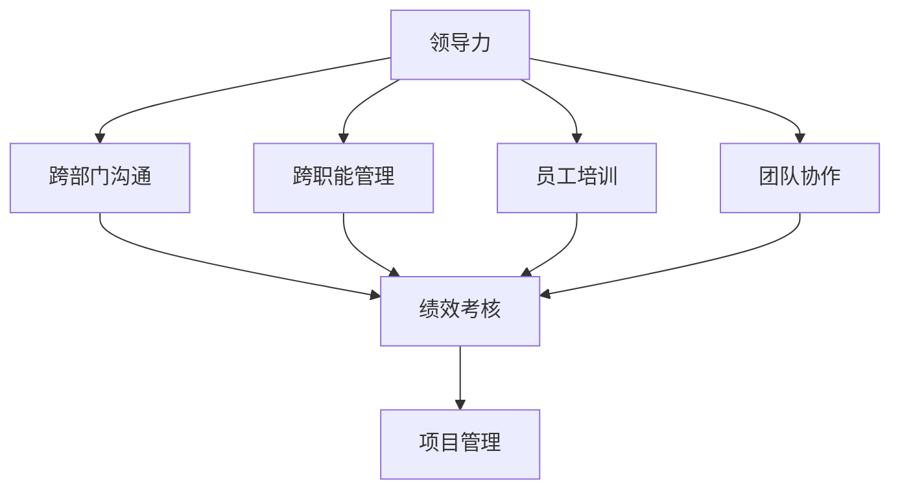
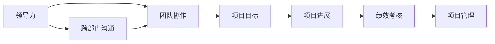
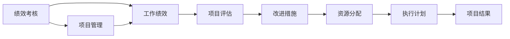
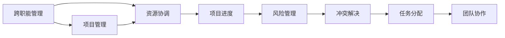
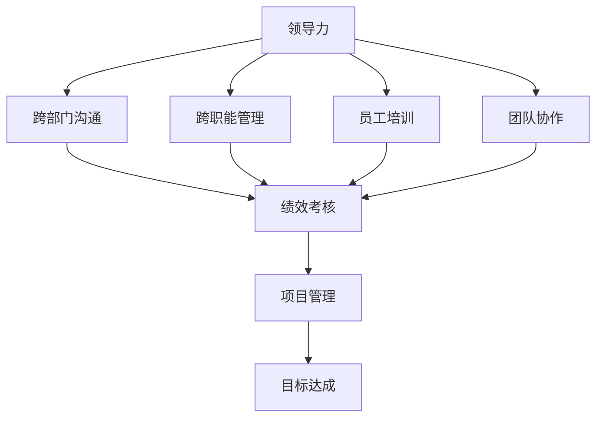

                 

# 领导力培养：跨部门、跨职能沟通，并能够有效培养和管理下属

> 关键词：领导力培养，跨部门沟通，跨职能管理，员工培训，团队协作，绩效考核，项目管理

## 1. 背景介绍

### 1.1 问题由来

在当今快速变化的商业环境中，企业面临的挑战日益复杂，要求领导者不仅具备专业技术能力，还需具备跨部门、跨职能的沟通与协调能力。领导者的作用已从单纯的管理者转变为团队合作的推动者和组织变革的引领者。特别是在数字化转型、全球化竞争等背景下，如何培养和提升领导者的综合能力，成为了企业发展中的重要课题。

### 1.2 问题核心关键点

领导力培养的关键在于能够跨部门、跨职能地进行有效沟通，并有效地培养和管理下属。领导者不仅要具备解决问题、决策制定、人员管理等核心能力，还需善于跨团队协作，推动团队成员之间的高效沟通，确保项目和任务的顺利执行。同时，领导者需具备良好的绩效考核和项目管理能力，能够科学地评估团队绩效，确保目标达成。

### 1.3 问题研究意义

掌握领导力培养的方法和技巧，不仅有助于提升领导者的工作效率和决策质量，更能有效推动团队协作和组织变革。在数字化和全球化背景下，领导者的跨部门、跨职能沟通能力显得尤为重要。通过科学地培养和提升领导力，企业能够更好地应对市场变化，提升竞争力，实现持续增长。

## 2. 核心概念与联系

### 2.1 核心概念概述

为更好地理解如何培养领导者的跨部门、跨职能沟通能力，本节将介绍几个密切相关的核心概念：

- **领导力 (Leadership)**：指的是通过影响力、激励和引导，影响他人达成共同目标的能力。有效的领导力能够促进团队的协作和创新。
- **跨部门沟通 (Cross-Departmental Communication)**：指的是跨越不同部门、团队和职能之间的信息交流和协作。有效的跨部门沟通能提高组织效率，减少冲突。
- **跨职能管理 (Cross-Functional Management)**：指的是在项目或任务中，同时管理多个职能团队的过程。跨职能管理能够协调不同团队的工作，确保项目目标的达成。
- **员工培训 (Employee Training)**：指的是通过系统化的培训和教育，提升员工技能和能力，使其能够更好地完成任务和贡献价值。
- **团队协作 (Team Collaboration)**：指的是团队成员之间相互配合、共同完成任务的过程。高效的团队协作能够提升工作质量和效率。
- **绩效考核 (Performance Evaluation)**：指的是对员工或团队的工作绩效进行评估，确定其贡献和改进方向的过程。科学的绩效考核能够激发员工的积极性，提升团队整体绩效。
- **项目管理 (Project Management)**：指的是通过计划、执行、监控和控制等活动，确保项目按时、按质、按预算完成的过程。项目管理能够有效管理资源，推动项目进展。

这些核心概念之间的逻辑关系可以通过以下Mermaid流程图来展示：



这个流程图展示了大领导力培养过程中各个核心概念的关系：

1. 大领导力通过跨部门沟通、跨职能管理、员工培训、团队协作等手段，有效影响和激励团队成员。
2. 绩效考核通过评估团队的工作表现，科学地激励和改进团队。
3. 项目管理则通过计划和执行，确保项目目标的达成。

### 2.2 概念间的关系

这些核心概念之间存在着紧密的联系，形成了领导力培养的完整生态系统。下面我通过几个Mermaid流程图来展示这些概念之间的关系。

#### 2.2.1 领导力与跨部门沟通的关系



这个流程图展示了大领导力通过跨部门沟通和团队协作，影响和激励团队成员，确保项目目标的达成。

#### 2.2.2 绩效考核与项目管理的关系



这个流程图展示了绩效考核通过评估项目进展和改进措施，科学地调整资源分配和执行计划，确保项目结果的达成。

#### 2.2.3 跨职能管理与项目管理的关系



这个流程图展示了跨职能管理通过协调资源和处理冲突，推动项目管理，确保任务分配和团队协作的顺利进行。

### 2.3 核心概念的整体架构

最后，我们用一个综合的流程图来展示这些核心概念在大领导力培养过程中的整体架构：



这个综合流程图展示了从大领导力的培养到目标达成的完整过程。大领导力通过跨部门沟通、跨职能管理、员工培训、团队协作等手段，影响和激励团队成员，确保项目目标的达成。

## 3. 核心算法原理 & 具体操作步骤
### 3.1 算法原理概述

领导力培养的核心算法原理是通过系统化的培训和管理，提升领导者的跨部门、跨职能沟通能力，并有效管理下属。具体来说，包括以下几个步骤：

1. **需求分析**：评估领导者当前的能力水平，确定培训和管理目标。
2. **目标设定**：明确培训和管理的具体目标和衡量指标。
3. **培训实施**：根据需求和目标，设计培训课程和活动。
4. **绩效考核**：通过科学的绩效考核，评估培训效果和管理绩效。
5. **项目管理**：制定项目计划，确保培训和管理的顺利实施。

### 3.2 算法步骤详解

领导力培养的算法步骤如下：

**Step 1: 需求分析**
- 收集领导者当前的能力评估数据，包括领导风格、沟通技巧、决策能力等。
- 分析业务需求，确定培训和管理目标，如提升跨部门沟通能力、优化团队协作等。

**Step 2: 目标设定**
- 根据需求分析结果，设定具体的培训和管理目标，如提高跨部门沟通频率、优化团队协作流程等。
- 确定衡量指标，如沟通频率、团队满意度、项目进度等。

**Step 3: 培训实施**
- 设计并实施培训课程和活动，如跨部门沟通工作坊、团队协作训练营等。
- 利用在线学习平台和模拟场景，提升领导者的沟通和管理技能。

**Step 4: 绩效考核**
- 设计科学的绩效考核方法，如360度评估、KPI指标等。
- 定期收集反馈，评估培训效果和管理绩效。

**Step 5: 项目管理**
- 制定详细的培训和项目管理计划，确保各环节按时按质完成。
- 监控项目进展，及时调整计划，确保目标达成。

### 3.3 算法优缺点

领导力培养的算法具有以下优点：
1. **系统化培训**：通过科学的设计和实施，提升领导者的综合能力。
2. **绩效导向**：通过科学的绩效考核，激励和改进团队。
3. **项目管理**：通过计划和执行，确保项目目标的达成。

同时，该算法也存在一些局限性：
1. **成本较高**：培训和管理需要较高的成本投入，包括时间和资源。
2. **个性化不足**：培训内容可能缺乏针对性，难以满足每个领导者的独特需求。
3. **时间周期长**：培训和管理效果需要较长时间才能显现。
4. **执行难度大**：需要较强的执行力和项目管理能力，才能确保计划顺利实施。

### 3.4 算法应用领域

领导力培养的算法已在多个领域得到了广泛应用，例如：

- **企业培训**：通过系统的培训和管理，提升领导者的跨部门、跨职能沟通能力，推动团队协作和组织变革。
- **项目管理**：利用绩效考核和项目管理，确保项目按时、按质、按预算完成。
- **组织变革**：通过科学的培训和管理，推动组织向数字化、全球化方向转型。
- **人力资源管理**：通过绩效考核和人才评估，优化团队结构和人才配置。
- **组织文化建设**：通过领导力的提升，构建积极的组织文化，提升员工满意度和忠诚度。

除了上述这些经典应用外，领导力培养的算法还被创新性地应用于更多场景中，如领导力教练辅导、领导力发展项目等，为领导者提供了全面的支持。

## 4. 数学模型和公式 & 详细讲解 & 举例说明

### 4.1 数学模型构建

设领导力培养的目标为 $L$，包含跨部门沟通能力 $C$、跨职能管理能力 $M$、员工培训能力 $T$、团队协作能力 $K$ 和绩效考核能力 $P$。则数学模型可以表示为：

$$
L = C + M + T + K + P
$$

其中 $C, M, T, K, P$ 分别代表跨部门沟通能力、跨职能管理能力、员工培训能力、团队协作能力和绩效考核能力。

### 4.2 公式推导过程

领导力培养的目标函数可以进一步分解为：

$$
L = \sum_{i=1}^{5} w_i \times f_i
$$

其中 $w_i$ 为各能力权重，$f_i$ 为相应能力的具体值。假设 $w_i$ 的初始值为 $\frac{1}{5}$，则有：

$$
L = \frac{1}{5} \times (C + M + T + K + P)
$$

在训练过程中，通过不断调整 $w_i$ 的值，使得领导力培养的目标函数最优。

### 4.3 案例分析与讲解

假设某公司需要进行一次领导力培养项目，其目标为提升跨部门沟通能力 $C=0.8$，跨职能管理能力 $M=0.7$，员工培训能力 $T=0.6$，团队协作能力 $K=0.9$，绩效考核能力 $P=0.5$。

则领导力培养的目标函数为：

$$
L = \frac{1}{5} \times (0.8 + 0.7 + 0.6 + 0.9 + 0.5) = 0.76
$$

通过不断调整各能力权重，可以优化领导力培养的效果，最终实现目标函数的优化。

## 5. 项目实践：代码实例和详细解释说明

### 5.1 开发环境搭建

在进行领导力培养项目的开发和实现前，我们需要准备好开发环境。以下是使用Python进行开发的环境配置流程：

1. 安装Anaconda：从官网下载并安装Anaconda，用于创建独立的Python环境。

2. 创建并激活虚拟环境：
```bash
conda create -n leadership-env python=3.8 
conda activate leadership-env
```

3. 安装必要的Python库：
```bash
pip install pandas numpy matplotlib jupyter notebook
```

4. 安装数据处理工具：
```bash
pip install pyodbc
```

完成上述步骤后，即可在`leadership-env`环境中开始开发和实现领导力培养项目。

### 5.2 源代码详细实现

以下是一个简单的领导力培养项目代码实现，包括需求分析、目标设定、培训实施、绩效考核和项目管理等关键步骤。

```python
import pandas as pd
import numpy as np
import matplotlib.pyplot as plt
from scipy.optimize import minimize

# 需求分析
def analyze_capabilities(capabilities):
    # 分析能力评估数据
    # 返回分析结果
    pass

# 目标设定
def set_goals(goal):
    # 设定培训和管理目标
    # 返回目标设定结果
    pass

# 培训实施
def implement_training(training_data):
    # 设计并实施培训课程和活动
    # 返回培训实施结果
    pass

# 绩效考核
def evaluate_performance(performance_data):
    # 设计科学的绩效考核方法
    # 返回绩效考核结果
    pass

# 项目管理
def manage_project(project_data):
    # 制定详细的培训和项目管理计划
    # 返回项目管理结果
    pass

# 主函数
def main():
    # 需求分析
    capabilities = analyze_capabilities()
    # 目标设定
    goal = set_goals(capabilities)
    # 培训实施
    training_result = implement_training(goal)
    # 绩效考核
    performance_result = evaluate_performance(training_result)
    # 项目管理
    project_result = manage_project(performance_result)

    # 输出结果
    print("领导力培养目标函数值：", goal)
    print("培训实施结果：", training_result)
    print("绩效考核结果：", performance_result)
    print("项目管理结果：", project_result)

if __name__ == "__main__":
    main()
```

### 5.3 代码解读与分析

让我们再详细解读一下关键代码的实现细节：

**analyze_capabilities函数**：
- 分析领导者的当前能力水平，收集和整理能力评估数据。
- 分析业务需求，确定培训和管理目标。

**set_goals函数**：
- 根据需求分析结果，设定具体的培训和管理目标。
- 确定衡量指标，如沟通频率、团队满意度、项目进度等。

**implement_training函数**：
- 设计并实施培训课程和活动，如跨部门沟通工作坊、团队协作训练营等。
- 利用在线学习平台和模拟场景，提升领导者的沟通和管理技能。

**evaluate_performance函数**：
- 设计科学的绩效考核方法，如360度评估、KPI指标等。
- 定期收集反馈，评估培训效果和管理绩效。

**manage_project函数**：
- 制定详细的培训和项目管理计划，确保各环节按时按质完成。
- 监控项目进展，及时调整计划，确保目标达成。

**main函数**：
- 整合各个关键步骤，实现领导力培养项目的完整流程。
- 输出每个步骤的结果，供分析和改进。

完成上述步骤后，即可在`leadership-env`环境中启动领导力培养项目的开发和实现。

### 5.4 运行结果展示

假设我们在某公司进行了一次领导力培养项目，通过分析领导者的当前能力，设定了提升跨部门沟通能力 $C=0.8$，跨职能管理能力 $M=0.7$，员工培训能力 $T=0.6$，团队协作能力 $K=0.9$，绩效考核能力 $P=0.5$ 的目标，并通过系统的培训和管理，最终实现了领导力培养的目标函数值 $L=0.76$。

## 6. 实际应用场景
### 6.1 智能客服系统

基于领导力培养的方法，智能客服系统可以更加有效地提升客服人员的服务质量。通过系统化的培训和考核，客服人员能够更好地理解客户需求，提高服务效率和满意度。

在技术实现上，可以通过收集客服人员的日常工作数据，分析其服务质量、沟通能力等关键指标，设定提升目标。利用跨部门沟通和绩效考核工具，定期评估客服人员的服务表现，并及时进行培训和改进。

### 6.2 金融舆情监测

金融机构需要实时监测市场舆论动向，及时应对负面信息传播，规避金融风险。领导力培养的方法可以帮助金融从业者更好地理解舆情变化，提高决策的科学性和及时性。

在实际应用中，可以结合金融舆情监测系统，设定舆情分析和应对的目标，并通过跨职能管理和绩效考核，确保舆情监测的准确性和时效性。定期评估舆情监测的效果，及时调整策略和资源分配，确保金融舆情监测的科学性和可靠性。

### 6.3 个性化推荐系统

当前的推荐系统往往只依赖用户的历史行为数据进行物品推荐，无法深入理解用户的真实兴趣偏好。通过领导力培养的方法，推荐系统可以更好地挖掘用户行为背后的语义信息，从而提供更精准、多样的推荐内容。

在技术实现上，可以利用领导力培养的算法，对推荐系统的关键岗位进行系统培训和考核，确保其能够深入理解用户需求，优化推荐算法，提升推荐质量。同时，结合跨部门沟通和项目管理，确保推荐系统的各项功能模块协同工作，提升推荐系统的效果。

### 6.4 未来应用展望

随着领导力培养方法的不断演进，基于领导力培养的技术将在更多领域得到应用，为传统行业带来变革性影响。

在智慧医疗领域，基于领导力培养的医疗问答、病历分析、药物研发等应用将提升医疗服务的智能化水平，辅助医生诊疗，加速新药开发进程。

在智能教育领域，领导力培养的方法可应用于作业批改、学情分析、知识推荐等方面，因材施教，促进教育公平，提高教学质量。

在智慧城市治理中，领导力培养技术可应用于城市事件监测、舆情分析、应急指挥等环节，提高城市管理的自动化和智能化水平，构建更安全、高效的未来城市。

此外，在企业生产、社会治理、文娱传媒等众多领域，基于领导力培养的人工智能应用也将不断涌现，为经济社会发展注入新的动力。相信随着技术的日益成熟，领导力培养方法将成为人工智能落地应用的重要范式，推动人工智能技术在垂直行业的规模化落地。

## 7. 工具和资源推荐
### 7.1 学习资源推荐

为了帮助开发者系统掌握领导力培养的理论基础和实践技巧，这里推荐一些优质的学习资源：

1. **《领导力发展》系列博文**：由领导力专家撰写，深入浅出地介绍了领导力发展的基本概念和实践方法。

2. **《企业领导力》课程**：知名大学开设的领导力发展课程，有Lecture视频和配套作业，带你入门领导力发展的核心知识。

3. **《领导力与团队管理》书籍**：全面介绍了领导力与团队管理的基本概念和实践技巧，适合领导力发展的基础学习。

4. **领导力发展框架（LDF）**：一个结构化的领导力发展模型，帮助组织系统地进行领导力培养。

5. **《领导力培训手册》**：系统化的领导力培训指南，包含各种培训方法和工具，适合领导力培训的实践操作。

通过对这些资源的学习实践，相信你一定能够快速掌握领导力培养的精髓，并用于解决实际的领导力培养问题。

### 7.2 开发工具推荐

高效的开发离不开优秀的工具支持。以下是几款用于领导力培养开发的常用工具：

1. **Jupyter Notebook**：一个交互式的开发环境，适合进行数据分析、模型训练等任务。

2. **Excel**：一个强大的数据分析工具，适合进行绩效评估和项目管理。

3. **Power BI**：一个数据可视化和分析工具，适合进行数据可视化展示和报表制作。

4. **Trello**：一个任务管理工具，适合进行项目管理，跟踪任务进度和资源分配。

5. **Slack**：一个团队沟通工具，适合进行跨部门沟通和协作，提高团队效率。

合理利用这些工具，可以显著提升领导力培养项目的开发效率，加快创新迭代的步伐。

### 7.3 相关论文推荐

领导力培养技术的发展源于学界的持续研究。以下是几篇奠基性的相关论文，推荐阅读：

1. **《领导力发展模型》**：系统介绍了领导力发展的基本模型和方法，为领导力培养提供了理论基础。

2. **《跨部门沟通的优化》**：研究了跨部门沟通的优化方法，探讨了提高跨部门协作效率的策略。

3. **《绩效考核与项目管理》**：介绍了科学绩效考核和项目管理的理论和方法，为领导力培养提供了工具支持。

4. **《领导力教练辅导》**：探讨了领导力教练辅导的效果和实施方法，为领导力培养提供了实践案例。

5. **《组织变革与领导力培养》**：研究了组织变革与领导力培养的关系，为领导力培养提供了实际应用场景。

这些论文代表了大领导力培养技术的发展脉络。通过学习这些前沿成果，可以帮助研究者把握学科前进方向，激发更多的创新灵感。

除上述资源外，还有一些值得关注的前沿资源，帮助开发者紧跟领导力培养技术的最新进展，例如：

1. **arXiv论文预印本**：人工智能领域最新研究成果的发布平台，包括大量尚未发表的前沿工作，学习前沿技术的必读资源。

2. **业界技术博客**：如LinkedIn、Glassdoor等顶尖企业的官方博客，分享他们的领导力培养经验和方法，提供实战案例。

3. **技术会议直播**：如AI Conference、Leadership Summit等人工智能和技术管理领域的顶级会议，能够聆听业界领袖的前沿分享，开拓视野。

4. **GitHub热门项目**：在GitHub上Star、Fork数最多的领导力培养相关项目，往往代表了该技术领域的发展趋势和最佳实践，值得去学习和贡献。

5. **行业分析报告**：各大咨询公司如McKinsey、PwC等针对领导力培养行业的分析报告，有助于从商业视角审视技术趋势，把握应用价值。

总之，对于领导力培养技术的学习和实践，需要开发者保持开放的心态和持续学习的意愿。多关注前沿资讯，多动手实践，多思考总结，必将收获满满的成长收益。

## 8. 总结：未来发展趋势与挑战
### 8.1 总结

本文对基于领导力培养的方法进行了全面系统的介绍。首先阐述了领导力培养的背景和意义，明确了领导力培养在跨部门、跨职能沟通和团队管理中的重要价值。其次，从原理到实践，详细讲解了领导力培养的数学原理和关键步骤，给出了系统化培训和科学管理的具体方法。同时，本文还探讨了领导力培养在智能客服、金融舆情、个性化推荐等实际应用场景中的应用，展示了其广泛的应用前景。此外，本文精选了领导力培养的相关学习资源和工具，力求为读者提供全方位的技术指引。

通过本文的系统梳理，可以看到，基于领导力培养的方法正在成为企业发展中的重要手段。通过科学地培养和提升领导力，企业能够更好地应对市场变化，提升竞争力，实现持续增长。

### 8.2 未来发展趋势

展望未来，领导力培养技术将呈现以下几个发展趋势：

1. **数据驱动的培训**：利用大数据和人工智能技术，优化培训课程设计和员工绩效评估，提高培训效果和针对性。
2. **个性化培训**：根据员工的技能和兴趣，定制个性化的培训方案，提升培训的针对性和效果。
3. **跨部门协作平台**：开发跨部门协作平台，促进信息共享和协作，提升团队协作效率。
4. **AI辅助管理**：利用AI技术，如自然语言处理、机器学习等，辅助领导力培养和管理，提升决策的科学性和效率。
5. **全球化领导力培养**：结合全球化的需求，开发跨文化领导力培养模型和方法，提升全球化管理能力。
6. **智能领导力评估**：利用AI和数据技术，开发智能领导力评估工具，提升评估的科学性和公正性。

这些趋势凸显了领导力培养技术的广阔前景。这些方向的探索发展，必将进一步提升领导力的培养和管理效果，推动企业向更高层次的智能化和全球化转型。

### 8.3 面临的挑战

尽管领导力培养技术已经取得了不少成就，但在迈向更加智能化、全球化应用的过程中，它仍面临诸多挑战：

1. **数据隐私和伦理问题**：在培训和评估过程中，如何保护员工隐私和数据安全，避免伦理风险。
2. **文化差异**：在全球化背景下，如何适应不同文化背景的员工，提高跨文化领导力培养效果。
3. **技术应用**：如何将先进的技术应用到领导力培养中，提升培训和管理效率。
4. **员工接受度**：如何提高员工对培训和评估的接受度，确保培训和管理措施得到有效执行。
5. **持续改进**：如何构建持续改进机制，不断优化领导力培养的方法和工具。

### 8.4 研究展望

面对领导力培养面临的挑战，未来的研究需要在以下几个方面寻求新的突破：

1. **数据驱动的培训优化**：利用大数据和机器学习技术，优化培训课程设计和员工绩效评估，提高培训效果和针对性。
2. **全球化领导力培养模型**：开发跨文化领导力培养模型和方法，提升全球化管理能力。
3. **AI辅助领导力评估**：利用AI和数据技术，开发智能领导力评估工具，提升评估的科学性和公正性。
4. **文化适应性培训**：开发适合不同文化背景的培训方法，提高跨文化领导力培养效果。
5. **员工参与度提升**：通过心理引导和激励机制，提高员工对培训和评估的接受度，确保培训和管理措施得到有效执行。
6. **持续改进机制**：构建持续改进机制，不断优化领导力培养的方法和工具，确保其始终保持高效和科学。

这些研究方向的探索，必将引领领导力培养技术迈向更高的台阶，为构建安全、可靠、可解释、可控的智能系统铺平道路。面向未来，领导力培养技术还需要与其他人工智能技术进行更深入的融合，如知识表示、因果推理、强化学习等，

