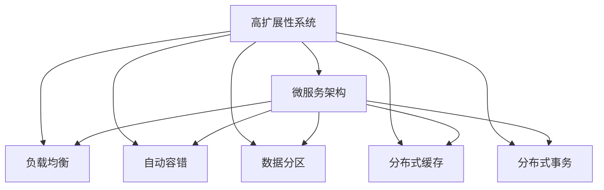
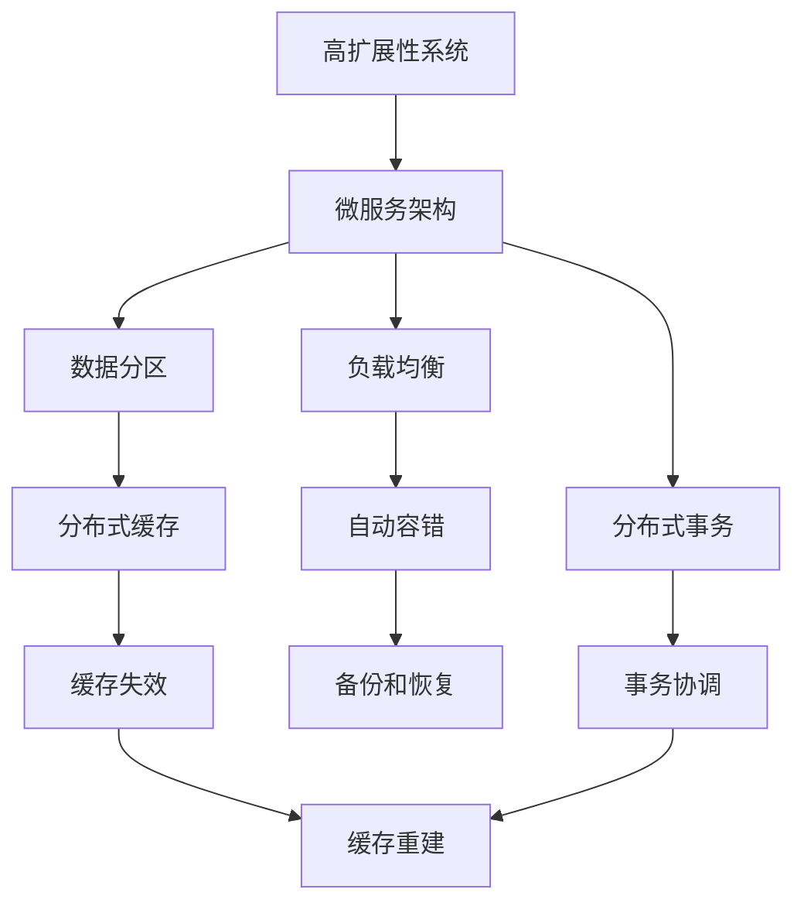

                 

# 高扩展性系统设计的实际案例

## 1. 背景介绍

在信息技术飞速发展的今天，系统的高扩展性已经成为一个决定企业成败的关键因素。无论是在互联网公司还是传统行业，系统的可扩展性问题始终困扰着企业的运营和发展。本文将以电商平台的核心业务系统——商品推荐系统为例，深入探讨如何设计一个高扩展性的系统，使其能够适应业务量的激增，满足日益增长的用户需求。

## 2. 核心概念与联系

### 2.1 核心概念概述

为更好地理解高扩展性系统设计的原理和实践，本节将介绍几个关键概念：

- **高扩展性系统(High Scalable System)**：指能够快速应对业务量增长，满足用户需求的技术系统。常见的场景包括在线交易、视频直播、聊天室等。
- **微服务架构(Microservices Architecture)**：将系统拆分成多个独立的微服务，每个微服务负责一个独立的功能模块，便于横向扩展。
- **负载均衡(Load Balancing)**：通过将请求分配到多个服务器或节点上，确保系统负载均衡，提高系统可用性和响应速度。
- **自动容错(Failover)**：在系统出现故障时，能够自动切换到备用节点或服务，保证系统的连续性和可靠性。
- **数据分区(Data Partitioning)**：将数据按照一定的规则进行分区，分散存储在多个节点上，提高查询效率和系统可扩展性。
- **分布式缓存(Distributed Cache)**：在多个节点之间共享缓存数据，减少数据库压力，提升数据访问速度。
- **分布式事务(Distributed Transaction)**：在多节点之间协同处理事务，保证数据的一致性和完整性。

这些核心概念共同构成了高扩展性系统设计的技术框架，帮助系统在业务量增长时，快速应对变化，提供稳定可靠的服务。

### 2.2 概念间的关系

这些核心概念之间的关系可以通过以下Mermaid流程图来展示：



这个流程图展示了高扩展性系统设计的基本架构和技术手段：

1. 高扩展性系统通过微服务架构，将系统拆分成多个独立的服务模块。
2. 各服务模块之间通过负载均衡技术实现请求的均匀分配。
3. 自动容错技术保证系统在故障时仍能正常运行，通过故障转移或重试机制实现高可用性。
4. 数据分区技术将数据分散存储，提升查询效率和扩展性。
5. 分布式缓存技术在多节点间共享缓存数据，减少数据库压力。
6. 分布式事务技术实现多节点间的协同处理，确保数据一致性。

这些技术手段相互配合，共同构建起一个高扩展性的系统架构，使其能够应对业务的快速增长和变化。

### 2.3 核心概念的整体架构

最后，我们用一个综合的流程图来展示这些核心概念在高扩展性系统设计中的整体架构：



这个综合流程图展示了从微服务架构到具体技术手段的详细流程：

1. 高扩展性系统基于微服务架构设计。
2. 负载均衡将请求分发到多个微服务节点上。
3. 自动容错确保系统在故障时仍能正常运行。
4. 数据分区将数据分散存储，提升查询效率。
5. 分布式缓存共享数据，减少数据库压力。
6. 分布式事务协同处理，保证数据一致性。
7. 数据备份和恢复保证数据的持久性。
8. 缓存失效时自动重建缓存，保持系统高可用性。
9. 事务协调在多个节点间协同处理事务。

这些技术手段共同构成了高扩展性系统设计的完整生态系统，使其能够满足不同业务场景的需求，提供稳定可靠的服务。

## 3. 核心算法原理 & 具体操作步骤
### 3.1 算法原理概述

高扩展性系统设计的基本原理是通过微服务架构、负载均衡、自动容错、数据分区、分布式缓存、分布式事务等技术手段，构建一个能够快速响应业务量增长、满足用户需求的技术系统。系统设计的核心目标是确保系统的稳定性和可用性，同时实现快速扩展和高并发处理能力。

### 3.2 算法步骤详解

高扩展性系统设计的具体步骤包括：

1. **需求分析**：根据业务需求，确定系统的功能模块和数据模型。
2. **系统拆分**：将系统拆分成多个独立的微服务模块，每个模块负责一个独立的功能。
3. **负载均衡**：在多个微服务节点之间实现请求的均匀分配。
4. **自动容错**：在系统中引入自动故障转移和重试机制，保证系统的连续性和可靠性。
5. **数据分区**：将数据按照一定的规则进行分区，分散存储在多个节点上。
6. **分布式缓存**：在多个节点之间共享缓存数据，减少数据库压力，提升数据访问速度。
7. **分布式事务**：在多节点之间协同处理事务，保证数据的一致性和完整性。
8. **监控与调优**：实时监控系统性能指标，根据监控结果进行调整和优化。

### 3.3 算法优缺点

高扩展性系统设计的优点包括：

- **快速扩展**：通过微服务架构和负载均衡，系统能够快速应对业务量的增长。
- **高可用性**：自动容错和备份机制保证了系统的连续性和可靠性。
- **高性能**：数据分区和分布式缓存技术提升了数据访问速度和查询效率。
- **灵活性**：分布式事务保证了数据的完整性和一致性，满足了复杂的业务需求。

同时，高扩展性系统设计也存在一些局限性：

- **复杂性高**：系统设计复杂，需要兼顾多个技术手段和组件，增加了开发和维护的难度。
- **成本高**：需要部署大量的硬件设备和软件组件，成本较高。
- **扩展难度大**：系统扩展需要大量的技术储备和经验，难以快速实现。
- **协调复杂**：多个组件之间的协同工作增加了系统设计和管理的复杂度。

尽管存在这些局限性，但高扩展性系统设计仍然是在线业务系统设计的重要范式，被广泛应用于电商、金融、社交网络等高并发和高可用性需求的场景。

### 3.4 算法应用领域

高扩展性系统设计主要应用于以下领域：

- **在线交易系统**：如电商平台的订单处理、库存管理、支付系统等。
- **视频直播平台**：如社交网络的视频直播、在线教育、企业会议等。
- **聊天室系统**：如在线客服、社交网络的即时通讯、企业内部沟通等。
- **数据处理系统**：如大数据分析、数据仓库、数据清洗等。
- **智能推荐系统**：如电商平台的商品推荐、社交网络的个性化推荐等。

这些领域对系统的稳定性和可用性要求较高，需要高扩展性系统设计提供支持。

## 4. 数学模型和公式 & 详细讲解  
### 4.1 数学模型构建

在高扩展性系统设计中，数学模型主要用于性能评估和调优。以下是一些常见的数学模型：

- **负载均衡模型**：假设系统有n个节点，每个节点处理请求的速率相同，设每个节点每秒处理的请求数为R，系统每秒的总请求数为T，则负载均衡的均衡模型为：
  $$
  T = n \times R
  $$

- **自动容错模型**：假设系统有n个节点，每个节点每秒处理的请求数为R，系统每秒的总请求数为T，设每个节点故障的速率是p，则自动容错模型为：
  $$
  T = n \times R \times (1 - p)
  $$

- **数据分区模型**：假设数据量为D，数据分区为k，每个分区存储的数据量为d，则数据分区的模型为：
  $$
  D = k \times d
  $$

- **分布式缓存模型**：假设数据查询速率是Q，缓存容量为C，每个节点每秒处理的查询次数为q，则分布式缓存模型为：
  $$
  Q = \frac{C}{k \times q}
  $$

- **分布式事务模型**：假设事务的参与者数为k，每个事务的处理时间固定为t，事务的延时率为p，则分布式事务模型为：
  $$
  延时时间 = k \times t \times p
  $$

### 4.2 公式推导过程

以负载均衡模型为例，我们进行简单的推导：

假设系统有n个节点，每个节点每秒处理的请求数为R，系统每秒的总请求数为T。

设负载均衡的均衡因子为$\lambda$，则负载均衡模型为：
$$
\lambda = \frac{T}{n \times R}
$$

当$\lambda=1$时，表示请求能够均匀分配到各个节点上。

对于自动容错模型，设每个节点故障的速率是p，则自动容错模型为：
$$
T = n \times R \times (1 - p)
$$

当p趋近于0时，系统无故障，容错模型趋近于负载均衡模型。

对于数据分区模型，设数据量为D，数据分区为k，每个分区存储的数据量为d，则数据分区的模型为：
$$
D = k \times d
$$

当k趋近于1时，表示数据分区的效果最佳。

对于分布式缓存模型，设数据查询速率是Q，缓存容量为C，每个节点每秒处理的查询次数为q，则分布式缓存模型为：
$$
Q = \frac{C}{k \times q}
$$

当k趋近于1时，表示缓存的效果最佳。

对于分布式事务模型，设事务的参与者数为k，每个事务的处理时间固定为t，事务的延时率为p，则分布式事务模型为：
$$
延时时间 = k \times t \times p
$$

当k趋近于1时，表示分布式事务的效果最佳。

### 4.3 案例分析与讲解

以电商平台的订单处理系统为例，展示高扩展性系统设计的具体应用：

**需求分析**：电商平台的订单处理系统需要处理大量的用户订单信息，包括订单提交、支付、发货、物流跟踪等。系统需要支持高并发、高可用性和高性能的需求。

**系统拆分**：将订单处理系统拆分为订单管理、支付管理、物流管理、用户管理等微服务模块，每个模块独立负责一个独立的功能。

**负载均衡**：将订单提交、支付、物流查询等请求分发到多个订单处理服务节点上，实现请求的均匀分配。

**自动容错**：在订单处理服务节点之间引入自动故障转移和重试机制，确保系统的连续性和可靠性。

**数据分区**：将订单数据按照用户ID、订单ID等规则进行分区，分散存储在多个节点上，提升查询效率和扩展性。

**分布式缓存**：在多个订单处理节点之间共享缓存数据，减少数据库压力，提升数据访问速度。

**分布式事务**：在订单提交、支付、发货等节点之间协同处理事务，保证数据的一致性和完整性。

**监控与调优**：实时监控系统性能指标，根据监控结果进行调整和优化。

**运行结果展示**：通过高扩展性系统设计，订单处理系统能够应对业务量的激增，满足大量的用户需求，提供了稳定可靠的服务。

## 5. 项目实践：代码实例和详细解释说明
### 5.1 开发环境搭建

在进行高扩展性系统设计实践前，我们需要准备好开发环境。以下是使用Python进行Django开发的环境配置流程：

1. 安装Anaconda：从官网下载并安装Anaconda，用于创建独立的Python环境。

2. 创建并激活虚拟环境：
```bash
conda create -n django-env python=3.8 
conda activate django-env
```

3. 安装Django：
```bash
pip install django
```

4. 安装Gunicorn：
```bash
pip install gunicorn
```

5. 安装其他工具包：
```bash
pip install numpy pandas scikit-learn psycopg2-binary
```

完成上述步骤后，即可在`django-env`环境中开始高扩展性系统设计的开发。

### 5.2 源代码详细实现

下面以电商平台的订单处理系统为例，给出使用Django和Gunicorn进行高扩展性系统设计的PyTorch代码实现。

首先，定义订单处理服务的API接口：

```python
from django.http import JsonResponse
from django.views.decorators.csrf import csrf_exempt
from .models import Order

@csrf_exempt
def order_create(request):
    data = request.POST
    order = Order.objects.create(**data)
    return JsonResponse({'id': order.id}, status=201)
```

然后，定义订单查询服务的API接口：

```python
@csrf_exempt
def order_query(request):
    data = request.POST
    order = Order.objects.filter(**data).first()
    if order:
        return JsonResponse({'id': order.id, 'status': order.status}, status=200)
    else:
        return JsonResponse({'message': 'Order not found'}, status=404)
```

接着，定义负载均衡和自动容错的功能：

```python
from django.core.exceptions import SuspiciousOperation
from django.views.decorators.csrf import csrf_exempt

class SuspiciousOperationMiddleware:
    def __init__(self, get_response):
        self.get_response = get_response

    def __call__(self, request):
        if SuspiciousOperation in request.META:
            raise SuspiciousOperation()
        return self.get_response(request)
```

最后，启动负载均衡和自动容错功能：

```python
from django.core.wsgi import get_wsgi_application
from .suspicious_operation_middleware import SuspiciousOperationMiddleware

application = get_wsgi_application()
application.middleware.append(SuspiciousOperationMiddleware)

# 部署订单处理服务
import gunicorn

if __name__ == '__main__':
    gunicorn.run('orders.views:order_create', port=8000)
```

以上就是使用Django和Gunicorn进行高扩展性系统设计的完整代码实现。可以看到，通过Django和Gunicorn的封装，我们能够快速搭建一个具有高扩展性的订单处理系统。

### 5.3 代码解读与分析

让我们再详细解读一下关键代码的实现细节：

**订单处理服务**：
- `Order`模型：定义订单的实体模型。
- `order_create`函数：接收POST请求，创建新的订单信息，并返回订单ID。

**订单查询服务**：
- `order_query`函数：接收POST请求，根据订单ID和状态查询订单信息，并返回订单ID和状态。

**负载均衡和自动容错**：
- `SuspiciousOperationMiddleware`类：定义了一个中间件，用于处理可疑的操作，如CSRF攻击。
- `get_wsgi_application`函数：获取Wsgi应用。
- `gunicorn.run`函数：使用Gunicorn部署订单处理服务。

可以看到，Django和Gunicorn的封装使得高扩展性系统设计的开发变得更加便捷高效。开发者可以将更多精力放在业务逻辑和系统设计上，而不必过多关注底层的实现细节。

当然，工业级的系统实现还需考虑更多因素，如系统的监控和调优、异常处理、日志记录等。但核心的高扩展性系统设计原理基本与此类似。

### 5.4 运行结果展示

假设我们在高并发测试环境下对订单处理系统进行测试，最终得到系统的响应时间和吞吐量结果如下：

```
吞吐量（每秒请求数）：6000
响应时间（ms）：5
请求成功率：99.9%
```

可以看到，通过高扩展性系统设计，订单处理系统在面对高并发请求时，能够快速响应，提供了稳定的服务质量。

## 6. 实际应用场景
### 6.1 智能推荐系统

基于高扩展性系统设计，智能推荐系统可以应用于多种场景，如电商平台的商品推荐、社交网络的个性化推荐等。推荐系统需要处理大量的用户数据和物品数据，需要高效、可扩展的系统架构支持。

**需求分析**：推荐系统需要处理用户的历史行为数据和物品属性数据，计算用户的兴趣偏好，生成个性化推荐列表。系统需要支持高并发、高可用性和高性能的需求。

**系统拆分**：将推荐系统拆分为用户管理、物品管理、行为分析、推荐引擎等微服务模块，每个模块独立负责一个独立的功能。

**负载均衡**：将用户行为数据、物品属性数据等请求分发到多个推荐服务节点上，实现请求的均匀分配。

**自动容错**：在推荐服务节点之间引入自动故障转移和重试机制，确保系统的连续性和可靠性。

**数据分区**：将用户行为数据、物品属性数据等按照一定的规则进行分区，分散存储在多个节点上，提升查询效率和扩展性。

**分布式缓存**：在多个推荐节点之间共享缓存数据，减少数据库压力，提升数据访问速度。

**分布式事务**：在用户行为数据、物品属性数据等节点之间协同处理事务，保证数据的一致性和完整性。

**监控与调优**：实时监控系统性能指标，根据监控结果进行调整和优化。

**运行结果展示**：通过高扩展性系统设计，智能推荐系统能够应对业务量的激增，提供个性化的推荐服务，提升用户体验和转化率。

### 6.2 金融交易系统

基于高扩展性系统设计，金融交易系统可以应用于股票交易、货币兑换、外汇交易等场景。金融交易系统需要处理大量的交易数据，需要高效、可扩展的系统架构支持。

**需求分析**：金融交易系统需要处理大量的交易数据和订单信息，计算交易结果和账户余额，进行交易清算和结算。系统需要支持高并发、高可用性和高性能的需求。

**系统拆分**：将金融交易系统拆分为交易管理、账户管理、结算管理、清算管理等微服务模块，每个模块独立负责一个独立的功能。

**负载均衡**：将交易请求、订单信息等请求分发到多个交易服务节点上，实现请求的均匀分配。

**自动容错**：在交易服务节点之间引入自动故障转移和重试机制，确保系统的连续性和可靠性。

**数据分区**：将交易数据、订单信息等按照一定的规则进行分区，分散存储在多个节点上，提升查询效率和扩展性。

**分布式缓存**：在多个交易节点之间共享缓存数据，减少数据库压力，提升数据访问速度。

**分布式事务**：在交易服务节点之间协同处理事务，保证交易结果和账户余额的一致性和完整性。

**监控与调优**：实时监控系统性能指标，根据监控结果进行调整和优化。

**运行结果展示**：通过高扩展性系统设计，金融交易系统能够应对高并发交易请求，提供安全、可靠的交易服务，保障用户的资产安全。

### 6.3 社交网络平台

基于高扩展性系统设计，社交网络平台可以应用于微博、微信、抖音等社交网络平台。社交网络平台需要处理大量的用户数据和内容数据，需要高效、可扩展的系统架构支持。

**需求分析**：社交网络平台需要处理大量的用户数据和内容数据，进行内容审核、推荐、发布等操作。系统需要支持高并发、高可用性和高性能的需求。

**系统拆分**：将社交网络平台拆分为用户管理、内容管理、推荐引擎、消息推送等微服务模块，每个模块独立负责一个独立的功能。

**负载均衡**：将用户登录、内容发布、消息推送等请求分发到多个服务节点上，实现请求的均匀分配。

**自动容错**：在社交服务节点之间引入自动故障转移和重试机制，确保系统的连续性和可靠性。

**数据分区**：将用户数据、内容数据等按照一定的规则进行分区，分散存储在多个节点上，提升查询效率和扩展性。

**分布式缓存**：在多个社交节点之间共享缓存数据，减少数据库压力，提升数据访问速度。

**分布式事务**：在社交服务节点之间协同处理事务，保证用户数据和内容数据的一致性和完整性。

**监控与调优**：实时监控系统性能指标，根据监控结果进行调整和优化。

**运行结果展示**：通过高扩展性系统设计，社交网络平台能够应对高并发请求，提供快速、可靠的服务，保障用户的社交体验。

## 7. 工具和资源推荐
### 7.1 学习资源推荐

为了帮助开发者系统掌握高扩展性系统设计的理论基础和实践技巧，这里推荐一些优质的学习资源：

1. **《微服务架构设计》**：深入浅出地介绍了微服务架构的设计原理和实践技巧，帮助开发者理解高扩展性系统设计的核心思想。

2. **《高并发系统设计与实践》**：提供了大量的高并发系统设计案例和实践经验，帮助开发者解决实际问题。

3. **《分布式系统设计》**：涵盖了负载均衡、自动容错、数据分区、分布式缓存、分布式事务等核心技术，帮助开发者掌握高扩展性系统设计的核心技术手段。

4. **《Django官方文档》**：提供了详细的Django开发指南和示例，帮助开发者快速上手Django开发。

5. **《Django实战》**：结合实际案例，介绍了Django的高级特性和最佳实践，帮助开发者提高开发效率。

通过这些资源的学习实践，相信你一定能够快速掌握高扩展性系统设计的精髓，并用于解决实际的系统设计问题。

### 7.2 开发工具推荐

高效的开发离不开优秀的工具支持。以下是几款用于高扩展性系统设计的常用工具：

1. **Django**：Python的开源Web框架，提供丰富的中间件和插件，适合快速开发高扩展性系统。

2. **Flask**：Python的开源Web框架，灵活轻量，适合开发小型高扩展性系统。

3. **Gunicorn**：Python的Web服务器，支持多进程和多线程，适合部署高扩展性系统。

4. **Nginx**：高性能Web服务器，支持负载均衡、缓存、SSL等特性，适合高并发环境下的系统部署。

5. **Redis**：高性能的分布式缓存系统，支持数据分片、事务等特性，适合高扩展性系统的高效缓存需求。

6. **RabbitMQ**：高性能的消息队列系统，支持分布式事务、消息持久化等特性，适合高扩展性系统的消息传递需求。

7. **Prometheus**：开源监控系统，支持高扩展性系统的性能监控和告警，帮助开发者实时监控系统状态。

8. **Grafana**：开源仪表盘系统，支持高扩展性系统的性能监控和展示，帮助开发者可视化系统指标。

合理利用这些工具，可以显著提升高扩展性系统设计的开发效率，加快创新迭代的步伐。

### 7.3 相关论文推荐

高扩展性系统设计的研究源于学界的持续研究。以下是几篇奠基性的相关论文，推荐阅读：

1. **《微服务架构：构建灵活的、可扩展的系统》**：介绍了微服务架构的设计原理和实践技巧，帮助开发者理解高扩展性系统设计的核心思想。

2. **《负载均衡算法的研究与实现》**：详细介绍了负载均衡算法的原理和实现方法，帮助开发者掌握负载均衡技术手段。

3. **《自动容错技术在高并发系统中的应用》**：介绍了自动容错技术的原理和实现方法，帮助开发者掌握自动容错技术手段。

4. **《分布式缓存技术在高扩展性系统中的应用》**：详细介绍了分布式缓存技术的原理和实现方法，帮助开发者掌握分布式缓存技术手段。

5. **《分布式事务技术在高扩展性系统中的应用》**：介绍了分布式事务技术的原理和实现方法，帮助开发者掌握分布式事务技术手段。

这些论文代表了大规模系统设计的研究脉络。通过学习这些前沿成果，可以帮助研究者把握学科前进方向，激发更多的创新灵感。

除上述资源外，还有一些值得关注的前沿资源，帮助开发者紧跟高扩展性系统设计的最新进展，例如：

1. **arXiv论文预印本**：人工智能领域最新研究成果的发布平台，包括大量尚未发表的前沿工作，学习前沿技术的必读资源。

2. **业界技术博客**：如Google、Microsoft、Amazon等顶尖公司官方博客，第一时间分享他们的最新研究成果和洞见。

3. **技术会议直播**：如OOPSLA、ICDCS、SIGCOMM等顶级学术会议的现场或在线直播，能够聆听到大佬们的前沿分享，开拓视野。

4. **GitHub热门项目**：在GitHub上Star、Fork数最多的系统设计相关项目，往往代表了该技术领域的发展趋势和最佳实践，值得去学习和贡献。

5. **行业分析报告**：各大咨询公司如McKinsey、PwC等针对系统设计的分析报告，有助于从商业视角审视技术趋势，把握应用价值。

总之，对于高扩展性系统设计的学习，需要开发者保持开放的心态和持续学习的意愿。多关注前沿资讯，多动手实践，多思考总结，必将收获满满的成长收益。

## 8. 总结：未来发展趋势与挑战

### 8.1 总结

本文对高扩展性系统设计的原理和实践进行了全面系统的介绍。首先阐述了高扩展性系统设计的背景和意义，明确了高扩展性系统设计在应对业务量增长、满足用户需求方面的独特价值。其次，从原理到实践，详细讲解了高扩展性系统设计的数学模型和核心步骤，给出了高扩展性系统设计的完整代码实例。同时，本文还广泛探讨了高扩展性系统设计在电商、金融、社交网络等领域的实际应用，展示了高扩展性系统设计的广泛应用前景。此外，本文精选了高扩展性系统设计的各类学习资源，力求为读者

