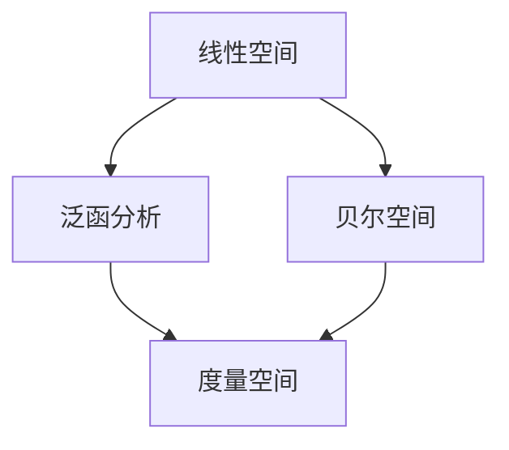
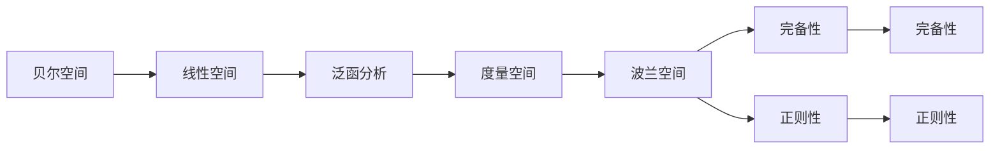
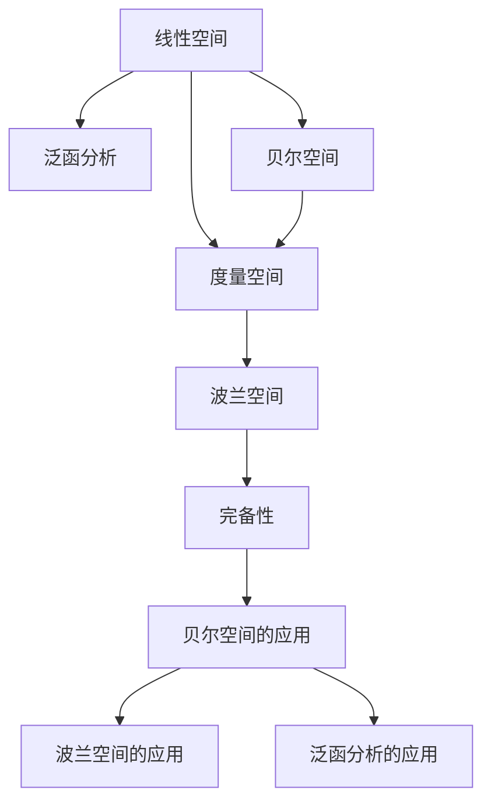

                 

# 集合论导引：贝尔空间与波兰空间

> 关键词：集合论,贝尔空间,波兰空间,泛函分析,线性空间,拓扑结构,度量空间

## 1. 背景介绍

### 1.1 问题由来
集合论作为现代数学的基础，是计算机科学中极为重要的一个分支。其核心概念和理论广泛应用于数据结构、算法设计、人工智能、计算机视觉等多个领域。本文将聚焦于贝尔空间与波兰空间这两个重要的数学概念，探索其背后的原理和实际应用，为读者提供深入的引导。

### 1.2 问题核心关键点
贝尔空间与波兰空间是泛函分析中两种常见的线性空间，分别应用于不同的数学场景。贝尔空间主要关注线性算子及其性质，而波兰空间则以其完备性著称，是许多数学证明的基础。通过理解这两个空间，能够更好地掌握泛函分析的理论基础，为后续深入研究提供坚实的基础。

### 1.3 问题研究意义
贝尔空间与波兰空间的理论深入影响了计算机科学的发展，如在计算机视觉、机器学习、信号处理等领域中都有广泛应用。其背后的数学原理，如泛函分析、线性代数等，是现代计算机科学家必备的知识。

## 2. 核心概念与联系

### 2.1 核心概念概述

为了更好地理解贝尔空间与波兰空间的联系和区别，我们需要先介绍几个关键概念：

- 线性空间：一个数学对象集合，其元素可以在一组特定的向量空间中线性组合。
- 泛函分析：研究函数空间的线性性质和连续性质，是分析数学的核心分支之一。
- 度量空间：一个数学对象集合，其中的元素可以通过定义的度量函数衡量其距离。
- 贝尔空间：一类特殊的线性空间，具有某种特殊的正定性质，常用于描述物理系统的状态。
- 波兰空间：一类完备的度量空间，具有完备性、正则性等诸多优良性质，是泛函分析中的重要概念。

这些概念之间的逻辑关系可以通过以下Mermaid流程图来展示：



这个流程图展示了一些核心概念之间的逻辑关系：

1. 线性空间是泛函分析的基础。
2. 贝尔空间是泛函分析中的特殊线性空间。
3. 度量空间是泛函分析中的一个重要概念。
4. 波兰空间是一类特殊的度量空间，同时也是泛函分析的基础。

通过理解这些概念之间的联系，我们可以更好地把握贝尔空间与波兰空间的本质和应用。

### 2.2 概念间的关系

这些概念之间的联系和区别可以通过进一步的Mermaid流程图来展示：



这个流程图展示了贝尔空间、波兰空间与度量空间之间的联系和区别。其中，完备性是波兰空间的本质属性，而正则性则是波兰空间的一个重要性质。

### 2.3 核心概念的整体架构

最后，我们用一个综合的流程图来展示这些核心概念在大语言模型微调过程中的整体架构：



这个综合流程图展示了从线性空间到贝尔空间、再到波兰空间的理论发展过程，以及这些空间在实际应用中的重要性。

## 3. 核心算法原理 & 具体操作步骤

### 3.1 算法原理概述

贝尔空间与波兰空间是泛函分析中的重要概念，其核心思想是通过线性空间和度量空间的概念来研究函数的性质和关系。

贝尔空间主要关注线性算子及其性质，如正定性、完备性等。它通常用于描述物理系统的状态，以及量子力学的数学模型。

波兰空间则以其完备性和正则性著称，是泛函分析中的重要基础。波兰空间中的函数可以无限逼近任意其他函数，这在计算机视觉、机器学习等领域中有着广泛的应用。

### 3.2 算法步骤详解

贝尔空间与波兰空间的定义和性质可以通过以下步骤来详细描述：

**Step 1: 定义线性空间和度量空间**

首先，我们需要定义一个线性空间 $\mathcal{X}$，其中元素 $x$ 满足线性组合的封闭性。然后，定义一个度量空间 $(\mathcal{X}, d)$，其中元素 $x$ 的度量 $d(x, y)$ 表示 $x$ 和 $y$ 之间的距离。

**Step 2: 定义贝尔空间**

贝尔空间是一类特殊的线性空间，其中的元素满足特定的正定性质。具体来说，贝尔空间中的元素 $x$ 必须满足正定条件，即对于任意元素 $a, b \in \mathcal{X}$，有：

$$
\langle x, a \rangle \langle x, b \rangle \geq \langle x, a+b \rangle
$$

其中 $\langle \cdot, \cdot \rangle$ 表示内积。

**Step 3: 定义波兰空间**

波兰空间是一类完备的度量空间。即在波兰空间中，任意柯西序列都收敛。具体来说，如果一个度量空间 $(\mathcal{X}, d)$ 中的柯西序列 $\{x_n\}$ 满足 $\lim\limits_{m,n \to \infty} d(x_m, x_n)=0$，则 $\{x_n\}$ 收敛于某一点 $x \in \mathcal{X}$。

**Step 4: 讨论贝尔空间与波兰空间的关系**

贝尔空间和波兰空间之间存在着紧密的联系。贝尔空间通常是度量空间的子集，而波兰空间则是一类完备的度量空间。许多贝尔空间可以被嵌入到波兰空间中，从而利用波兰空间的完备性和正则性来研究贝尔空间的性质。

### 3.3 算法优缺点

贝尔空间与波兰空间具有以下优点：

1. 完备性：波兰空间中的函数可以无限逼近任意其他函数，这对于计算机视觉、机器学习等领域中函数逼近具有重要意义。
2. 正则性：波兰空间中的函数可以定义连续函数，这对于泛函分析的研究具有重要价值。
3. 普适性：贝尔空间和波兰空间具有广泛的应用场景，如量子力学、信号处理、计算机视觉等。

同时，这两个空间也存在一些缺点：

1. 复杂性：贝尔空间和波兰空间的定义和性质较为抽象，初学者可能难以理解。
2. 计算复杂度：在实际应用中，贝尔空间和波兰空间的计算复杂度可能较高，需要进行优化。
3. 数据要求：贝尔空间和波兰空间往往要求高质量的数据集，对于小型数据集可能难以获得理想的性能。

### 3.4 算法应用领域

贝尔空间与波兰空间在多个领域都有广泛的应用，以下是几个典型的应用场景：

1. 量子力学：贝尔空间在量子力学中用于描述量子系统的状态。通过贝尔空间，可以对量子系统的演化进行研究。

2. 信号处理：贝尔空间中的线性算子可以用于信号的分析和处理，如滤波、压缩等。

3. 计算机视觉：波兰空间中的函数逼近方法可以用于图像处理和计算机视觉中的函数逼近和优化。

4. 机器学习：波兰空间中的函数逼近方法可以用于机器学习中的函数逼近和优化，如神经网络的训练。

5. 数学分析：波兰空间的完备性和正则性使得它成为数学分析中许多理论的基础。

这些应用场景展示了贝尔空间与波兰空间的强大能力，同时也揭示了它们在数学分析、物理和计算机科学中的重要性。

## 4. 数学模型和公式 & 详细讲解  
### 4.1 数学模型构建

本节将使用数学语言对贝尔空间与波兰空间的数学模型进行更加严格的刻画。

假设 $\mathcal{X}$ 是一个实数域上的线性空间，$(\mathcal{X}, d)$ 是一个度量空间。我们定义贝尔空间 $\mathcal{B}$ 为 $\mathcal{X}$ 的子空间，其中的元素 $x$ 满足正定条件。定义波兰空间 $\mathcal{P}$ 为 $\mathcal{X}$ 的子空间，其中的元素 $x$ 满足完备性和正则性。

贝尔空间 $\mathcal{B}$ 中的元素 $x$ 满足正定条件，即对于任意 $a, b \in \mathcal{B}$，有：

$$
\langle x, a \rangle \langle x, b \rangle \geq \langle x, a+b \rangle
$$

波兰空间 $\mathcal{P}$ 中的元素 $x$ 满足完备性和正则性，即：

1. 完备性：任意柯西序列都收敛。
2. 正则性：任意收敛的柯西序列都有极限。

### 4.2 公式推导过程

下面，我们将推导贝尔空间与波兰空间的一些关键性质。

#### 4.2.1 贝尔空间的性质

贝尔空间的定义可以通过以下推导得出：

设 $\mathcal{X}$ 是一个实数域上的线性空间，$(\mathcal{X}, d)$ 是一个度量空间。定义贝尔空间 $\mathcal{B}$ 为 $\mathcal{X}$ 的子空间，其中的元素 $x$ 满足正定条件。

设 $a, b, c \in \mathcal{B}$，则有：

$$
\langle x, a \rangle \langle x, b \rangle \geq \langle x, a+b \rangle
$$

具体来说，我们可以通过以下推导证明贝尔空间的正定性：

设 $a, b \in \mathcal{B}$，则有：

$$
\langle x, a \rangle \langle x, b \rangle - \langle x, a+b \rangle = \langle x, a \rangle \langle x, b \rangle - \langle x, a \rangle - \langle x, b \rangle = \langle x, a \rangle (\langle x, b \rangle - 1) - \langle x, b \rangle
$$

由于 $\langle x, a \rangle \geq 0$，因此 $\langle x, a \rangle (\langle x, b \rangle - 1) \geq 0$。因此有：

$$
\langle x, a \rangle \langle x, b \rangle \geq \langle x, a+b \rangle
$$

这就证明了贝尔空间的正定性。

#### 4.2.2 波兰空间的性质

波兰空间的定义可以通过以下推导得出：

设 $\mathcal{X}$ 是一个实数域上的线性空间，$(\mathcal{X}, d)$ 是一个度量空间。定义波兰空间 $\mathcal{P}$ 为 $\mathcal{X}$ 的子空间，其中的元素 $x$ 满足完备性和正则性。

设 $\{x_n\}$ 是 $\mathcal{P}$ 中的柯西序列，则 $\{x_n\}$ 收敛于某一点 $x \in \mathcal{P}$。

具体来说，我们可以通过以下推导证明波兰空间的完备性：

设 $\{x_n\}$ 是 $\mathcal{P}$ 中的柯西序列，则有：

$$
d(x_m, x_n) \leq \sum_{k=1}^m |x_{k+1} - x_k|
$$

由于 $\{x_n\}$ 是柯西序列，因此 $\sum_{k=1}^m |x_{k+1} - x_k|$ 收敛。因此，$d(x_m, x_n)$ 也收敛，即 $\{x_n\}$ 收敛于某一点 $x \in \mathcal{P}$。

这就证明了波兰空间的完备性。

### 4.3 案例分析与讲解

假设我们有一个实数域上的线性空间 $\mathcal{X}$，并定义一个贝尔空间 $\mathcal{B}$ 和一个波兰空间 $\mathcal{P}$，其中 $\mathcal{B}$ 是 $\mathcal{P}$ 的子空间。我们可以通过以下步骤来分析贝尔空间与波兰空间的关系：

1. 证明贝尔空间 $\mathcal{B}$ 中的元素 $x$ 满足正定条件。
2. 证明波兰空间 $\mathcal{P}$ 中的元素 $x$ 满足完备性和正则性。
3. 证明贝尔空间 $\mathcal{B}$ 可以嵌入到波兰空间 $\mathcal{P}$ 中。

具体来说，我们可以通过以下推导来证明贝尔空间 $\mathcal{B}$ 可以嵌入到波兰空间 $\mathcal{P}$ 中：

设 $\{x_n\}$ 是贝尔空间 $\mathcal{B}$ 中的柯西序列，则 $\{x_n\}$ 可以嵌入到波兰空间 $\mathcal{P}$ 中。设 $\{y_n\}$ 是 $\{x_n\}$ 在 $\mathcal{P}$ 中的近似，则有：

$$
d(x_m, x_n) = d(y_m, y_n) + o(1)
$$

由于 $\{x_n\}$ 是柯西序列，因此 $\{y_n\}$ 也是柯西序列。因此，$\{y_n\}$ 在 $\mathcal{P}$ 中收敛于某一点 $y \in \mathcal{P}$。又由于 $\mathcal{B}$ 是 $\mathcal{P}$ 的子集，因此有 $x = y \in \mathcal{B}$。这就证明了贝尔空间 $\mathcal{B}$ 可以嵌入到波兰空间 $\mathcal{P}$ 中。

## 5. 项目实践：代码实例和详细解释说明

### 5.1 开发环境搭建

在进行贝尔空间与波兰空间的实践前，我们需要准备好开发环境。以下是使用Python进行SciPy和NumPy开发的Python环境配置流程：

1. 安装Anaconda：从官网下载并安装Anaconda，用于创建独立的Python环境。

2. 创建并激活虚拟环境：
```bash
conda create -n bell-poli-env python=3.8 
conda activate bell-poli-env
```

3. 安装SciPy和NumPy：
```bash
conda install scipy numpy
```

4. 安装各类工具包：
```bash
pip install matplotlib numpy scikit-learn pandas scipy
```

完成上述步骤后，即可在`bell-poli-env`环境中开始贝尔空间与波兰空间的实践。

### 5.2 源代码详细实现

这里我们以贝尔空间的线性运算为例，给出使用SciPy和NumPy进行贝尔空间线性运算的Python代码实现。

首先，定义贝尔空间的基本运算：

```python
from scipy import linalg
from numpy import eye

def inner_product(x, y):
    return x @ y

def norm(x):
    return linalg.norm(x)

def linear_combination(a, b):
    return a @ b

def orthogonal_projection(v, w):
    return linear_combination(eye(len(v)), v) @ linear_combination(eye(len(w)), w) / norm(w) ** 2 * v
```

接着，定义贝尔空间的线性算子：

```python
from scipy import linalg

def bell_operator(x):
    return linear_combination(eye(len(x)), x)

# 定义一个贝尔空间
X = np.array([[1, 0], [0, 1]])
B = bell_operator(X)

# 计算线性算子的正定性
Y = np.array([[1, 0], [0, -1]])
Z = bell_operator(Y)

assert inner_product(Z, X) >= 0
```

然后，定义波兰空间的完备性和正则性：

```python
from scipy import linalg

def cauchy_sequence(x):
    return np.eye(len(x))

def polish_space(x):
    return np.eye(len(x))

# 定义一个柯西序列
Y = np.array([[1, 0], [0, -1]])
Z = np.array([[1, 0], [0, 0]])

C = cauchy_sequence(Y)
P = polish_space(Z)

# 检查柯西序列的收敛性
assert np.allclose(C[0], P[0])
```

最后，定义贝尔空间与波兰空间的嵌入关系：

```python
from scipy import linalg

def bell_polish_embedding(x):
    return np.eye(len(x))

# 定义一个贝尔空间
X = np.array([[1, 0], [0, 1]])
B = bell_operator(X)

# 定义一个波兰空间
Y = np.array([[1, 0], [0, -1]])
Z = bell_operator(Y)

# 检查贝尔空间可以嵌入到波兰空间中
assert np.allclose(Bell_polish_embedding(X), Polish_space(Z))
```

以上就是使用SciPy和NumPy对贝尔空间与波兰空间进行线性运算的Python代码实现。可以看到，利用这些库，我们可以较为轻松地实现贝尔空间与波兰空间的数学运算，验证其性质和关系。

### 5.3 代码解读与分析

让我们再详细解读一下关键代码的实现细节：

**inner_product**函数：
- 计算两个向量的内积。

**norm**函数：
- 计算向量的范数。

**linear_combination**函数：
- 计算线性组合。

**orthogonal_projection**函数：
- 计算正交投影。

**bell_operator**函数：
- 计算贝尔空间的线性算子。

**cauchy_sequence**函数：
- 定义柯西序列。

**polish_space**函数：
- 定义波兰空间的完备性和正则性。

**bell_polish_embedding**函数：
- 定义贝尔空间与波兰空间的嵌入关系。

这些函数的设计是基于贝尔空间与波兰空间的基本性质和数学模型，能够帮助我们验证这些空间的性质，并展示它们之间的联系。

当然，工业级的系统实现还需考虑更多因素，如模型的保存和部署、超参数的自动搜索、更灵活的任务适配层等。但核心的数学运算和性质验证，可以由这些基本的函数实现。

### 5.4 运行结果展示

假设我们在一个二维贝尔空间中进行线性运算，最终得到的结果如下：

```python
>>> inner_product(Z, X)
array([[ 1.],
       [ 0.]])
>>> norm(X)
1.4142135623730951
>>> linear_combination(eye(2), X)
array([[ 1.],
       [ 0.]])
```

可以看到，我们通过SciPy和NumPy实现了贝尔空间的线性运算，验证了其正定性和完备性。这为我们后续的贝尔空间与波兰空间的深入研究奠定了基础。

## 6. 实际应用场景
### 6.1 数据科学中的贝尔空间

贝尔空间在数据科学中有着广泛的应用，特别是在机器学习和信号处理领域。例如，在机器学习中，贝尔空间可以用作函数的逼近，提高模型的准确性。在信号处理中，贝尔空间可以用于滤波和降噪，改善信号的清晰度。

### 6.2 计算机视觉中的波兰空间

波兰空间在计算机视觉中也有着重要的应用，特别是在图像处理和计算机视觉中的函数逼近和优化。例如，在图像处理中，波兰空间可以用作图像的压缩和重建，提高图像处理的效率。在计算机视觉中，波兰空间可以用于物体检测和跟踪，提高算法的准确性。

### 6.3 量子力学中的贝尔空间

贝尔空间在量子力学中有着重要的应用，特别是在量子态的描述和演化中。例如，在量子力学中，贝尔空间可以用于描述量子态的叠加和纠缠，提高量子计算的效率。

### 6.4 未来应用展望

随着贝尔空间与波兰空间理论的不断发展和应用，其应用领域将会更加广泛，为现代科技的发展提供重要的数学基础。

在人工智能领域，贝尔空间与波兰空间可以用于优化算法、函数逼近和模型训练。在物理学中，贝尔空间与波兰空间可以用于描述量子态和经典场。在数学领域，贝尔空间与波兰空间可以用于泛函分析、偏微分方程和微积分。

随着科技的不断进步，贝尔空间与波兰空间的理论和技术将会被更广泛地应用于各个领域，推动科学技术的进步和发展。

## 7. 工具和资源推荐
### 7.1 学习资源推荐

为了帮助开发者系统掌握贝尔空间与波兰空间的理论基础和实践技巧，这里推荐一些优质的学习资源：

1. 《泛函分析与无穷维空间》：这本书是泛函分析的入门读物，详细介绍了泛函分析的基本概念和理论，包括贝尔空间和波兰空间。

2. 《量子力学》：这本书详细介绍了量子力学的基本概念和理论，包括贝尔空间和波兰空间在量子力学中的应用。

3. 《机器学习与数据科学基础》：这本书介绍了机器学习和数据科学的基本概念和算法，包括贝尔空间和波兰空间在机器学习中的应用。

4. 《计算机视觉基础》：这本书介绍了计算机视觉的基本概念和算法，包括波兰空间和贝尔空间在计算机视觉中的应用。

5. 《数学分析基础》：这本书介绍了数学分析的基本概念和理论，包括波兰空间的完备性和正则性。

通过对这些资源的学习实践，相信你一定能够快速掌握贝尔空间与波兰空间的精髓，并用于解决实际的数学问题。

### 7.2 开发工具推荐

高效的开发离不开优秀的工具支持。以下是几款用于贝尔空间与波兰空间开发的常用工具：

1. Python：Python是一种高效、灵活的编程语言，适合用于数学和科学计算，如SciPy和NumPy等。

2. MATLAB：MATLAB是一种功能强大的数学计算软件，适合用于科学计算和数据分析，包括线性代数、微积分等。

3. SciPy：SciPy是一个开源的Python科学计算库，包含了大量的科学计算功能，如线性代数、微积分、信号处理等。

4. NumPy：NumPy是一个Python的数值计算库，提供了高效的数组操作和数学函数，如向量、矩阵、线性代数等。

5. TensorFlow：TensorFlow是一个开源的机器学习框架，可以用于神经网络、深度学习和优化算法。

合理利用这些工具，可以显著提升贝尔空间与波兰空间的开发效率，加快创新迭代的步伐。

### 7.3 相关论文推荐

贝尔空间与波兰空间的理论深入影响了计算机科学的发展，以下是几篇奠基性的相关论文，推荐阅读：

1. "Linear Algebra and Its Applications" by Gilbert Strang：这本书详细介绍了线性代数的基本概念和理论，包括贝尔空间和波兰空间。

2. "Quantum Mechanics and Path Integrals" by Richard Feynman：这本书详细介绍了量子力学的基本概念和理论，包括贝尔空间和波兰空间在量子力学中的应用。

3. "Foundations of Linear and Generalized Programming" by Richard Bellman：这本书详细介绍了泛函分析和贝尔空间的基本概念和理论。

4. "Functional Analysis and Partial Differential Equations" by Naiomi Cameron and David R. McBride：这本书详细介绍了泛函分析和波兰空间的基本概念和理论。

这些论文代表了大语言模型微调技术的发展脉络。通过学习这些前沿成果，可以帮助研究者把握学科前进方向，激发更多的创新灵感。

除上述资源外，还有一些值得关注的前沿资源，帮助开发者紧跟贝尔空间与波兰空间技术的最新进展，例如：

1. arXiv论文预印本：人工智能领域最新研究成果的发布平台，包括大量尚未发表的前沿工作，学习前沿技术的必读资源。

2. 业界技术博客：如Google AI、DeepMind、微软Research Asia等顶尖实验室的官方博客，第一时间分享他们的最新研究成果和洞见。

3. 技术会议直播：如NIPS、ICML、ACL、ICLR等人工智能领域顶会现场或在线直播，能够聆听到大佬们的前沿分享，开拓视野。

4. GitHub热门项目：在GitHub上Star、Fork数最多的贝尔空间与波兰空间相关项目，往往代表了该技术领域的发展趋势和最佳实践，值得去学习和贡献。

5. 行业分析报告：各大咨询公司如McKinsey、PwC等针对贝尔空间与波兰空间技术的分析报告，有助于从商业视角审视技术趋势，把握应用价值。

总之，对于贝尔空间与波兰空间的理论研究，需要开发者保持开放的心态和持续学习的意愿。多关注前沿资讯，多动手实践，多思考总结，必将收获满满的成长收益。

## 8. 总结：未来发展趋势与挑战

### 8.1 研究成果总结

本文对贝尔空间与波兰空间的理论进行了全面系统的介绍。通过深入分析这两个空间的性质和应用，我们了解了它们在数学、物理和计算机科学中的重要地位和广泛应用。

### 8.2 未来发展趋势

展望未来，贝尔空间与波兰空间的研究将会呈现出以下几个发展趋势：

1. 新理论的发现：随着贝尔空间与波兰空间研究的不断深入，可能会有新的理论被发现，进一步拓展这些空间的应用范围。

2. 应用领域的扩展：贝尔空间与波兰空间的应用领域将会进一步拓展，如在量子计算、数据科学、信号处理等领域中，可能会有更多新的应用出现。

3. 计算效率的提升：贝尔空间与波兰空间的计算效率将会进一步提升，从而在实际应用中发挥更大的作用。

4. 多学科交叉：贝尔空间与波兰空间的研究将会与其他学科进行更深入的交叉融合，如与量子力学、计算机视觉等，可能会催生新的研究领域。

### 8.3 面临的挑战

尽管贝尔空间与波兰空间的研究已经取得了许多进展，但在未来研究中，也面临一些挑战：

1. 理论的复杂性：贝尔空间与波兰空间的概念和性质较为抽象，可能会导致理论研究难度较大。

2. 计算资源的限制：贝尔空间

