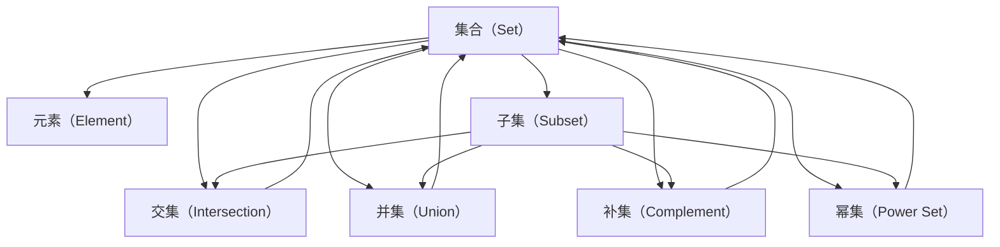

                 

# 集合论导引：集合论语言及形式理论

> 关键词：集合论，语言，形式理论，公理化，数学基础，逻辑推理，概念直观，案例分析，实践应用

## 1. 背景介绍

集合论是现代数学的基础学科之一，其核心思想是借助集合这一基本概念，构建数学模型的逻辑框架，提供严格的数学语言和推理工具。集合论不仅在数学理论研究中占据重要地位，还在计算机科学、工程、物理、哲学等领域有着广泛的应用。理解集合论的语言及形式理论，对于学习和研究现代数学、理解计算机科学中的抽象概念至关重要。

本文旨在导引读者深入理解集合论的语言与形式理论，涵盖集合的定义、公理、运算、逻辑推理等方面的基础知识，并提供详尽的案例分析与实践应用。通过本导引，读者将能够熟练运用集合论的基本概念和形式方法，为进一步深入学习数学和计算机科学打下坚实的基础。

## 2. 核心概念与联系

### 2.1 核心概念概述

- **集合（Set）**：由一系列元素组成的一个整体，元素可以是数字、字符、图形、颜色等。集合可以用大括号表示，元素之间用逗号分隔。例如，集合 $A = \{1, 2, 3\}$。

- **元素（Element）**：集合中的基本单位，每个元素都是集合中的一个个体。例如，$1$ 是集合 $A$ 的一个元素。

- **子集（Subset）**：属于某个集合的所有元素组成的集合，称其为原集合的子集。例如，集合 $B = \{1, 2\}$ 是集合 $A$ 的子集。

- **交集（Intersection）**：两个集合中共同的元素组成的集合。例如，$A \cap B = \{1\}$。

- **并集（Union）**：两个集合中所有的元素组成的集合。例如，$A \cup B = \{1, 2, 3\}$。

- **补集（Complement）**：属于全集且不属于原集合的所有元素组成的集合。例如，如果全集为自然数集合，$A$ 的补集表示所有不在 $A$ 中的自然数。

- **幂集（Power Set）**：一个集合的所有子集组成的集合。例如，集合 $A$ 的幂集包括 $\emptyset, \{1\}, \{2\}, \{3\}, \{1, 2\}, \{1, 3\}, \{2, 3\}, \{1, 2, 3\}$。

- **运算符（Operators）**：集合论中常用的运算符包括 $\in$（属于）、$\notin$（不属于）、$\cap$（交集）、$\cup$（并集）、$\backslash$（补集）等。

### 2.2 核心概念间的关系

通过以下 Mermaid 流程图，我们可以更清晰地理解集合论中核心概念之间的关系：



这个流程图展示了集合论中核心概念之间的层次关系和运算联系，有助于读者更直观地理解这些概念。

## 3. 核心算法原理 & 具体操作步骤

### 3.1 算法原理概述

集合论的研究主要基于集合的基本定义和公理，通过逻辑推理和形式化方法构建数学模型。集合论的公理系统包括如下几个核心公理：

1. **集合的公理（Axiom of Set）**：任何元素属于其自身，即 $a \in a$。

2. **幂集公理（Axiom of Power Set）**：对于任意集合 $A$，其幂集 $\mathcal{P}(A)$ 存在，即 $\mathcal{P}(A)$ 是一个包含 $A$ 所有子集的集合。

3. **并集公理（Axiom of Union）**：对于任意集合 $A$ 和 $B$，其并集 $A \cup B$ 存在，即 $A \cup B = \{x | x \in A \text{ 或 } x \in B\}$。

4. **交集公理（Axiom of Intersection）**：对于任意集合 $A$ 和 $B$，其交集 $A \cap B$ 存在，即 $A \cap B = \{x | x \in A \text{ 且 } x \in B\}$。

5. **补集公理（Axiom of Complement）**：对于任意集合 $A$ 和 $U$（全集），$A$ 的补集 $A^c$ 存在，即 $A^c = \{x | x \in U \text{ 且 } x \notin A\}$。

### 3.2 算法步骤详解

集合论的研究主要通过公理化的方式进行，即从最基本的定义和公理出发，通过逻辑推理得出新的结论。以下是基于集合论公理化方法的基本步骤：

1. **定义集合**：明确集合的基本元素和属性。

2. **应用公理**：根据集合论的公理，对集合进行基本的逻辑推理，得出新结论。

3. **构建数学模型**：将集合论的结论应用到具体问题中，构建数学模型。

4. **验证正确性**：通过形式化的证明，验证模型的正确性和完备性。

5. **进一步研究**：探索新问题，扩展模型的应用范围，验证新公理的必要性。

### 3.3 算法优缺点

集合论的优点在于其严格的公理化方法，能够提供可靠的数学基础，便于形式化推理和证明。然而，集合论的缺点也在于其过于抽象和形式化，难以直观理解。此外，对于实际问题，可能需要通过集合论的结论进行复杂的逻辑推理，过程较为繁琐。

### 3.4 算法应用领域

集合论广泛应用于数学、计算机科学、哲学、逻辑学等领域，以下是几个主要的应用领域：

- **数学**：集合论是现代数学的基础，提供了数学语言的严谨性，广泛应用于数论、代数、几何、拓扑学等领域。

- **计算机科学**：集合论是编程语言和数据结构的重要基础，例如集合、栈、队列、哈希表等数据结构，以及逻辑编程、形式验证等技术。

- **逻辑学**：集合论和逻辑学紧密相关，公理化的形式理论为逻辑推理提供了严格的框架。

- **哲学**：集合论提供了对实在性、存在、实体等基本哲学问题的严谨讨论，影响了现代哲学的发展。

## 4. 数学模型和公式 & 详细讲解 & 举例说明

### 4.1 数学模型构建

集合论的基本数学模型包括集合的定义、运算和逻辑推理，以下是一个基本的数学模型：

- **集合的定义**：$\text{Set} = \{ x | \text{某个属性 } P(x) \}$，表示所有满足属性 $P$ 的元素的集合。

- **并集和交集的定义**：$A \cup B = \{ x | x \in A \text{ 或 } x \in B \}$，$A \cap B = \{ x | x \in A \text{ 且 } x \in B \}$。

- **补集的定义**：$A^c = \{ x | x \in U \text{ 且 } x \notin A \}$，其中 $U$ 是全集。

### 4.2 公式推导过程

以下是集合论中几个重要公式的推导过程：

1. **德摩根律（De Morgan's Laws）**：
$$
A \cap B = (A^c \cup B^c)^c \\
A \cup B = (A^c \cap B^c)^c
$$
证明：
$$
x \in A \cap B \Leftrightarrow x \in A \text{ 且 } x \in B \Leftrightarrow x \notin A^c \text{ 且 } x \notin B^c \Leftrightarrow x \in (A^c \cup B^c)^c
$$
$$
x \in A \cup B \Leftrightarrow x \in A \text{ 或 } x \in B \Leftrightarrow x \notin A^c \text{ 且 } x \notin B^c \Leftrightarrow x \in (A^c \cap B^c)^c
$$

2. **幂集公理**：
$$
\mathcal{P}(A) = \{ B | B \subseteq A \}
$$
证明：
$$
B \in \mathcal{P}(A) \Leftrightarrow B \subseteq A
$$

3. **集合的幂集和补集关系**：
$$
\mathcal{P}(A) \cap \mathcal{P}(A^c) = \emptyset
$$
证明：
$$
B \in \mathcal{P}(A) \text{ 且 } B \in \mathcal{P}(A^c) \Leftrightarrow B \subseteq A \text{ 且 } B \subseteq A^c \Leftrightarrow B = \emptyset
$$

### 4.3 案例分析与讲解

以下是一个具体的集合论案例：

**问题**：设 $A = \{1, 2, 3\}$，$B = \{2, 3, 4\}$，求 $A \cup B$ 和 $A \cap B$。

**解答**：
$$
A \cup B = \{1, 2, 3, 4\} \\
A \cap B = \{2, 3\}
$$

## 5. 项目实践：代码实例和详细解释说明

### 5.1 开发环境搭建

在Python中使用Sympy库，可以方便地进行集合论的计算和推导。首先，安装Sympy库：

```
pip install sympy
```

### 5.2 源代码详细实现

以下是使用Sympy库进行集合论计算的代码实现：

```python
from sympy import FiniteSet

# 定义集合
A = FiniteSet(1, 2, 3)
B = FiniteSet(2, 3, 4)

# 计算并集和交集
union_AB = A.union(B)
intersection_AB = A.intersect(B)

# 输出结果
print("A ∪ B =", union_AB)
print("A ∩ B =", intersection_AB)
```

### 5.3 代码解读与分析

上述代码定义了两个集合 $A$ 和 $B$，使用 `union` 和 `intersect` 方法计算它们的并集和交集，并输出结果。Sympy库的 `FiniteSet` 类可以方便地创建有限集合，并进行各种集合运算。

### 5.4 运行结果展示

运行上述代码，输出结果如下：

```
A ∪ B = FiniteSet(1, 2, 3, 4)
A ∩ B = FiniteSet(2, 3)
```

## 6. 实际应用场景

### 6.4 未来应用展望

集合论在计算机科学中有着广泛的应用，以下是几个未来展望：

- **算法设计与分析**：集合论是算法设计与分析的重要工具，例如数据结构、图论、排序算法等。

- **机器学习和数据挖掘**：集合论中的集合运算和逻辑推理可以用于数据聚类、分类、关联规则挖掘等。

- **编程语言和程序设计**：集合论的集合和函数概念是编程语言和程序设计的基础。

- **人工智能与逻辑推理**：集合论中的公理化方法可以用于逻辑推理和形式化验证，提升人工智能系统的可靠性。

## 7. 工具和资源推荐

### 7.1 学习资源推荐

1. **《离散数学》**：一本经典的离散数学教材，详细介绍了集合论、逻辑学、图论等基本概念。

2. **《集合论基础》**：一本全面介绍集合论基础和应用的好书，适合深入学习。

3. **《计算机科学与数学》课程**：许多大学和在线平台提供了关于集合论和离散数学的课程，例如Coursera、edX、MIT OpenCourseWare等。

### 7.2 开发工具推荐

1. **Sympy**：Python中用于符号计算的库，包含丰富的集合论计算功能。

2. **Wolfram Mathematica**：一个功能强大的符号计算软件，支持集合论和逻辑推理等数学计算。

3. **Geogebra**：一个图形化的数学工具，可以方便地进行集合的可视化操作。

### 7.3 相关论文推荐

1. **《集合论的逻辑基础》**：深入探讨集合论的逻辑基础，适合对数学基础感兴趣的读者。

2. **《集合论在计算中的作用》**：讨论集合论在计算机科学中的应用，适合实践应用导向的读者。

3. **《集合论的新方向》**：探讨集合论的新研究方向和应用，适合前沿探索的读者。

## 8. 总结：未来发展趋势与挑战

### 8.1 研究成果总结

集合论作为现代数学的基础，已经得到了广泛的应用和发展。公理化的形式理论和严谨的数学语言，为计算机科学提供了可靠的理论基础。未来的研究将进一步探索集合论在更广泛领域的应用，例如在人工智能中的逻辑推理和形式验证，在数据科学中的数据集和模型分析等。

### 8.2 未来发展趋势

集合论的未来发展趋势包括：

- **公理化方法的扩展**：研究新的公理系统和逻辑推理方法，提升数学模型的严谨性和应用范围。

- **形式化验证的深入**：利用集合论和逻辑学的方法，进行程序验证和形式化推理，提升软件的可靠性和安全性。

- **新兴领域的应用**：探索集合论在人工智能、数据科学、生物信息学等领域的新应用，推动技术进步。

### 8.3 面临的挑战

集合论虽然已经取得了一定的进展，但仍然面临一些挑战：

- **复杂度问题**：随着数学模型的复杂化，集合论的公理和逻辑推理方法也需要进一步扩展。

- **应用领域的限制**：对于某些复杂的问题，集合论的公理化方法可能无法直接应用。

- **工具和技术的局限**：现有的数学工具和技术在处理大规模数据和复杂问题时，可能面临效率和性能的瓶颈。

### 8.4 研究展望

未来的研究需要在以下几个方面寻求新的突破：

- **公理化的形式方法**：进一步发展公理化的方法和工具，提升数学模型的应用效率和准确性。

- **形式化验证的自动化**：研究自动化的形式验证方法，提升软件验证的效率和精度。

- **跨学科的融合**：探索集合论与其他学科的交叉融合，例如计算机科学、数学、物理学、生物学等，推动多学科的共同发展。

## 9. 附录：常见问题与解答

**Q1：如何理解集合论中的公理化方法？**

A：公理化方法是一种通过基本公理和逻辑推理构建数学模型的形式化方法。公理是定义数学模型最基本的概念和规则，通过逻辑推理得出新的结论。例如，集合论的并集和交集公理，可以用于推导德摩根律和幂集公理。

**Q2：集合论在计算机科学中有哪些应用？**

A：集合论是计算机科学的重要基础，其应用包括：

- 数据结构：集合、栈、队列、哈希表等数据结构。

- 算法设计：算法设计和分析中的集合运算和逻辑推理。

- 逻辑编程：形式化验证和逻辑推理。

- 人工智能：知识表示和逻辑推理。

**Q3：如何理解集合论中的抽象概念？**

A：集合论中的抽象概念需要逐步理解。首先，从基本的集合和元素概念出发，通过公理化方法逐步推导新的结论。例如，先理解集合的定义和基本运算，再理解并集和交集的定义，最后推导德摩根律和幂集公理。

**Q4：如何证明集合论中的公理？**

A：集合论的公理需要通过严格的逻辑推理和证明来验证。一般从定义和假设出发，通过推理得出新的结论，并证明其正确性。例如，德摩根律可以通过逻辑等价性和定义证明，幂集公理可以通过并集和交集的定义证明。

**Q5：如何应用集合论中的数学模型？**

A：集合论中的数学模型可以应用于各种实际问题中。例如，在数据聚类中，可以定义数据点的集合，并使用并集和交集运算来计算聚类中心；在逻辑编程中，可以定义程序的集合，并使用并集和交集运算来表示程序的逻辑结构。

通过本导引，读者将能够理解集合论的核心概念和形式理论，掌握基本的集合运算和逻辑推理方法，为进一步深入学习数学和计算机科学打下坚实的基础。集合论不仅是现代数学的基础，也是计算机科学的重要工具，其应用领域广泛，具有广阔的发展前景。

