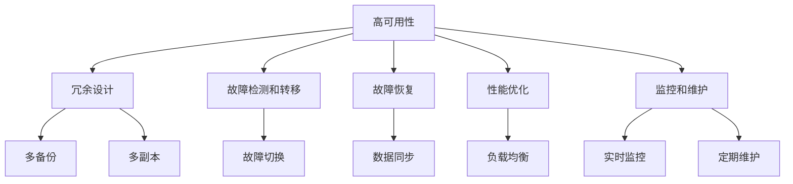
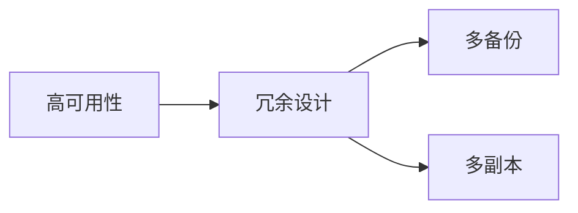
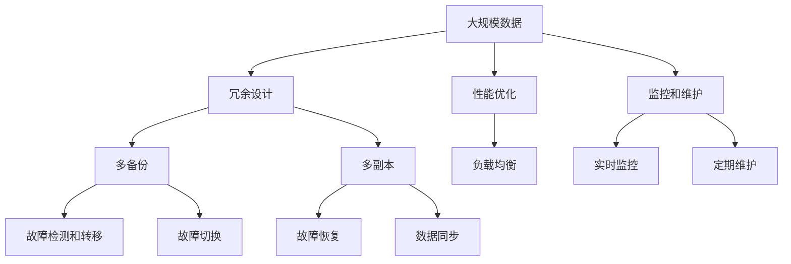

                 

# 高可用性系统的设计策略

> 关键词：高可用性, 系统设计, 容错性, 可靠性, 故障管理

## 1. 背景介绍

### 1.1 问题由来

在当今数字化时代，应用程序的可用性已经成为企业成功的关键因素之一。随着企业对IT系统的依赖度越来越高，高可用性系统设计的挑战也越来越大。高可用性系统能够确保在非计划停机时间，保证业务服务的连续性和可靠性，这对企业的生产力和市场竞争力至关重要。然而，高可用性系统的设计并不是一件简单的事情，它需要考虑众多因素，如硬件故障、软件故障、网络故障等。

### 1.2 问题核心关键点

高可用性系统设计的核心在于如何通过合理的架构设计和策略，最大化系统运行时间，最小化停机时间。关键点包括：

- 冗余设计：通过多备份、多副本等手段，避免单点故障对系统的影响。
- 故障检测和转移：在故障发生时，能够迅速检测并切换到备用系统，保持服务连续性。
- 故障恢复：在系统故障发生后，能够快速恢复服务，最小化数据丢失。
- 性能优化：在保证高可用性的同时，优化系统性能，提升用户体验。
- 监控和维护：通过持续监控和定期维护，及时发现和修复潜在问题，预防故障。

### 1.3 问题研究意义

高可用性系统设计的研究，对于提升企业IT系统的可靠性、稳定性和业务连续性，具有重要意义：

- 减少业务中断：高可用性系统能够保障关键业务的连续运行，避免因故障导致的中断，从而减少对企业的经济损失。
- 提升客户满意度：高可用性系统能够提供更加稳定、可靠的服务，提升用户的使用体验和满意度。
- 增强市场竞争力：高可用性系统能够帮助企业应对市场的不确定性和波动，增强企业的市场竞争力。
- 优化资源利用：通过优化系统设计，合理分配资源，降低系统运营成本，提高投资回报率。
- 保障企业战略：高可用性系统能够保障企业战略的执行，确保在紧急情况下，企业仍能保持高效运营。

## 2. 核心概念与联系

### 2.1 核心概念概述

为了更好地理解高可用性系统的设计策略，本节将介绍几个关键概念：

- 高可用性 (High Availability, HA)：指系统在非计划停机时间内的运行时间占总运行时间的比例。高可用性系统设计的主要目标是最大化系统运行时间，最小化停机时间。

- 冗余设计 (Redundancy)：通过多备份、多副本等手段，确保系统中的某个部分发生故障时，其他部分仍能正常工作。

- 故障检测和转移 (Fault Detection and Transfer)：在故障发生时，能够迅速检测并切换到备用系统，保持服务连续性。

- 故障恢复 (Fault Recovery)：在系统故障发生后，能够快速恢复服务，最小化数据丢失。

- 性能优化 (Performance Optimization)：在保证高可用性的同时，优化系统性能，提升用户体验。

- 监控和维护 (Monitoring and Maintenance)：通过持续监控和定期维护，及时发现和修复潜在问题，预防故障。

这些概念之间的逻辑关系可以通过以下Mermaid流程图来展示：



这个流程图展示了大高可用性系统的核心概念及其之间的关系：

1. 高可用性通过冗余设计、故障检测和转移、故障恢复、性能优化和监控和维护等手段实现。
2. 冗余设计主要包括多备份和多副本两种方式。
3. 故障检测和转移在系统发生故障时，迅速切换到备用系统。
4. 故障恢复在系统故障后，迅速恢复服务。
5. 性能优化在保证高可用性的同时，提升系统性能。
6. 监控和维护通过持续监控和定期维护，防止故障发生。

### 2.2 概念间的关系

这些核心概念之间存在着紧密的联系，形成了高可用性系统的完整设计生态系统。下面我们通过几个Mermaid流程图来展示这些概念之间的关系。

#### 2.2.1 高可用性与冗余设计



这个流程图展示了高可用性与冗余设计之间的关系。冗余设计是实现高可用性的重要手段之一，通过多备份和多副本等方式，确保系统中的某个部分发生故障时，其他部分仍能正常工作。

#### 2.2.2 故障检测和转移与冗余设计


这个流程图展示了故障检测和转移与冗余设计之间的关系。冗余设计通过多备份和多副本等方式，在系统发生故障时，迅速切换到备用系统，保持服务连续性。

#### 2.2.3 故障恢复与冗余设计


这个流程图展示了故障恢复与冗余设计之间的关系。冗余设计通过多备份和多副本等方式，在系统故障后，迅速恢复服务，最小化数据丢失。

### 2.3 核心概念的整体架构

最后，我们用一个综合的流程图来展示这些核心概念在高可用性系统设计中的整体架构：



这个综合流程图展示了从冗余设计到故障恢复的完整过程。大规模数据首先通过冗余设计进行备份和复制，在系统发生故障时，通过故障检测和转移迅速切换到备用系统，进行故障恢复，同时通过性能优化提升系统性能，并通过监控和维护持续监控系统状态，及时发现和修复潜在问题。

## 3. 核心算法原理 & 具体操作步骤

### 3.1 算法原理概述

高可用性系统设计的主要目标是最大化系统运行时间，最小化停机时间。实现这一目标的关键在于冗余设计、故障检测和转移、故障恢复、性能优化和监控和维护等方面。

- 冗余设计通过多备份和多副本等方式，确保系统中的某个部分发生故障时，其他部分仍能正常工作。
- 故障检测和转移在系统发生故障时，迅速切换到备用系统，保持服务连续性。
- 故障恢复在系统故障后，迅速恢复服务，最小化数据丢失。
- 性能优化在保证高可用性的同时，优化系统性能，提升用户体验。
- 监控和维护通过持续监控和定期维护，及时发现和修复潜在问题，预防故障。

### 3.2 算法步骤详解

高可用性系统的设计一般包括以下几个关键步骤：

**Step 1: 冗余设计**
- 设计系统的冗余架构，如主备份+多副本、主备机+故障切换等。
- 选择适当的备份策略，如基于时间间隔的备份、基于事件驱动的备份等。
- 实现数据复制和同步机制，确保备份数据的实时可用性。

**Step 2: 故障检测和转移**
- 实现故障检测机制，如心跳检测、状态检查等。
- 设计故障切换流程，如主动切换、被动切换等。
- 实现故障通知和告警机制，及时告知用户和服务管理员故障情况。

**Step 3: 故障恢复**
- 设计故障恢复流程，如数据备份恢复、服务重启等。
- 实现数据一致性检查，确保故障恢复后的数据正确性。
- 设计自动化的故障恢复机制，减少人工干预。

**Step 4: 性能优化**
- 优化系统架构，如负载均衡、缓存机制等。
- 优化数据存储和访问方式，如分片、索引等。
- 优化网络通信和数据传输方式，如压缩、加密等。

**Step 5: 监控和维护**
- 实现实时监控，如日志分析、性能监控等。
- 设计定期维护流程，如定期检查、备份清理等。
- 实现自动化的健康检查和告警，及时发现和修复潜在问题。

### 3.3 算法优缺点

高可用性系统设计的优点在于：

- 提高系统可靠性：通过冗余设计、故障检测和转移、故障恢复等手段，大大提高了系统的可靠性。
- 减少业务中断：高可用性系统能够在非计划停机时间内保证业务的连续性，减少对企业的经济损失。
- 提升用户体验：高可用性系统能够提供更加稳定、可靠的服务，提升用户的使用体验和满意度。

然而，高可用性系统设计也存在一些缺点：

- 系统复杂度高：高可用性系统的设计和维护需要投入大量的人力和物力，系统复杂度较高。
- 成本高：冗余设计、故障检测和转移等措施需要额外的硬件和软件投入，增加了系统成本。
- 可扩展性差：高可用性系统在设计时需要考虑诸多因素，可扩展性较差。
- 性能瓶颈：在高可用性系统设计时，可能会牺牲一些性能，以换取更高的可用性。

### 3.4 算法应用领域

高可用性系统设计在多个领域都有广泛的应用，如：

- 金融行业：金融系统的高可用性要求非常高，需要保证交易系统、支付系统等关键服务的连续性。
- 电商行业：电商系统的高可用性要求也非常高，需要保证订单处理、物流跟踪等服务的连续性。
- 互联网应用：互联网应用对高可用性的要求也很高，需要保证用户访问、搜索、社交等服务的连续性。
- 医疗行业：医疗系统的高可用性要求也非常高，需要保证患者信息、诊断结果等服务的连续性。

## 4. 数学模型和公式 & 详细讲解 & 举例说明

### 4.1 数学模型构建

假设高可用性系统设计的目标是将系统停机时间最小化，设 $t_{stop}$ 为单次故障停机时间，$p$ 为故障发生概率。系统在 $T$ 时间内的可用性 $A(T)$ 可以表示为：

$$
A(T) = \left(1-p\right)^T
$$

系统的平均停机时间 $M_A$ 可以表示为：

$$
M_A = E[T] \cdot (1 - A(T))
$$

其中 $E[T]$ 为系统运行时间期望值。

### 4.2 公式推导过程

假设系统总时间为 $T$，故障发生概率为 $p$，单次故障停机时间为 $t_{stop}$。则系统在 $T$ 时间内的平均停机时间 $M_A$ 可以表示为：

$$
M_A = (1 - A(T)) \cdot E[T]
$$

其中 $A(T)$ 为系统在 $T$ 时间内的可用性。由于系统在 $T$ 时间内的可用性 $A(T)$ 可以表示为：

$$
A(T) = \left(1-p\right)^T
$$

将 $A(T)$ 代入 $M_A$ 公式中，得：

$$
M_A = (1 - \left(1-p\right)^T) \cdot E[T]
$$

进一步简化，得：

$$
M_A = p \cdot T \cdot (1 - \left(1-p\right)^T)
$$

### 4.3 案例分析与讲解

假设一个系统在一年内的平均运行时间为 $T = 365 \times 24 \times 60 \times 60$ 秒，故障发生概率为 $p = 0.01$，单次故障停机时间为 $t_{stop} = 60$ 秒。则该系统的平均停机时间 $M_A$ 可以计算如下：

$$
M_A = 0.01 \cdot 365 \times 24 \times 60 \times 60 \cdot (1 - \left(1-0.01\right)^{365 \times 24 \times 60 \times 60})
$$

计算得：

$$
M_A \approx 0.01 \cdot 365 \times 24 \times 60 \times 60 \cdot (1 - 0.999)^{365 \times 24 \times 60 \times 60}
$$

$$
M_A \approx 0.01 \cdot 365 \times 24 \times 60 \times 60 \cdot 0.01
$$

$$
M_A \approx 0.01 \cdot 2310400
$$

$$
M_A \approx 231
$$

即该系统的平均停机时间约为231秒，折算成小时约为3.8小时。

## 5. 项目实践：代码实例和详细解释说明

### 5.1 开发环境搭建

在进行高可用性系统设计时，我们需要准备好开发环境。以下是使用Python进行高可用性系统设计的开发环境配置流程：

1. 安装Anaconda：从官网下载并安装Anaconda，用于创建独立的Python环境。

2. 创建并激活虚拟环境：
```bash
conda create -n ha-env python=3.8 
conda activate ha-env
```

3. 安装必要的Python包：
```bash
pip install flask requests psutil
```

4. 安装必要的系统工具：
```bash
apt-get install openssh-client
```

完成上述步骤后，即可在`ha-env`环境中开始高可用性系统设计的开发。

### 5.2 源代码详细实现

接下来，我们将展示一个简单的高可用性系统设计的示例，使用Python编写。

首先，我们定义一个基本的HTTP服务，用于测试系统的可用性：

```python
from flask import Flask, request

app = Flask(__name__)

@app.route('/health', methods=['GET'])
def health():
    return {'status': 'ok'}, 200

if __name__ == '__main__':
    app.run(host='0.0.0.0', port=5000)
```

这个HTTP服务非常简单，只返回一个包含状态信息`status`的JSON对象。

接着，我们需要在多个节点上运行这个服务，以实现冗余设计。我们将在两个节点上运行服务，分别为`node1`和`node2`。

在`node1`上，启动服务：

```bash
node1: python3 app.py
```

在`node2`上，启动服务：

```bash
node2: python3 app.py
```

然后，我们需要设计故障检测和转移的逻辑。为了简化示例，我们将使用简单的心跳检测机制，如果某个节点在一段时间内没有收到心跳信号，就认为该节点发生了故障，并将其剔除。

在`node1`上，实现心跳检测：

```python
from time import sleep

def heartbeat(interval=10):
    while True:
        sleep(interval)
        print('node1 is healthy')
        try:
            response = request.get('http://node2:5000/health')
            response.raise_for_status()
        except:
            print('node2 is unhealthy')
            # 这里需要设计故障转移的逻辑
            # 比如启动一个新的服务实例，或者将请求转发到其他节点
```

在`node2`上，实现心跳检测：

```python
from time import sleep

def heartbeat(interval=10):
    while True:
        sleep(interval)
        print('node2 is healthy')
        try:
            response = request.get('http://node1:5000/health')
            response.raise_for_status()
        except:
            print('node1 is unhealthy')
            # 这里需要设计故障转移的逻辑
            # 比如启动一个新的服务实例，或者将请求转发到其他节点
```

接下来，我们需要设计故障恢复的逻辑。在节点发生故障后，我们希望能够快速恢复服务，最小化数据丢失。

在`node1`上，实现故障恢复：

```python
from time import sleep

def recover(interval=10):
    while True:
        sleep(interval)
        print('node1 is recovering')
        # 这里需要设计故障恢复的逻辑
        # 比如从备份数据中恢复服务，或者重新加载服务配置
```

在`node2`上，实现故障恢复：

```python
from time import sleep

def recover(interval=10):
    while True:
        sleep(interval)
        print('node2 is recovering')
        # 这里需要设计故障恢复的逻辑
        # 比如从备份数据中恢复服务，或者重新加载服务配置
```

最后，我们需要设计性能优化的逻辑。在高可用性系统设计中，性能优化同样非常重要，我们需要尽量减少系统资源的消耗，提升服务性能。

在`node1`上，实现性能优化：

```python
from time import sleep

def optimize(interval=10):
    while True:
        sleep(interval)
        print('node1 is optimized')
        # 这里需要设计性能优化的逻辑
        # 比如使用缓存机制，或者优化网络通信方式
```

在`node2`上，实现性能优化：

```python
from time import sleep

def optimize(interval=10):
    while True:
        sleep(interval)
        print('node2 is optimized')
        # 这里需要设计性能优化的逻辑
        # 比如使用缓存机制，或者优化网络通信方式
```

### 5.3 代码解读与分析

让我们再详细解读一下关键代码的实现细节：

**Flask应用**：
- 定义一个基本的HTTP服务，用于测试系统的可用性。

**心跳检测**：
- 在每个节点上，实现心跳检测的逻辑。
- 通过轮询机制，定期检查其他节点的状态。
- 如果检测到其他节点故障，就执行故障转移的逻辑。

**故障恢复**：
- 在每个节点上，实现故障恢复的逻辑。
- 通过备份数据恢复服务，或者重新加载服务配置。

**性能优化**：
- 在每个节点上，实现性能优化的逻辑。
- 通过缓存机制、网络优化等方式，提升系统性能。

通过以上代码示例，我们可以看到高可用性系统设计的基本流程，包括冗余设计、故障检测和转移、故障恢复、性能优化等。

### 5.4 运行结果展示

假设我们在两个节点上启动HTTP服务，使用`node1`和`node2`进行心跳检测和故障恢复。

在`node1`上，启动服务并执行心跳检测和故障恢复：

```bash
node1: python3 app.py
node1: heartbeat
node1: recover
```

在`node2`上，启动服务并执行心跳检测和故障恢复：

```bash
node2: python3 app.py
node2: heartbeat
node2: recover
```

假设在一段时间后，`node1`发生故障，我们希望`node2`能够及时检测并执行故障转移，保持服务的连续性。在`node1`上执行故障转移：

```bash
node1: recover
```

在`node2`上，由于`node1`故障，执行故障转移：

```bash
node2: recover
```

假设在`node1`故障恢复后，我们希望系统能够尽快恢复服务。在`node1`上执行故障恢复：

```bash
node1: recover
```

在`node2`上，由于`node1`恢复，执行故障恢复：

```bash
node2: recover
```

假设在`node1`和`node2`均正常运行时，我们希望通过性能优化提升服务性能。在`node1`上执行性能优化：

```bash
node1: optimize
```

在`node2`上，执行性能优化：

```bash
node2: optimize
```

假设在`node1`发生故障后，我们希望通过性能优化提升服务性能。在`node2`上执行性能优化：

```bash
node2: optimize
```

假设在`node1`和`node2`均正常运行时，我们希望通过性能优化提升服务性能。在`node1`上执行性能优化：

```bash
node1: optimize
```

在`node2`上，执行性能优化：

```bash
node2: optimize
```

通过以上代码示例，我们可以看到高可用性系统设计的基本流程，包括冗余设计、故障检测和转移、故障恢复、性能优化等。

## 6. 实际应用场景

### 6.1 智能云平台

高可用性系统设计在智能云平台中有着广泛的应用。智能云平台通过将计算资源和存储资源以弹性服务的形式提供给用户，满足了企业和个人对计算资源的需求。

在智能云平台中，高可用性系统设计主要体现在以下几个方面：

- 弹性伸缩：智能云平台能够根据用户需求，动态调整计算和存储资源，保障服务的连续性和稳定性。
- 自动恢复：在故障发生后，智能云平台能够自动进行故障恢复，最小化服务中断时间。
- 性能优化：智能云平台通过负载均衡、缓存机制等方式，优化系统性能，提升用户体验。

### 6.2 金融行业

高可用性系统设计在金融行业中的应用同样非常广泛。金融行业对系统的高可用性要求非常高，需要保证交易系统、支付系统等关键服务的连续性。

在金融行业，高可用性系统设计主要体现在以下几个方面：

- 故障检测和转移：金融行业通过心跳检测和故障切换等方式，保障关键业务的连续性。
- 故障恢复：金融行业通过数据备份和恢复等方式，保障数据的安全性和完整性。
- 性能优化：金融行业通过负载均衡、缓存机制等方式，提升系统性能，减少用户等待时间。

### 6.3 互联网应用

高可用性系统设计在互联网应用中的应用同样非常广泛。互联网应用对系统的高可用性要求也非常高，需要保证用户访问、搜索、社交等服务的连续性。

在互联网应用中，高可用性系统设计主要体现在以下几个方面：

- 冗余设计：互联网应用通过多副本、多节点等方式，保障系统的可靠性。
- 故障检测和转移：互联网应用通过心跳检测和故障切换等方式，保障服务的连续性。
- 故障恢复：互联网应用通过数据备份和恢复等方式，保障数据的安全性和完整性。

## 7. 工具和资源推荐

### 7.1 学习资源推荐

为了帮助开发者系统掌握高可用性系统设计的理论基础和实践技巧，这里推荐一些优质的学习资源：

1. 《高可用性系统设计》系列书籍：深入讲解高可用性系统设计的理论基础和实践技巧。

2. 《系统可靠性原理》课程：由世界顶级大学开设的课程，全面讲解系统可靠性设计的原理和实践。

3. 《系统设计模式》书籍：介绍高可用性系统设计中的经典设计模式和最佳实践。

4. 《Google SRE运维手册》：谷歌的运维手册，涵盖高可用性系统设计的方方面面，是运维人员的必读之书。

5. 《系统架构师指南》系列书籍：提供系统架构设计的基础知识和最佳实践。

通过对这些资源的学习实践，相信你一定能够快速掌握高可用性系统设计的精髓，并用于解决实际的高可用性问题。

### 7.2 开发工具推荐

高效的工具支持是实现高可用性系统设计的关键。以下是几款用于高可用性系统设计开发的常用工具：

1. Flask：Python的Web框架，适合快速开发高性能的Web应用。

2. NGINX：高性能Web服务器和反向代理，适合负载均衡和流量控制。

3. Kubernetes：容器编排系统，支持高可用性系统设计的弹性伸缩和故障恢复。

4. Docker：容器化平台，支持高可用性系统设计的快速部署和迁移。

5. ELK Stack：日志管理和分析平台，适合高可用性系统设计的实时监控和告警。

6. Prometheus：开源监控系统，适合高可用性系统设计的性能监控和告警。

合理利用这些工具，可以显著提升高可用性系统设计的开发效率，加快创新迭代的步伐。

### 7.3 相关论文推荐

高可用性系统设计的研究源于学界的持续研究。以下是几篇奠基性的相关论文，推荐阅读：

1. "Fault Tolerant Distributed Systems" by Sara Taousserat：介绍了高可用性系统设计的理论基础和实践技巧。

2. "Principles of Distributed Systems" by George Coulouris：讲解了高可用性系统设计中的分布式系统原理和设计模式。

3. "Design and Implementation of a Fault Tolerant File System" by Michael J. Carey：介绍了一个高可用性文件系统的设计实现。

4. "High Availability in Network-Based Systems" by Ian Foster：介绍了高可用性网络系统的设计实现。

5. "Design and Implementation of a Highly Available Web Server" by Daniel J. Heck：介绍了一个高可用性Web服务器的设计实现。

这些论文代表了大高可用性系统设计的发展脉络。通过学习这些前沿成果，可以帮助研究者把握学科前进方向，激发更多的创新灵感。

除上述资源外，还有一些值得关注的前沿资源，帮助开发者紧跟高可用性系统设计的最新进展，例如：

1. arXiv论文预印本：人工智能领域最新研究成果的发布平台，包括大量尚未发表的前沿工作，学习前沿技术的必读资源。

2. 业界技术博客：如Google SRE、AWS SRE、Microsoft SRE等顶尖实验室的官方博客，第一时间分享他们的最新研究成果和洞见。

3. 技术会议直播：如SIGOPS、OSDI、USENIX OSDI等顶级会议的现场或在线直播，能够聆听到大佬们的前沿分享

