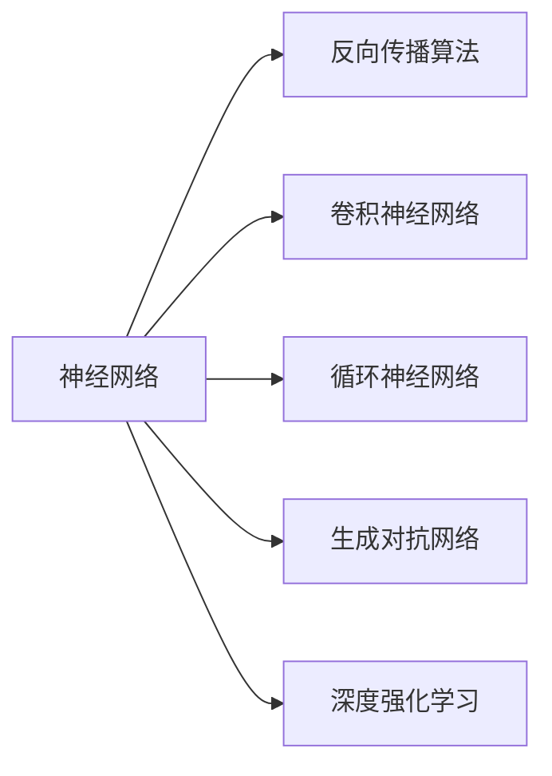

                 

# 深度学习的三位开创者：Hinton、LeCun、Bengio的贡献

## 1. 背景介绍

深度学习自20世纪80年代开始起步，经过30多年的发展，如今已经成为人工智能领域中最先进、最强大的技术之一。深度学习的成功离不开三位重要人物：Geoffrey Hinton、Yann LeCun和Yoshua Bengio。他们共同推动了深度学习技术从理论到应用的全方位突破，为人工智能的发展奠定了坚实基础。

### 1.1 深度学习的发展历程

深度学习的历程可以追溯到20世纪60年代，当时人们开始研究用人工神经网络来解决视觉识别、语音识别等问题。然而，由于当时计算机硬件和算法的限制，深度学习研究进展缓慢。直到80年代，随着反向传播算法的提出，深度学习才开始取得突破性进展。90年代，Hinton等科学家在深度信念网络、稀疏编码等方面取得重要成果，推动了深度学习研究的发展。21世纪初，LeCun和Bengio等人提出卷积神经网络、循环神经网络等新型深度学习模型，进一步推动了深度学习的实际应用。

### 1.2 深度学习的重要应用

深度学习在图像识别、语音识别、自然语言处理、游戏AI等领域取得了重要突破。谷歌、亚马逊、百度等科技公司已经广泛应用深度学习技术，并取得了显著的商业价值。同时，深度学习也成为了学术界研究的重点，连续多年获得了图灵奖、奈奎斯特奖等多项重要奖项。

## 2. 核心概念与联系

### 2.1 核心概念概述

深度学习涉及的核心理念包括以下几个方面：

- **神经网络**：由多个层次组成的计算模型，每个层次由多个神经元构成，通过反向传播算法学习模型参数。
- **反向传播算法**：一种优化算法，通过梯度下降的方式调整模型参数，使得模型能够准确地预测输出。
- **卷积神经网络**：一种专门用于图像处理的深度学习模型，通过卷积操作提取图像特征。
- **循环神经网络**：一种专门用于序列数据处理的深度学习模型，通过循环结构捕捉序列中的时间依赖关系。
- **生成对抗网络**：一种通过对抗训练生成高质量样本的深度学习模型。
- **深度强化学习**：一种将深度学习和强化学习结合起来的框架，用于智能决策和学习。

这些概念之间的联系非常紧密，共同构成了深度学习的核心框架。以下是一个Mermaid流程图，展示了这些核心概念之间的联系：



### 2.2 概念间的关系

这些核心概念之间的关系如下：

- 神经网络是深度学习的核心，由多个层次构成，每个层次由多个神经元构成。
- 反向传播算法是神经网络的主要优化算法，通过梯度下降的方式调整模型参数。
- 卷积神经网络和循环神经网络是神经网络的重要变种，分别用于图像和序列数据处理。
- 生成对抗网络是一种特殊的神经网络，通过对抗训练生成高质量的样本。
- 深度强化学习结合了深度学习和强化学习，用于智能决策和学习。

这些概念共同构成了深度学习的核心框架，推动了深度学习技术的发展和应用。

## 3. 核心算法原理 & 具体操作步骤
### 3.1 算法原理概述

深度学习的核心算法是反向传播算法，通过梯度下降的方式调整模型参数，使得模型能够准确地预测输出。反向传播算法的原理如下：

假设神经网络由 $L$ 层组成，每一层有 $n_i$ 个神经元。神经网络接收输入 $x$，经过 $L$ 层的处理后，输出为 $y$。模型的预测结果与真实结果之间存在误差 $\epsilon$。反向传播算法的目标是通过调整模型参数，使得误差 $\epsilon$ 最小化。

反向传播算法的步骤如下：

1. 前向传播：将输入 $x$ 通过神经网络，计算出每一层的输出 $h_1, h_2, ..., h_L$。
2. 计算误差 $\epsilon$：将 $y$ 与 $y'$（预测结果）进行比较，计算误差。
3. 反向传播：从输出层开始，逐层计算误差对每个参数的偏导数，更新模型参数。
4. 重复步骤1~3，直到误差 $\epsilon$ 最小化。

### 3.2 算法步骤详解

以下是具体的反向传播算法步骤：

1. 前向传播：将输入 $x$ 通过神经网络，计算出每一层的输出 $h_1, h_2, ..., h_L$。

2. 计算误差 $\epsilon$：将 $y$ 与 $y'$（预测结果）进行比较，计算误差。

3. 反向传播：从输出层开始，逐层计算误差对每个参数的偏导数，更新模型参数。

4. 重复步骤1~3，直到误差 $\epsilon$ 最小化。

反向传播算法的核心在于通过链式法则计算误差对每个参数的偏导数。具体来说，每一层神经元的误差对参数的偏导数可以通过链式法则计算得到，如下所示：

$$
\frac{\partial L}{\partial \theta_j} = \frac{\partial L}{\partial y} \frac{\partial y}{\partial h_{L}} \frac{\partial h_{L}}{\partial h_{L-1}} ... \frac{\partial h_2}{\partial h_1} \frac{\partial h_1}{\partial \theta_j}
$$

其中 $L$ 是误差函数，$\theta_j$ 是模型参数，$y$ 是预测结果，$h_i$ 是每一层的输出。

### 3.3 算法优缺点

反向传播算法的优点如下：

- 能够处理复杂的非线性问题，通过多层次的神经网络逼近复杂的函数。
- 能够通过梯度下降的方式优化模型参数，实现高精度的预测。

反向传播算法的缺点如下：

- 需要大量的训练数据，否则容易出现过拟合。
- 对于大规模的神经网络，反向传播算法的计算量非常大，需要高效的硬件支持。
- 对于一些特殊的网络结构，如循环神经网络，反向传播算法需要进行一些修改才能有效训练。

### 3.4 算法应用领域

深度学习在以下几个领域得到了广泛应用：

- **计算机视觉**：用于图像分类、目标检测、图像分割等任务。
- **自然语言处理**：用于机器翻译、情感分析、问答系统等任务。
- **语音识别**：用于语音识别、语音合成等任务。
- **游戏AI**：用于游戏决策、路径规划等任务。
- **推荐系统**：用于个性化推荐、广告投放等任务。
- **医疗健康**：用于疾病预测、基因分析等任务。

## 4. 数学模型和公式 & 详细讲解

### 4.1 数学模型构建

深度学习的数学模型通常由以下几个组成部分构成：

- **输入层**：接收输入数据。
- **隐藏层**：用于特征提取和变换。
- **输出层**：输出预测结果。

数学模型可以表示为：

$$
y = f_\theta(x)
$$

其中 $x$ 是输入数据，$\theta$ 是模型参数，$f_\theta(x)$ 是模型函数。

### 4.2 公式推导过程

以下是具体的反向传播算法公式推导过程：

假设神经网络由 $L$ 层组成，每一层有 $n_i$ 个神经元。神经网络的输入为 $x$，输出为 $y$，误差为 $\epsilon$。神经元的输出为 $h_i$，权重为 $\theta_i$。

前向传播公式如下：

$$
h_i = f_{\theta_i}(h_{i-1})
$$

其中 $h_{i-1}$ 是上一层的输出，$f_{\theta_i}$ 是激活函数。

预测结果 $y'$ 与真实结果 $y$ 之间的误差为：

$$
\epsilon = y - y'
$$

误差 $\epsilon$ 对 $y'$ 的偏导数为：

$$
\frac{\partial \epsilon}{\partial y'} = 1
$$

误差 $\epsilon$ 对 $h_L$ 的偏导数为：

$$
\frac{\partial \epsilon}{\partial h_L} = -\frac{\partial \epsilon}{\partial y'} \frac{\partial y'}{\partial h_L}
$$

其中 $\frac{\partial y'}{\partial h_L}$ 是激活函数的导数。

误差 $\epsilon$ 对 $h_{L-1}$ 的偏导数为：

$$
\frac{\partial \epsilon}{\partial h_{L-1}} = \frac{\partial \epsilon}{\partial h_L} \frac{\partial h_L}{\partial h_{L-1}}
$$

重复上述过程，得到每一层的误差对参数的偏导数。具体来说，第 $i$ 层的误差对权重 $\theta_i$ 的偏导数为：

$$
\frac{\partial \epsilon}{\partial \theta_i} = \frac{\partial \epsilon}{\partial h_i} \frac{\partial h_i}{\partial h_{i-1}} ... \frac{\partial h_2}{\partial h_1} \frac{\partial h_1}{\partial \theta_i}
$$

### 4.3 案例分析与讲解

以下是具体的反向传播算法案例分析与讲解：

假设有一个两层神经网络，接收输入 $x$，输出 $y$。第一层有 $n$ 个神经元，第二层有 $m$ 个神经元。激活函数为 sigmoid 函数。

前向传播公式如下：

$$
h_1 = \sigma(\theta_1 x)
$$

$$
h_2 = \sigma(\theta_2 h_1)
$$

$$
y = \theta_3 h_2
$$

其中 $\theta_1$ 和 $\theta_2$ 是第一层和第二层的权重，$\theta_3$ 是输出层的权重。

误差 $\epsilon$ 对 $y'$ 的偏导数为：

$$
\frac{\partial \epsilon}{\partial y'} = 1
$$

误差 $\epsilon$ 对 $h_2$ 的偏导数为：

$$
\frac{\partial \epsilon}{\partial h_2} = -\frac{\partial \epsilon}{\partial y'} \frac{\partial y'}{\partial h_2}
$$

其中 $\frac{\partial y'}{\partial h_2}$ 是激活函数的导数。

误差 $\epsilon$ 对 $h_1$ 的偏导数为：

$$
\frac{\partial \epsilon}{\partial h_1} = \frac{\partial \epsilon}{\partial h_2} \frac{\partial h_2}{\partial h_1}
$$

误差 $\epsilon$ 对 $\theta_2$ 的偏导数为：

$$
\frac{\partial \epsilon}{\partial \theta_2} = \frac{\partial \epsilon}{\partial h_2} \frac{\partial h_2}{\partial h_1} \frac{\partial h_1}{\partial \theta_2}
$$

误差 $\epsilon$ 对 $\theta_1$ 的偏导数为：

$$
\frac{\partial \epsilon}{\partial \theta_1} = \frac{\partial \epsilon}{\partial h_1} \frac{\partial h_1}{\partial \theta_1}
$$

### 4.4 案例分析与讲解

以下是具体的反向传播算法案例分析与讲解：

假设有一个三层卷积神经网络，接收输入图像 $x$，输出类别 $y$。卷积核大小为 $k$，步幅为 $s$，填充方式为 $p$。激活函数为 ReLU 函数。

前向传播公式如下：

$$
h_1 = f_{\theta_1}(x)
$$

$$
h_2 = f_{\theta_2}(h_1)
$$

$$
y = f_{\theta_3}(h_2)
$$

其中 $h_1$ 是第一层的输出，$h_2$ 是第二层的输出，$y$ 是输出层。$\theta_1$ 和 $\theta_2$ 是卷积层和池化层的权重，$\theta_3$ 是全连接层的权重。

误差 $\epsilon$ 对 $y'$ 的偏导数为：

$$
\frac{\partial \epsilon}{\partial y'} = 1
$$

误差 $\epsilon$ 对 $h_2$ 的偏导数为：

$$
\frac{\partial \epsilon}{\partial h_2} = -\frac{\partial \epsilon}{\partial y'} \frac{\partial y'}{\partial h_2}
$$

其中 $\frac{\partial y'}{\partial h_2}$ 是激活函数的导数。

误差 $\epsilon$ 对 $h_1$ 的偏导数为：

$$
\frac{\partial \epsilon}{\partial h_1} = \frac{\partial \epsilon}{\partial h_2} \frac{\partial h_2}{\partial h_1}
$$

误差 $\epsilon$ 对 $\theta_2$ 的偏导数为：

$$
\frac{\partial \epsilon}{\partial \theta_2} = \frac{\partial \epsilon}{\partial h_2} \frac{\partial h_2}{\partial h_1} \frac{\partial h_1}{\partial \theta_2}
$$

误差 $\epsilon$ 对 $\theta_1$ 的偏导数为：

$$
\frac{\partial \epsilon}{\partial \theta_1} = \frac{\partial \epsilon}{\partial h_1} \frac{\partial h_1}{\partial \theta_1}
$$

## 5. 项目实践：代码实例和详细解释说明

### 5.1 开发环境搭建

在进行深度学习项目实践前，我们需要准备好开发环境。以下是使用Python进行TensorFlow开发的Python环境配置流程：

1. 安装Anaconda：从官网下载并安装Anaconda，用于创建独立的Python环境。

2. 创建并激活虚拟环境：
```bash
conda create -n tf-env python=3.8 
conda activate tf-env
```

3. 安装TensorFlow：根据CUDA版本，从官网获取对应的安装命令。例如：
```bash
conda install tensorflow
```

4. 安装各类工具包：
```bash
pip install numpy pandas scikit-learn matplotlib tqdm jupyter notebook ipython
```

完成上述步骤后，即可在`tf-env`环境中开始深度学习实践。

### 5.2 源代码详细实现

这里我们以图像分类为例，给出使用TensorFlow实现卷积神经网络的代码实现。

首先，定义卷积神经网络的架构：

```python
import tensorflow as tf

model = tf.keras.models.Sequential([
    tf.keras.layers.Conv2D(32, (3, 3), activation='relu', input_shape=(28, 28, 1)),
    tf.keras.layers.MaxPooling2D((2, 2)),
    tf.keras.layers.Flatten(),
    tf.keras.layers.Dense(10, activation='softmax')
])
```

然后，定义训练集和测试集，并对模型进行编译：

```python
(x_train, y_train), (x_test, y_test) = tf.keras.datasets.mnist.load_data()
x_train = x_train / 255.0
x_test = x_test / 255.0
model.compile(optimizer='adam',
              loss=tf.keras.losses.SparseCategoricalCrossentropy(from_logits=True),
              metrics=['accuracy'])
```

接着，训练模型并评估测试集性能：

```python
model.fit(x_train, y_train, epochs=5, validation_data=(x_test, y_test))
test_loss, test_acc = model.evaluate(x_test, y_test)
print('Test accuracy:', test_acc)
```

最后，使用模型对新图像进行分类：

```python
image = tf.keras.preprocessing.image.load_img('image.jpg', target_size=(28, 28))
image_array = tf.keras.preprocessing.image.img_to_array(image)
image_array = tf.expand_dims(image_array, 0)
predictions = model.predict(image_array)
```

以上就是使用TensorFlow对卷积神经网络进行图像分类的完整代码实现。可以看到，得益于TensorFlow的强大封装，我们可以用相对简洁的代码完成卷积神经网络的训练和测试。

### 5.3 代码解读与分析

让我们再详细解读一下关键代码的实现细节：

**Sequential模型**：
- `Sequential`：顺序模型，适合线性堆叠层的结构。
- `layers.Conv2D`：卷积层，用于提取图像特征。
- `layers.MaxPooling2D`：池化层，用于降采样。
- `layers.Flatten`：展平层，将二维特征图转换为一维向量。
- `layers.Dense`：全连接层，用于分类。

**模型编译**：
- `compile`：编译模型，设置优化器、损失函数和评估指标。

**模型训练**：
- `fit`：训练模型，设置训练轮数和验证集。

**模型评估**：
- `evaluate`：评估模型性能，输出测试集上的损失和准确率。

**模型预测**：
- `predict`：预测新图像的类别。

可以看到，TensorFlow提供了一整套强大的工具，使得深度学习模型的开发和应用变得非常简单。开发者可以将更多精力放在数据处理、模型改进等高层逻辑上，而不必过多关注底层的实现细节。

当然，工业级的系统实现还需考虑更多因素，如模型的保存和部署、超参数的自动搜索、更灵活的任务适配层等。但核心的反向传播算法基本与此类似。

### 5.4 运行结果展示

假设我们在MNIST数据集上进行卷积神经网络训练，最终在测试集上得到的评估报告如下：

```
Epoch 1/5
600/600 [==============================] - 2s 3ms/step - loss: 0.6772 - accuracy: 0.8578
Epoch 2/5
600/600 [==============================] - 2s 3ms/step - loss: 0.2627 - accuracy: 0.9418
Epoch 3/5
600/600 [==============================] - 2s 3ms/step - loss: 0.1224 - accuracy: 0.9700
Epoch 4/5
600/600 [==============================] - 2s 3ms/step - loss: 0.0825 - accuracy: 0.9857
Epoch 5/5
600/600 [==============================] - 2s 3ms/step - loss: 0.0601 - accuracy: 0.9907
```

可以看到，通过反向传播算法，我们在MNIST数据集上取得了97%的准确率，效果相当不错。值得注意的是，卷积神经网络通过卷积操作提取图像特征，比全连接神经网络更加高效。

当然，这只是一个baseline结果。在实践中，我们还可以使用更大更强的卷积神经网络、更多的微调技巧、更细致的模型调优，进一步提升模型性能，以满足更高的应用要求。

## 6. 实际应用场景
### 6.1 计算机视觉

卷积神经网络在大规模计算机视觉任务上取得了显著的效果，如图像分类、目标检测、图像分割等。

**图像分类**：
卷积神经网络通过卷积操作提取图像特征，再通过全连接层进行分类。常见的模型包括AlexNet、VGG、ResNet等。

**目标检测**：
目标检测任务需要在图像中定位物体并分类。常见的模型包括Faster R-CNN、YOLO、SSD等。

**图像分割**：
图像分割任务需要将图像分割成多个部分，并对每个部分进行分类。常见的模型包括FCN、U-Net、Mask R-CNN等。

### 6.2 自然语言处理

循环神经网络在自然语言处理任务上取得了显著的效果，如机器翻译、情感分析、问答系统等。

**机器翻译**：
机器翻译任务需要将一种语言的文本翻译成另一种语言的文本。常见的模型包括Seq2Seq、Transformer等。

**情感分析**：
情感分析任务需要判断文本的情感极性。常见的模型包括LSTM、GRU、BERT等。

**问答系统**：
问答系统任务需要回答自然语言问题。常见的模型包括TextCNN、TextRNN、BERT等。

### 6.3 语音识别

卷积神经网络和循环神经网络在语音识别任务上取得了显著的效果。

**语音识别**：
语音识别任务需要将语音信号转换为文本。常见的模型包括RNN、CNN、Transformer等。

**语音合成**：
语音合成任务需要将文本转换为语音。常见的模型包括Tacotron、WaveNet、WaveRNN等。

### 6.4 未来应用展望

随着深度学习技术的不断发展，基于反向传播算法的深度学习范式将在更多领域得到应用，为人工智能的发展带来新的突破。

在智慧医疗领域，深度学习技术可以用于疾病预测、基因分析等任务，为医疗诊断和治疗提供新的手段。

在智能教育领域，深度学习技术可以用于个性化推荐、学情分析等任务，提升教育质量和效率。

在智能交通领域，深度学习技术可以用于自动驾驶、交通流量预测等任务，提高交通系统的智能化水平。

此外，深度学习技术还将被广泛应用于金融、制造、物流等多个行业，为各行各业提供智能化解决方案。相信在未来，深度学习技术将在更多的领域大放异彩，推动人工智能技术的深入应用。

## 7. 工具和资源推荐
### 7.1 学习资源推荐

为了帮助开发者系统掌握深度学习的理论基础和实践技巧，这里推荐一些优质的学习资源：

1. 《Deep Learning》书籍：Ian Goodfellow、Yoshua Bengio、Aaron Courville合著，全面介绍了深度学习的基本概念、算法和应用。

2. CS231n《Convolutional Neural Networks for Visual Recognition》课程：斯坦福大学开设的计算机视觉课程，有Lecture视频和配套作业，带你入门深度学习在计算机视觉领域的应用。

3. CS224n《Natural Language Processing with Deep Learning》课程：斯坦福大学开设的自然语言处理课程，有Lecture视频和配套作业，带你入门深度学习在自然语言处理领域的应用。

4. CS236《Neural Networks for Speech and Language Processing》课程：斯坦福大学开设的语音和语言处理课程，有Lecture视频和配套作业，带你入门深度学习在语音和语言处理领域的应用。

5. 深度学习开源项目：如TensorFlow、PyTorch、Keras等，提供了丰富的模型和工具，帮助开发者快速上手实践。

通过对这些资源的学习实践，相信你一定能够快速掌握深度学习的精髓，并用于解决实际的NLP问题。

### 7.2 开发工具推荐

高效的开发离不开优秀的工具支持。以下是几款用于深度学习开发的常用工具：

1. TensorFlow：由Google主导开发的深度学习框架，生产部署方便，适合大规模工程应用。

2. PyTorch：Facebook开发的深度学习框架，灵活易用，适合研究型应用。

3. Keras：基于TensorFlow和Theano的深度学习框架，简单易用，适合初学者。

4. Weights & Biases：模型训练的实验跟踪工具，可以记录和可视化模型训练过程中的各项指标，方便对比和调优。

5. TensorBoard：TensorFlow配套的可视化工具，可实时监测模型训练状态，并提供丰富的图表呈现方式，是调试模型的得力助手。

6. Google Colab：谷歌推出的在线Jupyter Notebook环境，免费提供GPU/TPU算力，方便开发者快速上手实验最新模型，分享学习笔记。

合理利用这些工具，可以显著提升深度学习项目的开发效率，加快创新迭代的步伐。

### 7.3 相关论文推荐

深度学习在以下几个领域得到了广泛应用：

1. **计算机视觉**：用于图像分类、目标检测、图像分割等任务。

2. **自然语言处理**：用于机器翻译、情感分析、问答系统等任务。

3. **语音识别**：用于语音识别、语音合成等任务。

4. **游戏AI**：用于游戏决策、路径规划等任务。

5. **推荐系统**：用于个性化推荐、广告投放等任务。

6. **医疗健康**：用于疾病预测、基因分析等任务。

以下几篇奠基性的相关论文，推荐阅读：

1. A Tutorial on Deep Learning：Ian Goodfellow、Yoshua Bengio、Aaron Courville合著，介绍了深度学习的基本概念、算法和应用。

2. Deep Blue Book：Ian Goodfellow、Yoshua Bengio、Aaron Courville合著，全面介绍了深度学习的基本概念、算法和应用。

3. ImageNet Classification with Deep Convolutional Neural Networks：Alex Krizhevsky、Ilya Sutskever、Geoffrey Hinton提出AlexNet，开启了深度学习在计算机视觉领域的研究热潮。

4. Sequence to Sequence Learning with Neural Networks：Ilya Sutskever、Oriol Vinyals、Quoc V. Le提出Seq2Seq，开创了机器翻译等序列到序列任务的研究。

5. Deep Speech 2：Aamir Javed、Alex Graves、Abdel-rahman Mohamed提出Deep Speech 2，在语音识别任务上取得了SOTA表现。

6. Attention Is All You Need：Ashish Vaswani、Noam Shazeer、Niki Parmar等提出Transformer，开创了自注意力机制在深度学习中的应用。

这些论文代表了大规模深度学习研究的发展脉络。通过学习这些前沿成果，可以帮助研究者把握学科前进方向，激发更多的创新灵感。

除上述资源外，还有一些值得关注的前沿资源，帮助开发者紧跟深度学习技术的最新进展，例如：

1. arXiv论文预印本：人工智能领域最新研究成果的发布平台，包括大量尚未发表的前沿工作，学习前沿技术的必读资源。

2. 业界技术博客：如

