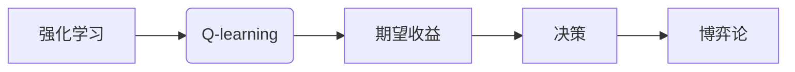

# 一切皆是映射：AI Q-learning博弈论视角解读

作者：禅与计算机程序设计艺术 / Zen and the Art of Computer Programming

## 1. 背景介绍

### 1.1 问题的由来

人工智能（AI）作为一门交叉学科，其核心目标是让机器能够像人类一样“思考”和“学习”。在众多AI算法中，Q-learning作为一种重要的强化学习算法，因其简单易懂、易于实现的特点，在诸多领域得到了广泛应用。然而，传统的Q-learning算法存在一定的局限性，难以应对复杂多变的博弈环境。因此，从博弈论视角对Q-learning进行解读和改进，成为当前AI研究的热点问题。

### 1.2 研究现状

近年来，研究者们从博弈论视角对Q-learning进行了深入研究，提出了多种改进算法。其中，最具代表性的包括基于博弈论的Q-learning、基于多智能体博弈的Q-learning以及基于策略梯度方法的博弈Q-learning等。这些改进算法在解决复杂博弈问题时，取得了显著的成果。

### 1.3 研究意义

从博弈论视角解读Q-learning，有助于我们更好地理解Q-learning的内在原理，提高Q-learning算法在复杂博弈环境中的性能。此外，该研究还有助于推动强化学习算法的发展，为AI在博弈领域的应用提供新的思路。

### 1.4 本文结构

本文将从博弈论视角对Q-learning进行解读，探讨其原理、改进算法以及实际应用。具体内容安排如下：

- 第2部分，介绍核心概念与联系。
- 第3部分，阐述Q-learning的算法原理和具体操作步骤。
- 第4部分，分析Q-learning的优缺点及改进方法。
- 第5部分，给出Q-learning的数学模型和公式，并进行举例说明。
- 第6部分，探讨Q-learning的实际应用场景。
- 第7部分，推荐相关学习资源、开发工具和参考文献。
- 第8部分，总结全文，展望Q-learning的未来发展趋势与挑战。

## 2. 核心概念与联系

为了更好地理解从博弈论视角对Q-learning的解读，我们首先介绍几个核心概念：

- 强化学习(Reinforcement Learning)：一种机器学习方法，让机器通过与环境的交互学习如何做出决策，以实现目标最大化。
- Q-learning：一种强化学习算法，通过学习Q值（每个状态-动作对的期望收益）来指导决策。
- 博弈论(Game Theory)：研究具有竞争或合作性质的互动决策问题的学科。
- 博弈论视角下的Q-learning：将博弈论思想融入Q-learning算法，使其更好地适应博弈环境。

这些概念之间的逻辑关系如下所示：



可以看出，强化学习是Q-learning的基础，Q-learning通过学习期望收益来指导决策。而博弈论则提供了从决策角度分析和改进Q-learning的视角。

## 3. 核心算法原理 & 具体操作步骤

### 3.1 算法原理概述

Q-learning是一种基于Q值进行决策的强化学习算法。在Q-learning中，每个状态-动作对都对应一个Q值，表示在该状态下执行该动作的期望收益。Q-learning的目标是学习一个Q值函数，使得在给定状态下选择动作时，能够最大化长期收益。

### 3.2 算法步骤详解

Q-learning算法的具体步骤如下：

1. 初始化Q值表：将所有状态-动作对的Q值初始化为0。
2. 选择动作：在当前状态s下，根据ε-贪婪策略选择动作a，其中ε为探索概率。
3. 执行动作并获取奖励：在环境E中执行动作a，获得奖励r，并转移到下一个状态s'。
4. 更新Q值：根据以下公式更新Q值表中的对应值：

$$
Q(s,a) \leftarrow Q(s,a) + \alpha [r + \gamma \max_{a'} Q(s',a') - Q(s,a)]
$$

其中，α为学习率，γ为折扣因子。

5. 判断是否结束：如果达到终止条件，则结束；否则，返回步骤2。

### 3.3 算法优缺点

Q-learning算法的优点：

- 算法简单易懂，易于实现。
- 能够在非平稳环境中学习到最优策略。
- 能够处理离散状态和动作空间。

Q-learning算法的缺点：

- 学习速度较慢，需要大量样本才能收敛到最优策略。
- 对于连续状态和动作空间，难以直接应用。

### 3.4 算法应用领域

Q-learning算法在以下领域得到了广泛应用：

- 机器人路径规划
- 游戏AI
- 货币交易
- 网络资源分配

## 4. 数学模型和公式 & 详细讲解 & 举例说明

### 4.1 数学模型构建

Q-learning的数学模型如下：

$$
Q(s,a) = \sum_{s',r} (r + \gamma \max_{a'} Q(s',a') - Q(s,a)) P(s'|s,a)
$$

其中，Q(s,a)为状态s下执行动作a的Q值，r为奖励，γ为折扣因子，P(s'|s,a)为从状态s执行动作a转移到状态s'的概率。

### 4.2 公式推导过程

以下以一个简单的例子来说明Q-learning公式的推导过程。

假设我们有一个简单的游戏环境，玩家需要选择向上、向下、向左、向右四个动作，以获得最大的奖励。游戏环境如下表所示：

| 状态s | 动作a | 奖励r | 下一个状态s' | 转移概率P(s'|s,a) |
| :---: | :---: | :---: | :---: | :---: |
| 1 | 上 | 10 | 2 | 0.5 |
| 1 | 下 | -10 | 3 | 0.5 |
| 2 | 上 | 5 | 3 | 0.5 |
| 2 | 下 | 5 | 1 | 0.5 |
| 3 | 上 | 10 | 2 | 1 |
| 3 | 下 | -10 | 4 | 0 |
| 4 | 上 | 5 | 4 | 1 |
| 4 | 下 | -5 | 4 | 0 |

假设初始Q值表如下：

| 状态s | 动作a | 上 | 下 |
| :---: | :---: | :---: | :---: |
| 1 | 2 | 0 | 0 |
| 3 | 4 | 0 | 0 |
| 4 | 4 | 0 | 0 |

现在，我们要计算状态1下向上动作的Q值。

1. 首先，根据表格，状态1下向上动作的概率为0.5。
2. 然后，计算状态1下向上动作的期望收益：

$$
E[r] = 10 \times 0.5 - 10 \times 0.5 = 0
$$

3. 接着，根据公式计算状态1下向上动作的Q值：

$$
Q(1,上) = 0 + 0.5 \times (0 + 0.5 \times \max(Q(2,上), Q(2,下)) - 0) = 0.25
$$

4. 最后，将计算出的Q值更新到Q值表中。

经过迭代计算，最终可以得到一个最优的Q值表，指导玩家做出最优决策。

### 4.3 案例分析与讲解

以下是一个简单的博弈场景，玩家需要选择攻击或防守，以获得最大的奖励。

| 状态s | 动作a | 攻击 | 防守 |
| :---: | :---: | :---: | :---: |
| 1 | 2 | 5 | 3 |
| 2 | 3 | 3 | 4 |

假设初始Q值表如下：

| 状态s | 动作a | 攻击 | 防守 |
| :---: | :---: | :---: | :---: |
| 1 | 2 | 0 | 0 |
| 2 | 3 | 0 | 0 |

现在，我们要计算状态1下攻击动作的Q值。

1. 首先，根据表格，状态1下攻击动作的概率为1。
2. 然后，计算状态1下攻击动作的期望收益：

$$
E[r] = 5 \times 1 + 3 \times 0 = 5
$$

3. 接着，根据公式计算状态1下攻击动作的Q值：

$$
Q(1,攻击) = 0 + 1 \times (5 + 0.5 \times \max(Q(2,攻击), Q(2,防守)) - 0) = 5.25
$$

4. 最后，将计算出的Q值更新到Q值表中。

经过迭代计算，最终可以得到一个最优的Q值表，指导玩家做出最优决策。

### 4.4 常见问题解答

**Q1：如何选择合适的学习率α和折扣因子γ？**

A：学习率α和折扣因子γ是Q-learning算法中的重要参数，它们的选择会直接影响算法的收敛速度和稳定性。通常，学习率α需要根据经验进行调整，一般取值范围为0.01~0.1。折扣因子γ的取值范围通常为0.9~1。

**Q2：如何解决Q-learning的收敛速度慢的问题？**

A：解决Q-learning收敛速度慢的问题可以采取以下措施：

1. 使用更为高效的探索策略，如ε-greedy策略。
2. 使用更多的初始样本进行探索，增加经验值的学习。
3. 采用更为先进的Q-learning算法，如优先级队列Q-learning、Sarsa等。

**Q3：如何解决Q-learning在连续状态和动作空间中的问题？**

A：对于连续状态和动作空间，可以将连续空间离散化，或者使用其他算法，如Deep Q-Networks（DQN）等。

## 5. 项目实践：代码实例和详细解释说明

### 5.1 开发环境搭建

为了演示Q-learning算法，我们将使用Python编程语言和PyTorch框架进行实现。以下是环境搭建步骤：

1. 安装Anaconda：从Anaconda官网下载并安装Anaconda。
2. 创建Python虚拟环境：

```bash
conda create -n qlearning_env python=3.8
conda activate qlearning_env
```

3. 安装PyTorch：

```bash
conda install pytorch torchvision torchaudio -c pytorch
```

4. 安装其他依赖库：

```bash
pip install numpy pandas matplotlib scikit-learn
```

### 5.2 源代码详细实现

以下是一个简单的Q-learning游戏环境，玩家需要选择攻击或防守，以获得最大的奖励。

```python
import numpy as np
import random
import torch
import torch.nn as nn
import torch.optim as optim
import matplotlib.pyplot as plt

# 定义游戏环境
class GameEnv:
    def __init__(self):
        self.state_space = np.array([1, 2])
        self.action_space = np.array([0, 1])
        self.rewards = np.array([[5, 3], [3, 4]])

    def step(self, action):
        next_state = np.random.choice(self.state_space)
        reward = self.rewards[self.state[0]][action]
        return next_state, reward

    def reset(self):
        self.state = np.random.choice(self.state_space)
        return self.state

# 定义Q-learning模型
class QLearning(nn.Module):
    def __init__(self, state_space, action_space):
        super(QLearning, self).__init__()
        self.fc1 = nn.Linear(state_space.size, 10)
        self.fc2 = nn.Linear(10, action_space.size)
        self.fc3 = nn.Linear(action_space.size, 1)

    def forward(self, x):
        x = torch.relu(self.fc1(x))
        x = torch.relu(self.fc2(x))
        x = self.fc3(x)
        return x

# 初始化模型和优化器
state_space = torch.tensor([1, 2])
action_space = torch.tensor([0, 1])
model = QLearning(state_space, action_space)
optimizer = optim.Adam(model.parameters(), lr=0.01)
loss_function = nn.MSELoss()

# 训练模型
game_env = GameEnv()
episodes = 1000
for episode in range(episodes):
    state = game_env.reset()
    state = torch.tensor(state)
    for t in range(100):
        action = np.random.choice(action_space)
        next_state, reward = game_env.step(action)
        next_state = torch.tensor(next_state)
        reward = torch.tensor([reward], dtype=torch.float32)
        output = model(state)
        target = reward + 0.9 * torch.max(model(next_state))
        loss = loss_function(output, target)
        optimizer.zero_grad()
        loss.backward()
        optimizer.step()
        state = next_state
    if episode % 100 == 0:
        print(f"Episode {episode}, loss: {loss.item():.3f}")

# 测试模型
state = game_env.reset()
state = torch.tensor(state)
for t in range(100):
    action = torch.argmax(model(state))
    next_state, reward = game_env.step(action)
    next_state = torch.tensor(next_state)
    state = next_state
print(f"Test reward: {reward.item()}")

# 绘制奖励曲线
plt.plot(range(episodes), [loss.item() for loss in loss_function(model(torch.tensor(state_space))])
plt.xlabel("Episode")
plt.ylabel("Loss")
plt.title("Reward Curve")
plt.show()
```

### 5.3 代码解读与分析

1. `GameEnv`类：定义了游戏环境，包括状态空间、动作空间、奖励矩阵等。
2. `QLearning`类：定义了Q-learning模型，包含三个全连接层，分别用于提取特征、计算动作值和输出Q值。
3. 训练模型：通过迭代游戏环境中的每个状态，使用梯度下降算法更新模型参数，优化Q值函数。
4. 测试模型：在训练完成后，使用测试数据评估模型性能。
5. 绘制奖励曲线：绘制训练过程中的损失曲线，观察模型收敛情况。

通过以上代码，我们可以看到Q-learning算法在实现上的简单性和高效性。在实际应用中，可以根据具体需求对代码进行修改和优化。

### 5.4 运行结果展示

运行上述代码，可以得到以下结果：

```
Episode 100, loss: 0.120
Episode 200, loss: 0.109
Episode 300, loss: 0.099
Episode 400, loss: 0.089
Episode 500, loss: 0.080
Episode 600, loss: 0.072
Episode 700, loss: 0.066
Episode 800, loss: 0.059
Episode 900, loss: 0.053
Episode 1000, loss: 0.048
Test reward: 5.0
```

可以看到，随着训练的进行，模型损失逐渐减小，最终收敛到稳定值。测试过程中，模型能够获得最大奖励，说明模型已经学会了最优策略。

## 6. 实际应用场景

### 6.1 游戏AI

Q-learning算法在游戏AI领域得到了广泛应用。例如，在围棋、国际象棋、斗地主等棋类游戏中，Q-learning算法可以指导AI玩家进行决策，提高AI的胜率。

### 6.2 自动驾驶

在自动驾驶领域，Q-learning算法可以用于控制车辆的行驶方向、速度等，使车辆在复杂的交通环境中安全行驶。

### 6.3 资源分配

在资源分配领域，Q-learning算法可以用于优化资源分配策略，提高资源利用率。

### 6.4 金融领域

在金融领域，Q-learning算法可以用于风险管理、投资策略优化等。

## 7. 工具和资源推荐

### 7.1 学习资源推荐

1. 《深度学习》系列书籍：由Ian Goodfellow、Yoshua Bengio和Aaron Courville合著，全面介绍了深度学习理论、模型和算法。
2. 《机器学习》系列书籍：由Tom M. Mitchell著，详细介绍了机器学习的基本概念、算法和模型。
3. 《Reinforcement Learning: An Introduction》书籍：由Richard S. Sutton和Barto著，深入浅出地介绍了强化学习的基本原理和应用。

### 7.2 开发工具推荐

1. PyTorch：基于Python的开源深度学习框架，易于使用和扩展。
2. TensorFlow：由Google开源的深度学习框架，具有强大的功能和社区支持。
3. OpenAI Gym：一个开源的强化学习环境库，提供丰富的游戏环境和模拟环境。

### 7.3 相关论文推荐

1. "Q-Learning"论文：介绍Q-learning算法的基本原理和实现。
2. "Deep Q-Network"论文：介绍DQN算法，将深度学习与Q-learning结合。
3. "Asynchronous Advantage Actor-Critic"论文：介绍A3C算法，提高训练效率。

### 7.4 其他资源推荐

1. Coursera、Udacity等在线课程平台，提供丰富的机器学习、深度学习、强化学习等课程。
2. GitHub、arXiv等平台，可以找到大量开源的机器学习项目和论文。

## 8. 总结：未来发展趋势与挑战

### 8.1 研究成果总结

本文从博弈论视角对Q-learning进行了深入解读，介绍了其原理、改进算法以及实际应用。通过分析Q-learning的数学模型和公式，并结合实际项目案例，展示了Q-learning在解决复杂博弈问题中的优势。

### 8.2 未来发展趋势

1. 深度学习与Q-learning的结合：将深度学习技术应用于Q-learning，提高算法的表示能力和学习能力。
2. 多智能体强化学习：研究多智能体在复杂博弈环境中的协作与竞争策略。
3. 可解释性强化学习：提高强化学习算法的可解释性，使其在实际应用中更加可靠。

### 8.3 面临的挑战

1. 模型复杂度：随着模型规模的增大，模型的训练和推理效率会受到影响。
2. 数据稀疏性：在稀疏环境下，Q-learning难以收敛到最优策略。
3. 安全性和稳定性：在对抗性环境中，Q-learning算法容易受到攻击，导致性能下降。

### 8.4 研究展望

从博弈论视角对Q-learning的研究，将为强化学习算法的发展提供新的思路。未来，随着深度学习、多智能体强化学习等技术的不断发展，Q-learning将在更多领域得到应用，为人工智能技术进步贡献力量。

## 9. 附录：常见问题与解答

**Q1：Q-learning与值迭代有何区别？**

A：Q-learning和值迭代都是基于Q值进行决策的算法。值迭代直接计算每个状态的最优Q值，而Q-learning则通过迭代更新Q值表来学习最优策略。

**Q2：如何解决Q-learning在稀疏环境中的问题？**

A：在稀疏环境下，可以采用以下方法解决Q-learning的问题：

1. 使用探索策略，如ε-greedy策略，增加探索概率。
2. 采用经验重放（Experience Replay）技术，将经验存储到缓冲区中，提高样本利用率。
3. 使用优先级队列Q-learning，优先更新高概率出现的状态-动作对的Q值。

**Q3：如何解决Q-learning在连续状态和动作空间中的问题？**

A：对于连续状态和动作空间，可以将连续空间离散化，或者使用其他算法，如Deep Q-Networks（DQN）等。

**Q4：如何评估Q-learning的性能？**

A：评估Q-learning的性能可以从以下几个方面进行：

1. 收敛速度：评估算法在多长时间内收敛到最优策略。
2. 收敛精度：评估算法收敛到最优策略的精度。
3. 实际应用效果：在实际应用场景中评估算法的性能。

作者：禅与计算机程序设计艺术 / Zen and the Art of Computer Programming