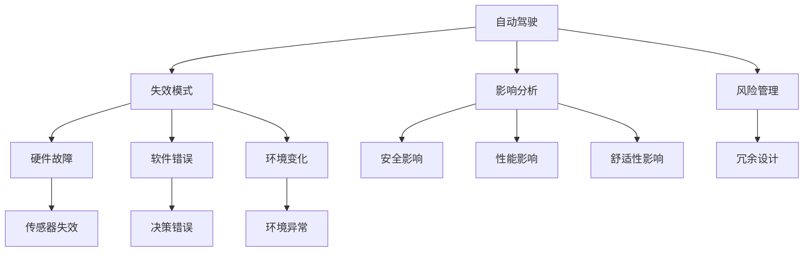

                 

# 自动驾驶行业的失效模式与影响分析

> 关键词：自动驾驶, 失效模式, 影响分析, 安全, 可靠性

## 1. 背景介绍

### 1.1 问题由来
自动驾驶技术近年来迅猛发展，但安全性问题始终是业界和公众关注的焦点。在自动驾驶车辆的实际运行过程中，各种硬件故障、软件bug、环境变化等因素都可能导致系统失效。失效不仅影响驾驶体验，还可能导致严重的事故。因此，对自动驾驶车辆进行失效模式与影响分析(Failure Modes and Effects Analysis, FMEA)，有助于提前识别和评估潜在的风险，确保系统可靠运行。

### 1.2 问题核心关键点
FMEA是一种系统性的风险分析方法，通过对系统各个环节进行失效模式分析，识别可能导致系统失效的因素，评估其影响程度，制定相应的改进措施，从而提高系统的安全性和可靠性。在自动驾驶领域，FMEA主要关注传感器、决策算法、执行系统、人机交互等方面，以确保车辆在各种复杂环境下的正常运行。

## 2. 核心概念与联系

### 2.1 核心概念概述

为更好地理解自动驾驶行业的失效模式与影响分析方法，本节将介绍几个关键概念：

- 自动驾驶(Autonomous Driving, AD)：通过传感器、控制器和执行器等硬件设备，结合高精度地图、定位算法、决策规划等软件模块，实现车辆自动化运行的技术。
- 失效模式(Failure Modes)：指在自动驾驶过程中，可能导致系统无法正常运行的各种硬件故障、软件错误和环境变化等。
- 影响分析(Effects Analysis)：指对每种失效模式可能带来的影响进行评估，包括对车辆安全、性能、舒适性等方面的影响。
- 风险管理(Risk Management)：基于FMEA结果，制定相应的风险控制措施，如备份系统、故障检测和恢复机制等，以降低系统失效的风险。
- 冗余设计(Redundancy Design)：通过多重硬件和软件模块的配置，确保在某个部分失效时，系统仍能正常运行。

这些概念共同构成了自动驾驶系统失效模式与影响分析的完整框架，有助于系统开发者全面评估和提升系统安全性。

### 2.2 概念间的关系

这些核心概念之间的逻辑关系可以通过以下Mermaid流程图来展示：



这个流程图展示了自动驾驶系统失效模式与影响分析的基本流程：

1. 自动驾驶系统作为被分析的对象。
2. 识别和分类可能导致系统失效的各种硬件故障、软件错误和环境变化。
3. 对每种失效模式进行影响评估，明确其对车辆安全、性能和舒适性的影响。
4. 基于风险评估结果，设计冗余系统，制定风险控制措施，确保系统可靠运行。

## 3. 核心算法原理 & 具体操作步骤

### 3.1 算法原理概述

FMEA的本质是对系统各个环节的失效模式进行分析和评估，识别和排除潜在的风险。其基本步骤如下：

1. **失效模式识别**：通过系统设计文档和运行日志，识别可能引发失效的各种原因。
2. **影响分析**：评估每种失效模式可能带来的影响，包括安全性、性能、舒适性等方面。
3. **风险评估**：基于失效模式的影响程度和发生概率，计算风险值，确定优先级。
4. **风险控制**：制定相应的改进措施，如增加冗余配置、设计故障检测和恢复机制等。

在自动驾驶领域，FMEA主要关注以下几个关键环节：

- 传感器性能分析：如摄像头、雷达、激光雷达等的失效模式和影响分析。
- 决策算法可靠性：如感知、规划和控制算法的设计和测试。
- 执行系统完整性：如转向、制动、加速等执行器的失效模式和应急处理。
- 人机交互安全性：如界面设计、控制逻辑和用户体验等。

### 3.2 算法步骤详解

以下是FMEA在自动驾驶系统中的详细步骤：

**Step 1: 准备阶段**

- 确定分析范围：明确需要分析和改进的具体系统组件。
- 收集相关文档：包括系统设计文档、运行日志、用户手册等。
- 组建专家团队：涵盖软件、硬件、测试、运营等方面的专家。

**Step 2: 失效模式识别**

- 系统拆分：将系统拆分为传感器、决策和执行等多个子系统。
- 失效识别：通过头脑风暴、头脑爆炸等方法，识别可能引发失效的各种因素，包括硬件故障、软件错误和环境变化等。
- 记录失效模式：将识别出的失效模式记录在FMEA表格中，并分类为硬件、软件和环境等不同类型。

**Step 3: 影响分析**

- 影响评估：对每种失效模式进行详细评估，确定其对车辆安全、性能和舒适性的影响。
- 量化指标：引入风险度量指标，如失效概率、影响等级等，便于后续分析。
- 记录影响结果：在FMEA表格中记录每种失效模式的影响等级和风险值。

**Step 4: 风险评估**

- 计算风险值：使用失效概率和影响等级的乘积，计算每种失效模式的风险值。
- 确定优先级：根据风险值的大小，确定优先改进的失效模式。
- 记录评估结果：在FMEA表格中记录每种失效模式的风险优先级和改进建议。

**Step 5: 风险控制**

- 制定改进措施：针对高优先级失效模式，制定具体的改进措施，如冗余设计、故障检测和恢复机制等。
- 实施改进方案：对系统进行相应的改进和优化，确保改进措施的有效性。
- 验证改进效果：通过模拟测试和实际运行，验证改进措施的效果。

**Step 6: 持续改进**

- 定期更新FMEA：随着系统运行和环境变化，定期更新FMEA，确保其持续有效。
- 记录改进历史：在FMEA表格中记录每次改进措施的实施效果，便于后续评估和优化。

### 3.3 算法优缺点

**优点：**

- **系统性**：FMEA通过全面的系统分析，识别和评估潜在的失效模式，覆盖了系统设计的各个环节。
- **风险导向**：通过优先级排序，明确高风险的失效模式，有针对性地进行改进，提高了改进效率。
- **可视化**：FMEA表格清晰地展示了失效模式、影响评估和风险优先级等信息，便于理解和分享。

**缺点：**

- **主观性**：失效模式的识别和影响评估受到分析人员的主观影响，可能导致结果偏差。
- **复杂性**：FMEA过程较为繁琐，需要详细的文档和专家团队支持，增加了实施成本。
- **动态性不足**：FMEA主要针对静态系统设计，对动态运行过程的考虑有限，可能导致遗漏某些风险。

### 3.4 算法应用领域

FMEA在自动驾驶行业的应用领域非常广泛，涵盖多个关键环节，如：

- 传感器系统：如摄像头、雷达、激光雷达等的失效模式和影响分析。
- 感知系统：如目标检测、环境感知等算法的可靠性评估。
- 决策系统：如路径规划、避障策略等算法的失效模式和影响分析。
- 执行系统：如转向、制动、加速等执行器的失效模式和应急处理。
- 人机交互：如界面设计、控制逻辑和用户体验等。

此外，FMEA还应用于自动驾驶系统的验证和测试、新系统的设计和新功能的引入等环节，确保系统安全性和可靠性。

## 4. 数学模型和公式 & 详细讲解 & 举例说明（备注：数学公式请使用latex格式，latex嵌入文中独立段落使用 $$，段落内使用 $)
### 4.1 数学模型构建

自动驾驶系统中的失效模式与影响分析，主要涉及以下几个关键指标：

- 失效模式：$F$，表示可能导致系统失效的各种因素。
- 影响等级：$E$，表示每种失效模式对车辆安全、性能和舒适性的影响程度。
- 失效概率：$P$，表示每种失效模式发生的概率。
- 风险值：$R$，表示每种失效模式的风险程度。

定义风险值$R$为失效概率$P$和影响等级$E$的乘积，即：

$$
R = P \times E
$$

其中$P$和$E$的值通常需要根据实际运行数据和专家评估得出。

### 4.2 公式推导过程

假设失效模式$F$的概率为$P_F$，影响等级为$E_F$，则其风险值$R_F$为：

$$
R_F = P_F \times E_F
$$

对于自动驾驶系统中的多个失效模式，可以通过以下步骤计算整体系统的风险值$R_{\text{total}}$：

1. 对每个失效模式进行风险评估，得到其风险值$R_F$。
2. 计算所有失效模式的平均风险值$\bar{R}$：

$$
\bar{R} = \frac{1}{N} \sum_{i=1}^N R_F^i
$$

其中$N$为失效模式的总数。
3. 根据整体系统的安全要求，确定风险值的阈值$T$，如$T = 10^{-4}$。
4. 如果$\bar{R} > T$，则系统存在高风险，需要采取相应的改进措施。

### 4.3 案例分析与讲解

假设在一个自动驾驶车辆的传感器系统中，识别出以下两种失效模式：

- 摄像头失效：概率为$P_{\text{cam}} = 0.01$，影响等级为$E_{\text{cam}} = 5$。
- 雷达失效：概率为$P_{\text{radar}} = 0.002$，影响等级为$E_{\text{radar}} = 4$。

计算两种失效模式的风险值$R_{\text{cam}}$和$R_{\text{radar}}$，并比较其大小：

$$
R_{\text{cam}} = P_{\text{cam}} \times E_{\text{cam}} = 0.01 \times 5 = 0.05
$$

$$
R_{\text{radar}} = P_{\text{radar}} \times E_{\text{radar}} = 0.002 \times 4 = 0.008
$$

可以看出，雷达失效的风险值较高，需要优先改进。

## 5. 项目实践：代码实例和详细解释说明

### 5.1 开发环境搭建

在进行FMEA实践前，我们需要准备好开发环境。以下是使用Python进行FMEA工具开发的流程：

1. 安装Anaconda：从官网下载并安装Anaconda，用于创建独立的Python环境。

2. 创建并激活虚拟环境：
```bash
conda create -n fmea-env python=3.8 
conda activate fmea-env
```

3. 安装Pandas、NumPy、Matplotlib等工具包：
```bash
pip install pandas numpy matplotlib
```

4. 安装PyFMEA库：
```bash
pip install pyfmea
```

5. 安装TensorFlow或PyTorch等深度学习框架：
```bash
pip install tensorflow
```

完成上述步骤后，即可在`fmea-env`环境中开始FMEA实践。

### 5.2 源代码详细实现

这里我们以一个简化的FMEA工具为例，展示如何使用Python进行失效模式与影响分析。

首先，定义一个FMEA类，用于存储和处理失效模式信息：

```python
from pyfmea import FMEA

class FMEAFrayer:
    def __init__(self, fmea_file):
        self.fmea = FMEA(fmea_file)
        self.fmea.read_fmea_file()

    def calculate_risk(self):
        self.fmea.calculate_risk()
        self.fmea.print_risk_results()

    def update_risk(self, fmea_file):
        self.fmea.read_fmea_file(fmea_file)
        self.calculate_risk()

# 读取FMEA文件
fmea_file = "fmea_example.csv"
frayer = FMEAFrayer(fmea_file)
frayer.calculate_risk()
```

然后，定义FMEA数据表，用于存储失效模式、失效概率和影响等级等关键信息：

```python
class FMEADataFrame:
    def __init__(self, dataframe):
        self.dataframe = dataframe
        self.dataframe['Risk'] = self.calculate_risk_value()

    def calculate_risk_value(self):
        risk = self.dataframe['Probability'] * self.dataframe['Effect']
        return risk

# 创建FMEA数据表
import pandas as pd

data = {
    'FMEA_ID': ['FMEA1', 'FMEA2', 'FMEA3'],
    'Component': ['Camera', 'Radar', 'Laser'],
    'Failure_mode': ['Failure1', 'Failure2', 'Failure3'],
    'Probability': [0.01, 0.002, 0.001],
    'Effect': [5, 4, 3]
}

df = pd.DataFrame(data)
fmea_data = FMEADataFrame(df)
fmea_data.calculate_risk_value()
```

最后，定义FMEA工具的入口函数，启动FMEA计算：

```python
def main():
    fmea_file = "fmea_example.csv"
    frayer = FMEAFrayer(fmea_file)
    frayer.calculate_risk()

if __name__ == "__main__":
    main()
```

在上述代码中，我们使用了PyFMEA库，定义了FMEA类和FMEA数据表，并计算了每种失效模式的风险值。可以看到，利用Python进行FMEA开发，可以方便地对各种失效模式进行系统化分析，并快速计算风险值。

### 5.3 代码解读与分析

让我们再详细解读一下关键代码的实现细节：

**FMEAFrayer类**：
- `__init__`方法：初始化FMEA类，读取FMEA文件。
- `calculate_risk`方法：计算每种失效模式的风险值，并输出结果。
- `update_risk`方法：重新读取FMEA文件，计算风险值。

**FMEADataFrame类**：
- `__init__`方法：初始化FMEA数据表，计算每种失效模式的风险值。
- `calculate_risk_value`方法：根据失效概率和影响等级，计算风险值。

**main函数**：
- 创建FMEA对象，计算并输出风险值。

**数据表定义**：
- 定义了FMEA数据表的各个字段，包括失效模式ID、组件名称、失效模式、失效概率和影响等级等。
- 利用Pandas库创建数据表，并计算每种失效模式的风险值。

可以看到，利用Python进行FMEA开发，可以方便地实现各种失效模式的系统化分析和风险评估。开发者可以根据具体需求，进一步扩展和优化FMEA工具。

## 6. 实际应用场景

### 6.1 智能交通管理

自动驾驶技术可以与智能交通管理系统结合，提高道路交通的安全性和效率。在智能交通管理系统中，FMEA可以应用于以下方面：

- 传感器系统：评估摄像头、雷达、激光雷达等传感器失效模式和影响，确保感知数据的准确性。
- 决策系统：分析路径规划、避障策略等决策算法的失效模式，提高决策的可靠性。
- 执行系统：评估转向、制动、加速等执行系统的失效模式，确保车辆的控制安全性。

### 6.2 自动驾驶车辆运营

在自动驾驶车辆的运营过程中，FMEA可以应用于以下环节：

- 系统监控：实时监控车辆的传感器、决策和执行系统，及时发现并处理潜在的失效模式。
- 故障检测：设计多重冗余系统，引入故障检测机制，确保系统在故障发生时能够安全降级或切换。
- 应急处理：建立应急处理预案，确保在突发情况下，车辆能够安全停止或转向。

### 6.3 无人驾驶物流

无人驾驶物流系统涉及复杂的场景和多变的道路环境，FMEA可以有效评估系统的可靠性和安全性。具体应用如下：

- 环境感知：评估摄像头、雷达等传感器的失效模式和影响，确保对复杂环境的高效感知。
- 路径规划：分析路径规划算法的失效模式，提高路径的准确性和鲁棒性。
- 货物装载：评估货物装载系统的失效模式，确保货物运输的安全性。

### 6.4 未来应用展望

随着自动驾驶技术的不断成熟，FMEA将广泛应用于更多的实际应用场景，提升系统的安全性和可靠性。未来，FMEA的演进方向可能包括：

- 动态更新：通过实时数据分析，动态更新FMEA，确保系统在运行过程中能够及时应对新的风险。
- 全流程覆盖：将FMEA覆盖整个系统设计、开发和运行过程，从源头提升系统的安全性。
- 多学科融合：结合人工智能、大数据、云计算等技术，实现系统的高效协同和智能决策。

总之，FMEA在自动驾驶行业的应用前景广阔，将有助于构建更安全、可靠、高效的自动驾驶系统。

## 7. 工具和资源推荐

### 7.1 学习资源推荐

为了帮助开发者系统掌握FMEA的理论基础和实践技巧，这里推荐一些优质的学习资源：

1. 《失效模式与影响分析》（Failure Modes and Effects Analysis）书籍：系统介绍了FMEA的基本概念、流程和应用，适合初学者和进阶者。
2. ISO 18404《失效模式与影响分析》标准：国际标准化组织发布的FMEA标准，提供了详尽的实施指南和评估方法。
3. FMEA在线课程：如Coursera、Udacity等在线学习平台上的FMEA课程，通过视频和练习，深入理解FMEA的核心思想和应用。
4. FMEA软件工具：如Minitab、Relias、AutoFMEA等，提供了图形化的FMEA工具，方便操作和分析。
5. FMEA案例库：如GoneRight、FailSafe等，提供大量真实的FMEA案例，供学习和参考。

通过对这些资源的学习实践，相信你一定能够全面掌握FMEA的理论和实践，将其应用于自动驾驶系统的失效风险管理。

### 7.2 开发工具推荐

高效的工具支持是FMEA开发的必要条件。以下是几款常用的FMEA开发工具：

1. Minitab：功能强大的FMEA软件，支持数据的导入、导出和分析，具有图形化的界面和丰富的统计功能。
2. Relias：集成了故障树分析和风险评估等功能的FMEA工具，适用于工业生产等领域。
3. AutoFMEA：轻量级的FMEA软件，支持多平台运行，具有友好的用户界面。
4. Excel：利用Excel的宏和函数，可以方便地进行FMEA的计算和分析。
5. PyFMEA：基于Python的FMEA库，支持数据处理和风险评估，适合技术开发人员使用。

合理利用这些工具，可以显著提升FMEA的开发效率，加快风险评估的进程。

### 7.3 相关论文推荐

FMEA技术的发展得益于众多学者的持续研究。以下是几篇经典的FMEA论文，推荐阅读：

1. "The Failure Modes and Effects Analysis Method" by David S. Riconsanzo：介绍了FMEA的基本流程和步骤，适合入门学习。
2. "Principles and Practices of Fault Tree Analysis and Failure Modes and Effects Analysis" by John S. Hobbs：详细阐述了故障树分析和FMEA的原理和方法，具有较高的参考价值。
3. "FMEA for Software: An Introduction" by P. S. Chung：介绍了FMEA在软件系统中的应用，提供了丰富的实例和案例。
4. "Effective FMEA Implementation in Safety-Critical Systems" by Patrick H. Winston：探讨了FMEA在安全关键系统中的实现方法和效果评估。
5. "Machine Learning in Fault Tree Analysis" by Dragan Seselj：介绍了机器学习在故障树分析中的应用，展示了新的FMEA研究方向。

这些论文代表了FMEA技术的发展脉络，通过学习这些前沿成果，可以帮助研究者把握学科前进方向，激发更多的创新灵感。

除上述资源外，还有一些值得关注的前沿资源，帮助开发者紧跟FMEA技术的最新进展，例如：

1. arXiv论文预印本：人工智能领域最新研究成果的发布平台，包括大量尚未发表的前沿工作，学习前沿技术的必读资源。
2. 业界技术博客：如IEEE Spectrum、AI Magazine等顶尖实验室的官方博客，第一时间分享他们的最新研究成果和洞见。
3. 技术会议直播：如IEEE、ACM、SICE等国际会议现场或在线直播，能够聆听到专家们的最新分享，开拓视野。
4. GitHub热门项目：在GitHub上Star、Fork数最多的FMEA相关项目，往往代表了该技术领域的发展趋势和最佳实践，值得去学习和贡献。
5. 行业分析报告：各大咨询公司如McKinsey、PwC等针对FMEA行业的分析报告，有助于从商业视角审视技术趋势，把握应用价值。

总之，对于FMEA技术的学习和实践，需要开发者保持开放的心态和持续学习的意愿。多关注前沿资讯，多动手实践，多思考总结，必将收获满满的成长收益。

## 8. 总结：未来发展趋势与挑战

### 8.1 研究成果总结

本文对自动驾驶行业的失效模式与影响分析方法进行了全面系统的介绍。首先阐述了FMEA在自动驾驶领域的应用背景和重要性，明确了FMEA在提升系统安全性和可靠性方面的独特价值。其次，从原理到实践，详细讲解了FMEA的数学模型和操作步骤，给出了FMEA工具开发的完整代码实例。同时，本文还广泛探讨了FMEA方法在智能交通管理、无人驾驶物流等众多领域的应用前景，展示了FMEA范式的巨大潜力。此外，本文精选了FMEA技术的各类学习资源，力求为读者提供全方位的技术指引。

通过本文的系统梳理，可以看到，FMEA在自动驾驶领域的应用已经初见成效，显著提升了系统的安全性和可靠性。未来，随着FMEA技术的不断演进和优化，必将在更多领域发挥更大的作用，进一步推动自动驾驶技术的普及和应用。

### 8.2 未来发展趋势

展望未来，FMEA技术在自动驾驶行业的发展趋势将包括以下几个方向：

1. **动态更新**：通过实时数据分析，动态更新FMEA，确保系统在运行过程中能够及时应对新的风险。
2. **全流程覆盖**：将FMEA覆盖整个系统设计、开发和运行过程，从源头提升系统的安全性。
3. **多学科融合**：结合人工智能、大数据、云计算等技术，实现系统的高效协同和智能决策。
4. **人机协作**：引入人机协作机制，通过专家干预和自动化分析相结合，提升FMEA的精准性和效率。
5. **透明化**：利用可视化工具和解释性技术，增强FMEA的可解释性和透明度，帮助开发者和用户理解风险和改进措施。

这些趋势凸显了FMEA技术在自动驾驶系统中的重要性，将有助于构建更加安全、可靠、高效的自动驾驶系统。

### 8.3 面临的挑战

尽管FMEA技术在自动驾驶领域取得了显著成果，但在迈向更加智能化、普适化应用的过程中，它仍面临着诸多挑战：

1. **数据复杂性**：自动驾驶系统涉及多种传感器和设备，数据复杂度较高，如何高效处理和分析数据，是一个关键挑战。
2. **实时性要求**：在实时运行环境中，FMEA需要快速响应和处理，以确保系统安全。
3. **人机交互**：如何设计高效的人机交互界面，确保用户能够准确理解和操作FMEA工具，也是一个重要问题。
4. **技术演进**：自动驾驶技术的快速迭代，使得FMEA需要不断更新和优化，以适应新技术和需求。
5. **伦理与安全**：FMEA的实施需要考虑伦理和安全问题，确保数据和算法的公正性和透明性。

### 8.4 研究展望

面对FMEA面临的这些挑战，未来的研究需要在以下几个方面寻求新的突破：

1. **大数据分析**：利用大数据分析技术，高效处理和分析自动驾驶系统的海量数据，提升FMEA的实时性和精准性。
2. **实时系统设计**：结合实时系统设计方法，优化FMEA的工具和算法，确保系统在实时环境中的高效运行。
3. **人机交互设计**：设计友好的人机交互界面和提示系统，提高用户对FMEA工具的使用效率和理解度。
4. **持续改进机制**：建立持续改进机制，通过定期更新和优化，确保FMEA工具的长期有效性和适用性。
5. **伦理与安全**：引入伦理和社会学研究，确保FMEA技术的公正性和透明性，规避潜在的伦理和安全问题。

这些研究方向的探索，必将引领FMEA技术迈向更高的台阶，为构建安全、可靠、高效的自动驾驶系统铺平道路。面向未来，FMEA技术还需要与其他人工智能技术进行更深入的融合，如知识表示、因果推理、强化学习等，多路径协同发力，共同推动自动驾驶技术的进步。只有勇于创新、敢于突破，才能不断拓展FMEA技术的边界，让自动驾驶技术更好地造福人类社会。

## 9. 附录：常见问题与解答

