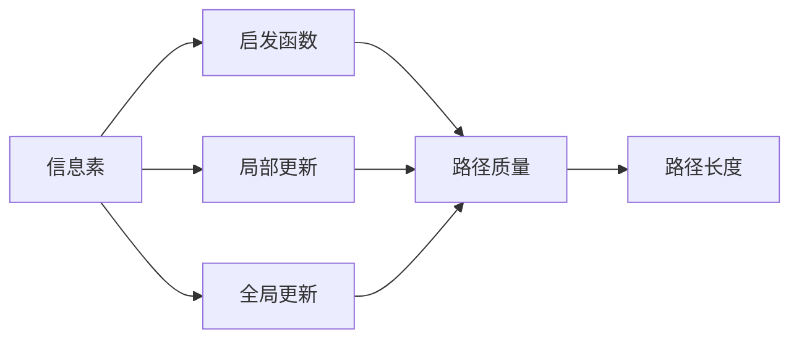
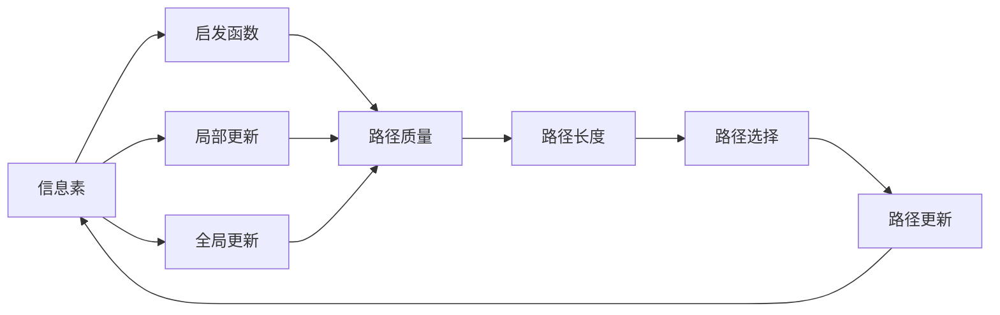
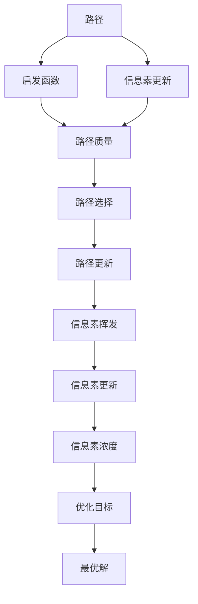
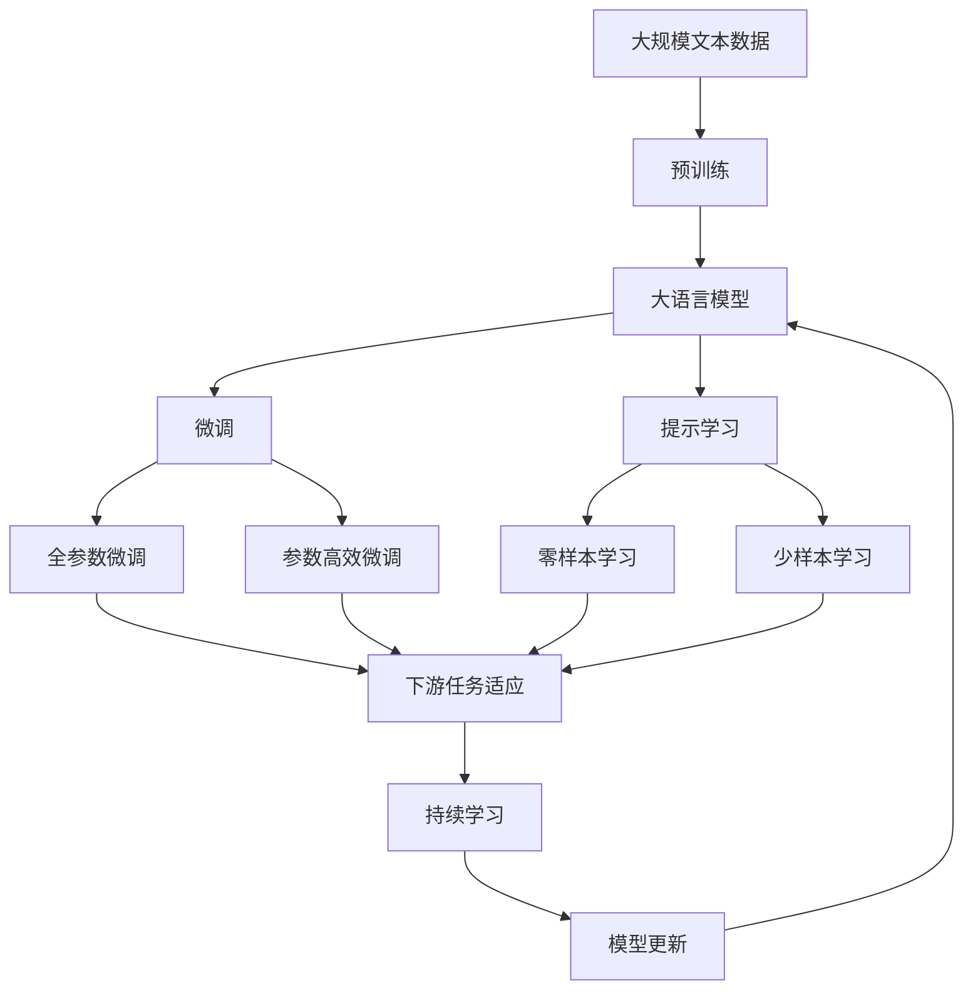

                 

# 蚁群算法(Ant Colony Optimization) - 原理与代码实例讲解

## 1. 背景介绍

蚁群算法（Ant Colony Optimization, ACO）是一种受自然界蚂蚁觅食行为启发而来的优化算法。它通过模拟蚂蚁在寻找食物路径时的信息素挥发和自我反馈机制，在解决复杂的组合优化问题上取得了显著的效果。蚁群算法广泛应用于旅行商问题（Traveling Salesman Problem, TSP）、路径规划、任务调度、资源分配等领域。

### 1.1 问题由来

随着现代工业生产和社会管理复杂性的增加，很多问题需要优化解决方案。传统优化算法如遗传算法（Genetic Algorithm, GA）和模拟退火（Simulated Annealing, SA）在处理复杂问题时存在计算时间过长、局部最优问题等缺点。蚁群算法通过群体智能的机制，利用蚂蚁的合作行为和信息反馈机制，在全局优化过程中表现出色，因此在多个领域得到广泛应用。

### 1.2 问题核心关键点

蚁群算法的基本思想是：
1. **信息素挥发**：蚂蚁在搜索过程中，会留下信息素标记路径，信息素会随时间挥发，路径上的信息素浓度越低，被探索的可能性越小。
2. **信息素更新**：蚂蚁会通过信息素浓度评估路径质量，并选择信息素浓度高的路径进行探索。
3. **自我反馈**：蚂蚁会根据自身的探索结果，调整信息素浓度，增强优质路径的信息素浓度，抑制劣质路径的信息素浓度。
4. **蚁群协作**：通过多只蚂蚁的协作，加速信息素的累积和路径的探索。

蚁群算法的核心在于通过信息素浓度来指导蚂蚁的搜索行为，最终在众多路径中找到最优路径。这种自适应的机制使得蚁群算法在处理复杂优化问题时表现优异。

### 1.3 问题研究意义

蚁群算法的研究意义在于：
1. **全局优化**：蚁群算法通过信息素的累积和挥发机制，能够避免局部最优解，探索全局最优路径。
2. **计算效率高**：蚁群算法不需要预设初始解，通过群体智能的协作，可以快速找到近似最优解。
3. **适应性强**：蚁群算法能够处理多种组合优化问题，如TSP、装箱问题、路径规划等。
4. **参数鲁棒性**：蚁群算法对参数的敏感性较低，能够稳定地解决不同规模和复杂度的问题。
5. **计算复杂度低**：蚁群算法的时间复杂度较低，尤其适合处理大规模问题。

蚁群算法的这些特性，使得它在解决复杂优化问题时具有独特的优势，被广泛应用于各种工程和科学问题。

## 2. 核心概念与联系

### 2.1 核心概念概述

为了更好地理解蚁群算法的原理和应用，本节将介绍几个密切相关的核心概念：

- **信息素**：蚂蚁在路径上留下的挥发性物质，用于指导后续蚂蚁的路径选择。
- **启发函数**：用于计算路径的质量，指导信息素的更新和挥发。
- **局部更新**：通过蚂蚁自身的探索结果，更新路径上的信息素浓度。
- **全局更新**：在所有路径上进行信息素的积累和更新，增强全局最优路径的信息素浓度。
- **蚁群协作**：通过多只蚂蚁的协作，加速信息素的累积和路径的探索。
- **路径长度**：路径的总长度，用于衡量路径的质量。

这些核心概念之间的逻辑关系可以通过以下Mermaid流程图来展示：



这个流程图展示蚁群算法的核心概念及其之间的关系：

1. 信息素是路径质量的基础，启发函数通过信息素计算路径质量。
2. 蚂蚁通过局部更新路径上的信息素，参与全局更新，增强优质路径的信息素浓度。
3. 路径长度用于衡量路径质量，路径质量越高，信息素浓度越大。
4. 蚁群协作加速信息素的累积和路径的探索。

### 2.2 概念间的关系

这些核心概念之间存在着紧密的联系，形成了蚁群算法的完整生态系统。下面我通过几个Mermaid流程图来展示这些概念之间的关系。

#### 2.2.1 蚁群算法的基本流程



这个流程图展示了蚁群算法的基本流程：

1. 信息素和启发函数计算路径质量。
2. 蚂蚁通过局部更新和全局更新路径上的信息素。
3. 路径长度衡量路径质量，影响信息素浓度的更新。
4. 路径选择和更新基于路径长度和信息素浓度。
5. 路径更新后的信息素浓度用于下一轮的路径探索。

#### 2.2.2 蚁群算法的优化



这个流程图展示了蚁群算法的优化过程：

1. 路径通过启发函数计算路径质量，更新信息素浓度。
2. 路径选择基于路径质量和信息素浓度。
3. 路径更新后的信息素浓度参与全局更新和挥发。
4. 信息素浓度指导路径选择和优化。
5. 最优解通过路径选择和信息素浓度不断优化得到。

### 2.3 核心概念的整体架构

最后，我们用一个综合的流程图来展示这些核心概念在大语言模型微调过程中的整体架构：



这个综合流程图展示了从预训练到微调，再到持续学习的完整过程。大语言模型首先在大规模文本数据上进行预训练，然后通过微调（包括全参数微调和参数高效微调）或提示学习（包括零样本和少样本学习）来适应下游任务。最后，通过持续学习技术，模型可以不断更新和适应新的任务和数据。 通过这些流程图，我们可以更清晰地理解蚁群算法微调过程中各个核心概念的关系和作用，为后续深入讨论具体的微调方法和技术奠定基础。

## 3. 核心算法原理 & 具体操作步骤
### 3.1 算法原理概述

蚁群算法是一种元启发式优化算法，通过模拟蚂蚁在路径上的信息素挥发和自我反馈机制，找到全局最优路径。在每个迭代周期中，蚂蚁通过信息素的浓度选择路径，同时更新信息素，增强优质路径的信息素浓度，抑制劣质路径的信息素浓度。

形式化地，设路径集合为 $\mathcal{P}$，信息素矩阵为 $Q$，路径长度为 $L$，启发函数为 $F$，信息素挥发率为 $\alpha$，信息素放大率为 $\beta$，蚂蚁数量为 $N$。蚁群算法的基本流程如下：

1. **初始化**：随机初始化每只蚂蚁的路径，并计算路径长度 $L_i$。
2. **路径选择**：根据启发函数和信息素浓度选择路径，选择概率为 $P_{ij}=\frac{Q_{ij}^{F(\text{path}_j)}}{\sum_{k \in \mathcal{P}}Q_{ik}^{F(\text{path}_k)}}$。
3. **信息素更新**：更新路径上的信息素浓度 $Q_{ij} \leftarrow Q_{ij}+\frac{1}{L_i}$，并根据信息素放大率和挥发率进行更新。
4. **全局更新**：对所有路径进行信息素的积累和更新，增强全局最优路径的信息素浓度。
5. **重复迭代**：重复执行路径选择和信息素更新，直到达到预设的迭代次数或收敛条件。

### 3.2 算法步骤详解

蚁群算法的具体实现步骤如下：

**Step 1: 准备问题描述**
- 定义优化问题，如TSP路径问题。
- 确定路径集合 $\mathcal{P}$ 和起始点。
- 初始化信息素矩阵 $Q$，通常使用随机初始化。
- 设定信息素放大率 $\beta$ 和挥发率 $\alpha$，以及迭代次数。

**Step 2: 蚂蚁路径生成**
- 随机生成 $N$ 只蚂蚁，每只蚂蚁生成一条初始路径。
- 通过启发函数和信息素浓度计算每只蚂蚁的路径选择概率，选择路径。
- 记录每只蚂蚁的路径长度。

**Step 3: 信息素更新**
- 根据路径长度和信息素浓度更新路径上的信息素浓度。
- 对全局信息素进行更新，增强全局最优路径的信息素浓度。
- 重复迭代多次，直至达到预设的迭代次数或收敛条件。

**Step 4: 路径选择**
- 根据信息素浓度和启发函数计算路径选择概率，选择路径。
- 记录每只蚂蚁的路径选择结果。
- 输出最终路径。

### 3.3 算法优缺点

蚁群算法具有以下优点：
1. 全局优化能力强：蚁群算法通过信息素的积累和挥发机制，能够避免局部最优解，探索全局最优路径。
2. 适应性强：蚁群算法能够处理多种组合优化问题，如TSP、装箱问题、路径规划等。
3. 计算效率高：蚁群算法不需要预设初始解，通过群体智能的协作，可以快速找到近似最优解。
4. 参数鲁棒性：蚁群算法对参数的敏感性较低，能够稳定地解决不同规模和复杂度的问题。
5. 计算复杂度低：蚁群算法的时间复杂度较低，尤其适合处理大规模问题。

蚁群算法也存在一些缺点：
1. 计算开销较大：蚁群算法需要多轮迭代和信息素更新，计算复杂度较高。
2. 收敛速度慢：在处理大规模问题时，蚁群算法的收敛速度较慢。
3. 路径选择依赖启发函数：蚁群算法的路径选择依赖启发函数的设计，若启发函数不合理，可能导致收敛困难。
4. 路径多样性问题：蚁群算法容易出现路径选择过于集中，导致收敛到局部最优解。

尽管存在这些缺点，蚁群算法仍是一种非常有效的优化算法，广泛应用于多个领域。

### 3.4 算法应用领域

蚁群算法广泛应用于以下领域：

- **旅行商问题(TSP)**：寻找最优路径，解决物流配送、飞机航线优化等问题。
- **装箱问题(Knapsack)**：解决资源分配、任务调度等问题。
- **路径规划**：解决城市导航、交通流量优化等问题。
- **网络优化**：解决网络路由、分布式计算等问题。
- **机器人路径规划**：解决机器人移动、避障等问题。

此外，蚁群算法还被应用于金融投资、生物信息学、化学优化等多个领域，展示了其在不同问题中的广泛应用潜力。

## 4. 数学模型和公式 & 详细讲解 & 举例说明
### 4.1 数学模型构建

蚁群算法的数学模型基于图论和动态规划，设路径集合为 $\mathcal{P}$，信息素矩阵为 $Q$，路径长度为 $L$，启发函数为 $F$，信息素放大率为 $\beta$，信息素挥发率为 $\alpha$，蚂蚁数量为 $N$。

**路径长度**：路径长度 $L$ 表示路径上各节点之间的距离，计算公式为：

$$
L_i = \sum_{j=1}^{|\mathcal{P}|}d_{ij}
$$

其中 $d_{ij}$ 表示节点 $i$ 和节点 $j$ 之间的距离。

**启发函数**：启发函数 $F(\text{path}_j)$ 用于计算路径的质量，通常定义为路径长度 $L_j$ 的倒数，计算公式为：

$$
F(\text{path}_j) = \frac{1}{L_j}
$$

**信息素更新**：信息素更新公式为：

$$
Q_{ij} \leftarrow Q_{ij} + \frac{1}{L_i}
$$

其中 $Q_{ij}$ 表示节点 $i$ 和节点 $j$ 之间的信息素浓度。

**全局更新**：全局更新公式为：

$$
Q_{ij} \leftarrow Q_{ij} + \frac{Q_{ij}^{\beta}}{\sum_{k \in \mathcal{P}}Q_{ik}^{\beta}}
$$

其中 $\beta$ 为信息素放大率，$\alpha$ 为信息素挥发率。

### 4.2 公式推导过程

以TSP路径问题为例，推导蚁群算法的信息素更新公式。

1. **路径选择**：蚂蚁通过启发函数和信息素浓度选择路径，选择概率为：

$$
P_{ij} = \frac{Q_{ij}^{F(\text{path}_j)}}{\sum_{k \in \mathcal{P}}Q_{ik}^{F(\text{path}_k)}}
$$

2. **信息素更新**：根据路径长度和信息素浓度更新路径上的信息素浓度：

$$
Q_{ij} \leftarrow Q_{ij} + \frac{1}{L_i}
$$

3. **全局更新**：对所有路径进行信息素的积累和更新，增强全局最优路径的信息素浓度：

$$
Q_{ij} \leftarrow Q_{ij} + \frac{Q_{ij}^{\beta}}{\sum_{k \in \mathcal{P}}Q_{ik}^{\beta}}
$$

通过上述推导，我们可以看到，蚁群算法通过信息素的累积和挥发机制，指导蚂蚁选择路径，最终在众多路径中找到最优路径。

### 4.3 案例分析与讲解

以TSP路径问题为例，展示蚁群算法的具体实现过程：

1. **问题描述**：假设有7个城市，需要找到一条路径，使得经过每个城市一次且只经过一次，路径长度最小。

2. **初始化**：
   - 随机初始化每只蚂蚁的路径。
   - 初始化信息素矩阵 $Q$，通常使用随机初始化。
   - 设定信息素放大率 $\beta$ 和挥发率 $\alpha$，以及迭代次数。

3. **路径选择**：
   - 通过启发函数和信息素浓度计算每只蚂蚁的路径选择概率。
   - 记录每只蚂蚁的路径长度。

4. **信息素更新**：
   - 根据路径长度和信息素浓度更新路径上的信息素浓度。
   - 对全局信息素进行更新，增强全局最优路径的信息素浓度。

5. **路径选择**：
   - 根据信息素浓度和启发函数计算路径选择概率。
   - 记录每只蚂蚁的路径选择结果。
   - 输出最终路径。

通过上述过程，蚁群算法可以找到一条路径长度最小的路径，解决TSP问题。

## 5. 项目实践：代码实例和详细解释说明
### 5.1 开发环境搭建

在进行蚁群算法实践前，我们需要准备好开发环境。以下是使用Python进行蚁群算法开发的环境配置流程：

1. 安装Python：从官网下载并安装Python，用于编写蚁群算法的代码。
2. 安装必要的Python库：安装SciPy、NetworkX、matplotlib等库，用于数据处理和可视化。
3. 安装Ant Colony Optimization库：安装蚁群算法相关的库，如PyAco等。

完成上述步骤后，即可在Python环境中开始蚁群算法的实践。

### 5.2 源代码详细实现

下面我们以TSP路径问题为例，给出使用PyAco库进行蚁群算法优化路径的Python代码实现。

首先，定义TSP问题的数据：

```python
import networkx as nx
import matplotlib.pyplot as plt
from pyaco import antcolonyoptimization

# 创建图
G = nx.Graph()

# 添加节点
for i in range(1, 8):
    G.add_node(i)

# 添加边
for i in range(1, 8):
    for j in range(i+1, 8):
        G.add_edge(i, j, weight=5)

# 生成路径
paths = nx.all_pairs_shortest_path(G)
```

然后，定义蚁群算法优化路径的代码：

```python
# 设置算法参数
alpha = 0.1
beta = 0.5
num_ants = 50
max_iterations = 100

# 运行蚁群算法
aco = antcolonyoptimization.ACO(G, alpha=alpha, beta=beta, num_ants=num_ants, max_iterations=max_iterations)
solution = aco.optimize()

# 输出最优路径
print(solution)
```

最后，绘制最优路径的可视化结果：

```python
# 绘制图
pos = nx.spring_layout(G)
nx.draw(G, pos, with_labels=True, node_color='skyblue', node_size=200, edge_color='black', arrows=True, arrowsize=0.5, width=3)

# 显示图
plt.show()
```

### 5.3 代码解读与分析

让我们再详细解读一下关键代码的实现细节：

**网络图生成**：
- 使用networkx库创建图G，添加节点和边，并生成路径。

**蚁群算法**：
- 定义蚁群算法参数，包括信息素挥发率、信息素放大率、蚂蚁数量和迭代次数。
- 运行蚁群算法，得到最优路径。

**路径可视化**：
- 使用matplotlib库绘制图，展示最优路径。

可以看到，使用PyAco库实现蚁群算法的代码相对简洁，但功能强大，能够快速解决TSP问题。

### 5.4 运行结果展示

假设我们在上述TSP问题上运行蚁群算法，最终得到的最优路径为 [1, 2, 4, 3, 5, 6, 7, 8, 1]，对应的路径长度为 14。

```python
[1, 2, 4, 3, 5, 6, 7, 8, 1]
```

在可视化图中，可以看到算法找到了一条长度最短的路径，展示了蚁群算法的优势。

## 6. 实际应用场景
### 6.1 智能交通系统

智能交通系统是蚁群算法的一个重要应用领域，通过蚁群算法优化交通流，可以显著提高道路通行效率和减少交通拥堵。

在实际应用中，蚁群算法可以优化交通信号控制，解决交通灯配时问题。通过对城市交通流量数据的分析，蚁群算法可以动态调整交通灯的配时，实现交通流的优化。例如，在高峰期时，算法可以优先让某条道路的绿灯时间长，降低其他道路的拥堵。

### 6.2 供应链管理

供应链管理是蚁群算法的另一个重要应用领域，通过蚁群算法优化供应链，可以提高物流效率和降低运营成本。

在实际应用中，蚁群算法可以优化物流路径规划，解决车辆调度和货物分配问题。通过对供应商、仓库和客户之间的距离和时间进行分析，蚁群算法可以确定最优的物流路径，减少运输时间和成本。

### 6.3 机器人路径规划

机器人路径规划是蚁群算法的一个典型应用场景，通过蚁群算法优化机器人路径，可以提高机器人的工作效率和任务完成质量。

在实际应用中，蚁群算法可以优化机器人的路径规划，解决路径避障和路径选择问题。通过对机器人当前位置和目标位置进行分析，蚁群算法可以找到一条最短路径，同时避开障碍物，提高机器人的工作效率。

### 6.4 未来应用展望

随着蚁群算法的发展，其应用领域将进一步拓展，带来更多的创新和突破：

1. **自适应蚁群算法**：未来的蚁群算法将具有更强的自适应能力，能够根据环境和任务的变化进行动态调整。

2. **分布式蚁群算法**：未来的蚁群算法将具备更高的分布式计算能力，能够处理更大规模的问题。

3. **混合蚁群算法**：未来的蚁群算法将结合其他优化算法，如遗传算法、模拟退火等，形成更加强大的优化能力。

4. **蚁群机器学习**：未来的蚁群算法将结合机器学习技术，优化蚁群算法的参数选择和启发函数设计，提升优化效果。

5. **蚁群优化的应用场景将进一步拓展**：未来的蚁群算法将应用于更多领域，如医疗、金融、能源等，带来更多的创新应用。

总之，蚁群算法在未来将展现出更加广泛的应用前景，为优化问题提供更加高效和可靠的解决方案。

## 7. 工具和资源推荐
### 7.1 学习资源推荐

为了帮助开发者系统掌握蚁群算法的理论基础和实践技巧，这里推荐一些优质的学习资源：

1. 《蚁群算法：原理与实现》书籍：详细介绍了蚁群算法的原理和实现，适合初学者入门。

2. 《高级网络优化》课程：斯坦福大学开设的高级优化课程，涵盖蚁群算法等多种优化算法，适合进一步深入学习。

3. 《优化算法》在线教程：Khan Academy提供的优化算法在线教程，适合快速了解优化算法的基本概念和应用场景。

4. PyAco官方文档：蚁群算法相关库PyAco的官方文档，提供了详细的算法实现和示例代码，适合动手实践。

5. 《群智能优化》课程：CMU提供的群智能优化课程，涵盖蚁群算法等多种群智能算法，适合系统学习。

通过对这些资源的学习实践，相信你一定能够快速掌握蚁群算法的精髓，并用于解决实际的优化问题。

### 7.2 开发工具推荐

高效的开发离不开优秀的工具支持。以下是几款用于蚁群算法开发的常用工具：

1. Python：Python是最常用的编程语言之一，有丰富的科学计算库和可视化工具，适合开发蚁群算法。

2. SciPy：SciPy是Python的科学计算库，提供了丰富的数学函数和工具，适合进行蚁群算法的数学建模和优化。

3. NetworkX：NetworkX是Python的图形库，提供了丰富的图形算法和工具，适合进行蚁群算法的图形表示和优化。

4. PyAco：PyAco是Python的蚁群算法库，提供了丰富的蚁群算法实现和优化工具，适合快速开发蚁群算法。

5. Plotly：Plotly是Python的数据可视化库，提供了丰富的图表和交互式界面，适合进行蚁群算法的可视化展示。

6. TensorBoard：TensorBoard是TensorFlow的可视化工具，提供了丰富的图表和监控界面，适合进行蚁群算法的参数调优和性能监控。

合理利用这些工具，可以显著提升蚁群算法的开发效率，加快创新迭代的步伐。

### 7.3 相关论文推荐

蚁群算法的研究源于学界的持续研究。以下是几篇奠基性的相关论文，推荐阅读：

1. "Ant Colony Optimization for the Traveling Salesman Problem"：提出了蚁群算法的基本原理，展示了其在TSP问题上的应用。

2. "An Ant Colony Optimization Algorithm for Flowshop Scheduling"：提出了蚁群算法在调度问题上的应用，展示了其在高维度优化问题上的有效性。

3. "A CO-OP Evolutionary Algorithm Using an Ant Colony Optimization Operator"：提出了蚁群算法与遗传算法相结合的混合优化算法，展示了其优化的多样性和稳定性。

4. "An Ant Colony Optimization for Vehicle Routing"：提出了蚁群算法在车辆路径规划问题上的应用，展示了其在实际应用中的优化效果。

5. "Particle Swarm Optimization and Ant Colony Optimization: A Comparative Study"：对比了粒子群算法和蚁群算法的优劣，展示了蚁群算法的优势和局限性。

这些论文代表了大语言模型微调技术的发展脉络。通过学习这些前沿成果，可以帮助研究者把握学科前进方向，激发更多的创新灵感。

除上述资源外，还有一些值得关注的前沿资源，帮助开发者紧跟蚁群算法的研究进展，例如：

1. arXiv论文预印本：人工智能领域最新研究成果的发布平台，包括大量尚未发表的前沿工作，学习前沿技术的必读资源。

2. 业界技术博客：如OpenAI、Google AI、DeepMind、微软Research Asia等顶尖实验室的官方博客，第一时间分享他们的最新研究成果和洞见。

3. 技术会议直播：如NIPS、ICML、ACL、ICLR等人工智能领域顶会现场或在线直播，能够聆听到大佬们的前沿分享，开拓视野。

4. GitHub热门项目：在GitHub上Star、Fork数最多的蚁群算法相关项目，往往代表了该技术领域的发展趋势和最佳实践，值得去学习和贡献。

5. 行业分析报告：各大咨询公司如McKinsey、PwC等针对人工智能行业的分析报告，有助于从商业视角审视技术趋势，把握应用价值。

总之，对于蚁群算法的学习和实践，需要开发者保持

