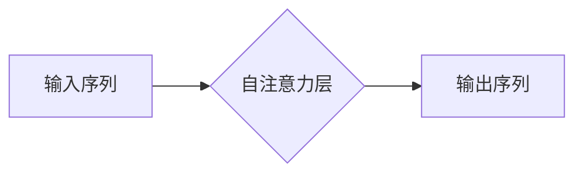
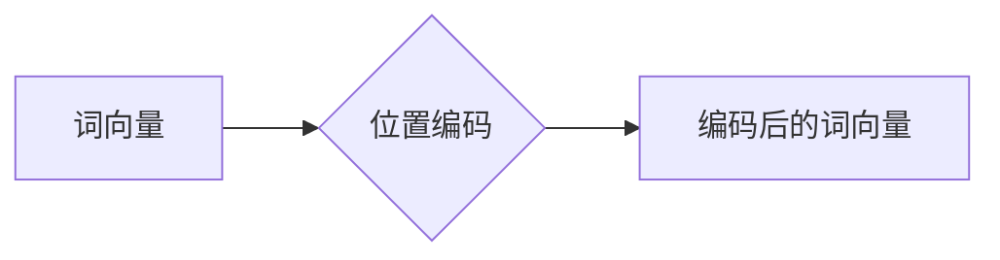
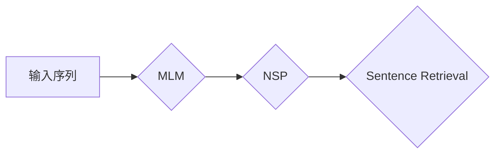
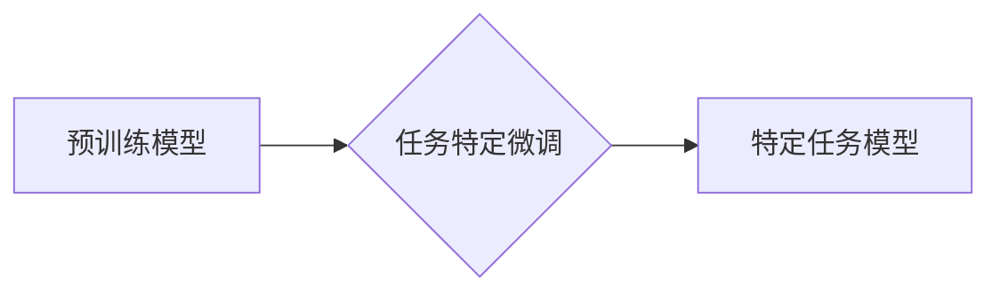

> 关键词：Transformer, 预训练, 大模型, 自监督学习, NLP, 语义理解, 任务特定微调, 应用实践

# Transformer大模型实战 预训练策略

Transformer作为自然语言处理(NLP)领域的革命性模型，自2017年提出以来，就以其出色的性能和效率赢得了广泛的关注。随着模型规模的不断增大，大模型在NLP任务中展现出了强大的语义理解和生成能力。本文将深入探讨Transformer大模型的预训练策略，从核心概念到实际应用，为你呈现一场关于大模型预训练的实战之旅。

## 1. 背景介绍

### 1.1 问题的由来

在Transformer模型出现之前，NLP领域广泛使用循环神经网络(RNN)和卷积神经网络(CNN)等传统神经网络模型。然而，这些模型在处理长距离依赖和序列建模时存在局限性。Transformer模型通过自注意力机制克服了RNN的弱点，实现了并行计算，使得模型在NLP任务中取得了显著的性能提升。

### 1.2 研究现状

随着计算资源的提升和大数据的发展，大模型成为了NLP领域的研究热点。大模型在预训练阶段通过海量无标签语料学习到了丰富的语言知识和结构化信息，为下游任务提供了强大的基础。目前，预训练策略主要包括自监督学习和任务特定微调两大类。

### 1.3 研究意义

预训练策略对于大模型的性能和泛化能力至关重要。有效的预训练策略可以使得模型在下游任务中取得更好的效果，降低对标注数据的依赖，提高模型的可解释性和鲁棒性。

### 1.4 本文结构

本文将分为以下几个部分：
- 介绍大模型预训练的核心概念与联系。
- 阐述大模型预训练的算法原理和具体操作步骤。
- 深入讲解预训练中的数学模型和公式。
- 通过代码实例展示预训练策略的实际应用。
- 探讨大模型预训练的实际应用场景和未来发展趋势。
- 总结研究成果，展望未来研究方向。

## 2. 核心概念与联系

### 2.1 自注意力机制

自注意力机制是Transformer模型的核心，它能够使模型关注到输入序列中的不同位置，从而实现全局的序列建模。



### 2.2 位置编码

由于Transformer模型是自回归的，它无法直接处理序列的顺序信息。位置编码为每个词添加了位置信息，使得模型能够理解词序。



### 2.3 预训练任务

预训练任务是大模型预训练的关键，它决定了模型在学习过程中的关注点。

- **掩码语言模型(Masked Language Model, MLM)**：随机掩盖输入序列中的部分词，让模型预测这些被掩盖的词。
- **下一句预测(Next Sentence Prediction, NSP)**：预测两个连续的句子中哪一个是下一句。
- **句子排序(Sentence Retrieval)**：根据语义相似度对句子进行排序。



### 2.4 任务特定微调

任务特定微调是在预训练的基础上，针对特定任务进行微调，使模型在下游任务上获得更好的性能。



## 3. 核心算法原理 & 具体操作步骤

### 3.1 算法原理概述

大模型预训练的核心思想是利用海量无标签语料学习语言知识和结构化信息，为下游任务提供基础。预训练任务和任务特定微调是预训练的两个主要阶段。

### 3.2 算法步骤详解

#### 预训练阶段

1. **数据准备**：收集海量无标签语料，如维基百科、新闻文章、社交媒体数据等。
2. **模型构建**：构建Transformer模型，包括编码器和解码器。
3. **预训练任务**：选择合适的预训练任务，如MLM、NSP或Sentence Retrieval。
4. **训练**：在无标签语料上进行预训练，优化模型参数。

#### 任务特定微调阶段

1. **数据准备**：收集特定任务的有标签数据。
2. **模型调整**：根据任务需求调整模型结构，如添加特定层或调整层参数。
3. **微调**：在特定任务数据上微调模型参数。
4. **评估**：在测试集上评估模型性能。

### 3.3 算法优缺点

#### 优点

- **强大的语义理解能力**：预训练阶段学习到的语言知识和结构化信息，使模型在下游任务中具备更强的语义理解能力。
- **减少标注数据需求**：预训练阶段的无标签语料可以大大减少下游任务对标注数据的依赖。
- **提高模型泛化能力**：预训练模型在多种下游任务上表现出良好的泛化能力。

#### 缺点

- **计算资源需求大**：大模型预训练需要大量的计算资源和存储空间。
- **数据质量问题**：预训练阶段使用的无标签语料可能存在质量问题，影响模型性能。
- **模型可解释性差**：大模型的内部工作机制复杂，可解释性较差。

### 3.4 算法应用领域

大模型预训练在NLP领域有着广泛的应用，包括：

- **文本分类**：如情感分析、主题分类、新闻分类等。
- **命名实体识别**：如人名、地名、机构名等实体的识别。
- **关系抽取**：抽取文本中实体之间的关系。
- **机器翻译**：将一种语言的文本翻译成另一种语言。
- **文本摘要**：将长文本压缩成简短的摘要。

## 4. 数学模型和公式 & 详细讲解 & 举例说明

### 4.1 数学模型构建

Transformer模型的核心是多头自注意力机制，它可以通过以下公式进行计算：

$$
\text{Attention}(Q, K, V) = \text{softmax}\left(\frac{QK^T}{\sqrt{d_k}}\right) \times V
$$

其中，$Q, K, V$ 分别是查询、键和值向量，$d_k$ 是注意力层的维度。

### 4.2 公式推导过程

自注意力机制的推导过程如下：

1. **计算查询-键相似度**：对于输入序列中的每个词，计算它与所有词的相似度。
2. **应用softmax函数**：对相似度进行归一化，得到概率分布。
3. **加权求和**：根据概率分布，将所有词的值向量加权求和，得到最终输出。

### 4.3 案例分析与讲解

以下是一个简单的MLM任务示例：

输入序列：`[the, cat, sat, on, the, mat]`

掩盖词：`[the, sat]`

计算掩盖词的概率分布：

$$
P(\text{the}|\text{the, cat, sat, on, the, mat}) = \frac{e^{Q_{\text{the}}K_{\text{the}}^T}}{\sum_{k \in \text{词汇表}} e^{Q_{\text{the}}K_{\text{k}}^T}}
$$

$$
P(\text{sat}|\text{the, cat, sat, on, the, mat}) = \frac{e^{Q_{\text{sat}}K_{\text{sat}}^T}}{\sum_{k \in \text{词汇表}} e^{Q_{\text{sat}}K_{\text{k}}^T}}
$$

通过模型预测掩盖词，然后根据概率分布选择最有可能的词作为预测结果。

## 5. 项目实践：代码实例和详细解释说明

### 5.1 开发环境搭建

为了进行Transformer大模型预训练，需要以下开发环境：

- Python 3.6+
- PyTorch 1.7+
- Transformers库

### 5.2 源代码详细实现

以下是一个简单的预训练代码示例：

```python
from transformers import BertTokenizer, BertModel
import torch

# 加载预训练模型和分词器
tokenizer = BertTokenizer.from_pretrained('bert-base-uncased')
model = BertModel.from_pretrained('bert-base-uncased')

# 输入序列
input_ids = tokenizer("The cat sat on the mat", return_tensors='pt')

# 前向传播
outputs = model(input_ids)

# 输出结果
print(outputs.last_hidden_state)
```

### 5.3 代码解读与分析

以上代码加载了一个预训练的BERT模型和分词器，然后对输入序列进行编码，并通过模型进行前向传播，得到编码后的词向量。

### 5.4 运行结果展示

运行上述代码后，会输出编码后的词向量，这些词向量包含了丰富的语义信息，可以作为下游任务的特征输入。

## 6. 实际应用场景

### 6.1 文本分类

预训练的Transformer模型在文本分类任务中表现出色。以下是一个使用BERT进行情感分析任务的示例：

```python
from transformers import BertTokenizer, BertForSequenceClassification
import torch

# 加载预训练模型和分词器
tokenizer = BertTokenizer.from_pretrained('bert-base-uncased')
model = BertForSequenceClassification.from_pretrained('bert-base-uncased')

# 输入序列
input_ids = tokenizer("I love this product!", return_tensors='pt')

# 前向传播
outputs = model(input_ids)

# 输出结果
print(outputs.logits)
```

### 6.2 命名实体识别

预训练的Transformer模型在命名实体识别任务中也具有很好的性能。以下是一个使用BERT进行命名实体识别任务的示例：

```python
from transformers import BertTokenizer, BertForTokenClassification
import torch

# 加载预训练模型和分词器
tokenizer = BertTokenizer.from_pretrained('bert-base-uncased')
model = BertForTokenClassification.from_pretrained('bert-base-uncased')

# 输入序列
input_ids = tokenizer("Apple is looking at buying U.K. startup for $1 billion", return_tensors='pt')

# 前向传播
outputs = model(input_ids)

# 输出结果
print(outputs.logits)
```

## 7. 工具和资源推荐

### 7.1 学习资源推荐

- 《Transformer: Attention is All You Need》
- 《BERT: Pre-training of Deep Bidirectional Transformers for Language Understanding》
- 《Transformers: State-of-the-Art Natural Language Processing with Self-Attention》

### 7.2 开发工具推荐

- PyTorch
- Transformers库
- Hugging Face Model Hub

### 7.3 相关论文推荐

- `BERT: Pre-training of Deep Bidirectional Transformers for Language Understanding`
- `Transformers: State-of-the-Art Natural Language Processing with Self-Attention`
- ` Generative Pre-trained Transformers`

## 8. 总结：未来发展趋势与挑战

### 8.1 研究成果总结

本文介绍了Transformer大模型的预训练策略，从核心概念到实际应用，为你呈现了一场关于大模型预训练的实战之旅。通过学习本文，你将了解到预训练任务、自注意力机制、位置编码等关键概念，并掌握大模型预训练的基本步骤。

### 8.2 未来发展趋势

- **更强大的模型**：随着计算资源的提升，大模型将越来越强大，能够处理更复杂的任务。
- **更丰富的预训练任务**：将出现更多新颖的预训练任务，以更好地学习语言知识和结构化信息。
- **更高效的训练方法**：开发更高效的训练方法，降低预训练成本。

### 8.3 面临的挑战

- **计算资源瓶颈**：大模型预训练需要大量的计算资源，如何降低预训练成本是一个挑战。
- **数据质量问题**：预训练数据的质量直接影响模型性能，如何提高数据质量是一个挑战。
- **模型可解释性**：大模型的内部工作机制复杂，如何提高模型可解释性是一个挑战。

### 8.4 研究展望

大模型预训练是NLP领域的前沿方向，未来将在以下几个方面取得突破：

- **更高效的数据增强方法**：通过数据增强技术，提高数据质量和多样性。
- **更有效的模型结构**：设计更高效的模型结构，提高模型性能和可解释性。
- **更智能的预训练任务**：开发更智能的预训练任务，更好地学习语言知识和结构化信息。

相信随着研究的不断深入，大模型预训练将为NLP领域带来更多的创新和突破。

## 9. 附录：常见问题与解答

**Q1：什么是预训练？**

A：预训练是指在大规模无标签语料上训练模型，使其学习到丰富的语言知识和结构化信息，为下游任务提供基础。

**Q2：什么是自注意力机制？**

A：自注意力机制是Transformer模型的核心，它能够使模型关注到输入序列中的不同位置，从而实现全局的序列建模。

**Q3：什么是位置编码？**

A：位置编码为每个词添加了位置信息，使得模型能够理解词序。

**Q4：预训练有哪些任务？**

A：预训练任务包括掩码语言模型(MLM)、下一句预测(NSP)和句子排序(Sentence Retrieval)等。

**Q5：如何进行任务特定微调？**

A：任务特定微调是在预训练的基础上，针对特定任务进行微调，使模型在下游任务上获得更好的性能。

**Q6：大模型预训练有哪些挑战？**

A：大模型预训练面临的挑战包括计算资源瓶颈、数据质量问题和模型可解释性等。

**Q7：大模型预训练有哪些应用场景？**

A：大模型预训练在文本分类、命名实体识别、关系抽取、机器翻译和文本摘要等NLP任务中具有广泛的应用。

作者：禅与计算机程序设计艺术 / Zen and the Art of Computer Programming