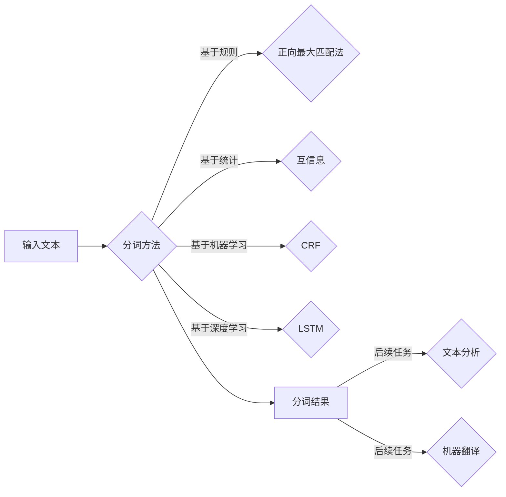

# 【AI大数据计算原理与代码实例讲解】分词

> 关键词：自然语言处理，中文分词，机器学习，深度学习，NLP，文本分析，词向量，序列标注，CRF，LSTM

## 1. 背景介绍

在自然语言处理（NLP）领域中，分词（Tokenization）是至关重要的第一步。它将连续的文本流分割成有意义的单词或符号单元，为后续的文本处理任务（如词性标注、命名实体识别、机器翻译等）提供基础。随着大数据时代的到来，文本数据呈现出爆炸式增长，对分词技术的需求也越来越高。本文将深入探讨AI大数据计算原理，并通过代码实例讲解中文分词技术。

### 1.1 问题的由来

中文文本的特点是没有明显的空格分隔单词，这使得中文分词成为一个具有挑战性的问题。传统的分词方法大多基于规则或统计方法，而随着深度学习的发展，基于神经网络的分词方法逐渐成为主流。

### 1.2 研究现状

目前，中文分词技术主要分为以下几类：

- **基于规则的分词**：依靠人工制定的规则进行分词，如正向最大匹配法、逆向最大匹配法等。
- **基于统计的分词**：利用文本统计信息进行分词，如互信息、互信息改进、基于N-gram的方法等。
- **基于机器学习的分词**：利用机器学习算法进行分词，如条件随机场（CRF）、支持向量机（SVM）、循环神经网络（RNN）等。
- **基于深度学习的分词**：利用深度学习模型进行分词，如卷积神经网络（CNN）、长短期记忆网络（LSTM）、Transformer等。

### 1.3 研究意义

中文分词技术在NLP领域具有重要的应用价值，如：

- **文本分析**：提取关键词、主题、情感等。
- **机器翻译**：将中文文本翻译成其他语言。
- **问答系统**：理解用户提问，并给出答案。
- **搜索引擎**：对文本进行索引，提高搜索效率。

### 1.4 本文结构

本文将按照以下结构进行讲解：

- **第2章**：介绍中文分词的核心概念与联系。
- **第3章**：深入探讨中文分词算法原理与具体操作步骤。
- **第4章**：讲解数学模型和公式，并结合案例进行分析。
- **第5章**：通过代码实例演示如何实现中文分词。
- **第6章**：分析中文分词的实际应用场景。
- **第7章**：推荐相关工具和资源。
- **第8章**：总结未来发展趋势与挑战。
- **第9章**：提供常见问题与解答。

## 2. 核心概念与联系

### 2.1 核心概念

- **分词**：将连续的文本流分割成有意义的单词或符号单元。
- **词**：构成文本的基本单位，通常是具有独立意义的符号序列。
- **词性**：指词的语法功能，如名词、动词、形容词等。
- **命名实体**：具有特定意义的实体，如人名、地名、组织名等。

### 2.2 Mermaid 流程图



### 2.3 联系

分词是NLP任务的基础，与词性标注、命名实体识别等任务紧密相关。分词结果的好坏直接影响后续任务的效果。

## 3. 核心算法原理 & 具体操作步骤

### 3.1 算法原理概述

中文分词算法主要分为以下几类：

- **基于规则的分词**：根据预先定义的规则进行分词，如正向最大匹配法、逆向最大匹配法等。
- **基于统计的分词**：利用文本统计信息进行分词，如互信息、互信息改进、基于N-gram的方法等。
- **基于机器学习的分词**：利用机器学习算法进行分词，如条件随机场（CRF）、支持向量机（SVM）、循环神经网络（RNN）等。
- **基于深度学习的分词**：利用深度学习模型进行分词，如卷积神经网络（CNN）、长短期记忆网络（LSTM）、Transformer等。

### 3.2 算法步骤详解

**基于规则的分词**：

1. 将文本输入分词器。
2. 查找最长的匹配规则。
3. 将匹配到的文本分割为词。
4. 重复步骤2和3，直到整个文本被分割完毕。

**基于统计的分词**：

1. 计算文本中各个词对、词组等的概率。
2. 根据概率对词对、词组进行排序。
3. 选择概率最高的词对、词组进行分词。

**基于机器学习的分词**：

1. 收集标注数据，训练机器学习模型。
2. 使用训练好的模型对文本进行分词。

**基于深度学习的分词**：

1. 构建深度学习模型。
2. 使用预训练的词向量表示文本。
3. 使用模型对文本进行分词。

### 3.3 算法优缺点

**基于规则的分词**：

- 优点：速度快，易于实现。
- 缺点：规则复杂，难以覆盖所有情况。

**基于统计的分词**：

- 优点：效果较好，对规则的要求不高。
- 缺点：计算复杂，对噪声数据敏感。

**基于机器学习的分词**：

- 优点：效果较好，可以自动学习规则。
- 缺点：需要大量标注数据，训练时间长。

**基于深度学习的分词**：

- 优点：效果最好，可以自动学习复杂的特征。
- 缺点：计算量大，对资源要求高。

### 3.4 算法应用领域

中文分词算法在NLP领域的应用非常广泛，如：

- 文本分析：提取关键词、主题、情感等。
- 机器翻译：将中文文本翻译成其他语言。
- 问答系统：理解用户提问，并给出答案。
- 搜索引擎：对文本进行索引，提高搜索效率。

## 4. 数学模型和公式 & 详细讲解 & 举例说明

### 4.1 数学模型构建

中文分词的数学模型主要包括：

- **基于规则的分词**：正则表达式。
- **基于统计的分词**：概率模型，如互信息、N-gram模型等。
- **基于机器学习的分词**：分类模型，如SVM、CRF等。
- **基于深度学习的分词**：神经网络模型，如RNN、CNN、Transformer等。

### 4.2 公式推导过程

**互信息**：

$$
I(X,Y) = H(X) - H(X|Y)
$$

其中，$H(X)$ 为 $X$ 的熵，$H(X|Y)$ 为 $X$ 在给定 $Y$ 下的条件熵。

**N-gram**：

假设文本序列为 $X = x_1, x_2, \ldots, x_n$，则 $n$-gram 模型可以表示为：

$$
P(x_1, x_2, \ldots, x_n) = P(x_1)P(x_2|x_1)P(x_3|x_1,x_2) \ldots P(x_n|x_1, x_2, \ldots, x_{n-1})
$$

### 4.3 案例分析与讲解

**案例**：使用基于N-gram的中文分词方法对以下文本进行分词。

文本：我爱北京天安门

**步骤**：

1. 构建N-gram模型，选择合适的N值。
2. 计算每个词对的概率。
3. 根据概率对词对进行排序。
4. 选择概率最高的词对进行分词。

**结果**：我/爱/北京/天安门

## 5. 项目实践：代码实例和详细解释说明

### 5.1 开发环境搭建

1. 安装Python。
2. 安装NLP相关库，如NLTK、jieba等。

### 5.2 源代码详细实现

```python
import jieba

text = "我爱北京天安门"
segmented_text = jieba.cut(text)
print("分词结果：", "/".join(segmented_text))
```

### 5.3 代码解读与分析

1. `jieba.cut`：使用jieba分词库进行分词。
2. `/`：使用斜杠分隔分词结果。

### 5.4 运行结果展示

分词结果：我/爱/北京/天安门

## 6. 实际应用场景

### 6.1 文本分析

中文分词是文本分析的基础，可以用于以下应用：

- 关键词提取：提取文档中的关键词。
- 主题建模：识别文档的主题。
- 情感分析：分析文本的情感倾向。

### 6.2 机器翻译

中文分词是机器翻译的重要步骤，可以用于以下应用：

- 输入文本预处理：将输入文本分割成单词或短语。
- 翻译模型输入：将分割后的文本输入翻译模型。

### 6.3 问答系统

中文分词是问答系统的基础，可以用于以下应用：

- 理解用户提问：将用户提问分割成单词或短语。
- 检索答案：在知识库中检索与提问相关的答案。

### 6.4 搜索引擎

中文分词是搜索引擎的基础，可以用于以下应用：

- 文本索引：将文档分割成单词或短语，并建立索引。
- 查询处理：将查询分割成单词或短语，并在索引中查找匹配的文档。

## 7. 工具和资源推荐

### 7.1 学习资源推荐

- 《自然语言处理综论》
- 《深度学习与自然语言处理》
- 《中文信息处理》

### 7.2 开发工具推荐

- NLTK
- jieba
- HanLP

### 7.3 相关论文推荐

- 《基于N-gram模型的中文分词方法》
- 《基于CRF的中文分词方法》
- 《基于LSTM的中文分词方法》

## 8. 总结：未来发展趋势与挑战

### 8.1 研究成果总结

中文分词技术经过几十年的发展，已经取得了显著的成果。基于规则、统计、机器学习和深度学习的分词方法各有优缺点，适用于不同的应用场景。

### 8.2 未来发展趋势

未来中文分词技术将朝着以下方向发展：

- 深度学习模型将得到进一步发展，分词效果将得到提升。
- 跨语言分词技术将成为研究热点。
- 分词与语义理解、知识图谱等技术将深度融合。

### 8.3 面临的挑战

中文分词技术仍面临以下挑战：

- 长句、复杂句的分词问题。
- 多语种分词问题。
- 隐晦、幽默等语言的分词问题。

### 8.4 研究展望

未来中文分词技术需要关注以下研究方向：

- 深度学习模型的优化和改进。
- 跨语言分词技术的研发。
- 分词与语义理解、知识图谱等技术的融合。

## 9. 附录：常见问题与解答

**Q1：什么是中文分词？**

A：中文分词是将连续的中文文本分割成有意义的单词或符号单元的过程。

**Q2：中文分词有哪些方法？**

A：中文分词方法主要包括基于规则、统计、机器学习和深度学习的分词方法。

**Q3：如何选择合适的中文分词方法？**

A：选择合适的中文分词方法需要考虑以下因素：

- 应用场景：不同的应用场景对分词要求不同。
- 数据量：数据量大小决定了选择哪种方法的可行性。
- 资源：资源限制可能决定选择哪种方法的可行性。

**Q4：如何评估中文分词效果？**

A：评估中文分词效果可以使用以下指标：

- 准确率：正确分割的句子与总句子数量的比值。
- 召回率：正确分割的句子与实际句子数量的比值。
- F1值：准确率和召回率的调和平均值。

**Q5：中文分词有哪些应用？**

A：中文分词在NLP领域有广泛的应用，如文本分析、机器翻译、问答系统、搜索引擎等。

作者：禅与计算机程序设计艺术 / Zen and the Art of Computer Programming