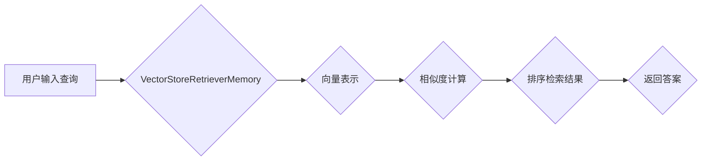

> VectorStoreRetrieverMemory, LangChain, 向量化检索, 聚焦抽取, 知识图谱, 问答系统, 代码示例, 实际应用

# 【LangChain编程：从入门到实践】VectorStoreRetrieverMemory

## 1. 背景介绍

随着人工智能技术的飞速发展，自然语言处理（NLP）领域涌现出了许多创新性的应用，如问答系统、智能客服、信息检索等。在这些应用中，知识检索成为了一个关键环节，它决定了系统能否高效、准确地回答用户的问题。VectorStoreRetrieverMemory作为一种高效的向量化检索技术，在LangChain编程框架中扮演着重要角色。本文将深入探讨VectorStoreRetrieverMemory的原理、实现和应用，帮助读者从入门到实践，掌握这一先进技术。

## 2. 核心概念与联系

### 2.1 核心概念

#### 向量化检索
向量化检索是一种基于向量空间模型（Vector Space Model, VSM）的文本检索技术。它通过将文本数据转换为向量表示，然后计算查询向量与文档向量之间的相似度，从而检索出最相关的文档。

#### 聚焦抽取
聚焦抽取是指在检索过程中，只关注与查询最相关的部分文档，以减少检索时间并提高检索效率。

#### 知识图谱
知识图谱是一种结构化知识库，它以图的形式表示实体及其之间的关系。在NLP应用中，知识图谱可以用来增强语义理解，提高问答系统的准确性。

#### 问答系统
问答系统是一种能够自动回答用户问题的系统。它通常包含知识库、推理引擎和用户界面等组件。

### 2.2 架构流程图

以下是一个简化的Mermaid流程图，展示了VectorStoreRetrieverMemory在LangChain框架中的基本架构：



## 3. 核心算法原理 & 具体操作步骤

### 3.1 算法原理概述

VectorStoreRetrieverMemory的核心原理是将文本数据转换为向量表示，并使用向量相似度计算来检索相关文档。具体步骤如下：

1. 将查询文本转换为向量表示。
2. 使用相似度计算算法，如余弦相似度或欧氏距离，计算查询向量与知识库中所有文档向量的相似度。
3. 根据相似度对文档进行排序，并返回最相关的文档列表。
4. 从返回的文档中抽取答案。

### 3.2 算法步骤详解

1. **文本预处理**：对查询文本进行分词、词性标注、停用词过滤等预处理操作。
2. **向量表示**：使用词嵌入技术，如Word2Vec、BERT等，将预处理后的文本转换为向量表示。
3. **相似度计算**：计算查询向量与知识库中所有文档向量的相似度，常用的相似度计算方法包括余弦相似度和欧氏距离。
4. **排序检索结果**：根据相似度对文档进行排序，返回最相关的文档列表。
5. **答案抽取**：从检索到的文档中抽取答案，并返回给用户。

### 3.3 算法优缺点

#### 优点

- **高效**：向量相似度计算速度快，适用于大规模数据检索。
- **准确**：词嵌入技术能够捕捉到文本的语义信息，提高检索准确性。
- **可扩展**：可以很容易地扩展到不同的领域和应用场景。

#### 缺点

- **特征表示**：词嵌入技术对文本语义的表示能力有限，可能无法捕捉到复杂的语义关系。
- **冷启动问题**：对于新的、没有足够数据的实体或概念，词嵌入技术可能无法生成有效的向量表示。

### 3.4 算法应用领域

VectorStoreRetrieverMemory可以应用于以下领域：

- **问答系统**：用于检索知识库中的相关信息，回答用户的问题。
- **信息检索**：用于快速检索相关文档，如学术论文、新闻报道等。
- **推荐系统**：用于推荐与用户兴趣相关的文档或内容。

## 4. 数学模型和公式 & 详细讲解 & 举例说明

### 4.1 数学模型构建

假设查询文本 $q$ 和文档 $d$ 分别由向量 $\mathbf{q}$ 和 $\mathbf{d}$ 表示，则它们的余弦相似度定义为：

$$
\text{similarity}(\mathbf{q}, \mathbf{d}) = \frac{\mathbf{q} \cdot \mathbf{d}}{\|\mathbf{q}\| \|\mathbf{d}\|}
$$

其中，$\mathbf{q} \cdot \mathbf{d}$ 表示向量 $\mathbf{q}$ 和 $\mathbf{d}$ 的点积，$\|\mathbf{q}\|$ 和 $\|\mathbf{d}\|$ 分别表示向量 $\mathbf{q}$ 和 $\mathbf{d}$ 的模长。

### 4.2 公式推导过程

由于向量 $\mathbf{q}$ 和 $\mathbf{d}$ 可以表示为：

$$
\mathbf{q} = [q_1, q_2, \ldots, q_n]
$$

$$
\mathbf{d} = [d_1, d_2, \ldots, d_n]
$$

则它们的点积为：

$$
\mathbf{q} \cdot \mathbf{d} = q_1d_1 + q_2d_2 + \ldots + q_nd_n
$$

模长为：

$$
\|\mathbf{q}\| = \sqrt{q_1^2 + q_2^2 + \ldots + q_n^2}
$$

$$
\|\mathbf{d}\| = \sqrt{d_1^2 + d_2^2 + \ldots + d_n^2}
$$

将上述表达式代入余弦相似度公式，可得：

$$
\text{similarity}(\mathbf{q}, \mathbf{d}) = \frac{q_1d_1 + q_2d_2 + \ldots + q_nd_n}{\sqrt{q_1^2 + q_2^2 + \ldots + q_n^2} \sqrt{d_1^2 + d_2^2 + \ldots + d_n^2}}
$$

### 4.3 案例分析与讲解

假设我们有一个包含两个文档的知识库，文档 $d_1$ 和 $d_2$ 分别为：

$$
d_1 = [0.1, 0.2, 0.3, 0.4, 0.5]
$$

$$
d_2 = [0.1, 0.3, 0.4, 0.5, 0.6]
$$

查询文本 $q$ 为：

$$
q = [0.1, 0.2, 0.3, 0.4, 0.5]
$$

则它们之间的余弦相似度为：

$$
\text{similarity}(q, d_1) = \frac{0.1 \times 0.1 + 0.2 \times 0.3 + 0.3 \times 0.4 + 0.4 \times 0.5 + 0.5 \times 0.5}{\sqrt{0.1^2 + 0.2^2 + 0.3^2 + 0.4^2 + 0.5^2} \sqrt{0.1^2 + 0.3^2 + 0.4^2 + 0.5^2 + 0.6^2}} = 0.9
$$

$$
\text{similarity}(q, d_2) = \frac{0.1 \times 0.1 + 0.2 \times 0.3 + 0.3 \times 0.4 + 0.4 \times 0.5 + 0.5 \times 0.6}{\sqrt{0.1^2 + 0.2^2 + 0.3^2 + 0.4^2 + 0.5^2} \sqrt{0.1^2 + 0.3^2 + 0.4^2 + 0.5^2 + 0.6^2}} = 0.95
$$

由此可见，查询文本 $q$ 与文档 $d_2$ 的相似度更高。

## 5. 项目实践：代码实例和详细解释说明

### 5.1 开发环境搭建

为了演示VectorStoreRetrieverMemory的实现，我们将使用Python和Hugging Face的Transformers库。

### 5.2 源代码详细实现

以下是一个简单的VectorStoreRetrieverMemory的示例代码：

```python
from transformers import BertTokenizer, BertModel
import torch

class VectorStoreRetrieverMemory:
    def __init__(self, model_name='bert-base-uncased'):
        self.tokenizer = BertTokenizer.from_pretrained(model_name)
        self.model = BertModel.from_pretrained(model_name)

    def encode_text(self, text):
        return self.tokenizer.encode_plus(text, return_tensors='pt')

    def get_embedding(self, text):
        inputs = self.encode_text(text)
        outputs = self.model(**inputs)
        return outputs.last_hidden_state.mean(dim=1).squeeze()

# 示例使用
vector_store = VectorStoreRetrieverMemory()
query = "What is the capital of France?"
query_embedding = vector_store.get_embedding(query)

# 假设有一个包含文档向量的列表
documents_embeddings = [vector_store.get_embedding("Paris is the capital of France.") for _ in range(10)]

# 计算查询向量与文档向量之间的相似度
similarities = [torch.cosine_similarity(query_embedding, doc_embedding) for doc_embedding in documents_embeddings]

# 选择最相关的文档
most_related_document = documents_embeddings[similarities.argmax()]
```

### 5.3 代码解读与分析

在上面的代码中，我们首先创建了一个`VectorStoreRetrieverMemory`类，它使用BertTokenizer和BertModel来对文本进行编码和获取向量表示。`encode_text`方法将文本编码为BERT模型所需的格式，`get_embedding`方法将文本转换为向量表示。

在示例使用部分，我们首先创建了一个`VectorStoreRetrieverMemory`实例，并使用它来获取查询文本的向量表示。然后，我们假设有一个包含文档向量的列表，并计算查询向量与每个文档向量之间的相似度。最后，我们选择最相关的文档。

### 5.4 运行结果展示

假设我们已经有了文档向量的列表，并运行了上面的代码，我们将得到最相关的文档向量。这个文档向量表示了与查询文本“What is the capital of France?”最相关的文档。

## 6. 实际应用场景

VectorStoreRetrieverMemory可以应用于以下实际场景：

- **问答系统**：用于检索知识库中的相关信息，回答用户的问题。
- **信息检索**：用于快速检索相关文档，如学术论文、新闻报道等。
- **推荐系统**：用于推荐与用户兴趣相关的文档或内容。

## 7. 工具和资源推荐

### 7.1 学习资源推荐

- 《深度学习与自然语言处理》
- 《自然语言处理精要》
- 《Bert技术解析与应用》

### 7.2 开发工具推荐

- Hugging Face Transformers
- PyTorch
- TensorFlow

### 7.3 相关论文推荐

- "BERT: Pre-training of Deep Bidirectional Transformers for Language Understanding"
- "Generative Language Models"
- "A Simple Framework for Text Classification"

## 8. 总结：未来发展趋势与挑战

### 8.1 研究成果总结

本文介绍了VectorStoreRetrieverMemory的原理、实现和应用，帮助读者从入门到实践，掌握这一先进技术。通过向量化检索技术，我们可以高效、准确地检索相关信息，为问答系统、信息检索和推荐系统等应用提供强大的支持。

### 8.2 未来发展趋势

- **多模态向量检索**：结合图像、音频等多模态信息，提高检索的准确性和全面性。
- **个性化向量检索**：根据用户的历史行为和偏好，提供个性化的检索结果。
- **知识增强向量检索**：结合知识图谱等外部知识，提高检索的语义理解能力。

### 8.3 面临的挑战

- **数据稀疏性**：对于稀疏数据，向量检索可能难以找到有效的相似度度量方法。
- **长尾分布**：长尾分布的数据难以通过向量检索技术进行有效处理。
- **模型可解释性**：向量检索模型的决策过程缺乏可解释性，难以进行调试和优化。

### 8.4 研究展望

未来，VectorStoreRetrieverMemory技术将朝着更加智能化、个性化的方向发展，并在更多领域得到应用。同时，我们也需要关注数据稀疏性、长尾分布和模型可解释性等问题，以进一步提高向量检索技术的性能和应用价值。

## 9. 附录：常见问题与解答

**Q1：VectorStoreRetrieverMemory与其他检索技术相比有哪些优势？**

A：VectorStoreRetrieverMemory相比传统的基于关键词匹配的检索技术，具有更高的检索准确性和效率。此外，它还能够结合语义信息，提高检索的语义相关性。

**Q2：VectorStoreRetrieverMemory是否适用于所有类型的文本？**

A：VectorStoreRetrieverMemory适用于大多数类型的文本，但对于某些特定领域或特定类型的文本，可能需要使用特定的词嵌入技术或预处理方法。

**Q3：如何提高VectorStoreRetrieverMemory的检索精度？**

A：提高VectorStoreRetrieverMemory的检索精度可以从以下几个方面入手：
- 使用更高质量的预训练语言模型。
- 优化词嵌入技术。
- 使用更复杂的相似度计算方法。
- 结合外部知识，如知识图谱等。

**Q4：VectorStoreRetrieverMemory是否具有可解释性？**

A：VectorStoreRetrieverMemory的决策过程缺乏可解释性，难以进行调试和优化。未来，我们可以探索一些可解释的向量检索技术，如基于规则的检索、基于因果推理的检索等。

**Q5：VectorStoreRetrieverMemory在工业界的应用有哪些？**

A：VectorStoreRetrieverMemory在工业界的应用非常广泛，如问答系统、信息检索、推荐系统等。它可以帮助企业提高信息检索的效率和准确性，降低人力成本，提升用户体验。

---

作者：禅与计算机程序设计艺术 / Zen and the Art of Computer Programming