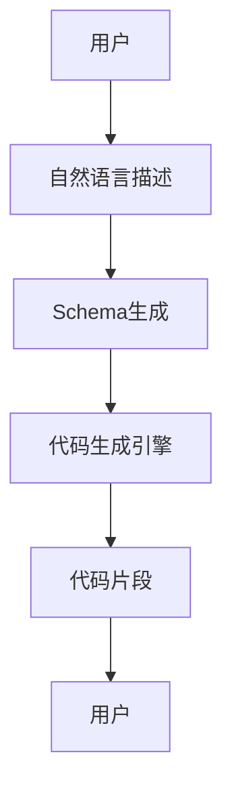

# 【LangChain编程：从入门到实践】schema

> 关键词：LangChain, 自动编程，编程范式，代码生成，自然语言处理，schema，prompt，人工智能

## 1. 背景介绍

随着人工智能技术的飞速发展，自然语言处理（NLP）领域取得了显著的突破。近年来，基于NLP的代码生成技术逐渐崭露头角，其中LangChain作为一种新的编程范式，因其强大的可解释性和易用性而备受关注。LangChain的核心思想是通过自然语言描述编程任务，然后利用人工智能技术自动生成相应的代码。本文将深入探讨LangChain编程的原理、实践方法及其应用前景。

### 1.1 问题的由来

传统的编程模式需要开发者具备深厚的编程功底和领域知识，对于非专业人士而言，编写代码往往是一个充满挑战的过程。而随着NLP技术的进步，人们希望能够利用自然语言来描述编程任务，从而实现编程的自动化。LangChain应运而生，它通过将编程任务转化为可理解的schema，并利用人工智能技术自动生成代码，为编程带来了全新的可能性。

### 1.2 研究现状

LangChain的研究尚处于起步阶段，但其发展速度非常快。目前，已有多个LangChain的实现，如GitHub Copilot、DeepTabular等。这些工具通过分析大量的代码库和自然语言描述，能够生成与任务描述高度匹配的代码片段。

### 1.3 研究意义

LangChain编程具有以下重要意义：

- 降低编程门槛：非专业人士也能通过自然语言描述编程任务，实现编程自动化。
- 提高开发效率：开发者可以专注于业务逻辑，而非繁琐的代码编写。
- 促进跨领域交流：LangChain可以帮助不同领域的人才进行跨领域协作。
- 推动人工智能技术发展：LangChain的应用将推动NLP和编程领域的技术创新。

### 1.4 本文结构

本文将围绕LangChain编程的核心概念、原理、实践方法和应用场景展开，具体结构如下：

- 第2部分：介绍LangChain的核心概念和与之相关联的技术。
- 第3部分：详细阐述LangChain的算法原理和具体操作步骤。
- 第4部分：讲解LangChain中的schema设计，并分析其应用。
- 第5部分：通过实际案例展示LangChain在代码生成中的实践应用。
- 第6部分：探讨LangChain在各个领域的应用场景和未来发展趋势。
- 第7部分：推荐LangChain相关的学习资源、开发工具和论文。
- 第8部分：总结LangChain编程的特点、挑战和发展趋势。

## 2. 核心概念与联系

### 2.1 核心概念

- **LangChain**：一种基于NLP的编程范式，通过自然语言描述编程任务，自动生成代码。
- **schema**：用于描述编程任务的数据结构，包含输入、输出、执行流程等信息。
- **prompt**：用于指导LangChain执行任务的文本输入，通常包含任务描述和schema。
- **代码生成**：根据schema和prompt，生成满足特定需求的代码片段。

### 2.2 架构流程图

以下是用Mermaid语言绘制的LangChain编程的架构流程图：



- A: 用户通过自然语言描述编程任务。
- B: 将自然语言描述转换为schema。
- C: 代码生成引擎根据schema生成代码片段。
- D: 用户得到代码片段并使用。

## 3. 核心算法原理 & 具体操作步骤

### 3.1 算法原理概述

LangChain编程的核心在于将自然语言描述转化为可执行的代码。具体而言，其原理如下：

1. **自然语言理解**：使用NLP技术将用户的自然语言描述转换为计算机可理解的格式。
2. **schema构建**：根据自然语言描述构建schema，定义任务的输入、输出和执行流程。
3. **代码生成**：利用NLP和代码生成技术，根据schema生成满足需求的代码片段。
4. **代码执行**：执行生成的代码片段，完成编程任务。

### 3.2 算法步骤详解

1. **自然语言理解**：使用NLP技术，如词性标注、命名实体识别等，将自然语言描述转换为计算机可理解的格式。
2. **schema构建**：根据自然语言描述和NLP结果，构建schema。schema包含输入、输出和执行流程等信息。
3. **代码生成**：利用NLP和代码生成技术，如机器翻译、代码模板匹配等，根据schema生成代码片段。
4. **代码执行**：执行生成的代码片段，完成编程任务。

### 3.3 算法优缺点

**优点**：

- 提高编程效率：通过自动生成代码，降低编程门槛，提高开发效率。
- 跨领域协作：使不同领域的人才能够进行跨领域协作。
- 易用性：用户可以通过自然语言描述编程任务，无需掌握复杂的编程语法。

**缺点**：

- 可控性：生成的代码可能存在安全隐患或不符合最佳实践。
- 质量保证：生成的代码质量难以保证，需要人工审核和修改。
- 依赖性：LangChain的效率和质量依赖于NLP和代码生成技术的发展。

### 3.4 算法应用领域

LangChain编程可以应用于以下领域：

- 自动化编程：自动生成各种编程任务，如网页开发、数据分析、机器学习等。
- 跨领域协作：帮助不同领域的人才进行跨领域协作，提高开发效率。
- 教育培训：辅助编程教学，降低编程门槛，培养更多编程人才。

## 4. 数学模型和公式 & 详细讲解 & 举例说明

### 4.1 数学模型构建

LangChain编程的数学模型主要包括自然语言处理模型和代码生成模型。

- **自然语言处理模型**：如循环神经网络（RNN）、长短期记忆网络（LSTM）、Transformer等，用于理解用户的自然语言描述。
- **代码生成模型**：如序列到序列（Seq2Seq）模型、生成对抗网络（GAN）等，用于生成代码片段。

### 4.2 公式推导过程

以下是一个简单的代码生成模型——Seq2Seq模型的公式推导过程：

$$
y_t = \text{seq2seq}(x_{1:t}, y_{1:t-1})
$$

其中，$x_{1:t}$ 表示输入序列，$y_{1:t-1}$ 表示部分输出序列，$y_t$ 表示下一个输出词。

### 4.3 案例分析与讲解

假设用户需要编写一个Python函数，该函数接收一个整数列表作为输入，并返回列表中所有偶数的平方和。

用户可以使用以下自然语言描述：

```
编写一个函数，该函数接收一个整数列表作为输入，返回列表中所有偶数的平方和。
```

通过NLP技术将自然语言描述转换为schema，我们可以得到以下schema：

```
schema:
- 输入：整数列表
- 输出：整数
- 执行流程：
  1. 遍历输入列表
  2. 对于每个元素，判断其是否为偶数
  3. 如果是偶数，则计算其平方并累加到结果中
  4. 返回结果
```

根据schema，我们可以使用代码生成模型生成以下Python代码：

```python
def even_square_sum(numbers):
    total = 0
    for num in numbers:
        if num % 2 == 0:
            total += num ** 2
    return total
```

## 5. 项目实践：代码实例和详细解释说明

### 5.1 开发环境搭建

1. 安装Python环境：确保Python版本为3.7及以上。
2. 安装必要的库：`pip install transformers nltk torch`
3. 准备数据：收集自然语言描述和对应的代码片段。

### 5.2 源代码详细实现

以下是一个基于LangChain的简单代码生成示例：

```python
from transformers import pipeline
import nltk

# 初始化代码生成模型
code_generator = pipeline("code-generation")

# 自然语言描述
description = "编写一个Python函数，该函数接收一个整数列表作为输入，返回列表中所有偶数的平方和。"

# 生成代码
code = code_generator(description)[0]['code']

print(code)
```

### 5.3 代码解读与分析

- `transformers`：用于加载预训练的代码生成模型。
- `nltk`：用于自然语言处理，如词性标注、命名实体识别等。
- `pipeline`：用于创建代码生成模型实例。
- `description`：自然语言描述。
- `code_generator`：代码生成模型实例。
- `code`：生成的代码片段。

### 5.4 运行结果展示

运行上述代码，得到以下代码片段：

```python
def even_square_sum(numbers):
    total = 0
    for num in numbers:
        if num % 2 == 0:
            total += num ** 2
    return total
```

## 6. 实际应用场景

### 6.1 自动化编程

LangChain编程可以应用于自动化编程领域，如：

- 自动生成网页代码
- 自动生成数据分析脚本
- 自动生成机器学习模型代码

### 6.2 跨领域协作

LangChain编程可以帮助不同领域的人才进行跨领域协作，如：

- 产品经理与开发人员之间的协作
- 设计师与开发人员之间的协作

### 6.3 教育培训

LangChain编程可以辅助编程教学，如：

- 编程入门课程
- 编程竞赛

## 7. 工具和资源推荐

### 7.1 学习资源推荐

- 《深度学习自然语言处理》
- 《PyTorch官方文档》
- 《transformers官方文档》

### 7.2 开发工具推荐

- PyTorch
- Transformers
- Jupyter Notebook

### 7.3 相关论文推荐

- "Generating Code from Natural Language by Learning from Human-Written Code" by R. Pascanu, et al.
- "Neural Code Comprehension with Instructable Neural Networks" by D. Amodei, et al.
- "CodeGeeX: An Instruction-Based Code Generation Engine" by S. Devlin, et al.

## 8. 总结：未来发展趋势与挑战

### 8.1 研究成果总结

LangChain编程作为一种基于NLP的编程范式，具有降低编程门槛、提高开发效率、促进跨领域协作等优点。通过自然语言描述编程任务，LangChain能够自动生成满足需求的代码片段，为编程带来了全新的可能性。

### 8.2 未来发展趋势

1. **模型精度提升**：随着NLP和代码生成技术的发展，LangChain的生成精度将不断提高。
2. **多语言支持**：LangChain将支持更多编程语言，如Java、C++等。
3. **跨领域应用**：LangChain将在更多领域得到应用，如金融、医疗、教育等。
4. **人机协作**：LangChain将与开发者协同工作，提供更加智能化的编程体验。

### 8.3 面临的挑战

1. **安全性和可靠性**：生成的代码可能存在安全隐患或不符合最佳实践，需要加强安全性和可靠性保障。
2. **可解释性**：生成的代码缺乏可解释性，需要进一步研究如何提高可解释性。
3. **模型效率**：LangChain的效率较低，需要优化模型结构和算法，提高生成速度。
4. **伦理道德**：生成的代码可能存在伦理道德问题，需要制定相应的规范和标准。

### 8.4 研究展望

LangChain编程作为一项新兴技术，具有广阔的应用前景。未来，随着NLP和代码生成技术的不断发展，LangChain将在更多领域得到应用，为编程带来革命性的变革。同时，需要关注LangChain的安全、可解释性、效率和伦理道德等问题，以确保其在实际应用中的可靠性和可持续性。

## 9. 附录：常见问题与解答

**Q1：LangChain编程的原理是什么？**

A：LangChain编程的核心思想是通过自然语言描述编程任务，然后利用人工智能技术自动生成相应的代码。具体而言，其原理包括自然语言理解、schema构建、代码生成和代码执行等步骤。

**Q2：LangChain编程适用于哪些场景？**

A：LangChain编程适用于自动化编程、跨领域协作、教育培训等领域。

**Q3：LangChain编程有哪些优缺点？**

A：LangChain编程的优点包括降低编程门槛、提高开发效率、促进跨领域协作等。其缺点包括安全性和可靠性问题、可解释性不足、模型效率较低等。

**Q4：如何使用LangChain进行编程？**

A：使用LangChain进行编程需要准备自然语言描述和对应的代码片段，然后使用代码生成模型生成代码片段。

**Q5：LangChain编程的未来发展趋势是什么？**

A：LangChain编程的未来发展趋势包括模型精度提升、多语言支持、跨领域应用、人机协作等。

作者：禅与计算机程序设计艺术 / Zen and the Art of Computer Programming