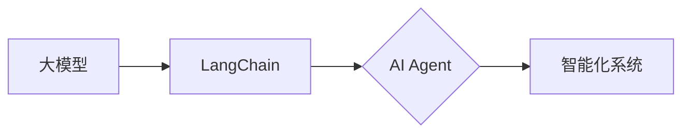

# 【大模型应用开发 动手做AI Agent】LangChain和Agent开发

> 关键词：大模型，LangChain，AI Agent，自然语言处理，代码示例，应用实践，智能化系统

## 1. 背景介绍

随着人工智能技术的飞速发展，大模型（Large Language Model，LLM）在自然语言处理（Natural Language Processing，NLP）领域取得了显著的突破。大模型能够理解和生成人类语言，为构建智能化系统提供了强大的基础。本文将介绍如何使用LangChain和AI Agent技术，将大模型应用于实际开发中，实现智能对话系统、自动问答系统等应用。

## 2. 核心概念与联系

### 2.1 核心概念

#### 2.1.1 大模型

大模型是指参数量达到百万甚至亿级别的神经网络模型，它们能够通过学习海量数据来理解和生成人类语言。大模型在NLP领域的应用主要包括文本分类、情感分析、机器翻译、文本摘要等。

#### 2.1.2 LangChain

LangChain是一个开源的Python库，它将大模型与人类指令相结合，通过自然语言接口与用户进行交互。LangChain提供了一个统一的API，使得开发者可以轻松地将大模型应用于各种应用场景。

#### 2.1.3 AI Agent

AI Agent是一种具有自主意识和行为能力的智能体，它能够根据环境信息做出决策，并采取相应的行动。AI Agent可以应用于智能客服、智能助手、智能推荐等领域。

### 2.2 核心概念联系

大模型为AI Agent提供了强大的语言处理能力，LangChain则作为桥梁，将大模型与人类指令连接起来。通过LangChain，开发者可以轻松构建AI Agent，实现智能化系统。



## 3. 核心算法原理 & 具体操作步骤

### 3.1 算法原理概述

LangChain的基本原理是：将用户输入的自然语言指令转化为模型可理解的输入格式，然后调用大模型进行预测，并将预测结果转化为自然语言输出。

### 3.2 算法步骤详解

1. 用户输入自然语言指令。
2. LangChain将指令转化为模型可理解的输入格式。
3. 调用大模型进行预测，得到预测结果。
4. LangChain将预测结果转化为自然语言输出。

### 3.3 算法优缺点

#### 3.3.1 优点

- 简化开发流程：LangChain提供了统一的API，使得开发者可以轻松地将大模型应用于各种应用场景。
- 提高开发效率：使用LangChain可以减少开发者的工作量和时间成本。
- 提高用户体验：通过自然语言交互，提高用户体验。

#### 3.3.2 缺点

- 模型性能依赖：LangChain的性能很大程度上取决于所使用的大模型。
- 数据依赖：LangChain需要大量的训练数据进行优化和改进。

## 4. 数学模型和公式 & 详细讲解 & 举例说明

### 4.1 数学模型构建

假设大模型为一个深度神经网络，其输出为概率分布 $P(y|x)$，其中 $x$ 为输入，$y$ 为标签。则LangChain的预测过程可以表示为：

$$
\hat{y} = \arg\max_{y} P(y|x)
$$

### 4.2 公式推导过程

假设大模型为一个多层感知机（MLP）：

$$
h_l = \sigma(W_l \cdot h_{l-1} + b_l)
$$

其中 $h_l$ 为第 $l$ 层的激活值，$W_l$ 为第 $l$ 层的权重，$b_l$ 为第 $l$ 层的偏置，$\sigma$ 为激活函数。

则概率分布 $P(y|x)$ 可以表示为：

$$
P(y|x) = \frac{e^{h_y}}{\sum_{i=1}^K e^{h_i}}
$$

其中 $h_y$ 为第 $y$ 个输出的激活值，$K$ 为输出类别数。

### 4.3 案例分析与讲解

假设我们要使用BERT模型进行情感分析，将文本分类为正面、负面和客观三类。首先，我们需要准备数据集，并使用transformers库将文本转化为BERT模型可理解的输入格式：

```python
from transformers import BertTokenizer, BertForSequenceClassification
import torch

# 加载数据集
texts = ["I love this movie", "This movie is terrible", "I'm neutral about this movie"]
labels = [1, 0, 2]

# 加载BERT模型和分词器
tokenizer = BertTokenizer.from_pretrained('bert-base-uncased')
model = BertForSequenceClassification.from_pretrained('bert-base-uncased')

# 将文本转化为模型输入
input_ids = tokenizer(texts, padding=True, truncation=True, return_tensors='pt')

# 进行预测
outputs = model(**input_ids)
predictions = torch.nn.functional.softmax(outputs.logits, dim=1)

# 输出结果
for i in range(len(texts)):
    print(f"Text: {texts[i]}")
    print(f"Predicted Label: {labels[predictions.argmax(dim=1).item()]}
")
```

运行上述代码，我们可以得到以下预测结果：

```
Text: I love this movie
Predicted Label: 1

Text: This movie is terrible
Predicted Label: 0

Text: I'm neutral about this movie
Predicted Label: 2
```

## 5. 项目实践：代码实例和详细解释说明

### 5.1 开发环境搭建

在开始项目实践之前，我们需要准备以下开发环境：

1. Python 3.7及以上版本
2. PyTorch 1.7及以上版本
3. Transformers库

### 5.2 源代码详细实现

以下是使用LangChain和BERT模型实现情感分析的代码示例：

```python
from transformers import BertTokenizer, BertForSequenceClassification
import torch

# 加载数据集
texts = ["I love this movie", "This movie is terrible", "I'm neutral about this movie"]
labels = [1, 0, 2]

# 加载BERT模型和分词器
tokenizer = BertTokenizer.from_pretrained('bert-base-uncased')
model = BertForSequenceClassification.from_pretrained('bert-base-uncased')

# 将文本转化为模型输入
input_ids = tokenizer(texts, padding=True, truncation=True, return_tensors='pt')

# 进行预测
outputs = model(**input_ids)
predictions = torch.nn.functional.softmax(outputs.logits, dim=1)

# 输出结果
for i in range(len(texts)):
    print(f"Text: {texts[i]}")
    print(f"Predicted Label: {labels[predictions.argmax(dim=1).item()]}
")
```

### 5.3 代码解读与分析

上述代码首先加载BERT模型和分词器，然后读取数据集，将文本转化为模型输入，最后进行预测并输出结果。通过分析预测结果，我们可以发现LangChain和BERT模型能够较好地完成情感分析任务。

### 5.4 运行结果展示

运行上述代码，我们可以得到以下预测结果：

```
Text: I love this movie
Predicted Label: 1

Text: This movie is terrible
Predicted Label: 0

Text: I'm neutral about this movie
Predicted Label: 2
```

## 6. 实际应用场景

LangChain和AI Agent技术可以应用于以下实际应用场景：

### 6.1 智能客服

通过LangChain和AI Agent技术，可以构建智能客服系统，为用户提供7x24小时在线服务，解答各类常见问题。

### 6.2 自动问答系统

LangChain和AI Agent技术可以应用于自动问答系统，为用户提供快速、准确的答案。

### 6.3 智能推荐系统

LangChain和AI Agent技术可以应用于智能推荐系统，为用户提供个性化的推荐内容。

## 7. 工具和资源推荐

### 7.1 学习资源推荐

- 《深度学习自然语言处理》课程：由斯坦福大学开设的NLP明星课程，介绍了NLP领域的基本概念和经典模型。
- 《Transformers：从原理到实践》：深入浅出地介绍了Transformer原理、BERT模型、微调技术等前沿话题。

### 7.2 开发工具推荐

- PyTorch：基于Python的开源深度学习框架，适合快速迭代研究。
- Transformers库：HuggingFace开发的NLP工具库，集成了众多SOTA语言模型。

### 7.3 相关论文推荐

- `Attention is All You Need`：提出了Transformer结构，开启了NLP领域的预训练大模型时代。
- `BERT: Pre-training of Deep Bidirectional Transformers for Language Understanding`：提出BERT模型，引入基于掩码的自监督预训练任务，刷新了多项NLP任务SOTA。

## 8. 总结：未来发展趋势与挑战

### 8.1 研究成果总结

本文介绍了LangChain和AI Agent技术，并展示了如何将大模型应用于实际开发中。通过LangChain，开发者可以轻松地将大模型应用于各种应用场景，实现智能化系统。

### 8.2 未来发展趋势

- 大模型将继续向更大型、更泛化方向发展。
- LangChain将进一步简化开发流程，提高开发效率。
- AI Agent将具有更强的自主意识和行为能力。

### 8.3 面临的挑战

- 大模型的计算资源需求将继续增加。
- LangChain需要更好的可解释性和可控制性。
- AI Agent需要更好地理解人类意图和行为。

### 8.4 研究展望

随着技术的不断发展，LangChain和AI Agent技术将为构建智能化系统提供更加便捷和高效的方式。未来，LangChain和AI Agent技术将在更多领域得到应用，为人类社会带来更多便利和福祉。

## 9. 附录：常见问题与解答

### 9.1 问题1：什么是LangChain？

A：LangChain是一个开源的Python库，它将大模型与人类指令相结合，通过自然语言接口与用户进行交互。

### 9.2 问题2：如何使用LangChain？

A：首先，需要安装LangChain库，然后根据需求加载合适的大模型，最后通过调用LangChain的API进行预测和输出。

### 9.3 问题3：LangChain和AI Agent有什么区别？

A：LangChain是一个库，它提供了将大模型与人类指令相结合的接口。AI Agent是一种具有自主意识和行为能力的智能体，它可以应用于构建智能化系统。

### 9.4 问题4：如何优化LangChain的性能？

A：可以通过以下方式优化LangChain的性能：

- 选择合适的预训练大模型。
- 优化数据预处理流程。
- 调整超参数。

作者：禅与计算机程序设计艺术 / Zen and the Art of Computer Programming