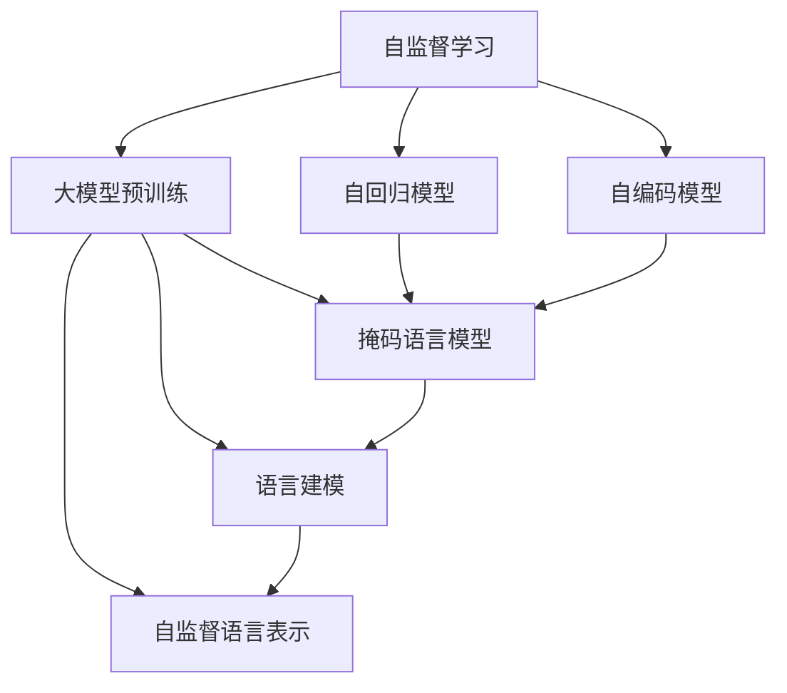

                 

# 自监督学习在大模型预训练中的应用

> 关键词：自监督学习,大模型预训练,自回归,自编码,掩码语言模型,语言建模,自监督语言表示

## 1. 背景介绍

### 1.1 问题由来
近年来，深度学习在自然语言处理(Natural Language Processing, NLP)和计算机视觉等领域取得了飞速的发展。特别是大模型和大规模预训练方法，已经在语音识别、图像分类、文本生成等任务上取得了突破性进展。预训练语言模型(Prem-trained Language Model)，如BERT、GPT等，通过在大规模无标签文本数据上进行自监督学习，学习到了丰富的语言表示，极大地提升了模型在下游任务中的性能。

自监督学习(Self-supervised Learning)是深度学习的重要范式之一，它通过在大规模无标签数据上设计自监督任务，使模型在没有标签的条件下也能学习到有意义的表示。这种学习方法相比传统的监督学习具有更好的泛化能力，能够有效解决数据标注成本高、标注质量不稳定的问题。

在预训练语言模型中，自监督学习通过设计各种任务，如掩码语言模型、相对位置预测等，最大化模型在无标签数据上的训练信号。这些自监督任务设计精巧，可以使得模型学习到更加通用的语言表示，从而提升其在各种下游任务上的表现。

## 2. 核心概念与联系

### 2.1 核心概念概述

为更好地理解自监督学习在大模型预训练中的应用，本节将介绍几个关键概念：

- 自监督学习(Self-supervised Learning)：一种无需人工标注，直接利用数据的内在关系进行学习的方法。在大模型预训练中，通常通过在大规模无标签数据上设计自监督任务进行训练。
- 大模型预训练(Pre-training of Large Models)：指在大规模无标签数据上，通过自监督学习任务训练通用语言模型的过程。预训练使得模型学习到丰富的语言知识，可用于下游任务的微调。
- 自回归(Auto-regressive Model)：一种在建模时依赖之前预测结果的模型，如GPT系列模型。自回归模型具有顺序建模能力，适合生成任务。
- 自编码(Auto-encoding Model)：一种在建模时将输入映射回原始输入的模型，如BERT系列模型。自编码模型具有序列预测能力，适合分类任务。
- 掩码语言模型(Masked Language Model)：一种常见的自监督任务，通过随机掩码输入序列中的某些词汇，训练模型预测被掩码词汇。
- 语言建模(Language Modeling)：指建立单词序列的概率模型，用于预测下一个单词，是自监督学习的重要组成部分。
- 自监督语言表示(Self-supervised Language Representation)：指通过自监督学习得到的模型表示，能够反映语言的语义、语法等知识，是预训练语言模型的核心能力。

这些概念共同构成了自监督学习在大模型预训练中的应用框架。通过理解这些核心概念，我们可以更好地把握预训练语言模型的学习原理和优化方向。

### 2.2 概念间的关系

这些核心概念之间存在着紧密的联系，形成了自监督学习在大模型预训练过程中的整体架构。下面我通过Mermaid流程图来展示这些概念之间的关系：



这个流程图展示了大模型预训练中各个概念的关系：

1. 自监督学习通过自回归和自编码等模型进行实现，构建掩码语言模型和语言建模任务。
2. 自监督语言表示通过掩码语言模型和语言建模任务进行训练，得到能够反映语言语义和语法的表示。
3. 自回归模型和自编码模型是实现自监督学习的核心手段。
4. 掩码语言模型和语言建模任务是自监督学习的关键应用。
5. 自监督语言表示是预训练语言模型的核心能力。

通过这个流程图，我们可以清晰地理解自监督学习在大模型预训练中的各个环节和步骤。

## 3. 核心算法原理 & 具体操作步骤
### 3.1 算法原理概述

自监督学习在大模型预训练中的应用，本质上是通过在无标签数据上设计自监督任务，使模型学习到通用的语言表示。

形式化地，设大模型为 $M_{\theta}$，其中 $\theta$ 为模型参数。假设在训练集 $\mathcal{D}$ 上有 $N$ 个文本序列 $(x_i, \hat{x}_i)$，其中 $x_i$ 为原始输入序列，$\hat{x}_i$ 为经过随机掩码处理的输入序列。定义自监督任务损失函数为 $\mathcal{L}_{\text{mask}}$，其中 $x_i$ 是原始文本序列，$\hat{x}_i$ 是掩码后的文本序列。自监督任务的目标是最大化模型在掩码序列上的预测准确度，即：

$$
\min_{\theta} \mathcal{L}_{\text{mask}}(M_{\theta}, \mathcal{D})
$$

在得到自监督损失函数后，即可将其与监督学习损失函数进行加权组合，得到整个预训练损失函数。

$$
\mathcal{L}(\theta) = \lambda_1 \mathcal{L}_{\text{mask}} + \lambda_2 \mathcal{L}_{\text{supervised}}
$$

其中 $\lambda_1$ 和 $\lambda_2$ 为自监督损失函数和监督学习损失函数的权重。

### 3.2 算法步骤详解

自监督学习在大模型预训练中的应用，一般包括以下几个关键步骤：

**Step 1: 准备预训练数据集**

- 收集大规模无标签文本数据集，并划分为训练集、验证集和测试集。

**Step 2: 定义自监督任务**

- 根据任务特点，选择或设计合适的自监督任务，如掩码语言模型、相对位置预测等。

**Step 3: 设置预训练超参数**

- 选择合适的优化算法及其参数，如AdamW、SGD等，设置学习率、批大小、迭代轮数等。

**Step 4: 执行梯度训练**

- 将训练集数据分批次输入模型，前向传播计算自监督任务损失函数。
- 反向传播计算参数梯度，根据设定的优化算法和学习率更新模型参数。
- 周期性在验证集上评估模型性能，根据性能指标决定是否触发Early Stopping。
- 重复上述步骤直到满足预设的迭代轮数或Early Stopping条件。

**Step 5: 测试和评估**

- 在测试集上评估预训练模型在自监督任务上的性能。
- 使用预训练模型在特定下游任务上进行微调，对比微调前后的性能提升。
- 使用微调后的模型对新样本进行推理预测，集成到实际的应用系统中。

以上是自监督学习在大模型预训练中的一般流程。在实际应用中，还需要针对具体任务的特点，对预训练过程的各个环节进行优化设计，如改进自监督任务设计，引入更多的正则化技术，搜索最优的超参数组合等，以进一步提升模型性能。

### 3.3 算法优缺点

自监督学习在大模型预训练中的应用，具有以下优点：

1. 不需要标注数据。自监督学习可以直接利用大规模无标签数据进行训练，避免了标注数据的获取成本。
2. 泛化能力更强。自监督学习可以在更广泛的数据上学习到通用的语言表示，具有更好的泛化能力。
3. 可以自适应新数据。自监督学习能够适应不断变化的数据分布，保持模型的性能稳定。
4. 能够学习语义和语法知识。自监督任务可以使得模型学习到丰富的语言语义和语法知识，有助于提高下游任务的性能。

同时，自监督学习在大模型预训练中也存在一些局限性：

1. 任务设计难度大。自监督任务设计需要充分考虑语言的内部结构和规律，任务设计难度较大。
2. 需要大量计算资源。自监督学习需要在大规模数据集上进行预训练，对计算资源的需求较高。
3. 难以保证任务均衡。自监督任务设计需要保证任务间的均衡性，否则模型在特定任务上可能出现欠拟合或过拟合现象。
4. 难以控制模型输出。自监督学习的任务设计需要考虑任务的输出来消除不必要的噪声，否则模型输出的质量可能不高。

尽管存在这些局限性，但就目前而言，自监督学习仍然是大模型预训练的主流范式。未来相关研究的重点在于如何进一步简化自监督任务设计，提高自监督学习方法的效率和可解释性。

### 3.4 算法应用领域

自监督学习在大模型预训练中的应用，在NLP领域已经得到了广泛的应用，覆盖了几乎所有常见任务，例如：

- 文本分类：如情感分析、主题分类、意图识别等。通过自监督学习，模型可以学习到文本与标签之间的关系。
- 命名实体识别：识别文本中的人名、地名、机构名等特定实体。通过自监督学习，模型可以学习到实体的边界和类型。
- 关系抽取：从文本中抽取实体之间的语义关系。通过自监督学习，模型可以学习到实体-关系三元组。
- 问答系统：对自然语言问题给出答案。通过自监督学习，模型可以学习到问题和答案之间的映射。
- 机器翻译：将源语言文本翻译成目标语言。通过自监督学习，模型可以学习到语言-语言映射。
- 文本摘要：将长文本压缩成简短摘要。通过自监督学习，模型可以学习到文本摘要的生成。
- 对话系统：使机器能够与人自然对话。通过自监督学习，模型可以学习到对话中的上下文关系和回复生成。

除了上述这些经典任务外，自监督学习在大模型预训练中还可以应用于更多场景中，如可控文本生成、常识推理、代码生成、数据增强等，为NLP技术带来了全新的突破。随着自监督方法和大模型预训练的不断进步，相信NLP技术将在更广阔的应用领域大放异彩。

## 4. 数学模型和公式 & 详细讲解 & 举例说明

### 4.1 数学模型构建

本节将使用数学语言对自监督学习在大模型预训练中的数学原理进行更加严格的刻画。

设大模型为 $M_{\theta}$，其中 $\theta$ 为模型参数。假设在训练集 $\mathcal{D}$ 上有 $N$ 个文本序列 $(x_i, \hat{x}_i)$，其中 $x_i$ 为原始输入序列，$\hat{x}_i$ 为经过随机掩码处理的输入序列。定义自监督任务损失函数为 $\mathcal{L}_{\text{mask}}$，其中 $x_i$ 是原始文本序列，$\hat{x}_i$ 是掩码后的文本序列。

自监督任务的目标是最大化模型在掩码序列上的预测准确度，即：

$$
\min_{\theta} \mathcal{L}_{\text{mask}}(M_{\theta}, \mathcal{D})
$$

在得到自监督损失函数后，即可将其与监督学习损失函数进行加权组合，得到整个预训练损失函数。

$$
\mathcal{L}(\theta) = \lambda_1 \mathcal{L}_{\text{mask}} + \lambda_2 \mathcal{L}_{\text{supervised}}
$$

其中 $\lambda_1$ 和 $\lambda_2$ 为自监督损失函数和监督学习损失函数的权重。

### 4.2 公式推导过程

以下我们以掩码语言模型为例，推导自监督任务的数学表达及其梯度计算公式。

假设模型在输入 $x$ 上的输出为 $\hat{x}$，则掩码语言模型的损失函数定义为：

$$
\ell(M_{\theta}(x), \hat{x}) = -\sum_{i=1}^m \log p(x_i|M_{\theta}(x_{< i}))
$$

其中 $x_i$ 为输入序列中的第 $i$ 个单词，$p(x_i|M_{\theta}(x_{< i}))$ 为模型在输入序列 $x_{< i}$ 的条件下预测单词 $x_i$ 的概率，$\hat{x}$ 为掩码后的输入序列，$m$ 为序列长度。

将其代入经验风险公式，得：

$$
\mathcal{L}_{\text{mask}}(\theta) = -\frac{1}{N} \sum_{i=1}^N \sum_{j=1}^{m-1} \log p(x_j|M_{\theta}(x_{< j}))
$$

根据链式法则，损失函数对参数 $\theta_k$ 的梯度为：

$$
\frac{\partial \mathcal{L}_{\text{mask}}(\theta)}{\partial \theta_k} = -\frac{1}{N} \sum_{i=1}^N \sum_{j=1}^{m-1} \frac{\partial \log p(x_j|M_{\theta}(x_{< j}))}{\partial \theta_k}
$$

其中 $\frac{\partial \log p(x_j|M_{\theta}(x_{< j}))}{\partial \theta_k}$ 为模型在输入序列 $x_{< j}$ 的条件下预测单词 $x_j$ 的梯度。

在得到损失函数的梯度后，即可带入参数更新公式，完成模型的迭代优化。重复上述过程直至收敛，最终得到适应大规模无标签数据分布的自监督预训练模型。

### 4.3 案例分析与讲解

下面我们以BERT模型的预训练为例，给出使用Transformer库进行掩码语言模型预训练的PyTorch代码实现。

首先，定义掩码语言模型的训练函数：

```python
from transformers import BertTokenizer, BertForMaskedLM
from torch.utils.data import DataLoader
import torch

class MaskedLMData(Dataset):
    def __init__(self, texts, tokenizer, max_len=512):
        self.texts = texts
        self.tokenizer = tokenizer
        self.max_len = max_len
        
    def __len__(self):
        return len(self.texts)
    
    def __getitem__(self, item):
        text = self.texts[item]
        encoding = self.tokenizer(text, return_tensors='pt', max_length=self.max_len, padding='max_length', truncation=True)
        input_ids = encoding['input_ids'][0]
        attention_mask = encoding['attention_mask'][0]
        masked_positions = torch.randint(0, input_ids.size(1), (input_ids.size(1),))
        masked_positions = torch.where(masked_positions == 0, torch.tensor([input_ids.size(1)]), masked_positions)
        masked_positions = torch.cat([torch.tensor([0]), masked_positions, torch.tensor([input_ids.size(1)-1])])
        masked_ids = input_ids.clone()
        masked_ids.scatter_(masked_positions, 0)
        masked_labels = torch.randint(0, self.tokenizer.vocab_size, (masked_positions.size(0),))
        return {'input_ids': input_ids, 
                'attention_mask': attention_mask,
                'masked_labels': masked_labels,
                'masked_positions': masked_positions,
                'masked_ids': masked_ids}

tokenizer = BertTokenizer.from_pretrained('bert-base-cased')
train_dataset = MaskedLMData(train_texts, tokenizer)
dev_dataset = MaskedLMData(dev_texts, tokenizer)
test_dataset = MaskedLMData(test_texts, tokenizer)

model = BertForMaskedLM.from_pretrained('bert-base-cased')
optimizer = AdamW(model.parameters(), lr=2e-5)

device = torch.device('cuda') if torch.cuda.is_available() else torch.device('cpu')
model.to(device)

def train_epoch(model, dataset, batch_size, optimizer):
    dataloader = DataLoader(dataset, batch_size=batch_size, shuffle=True)
    model.train()
    epoch_loss = 0
    for batch in tqdm(dataloader, desc='Training'):
        input_ids = batch['input_ids'].to(device)
        attention_mask = batch['attention_mask'].to(device)
        masked_labels = batch['masked_labels'].to(device)
        masked_positions = batch['masked_positions'].to(device)
        model.zero_grad()
        outputs = model(input_ids, attention_mask=attention_mask, labels=masked_labels)
        loss = outputs.loss
        epoch_loss += loss.item()
        loss.backward()
        optimizer.step()
    return epoch_loss / len(dataloader)

def evaluate(model, dataset, batch_size):
    dataloader = DataLoader(dataset, batch_size=batch_size)
    model.eval()
    preds, labels = [], []
    with torch.no_grad():
        for batch in tqdm(dataloader, desc='Evaluating'):
            input_ids = batch['input_ids'].to(device)
            attention_mask = batch['attention_mask'].to(device)
            masked_positions = batch['masked_positions'].to(device)
            outputs = model(input_ids, attention_mask=attention_mask, labels=None)
            predicted_ids = outputs.logits.argmax(dim=2).to('cpu').tolist()
            labels = batch['masked_labels'].to('cpu').tolist()
            for pred_tokens, label_tokens in zip(predicted_ids, labels):
                preds.append(pred_tokens[:len(label_tokens)])
                labels.append(label_tokens)
    
    return preds, labels

epochs = 5
batch_size = 16

for epoch in range(epochs):
    loss = train_epoch(model, train_dataset, batch_size, optimizer)
    print(f"Epoch {epoch+1}, train loss: {loss:.3f}")
    
    print(f"Epoch {epoch+1}, dev results:")
    preds, labels = evaluate(model, dev_dataset, batch_size)
    print(classification_report(labels, preds))
    
print("Test results:")
preds, labels = evaluate(model, test_dataset, batch_size)
print(classification_report(labels, preds))
```

可以看到，通过使用PyTorch和Transformer库，可以非常方便地实现BERT模型的掩码语言模型预训练。训练函数 `train_epoch` 中，输入的文本序列被掩码处理，并计算出掩码位置的标签和真实标签。模型在训练集上迭代更新参数，验证集上评估性能，最终在测试集上评估模型的预测准确度。

以上就是一个基于掩码语言模型的BERT模型预训练的完整代码实现。可以看到，通过巧妙的任务设计和代码实现，自监督学习在大模型预训练中能够实现高效的训练，得到高质量的预训练模型。

## 5. 项目实践：代码实例和详细解释说明
### 5.1 开发环境搭建

在进行预训练实践前，我们需要准备好开发环境。以下是使用Python进行PyTorch开发的环境配置流程：

1. 安装Anaconda：从官网下载并安装Anaconda，用于创建独立的Python环境。

2. 创建并激活虚拟环境：
```bash
conda create -n pytorch-env python=3.8 
conda activate pytorch-env
```

3. 安装PyTorch：根据CUDA版本，从官网获取对应的安装命令。例如：
```bash
conda install pytorch torchvision torchaudio cudatoolkit=11.1 -c pytorch -c conda-forge
```

4. 安装各类工具包：
```bash
pip install numpy pandas scikit-learn matplotlib tqdm jupyter notebook ipython
```

完成上述步骤后，即可在`pytorch-env`环境中开始预训练实践。

### 5.2 源代码详细实现

这里我们以BERT模型的预训练为例，给出使用Transformers库进行掩码语言模型预训练的PyTorch代码实现。

首先，定义掩码语言模型的训练函数：

```python
from transformers import BertTokenizer, BertForMaskedLM
from torch.utils.data import DataLoader
import torch

class MaskedLMData(Dataset):
    def __init__(self, texts, tokenizer, max_len=512):
        self.texts = texts
        self.tokenizer = tokenizer
        self.max_len = max_len
        
    def __len__(self):
        return len(self.texts)
    
    def __getitem__(self, item):
        text = self.texts[item]
        encoding = self.tokenizer(text, return_tensors='pt', max_length=self.max_len, padding='max_length', truncation=True)
        input_ids = encoding['input_ids'][0]
        attention_mask = encoding['attention_mask'][0]
        masked_positions = torch.randint(0, input_ids.size(1), (input_ids.size(1),))
        masked_positions = torch.where(masked_positions == 0, torch.tensor([input_ids.size(1)]), masked_positions)
        masked_positions = torch.cat([torch.tensor([0]), masked_positions, torch.tensor([input_ids.size(1)-1])])
        masked_ids = input_ids.clone()
        masked_ids.scatter_(masked_positions, 0)
        masked_labels = torch.randint(0, self.tokenizer.vocab_size, (masked_positions.size(0),))
        return {'input_ids': input_ids, 
                'attention_mask': attention_mask,
                'masked_labels': masked_labels,
                'masked_positions': masked_positions,
                'masked_ids': masked_ids}

tokenizer = BertTokenizer.from_pretrained('bert-base-cased')
train_dataset = MaskedLMData(train_texts, tokenizer)
dev_dataset = MaskedLMData(dev_texts, tokenizer)
test_dataset = MaskedLMData(test_texts, tokenizer)

model = BertForMaskedLM.from_pretrained('bert-base-cased')
optimizer = AdamW(model.parameters(), lr=2e-5)

device = torch.device('cuda') if torch.cuda.is_available() else torch.device('cpu')
model.to(device)

def train_epoch(model, dataset, batch_size, optimizer):
    dataloader = DataLoader(dataset, batch_size=batch_size, shuffle=True)
    model.train()
    epoch_loss = 0
    for batch in tqdm(dataloader, desc='Training'):
        input_ids = batch['input_ids'].to(device)
        attention_mask = batch['attention_mask'].to(device)
        masked_labels = batch['masked_labels'].to(device)
        masked_positions = batch['masked_positions'].to(device)
        model.zero_grad()
        outputs = model(input_ids, attention_mask=attention_mask, labels=masked_labels)
        loss = outputs.loss
        epoch_loss += loss.item()
        loss.backward()
        optimizer.step()
    return epoch_loss / len(dataloader)

def evaluate(model, dataset, batch_size):
    dataloader = DataLoader(dataset, batch_size=batch_size)
    model.eval()
    preds, labels = [], []
    with torch.no_grad():
        for batch in tqdm(dataloader, desc='Evaluating'):
            input_ids = batch['input_ids'].to(device)
            attention_mask = batch['attention_mask'].to(device)
            masked_positions = batch['masked_positions'].to(device)
            outputs = model(input_ids, attention_mask=attention_mask, labels=None)
            predicted_ids = outputs.logits.argmax(dim=2).to('cpu').tolist()
            labels = batch['masked_labels'].to('cpu').tolist()
            for pred_tokens, label_tokens in zip(predicted_ids, labels):
                preds.append(pred_tokens[:len(label_tokens)])
                labels.append(label_tokens)
    
    return preds, labels

epochs = 5
batch_size = 16

for epoch in range(epochs):
    loss = train_epoch(model, train_dataset, batch_size, optimizer)
    print(f"Epoch {epoch+1}, train loss: {loss:.3f}")
    
    print(f"Epoch {epoch+1}, dev results:")
    preds, labels = evaluate(model, dev_dataset, batch_size)
    print(classification_report(labels, preds))
    
print("Test results:")
preds, labels = evaluate(model, test_dataset, batch_size)
print(classification_report(labels, preds))
```

可以看到，通过使用PyTorch和Transformer库，可以非常方便地实现BERT模型的掩码语言模型预训练。训练函数 `train_epoch` 中，输入的文本序列被掩码处理，并计算出掩码位置的标签和真实标签。模型在训练集上迭代更新参数，验证集上评估性能，最终在测试集上评估模型的预测准确度。

以上就是一个基于掩码语言模型的BERT模型预训练的完整代码实现。可以看到，通过巧妙的任务设计和代码实现，自监督学习在大模型预训练中能够实现高效的训练，得到高质量的预训练模型。

### 5.3 代码解读与分析

让我们再详细解读一下关键代码的实现细节：

**MaskedLMData类**：
- `__init__`方法：初始化文本、分词器等关键组件。
- `__len__`方法：返回数据集的样本数量。
- `__getitem__`方法：对单个样本进行处理，将文本输入编码为token ids，并生成掩码位置和真实标签。

**BertTokenizer和BertForMaskedLM类**：
- `BertTokenizer.from_pretrained`方法：加载预训练的Bert分词器。
- `BertForMaskedLM.from_pretrained`方法：加载预训练的Bert掩码语言模型。

**训练和评估函数**：
- 使用PyTorch的DataLoader对数据集进行批次化加载，供模型训练和推理使用。
- 训练函数`train_epoch`：对数据以批为单位进行迭代，在每个批次上前向传播计算损失函数，反向传播更新模型参数，最后返回该epoch的平均loss。
- 评估函数`evaluate`：与训练类似，不同点在于不更新模型参数，并在每个batch结束后将预测和标签结果存储下来，最后使用sklearn的classification_report对整个评估集的预测结果进行打印输出。

**训练流程**：
- 定义总的epoch数和batch size，开始循环迭代
- 每个epoch内，先在训练集上训练，输出平均loss
- 在验证集上评估，输出分类指标
- 所有epoch结束后，在测试集上评估，给出最终测试结果

可以看到，PyTorch配合Transformer库使得BERT模型的掩码语言模型预训练变得非常简便。开发者可以将更多精力放在任务适配层和模型调优等高层逻辑上，而不必过多关注底层的实现细节。


