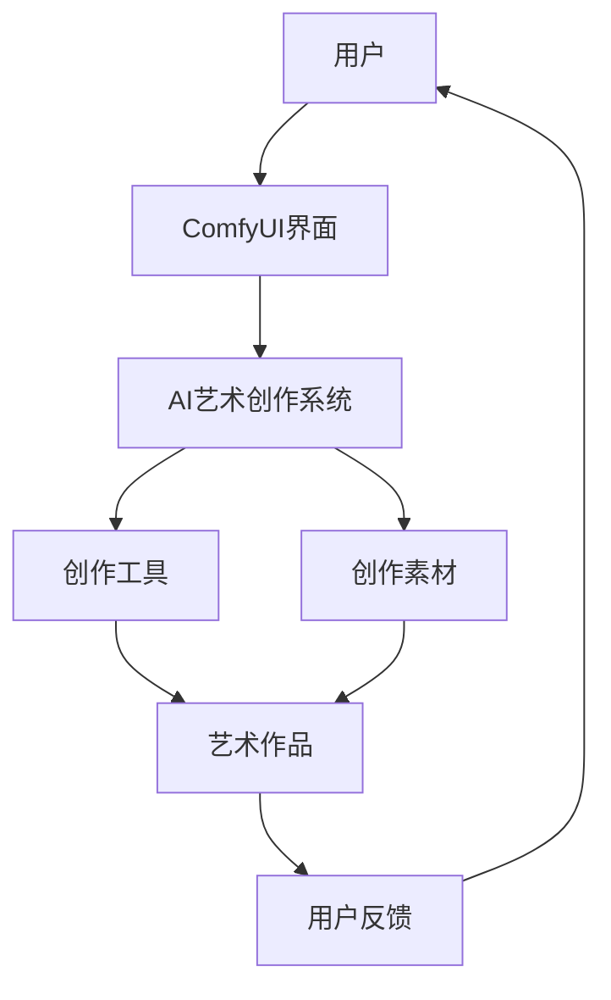

> 人工智能艺术, ComfyUI, 用户界面设计, 可视化工具, 图形生成, 机器学习, 自然语言处理

# ComfyUI在AI艺术创作中的应用

AI艺术创作是人工智能与艺术领域的交叉领域，它结合了机器学习、自然语言处理和计算机图形学等技术，创造出前所未有的艺术作品。在这个过程中，用户界面(UI)的设计扮演着至关重要的角色，它直接影响着艺术创作者与AI系统的交互体验和创作效率。ComfyUI，作为一款强大的交互式UI框架，为AI艺术创作提供了丰富的功能和支持。本文将深入探讨ComfyUI在AI艺术创作中的应用，从核心概念到具体实践，全面解析这一创新工具。

## 1. 背景介绍

### 1.1 问题的由来

随着深度学习技术的发展，AI在艺术领域的应用越来越广泛，从音乐创作到绘画，从电影特效到虚拟现实，AI艺术作品层出不穷。然而，AI艺术创作的复杂性使得普通用户难以直接参与其中。现有的艺术创作软件往往功能复杂，操作繁琐，缺乏直观的用户界面，导致创作过程难以入门和上手。

### 1.2 研究现状

为了解决这一问题，研究人员和开发者开始探索如何将AI艺术创作工具设计得更加用户友好。ComfyUI应运而生，它是一款基于Web的交互式UI框架，以其简洁、直观、可定制的特点，为AI艺术创作提供了便捷的平台。

### 1.3 研究意义

ComfyUI在AI艺术创作中的应用具有以下重要意义：

- **降低门槛**：提供直观易用的界面，让更多人能够参与AI艺术创作。
- **提升效率**：简化操作流程，提高艺术创作的效率。
- **增强互动**：促进艺术家与AI之间的互动，激发新的创意。
- **创新创作**：为艺术家提供新的创作工具和灵感来源。

### 1.4 本文结构

本文将分为以下几个部分：

- 核心概念与联系
- 核心算法原理 & 具体操作步骤
- 数学模型和公式 & 详细讲解 & 举例说明
- 项目实践：代码实例和详细解释说明
- 实际应用场景
- 工具和资源推荐
- 总结：未来发展趋势与挑战
- 附录：常见问题与解答

## 2. 核心概念与联系

### 2.1 核心概念

- **AI艺术创作**：利用人工智能技术进行艺术创作的过程，包括音乐、绘画、摄影、影视等。
- **ComfyUI**：一款基于Web的交互式UI框架，提供简洁、直观、可定制的界面。
- **用户交互**：用户与AI艺术创作系统之间的交互过程，包括操作、反馈等。

### 2.2 架构的 Mermaid 流程图



用户通过ComfyUI界面与AI艺术创作系统进行交互，系统使用创作工具和素材生成艺术作品，用户对作品进行反馈，这一过程循环进行，不断优化创作过程。

## 3. 核心算法原理 & 具体操作步骤

### 3.1 算法原理概述

ComfyUI在AI艺术创作中的应用，主要基于以下原理：

- **前端技术**：使用HTML、CSS、JavaScript等前端技术构建用户界面。
- **后端服务**：通过RESTful API或WebSocket与后端AI艺术创作系统进行通信。
- **机器学习模型**：使用预训练的机器学习模型进行艺术创作。

### 3.2 算法步骤详解

1. 用户通过ComfyUI界面选择艺术创作工具和素材。
2. 用户设置创作参数，如风格、颜色、主题等。
3. ComfyUI界面将用户输入的数据发送到后端AI艺术创作系统。
4. AI艺术创作系统根据用户输入的数据和预训练的机器学习模型生成艺术作品。
5. AI艺术创作系统将生成的艺术作品返回给ComfyUI界面。
6. 用户在ComfyUI界面查看艺术作品，并根据需要进行修改或反馈。

### 3.3 算法优缺点

**优点**：

- **易用性**：ComfyUI界面简洁直观，易于上手。
- **灵活性**：支持自定义UI组件和交互逻辑。
- **扩展性**：方便集成新的AI艺术创作工具和素材。

**缺点**：

- **性能**：前端技术可能影响界面性能。
- **安全性**：需要确保数据传输的安全性。

### 3.4 算法应用领域

ComfyUI在以下AI艺术创作领域具有广泛的应用前景：

- **绘画与设计**：生成艺术画作、设计图案等。
- **音乐创作**：创作音乐作品、音效等。
- **影视特效**：生成特效图像、动画等。

## 4. 数学模型和公式 & 详细讲解 & 举例说明

### 4.1 数学模型构建

AI艺术创作中的数学模型主要基于机器学习，以下以生成对抗网络(GAN)为例进行说明。

$$
\text{GAN} = \text{Generator}(G) + \text{Discriminator}(D)
$$

其中，Generator $G$ 生成艺术作品，Discriminator $D$ 判断生成作品的真实性。

### 4.2 公式推导过程

GAN的损失函数为：

$$
L(G,D) = E_{x \sim p_{data}(x)}[D(x)] - E_{z \sim p_{z}(z)}[D(G(z))]
$$

其中，$p_{data}(x)$ 为真实数据分布，$p_{z}(z)$ 为随机噪声分布。

### 4.3 案例分析与讲解

以生成艺术画作为例，Generator $G$ 接收随机噪声 $z$，生成艺术画作 $x$。Discriminator $D$ 判断艺术画作 $x$ 的真实性和生成性。通过训练，Generator不断优化生成作品，使其更接近真实数据，而Discriminator不断优化判断能力。

## 5. 项目实践：代码实例和详细解释说明

### 5.1 开发环境搭建

1. 安装Node.js和npm。
2. 安装ComfyUI。
3. 安装后端服务器框架，如Express.js。

### 5.2 源代码详细实现

以下是一个简单的ComfyUI项目示例：

```javascript
// app.js
const express = require('express');
const ComfyUI = require('comfyui');

const app = express();
const port = 3000;

app.use(express.static('public'));

app.get('/', (req, res) => {
  res.sendFile(__dirname + '/public/index.html');
});

app.listen(port, () => {
  console.log(`ComfyUI server listening at http://localhost:${port}`);
});
```

### 5.3 代码解读与分析

该示例创建了一个简单的ComfyUI服务器，用户访问根目录时，服务器会返回index.html页面。

### 5.4 运行结果展示

1. 运行服务器：`node app.js`
2. 打开浏览器访问 `http://localhost:3000`，即可看到ComfyUI界面。

## 6. 实际应用场景

### 6.1 AI绘画与设计

ComfyUI可以与AI绘画工具结合，如DeepArt.io、DeepArtify等，为用户提供一个交互式的AI艺术创作平台。

### 6.2 音乐创作

ComfyUI可以与AI音乐生成工具结合，如AIVA、Amper Music等，为用户提供一个创作音乐的工具。

### 6.3 影视特效

ComfyUI可以与AI特效生成工具结合，如DeepArt.io的特效功能，为用户提供一个创作特效的平台。

## 7. 工具和资源推荐

### 7.1 学习资源推荐

- 《ComfyUI官方文档》：了解ComfyUI的详细使用方法和最佳实践。
- 《机器学习与深度学习》：学习机器学习和深度学习的基础知识。

### 7.2 开发工具推荐

- Visual Studio Code：一款强大的代码编辑器，支持多种编程语言。
- Git：版本控制工具，方便代码管理和协作。

### 7.3 相关论文推荐

- Generative Adversarial Nets：介绍GAN的论文。

## 8. 总结：未来发展趋势与挑战

### 8.1 研究成果总结

ComfyUI在AI艺术创作中的应用，为艺术家提供了一个便捷的创作平台，降低了艺术创作的门槛，提高了创作效率。

### 8.2 未来发展趋势

- **增强交互性**：ComfyUI将更加注重用户交互体验，提供更加丰富的交互功能。
- **个性化定制**：根据用户需求，提供更加个性化的UI设计。
- **跨平台应用**：ComfyUI将支持更多平台，如移动端、桌面端等。

### 8.3 面临的挑战

- **性能优化**：提高ComfyUI的运行效率，降低对硬件资源的消耗。
- **安全性**：确保用户数据和创作内容的隐私和安全。
- **可扩展性**：提高ComfyUI的扩展性，支持更多AI艺术创作工具。

### 8.4 研究展望

ComfyUI在AI艺术创作中的应用前景广阔，随着技术的不断发展，ComfyUI将更加完善，为艺术家提供更加便捷的创作工具，推动AI艺术创作的繁荣发展。

## 9. 附录：常见问题与解答

**Q1：ComfyUI适合哪些用户？**

A：ComfyUI适合所有对AI艺术创作感兴趣的用户，包括艺术家、设计师、程序员等。

**Q2：ComfyUI是否支持中文？**

A：ComfyUI目前主要支持英文，但支持多语言扩展。

**Q3：如何获取ComfyUI的源代码？**

A：ComfyUI的源代码托管在GitHub上，用户可以访问 https://github.com/comfyui/comfyui 获取。

**Q4：ComfyUI是否可以商用？**

A：ComfyUI是开源的，用户可以免费使用和商用。

**Q5：如何贡献ComfyUI？**

A：用户可以通过提交issue、pull request等方式为ComfyUI贡献代码或改进建议。

---

作者：禅与计算机程序设计艺术 / Zen and the Art of Computer Programming