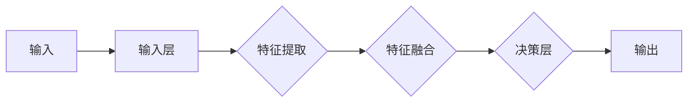

# Hinton、LeCun、Bengio：AI算法的先驱

> 关键词：Yann LeCun, Geoffrey Hinton, Yoshua Bengio, 深度学习, 神经网络, 反向传播, 卷积神经网络, 生成对抗网络

## 1. 背景介绍

人工智能（AI）自诞生以来，经历了多个发展阶段。在20世纪80年代至90年代，由于计算能力和数据量的限制，AI研究进入了一个相对沉寂的时期。然而，在21世纪初，随着深度学习的兴起，AI研究迎来了新的春天。在这一领域，三位科学家——Yann LeCun、Geoffrey Hinton 和 Yoshua Bengio——的贡献尤为突出。他们的工作不仅推动了深度学习技术的发展，也为AI领域的其他研究者树立了榜样。本文将深入探讨这三位先驱的成就和贡献，以及他们如何共同塑造了现代AI的算法基础。

### 1.1 问题的由来

在深度学习之前，传统的机器学习方法在处理复杂任务时往往效果不佳。这些方法通常依赖于手工程特征，难以捕捉数据中的复杂模式和关联。深度学习通过模仿人脑神经网络结构，使用层次化的神经网络模型来学习数据特征，从而在图像识别、语音识别、自然语言处理等领域取得了突破性进展。

### 1.2 研究现状

深度学习已经成为AI领域的主流技术，其应用范围广泛，从自动驾驶到医疗诊断，从推荐系统到金融风控，都有着举足轻重的作用。然而，深度学习的理论研究和算法创新依然在不断推进中。

### 1.3 研究意义

了解Hinton、LeCun和Bengio等先驱的成就，有助于我们更好地理解深度学习的理论基础，把握AI算法的发展脉络，并为未来的研究提供灵感。

### 1.4 本文结构

本文将分为以下几个部分：
- 介绍深度学习的基本概念和Hinton、LeCun、Bengio的背景。
- 深入探讨这三位先驱在深度学习领域的核心贡献。
- 分析深度学习算法的具体原理和操作步骤。
- 讨论深度学习在实际应用场景中的表现和未来发展趋势。
- 推荐深度学习相关的学习资源、开发工具和参考文献。
- 总结研究成果，展望未来发展趋势和挑战。

## 2. 核心概念与联系

### 2.1 深度学习

深度学习是一种基于人工神经网络的学习方法，通过模拟人脑神经元之间的连接和交互来学习数据中的复杂特征和模式。深度学习模型通常由多个层次组成，每个层次都学习数据的不同层次抽象。

### 2.2 核心概念原理和架构的 Mermaid 流程图



### 2.3 核心概念联系

深度学习通过层次化的神经网络结构，实现了从原始输入到最终输出的转换。每个层次都学习数据的不同特征，并通过特征融合和决策层最终得到输出结果。

## 3. 核心算法原理 & 具体操作步骤

### 3.1 算法原理概述

深度学习算法的核心是神经网络，它通过调整连接权重来学习数据中的模式。最常用的神经网络类型是卷积神经网络（CNN）和循环神经网络（RNN），它们分别适用于图像和序列数据。

### 3.2 算法步骤详解

#### 3.2.1 卷积神经网络（CNN）

CNN通过卷积层、池化层和全连接层来提取图像特征。

1. 卷积层：使用卷积核从输入图像中提取局部特征。
2. 池化层：降低特征图的空间维度，减少计算量。
3. 全连接层：将所有特征图的特征进行融合，形成最终的输出。

#### 3.2.2 循环神经网络（RNN）

RNN通过循环连接来处理序列数据，它可以保持信息状态，适合处理时序数据。

1. 输入层：将序列数据输入到网络中。
2. 隐藏层：使用循环连接来更新状态。
3. 输出层：将最终状态转换为输出。

### 3.3 算法优缺点

#### 优点

- 能够自动学习数据中的复杂特征。
- 能够处理高维数据。
- 在图像识别、语音识别、自然语言处理等领域取得了显著成果。

#### 缺点

- 训练数据量大。
- 计算复杂度高。
- 容易过拟合。

### 3.4 算法应用领域

深度学习算法在以下领域得到了广泛应用：

- 图像识别：如人脸识别、物体检测等。
- 语音识别：如语音到文本转换、语音合成等。
- 自然语言处理：如机器翻译、情感分析等。
- 自动驾驶：如车道线检测、障碍物检测等。

## 4. 数学模型和公式 & 详细讲解 & 举例说明

### 4.1 数学模型构建

深度学习模型通常使用神经网络架构，其中每个神经元都通过权重与前一层的神经元相连。

#### 4.1.1 神经元

神经元是神经网络的基本单元，它接收输入信号，通过激活函数计算输出。

#### 4.1.2 激活函数

激活函数用于引入非线性，使神经网络能够学习复杂的模式。

$$
f(x) = \sigma(x) = \frac{1}{1 + e^{-x}}
$$

其中 $\sigma(x)$ 是Sigmoid函数。

### 4.2 公式推导过程

以下以卷积神经网络为例，介绍神经网络中的基本公式推导过程。

#### 4.2.1 前向传播

前向传播是指将输入数据通过神经网络，逐层计算输出。

$$
z^{[l]} = W^{[l]} \cdot a^{[l-1]} + b^{[l]}
$$

其中 $z^{[l]}$ 是第l层的激活值，$W^{[l]}$ 是第l层的权重，$a^{[l-1]}$ 是第l-1层的激活值，$b^{[l]}$ 是第l层的偏置。

#### 4.2.2 反向传播

反向传播是指根据损失函数计算梯度，并更新网络权重。

$$
\frac{\partial \mathcal{L}}{\partial W^{[l]}} = \frac{\partial \mathcal{L}}{\partial z^{[l]}} \cdot \frac{\partial z^{[l]}}{\partial W^{[l]}}
$$

其中 $\mathcal{L}$ 是损失函数，$\frac{\partial \mathcal{L}}{\partial z^{[l]}}$ 是损失函数对第l层激活值的梯度，$\frac{\partial z^{[l]}}{\partial W^{[l]}}$ 是第l层激活值对权重的梯度。

### 4.3 案例分析与讲解

以下以图像识别任务为例，说明深度学习模型的工作原理。

假设我们有一个简单的图像识别模型，它包含一个卷积层和一个全连接层。

1. 将输入图像通过卷积层，提取图像特征。
2. 将卷积层输出的特征图通过全连接层，进行分类。
3. 计算模型预测的类别和真实标签之间的损失，并更新模型权重。

通过多次迭代训练，模型逐渐学习到图像的特征，并能够准确识别图像中的对象。

## 5. 项目实践：代码实例和详细解释说明

### 5.1 开发环境搭建

为了进行深度学习实践，我们需要安装以下软件：

- Python 3.6及以上版本
- TensorFlow或PyTorch深度学习框架
- NumPy、Pandas等数据处理工具

### 5.2 源代码详细实现

以下是一个使用TensorFlow实现的简单卷积神经网络图像识别模型的示例代码：

```python
import tensorflow as tf
from tensorflow.keras import datasets, layers, models

# 加载数据集
(train_images, train_labels), (test_images, test_labels) = datasets.cifar10.load_data()

# 预处理数据
train_images = train_images.reshape((60000, 32, 32, 3)).astype('float32') / 255
test_images = test_images.reshape((10000, 32, 32, 3)).astype('float32') / 255

# 构建模型
model = models.Sequential()
model.add(layers.Conv2D(32, (3, 3), activation='relu', input_shape=(32, 32, 3)))
model.add(layers.MaxPooling2D((2, 2)))
model.add(layers.Conv2D(64, (3, 3), activation='relu'))
model.add(layers.MaxPooling2D((2, 2)))
model.add(layers.Conv2D(64, (3, 3), activation='relu'))

# 添加全连接层
model.add(layers.Flatten())
model.add(layers.Dense(64, activation='relu'))
model.add(layers.Dense(10))

# 编译模型
model.compile(optimizer='adam',
              loss=tf.keras.losses.SparseCategoricalCrossentropy(from_logits=True),
              metrics=['accuracy'])

# 训练模型
model.fit(train_images, train_labels, epochs=10, validation_data=(test_images, test_labels))

# 评估模型
test_loss, test_acc = model.evaluate(test_images,  test_labels, verbose=2)
print('
Test accuracy:', test_acc)
```

### 5.3 代码解读与分析

以上代码首先加载了CIFAR-10图像数据集，然后构建了一个包含卷积层、池化层和全连接层的卷积神经网络模型。模型使用Adam优化器和交叉熵损失函数进行训练，并在测试集上评估了模型的准确率。

### 5.4 运行结果展示

运行以上代码后，我们可以在控制台看到模型在测试集上的准确率。

## 6. 实际应用场景

深度学习算法在以下场景中得到了广泛应用：

- **图像识别**：用于识别图像中的对象、场景和动作，如人脸识别、物体检测、自动驾驶等。
- **语音识别**：用于将语音信号转换为文本，如语音助手、语音翻译等。
- **自然语言处理**：用于处理和理解人类语言，如机器翻译、情感分析、文本分类等。
- **推荐系统**：用于推荐用户可能感兴趣的内容，如电影推荐、商品推荐等。

### 6.4 未来应用展望

随着深度学习技术的不断发展，未来深度学习将在更多领域得到应用，如：

- **医疗诊断**：用于辅助医生进行疾病诊断，提高诊断准确率。
- **金融风控**：用于识别欺诈行为，降低金融风险。
- **教育**：用于个性化教育，提高教育效率。
- **娱乐**：用于创造更加智能的娱乐体验。

## 7. 工具和资源推荐

### 7.1 学习资源推荐

- 《深度学习》（Goodfellow, Bengio, Courville著）：深度学习的经典教材，适合初学者和进阶者。
- 《神经网络与深度学习》（邱锡鹏著）：国内优秀的深度学习教材，通俗易懂。
- TensorFlow官网文档：提供TensorFlow框架的详细文档和教程。
- PyTorch官网文档：提供PyTorch框架的详细文档和教程。

### 7.2 开发工具推荐

- TensorFlow：由Google开发的深度学习框架，功能强大，应用广泛。
- PyTorch：由Facebook开发的深度学习框架，易于使用，社区活跃。
- Keras：基于TensorFlow和Theano的开源深度学习库，易于入门。

### 7.3 相关论文推荐

- "LeNet5"：提出卷积神经网络的基本结构，为后来的CNN发展奠定了基础。
- "A Learning Algorithm for Continually Running Fully Recurrent Neural Networks"：提出反向传播算法，为深度学习的发展提供了理论基础。
- "Convolutional Networks for Images, Sounds, and Time Series"：提出卷积神经网络在图像识别中的应用，推动了CNN的发展。

## 8. 总结：未来发展趋势与挑战

### 8.1 研究成果总结

Hinton、LeCun和Bengio等先驱在深度学习领域做出了巨大贡献，他们的工作推动了深度学习技术的发展，为AI领域的其他研究者树立了榜样。

### 8.2 未来发展趋势

未来，深度学习将在更多领域得到应用，如医疗、金融、教育、娱乐等。同时，深度学习技术也将不断发展，如：

- **模型压缩**：减小模型尺寸，提高模型效率。
- **迁移学习**：利用预训练模型进行下游任务的快速适应。
- **多模态学习**：融合不同模态数据，提高模型的认知能力。

### 8.3 面临的挑战

深度学习技术虽然取得了显著进展，但仍然面临以下挑战：

- **数据隐私**：如何保护用户数据隐私是一个重要问题。
- **模型可解释性**：如何解释模型的决策过程是一个重要研究方向。
- **计算资源**：深度学习模型通常需要大量的计算资源。

### 8.4 研究展望

未来，深度学习技术将在以下方面取得突破：

- **更高效的模型结构**：设计更轻量级的模型，提高模型效率。
- **更有效的训练方法**：开发新的训练方法，提高模型性能。
- **更广泛的应用领域**：将深度学习应用于更多领域，解决实际问题。

## 9. 附录：常见问题与解答

**Q1：深度学习和机器学习有什么区别？**

A：深度学习是机器学习的一个子领域，它使用层次化的神经网络模型来学习数据中的复杂特征和模式。机器学习则是一个更广泛的概念，包括深度学习和其他学习算法。

**Q2：如何选择合适的深度学习框架？**

A：选择合适的深度学习框架需要考虑以下因素：

- **开发效率**：框架的易用性和社区支持。
- **功能丰富性**：框架提供的工具和库。
- **性能**：框架在特定任务上的表现。

**Q3：如何处理过拟合问题？**

A：处理过拟合问题可以采用以下方法：

- **数据增强**：增加数据量，提高模型的泛化能力。
- **正则化**：在损失函数中加入正则化项，抑制过拟合。
- **早期停止**：在验证集上监测模型性能，当性能不再提升时停止训练。

**Q4：如何评估深度学习模型的效果？**

A：评估深度学习模型的效果可以通过以下指标：

- **准确率**：模型正确预测的比例。
- **召回率**：模型正确预测的正面样本的比例。
- **F1分数**：准确率和召回率的调和平均数。

**Q5：深度学习在哪些领域应用最广泛？**

A：深度学习在以下领域应用最广泛：

- **图像识别**：如人脸识别、物体检测等。
- **语音识别**：如语音到文本转换、语音合成等。
- **自然语言处理**：如机器翻译、情感分析、文本分类等。
- **推荐系统**：如电影推荐、商品推荐等。

---

作者：禅与计算机程序设计艺术 / Zen and the Art of Computer Programming