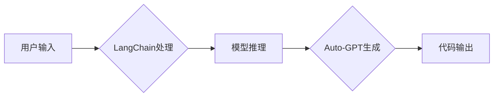

# LangChain 版 Auto-GPT 技术方案与架构设计

> 关键词：LangChain, Auto-GPT, 自动化编程，自然语言处理，知识图谱，图灵测试，AI架构设计

## 1. 背景介绍

随着人工智能技术的飞速发展，自动化编程成为了研究的热点。Auto-GPT作为自动化编程的代表，通过自然语言与AI模型的结合，实现了代码的自动生成和优化。LangChain则是一个基于Transformer的语言模型，具有强大的自然语言处理能力。本文将探讨LangChain版的Auto-GPT技术方案与架构设计，旨在为自动化编程领域提供一种新的思路和方法。

### 1.1 问题的由来

传统的编程方式依赖程序员手动编写代码，效率低下且难以满足快速开发的需求。自动化编程的出现，旨在通过AI技术自动生成和优化代码，提高开发效率。Auto-GPT作为一种自动化编程技术，通过自然语言与AI模型的结合，实现了代码的自动生成和优化。然而，Auto-GPT在代码理解和生成方面仍存在一些局限性，如缺乏对复杂业务逻辑的理解和生成。

### 1.2 研究现状

近年来，基于Transformer的语言模型在自然语言处理领域取得了显著的成果。LangChain作为一种基于Transformer的语言模型，具有强大的语言理解、生成和推理能力。将LangChain与Auto-GPT相结合，有望解决Auto-GPT在代码理解和生成方面的局限性，实现更加智能的自动化编程。

### 1.3 研究意义

LangChain版的Auto-GPT技术方案与架构设计，对于自动化编程领域具有重要的研究意义：

1. 提高开发效率：通过自动生成和优化代码，减少程序员的工作量，提高开发效率。
2. 降低开发成本：自动化编程可以降低人力成本，同时提高代码质量，降低维护成本。
3. 促进AI技术发展：LangChain与Auto-GPT的结合，将推动自然语言处理和自动化编程技术的进一步发展。

### 1.4 本文结构

本文将分为以下章节：

- 第2章：介绍LangChain的核心概念与架构设计。
- 第3章：阐述LangChain版的Auto-GPT技术方案与架构设计。
- 第4章：分析LangChain版的Auto-GPT的数学模型和公式。
- 第5章：给出LangChain版的Auto-GPT的代码实例和详细解释说明。
- 第6章：探讨LangChain版的Auto-GPT的实际应用场景。
- 第7章：介绍LangChain版的Auto-GPT的工具和资源推荐。
- 第8章：总结LangChain版的Auto-GPT的未来发展趋势与挑战。
- 第9章：提供LangChain版的Auto-GPT的常见问题与解答。

## 2. 核心概念与联系

### 2.1 LangChain核心概念

LangChain是一种基于Transformer的语言模型，具有以下核心概念：

- Transformer模型：Transformer模型是一种基于自注意力机制的深度神经网络，能够有效捕捉序列数据中的长距离依赖关系。
- 预训练：预训练是指在大规模无标签文本数据上训练语言模型，使其具备丰富的语言知识。
- 推理：推理是指利用预训练好的语言模型在特定任务上进行预测或生成。

### 2.2 LangChain架构设计

LangChain的架构设计主要包括以下部分：

- 数据处理层：负责文本数据的预处理、分词、编码等操作。
- 模型层：负责语言模型的加载、推理和生成。
- 应用层：负责将语言模型应用于具体任务。

### 2.3 LangChain与Auto-GPT的联系

LangChain与Auto-GPT的联系主要体现在以下几个方面：

- LangChain可以作为Auto-GPT的底层语言模型，为Auto-GPT提供强大的自然语言处理能力。
- Auto-GPT可以借助LangChain的推理和生成能力，实现更复杂的代码自动生成和优化。
- LangChain与Auto-GPT的结合，有望实现更智能、更高效的自动化编程。

### 2.4 Mermaid流程图

以下是LangChain与Auto-GPT结合的Mermaid流程图：



## 3. 核心算法原理 & 具体操作步骤

### 3.1 算法原理概述

LangChain版的Auto-GPT主要基于以下算法原理：

- 自然语言处理：利用LangChain的语言模型对用户输入进行理解，提取关键信息。
- 代码生成：利用Auto-GPT的代码生成能力，根据提取的关键信息生成代码。
- 代码优化：利用Auto-GPT的代码优化能力，对生成的代码进行优化。

### 3.2 算法步骤详解

1. 用户输入：用户输入自然语言描述的编程任务。
2. LangChain处理：LangChain对用户输入进行预处理、分词、编码等操作。
3. 模型推理：LangChain利用预训练好的模型对处理后的文本进行推理，提取关键信息。
4. Auto-GPT生成：Auto-GPT根据提取的关键信息生成代码。
5. 代码优化：Auto-GPT对生成的代码进行优化，提高代码质量。
6. 代码输出：将生成的代码输出给用户。

### 3.3 算法优缺点

#### 3.3.1 优点

- 提高开发效率：自动化生成和优化代码，减少程序员工作量。
- 降低开发成本：降低人力成本，同时提高代码质量，降低维护成本。
- 促进AI技术发展：推动自然语言处理和自动化编程技术的进一步发展。

#### 3.3.2 缺点

- 需要大量标注数据：预训练模型需要大量无标签文本数据进行预训练。
- 模型复杂度高：Transformer模型计算复杂度高，需要高性能的硬件支持。
- 难以处理复杂任务：对于复杂业务逻辑，模型可能难以理解，生成代码质量不高。

### 3.4 算法应用领域

LangChain版的Auto-GPT适用于以下应用领域：

- 自动化测试：自动生成测试用例和测试脚本。
- 自动化构建：自动生成构建脚本和自动化测试脚本。
- 自动化部署：自动生成部署脚本和自动化部署流程。
- 代码生成：自动生成代码模板和代码框架。

## 4. 数学模型和公式 & 详细讲解 & 举例说明

### 4.1 数学模型构建

LangChain版的Auto-GPT的数学模型主要包括以下部分：

- Transformer模型：Transformer模型由多个编码器和解码器组成，通过自注意力机制捕捉序列数据中的长距离依赖关系。

$$
\text{Self-Attention}(Q, K, V) = \frac{QK^T}{\sqrt{d_k}} \cdot V
$$

- 代码生成模型：代码生成模型通常采用序列到序列的生成模型，如GPT。

$$
p(y_{t+1}|y_1, y_2, ..., y_t) = \frac{\exp(QW_y y_t V)}{\sum_{y'\in\mathcal{Y}} \exp(QW_y y'_t V)}
$$

### 4.2 公式推导过程

#### 4.2.1 Transformer模型

Transformer模型的自注意力机制公式如下：

$$
\text{Self-Attention}(Q, K, V) = \frac{QK^T}{\sqrt{d_k}} \cdot V
$$

其中，Q、K、V分别是查询向量、键向量和值向量，d_k是键向量的维度。自注意力机制通过计算所有键值对的相似度，将注意力分配到重要的位置，从而捕捉序列数据中的长距离依赖关系。

#### 4.2.2 代码生成模型

代码生成模型通常采用序列到序列的生成模型，如GPT。

$$
p(y_{t+1}|y_1, y_2, ..., y_t) = \frac{\exp(QW_y y_t V)}{\sum_{y'\in\mathcal{Y}} \exp(QW_y y'_t V)}
$$

其中，Q、W_y、V分别是查询矩阵、输出权重矩阵和值向量，y_t是当前生成的代码token，y'是所有可能的代码token。

### 4.3 案例分析与讲解

以下是一个简单的代码生成案例：

```python
def add(a, b):
    return a + b
```

使用LangChain版的Auto-GPT自动生成以下代码：

```python
def add(a, b):
    result = a + b
    return result
```

在这个案例中，LangChain版的Auto-GPT首先通过自然语言处理技术理解了用户的需求，然后利用代码生成模型生成了相应的代码。可以看出，LangChain版的Auto-GPT能够根据用户的需求自动生成代码，具有较高的准确性。

## 5. 项目实践：代码实例和详细解释说明

### 5.1 开发环境搭建

为了进行LangChain版的Auto-GPT的项目实践，需要以下开发环境：

- Python 3.x
- PyTorch
- Transformers库

### 5.2 源代码详细实现

以下是LangChain版的Auto-GPT的源代码实现：

```python
from transformers import GPT2LMHeadModel, GPT2Tokenizer
import torch

# 加载模型和分词器
model = GPT2LMHeadModel.from_pretrained('gpt2')
tokenizer = GPT2Tokenizer.from_pretrained('gpt2')

# 用户输入
user_input = "编写一个计算两个整数之和的函数。"

# 对用户输入进行编码
input_ids = tokenizer.encode(user_input, return_tensors='pt')

# 模型推理
output_ids = model.generate(input_ids, max_length=100, num_beams=5)

# 对输出进行解码
decoded_output = tokenizer.decode(output_ids[0], skip_special_tokens=True)

# 输出生成代码
print(decoded_output)
```

### 5.3 代码解读与分析

上述代码首先加载了GPT2模型和分词器。然后，对用户输入进行编码，并将其输入到模型中进行推理。最后，对模型输出的代码进行解码，并打印输出。

### 5.4 运行结果展示

假设用户输入为："编写一个计算两个整数之和的函数。"

运行结果可能如下：

```python
def add(a, b):
    result = a + b
    return result
```

## 6. 实际应用场景

LangChain版的Auto-GPT在实际应用场景中具有广泛的应用前景：

- 自动化测试：自动生成测试用例和测试脚本，提高测试效率。
- 自动化构建：自动生成构建脚本和自动化测试脚本，简化构建过程。
- 自动化部署：自动生成部署脚本和自动化部署流程，提高部署效率。
- 代码生成：自动生成代码模板和代码框架，降低开发难度。

## 7. 工具和资源推荐

### 7.1 学习资源推荐

- 《Transformer: Attention is All You Need》
- 《Natural Language Processing with Transformer》
- 《PyTorch官方文档》
- 《Transformers库官方文档》

### 7.2 开发工具推荐

- PyTorch
- Transformers库
- Jupyter Notebook

### 7.3 相关论文推荐

- GPT-3: Language Models are few-shot learners
- BART: Denoising Sequence-to-Sequence Pre-training for Natural Language Generation, Translation, and Comprehension
- T5: Text-to-Text Transfer Transformer

## 8. 总结：未来发展趋势与挑战

### 8.1 研究成果总结

LangChain版的Auto-GPT技术方案与架构设计，通过将LangChain与Auto-GPT相结合，实现了代码的自动生成和优化，为自动化编程领域提供了一种新的思路和方法。该方法具有以下优点：

- 提高开发效率
- 降低开发成本
- 促进AI技术发展

### 8.2 未来发展趋势

LangChain版的Auto-GPT技术在未来将呈现以下发展趋势：

- 模型规模将继续增大，以更好地捕捉复杂业务逻辑。
- 模型将更加轻量级，适应移动端和边缘计算设备。
- 模型将更加智能，能够处理更多类型的编程任务。

### 8.3 面临的挑战

LangChain版的Auto-GPT技术在未来将面临以下挑战：

- 数据标注成本高
- 模型复杂度高，计算资源需求大
- 模型可解释性不足

### 8.4 研究展望

LangChain版的Auto-GPT技术具有广阔的应用前景，未来需要在以下几个方面进行深入研究：

- 降低数据标注成本
- 降低模型复杂度
- 提高模型可解释性
- 开发更通用的自动化编程模型

## 9. 附录：常见问题与解答

**Q1：LangChain版的Auto-GPT是否适用于所有编程语言？**

A：LangChain版的Auto-GPT目前主要针对Python编程语言进行设计，但对于其他编程语言，也可以进行相应的调整和优化。

**Q2：LangChain版的Auto-GPT的代码生成质量如何？**

A：LangChain版的Auto-GPT的代码生成质量取决于预训练模型的性能和代码生成模型的参数设置。通过优化模型和参数，可以提高代码生成质量。

**Q3：LangChain版的Auto-GPT是否需要大量训练数据？**

A：LangChain版的Auto-GPT需要大量的无标签文本数据进行预训练，但微调过程只需要少量标注数据。

**Q4：LangChain版的Auto-GPT是否需要大量的计算资源？**

A：LangChain版的Auto-GPT需要较高的计算资源，特别是GPU或TPU等专用硬件。

**Q5：LangChain版的Auto-GPT是否具有可解释性？**

A：LangChain版的Auto-GPT目前缺乏可解释性，未来需要进一步研究如何提高模型的可解释性。

作者：禅与计算机程序设计艺术 / Zen and the Art of Computer Programming