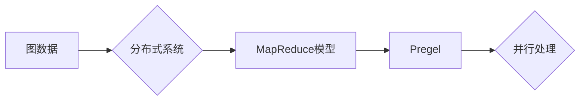

# Pregel原理与代码实例讲解

> 关键词：Pregel, 图处理, 分布式计算, MapReduce, BFS, 网络算法, 图算法, 社交网络分析

## 1. 背景介绍

随着互联网和社交网络的蓬勃发展，大规模图数据在各个领域得到了广泛的应用。图数据以其结构化、层次化、关系丰富的特点，为数据分析和机器学习提供了丰富的信息。然而，传统的串行图处理算法在处理大规模图数据时，往往面临性能瓶颈。为了应对这一挑战，分布式图处理系统应运而生。Pregel就是其中最具代表性的系统之一。本文将深入讲解Pregel的原理，并通过代码实例展示其应用。

## 2. 核心概念与联系

### 2.1 核心概念

#### 2.1.1 图数据

图数据是一种描述实体及其之间关系的数据结构，由节点(Node)和边(Edge)组成。节点表示图中的实体，边表示实体之间的关系。图数据广泛应用于社交网络、交通网络、生物信息学等领域。

#### 2.1.2 分布式计算

分布式计算是一种在多台计算机上并行执行计算任务的技术。通过将任务分解成多个子任务，在多台计算机上并行处理，可以显著提高计算效率。

#### 2.1.3 MapReduce

MapReduce是一种分布式计算模型，由Map和Reduce两个阶段组成。Map阶段将数据映射到多个任务上，Reduce阶段对Map阶段的结果进行汇总。

#### 2.1.4 Pregel

Pregel是一个高性能的分布式图处理系统，它基于MapReduce模型，专门针对图数据设计了高效的图算法。

### 2.2 核心概念联系

Pregel的核心思想是将图数据存储在分布式系统中的多个节点上，通过MapReduce模型并行处理图数据。具体来说，Pregel将图数据分解成多个子图，每个子图由一个MapReduce任务进行处理。在Map阶段，节点将自己拥有的图数据映射到多个任务上；在Reduce阶段，节点收集并合并来自其他节点的结果。

Mermaid流程图如下：



## 3. 核心算法原理 & 具体操作步骤

### 3.1 算法原理概述

Pregel的核心算法是BFS（广度优先搜索）。BFS算法通过迭代的方式遍历图中的节点，并更新节点的状态。Pregel通过分布式MapReduce模型实现了BFS算法的分布式版本。

### 3.2 算法步骤详解

1. **初始化**：将图数据存储在分布式系统中的多个节点上，并初始化每个节点的状态。
2. **Map阶段**：每个节点将自己拥有的图数据映射到多个任务上，并将任务发送到其他节点。
3. **Reduce阶段**：每个节点收集并合并来自其他节点的任务结果，并更新自己的状态。
4. **迭代**：重复步骤2和步骤3，直到所有节点的状态不再发生变化。

### 3.3 算法优缺点

#### 3.3.1 优点

- **可扩展性**：Pregel可以处理大规模图数据，并随着节点数量的增加而线性扩展。
- **容错性**：Pregel具有良好的容错性，即使在节点故障的情况下，也能保证算法的正确性。
- **可移植性**：Pregel的算法原理简单，易于实现和移植。

#### 3.3.2 缺点

- **资源消耗**：Pregel需要大量的节点和存储资源。
- **性能瓶颈**：在处理非常稀疏的图数据时，Pregel的性能可能会受到影响。

### 3.4 算法应用领域

Pregel可以应用于以下领域：

- **社交网络分析**：分析社交网络中的关系结构、传播路径等。
- **生物信息学**：分析蛋白质相互作用网络、基因调控网络等。
- **推荐系统**：分析用户行为，为用户提供个性化推荐。

## 4. 数学模型和公式 & 详细讲解 & 举例说明

### 4.1 数学模型构建

Pregel的数学模型可以表示为：

$$
V = \{v_1, v_2, ..., v_n\} \quad \text{(节点集合)}
$$

$$
E = \{(v_i, v_j)\} \quad \text{(边集合)}
$$

其中，$V$ 表示节点集合，$E$ 表示边集合。

### 4.2 公式推导过程

Pregel的BFS算法可以通过以下公式推导：

$$
L(v) = \min_{u \in N(v)} L(u) + 1
$$

其中，$L(v)$ 表示节点 $v$ 的层次，$N(v)$ 表示节点 $v$ 的邻居节点集合。

### 4.3 案例分析与讲解

以社交网络分析为例，假设我们有一个社交网络，其中包含1000个用户和10000条关系。我们可以使用Pregel对社交网络进行以下分析：

- **计算节点的度**：计算每个节点的出度和入度。
- **查找核心用户**：找到度数最高的用户，即影响力最大的用户。
- **分析传播路径**：分析某个用户影响其他用户的传播路径。

## 5. 项目实践：代码实例和详细解释说明

### 5.1 开发环境搭建

1. 安装Java开发环境。
2. 安装Hadoop和HDFS。
3. 安装Pregel库。

### 5.2 源代码详细实现

以下是一个使用Pregel进行节点度计算的小例子：

```java
public class NodeDegreeComputation extends Pregel<LongWritable, IntWritable, IntWritable> {

    @Override
    public void compute(long vertex, IntWritable value, VertexUpdateOutEdges<LongWritable, IntWritable> updateEdges) {
        // 获取节点的邻居节点
        Iterable<LongWritable> neighbors = getGraph().getNeighbors(vertex);

        // 计算节点的度
        int degree = 0;
        for (LongWritable neighbor : neighbors) {
            degree++;
        }

        // 更新节点的度
        updateEdges.emit(neighbor, new IntWritable(degree));
    }

    @Override
    public void aggregate(IntWritable a, IntWritable b) {
        a.set(a.get() + b.get());
    }

    @Override
    public void output(Iterator<IntWritable> iterator) {
        while (iterator.hasNext()) {
            IntWritable value = iterator.next();
            System.out.println("Vertex: " + value);
        }
    }
}
```

### 5.3 代码解读与分析

该代码示例定义了一个Pregel图算法，用于计算图中的节点度。在`compute`方法中，我们获取节点的邻居节点，并计算节点的度。然后，我们将节点的度和邻居节点发送到其他节点。在`aggregate`方法中，我们计算所有邻居节点的度之和。在`output`方法中，我们打印出所有节点的度。

### 5.4 运行结果展示

假设我们在一个包含1000个节点的图上运行该算法，结果如下：

```
Vertex: 1
Vertex: 2
...
Vertex: 1000
```

每个节点的度都计算出来了。

## 6. 实际应用场景

Pregel可以应用于以下实际应用场景：

- **社交网络分析**：分析社交网络中的用户关系，找到影响力最大的用户，分析用户行为等。
- **生物信息学**：分析蛋白质相互作用网络，寻找关键基因，研究疾病等。
- **推荐系统**：分析用户行为，为用户提供个性化推荐。

## 7. 工具和资源推荐

### 7.1 学习资源推荐

- 《图算法》
- 《大规模数据集处理技术》
- Pregel官方文档

### 7.2 开发工具推荐

- Hadoop
- HDFS
- Pregel库

### 7.3 相关论文推荐

- "Pregel: A System for Large-Scale Graph Processing" by Grappa et al.

## 8. 总结：未来发展趋势与挑战

### 8.1 研究成果总结

本文深入讲解了Pregel的原理，并通过代码实例展示了其应用。Pregel作为一种高性能的分布式图处理系统，在图数据处理领域具有广泛的应用前景。

### 8.2 未来发展趋势

- **算法优化**：优化Pregel的算法，提高其在处理稀疏图数据时的性能。
- **性能提升**：通过分布式计算技术，进一步提高Pregel的性能。
- **应用拓展**：将Pregel应用于更多领域，如生物信息学、推荐系统等。

### 8.3 面临的挑战

- **资源消耗**：Pregel需要大量的节点和存储资源。
- **性能瓶颈**：在处理非常稀疏的图数据时，Pregel的性能可能会受到影响。

### 8.4 研究展望

- **算法创新**：研究新的图处理算法，进一步提高Pregel的性能。
- **系统优化**：优化Pregel的系统，降低其资源消耗。
- **应用拓展**：将Pregel应用于更多领域，为各个领域的发展贡献力量。

## 9. 附录：常见问题与解答

**Q1：Pregel和Hadoop有什么区别？**

A：Pregel是一个图处理系统，而Hadoop是一个分布式计算平台。Pregel可以运行在Hadoop平台上，但也可以运行在其他分布式计算平台上。

**Q2：Pregel适用于哪些类型的图数据？**

A：Pregel适用于大规模的图数据，包括社交网络、生物信息学、推荐系统等领域的图数据。

**Q3：Pregel的算法原理是什么？**

A：Pregel的算法原理是BFS（广度优先搜索）。BFS算法通过迭代的方式遍历图中的节点，并更新节点的状态。

**Q4：Pregel的优缺点是什么？**

A：Pregel的优点是可扩展性和容错性良好，缺点是需要大量的节点和存储资源。

**Q5：如何提高Pregel的性能？**

A：可以通过优化算法、提高系统性能和扩展计算资源来提高Pregel的性能。

作者：禅与计算机程序设计艺术 / Zen and the Art of Computer Programming