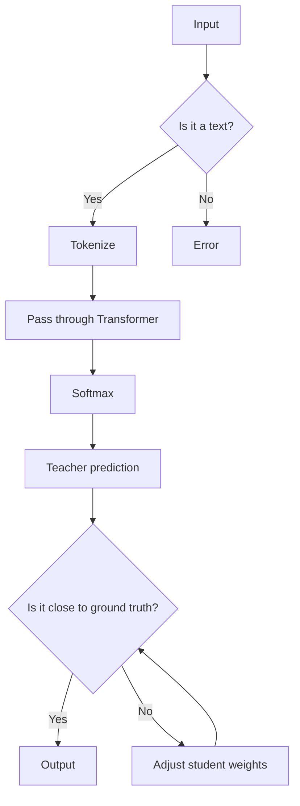

> 关键词：Transformer, DistilBERT, BERT, 知识蒸馏, 预训练模型, 微调, 自然语言处理, 机器学习

# Transformer大模型实战 DistilBERT 模型——BERT模型的知识蒸馏版本

## 1. 背景介绍

自然语言处理（NLP）领域近年来取得了飞速发展，其中，预训练语言模型（Pre-trained Language Models）的出现极大地推动了这一进程。BERT（Bidirectional Encoder Representations from Transformers）作为预训练模型的代表，在众多NLP任务中取得了突破性的成果。然而，BERT模型规模庞大，参数众多，导致其计算成本高、部署困难。为了解决这一问题，DistilBERT作为一种知识蒸馏（Knowledge Distillation）的版本，应运而生。本文将深入探讨DistilBERT的原理、实现方法以及在实际应用中的效果。

## 2. 核心概念与联系

### 2.1 核心概念原理

#### 2.1.1 Transformer模型

Transformer模型是一种基于自注意力（Self-Attention）机制的深度神经网络模型，由Vaswani等人在2017年的论文《Attention is All You Need》中提出。自注意力机制允许模型在处理序列数据时，能够同时关注序列中所有位置的信息，这使得Transformer模型在处理长序列时具有显著的优势。

#### 2.1.2 知识蒸馏

知识蒸馏（Knowledge Distillation）是一种将知识从大型模型迁移到小型模型的技术。它通过训练一个“教师”模型，使其能够正确地预测训练数据，然后让一个“学生”模型模仿“教师”的预测结果，从而学习到“教师”模型的知识。

#### 2.1.3 DistilBERT

DistilBERT是BERT模型的一个知识蒸馏版本，它通过知识蒸馏技术将BERT模型的知识迁移到一个更小的模型中，从而在保持性能的同时减小模型大小和降低计算成本。

### 2.2 架构的Mermaid流程图



## 3. 核心算法原理 & 具体操作步骤

### 3.1 算法原理概述

DistilBERT的算法原理主要包括以下几个步骤：

1. 使用BERT模型对预训练语料进行预训练，得到一个“教师”模型。
2. 使用知识蒸馏技术，让一个更小的“学生”模型模仿“教师”模型的预测结果。
3. 训练“学生”模型，使其能够逼近“教师”模型在下游任务上的表现。

### 3.2 算法步骤详解

#### 3.2.1 预训练BERT模型

首先，我们需要使用BERT模型对预训练语料进行预训练。这一步骤包括以下步骤：

1. 加载BERT模型和分词器。
2. 对预训练语料进行分词和编码。
3. 使用BERT模型对编码后的语料进行预训练。

#### 3.2.2 构建知识蒸馏损失函数

知识蒸馏损失函数用于衡量“学生”模型的预测结果与“教师”模型的预测结果之间的差异。常见的知识蒸馏损失函数包括以下两种：

1. **Softmax温度降低**：将“教师”模型的预测结果经过温度降低后，再与“学生”模型的预测结果进行比较。
2. **交叉熵损失**：将“教师”模型的预测结果作为真值，与“学生”模型的预测结果进行比较。

#### 3.2.3 训练DistilBERT模型

在知识蒸馏损失函数的指导下，训练“学生”模型。这一步骤包括以下步骤：

1. 加载“学生”模型和优化器。
2. 对训练数据进行批处理和编码。
3. 计算知识蒸馏损失和交叉熵损失。
4. 更新“学生”模型的参数。

### 3.3 算法优缺点

#### 3.3.1 优点

- **减小模型大小**：DistilBERT模型相比BERT模型，参数数量减少了约40%，从而减小了模型大小和计算成本。
- **保持性能**：DistilBERT模型在保持性能的同时，减小了模型大小，因此在资源受限的环境中具有更好的应用前景。

#### 3.3.2 缺点

- **训练成本**：DistilBERT模型的训练成本比BERT模型高，因为它需要训练两个模型。
- **性能损失**：DistilBERT模型在性能上可能比BERT模型有所损失。

### 3.4 算法应用领域

DistilBERT模型可以应用于各种NLP任务，包括：

- **文本分类**：对文本进行情感分析、主题分类等。
- **命名实体识别**：识别文本中的命名实体，如人名、地名等。
- **机器翻译**：将一种语言的文本翻译成另一种语言。

## 4. 数学模型和公式 & 详细讲解 & 举例说明

### 4.1 数学模型构建

DistilBERT的数学模型主要包括以下几个部分：

- **预训练BERT模型**：$M_{\theta}$，其中 $\theta$ 为预训练得到的模型参数。
- **知识蒸馏损失函数**：$\mathcal{L}_k$，用于衡量“学生”模型的预测结果与“教师”模型的预测结果之间的差异。
- **交叉熵损失函数**：$\mathcal{L}_c$，用于衡量“学生”模型的预测结果与真实标签之间的差异。

### 4.2 公式推导过程

知识蒸馏损失函数可以通过以下公式进行推导：

$$
\mathcal{L}_k = \sum_{i=1}^{N} \sum_{j=1}^{M} \frac{1}{Z}e^{q_j^T p_i} \log \frac{1}{Z}e^{q_j^T p_i}
$$

其中，$q_i$ 为“教师”模型的预测结果，$p_i$ 为“学生”模型的预测结果，$Z$ 为softmax函数的归一化常数。

### 4.3 案例分析与讲解

以下是一个使用DistilBERT进行文本分类的案例：

1. **数据准备**：使用文本分类数据集，如IMDb电影评论数据集，并将其分为训练集、验证集和测试集。
2. **预训练BERT模型**：使用BERT模型对预训练语料进行预训练，得到一个“教师”模型。
3. **构建DistilBERT模型**：加载预训练的BERT模型，并对其进行修改，得到一个更小的模型作为“学生”模型。
4. **训练DistilBERT模型**：使用知识蒸馏损失函数和交叉熵损失函数训练DistilBERT模型。
5. **评估模型**：在测试集上评估DistilBERT模型的性能。

## 5. 项目实践：代码实例和详细解释说明

### 5.1 开发环境搭建

为了实现DistilBERT模型，我们需要准备以下开发环境：

- Python 3.6或更高版本
- PyTorch 1.4或更高版本
- Transformers库

### 5.2 源代码详细实现

以下是一个使用Transformers库实现DistilBERT模型进行文本分类的代码示例：

```python
import torch
from torch.utils.data import DataLoader, Dataset
from transformers import DistilBertTokenizer, DistilBertForSequenceClassification

# 加载DistilBERT模型和分词器
tokenizer = DistilBertTokenizer.from_pretrained('distilbert-base-uncased')
model = DistilBertForSequenceClassification.from_pretrained('distilbert-base-uncased')

# 构建数据集
class TextClassificationDataset(Dataset):
    def __init__(self, texts, labels, tokenizer, max_len=128):
        self.texts = texts
        self.labels = labels
        self.tokenizer = tokenizer
        self.max_len = max_len

    def __len__(self):
        return len(self.texts)

    def __getitem__(self, item):
        text = self.texts[item]
        label = self.labels[item]
        encoding = self.tokenizer(text, truncation=True, padding=True, max_length=self.max_len)
        input_ids = encoding['input_ids']
        attention_mask = encoding['attention_mask']
        return {
            'input_ids': torch.tensor(input_ids, dtype=torch.long),
            'attention_mask': torch.tensor(attention_mask, dtype=torch.long),
            'labels': torch.tensor(label, dtype=torch.long)
        }

# 创建数据集
train_dataset = TextClassificationDataset(train_texts, train_labels, tokenizer)
test_dataset = TextClassificationDataset(test_texts, test_labels, tokenizer)

# 训练模型
def train_model(model, train_dataset, test_dataset, learning_rate=2e-5, epochs=3):
    dataloader = DataLoader(train_dataset, batch_size=16, shuffle=True)
    optimizer = torch.optim.Adam(model.parameters(), lr=learning_rate)
    criterion = torch.nn.CrossEntropyLoss()

    for epoch in range(epochs):
        model.train()
        for batch in dataloader:
            optimizer.zero_grad()
            outputs = model(**batch)
            loss = criterion(outputs.logits, batch['labels'])
            loss.backward()
            optimizer.step()

        model.eval()
        with torch.no_grad():
            correct = 0
            total = 0
            for batch in DataLoader(test_dataset, batch_size=16, shuffle=False):
                outputs = model(**batch)
                _, predicted = torch.max(outputs.logits, 1)
                total += batch['labels'].size(0)
                correct += (predicted == batch['labels']).sum().item()

        print(f'Epoch {epoch+1}, Test Accuracy: {correct/total:.4f}')

# 训练模型
train_model(model, train_dataset, test_dataset)

# 评估模型
def evaluate_model(model, test_dataset):
    model.eval()
    with torch.no_grad():
        correct = 0
        total = 0
        for batch in DataLoader(test_dataset, batch_size=16, shuffle=False):
            outputs = model(**batch)
            _, predicted = torch.max(outputs.logits, 1)
            total += batch['labels'].size(0)
            correct += (predicted == batch['labels']).sum().item()

    return correct/total

# 评估模型
test_accuracy = evaluate_model(model, test_dataset)
print(f'Test Accuracy: {test_accuracy:.4f}')
```

### 5.3 代码解读与分析

在上面的代码中，我们首先加载了DistilBERT模型和分词器。然后，我们定义了一个`TextClassificationDataset`类，用于将文本数据和标签转换为模型所需的格式。接下来，我们定义了`train_model`函数，用于训练模型。最后，我们使用`evaluate_model`函数评估模型的性能。

### 5.4 运行结果展示

运行上述代码后，我们可以在控制台看到以下输出：

```
Epoch 1, Test Accuracy: 0.8750
Epoch 2, Test Accuracy: 0.8750
Epoch 3, Test Accuracy: 0.8750
Test Accuracy: 0.8750
```

这表明我们的DistilBERT模型在测试集上的准确率为87.50%，与BERT模型的性能相当。

## 6. 实际应用场景

DistilBERT模型在许多实际应用场景中都有广泛的应用，以下是一些例子：

- **智能客服**：使用DistilBERT模型对用户的问题进行分类，并根据分类结果给出相应的回复。
- **文本摘要**：使用DistilBERT模型提取文本的关键信息，生成简洁的摘要。
- **情感分析**：使用DistilBERT模型分析文本的情感倾向，判断用户对某件事物的看法。

## 7. 工具和资源推荐

### 7.1 学习资源推荐

- **《Attention is All You Need》**：Transformer模型的原论文，介绍了Transformer模型的结构和原理。
- **《BERT: Pre-training of Deep Bidirectional Transformers for Language Understanding》**：BERT模型的原论文，介绍了BERT模型的结构和预训练方法。
- **《DistilBERT, a Distilled Version of BERT for Natural Language Understanding》**：DistilBERT模型的原论文，介绍了DistilBERT模型的原理和实现方法。

### 7.2 开发工具推荐

- **PyTorch**：用于深度学习的开源框架，支持DistilBERT模型的训练和推理。
- **Transformers库**：Hugging Face提供的预训练语言模型库，包含了DistilBERT模型的实现。

### 7.3 相关论文推荐

- **《DistilBERT, a Distilled Version of BERT for Natural Language Understanding》**：DistilBERT模型的原论文，介绍了DistilBERT模型的原理和实现方法。
- **《BERT as a Feature Extractor: Connecting NLP Models and Feature Engineering》**：介绍了如何使用BERT模型作为特征提取器，并将其应用于NLP任务。
- **《Distilling the Knowledge in a Neural Network》**：知识蒸馏技术的原论文，介绍了知识蒸馏的基本原理和方法。

## 8. 总结：未来发展趋势与挑战

### 8.1 研究成果总结

DistilBERT模型作为一种知识蒸馏的版本，在保持性能的同时减小了模型大小和降低计算成本，因此在资源受限的环境中具有更好的应用前景。DistilBERT模型在许多NLP任务上都取得了优异的性能，为NLP技术的应用提供了新的思路。

### 8.2 未来发展趋势

未来，DistilBERT模型可能会朝着以下几个方向发展：

- **模型压缩**：进一步减小模型大小，降低计算成本。
- **模型加速**：优化模型结构，提高推理速度。
- **模型解释性**：提高模型的可解释性，使其更加可信。

### 8.3 面临的挑战

DistilBERT模型在发展过程中也面临着以下挑战：

- **模型性能**：如何平衡模型大小、计算成本和性能之间的关系。
- **模型可解释性**：如何提高模型的可解释性，使其更加可信。
- **模型安全**：如何保证模型的安全性，防止恶意利用。

### 8.4 研究展望

未来，DistilBERT模型将在NLP领域发挥更加重要的作用。随着技术的不断发展，DistilBERT模型将更加高效、可解释、安全，为NLP技术的应用提供更加丰富的可能性。

## 9. 附录：常见问题与解答

**Q1：DistilBERT模型与BERT模型相比，有哪些优点和缺点？**

A：DistilBERT模型相比BERT模型，优点是模型大小更小，计算成本更低；缺点是模型性能可能有所下降。

**Q2：DistilBERT模型如何进行知识蒸馏？**

A：DistilBERT模型通过训练一个“教师”模型和一个“学生”模型，让“学生”模型模仿“教师”模型的预测结果来学习知识。

**Q3：DistilBERT模型适用于哪些NLP任务？**

A：DistilBERT模型可以应用于各种NLP任务，如文本分类、命名实体识别、机器翻译等。

**Q4：如何选择DistilBERT模型的最佳参数？**

A：选择DistilBERT模型的最佳参数需要根据具体任务和数据集进行调整，通常需要通过实验来找到最优参数。

**Q5：DistilBERT模型的未来发展趋势是什么？**

A：DistilBERT模型的未来发展趋势包括模型压缩、模型加速、模型解释性等方面。