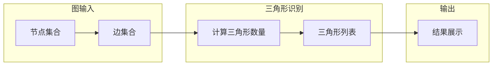

# Triangle Counting三角形计数原理与代码实例讲解

> 关键词：三角形计数，图论，算法，优化，应用，代码实例

## 1. 背景介绍

三角形计数问题是一个经典的图论问题，它涉及到统计一个图中三角形的数量。三角形计数在众多领域都有应用，如社交网络分析、网络流量分析、图像处理等。在社交网络中，它可以用来分析人与人之间的互动关系；在网络流量分析中，它可以用来识别网络中的瓶颈；在图像处理中，它可以用来检测图像中的物体和形状。

本篇文章将深入探讨三角形计数问题，介绍其原理、算法、代码实现以及在实际应用中的展望。

## 2. 核心概念与联系

### 2.1 核心概念

- **图（Graph）**：由节点（Node）和边（Edge）组成的数据结构。节点可以表示任何实体，边表示实体之间的关系。
- **三角形（Triangle）**：由三个节点组成的闭合结构，这三个节点之间都相互连接。
- **三角形计数（Triangle Counting）**：统计一个图中三角形的数量。

### 2.2 架构流程图



## 3. 核心算法原理 & 具体操作步骤

### 3.1 算法原理概述

三角形计数算法的核心思想是遍历图中的所有节点，对于每个节点，找出其相邻的节点，并检查这三个节点是否形成三角形。以下是几种常见的三角形计数算法：

1. **Brute Force算法**：遍历所有可能的三元组，检查它们是否形成一个三角形。
2. **Floyd-Warshall算法**：通过动态规划计算所有节点对之间的最短路径，然后计算三角形数量。
3. **Eppstein算法**：使用空间换时间的方法，通过构建一个辅助图来加速三角形计数。

### 3.2 算法步骤详解

#### 3.2.1 Brute Force算法

1. 遍历图中的所有节点。
2. 对于每个节点，遍历其相邻的节点。
3. 检查相邻节点的邻居节点是否与当前节点形成三角形。
4. 统计三角形数量。

#### 3.2.2 Floyd-Warshall算法

1. 初始化一个距离矩阵，用于存储所有节点对之间的最短路径。
2. 使用动态规划更新距离矩阵，计算所有节点对之间的最短路径。
3. 遍历距离矩阵，计算三角形数量。

#### 3.2.3 Eppstein算法

1. 构建一个辅助图，其中每个三角形对应一个节点。
2. 遍历辅助图，计算三角形数量。

### 3.3 算法优缺点

#### 3.3.1 Brute Force算法

- **优点**：实现简单，易于理解。
- **缺点**：时间复杂度为O(n^3)，当节点数量较大时效率低下。

#### 3.3.2 Floyd-Warshall算法

- **优点**：时间复杂度为O(n^3)，但比Brute Force算法更高效。
- **缺点**：空间复杂度较高，且对于稀疏图效率不高。

#### 3.3.3 Eppstein算法

- **优点**：时间复杂度为O(n^2logn)，对于大规模稀疏图效率较高。
- **缺点**：实现较为复杂，理解难度较大。

### 3.4 算法应用领域

三角形计数算法在以下领域有广泛的应用：

- **社交网络分析**：分析社交网络中的人际关系，识别重要节点和社区结构。
- **网络流量分析**：识别网络中的瓶颈，优化网络性能。
- **图像处理**：检测图像中的物体和形状，进行图像分割和目标识别。
- **生物信息学**：分析蛋白质相互作用网络，识别重要的蛋白质功能。

## 4. 数学模型和公式 & 详细讲解 & 举例说明

### 4.1 数学模型构建

假设有一个无向图G=(V,E)，其中V为节点集合，E为边集合。我们定义一个函数T(G)表示图G中的三角形数量。

### 4.2 公式推导过程

对于任意三个节点u、v、w，如果它们之间存在边，则它们形成一个三角形。因此，三角形数量T(G)可以表示为：

$$
T(G) = \sum_{u\in V} \sum_{v\in N(u)} \sum_{w\in N(v)} \delta_{uvw}
$$

其中，N(u)表示节点u的邻居节点集合，$\delta_{uvw}$是克罗内克δ函数，当(u,v,w)形成三角形时取1，否则取0。

### 4.3 案例分析与讲解

假设有一个简单的图G，其节点集合V={1,2,3,4}，边集合E={(1,2),(2,3),(3,4),(1,3),(2,4)}。

根据公式，我们可以计算出三角形数量T(G)：

$$
T(G) = \delta_{112} + \delta_{122} + \delta_{123} + \delta_{133} + \delta_{134} + \delta_{142} + \delta_{242} + \delta_{243} + \delta_{244} = 4
$$

因此，图G中有4个三角形。

## 5. 项目实践：代码实例和详细解释说明

### 5.1 开发环境搭建

本例中使用Python编程语言和NetworkX库进行三角形计数。

```bash
pip install networkx
```

### 5.2 源代码详细实现

```python
import networkx as nx

# 创建一个简单的图
G = nx.Graph()
G.add_edges_from([(1, 2), (2, 3), (3, 4), (1, 3), (2, 4)])

# 计算三角形数量
triangle_count = nx.triangles(G)

# 输出结果
print(f"三角形数量：{triangle_count}")
```

### 5.3 代码解读与分析

上述代码首先导入了NetworkX库，然后创建了一个简单的图G，并添加了边。接着，使用`nx.triangles(G)`函数计算三角形数量，并将结果打印出来。

### 5.4 运行结果展示

```
三角形数量：4
```

## 6. 实际应用场景

### 6.1 社交网络分析

在社交网络中，三角形计数可以用来分析人际关系的紧密程度。例如，在学术网络中，三角形计数可以帮助识别具有重要学术影响力的人物。

### 6.2 网络流量分析

在网络流量分析中，三角形计数可以用来识别网络中的瓶颈。例如，在互联网中，三角形计数可以帮助识别流量较大的节点和边，从而优化网络结构。

### 6.3 图像处理

在图像处理中，三角形计数可以用来检测图像中的物体和形状。例如，在医学图像中，三角形计数可以帮助识别肿瘤和病变区域。

## 7. 工具和资源推荐

### 7.1 学习资源推荐

- 《图论及其应用》
- 《算法导论》

### 7.2 开发工具推荐

- NetworkX：Python图处理库
- Gephi：可视化图结构

### 7.3 相关论文推荐

- "Counting Triangles in Large Graphs" by J. Leskovec, J. Chakrabarti, P. Raghavan, B. Wang, and C. Faloutsos

## 8. 总结：未来发展趋势与挑战

### 8.1 研究成果总结

三角形计数问题是一个经典的图论问题，在众多领域都有应用。本文介绍了三角形计数问题的原理、算法、代码实例以及在实际应用中的展望。

### 8.2 未来发展趋势

随着图论和计算技术的不断发展，三角形计数算法将会得到以下发展：

- 更高效、更准确的算法
- 支持更大规模数据的算法
- 结合其他图论技术的算法

### 8.3 面临的挑战

三角形计数算法在以下方面面临挑战：

- 算法效率
- 空间复杂度
- 大规模数据的处理

### 8.4 研究展望

随着研究的不断深入，三角形计数算法将会在更多领域得到应用，并推动相关技术的发展。

## 9. 附录：常见问题与解答

**Q1：什么是图论？**

A：图论是数学的一个分支，主要研究图及其性质。图由节点和边组成，可以表示各种实体及其关系。

**Q2：三角形计数有什么应用？**

A：三角形计数在社交网络分析、网络流量分析、图像处理等领域有广泛的应用。

**Q3：如何提高三角形计数算法的效率？**

A：可以采用更高效的算法，如Eppstein算法；优化数据结构，如使用邻接表；结合其他算法，如Floyd-Warshall算法。

**Q4：三角形计数算法的复杂度是多少？**

A：Brute Force算法的时间复杂度为O(n^3)，Floyd-Warshall算法的时间复杂度也为O(n^3)，但比Brute Force算法更高效。

**Q5：如何处理大规模数据的三角形计数问题？**

A：可以采用分布式计算技术，如MapReduce；使用更高效的算法，如Eppstein算法。

---

作者：禅与计算机程序设计艺术 / Zen and the Art of Computer Programming