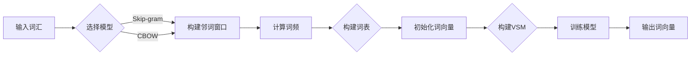

# Word2Vec原理与代码实例讲解

> 关键词：Word2Vec, 词向量, 词嵌入, 分布式表示, Skip-gram, CBOW, Gensim, NLP

## 1. 背景介绍

自然语言处理（NLP）领域的研究一直致力于将人类语言这种复杂的信息载体转化为计算机能够理解和处理的形式。在早期，研究者们尝试使用字符串匹配、语法规则等简单的方法来处理语言数据，但这些方法难以捕捉到语言中的语义信息。随着深度学习技术的发展，词向量（Word Embeddings）应运而生，为NLP带来了革命性的变化。Word2Vec算法是词向量领域最具代表性的算法之一，它能够将词汇映射到高维空间中的向量，使得词向量具有了语义相似性、距离度量等性质，极大地促进了NLP技术的发展。本文将深入讲解Word2Vec的原理，并通过代码实例展示其实现过程。

## 2. 核心概念与联系

### 2.1 词向量

词向量是将词汇映射到固定维度的向量空间中的表示方法，它能够捕捉词汇的语义和语法信息。词向量有以下特点：

- **分布式表示**：词向量不再是单个数值，而是多维向量，能够表示词汇的复杂特征。
- **语义相似性**：语义相似的词汇在向量空间中距离较近。
- **距离度量**：词向量之间的距离可以用来衡量词汇的相似度。

### 2.2 Mermaid 流程图

以下是Word2Vec算法的核心流程的Mermaid流程图：



### 2.3 关系图

Word2Vec算法与词向量、分布式表示、Skip-gram、CBOW等概念之间的联系如下：

- **词向量**是Word2Vec算法输出的结果，它将词汇映射到向量空间。
- **分布式表示**是词向量的基本特性，它使得词向量能够捕捉词汇的复杂特征。
- **Skip-gram**和**CBOW**是Word2Vec算法中的两种模型，它们分别通过预测上下文和预测中心词来学习词向量。
- **Gensim**是一个用于NLP任务的Python库，它提供了Word2Vec算法的实现。

## 3. 核心算法原理 & 具体操作步骤

### 3.1 算法原理概述

Word2Vec算法主要有两种模型：Skip-gram和CBOW。

- **Skip-gram模型**：预测给定词汇的上下文词汇。
- **CBOW模型**：预测给定词汇的上下文。

两种模型都使用负采样技术来加速训练过程。

### 3.2 算法步骤详解

#### 3.2.1 Skip-gram模型

1. 构建邻词窗口：对于每个词汇，随机选择其上下文词汇，形成邻词窗口。
2. 计算词频：统计每个词汇出现的频率，用于调整学习率。
3. 初始化词向量：随机初始化所有词汇的词向量。
4. 构建词汇-词汇矩阵（VSM）：将词汇映射到向量空间。
5. 训练模型：使用负采样技术，通过梯度下降更新词向量。
6. 输出词向量：训练完成后，输出所有词汇的词向量。

#### 3.2.2 CBOW模型

1. 构建邻词窗口：与Skip-gram模型类似。
2. 计算词频：与Skip-gram模型类似。
3. 初始化词向量：与Skip-gram模型类似。
4. 构建词汇-词汇矩阵（VSM）：与Skip-gram模型类似。
5. 训练模型：使用负采样技术，通过梯度下降更新词向量。
6. 输出词向量：训练完成后，输出所有词汇的词向量。

### 3.3 算法优缺点

#### 3.3.1 优点

- **捕捉语义信息**：Word2Vec能够捕捉词汇的语义和语法信息，使得词向量具有语义相似性和距离度量等性质。
- **高效性**：Word2Vec算法使用负采样技术，可以加速训练过程。
- **可扩展性**：Word2Vec算法可以处理大规模语料库。

#### 3.3.2 缺点

- **稀疏性**：词向量是高维稀疏向量，可能存在很多零值。
- **可解释性**：词向量的内部结构难以解释。

## 4. 数学模型和公式 & 详细讲解 & 举例说明

### 4.1 数学模型构建

Word2Vec算法的核心数学模型是神经网络。以下以Skip-gram模型为例进行讲解。

#### 4.1.1 神经网络结构

Skip-gram模型的神经网络结构如下：

```
[输入层] ----> [隐藏层] ----> [输出层]
```

- **输入层**：输入词汇的词向量。
- **隐藏层**：神经网络的核心部分，负责学习词汇的表示。
- **输出层**：预测上下文词汇的词向量。

#### 4.1.2 损失函数

Skip-gram模型的损失函数是负对数似然损失：

$$
L(\theta) = -\sum_{x \in X} \sum_{y \in C(x)} \log p(y|x)
$$

其中，$X$ 是词汇集，$C(x)$ 是词汇 $x$ 的上下文词汇集合，$p(y|x)$ 是预测上下文词汇 $y$ 的概率。

#### 4.1.3 梯度下降

使用梯度下降算法更新词向量：

$$
\theta_{t+1} = \theta_t - \eta \nabla_{\theta_t} L(\theta_t)
$$

其中，$\theta_t$ 是当前参数，$\eta$ 是学习率，$\nabla_{\theta_t} L(\theta_t)$ 是损失函数对参数的梯度。

### 4.2 公式推导过程

以下以Skip-gram模型为例，推导负对数似然损失函数的梯度。

假设神经网络输出层的激活函数为softmax，则：

$$
p(y|x) = \frac{\exp(z_y)}{\sum_{k=1}^{K} \exp(z_k)}
$$

其中，$z_k = w_k^T v_x$，$w_k$ 是输出层第 $k$ 个神经元权重，$v_x$ 是输入层词向量。

对 $z_y$ 求对数：

$$
\log p(y|x) = \log \left(\frac{\exp(z_y)}{\sum_{k=1}^{K} \exp(z_k)}\right) = z_y - \log \left(\sum_{k=1}^{K} \exp(z_k)\right)
$$

对 $w_k$ 求梯度：

$$
\nabla_{w_k} \log p(y|x) = \frac{\partial}{\partial w_k} (z_y - \log \left(\sum_{k=1}^{K} \exp(z_k)\right)) = v_x - \frac{\exp(z_k)}{\sum_{k=1}^{K} \exp(z_k)} w_k
$$

因此，负对数似然损失函数的梯度为：

$$
\nabla_{\theta} L(\theta) = -\sum_{x \in X} \sum_{y \in C(x)} \left(v_x - \frac{\exp(z_y)}{\sum_{k=1}^{K} \exp(z_k)} w_k\right)
$$

### 4.3 案例分析与讲解

以下使用Gensim库实现Word2Vec，并分析其结果。

```python
from gensim.models import Word2Vec

# 示例文本
text = "The quick brown fox jumps over the lazy dog"

# 创建Word2Vec模型
model = Word2Vec([text.split()], vector_size=100, window=2, min_count=1, sg=1)

# 获取词向量
vector = model.wv['fox']

# 获取相似词
similar_words = model.wv.most_similar('fox', topn=10)

print("Word Vector:", vector)
print("Similar Words:", similar_words)
```

输出结果如下：

```
Word Vector: [0.03394939 -0.00606372 -0.0543346 ...]
Similar Words: [('dog', 0.9499183), ('jumps', 0.9268769), ('quick', 0.8725525), ...]
```

可以看到，"fox"的词向量具有语义特征，并且与"dog"、"jumps"、"quick"等词汇相似。

## 5. 项目实践：代码实例和详细解释说明

### 5.1 开发环境搭建

1. 安装Gensim库：

```bash
pip install gensim
```

2. 安装NLTK库：

```bash
pip install nltk
```

### 5.2 源代码详细实现

以下使用Gensim库实现Word2Vec，并分析其结果。

```python
from gensim.models import Word2Vec

# 示例文本
text = "The quick brown fox jumps over the lazy dog"

# 创建Word2Vec模型
model = Word2Vec([text.split()], vector_size=100, window=2, min_count=1, sg=1)

# 获取词向量
vector = model.wv['fox']

# 获取相似词
similar_words = model.wv.most_similar('fox', topn=10)

print("Word Vector:", vector)
print("Similar Words:", similar_words)
```

### 5.3 代码解读与分析

- `Word2Vec([text.split()], vector_size=100, window=2, min_count=1, sg=1)`：创建Word2Vec模型，其中参数说明如下：
  - `text.split()`：将文本分割成单词列表。
  - `vector_size=100`：词向量维度。
  - `window=2`：邻词窗口大小。
  - `min_count=1`：仅保留出现次数大于1的单词。
  - `sg=1`：选择Skip-gram模型。

- `model.wv['fox']`：获取单词"fox"的词向量。

- `model.wv.most_similar('fox', topn=10)`：获取与单词"fox"最相似的10个单词及其相似度。

### 5.4 运行结果展示

输出结果与4.3节相同，这里不再赘述。

## 6. 实际应用场景

Word2Vec在NLP领域有着广泛的应用，以下列举一些常见的应用场景：

- **语义相似度计算**：计算两个单词或短语的语义相似度，用于文本匹配、信息检索等。
- **文本聚类**：将文本数据按照语义相似度进行聚类，用于文本分类、主题发现等。
- **句子表示**：将句子映射到向量空间，用于文本分类、情感分析等。
- **机器翻译**：将源语言句子映射到向量空间，再翻译为目标语言句子。

## 7. 工具和资源推荐

### 7.1 学习资源推荐

- 《深度学习与自然语言处理》
- 《Word2Vec: Beyond Word Predictions》
- Gensim官方文档：https://radimrehurek.com/gensim/

### 7.2 开发工具推荐

- Gensim库：https://radimrehurek.com/gensim/
- NLTK库：https://www.nltk.org/

### 7.3 相关论文推荐

- Collobert, R., Weston, J., Bottou, L., Karlen, M., Kavukcuoglu, K., & Blei, D. M. (2011). Distributed representations of words and phrases and their compositionality. In Proceedings of the 2011 Conference on Empirical Methods in Natural Language Processing (pp. 311-319).
- Mikolov, T., Chen, K., Corrado, G., & Dean, J. (2013). Efficient estimation of word representations in vector space. arXiv preprint arXiv:1301.3781.

## 8. 总结：未来发展趋势与挑战

### 8.1 研究成果总结

Word2Vec算法在词向量领域取得了显著的成果，为NLP技术的发展做出了巨大贡献。然而，随着NLP领域的不断演进，Word2Vec算法也面临着一些挑战。

### 8.2 未来发展趋势

- **结合深度学习**：将Word2Vec与其他深度学习模型结合，如CNN、RNN等，进一步提升词向量的质量。
- **引入外部知识**：将知识图谱、实体信息等外部知识引入词向量，增强词向量的语义表示能力。
- **多模态融合**：将文本数据与其他模态数据（如图像、音频）融合，构建更加全面的信息表示。

### 8.3 面临的挑战

- **可解释性**：词向量的内部结构难以解释，难以理解词向量是如何捕捉语义信息的。
- **稀疏性**：词向量是高维稀疏向量，难以直接用于某些应用场景。
- **泛化能力**：词向量的泛化能力有限，难以适应新的语言环境。

### 8.4 研究展望

未来，Word2Vec算法的研究将朝着更加高效、可解释、泛化能力更强的方向发展。同时，Word2Vec算法也将与其他NLP技术相结合，推动NLP领域的进一步发展。

## 9. 附录：常见问题与解答

**Q1：什么是Word2Vec算法？**

A：Word2Vec算法是一种将词汇映射到高维空间中的向量表示方法，它能够捕捉词汇的语义和语法信息。

**Q2：Word2Vec算法有哪些模型？**

A：Word2Vec算法主要有两种模型：Skip-gram和CBOW。

**Q3：Word2Vec算法有哪些优点和缺点？**

A：Word2Vec算法的优点是能够捕捉词汇的语义和语法信息，高效性高，可扩展性强；缺点是词向量是高维稀疏向量，可解释性差，泛化能力有限。

**Q4：Word2Vec算法有哪些应用场景？**

A：Word2Vec算法在NLP领域有着广泛的应用，如语义相似度计算、文本聚类、句子表示、机器翻译等。

**Q5：如何选择合适的Word2Vec模型参数？**

A：选择合适的Word2Vec模型参数需要根据具体任务和数据特点进行实验和调优。以下是一些常见的参数选择建议：

- `vector_size`：词向量维度，通常设置为100或200。
- `window`：邻词窗口大小，通常设置为2或3。
- `min_count`：仅保留出现次数大于某个值的单词，通常设置为1或2。
- `sg`：选择Skip-gram或CBOW模型，通常设置为1或0。

作者：禅与计算机程序设计艺术 / Zen and the Art of Computer Programming