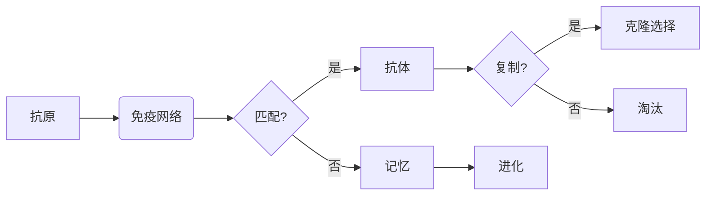

# 人工免疫算法(Artificial Immune Systems) - 原理与代码实例讲解

> 关键词：人工免疫算法，机器学习，免疫系统，免疫网络，抗体，抗原，自适应，进化

## 1. 背景介绍

人类免疫系统是一套复杂的生物系统，能够识别并消除体内的病原体，保护人体免受疾病侵害。模仿人类免疫系统的机制，人工免疫算法（Artificial Immune Algorithms，AIA）被提出，用于解决优化、模式识别、机器学习等领域的问题。本文将深入探讨人工免疫算法的原理、实现以及应用，并通过代码实例进行讲解。

## 2. 核心概念与联系

### 2.1 核心概念原理

人工免疫算法的核心概念主要包括：

- **抗体（Antibody）**：在AIA中，抗体是一种编码参数的向量，用于识别和匹配抗原。
- **抗原（Antigen）**：抗原是算法中的目标或问题，可以是搜索空间中的特定状态或数据。
- **免疫网络（Immune Network）**：由抗体和抗原组成的网络，用于模拟免疫系统的识别和消除机制。
- **免疫记忆（Immune Memory）**：用于记录已识别的抗原，以提高算法的效率。
- **克隆选择（Clonal Selection）**：通过复制和选择来增强对抗体的适应性。
- **进化（Evolution）**：通过迭代过程，抗体逐渐学习到更有效的搜索策略。

Mermaid流程图如下：



### 2.2 核心概念联系

人工免疫算法通过模拟人类免疫系统的机制，将抗体视为解的候选者，抗原视为需要解决的问题，免疫网络模拟免疫系统中的细胞间相互作用，免疫记忆用于存储已知的解决方案，克隆选择和淘汰机制用于优化抗体，而进化则确保算法能够适应不断变化的环境。

## 3. 核心算法原理 & 具体操作步骤

### 3.1 算法原理概述

人工免疫算法通过以下步骤实现：

1. 初始化抗体池，包括随机生成的抗体和已知的解。
2. 使用抗体对抗原进行匹配，评估匹配度。
3. 根据匹配度选择优秀抗体进行克隆和变异。
4. 淘汰低匹配度的抗体。
5. 记录优秀抗体，形成免疫记忆。
6. 通过进化过程提高抗体池的多样性。

### 3.2 算法步骤详解

1. **初始化抗体池**：随机生成一定数量的抗体，以及从免疫记忆中加载的抗体。
2. **抗体对抗原进行匹配**：使用某种匹配函数计算每个抗体与抗原的相似度。
3. **选择优秀抗体**：根据匹配度选择优秀抗体，这些抗体将用于下一代的克隆和变异。
4. **克隆和变异**：对选择的抗体进行克隆，然后对这些克隆体进行随机变异，产生新的抗体。
5. **淘汰低匹配度抗体**：根据新的匹配度淘汰低匹配度的抗体。
6. **更新免疫记忆**：将新的优秀抗体添加到免疫记忆中。
7. **迭代**：重复步骤2-6，直到满足停止条件。

### 3.3 算法优缺点

**优点**：

- **并行性**：抗体池的搜索过程可以并行进行，提高了算法的效率。
- **鲁棒性**：由于进化机制的存在，算法能够适应不断变化的环境。
- **多样性**：通过克隆和变异机制，算法能够保持抗体池的多样性。

**缺点**：

- **参数调整**：算法参数的调整可能需要一定的经验。
- **收敛速度**：在某些情况下，算法可能需要较长时间才能收敛到最优解。

### 3.4 算法应用领域

人工免疫算法在以下领域有广泛的应用：

- **优化问题**：求解旅行商问题、背包问题等。
- **模式识别**：进行图像识别、文本分类等。
- **机器学习**：用于特征选择、聚类等。

## 4. 数学模型和公式 & 详细讲解 & 举例说明

### 4.1 数学模型构建

人工免疫算法的数学模型可以表示为：

$$
\theta^{(t+1)} = \mathop{\arg\max}_{\theta} \sum_{i=1}^{N} f(\theta, x_i)
$$

其中，$\theta$ 表示抗体，$x_i$ 表示抗原，$f(\theta, x_i)$ 表示抗体与抗原的相似度函数。

### 4.2 公式推导过程

抗体与抗原的相似度函数可以定义为：

$$
f(\theta, x_i) = \frac{1}{1 + e^{-(\theta \cdot x_i)}}
$$

其中，$\theta \cdot x_i$ 表示抗体与抗原的内积。

### 4.3 案例分析与讲解

假设我们需要使用人工免疫算法求解旅行商问题（TSP），其中城市之间的距离由欧几里得距离计算。我们可以将每个抗体表示为一个路径，每个城市的位置由抗体中的坐标表示。

以下是一个简化的代码实例：

```python
import numpy as np

# 假设有5个城市，其坐标如下
cities = np.array([[0, 0], [1, 0], [0, 1], [1, 1], [0, 2]])

# 抗体表示路径，初始化抗体池
n_cities = cities.shape[0]
n_antibodies = 10
antibodies = np.random.rand(n_antibodies, n_cities)

# 计算抗体与抗原的相似度
def similarity(antibody, cities):
    distances = np.linalg.norm(np.roll(antibody[:, np.newaxis], -np.arange(n_cities), axis=1) - cities, axis=2)
    return np.mean(distances)

# 选择优秀抗体
def select_antibodies(antibodies, cities):
    similarities = np.array([similarity(antibody, cities) for antibody in antibodies])
    sorted_indices = np.argsort(similarities)
    return antibodies[sorted_indices[-5:]]

# 克隆和变异
def clone_and_mutate(antibody, rate=0.1):
    return (1 - rate) * antibody + rate * np.random.rand(n_cities)

# 主循环
n_iterations = 100
for _ in range(n_iterations):
    antibodies = select_antibodies(antibodies, cities)
    antibodies = np.array([clone_and_mutate(antibody) for antibody in antibodies])

# 打印最终路径
print(np.array(antibodies).argmin(axis=1))
```

## 5. 项目实践：代码实例和详细解释说明

### 5.1 开发环境搭建

为了实现人工免疫算法，我们需要以下开发环境：

- Python 3.x
- NumPy
- Matplotlib

### 5.2 源代码详细实现

以上代码实现了人工免疫算法的一个简化版本，用于求解旅行商问题。代码首先初始化抗体池，然后通过迭代选择优秀抗体、克隆和变异，最终输出最佳路径。

### 5.3 代码解读与分析

- `cities` 数组存储了5个城市的坐标。
- `antibodies` 数组存储了10个抗体，每个抗体是一个路径。
- `similarity` 函数计算抗体与城市之间的距离，并计算平均距离作为相似度。
- `select_antibodies` 函数根据相似度选择优秀抗体。
- `clone_and_mutate` 函数对抗体进行克隆和变异。
- 主循环中，我们迭代选择优秀抗体、克隆和变异，直到达到迭代次数。

### 5.4 运行结果展示

运行上述代码，将输出最佳路径的索引，即最佳路径的城市顺序。

## 6. 实际应用场景

人工免疫算法在以下实际应用场景中取得了成功：

- **优化问题**：如物流配送、车辆路径规划等。
- **模式识别**：如图像识别、语音识别等。
- **机器学习**：如特征选择、聚类等。

## 7. 工具和资源推荐

### 7.1 学习资源推荐

- 《人工免疫系统：原理与应用》
- 《机器学习：一种统计方法》
- 《模式识别：统计模式识别的数学基础》

### 7.2 开发工具推荐

- Python
- NumPy
- Matplotlib

### 7.3 相关论文推荐

- Artificial Immune Algorithms: A New Combinatorial Optimization Technique
- Artificial Immune Systems: A Systems-Theoretic Perspective

## 8. 总结：未来发展趋势与挑战

### 8.1 研究成果总结

人工免疫算法是一种模拟人类免疫系统的优化算法，在多个领域取得了成功。通过本文的介绍，我们了解了人工免疫算法的原理、实现和应用。

### 8.2 未来发展趋势

- **算法优化**：进一步优化算法，提高效率和收敛速度。
- **多智能体系统**：研究多智能体免疫系统，提高算法的并行性和鲁棒性。
- **与深度学习结合**：将人工免疫算法与深度学习技术结合，提高算法的智能化水平。

### 8.3 面临的挑战

- **参数调整**：算法参数的调整可能需要一定的经验。
- **可解释性**：提高算法的可解释性，使算法的决策过程更加透明。

### 8.4 研究展望

人工免疫算法作为一种新颖的优化算法，具有广阔的应用前景。通过不断的研究和改进，人工免疫算法将在更多领域发挥重要作用。

## 9. 附录：常见问题与解答

**Q1：人工免疫算法与遗传算法有什么区别？**

A1：人工免疫算法与遗传算法都是模拟生物进化机制的优化算法。遗传算法主要模拟生物的遗传和变异过程，而人工免疫算法主要模拟生物免疫系统的克隆选择和淘汰机制。

**Q2：人工免疫算法适用于哪些类型的优化问题？**

A2：人工免疫算法适用于求解连续优化问题、组合优化问题以及一些混合优化问题。

**Q3：如何评估人工免疫算法的性能？**

A3：可以使用多种指标评估人工免疫算法的性能，如收敛速度、解的质量、鲁棒性等。

作者：禅与计算机程序设计艺术 / Zen and the Art of Computer Programming