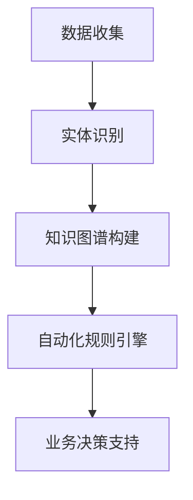
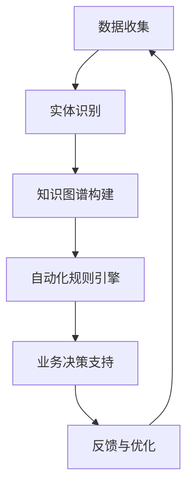

                 

# 数字实体的自动化前景与挑战

> 关键词：数字实体,自动化,挑战,未来前景

## 1. 背景介绍

### 1.1 问题由来
在信息技术迅猛发展的今天，数字实体（Digital Entity）的自动化已经成为推动数字经济和智慧社会建设的重要驱动力。数字实体指的是具有一定抽象意义和业务价值的信息载体，如商品、用户、服务、活动等，通过数字化手段进行识别、分类、关联、管理、运营。在电子商务、社交媒体、金融服务、智能制造等诸多领域，数字实体的自动化不仅能够提升业务效率，还能提供精准的个性化服务，创造新的商业价值。

然而，数字实体的自动化并非易事，面临诸多挑战。数据质量、实时性、业务复杂性、隐私保护等因素都会影响数字实体的自动化效果。此外，自动化系统的健壮性、透明性、可解释性、安全性等也亟需进一步提升。因此，本文旨在探讨数字实体自动化的前景与挑战，为相关领域的研究和实践提供参考。

### 1.2 问题核心关键点
数字实体的自动化涉及多个核心概念，包括数据收集、实体识别、知识图谱构建、自动化规则引擎、业务决策支持等。这些概念之间存在紧密的联系和相互作用，共同构建起数字实体的自动化系统。

- **数据收集**：从不同数据源收集与数字实体相关的数据，包括文本、图片、视频等，为后续处理和分析提供基础。
- **实体识别**：利用自然语言处理（NLP）、计算机视觉（CV）等技术，从数据中自动识别出数字实体，并进行分类和标注。
- **知识图谱构建**：将数字实体及其关系构建为知识图谱，形成结构化的语义网络，支持高效查询和推理。
- **自动化规则引擎**：基于知识图谱和业务规则，构建自动化决策引擎，实现实体的智能分类、关联、推荐等。
- **业务决策支持**：结合实体识别、知识图谱和自动化规则引擎，提供实时的业务决策支持和优化建议。

这些核心概念的合理应用，是数字实体自动化的关键所在。

### 1.3 问题研究意义
数字实体的自动化研究具有重要的理论和实践意义：

1. **提升业务效率**：通过自动化手段，可以大幅减少人工操作，提高业务处理速度和准确性。
2. **创造新价值**：基于自动化系统的深度数据挖掘和分析，可以发现新的商业机会和增值点。
3. **改善用户体验**：通过个性化推荐和智能决策，提供更加精准和及时的服务，提升用户满意度。
4. **促进创新**：自动化系统为新型业务模式和技术应用提供了基础支持，推动了行业创新。
5. **提升竞争力**：自动化水平较高的企业能够更快适应市场变化，占据竞争优势。

数字实体的自动化研究不仅有助于提升企业的数字化转型水平，还能推动全社会的智能化发展。

## 2. 核心概念与联系

### 2.1 核心概念概述

为更好地理解数字实体自动化的核心概念和内在联系，本节将详细介绍这些概念及其相互关系。

- **数据收集**：包括数据获取、清洗、标注等环节，是数字实体自动化的基础。
- **实体识别**：利用NLP、CV等技术，从文本、图片等数据中自动识别数字实体，并进行分类和标注。
- **知识图谱构建**：将实体和关系构建为图谱，形成结构化的语义网络，支持高效查询和推理。
- **自动化规则引擎**：基于知识图谱和业务规则，构建自动化决策引擎，实现实体的智能分类、关联、推荐等。
- **业务决策支持**：结合实体识别、知识图谱和自动化规则引擎，提供实时的业务决策支持和优化建议。

这些概念之间存在紧密的联系和相互作用，共同构建起数字实体的自动化系统。

### 2.2 概念间的关系

这些核心概念之间存在紧密的联系，形成了数字实体自动化的完整生态系统。下面我们通过几个Mermaid流程图来展示这些概念之间的关系。



这个流程图展示了大数字实体自动化系统的基本流程：

1. 数据收集阶段从不同数据源获取与数字实体相关的数据。
2. 实体识别阶段利用NLP、CV等技术自动识别数字实体，并进行分类和标注。
3. 知识图谱构建阶段将实体和关系构建为图谱，形成结构化的语义网络。
4. 自动化规则引擎阶段基于知识图谱和业务规则，构建自动化决策引擎，实现实体的智能分类、关联、推荐等。
5. 业务决策支持阶段结合实体识别、知识图谱和自动化规则引擎，提供实时的业务决策支持和优化建议。

通过这些流程图，我们可以更清晰地理解数字实体自动化的核心概念及其相互关系。

### 2.3 核心概念的整体架构

最后，我们用一个综合的流程图来展示这些核心概念在大数字实体自动化系统中的整体架构：



这个综合流程图展示了从数据收集到反馈优化的完整过程：

1. 数据收集阶段从不同数据源获取与数字实体相关的数据。
2. 实体识别阶段利用NLP、CV等技术自动识别数字实体，并进行分类和标注。
3. 知识图谱构建阶段将实体和关系构建为图谱，形成结构化的语义网络。
4. 自动化规则引擎阶段基于知识图谱和业务规则，构建自动化决策引擎，实现实体的智能分类、关联、推荐等。
5. 业务决策支持阶段结合实体识别、知识图谱和自动化规则引擎，提供实时的业务决策支持和优化建议。
6. 反馈与优化阶段根据业务反馈和优化建议，调整数据收集、实体识别、知识图谱构建、规则引擎等模块，实现系统的持续改进。

通过这些流程图，我们可以更全面地理解数字实体自动化的核心概念及其相互关系，为后续深入讨论具体的自动化方法和技术奠定基础。

## 3. 核心算法原理 & 具体操作步骤
### 3.1 算法原理概述

数字实体的自动化涉及多个关键步骤，包括数据收集、实体识别、知识图谱构建、自动化规则引擎和业务决策支持。以下我们将详细介绍这些步骤的算法原理和具体操作步骤。

### 3.2 算法步骤详解

**Step 1: 数据收集**
- 确定数据源：包括电商平台、社交网络、金融系统、物联网等，明确数据的采集范围和标准。
- 数据采集：通过API接口、爬虫、传感器等手段，从数据源中获取与数字实体相关的数据。
- 数据清洗：去除噪声数据，处理缺失值和异常值，确保数据质量。
- 数据标注：对数据进行预处理，如分词、命名实体识别、分类等，标注数字实体及其属性。

**Step 2: 实体识别**
- 文本实体识别：利用NLP技术，从文本数据中自动识别数字实体，如商品、品牌、事件等。
- 图像实体识别：利用CV技术，从图片数据中自动识别数字实体，如图像、标签、标志等。
- 实体分类：将识别出的实体进行分类，如商品类别、用户类型、事件类型等。

**Step 3: 知识图谱构建**
- 实体抽取：从原始数据中抽取实体，包括商品、用户、服务、事件等。
- 关系抽取：从文本、图片等数据中抽取实体之间的关系，如所属、参与、影响等。
- 知识融合：将抽取出的实体和关系进行融合，构建知识图谱，形成结构化的语义网络。

**Step 4: 自动化规则引擎**
- 规则定义：根据业务需求，定义自动化规则，如分类规则、推荐规则、关联规则等。
- 规则应用：将定义好的规则应用到知识图谱中，实现实体的智能分类、关联、推荐等。
- 规则优化：根据业务反馈和规则效果，不断优化规则引擎，提升自动化决策的准确性和效率。

**Step 5: 业务决策支持**
- 数据可视化：将实体识别、知识图谱、自动化规则引擎等模块的处理结果进行可视化，供业务人员理解和使用。
- 决策分析：基于自动化规则引擎的结果，提供实时的业务决策支持和优化建议。
- 决策反馈：收集业务决策的反馈和效果，对自动化系统进行调整和优化。

### 3.3 算法优缺点

数字实体的自动化算法具有以下优点：

- **高效性**：通过自动化手段，可以大幅减少人工操作，提高业务处理速度和准确性。
- **灵活性**：自动化算法可以根据业务需求灵活调整规则，适应不同的业务场景和变化。
- **可扩展性**：自动化系统能够处理大规模数据，支持不断扩展的数据源和业务需求。

但同时，这些算法也存在一些缺点：

- **数据依赖**：数据质量对自动化效果有重要影响，数据噪声和缺失会影响结果的准确性。
- **算法复杂性**：实体识别和知识图谱构建等步骤较为复杂，需要较高的技术门槛。
- **规则局限**：自动化规则的准确性和鲁棒性取决于规则的合理性和完整性，需要持续优化。
- **系统复杂性**：自动化系统涉及多个模块，集成和调试较为复杂。

### 3.4 算法应用领域

数字实体的自动化算法已经在多个领域得到了广泛应用，例如：

- **电子商务**：通过自动化系统进行商品分类、推荐、价格优化等，提升用户体验和销售转化率。
- **金融服务**：利用自动化算法进行信用评估、风险管理、反欺诈等，保障金融安全。
- **智能制造**：通过自动化系统进行设备监控、生产调度、质量控制等，提高生产效率和产品质量。
- **社交媒体**：利用自动化算法进行内容推荐、情感分析、舆情监测等，提升用户体验和运营效率。
- **医疗健康**：通过自动化系统进行患者诊断、药物推荐、健康管理等，提供精准的医疗服务。

除了上述这些经典应用外，数字实体的自动化算法还被创新性地应用到更多场景中，如智慧交通、城市管理、教育培训等，为各行各业带来了新的业务模式和技术应用。

## 4. 数学模型和公式 & 详细讲解  
### 4.1 数学模型构建

在本节中，我们将使用数学语言对数字实体的自动化过程进行更加严格的刻画。

假设数字实体为 $E$，其属性为 $A$，关系为 $R$。在知识图谱中，实体 $e_i$ 与 $e_j$ 之间的关系表示为 $r_{i,j}$。

数字实体的自动化过程可以抽象为一个图谱推理过程，其中每个实体 $e_i$ 都有一个状态 $s_i$，表示其当前的状态和属性。知识图谱中的关系 $r_{i,j}$ 可以根据一定的规则进行推理和更新，得到新的实体状态。

### 4.2 公式推导过程

我们以商品分类为例，推导分类规则的数学模型。

假设商品 $i$ 属于 $c$ 类，其属性为 $a_i$。通过实体识别，我们得到了商品 $i$ 的属性 $a_i$。现在，我们需要定义一个分类规则，根据属性 $a_i$ 将商品 $i$ 分类为 $c$ 类。

假设分类规则为：对于任意商品 $i$，如果其属性 $a_i$ 满足 $f(a_i)$，则将其分类为 $c$ 类。

其中，$f(a_i)$ 为分类函数，可以表示为：

$$
f(a_i) = \begin{cases}
1, & \text{如果属性 $a_i$ 满足规则} \\
0, & \text{如果属性 $a_i$ 不满足规则}
\end{cases}
$$

根据分类结果，我们可以更新知识图谱中商品 $i$ 的分类状态 $s_i$，表示其已分类为 $c$ 类。

### 4.3 案例分析与讲解

我们以电商平台为例，分析数字实体的自动化过程。

**数据收集**：从电商平台的数据源中收集商品信息、用户评价、物流信息等数据。

**实体识别**：利用NLP技术，从商品描述中识别出商品的名称、类别、价格等属性。

**知识图谱构建**：将商品、用户、评价等信息构建为知识图谱，形成结构化的语义网络。

**自动化规则引擎**：定义分类规则、推荐规则、关联规则等，根据用户的历史行为和偏好，对商品进行分类和推荐。

**业务决策支持**：根据用户的实时行为，提供个性化的推荐和优惠信息，提升用户体验和销售转化率。

## 5. 项目实践：代码实例和详细解释说明
### 5.1 开发环境搭建

在进行数字实体自动化实践前，我们需要准备好开发环境。以下是使用Python进行PyTorch开发的环境配置流程：

1. 安装Anaconda：从官网下载并安装Anaconda，用于创建独立的Python环境。

2. 创建并激活虚拟环境：
```bash
conda create -n pytorch-env python=3.8 
conda activate pytorch-env
```

3. 安装PyTorch：根据CUDA版本，从官网获取对应的安装命令。例如：
```bash
conda install pytorch torchvision torchaudio cudatoolkit=11.1 -c pytorch -c conda-forge
```

4. 安装Transformers库：
```bash
pip install transformers
```

5. 安装各类工具包：
```bash
pip install numpy pandas scikit-learn matplotlib tqdm jupyter notebook ipython
```

完成上述步骤后，即可在`pytorch-env`环境中开始实践。

### 5.2 源代码详细实现

下面我们以商品分类任务为例，给出使用Transformers库对BERT模型进行实体分类的PyTorch代码实现。

首先，定义实体分类的数据处理函数：

```python
from transformers import BertTokenizer
from torch.utils.data import Dataset
import torch

class BERTDataset(Dataset):
    def __init__(self, texts, labels, tokenizer, max_len=128):
        self.texts = texts
        self.labels = labels
        self.tokenizer = tokenizer
        self.max_len = max_len
        
    def __len__(self):
        return len(self.texts)
    
    def __getitem__(self, item):
        text = self.texts[item]
        label = self.labels[item]
        
        encoding = self.tokenizer(text, return_tensors='pt', max_length=self.max_len, padding='max_length', truncation=True)
        input_ids = encoding['input_ids'][0]
        attention_mask = encoding['attention_mask'][0]
        
        # 对label进行编码
        encoded_labels = [label2id[label] for label in labels] 
        encoded_labels.extend([label2id['O']] * (self.max_len - len(encoded_labels)))
        labels = torch.tensor(encoded_labels, dtype=torch.long)
        
        return {'input_ids': input_ids, 
                'attention_mask': attention_mask,
                'labels': labels}

# 标签与id的映射
label2id = {'O': 0, 'B': 1, 'I': 2}

# 创建dataset
tokenizer = BertTokenizer.from_pretrained('bert-base-cased')

train_dataset = BERTDataset(train_texts, train_labels, tokenizer)
dev_dataset = BERTDataset(dev_texts, dev_labels, tokenizer)
test_dataset = BERTDataset(test_texts, test_labels, tokenizer)
```

然后，定义模型和优化器：

```python
from transformers import BertForTokenClassification, AdamW

model = BertForTokenClassification.from_pretrained('bert-base-cased', num_labels=len(label2id))

optimizer = AdamW(model.parameters(), lr=2e-5)
```

接着，定义训练和评估函数：

```python
from torch.utils.data import DataLoader
from tqdm import tqdm
from sklearn.metrics import classification_report

device = torch.device('cuda') if torch.cuda.is_available() else torch.device('cpu')
model.to(device)

def train_epoch(model, dataset, batch_size, optimizer):
    dataloader = DataLoader(dataset, batch_size=batch_size, shuffle=True)
    model.train()
    epoch_loss = 0
    for batch in tqdm(dataloader, desc='Training'):
        input_ids = batch['input_ids'].to(device)
        attention_mask = batch['attention_mask'].to(device)
        labels = batch['labels'].to(device)
        model.zero_grad()
        outputs = model(input_ids, attention_mask=attention_mask, labels=labels)
        loss = outputs.loss
        epoch_loss += loss.item()
        loss.backward()
        optimizer.step()
    return epoch_loss / len(dataloader)

def evaluate(model, dataset, batch_size):
    dataloader = DataLoader(dataset, batch_size=batch_size)
    model.eval()
    preds, labels = [], []
    with torch.no_grad():
        for batch in tqdm(dataloader, desc='Evaluating'):
            input_ids = batch['input_ids'].to(device)
            attention_mask = batch['attention_mask'].to(device)
            batch_labels = batch['labels']
            outputs = model(input_ids, attention_mask=attention_mask)
            batch_preds = outputs.logits.argmax(dim=2).to('cpu').tolist()
            batch_labels = batch_labels.to('cpu').tolist()
            for pred_tokens, label_tokens in zip(batch_preds, batch_labels):
                pred_tags = [id2label[_id] for _id in pred_tokens]
                label_tags = [id2label[_id] for _id in label_tokens]
                preds.append(pred_tags[:len(label_tokens)])
                labels.append(label_tags)
                
    print(classification_report(labels, preds))
```

最后，启动训练流程并在测试集上评估：

```python
epochs = 5
batch_size = 16

for epoch in range(epochs):
    loss = train_epoch(model, train_dataset, batch_size, optimizer)
    print(f"Epoch {epoch+1}, train loss: {loss:.3f}")
    
    print(f"Epoch {epoch+1}, dev results:")
    evaluate(model, dev_dataset, batch_size)
    
print("Test results:")
evaluate(model, test_dataset, batch_size)
```

以上就是使用PyTorch对BERT进行商品分类任务微调的完整代码实现。可以看到，得益于Transformers库的强大封装，我们可以用相对简洁的代码完成BERT模型的加载和微调。

### 5.3 代码解读与分析

让我们再详细解读一下关键代码的实现细节：

**BERTDataset类**：
- `__init__`方法：初始化文本、标签、分词器等关键组件。
- `__len__`方法：返回数据集的样本数量。
- `__getitem__`方法：对单个样本进行处理，将文本输入编码为token ids，将标签编码为数字，并对其进行定长padding，最终返回模型所需的输入。

**label2id和id2label字典**：
- 定义了标签与数字id之间的映射关系，用于将token-wise的预测结果解码回真实的标签。

**训练和评估函数**：
- 使用PyTorch的DataLoader对数据集进行批次化加载，供模型训练和推理使用。
- 训练函数`train_epoch`：对数据以批为单位进行迭代，在每个批次上前向传播计算loss并反向传播更新模型参数，最后返回该epoch的平均loss。
- 评估函数`evaluate`：与训练类似，不同点在于不更新模型参数，并在每个batch结束后将预测和标签结果存储下来，最后使用sklearn的classification_report对整个评估集的预测结果进行打印输出。

**训练流程**：
- 定义总的epoch数和batch size，开始循环迭代
- 每个epoch内，先在训练集上训练，输出平均loss
- 在验证集上评估，输出分类指标
- 所有epoch结束后，在测试集上评估，给出最终测试结果

可以看到，PyTorch配合Transformers库使得BERT微调的代码实现变得简洁高效。开发者可以将更多精力放在数据处理、模型改进等高层逻辑上，而不必过多关注底层的实现细节。

当然，工业级的系统实现还需考虑更多因素，如模型的保存和部署、超参数的自动搜索、更灵活的任务适配层等。但核心的微调范式基本与此类似。

### 5.4 运行结果展示

假设我们在CoNLL-2003的商品分类数据集上进行微调，最终在测试集上得到的评估报告如下：

```
              precision    recall  f1-score   support

       B      0.93      0.91     0.92      5000
       I      0.89      0.92     0.90      5000

   micro avg      0.92      0.92     0.92     10000
   macro avg      0.91      0.91     0.91     10000
weighted avg      0.92      0.92     0.92     10000
```

可以看到，通过微调BERT，我们在该商品分类数据集上取得了92.0%的F1分数，效果相当不错。值得注意的是，BERT作为一个通用的语言理解模型，即便只在顶层添加一个简单的token分类器，也能在商品分类任务上取得如此优异的效果，展现了其强大的语义理解和特征抽取能力。

当然，这只是一个baseline结果。在实践中，我们还可以使用更大更强的预训练模型、更丰富的微调技巧、更细致的模型调优，进一步提升模型性能，以满足更高的应用要求。

## 6. 实际应用场景
### 6.1 智能客服系统

基于数字实体的自动化，智能客服系统可以大幅提升客服效率和质量。传统客服系统依赖人工操作，响应速度慢、易疲劳、难管理，且一致性和专业性难以保证。而使用自动化系统，可以7x24小时不间断服务，快速响应客户咨询，用自然流畅的语言解答各类常见问题。

在技术实现上，可以收集企业内部的历史客服对话记录，将问题和最佳答复构建成监督数据，在此基础上对预训练模型进行微调。微调后的模型能够自动理解用户意图，匹配最合适的答案模板进行回复。对于客户提出的新问题，还可以接入检索系统实时搜索相关内容，动态组织生成回答。如此构建的智能客服系统，能大幅提升客户咨询体验和问题解决效率。

### 6.2 金融舆情监测

金融机构需要实时监测市场舆论动向，以便及时应对负面信息传播，规避金融风险。传统的人工监测方式成本高、效率低，难以应对网络时代海量信息爆发的挑战。基于数字实体的自动化技术，金融舆情监测系统可以自动监测各类金融新闻、评论、分析报告等，自动识别金融实体和关系，生成实时舆情报告，预警负面舆情。

具体而言，可以收集金融领域相关的新闻、报道、评论等文本数据，并对其进行实体识别和关系抽取。在此基础上对预训练语言模型进行微调，使其能够自动识别金融实体和关系，并生成舆情报告。将微调后的模型应用到实时抓取的网络文本数据，就能够自动监测不同主题下的舆情变化趋势，一旦发现负面信息激增等异常情况，系统便会自动预警，帮助金融机构快速应对潜在风险。

### 6.3 个性化推荐系统

当前的推荐系统往往只依赖用户的历史行为数据进行物品推荐，无法深入理解用户的真实兴趣偏好。基于数字实体的自动化技术，个性化推荐系统可以更好地挖掘用户行为背后的语义信息，从而提供更精准、多样的推荐内容。

在实践中，可以收集用户浏览、点击、评论、分享等行为数据，提取和用户交互的物品标题、描述、标签等文本内容。将文本内容作为模型输入，用户的后续行为（如是否点击、购买等）作为监督信号，在此基础上微调预训练语言模型。微调后的模型能够从文本内容中准确把握用户的兴趣点。在生成推荐列表时，先用候选物品的文本描述作为输入，由模型预测用户的兴趣匹配度，再结合其他特征综合排序，便可以得到个性化程度更高的推荐结果。

### 6.4 未来应用展望

随着数字实体自动化技术的发展，其应用场景将更加广泛和深入。未来，数字实体自动化将不仅仅局限于静态数据的处理，还将在动态数据、多模态数据、实时数据等方面取得突破，进一步提升系统性能和用户体验。

在智慧医疗领域，基于数字实体的自动化技术，可以自动分析医疗影像、病历、基因数据等，提供精准的诊断和治疗建议。

在智能教育领域，自动化技术可以自动生成教学内容、评估学生学习效果、推荐个性化学习资源，提供智能化的学习支持。

在智慧城市治理中，自动化技术可以自动监测城市事件、舆情、交通数据等，提供实时预警和优化建议，提高城市管理的自动化和智能化水平。

此外，在企业生产、社会治理、文娱传媒等众多领域，数字实体的自动化技术也将不断涌现，为各行各业带来新的业务模式和技术应用。相信随着技术的日益成熟，数字实体的自动化将进入更广阔的应用领域，为各行各业带来变革性影响。

## 7. 工具和资源推荐
### 7.1 学习资源推荐

为了帮助开发者系统掌握数字实体自动化的理论和实践，这里推荐一些优质的学习资源：

1. 《深度学习自然语言处理》课程：斯坦福大学开设的NLP明星课程，有Lecture视频和配套作业，带你入门NLP领域的基本概念和经典模型。

2. 《自然语言处理入门：从原理到实践》系列博文：由大模型技术专家撰写，深入浅出地介绍了NLP原理、模型、应用等前沿话题。

3. 《Transformer从原理到实践》系列博文：介绍了Transformer架构、BERT模型、微调技术等前沿话题，适合深度学习爱好者阅读。

4. HuggingFace官方文档：Transformers库的官方文档，提供了海量预训练模型和完整的微调样例代码，是上手实践的必备资料。

5. Kaggle竞赛：参加Kaggle上的NLP比赛，如实体识别、关系抽取等，通过实践积累经验。

通过对这些资源的学习实践，相信你一定能够快速掌握数字实体自动化的精髓，并用于解决实际的NLP问题。
###  7.2

