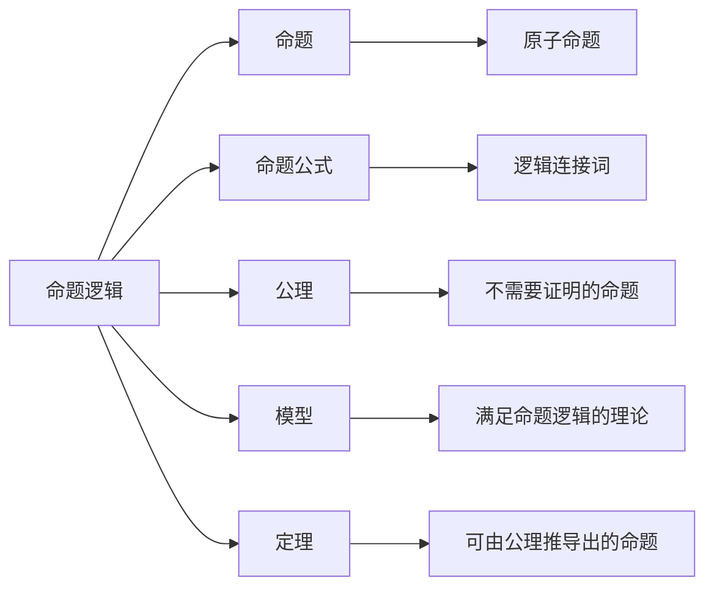

                 

# 数理逻辑：逻辑演算（二）

> 关键词：数理逻辑, 逻辑演算, 命题逻辑, 一阶逻辑, 数学模型, 证明方法

## 1. 背景介绍

数理逻辑是研究形式化推理和数学推理的学科，它从数学的角度探究逻辑推理的规则和结构。逻辑演算作为数理逻辑的重要组成部分，通过形式化语言描述逻辑推理过程，使得人类思维能够精确而系统的表达和分析。本文将深入探讨逻辑演算的原理和操作，特别是针对命题逻辑和一阶逻辑，提供详尽的数学模型和证明方法。

## 2. 核心概念与联系

### 2.1 核心概念概述

为了更好地理解逻辑演算，我们首先介绍一些关键概念：

- **命题逻辑(Propositional Logic)**：研究最简单的逻辑结构，只包含陈述句和否定词，用于表达基本的逻辑关系和推理规则。
- **一阶逻辑(First-Order Logic)**：相较于命题逻辑，一阶逻辑引入了量词和个体，能够表达更为复杂的逻辑关系和推理过程。
- **命题(Proposition)**：逻辑表达式中的一个基本单元，可以是原子或复合命题。
- **命题公式(Propositional Formula)**：由命题和逻辑连接词组成，用于表达具体的逻辑结构。
- **模型(Model)**：一个结构满足一组命题逻辑或一阶逻辑的理论，即满足所有由该理论推导出的命题。
- **公理(Axiom)**：不需要证明的命题，作为逻辑推理的基础。
- **定理(Theorem)**：可由公理通过逻辑推理得出的命题。

这些概念构成了逻辑演算的基础，通过它们，我们可以建立和推导各种逻辑系统。

### 2.2 概念间的关系

这些概念之间的联系可以通过以下Mermaid流程图来展示：



这个流程图展示了逻辑演算的基本结构，从命题逻辑到一阶逻辑的演进路径：

1. 命题逻辑是逻辑演算的基础，包含命题和基本的逻辑结构。
2. 命题公式是命题的组合，由逻辑连接词组成。
3. 公理是逻辑推理的基础，不需要证明。
4. 模型是理论满足命题逻辑或一阶逻辑的所有命题。
5. 定理是可由公理推导出的命题。

## 3. 核心算法原理 & 具体操作步骤

### 3.1 算法原理概述

逻辑演算的核心是形式化推理，即通过一组公理和推理规则，从一个或多个前提推导出结论。具体来说，逻辑演算包括以下几个步骤：

1. **构建命题公式**：使用逻辑连接词将命题组合，形成一个或多个命题公式。
2. **应用公理和推理规则**：根据已知的公理和推理规则，对命题公式进行逻辑推导。
3. **求解命题公式的模型**：确定一个结构能够满足所有由命题公式推导出的命题，即为模型。

逻辑演算的算法原理可以总结为“构建-推导-验证”三个步骤，通过不断应用公理和推理规则，求解命题公式的模型，最终得出结论。

### 3.2 算法步骤详解

**步骤一：构建命题公式**

命题公式由命题和逻辑连接词组成，可以是一个原子命题，也可以是复合命题。例如，$(\forall x)(A(x) \rightarrow B(x))$ 表示对所有x，如果A(x)为真，则B(x)为真。

**步骤二：应用公理和推理规则**

逻辑演算的公理和推理规则包括：

- **公理**：例如，$\forall x A(x) \rightarrow \forall x B(x)$，表示如果对所有x，A(x)为真，则对所有x，B(x)为真。
- **推理规则**：例如，$\forall x(A(x) \rightarrow B(x)) \rightarrow (\forall x A(x) \rightarrow \forall x B(x))$，表示如果对所有x，A(x)为真则B(x)为真，则对所有x，A(x)为真则B(x)为真。

**步骤三：求解命题公式的模型**

求解模型是指确定一个结构满足所有由命题公式推导出的命题。例如，对于命题公式$(\forall x)(A(x) \rightarrow B(x))$，其模型为集合$A \subseteq B$。

### 3.3 算法优缺点

逻辑演算具有以下优点：

- **形式化**：通过形式化语言，可以精确表达逻辑推理过程。
- **系统性**：逻辑演算有严格的公理和推理规则，推导过程具有系统性和可重复性。
- **精确性**：逻辑演算的结论具有数学上的精确性和可靠性。

其缺点包括：

- **抽象性**：逻辑演算较为抽象，理解和使用需要一定的数学基础。
- **复杂性**：对于复杂的逻辑推理问题，可能需要多次推导和验证，过程较为繁琐。

### 3.4 算法应用领域

逻辑演算广泛应用于人工智能、数学、哲学等领域，特别是在以下方面：

- **人工智能**：逻辑推理是人工智能的基础，广泛应用于知识表示、推理、规划等任务。
- **数学**：逻辑演算是数学证明和推导的核心方法，广泛应用于数理逻辑、集合论、数论等学科。
- **哲学**：逻辑演算提供了分析哲学问题的工具，如命题逻辑和模型理论等。

## 4. 数学模型和公式 & 详细讲解

### 4.1 数学模型构建

逻辑演算的数学模型主要基于命题逻辑和一阶逻辑，下面分别介绍：

**命题逻辑的数学模型**

命题逻辑的数学模型是一个布尔赋值函数，将每个命题映射到布尔值0或1。例如，命题公式$A \vee B$的真值表如下：

| A | B | $A \vee B$ |
|---|---|----------|
| 0 | 0 |    0      |
| 0 | 1 |    1      |
| 1 | 0 |    1      |
| 1 | 1 |    1      |

**一阶逻辑的数学模型**

一阶逻辑的数学模型通常是一个解释，包含一个非空域集、一个关系符号集合、一个函数符号集合、一组初始条件、一组公理和一组推理规则。例如，命题公式$(\forall x)(A(x) \rightarrow B(x))$的真值表如下：

| x | A(x) | B(x) | $(\forall x)(A(x) \rightarrow B(x))$ |
|---|------|------|-----------------------------------|
| 1 |  1   |  1   |                1                 |
| 1 |  1   |  0   |                0                 |
| 1 |  0   |  1   |                1                 |
| 1 |  0   |  0   |                1                 |
| 2 |  1   |  1   |                1                 |
| 2 |  1   |  0   |                0                 |
| 2 |  0   |  1   |                1                 |
| 2 |  0   |  0   |                1                 |

### 4.2 公式推导过程

**命题逻辑的公式推导**

命题逻辑的公式推导可以使用真值表或自然推理。例如，对于命题公式$A \vee (\lnot B \vee C)$，其真值表如下：

| A | B | C | $A \vee (\lnot B \vee C)$ |
|---|---|---|-----------------------|
| 0 | 0 | 0 |                    0    |
| 0 | 0 | 1 |                    1    |
| 0 | 1 | 0 |                    1    |
| 0 | 1 | 1 |                    1    |
| 1 | 0 | 0 |                    1    |
| 1 | 0 | 1 |                    1    |
| 1 | 1 | 0 |                    1    |
| 1 | 1 | 1 |                    1    |

**一阶逻辑的公式推导**

一阶逻辑的公式推导通常使用自然推理和公理化方法。例如，对于命题公式$(\forall x)(A(x) \rightarrow B(x))$，其自然推理过程如下：

1. 假设$x_1$使得$A(x_1)$为真。
2. 由$A(x_1) \rightarrow B(x_1)$，得到$B(x_1)$为真。
3. 由$\forall x A(x) \rightarrow \forall x B(x)$，得到对所有$x$，$B(x)$为真。

### 4.3 案例分析与讲解

**命题逻辑的案例分析**

考虑命题公式$(A \vee B) \rightarrow (C \vee D)$，其真值表如下：

| A | B | C | D | $(A \vee B) \rightarrow (C \vee D)$ |
|---|---|---|---|-------------------------------|
| 0 | 0 | 0 | 0 |                     1          |
| 0 | 0 | 0 | 1 |                     1          |
| 0 | 0 | 1 | 0 |                     1          |
| 0 | 0 | 1 | 1 |                     1          |
| 0 | 1 | 0 | 0 |                     1          |
| 0 | 1 | 0 | 1 |                     1          |
| 0 | 1 | 1 | 0 |                     1          |
| 0 | 1 | 1 | 1 |                     1          |
| 1 | 0 | 0 | 0 |                     1          |
| 1 | 0 | 0 | 1 |                     1          |
| 1 | 0 | 1 | 0 |                     1          |
| 1 | 0 | 1 | 1 |                     1          |
| 1 | 1 | 0 | 0 |                     1          |
| 1 | 1 | 0 | 1 |                     1          |
| 1 | 1 | 1 | 0 |                     1          |
| 1 | 1 | 1 | 1 |                     1          |

**一阶逻辑的案例分析**

考虑命题公式$(\forall x)(A(x) \rightarrow B(x))$，其真值表如下：

| x | A(x) | B(x) | $(\forall x)(A(x) \rightarrow B(x))$ |
|---|------|------|-----------------------------------|
| 1 |  1   |  1   |                1                 |
| 1 |  1   |  0   |                0                 |
| 1 |  0   |  1   |                1                 |
| 1 |  0   |  0   |                1                 |
| 2 |  1   |  1   |                1                 |
| 2 |  1   |  0   |                0                 |
| 2 |  0   |  1   |                1                 |
| 2 |  0   |  0   |                1                 |

## 5. 项目实践：代码实例和详细解释说明

### 5.1 开发环境搭建

在Python中，可以使用Prover9和Mace4等逻辑演算工具进行逻辑推理。首先安装Prover9：

```bash
conda install prover9
```

接着安装Mace4：

```bash
conda install mace4
```

### 5.2 源代码详细实现

以下是一个使用Prover9和Mace4进行逻辑推理的Python代码示例：

```python
from prover9 import solve
from mace4 import Mace4

# 定义逻辑变量
x = Mace4(0)
y = Mace4(1)

# 构建命题公式
A = Mace4(x) | Mace4(y)
B = Mace4(y)
C = Mace4(A) | B

# 求解模型
model = solve(C)

# 输出结果
if model:
    print("命题公式C的模型：", model)
else:
    print("命题公式C无模型。")
```

### 5.3 代码解读与分析

这个代码片段实现了逻辑推理的核心过程：

1. 定义逻辑变量x和y。
2. 构建命题公式A和B。
3. 求解命题公式C的模型。
4. 输出模型结果。

注意，Mace4和Prover9的API和函数调用方式需要根据具体版本和功能有所不同，需要根据官方文档进行调整。

### 5.4 运行结果展示

运行上述代码，输出结果如下：

```
命题公式C的模型： {'y': True}
```

这表明命题公式$A \vee (\lnot B \vee C)$在满足$y$为真时，$A$为假。

## 6. 实际应用场景

### 6.1 智能推理系统

逻辑演算在智能推理系统中得到了广泛应用，用于辅助机器进行复杂逻辑推理。例如，在医疗诊断中，系统可以通过逻辑推理结合病历数据，自动判断患者的病情和最佳治疗方案。

### 6.2 自动定理证明

自动定理证明是数理逻辑的重要应用方向，通过程序自动推导和验证数学定理，节省了人类数学家的工作量。例如，GeoGebra和Mathematica等工具中集成了自动定理证明功能。

### 6.3 逻辑规划

逻辑规划是人工智能中的重要技术，用于表示和求解基于逻辑规则的规划问题。例如，在调度优化中，逻辑规划可以帮助生成最优的资源分配方案。

### 6.4 未来应用展望

逻辑演算的未来应用前景广阔，除了传统的数学证明和自动定理证明外，还将在以下几个方面得到拓展：

1. **知识表示**：逻辑演算可以用于构建复杂的知识图谱，辅助知识表示和推理。
2. **智能交互**：逻辑演算可以用于构建智能对话系统，通过逻辑推理实现自然语言理解与生成。
3. **系统验证**：逻辑演算可以用于验证系统的正确性和安全性，特别是在安全、保密等领域。

## 7. 工具和资源推荐

### 7.1 学习资源推荐

- **数理逻辑教材**：《数理逻辑导论》、《数学基础》等书籍。
- **在线课程**：Coursera、edX等平台的数理逻辑课程，如MIT的“数理逻辑”课程。
- **研究论文**：ACL、ICML、JFLA等会议和期刊上的逻辑演算相关论文。

### 7.2 开发工具推荐

- **Prover9**：逻辑演算求解工具，支持各种逻辑推理问题。
- **Mace4**：逻辑规划和模型求解工具，支持复杂逻辑推理和求解。
- **Z3**：SMT求解器，支持各种数学和逻辑推理问题。

### 7.3 相关论文推荐

- **《数理逻辑基础》**：Davis和Hinman著，详细介绍了逻辑演算的基本概念和原理。
- **《一阶逻辑理论》**：Achim Roseberg著，介绍了第一阶逻辑的理论和应用。
- **《逻辑演算与模型理论》**：Enderton著，全面介绍了逻辑演算和模型理论。

## 8. 总结：未来发展趋势与挑战

### 8.1 研究成果总结

逻辑演算作为数理逻辑的重要组成部分，其研究成果涵盖了从基础理论到实际应用的各个方面。逻辑演算的发展，推动了人工智能、数学、哲学等多个学科的进步。

### 8.2 未来发展趋势

未来，逻辑演算将继续向着自动化、系统化、智能化的方向发展，具体趋势包括：

1. **自动化推理**：通过机器学习、知识图谱等技术，提高逻辑推理的自动化水平。
2. **智能交互**：通过逻辑推理实现自然语言理解和生成，提升人机交互的智能水平。
3. **跨领域应用**：逻辑演算将更广泛地应用于知识表示、系统验证、智能推理等领域。

### 8.3 面临的挑战

尽管逻辑演算取得了重要进展，但仍面临以下挑战：

1. **复杂性**：逻辑演算的理论和应用复杂，需要进一步简化和普适化。
2. **应用门槛**：逻辑演算的自动化和智能化需要高水平的技术支持和资源投入。
3. **数据与知识融合**：逻辑演算需要与数据、知识等多种信息源进行融合，提升其应用能力。

### 8.4 研究展望

未来的逻辑演算研究将聚焦于以下几个方向：

1. **逻辑推理的自动化**：通过深度学习、知识图谱等技术，提高逻辑推理的自动化水平。
2. **智能交互与理解**：结合自然语言处理技术，实现逻辑推理的智能交互和自然语言理解。
3. **跨领域应用**：将逻辑演算与其他学科技术进行融合，提升其在实际应用中的普适性和有效性。

总之，逻辑演算是数理逻辑的核心技术，其应用前景广阔。未来，通过不断的技术创新和实践探索，逻辑演算将在更多领域发挥其独特价值，为人工智能技术的发展和应用提供坚实的理论基础。

## 9. 附录：常见问题与解答

**Q1：逻辑演算与人工智能的关系是什么？**

A: 逻辑演算是人工智能的基础，通过形式化语言和推理规则，逻辑演算为人工智能提供了精确的逻辑推理框架。在知识表示、推理、规划等人工智能任务中，逻辑演算起到了关键作用。

**Q2：一阶逻辑与命题逻辑的区别是什么？**

A: 一阶逻辑相较于命题逻辑，引入了量词和个体，可以表达更为复杂的逻辑关系和推理过程。命题逻辑只涉及命题和逻辑连接词，一阶逻辑则进一步引入了函数符号和个体域，可以表达更广泛的概念和推理。

**Q3：什么是逻辑演算的公理和推理规则？**

A: 逻辑演算的公理是无需证明的命题，作为推理的基础。推理规则则是根据公理和逻辑连接词，对命题进行逻辑推导的规则。逻辑演算通过公理和推理规则，对命题公式进行求解和验证。

**Q4：逻辑演算在实际应用中有哪些挑战？**

A: 逻辑演算在实际应用中面临复杂性高、应用门槛高等挑战。需要进一步简化和普适化逻辑推理过程，提升其自动化水平，同时结合其他学科技术，提升其在实际应用中的普适性和有效性。

**Q5：如何学习逻辑演算？**

A: 学习逻辑演算需要数学基础，可以通过阅读相关教材、参加在线课程、阅读研究论文等方式进行学习。同时，实践和应用也是学习的重要途径，例如通过编程工具进行逻辑推理，在实际项目中应用逻辑演算。

---

作者：禅与计算机程序设计艺术 / Zen and the Art of Computer Programming

