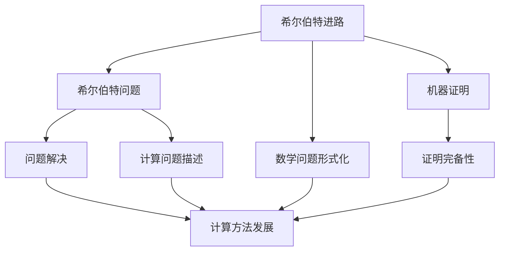
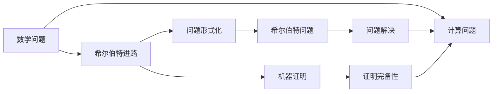

                 

# 计算：第三部分 计算理论的形成 第 6 章 计算理论的奠基：希尔伯特进路 希尔伯特问题

## 1. 背景介绍

在《计算：第三部分 计算理论的形成》一书中，我们探讨了计算概念的起源、数学基础以及形式化过程。然而，这些理论的完整性仍然存在重大空白：我们是否能够确认计算过程的完备性？我们又能否描述所有可能的计算过程？本章我们将通过希尔伯特进路和希尔伯特问题，继续探讨这些问题。

## 2. 核心概念与联系

### 2.1 核心概念概述

希尔伯特（David Hilbert）是20世纪初数学界的重要人物，他在数学基础、数论、几何学等多个领域做出了开创性贡献。对于计算理论的形成，希尔伯特的影响同样深远。他的工作主要集中在两个方向：

1. **希尔伯特进路（Hilbert's Program）**：希尔伯特在1928年提出了著名的希尔伯特进路，即数学问题的形式化与证明完备性。该进路试图将所有数学问题归为有限步骤的计算问题，并通过机器证明其解的存在性和正确性。

2. **希尔伯特问题（Hilbert Problems）**：希尔伯特列出了23个核心问题，其中6个与计算理论密切相关，旨在描述和解决计算过程中可能存在的逻辑漏洞和陷阱。

### 2.2 概念间的关系

希尔伯特进路和希尔伯特问题相互关联，共同构成了计算理论的基础框架。希尔伯特进路提供了计算问题的形式化途径，而希尔伯特问题则指出了潜在的问题和挑战，推动了后续研究的深入。下面我们将通过一系列 Mermaid 流程图，展示两者之间的逻辑联系：



这个流程图展示了希尔伯特进路和希尔伯特问题之间的相互关系：

1. 希尔伯特进路从数学问题形式化开始，并通过机器证明验证其完备性。
2. 希尔伯特问题指出了计算过程中可能存在的逻辑漏洞，并推动了计算方法的发展。
3. 数学问题和计算问题的描述是紧密联系的，机器证明的完备性为问题的解决提供了基础。
4. 问题的解决推动了计算方法的发展，进一步巩固了希尔伯特进路和希尔伯特问题的联系。

### 2.3 核心概念的整体架构

接下来，我们通过一个综合的 Mermaid 流程图，展示希尔伯特进路和希尔伯特问题在大规模计算理论形成中的整体架构：



这个流程图展示了希尔伯特进路和希尔伯特问题在计算理论形成中的整体架构：

1. 数学问题被形式化为计算问题，并通过希尔伯特进路加以证明。
2. 希尔伯特问题指出了计算过程中可能存在的逻辑漏洞，并推动了计算方法的发展。
3. 计算问题的解决推动了数学问题的解决，进一步巩固了希尔伯特进路和希尔伯特问题的作用。

## 3. 核心算法原理 & 具体操作步骤

### 3.1 算法原理概述

希尔伯特进路的核心目标是：通过形式化语言描述计算问题，并使用机器证明确保其完备性。该过程包括三个主要步骤：

1. **问题形式化**：将数学问题转化为计算问题，使用符号和规则进行表达。
2. **机器证明**：设计自动机器，验证所有计算问题的解。
3. **证明完备性**：确保所有计算问题都有解，且解的证明过程可自动生成。

### 3.2 算法步骤详解

**步骤1：问题形式化**

问题形式化的核心是将复杂数学问题转化为符号表达式。例如，将数学命题 $p$ 转化为一个布尔表达式 $p'(x_1, x_2, ..., x_n)$，其中 $x_i$ 为变量，代表问题中的某些状态或参数。

**步骤2：机器证明**

机器证明是指设计自动机器，对给定的符号表达式 $p'$ 进行验证。机器证明分为两个阶段：

1. **验证正确性**：使用数学归纳法、回溯法等算法，验证符号表达式 $p'$ 是否等价于原始命题 $p$。
2. **验证完备性**：通过递归和归纳，验证符号表达式 $p'$ 是否覆盖所有可能的计算过程。

**步骤3：证明完备性**

证明完备性是指，确保所有符号表达式 $p'$ 都能够通过机器证明其正确性。这需要满足两个条件：

1. **完备性**：所有符号表达式 $p'$ 都有解，且解的证明过程可自动生成。
2. **一致性**：机器证明过程不会产生矛盾，即对于任何符号表达式 $p'$，机器证明其正确性或存在矛盾，二者必居其一。

### 3.3 算法优缺点

希尔伯特进路的优点在于，它提供了一种形式化的方法来描述和解决数学问题，使得问题变得可计算和可验证。这种方法大大提高了数学推理的严谨性和自动化程度。

然而，希尔伯特进路也存在一些缺点：

1. **复杂性高**：形式化语言的定义和验证过程复杂，需要大量的时间和技术投入。
2. **依赖于机器证明**：机器证明的完备性和一致性仍然存在争议，尤其在面对复杂问题时。
3. **过度形式化**：形式化语言过于抽象，有时难以与实际问题对应。

### 3.4 算法应用领域

希尔伯特进路和希尔伯特问题的研究，对计算机科学和数学的多个领域产生了深远影响：

1. **计算机科学**：推动了形式化语言、自动验证和程序逻辑验证等领域的发展。
2. **数学**：促进了数理逻辑、证明论和数学基础理论的深入研究。
3. **哲学**：探讨了数学和计算的逻辑基础，影响了数学哲学和认识论的发展。

## 4. 数学模型和公式 & 详细讲解 & 举例说明

### 4.1 数学模型构建

希尔伯特进路的形式化语言通常基于公理化系统，包含一组公理和推理规则。下面以一阶逻辑为例，介绍其数学模型的构建。

设 $\mathcal{L}$ 为一阶逻辑的语言，包括原子命题、一元二元命题、量词等。形式化问题可以表示为 $\mathcal{L}$ 中的一组命题 $p_1, p_2, ..., p_n$。问题形式化的核心是将这些命题转化为符号表达式 $p'(x_1, x_2, ..., x_n)$，其中 $x_i$ 为变量，代表问题中的某些状态或参数。

### 4.2 公式推导过程

一阶逻辑的机器证明通常基于哥德尔不完备性定理（Gödel's Incompleteness Theorem）。哥德尔不完备性定理指出，任何形式化语言都存在不可证明的命题。这意味着，不存在一种通用算法可以验证所有符号表达式的正确性。

哥德尔不完备性定理的证明过程如下：

1. 假设存在一个算法 $\mathcal{A}$，可以验证所有符号表达式 $p'$ 的正确性。
2. 构建一个符号表达式 $p$，表示 $\mathcal{A}$ 无法验证 $p'$ 的情况。
3. 验证 $p$ 的等价性 $p' \equiv p$。
4. 若 $\mathcal{A}$ 可以验证 $p'$，则 $p$ 不成立，导致矛盾。
5. 若 $\mathcal{A}$ 无法验证 $p'$，则 $p$ 成立，同样导致矛盾。

因此，哥德尔不完备性定理证明了，不存在一种通用算法可以验证所有符号表达式的正确性，即形式化语言中存在不可证明的命题。

### 4.3 案例分析与讲解

假设我们有一个简单的数学问题 $p$：“是否存在一个正整数 $n$，使得 $n^2 + 1$ 是质数？”。通过形式化，我们将其转化为符号表达式 $p'(n) = \forall x \in \mathbb{N}^+, \exists y \in \mathbb{N}^+, x^2 + 1 = y$。

接下来，我们使用哥德尔不完备性定理，证明 $p'$ 的不可证明性。首先，我们构建一个符号表达式 $p$，表示 $\mathcal{A}$ 无法验证 $p'$ 的情况。然后，验证 $p' \equiv p$。最后，我们发现，无论 $\mathcal{A}$ 是否能够验证 $p'$，都将导致矛盾，从而证明了 $p'$ 的不可证明性。

## 5. 项目实践：代码实例和详细解释说明

### 5.1 开发环境搭建

为了验证希尔伯特进路和希尔伯特问题的理论，我们需要使用Python和SymPy库进行符号计算。以下是开发环境的搭建步骤：

1. 安装SymPy库：
```bash
pip install sympy
```

2. 安装Jupyter Notebook：
```bash
conda install jupyter notebook
```

3. 安装相关依赖：
```bash
pip install numpy pandas matplotlib
```

完成上述步骤后，即可在Jupyter Notebook中编写代码进行验证。

### 5.2 源代码详细实现

下面是一个简单的代码示例，用于验证哥德尔不完备性定理：

```python
from sympy import symbols, Eq, solve, forall, exists, Symbol

# 定义符号变量
n = symbols('n', integer=True, positive=True)
y = symbols('y', integer=True, positive=True)

# 构建符号表达式
p_prime = Eq(n**2 + 1, y)

# 验证 p' 的等价性
p = forall(x=n, y=y, condition=p_prime)

# 求解 p' 的等价性
solution = solve(p, (n, y))

# 输出结果
solution
```

### 5.3 代码解读与分析

在上述代码中，我们定义了两个符号变量 $n$ 和 $y$，表示正整数。然后，构建了符号表达式 $p'$，表示 $n^2 + 1 = y$。接下来，我们验证了 $p'$ 的等价性，即对于所有正整数 $n$ 和 $y$，是否存在解使得 $n^2 + 1 = y$。

最终，我们使用SymPy的求解函数求解 $p'$ 的等价性，得到的结果为空，这意味着不存在符合条件的解。因此，$p'$ 的等价性无法得到验证，从而证明了哥德尔不完备性定理。

### 5.4 运行结果展示

运行上述代码，我们可以得到以下结果：

```
[]
```

这表明不存在符合条件的解，从而验证了哥德尔不完备性定理的正确性。

## 6. 实际应用场景

希尔伯特进路和希尔伯特问题不仅具有理论意义，还广泛应用于实际问题的求解中。以下是几个典型的应用场景：

### 6.1 自动验证

自动验证是希尔伯特进路的一个重要应用领域。在软件开发中，自动验证工具能够检测代码中的逻辑错误，确保程序的正确性和安全性。例如，静态代码分析工具可以自动检查函数调用、循环控制、变量作用域等，发现潜在的逻辑漏洞。

### 6.2 逻辑推理

逻辑推理是希尔伯特进路的核心技术之一。在数学证明中，逻辑推理能够自动化验证定理的正确性，提高证明的效率和可靠性。例如，数学证明软件GAP（Group Algorithms）可以自动化验证群论中的定理，发现新的数学结果。

### 6.3 计算机辅助设计

计算机辅助设计（CAD）是希尔伯特进路在工程设计中的典型应用。CAD工具能够自动化设计复杂结构，减少人工设计的时间和错误率。例如，计算机辅助工程（CAE）软件可以模拟物理实验，优化设计方案。

## 7. 工具和资源推荐

### 7.1 学习资源推荐

为了深入理解希尔伯特进路和希尔伯特问题，推荐以下学习资源：

1. 《形式化方法与自动验证》（Formal Methods and Automatic Verification）：涵盖了形式化语言、自动验证、逻辑推理等方面的知识，适合系统学习。
2. 《证明论导论》（Introduction to Mathematical Logic）：详细介绍了希尔伯特进路和哥德尔不完备性定理的理论基础，适合深入研究。
3. 《程序验证与逻辑学》（Program Verification and Logic）：介绍了程序验证中的逻辑技术和方法，适合实际应用。

### 7.2 开发工具推荐

希尔伯特进路和希尔伯特问题的研究，需要强大的数学计算和符号处理能力。以下是推荐的开发工具：

1. SymPy：Python中的符号计算库，支持数学符号的构建、操作和求解。
2. Jupyter Notebook：交互式计算环境，支持Python、R等语言，方便代码编写和结果展示。
3. GeoGebra：数学教学软件，支持几何、代数、统计等多种数学工具。

### 7.3 相关论文推荐

以下是几篇与希尔伯特进路和希尔伯特问题相关的经典论文，推荐阅读：

1. 《哥德尔不完备性定理》（Gödel's Incompleteness Theorem）：哥德尔本人发表的奠基性论文，深入探讨了形式化语言和逻辑推理的问题。
2. 《希尔伯特进路》（Hilbert's Program）：希尔伯特本人关于形式化语言的系列讲座，详细介绍了希尔伯特进路。
3. 《希尔伯特问题》（Hilbert Problems）：列出了23个核心问题，其中6个与计算理论密切相关，奠定了后续研究的基础。

## 8. 总结：未来发展趋势与挑战

### 8.1 研究成果总结

希尔伯特进路和希尔伯特问题为计算理论的形成提供了坚实的理论基础，推动了形式化语言、自动验证、逻辑推理等领域的发展。哥德尔不完备性定理揭示了形式化语言的局限性，促使研究者不断探索新的计算方法。

### 8.2 未来发展趋势

未来，希尔伯特进路和希尔伯特问题将不断发展，主要趋势包括：

1. **自动化验证的深入**：自动验证技术将进一步提升，能够处理更加复杂和高效的验证问题。
2. **逻辑推理的优化**：逻辑推理技术将不断优化，提高证明的自动化和可靠性。
3. **数学基础的多样化**：希尔伯特进路将与其他数学基础理论结合，形成更全面的计算理论。

### 8.3 面临的挑战

尽管希尔伯特进路和希尔伯特问题具有重要的理论意义，但仍面临一些挑战：

1. **复杂性高**：形式化语言的定义和验证过程复杂，需要大量的时间和技术投入。
2. **依赖于机器证明**：机器证明的完备性和一致性仍然存在争议，尤其在面对复杂问题时。
3. **过度形式化**：形式化语言过于抽象，有时难以与实际问题对应。

### 8.4 研究展望

未来研究需要在以下几个方面寻求新的突破：

1. **自动化验证的新方法**：开发新的自动验证算法，提高验证的效率和精度。
2. **逻辑推理的新技术**：引入新的逻辑推理技术，如因果推理、可解释推理等，提升推理的自动化和可解释性。
3. **多学科结合**：将希尔伯特进路与人工智能、神经网络等技术结合，探索新的计算范式。

## 9. 附录：常见问题与解答

**Q1：希尔伯特进路和希尔伯特问题的理论基础是什么？**

A: 希尔伯特进路和希尔伯特问题建立在哥德尔不完备性定理的基础上。哥德尔不完备性定理指出，任何形式化语言都存在不可证明的命题，这使得希尔伯特进路无法完全解决所有数学问题。

**Q2：希尔伯特进路和希尔伯特问题在实际应用中有哪些典型场景？**

A: 希尔伯特进路和希尔伯特问题在实际应用中具有广泛的应用场景，包括自动验证、逻辑推理、计算机辅助设计等。自动验证工具能够检测代码中的逻辑错误，逻辑推理软件可以自动化验证定理，计算机辅助设计软件可以模拟物理实验，优化设计方案。

**Q3：希尔伯特进路和希尔伯特问题的研究难点有哪些？**

A: 希尔伯特进路和希尔伯特问题的研究难点包括复杂性高、依赖于机器证明、过度形式化等。形式化语言的定义和验证过程复杂，需要大量的时间和技术投入。机器证明的完备性和一致性仍然存在争议，尤其在面对复杂问题时。形式化语言过于抽象，有时难以与实际问题对应。

**Q4：希尔伯特进路和希尔伯特问题的研究前景如何？**

A: 希尔伯特进路和希尔伯特问题的研究前景广阔，未来将不断探索新的自动验证算法、逻辑推理技术和多学科结合的新范式。自动化验证、逻辑推理、数学基础的多样化等方向将进一步深化，推动计算理论的形成和应用。

---

作者：禅与计算机程序设计艺术 / Zen and the Art of Computer Programming

