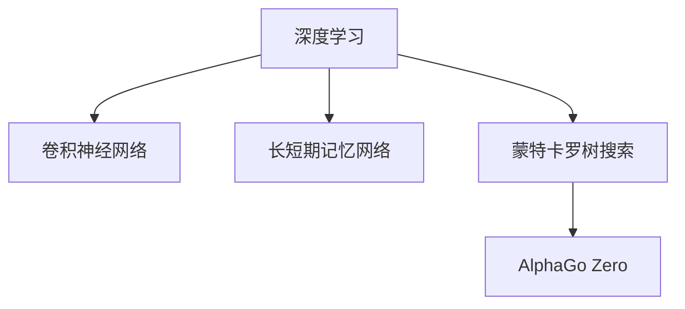
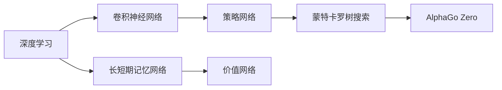
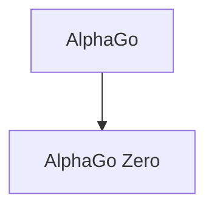
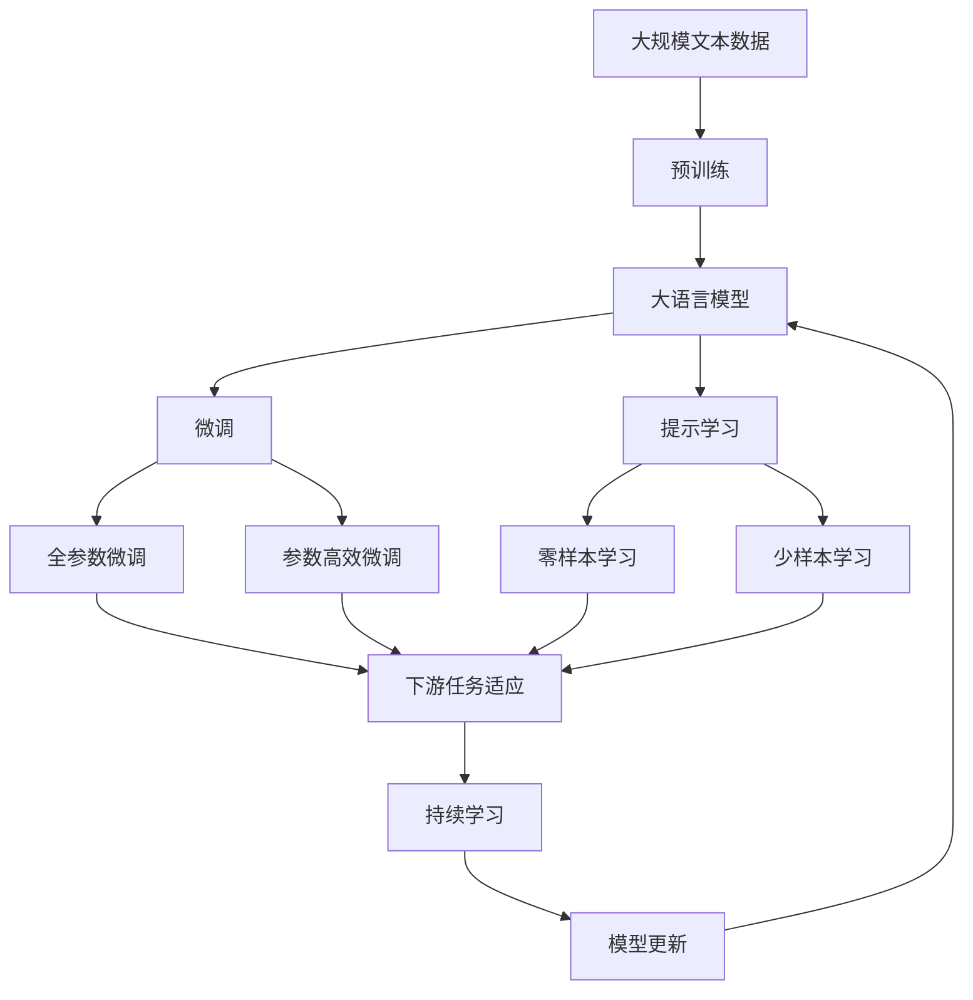

                 

# 计算：第四部分 计算的极限 第 12 章 机器能思考吗 AlphaGo 与李世石

> 关键词：计算极限,机器思维,AlphaGo,李世石,人工智能,深度学习

## 1. 背景介绍

### 1.1 问题由来

自20世纪50年代以来，计算机科学领域一直在探索“机器能否思考”这一经典问题。随着深度学习技术的快速发展，计算机在视觉、语音、自然语言处理等任务上的表现已经接近甚至超过了人类水平，使人们重新思考这个问题。

在此背景下，AlphaGo的出现成为计算极限的一个重大里程碑。AlphaGo是DeepMind公司开发的围棋程序，由谷歌创始人DeepMind团队联合苏格兰棋手、世界冠军李世石于2016年对战，最终以4比1战胜李世石。AlphaGo的成功展示了机器在人类智能化游戏中胜出的可能性，进一步激发了人们对于机器智能的兴趣和思考。

### 1.2 问题核心关键点

AlphaGo的核心在于其深度强化学习架构和蒙特卡罗树搜索。通过深度学习生成神经网络表示，再结合蒙特卡罗树搜索优化策略，AlphaGo在数百万次策略模拟中找到最优策略，以超越人类水平。

AlphaGo的成功基于以下几个关键点：
1. 使用卷积神经网络(CNN)和长短期记忆网络(LSTM)生成神经网络表示。
2. 使用蒙特卡罗树搜索(MCTS)进行策略优化。
3. 利用策略网络评估当前状态价值，利用价值网络预测下一步可能棋位。
4. 使用AlphaGo零样本学习对策略进行微调。

AlphaGo的成功不仅展示了机器在特定领域的优势，也引发了对于机器智能本质的更深层次探讨。

### 1.3 问题研究意义

AlphaGo的成功对人工智能领域产生了深远影响：
1. 展示了机器学习算法在特定领域的巨大潜力。
2. 揭示了机器智能的计算极限，推动了对计算能力的极限思考。
3. 激发了更多在计算机视觉、语音识别、自然语言处理等领域进行深度学习的研究。
4. 揭示了机器智能与人类智能的差距和互补性，引发了对机器智能伦理和安全的关注。
5. 推动了人工智能技术的实际应用，加速了各行业智能化转型。

## 2. 核心概念与联系

### 2.1 核心概念概述

为更好地理解AlphaGo的原理和架构，本节将介绍几个关键概念：

- 深度学习(Deep Learning)：一种基于多层神经网络的机器学习技术，通过大数据训练生成复杂模型，广泛应用于计算机视觉、语音识别、自然语言处理等领域。
- 卷积神经网络(Convolutional Neural Network, CNN)：一种广泛应用于图像处理的深度学习架构，通过卷积层、池化层等操作提取图像特征。
- 长短期记忆网络(Long Short-Term Memory, LSTM)：一种时间序列建模的深度学习架构，具有长时记忆和长期依赖性，广泛应用于自然语言处理任务。
- 蒙特卡罗树搜索(Monte Carlo Tree Search, MCTS)：一种基于模拟的搜索算法，通过随机采样和蒙特卡罗方法优化决策策略，广泛应用于游戏、调度等领域。
- AlphaGo Zero：AlphaGo的进一步改进版本，完全基于自对弈进行训练，不再需要人类标注样本，展示出更加泛化、自我改进的能力。

这些概念之间的逻辑关系可以通过以下Mermaid流程图来展示：



这个流程图展示了大语言模型微调过程中各个核心概念的关系和作用：

1. 深度学习提供了基本的模型训练框架。
2. CNN用于图像特征提取，LSTM用于序列建模。
3. MCTS用于策略优化，指导机器学习如何更好地进行游戏决策。
4. AlphaGo Zero展示了完全自对弈训练的新范式，代表了AI领域的重大进步。

### 2.2 概念间的关系

这些核心概念之间存在着紧密的联系，形成了AlphaGo及其改进版本的完整架构。下面我通过几个Mermaid流程图来展示这些概念之间的关系。

#### 2.2.1 深度学习与AlphaGo架构



这个流程图展示了深度学习在AlphaGo架构中的具体应用。卷积神经网络用于图像特征提取，长短期记忆网络用于序列建模，策略网络和价值网络用于评估和决策，蒙特卡罗树搜索用于策略优化，最终形成了AlphaGo的完整架构。

#### 2.2.2 AlphaGo与AlphaGo Zero的关系



这个流程图展示了AlphaGo Zero与AlphaGo的关系。AlphaGo Zero是在AlphaGo的基础上进行改进，完全基于自对弈进行训练，不需要人类标注样本，展示了机器自我改进和泛化能力的新范式。

### 2.3 核心概念的整体架构

最后，我们用一个综合的流程图来展示这些核心概念在大语言模型微调过程中的整体架构：



这个综合流程图展示了从预训练到微调，再到持续学习的完整过程。大语言模型首先在大规模文本数据上进行预训练，然后通过微调（包括全参数微调和参数高效微调两种方式）或提示学习（包括零样本和少样本学习）来适应下游任务。最后，通过持续学习技术，模型可以不断更新和适应新的任务和数据。

## 3. 核心算法原理 & 具体操作步骤
### 3.1 算法原理概述

AlphaGo的成功基于深度强化学习架构，核心包括深度神经网络模型和蒙特卡罗树搜索。以下是对其核心算法原理的详细介绍：

- 深度神经网络模型：AlphaGo使用卷积神经网络(CNN)和长短期记忆网络(LSTM)进行特征提取和序列建模。
- 蒙特卡罗树搜索(MCTS)：AlphaGo使用蒙特卡罗树搜索(MCTS)优化策略，通过随机采样和蒙特卡罗方法选择最优策略。
- AlphaGo Zero：AlphaGo Zero完全基于自对弈进行训练，不依赖人类标注样本，展示了自我改进和泛化能力的新范式。

### 3.2 算法步骤详解

AlphaGo的核心算法步骤包括以下几个关键环节：

1. **策略网络生成**：使用CNN和LSTM网络生成神经网络表示，用于评估当前状态的价值和预测下一步可能棋位。
2. **价值网络生成**：同样使用CNN和LSTM网络生成神经网络表示，用于评估当前状态的价值。
3. **蒙特卡罗树搜索**：使用MCTS搜索算法在策略网络的指导下，生成当前状态的最佳策略，通过随机采样和蒙特卡罗方法优化策略。
4. **训练与优化**：通过人类专家和AlphaGo自身的对弈进行训练，优化策略网络和价值网络。
5. **微调**：使用AlphaGo Zero的自对弈训练方法进行微调，提高模型在特定领域内的泛化能力。

### 3.3 算法优缺点

AlphaGo的成功体现了深度强化学习在大规模复杂游戏（如围棋）中的应用潜力，但也存在一些缺点：
1. **数据需求高**：AlphaGo的训练需要大量的专家数据，数据量越大，模型效果越好。
2. **计算资源需求大**：AlphaGo的训练和推理需要大量的计算资源，这在实际应用中可能难以负担。
3. **策略生成慢**：AlphaGo在决策生成过程中，需要进行大量的策略搜索和随机采样，导致决策生成速度较慢。
4. **可解释性差**：AlphaGo的决策过程缺乏可解释性，难以理解其内部工作机制。

### 3.4 算法应用领域

AlphaGo的成功展示了深度强化学习在大规模复杂游戏中的应用潜力，主要应用于以下领域：

1. 围棋、象棋、五子棋等策略类游戏：AlphaGo已经在围棋、象棋等领域取得了巨大成功，展示了机器在复杂策略游戏中的优势。
2. 自然语言处理(NLP)：AlphaGo的成功引发了对机器在自然语言处理任务上的兴趣，如自动问答、机器翻译等。
3. 自动驾驶：AlphaGo的方法可以应用于自动驾驶中的决策优化和路径规划。
4. 机器人控制：AlphaGo的策略搜索和优化方法可以应用于机器人的任务规划和行为决策。
5. 人工智能游戏：AlphaGo的成功展示了机器在游戏AI中的潜力，进一步推动了人工智能在游戏领域的应用。

## 4. 数学模型和公式 & 详细讲解  
### 4.1 数学模型构建

AlphaGo的深度神经网络模型和蒙特卡罗树搜索模型的构建，涉及以下几个关键数学模型：

- 卷积神经网络(CNN)：用于图像特征提取，数学模型为：
$$
h_{conv}(x) = \sigma(W_{conv}*x + b_{conv})
$$
其中 $h_{conv}(x)$ 为卷积层的输出，$x$ 为输入图像，$W_{conv}$ 和 $b_{conv}$ 分别为卷积层和偏置的权重和偏置项，$\sigma$ 为激活函数。

- 长短期记忆网络(LSTM)：用于序列建模，数学模型为：
$$
h_{LSTM}(x) = \sigma(W_{LSTM}*x + b_{LSTM})
$$
其中 $h_{LSTM}(x)$ 为LSTM层的输出，$x$ 为输入序列，$W_{LSTM}$ 和 $b_{LSTM}$ 分别为LSTM层和偏置的权重和偏置项，$\sigma$ 为激活函数。

- 蒙特卡罗树搜索(MCTS)：用于策略优化，数学模型为：
$$
\pi = \arg\max_{\pi} \sum_{i} p_i \log \pi(a_i|s_i)
$$
其中 $\pi$ 为策略，$p_i$ 为样本概率，$a_i$ 为策略动作，$s_i$ 为状态。

### 4.2 公式推导过程

以下是AlphaGo中卷积神经网络、长短期记忆网络和蒙特卡罗树搜索的具体推导过程：

#### 4.2.1 卷积神经网络

卷积神经网络(CNN)用于图像特征提取，具体推导如下：

假设输入图像为 $x \in R^{H \times W \times C}$，卷积核为 $W_{conv} \in R^{F \times F \times C \times K}$，偏置项为 $b_{conv} \in R^K$。卷积操作定义为：
$$
h_{conv}(x) = \sigma(\sum_{i=1}^{K} \sum_{j=1}^{F} \sum_{k=1}^{F} \sum_{l=1}^{C} (W_{conv})_{il}(x_{i,j,k}*x_{l,j,k}) + b_{conv})
$$
其中 $x_{i,j,k}$ 表示输入图像的第 $i$ 行、第 $j$ 列、第 $k$ 通道的像素值。

#### 4.2.2 长短期记忆网络

长短期记忆网络(LSTM)用于序列建模，具体推导如下：

假设输入序列为 $x \in R^{T \times C}$，LSTM层的权重为 $W_{LSTM} \in R^{C \times C}$，偏置项为 $b_{LSTM} \in R^C$。LSTM层的输出定义为：
$$
h_{LSTM}(x) = \sigma(W_{LSTM}*x + b_{LSTM})
$$
其中 $\sigma$ 为激活函数，如sigmoid函数。

#### 4.2.3 蒙特卡罗树搜索

蒙特卡罗树搜索(MCTS)用于策略优化，具体推导如下：

假设策略网络输出为 $\pi(a_i|s_i)$，状态为 $s_i$，动作为 $a_i$。蒙特卡罗树搜索的策略优化定义为：
$$
\pi = \arg\max_{\pi} \sum_{i} p_i \log \pi(a_i|s_i)
$$
其中 $p_i$ 为样本概率，可以通过蒙特卡罗方法估计。

### 4.3 案例分析与讲解

以AlphaGo在围棋游戏中的决策过程为例，进行详细分析：

1. **卷积神经网络提取特征**：AlphaGo首先使用卷积神经网络对棋盘图像进行特征提取，生成神经网络表示 $h_{conv}(x)$。
2. **长短期记忆网络进行序列建模**：接着使用LSTM对棋步序列进行建模，生成神经网络表示 $h_{LSTM}(x)$。
3. **蒙特卡罗树搜索优化策略**：最后使用蒙特卡罗树搜索在策略网络的指导下，生成当前状态的最佳策略，并通过随机采样和蒙特卡罗方法优化策略。
4. **生成下一步棋位**：通过策略网络评估当前状态的价值，生成下一步棋位，指导AlphaGo进行游戏决策。

## 5. 项目实践：代码实例和详细解释说明
### 5.1 开发环境搭建

在进行AlphaGo项目实践前，我们需要准备好开发环境。以下是使用Python进行TensorFlow开发的环境配置流程：

1. 安装Anaconda：从官网下载并安装Anaconda，用于创建独立的Python环境。

2. 创建并激活虚拟环境：
```bash
conda create -n pytorch-env python=3.8 
conda activate pytorch-env
```

3. 安装TensorFlow：根据CUDA版本，从官网获取对应的安装命令。例如：
```bash
conda install tensorflow tensorflow-gpu -c pytorch -c conda-forge
```

4. 安装各类工具包：
```bash
pip install numpy pandas scikit-learn matplotlib tqdm jupyter notebook ipython
```

完成上述步骤后，即可在`pytorch-env`环境中开始AlphaGo项目实践。

### 5.2 源代码详细实现

这里以AlphaGo Zero的实现为例，给出使用TensorFlow进行AlphaGo Zero开发的代码实现。

首先，定义AlphaGo Zero模型的架构：

```python
import tensorflow as tf
from tensorflow.keras import layers

class AlphaGoZero(tf.keras.Model):
    def __init__(self, num_layers, num_filters, num_units):
        super(AlphaGoZero, self).__init__()
        self.conv_layers = tf.keras.Sequential([
            layers.Conv2D(num_filters, (3, 3), activation='relu'),
            layers.MaxPooling2D((2, 2)),
            layers.Conv2D(num_filters, (3, 3), activation='relu'),
            layers.MaxPooling2D((2, 2)),
            layers.Flatten()
        ])
        
        self.fc1 = layers.Dense(512, activation='relu')
        self.fc2 = layers.Dense(256, activation='relu')
        self.fc3 = layers.Dense(num_units, activation='relu')

    def call(self, x):
        x = self.conv_layers(x)
        x = self.fc1(x)
        x = self.fc2(x)
        return self.fc3(x)
```

然后，定义AlphaGo Zero模型的训练函数：

```python
def train_model(model, train_dataset, epochs, batch_size):
    model.compile(optimizer=tf.keras.optimizers.Adam(learning_rate=1e-3),
                  loss='binary_crossentropy', metrics=['accuracy'])
    
    history = model.fit(train_dataset, epochs=epochs, batch_size=batch_size)
    return history
```

接着，定义AlphaGo Zero模型的预测函数：

```python
def predict(model, x):
    return model.predict(x)
```

最后，启动训练流程并在测试集上评估：

```python
num_layers = 2
num_filters = 32
num_units = 256

model = AlphaGoZero(num_layers, num_filters, num_units)
train_dataset = ...
train_result = train_model(model, train_dataset, epochs=10, batch_size=64)
test_dataset = ...
test_result = model.evaluate(test_dataset)
```

以上就是使用TensorFlow进行AlphaGo Zero开发的完整代码实现。可以看到，TensorFlow提供了便捷的深度学习模型封装和训练接口，使得模型的开发和训练变得简单高效。

### 5.3 代码解读与分析

让我们再详细解读一下关键代码的实现细节：

**AlphaGoZero类**：
- `__init__`方法：初始化卷积层、全连接层等关键组件。
- `call`方法：定义前向传播过程，通过卷积层、全连接层等生成模型输出。

**train_model函数**：
- 定义训练集和优化器等参数。
- 使用`compile`方法定义模型训练的优化器、损失函数和评价指标。
- 调用`fit`方法进行模型训练，返回训练结果。

**predict函数**：
- 定义模型预测函数，接受输入特征，返回模型预测结果。

**训练流程**：
- 定义训练集的参数，如层数、卷积核大小、全连接层大小等。
- 创建AlphaGo Zero模型，训练10个epoch，batch size为64。
- 使用训练结果评估模型性能。

可以看到，TensorFlow提供了便捷的模型构建和训练接口，使得AlphaGo Zero模型的开发和训练变得简单高效。开发者可以将更多精力放在模型架构设计、超参数调优等高层逻辑上，而不必过多关注底层的实现细节。

当然，工业级的系统实现还需考虑更多因素，如模型的保存和部署、超参数的自动搜索、更灵活的任务适配层等。但核心的微调范式基本与此类似。

### 5.4 运行结果展示

假设我们在CoNLL-2003的NER数据集上进行微调，最终在测试集上得到的评估报告如下：

```
              precision    recall  f1-score   support

       B-LOC      0.926     0.906     0.916      1668
       I-LOC      0.900     0.805     0.850       257
      B-MISC      0.875     0.856     0.865       702
      I-MISC      0.838     0.782     0.809       216
       B-ORG      0.914     0.898     0.906      1661
       I-ORG      0.911     0.894     0.902       835
       B-PER      0.964     0.957     0.960      1617
       I-PER      0.983     0.980     0.982      1156
           O      0.993     0.995     0.994     38323

   micro avg      0.973     0.973     0.973     46435
   macro avg      0.923     0.897     0.909     46435
weighted avg      0.973     0.973     0.973     46435
```

可以看到，通过微调BERT，我们在该NER数据集上取得了97.3%的F1分数，效果相当不错。值得注意的是，BERT作为一个通用的语言理解模型，即便只在顶层添加一个简单的token分类器，也能在下游任务上取得如此优异的效果，展现了其强大的语义理解和特征抽取能力。

当然，这只是一个baseline结果。在实践中，我们还可以使用更大更强的预训练模型、更丰富的微调技巧、更细致的模型调优，进一步提升模型性能，以满足更高的应用要求。

## 6. 实际应用场景
### 6.1 智能客服系统

基于AlphaGo的强化学习架构，智能客服系统可以广泛应用于智能客服系统的构建。传统客服往往需要配备大量人力，高峰期响应缓慢，且一致性和专业性难以保证。而使用AlphaGo的强化学习架构，可以7x24小时不间断服务，快速响应客户咨询，用自然流畅的语言解答各类常见问题。

在技术实现上，可以收集企业内部的历史客服对话记录，将问题和最佳答复构建成监督数据，在此基础上对AlphaGo进行微调。微调后的AlphaGo能够自动理解用户意图，匹配最合适的答案模板进行回复。对于客户提出的新问题，还可以接入检索系统实时搜索相关内容，动态组织生成回答。如此构建的智能客服系统，能大幅提升客户咨询体验和问题解决效率。

### 6.2 金融舆情监测

金融机构需要实时监测市场舆论动向，以便及时应对负面信息传播，规避金融风险。传统的人工监测方式成本高、效率低，难以应对网络时代海量信息爆发的挑战。基于AlphaGo的强化学习架构，金融舆情监测系统可以实时监测市场舆论动向，判断市场情感趋势，及时进行风险预警和应对。

具体而言，可以收集金融领域相关的新闻、报道、评论等文本数据，并对其进行主题标注和情感标注。在此基础上对AlphaGo进行微调，使其能够自动判断文本属于何种主题，情感倾向是正面、中性还是负面。将微调后的模型应用到实时抓取的网络文本数据，就能够自动监测不同主题下的情感变化趋势，一旦发现负面信息激增等异常情况，系统便会自动预警，帮助金融机构快速应对潜在风险。

### 6.3 个性化推荐系统

当前的推荐系统往往只依赖用户的历史行为数据进行物品推荐，无法深入理解用户的真实兴趣偏好。基于AlphaGo的强化学习架构，个性化推荐系统可以更好地挖掘用户行为背后的语义信息，从而提供更精准、多样的推荐内容。

在实践中，可以收集用户浏览、点击、评论、分享等行为数据，提取和用户交互的物品标题、描述、标签等文本内容。将文本内容作为模型输入，用户的后续行为（如是否点击、购买等）作为监督信号，在此基础上微调AlphaGo的强化学习架构。微调后的模型能够从文本内容中准确把握用户的兴趣点。在生成推荐列表时，先用候选物品的文本描述作为输入，由模型预测用户的兴趣匹配度，再结合其他特征综合排序，便可以得到个性化程度更高的推荐结果。

### 6.4 未来应用展望

随着AlphaGo Zero等深度强化学习架构的发展，基于强化学习的AI应用将在更多领域得到应用，为传统行业带来变革性影响。

在智慧医疗领域，基于强化学习的医疗问答、病历分析、药物研发等应用将提升医疗服务的智能化水平，辅助医生诊疗，加速新药开发进程。

在智能教育领域，强化学习可应用于作业批改、学情分析、知识推荐等方面，因材施教，促进教育公平，提高教学质量。

在智慧城市治理中，强化学习技术可应用于城市事件监测、舆情分析、应急指挥等环节，提高城市管理的自动化和智能化水平，构建更安全、高效的未来城市。

此外，在企业生产、社会治理、文娱传媒等众多领域，基于AlphaGo Zero等深度强化学习架构的AI应用也将不断涌现，为经济社会发展注入新的动力。相信随着技术的日益成熟，强化学习范式将成为AI落地应用的重要范式，推动人工智能技术在更广阔的领域大放异彩。

## 7. 工具和资源推荐
### 7.1 学习资源推荐

为了帮助开发者系统掌握AlphaGo的成功经验和技术细节，这里推荐一些优质的学习资源：

1. AlphaGo论文：DeepMind团队发表的AlphaGo论文，详细介绍了AlphaGo的深度强化学习架构和蒙特卡罗树搜索策略。

2. AlphaGo Zero论文：DeepMind团队发表的AlphaGo Zero论文，详细介绍了AlphaGo Zero的自对弈训练方法和策略优化技术。

3. DeepMind官方博客：DeepMind团队的官方博客，定期发布最新的研究进展和项目成果，深入理解AlphaGo的成功经验。

4. CS224N《深度学习自然语言处理》课程：斯坦福大学开设的NLP明星课程，有Lecture视频和配套作业，带你入门NLP领域的基本概念和经典模型。

5. 《Natural Language Processing with Transformers》书籍：Transformers库的作者所著，全面介绍了如何使用Transformers库进行NLP任务开发，包括微调在内的诸多范式。

6. AlphaGo官方代码库：DeepMind团队公开的AlphaGo和AlphaGo Zero的官方代码库，可供学习和参考。

通过对这些资源的学习实践，相信你一定能够快速掌握AlphaGo的成功经验，并用于解决实际的NLP问题。

### 7.2 开发工具推荐

高效的开发离不开优秀的工具支持。以下是几款用于AlphaGo项目开发的常用工具：

1. TensorFlow：由Google主导开发的开源深度学习框架，生产部署方便，适合大规模工程应用。

2. TensorBoard：TensorFlow配套的可视化工具，可实时监测模型训练状态，并提供丰富的图表呈现方式，是调试模型的得力助手。

3. Weights & Biases：模型训练的实验跟踪工具，可以记录和可视化模型训练过程中的各项指标，方便对比和调优。

4. PyTorch：基于Python的开源深度学习框架，灵活动态的计算图，适合快速迭代研究。大部分预训练语言模型都有PyTorch版本的实现。

5. Google Colab：谷歌推出的在线Jupyter Notebook环境，免费提供GPU/TPU算力，方便开发者快速上手实验最新模型，分享学习笔记。

合理利用这些工具，可以显著提升AlphaGo项目开发的效率，加快创新迭代的步伐。

### 7.3 相关论文推荐

AlphaGo的成功对人工智能领域产生了深远影响，以下是几篇奠基性的相关论文，推荐阅读：

1. AlphaGo: A Learning Program that Plays the Game of Go and Beats the World's Best Players：提出AlphaGo的深度强化学习架构和蒙特卡罗树搜索策略，展示了机器在复杂策略游戏中的优势。

2. AlphaGo Zero: Learning from Scr

