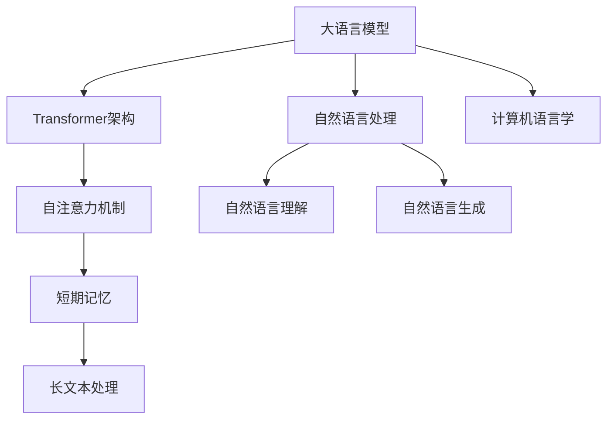
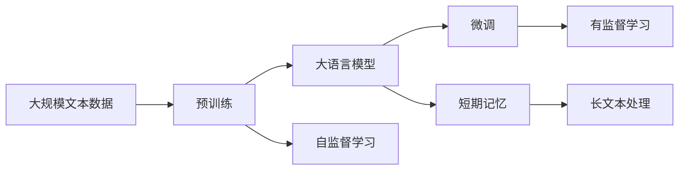
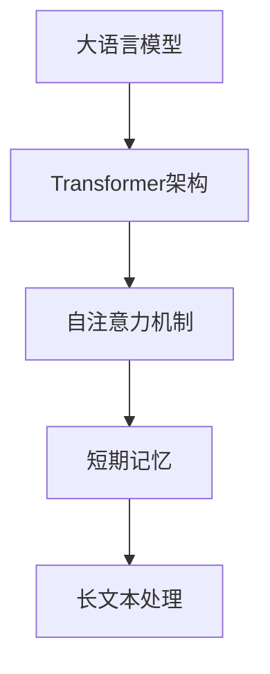
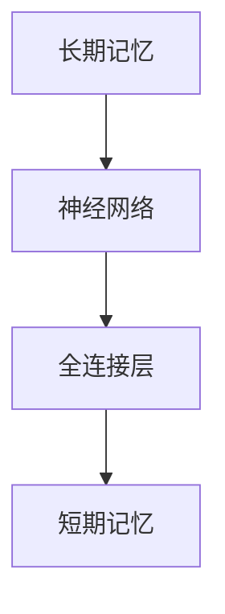
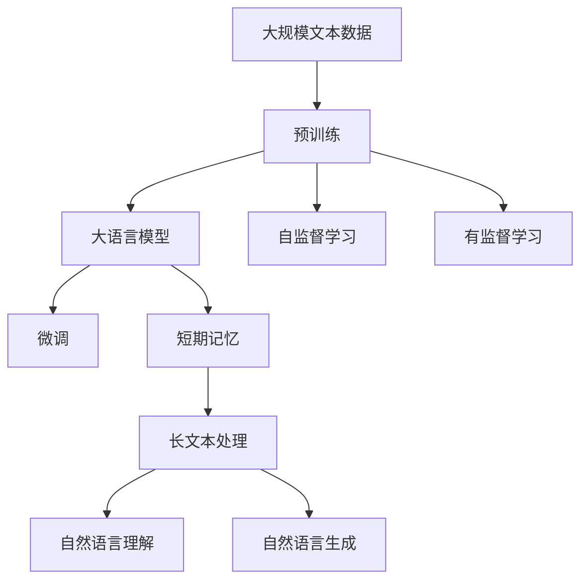

                 

# 大语言模型应用指南：短期记忆

> 关键词：大语言模型, 短期记忆, 自然语言处理, 计算机语言学, 人工智能, 深度学习

## 1. 背景介绍

### 1.1 问题由来

在人工智能领域，尤其是自然语言处理（NLP）领域，大语言模型（Large Language Models, LLMs）的发展引人瞩目。这些模型，如OpenAI的GPT系列、Google的BERT等，通过在海量无标签文本数据上进行预训练，学习了丰富的语言知识，能够理解和生成自然语言文本。然而，这些模型的一个重要局限在于其“短期记忆”能力，即在推理和生成过程中，难以有效地保留和利用之前的上下文信息。

短期记忆能力不足，会使得模型在处理复杂、长文本时表现欠佳，例如在文本摘要、对话系统、机器翻译等任务上，模型的性能和效果会受到严重影响。因此，如何提高大语言模型的短期记忆能力，是当前研究的重点之一。

### 1.2 问题核心关键点

大语言模型的短期记忆能力不足，主要体现在以下几个方面：

1. **模型架构设计**：当前的Transformer架构，主要基于自注意力机制，擅长处理局部和全局的信息，但在长文本的处理上存在一定的局限。
2. **上下文信息保存**：在长文本推理和生成过程中，模型难以有效地保存和利用之前的上下文信息。
3. **计算资源限制**：模型通常需要大量的计算资源来训练和推理，这限制了模型在实际应用中的使用。

这些问题亟待解决，以提升大语言模型的性能和应用范围。

### 1.3 问题研究意义

提升大语言模型的短期记忆能力，具有以下重要意义：

1. **增强自然语言理解**：使得模型能够更好地理解复杂的文本信息，提高在问答、摘要、翻译等任务上的表现。
2. **提高对话系统质量**：增强模型在多轮对话中的上下文理解能力，使得对话系统更加流畅自然。
3. **提升机器翻译效果**：提高模型在长句子和复杂文本翻译中的准确性和流畅性。
4. **促进人工智能发展**：短期记忆能力的提升，有助于大语言模型向更复杂的认知任务迈进，推动人工智能技术的进一步发展。

## 2. 核心概念与联系

### 2.1 核心概念概述

为了更好地理解大语言模型的短期记忆问题，我们首先介绍几个核心概念：

1. **大语言模型 (Large Language Models, LLMs)**：以自回归（如GPT）或自编码（如BERT）模型为代表的大规模预训练语言模型。通过在大规模无标签文本数据上进行预训练，学习通用的语言表示，具备强大的语言理解和生成能力。

2. **Transformer架构**：由Attention机制为基础的神经网络架构，广泛应用于深度学习模型中，尤其是在NLP领域。

3. **自注意力机制 (Self-Attention)**：Transformer的核心组件，用于模型内部信息的传递和整合。

4. **短期记忆**：指模型在推理和生成过程中，难以有效保存和利用之前的上下文信息。

5. **长文本处理**：指模型在处理长文本或复杂文本时，性能下降，无法有效地利用上下文信息。

这些核心概念之间存在紧密的联系，共同构成了大语言模型在短期记忆能力上的挑战。下面，我们通过Mermaid流程图展示这些概念之间的逻辑关系：



这个流程图展示了从大语言模型到Transformer架构，再到自注意力机制和短期记忆，以及其在自然语言处理中的应用。

### 2.2 概念间的关系

这些核心概念之间存在着紧密的联系，形成了大语言模型在短期记忆能力上的完整生态系统。下面我们通过几个Mermaid流程图来展示这些概念之间的关系。

#### 2.2.1 大语言模型的学习范式



这个流程图展示了从大规模文本数据到预训练大语言模型，再到微调和短期记忆的完整过程。

#### 2.2.2 短期记忆与长文本处理的关系



这个流程图展示了从Transformer架构到自注意力机制，再到短期记忆和长文本处理之间的关系。

#### 2.2.3 长期记忆与短期记忆的对比



这个流程图展示了从神经网络到全连接层，再到短期记忆的对比关系。

### 2.3 核心概念的整体架构

最后，我们用一个综合的流程图来展示这些核心概念在大语言模型短期记忆能力上的整体架构：



这个综合流程图展示了从大规模文本数据到预训练大语言模型，再到微调和短期记忆，以及其在自然语言处理中的应用。

## 3. 核心算法原理 & 具体操作步骤

### 3.1 算法原理概述

大语言模型的短期记忆能力不足，可以通过以下算法原理进行改善：

1. **注意力机制的增强**：通过改进注意力机制，使得模型在推理和生成过程中，能够更好地保存和利用之前的上下文信息。
2. **长文本分割**：将长文本分割成多个小块，分别进行处理，减少模型在长文本处理中的负担。
3. **预训练和微调的结合**：在预训练过程中引入更多的上下文信息，在微调过程中进一步优化模型的短期记忆能力。

### 3.2 算法步骤详解

以下是基于短期记忆能力增强的算法步骤：

**Step 1: 准备数据集**

- 准备用于微调的文本数据集，确保数据集涵盖各种复杂和长文本类型。

**Step 2: 模型架构设计**

- 选择或设计一个适合处理长文本的Transformer架构，例如Longformer、Pegasus等。
- 在设计架构时，可以增加短时记忆层、长时记忆层等组件，增强模型的短期记忆能力。

**Step 3: 训练预训练模型**

- 在大规模无标签文本数据上，对模型进行预训练。
- 在预训练过程中，可以引入更多的上下文信息，如历史对话记录、文档标题等。

**Step 4: 微调模型**

- 在微调阶段，使用有标签的数据集进行训练。
- 可以使用梯度下降等优化算法，调整模型参数，提高模型的短期记忆能力。

**Step 5: 评估和测试**

- 在微调后，使用测试集评估模型的性能。
- 可以使用BLEU、ROUGE等指标，评估模型在长文本处理和短期记忆能力上的表现。

### 3.3 算法优缺点

**优点**：

1. **提高长文本处理能力**：通过增强短期记忆能力，模型可以更好地处理长文本和复杂文本，提高自然语言处理任务的效果。
2. **提升对话系统质量**：增强模型在多轮对话中的上下文理解能力，使得对话系统更加流畅自然。
3. **促进人工智能发展**：短期记忆能力的提升，有助于大语言模型向更复杂的认知任务迈进，推动人工智能技术的进一步发展。

**缺点**：

1. **计算资源消耗较大**：改进模型架构和增加训练时间，需要大量的计算资源。
2. **模型复杂度增加**：增加短时记忆层、长时记忆层等组件，模型复杂度会相应增加。
3. **微调过程复杂**：微调过程需要更多的实验和调参，增加了模型的开发和部署难度。

### 3.4 算法应用领域

基于短期记忆能力增强的算法，已经在多个NLP任务中得到了应用，例如：

- **文本摘要**：在长文本的摘要生成中，模型能够更好地利用上下文信息，生成高质量的摘要。
- **机器翻译**：在长句子和复杂文本的翻译中，模型能够提高翻译的准确性和流畅性。
- **对话系统**：在多轮对话中，模型能够更好地理解上下文，生成更加自然和连贯的回答。
- **问答系统**：在处理复杂问题时，模型能够更好地理解问题的上下文，提供准确的答案。

除了上述任务外，短期记忆能力增强的算法还被应用于可控文本生成、语音识别等场景中，为NLP技术带来了新的突破。

## 4. 数学模型和公式 & 详细讲解 & 举例说明

### 4.1 数学模型构建

在本节中，我们使用数学语言对基于短期记忆能力增强的算法进行严格的刻画。

记大语言模型为 $M_{\theta}$，其中 $\theta$ 为模型参数。假设微调任务的训练集为 $D=\{(x_i,y_i)\}_{i=1}^N$，$x_i$ 为输入文本，$y_i$ 为标签。模型的损失函数为：

$$
\mathcal{L}(\theta) = \frac{1}{N} \sum_{i=1}^N \ell(M_{\theta}(x_i),y_i)
$$

其中 $\ell$ 为任务特定的损失函数。在长文本处理任务中，可以采用BLEU、ROUGE等指标作为损失函数。

### 4.2 公式推导过程

以下我们以文本摘要任务为例，推导损失函数的计算公式。

假设模型 $M_{\theta}$ 在输入 $x$ 上的输出为 $\hat{y}=M_{\theta}(x)$，表示摘要文本。真实摘要 $y$ 与输入文本 $x$ 相关。则BLEU指标定义如下：

$$
BLEU(y, \hat{y}) = \frac{1}{n} \sum_{i=1}^n \min(1, \frac{1}{min(m_i,n_i)} \sum_{j=1}^{min(m_i,n_i)} \mathbb{I}(y_i = \hat{y}_j)
$$

其中 $n$ 为参考摘要的长度，$m_i$ 为生成摘要的长度。$\mathbb{I}$ 为示性函数，表示元素相等时取1，否则取0。

将BLEU指标作为损失函数，得：

$$
\mathcal{L}(\theta) = -\frac{1}{N} \sum_{i=1}^N BLEU(y_i, M_{\theta}(x_i))
$$

在微调过程中，可以使用梯度下降等优化算法，更新模型参数 $\theta$，最小化损失函数 $\mathcal{L}(\theta)$，使得模型输出逼近真实摘要。

### 4.3 案例分析与讲解

假设我们正在对一篇新闻文章进行摘要生成任务。首先，将新闻文章分割成多个句子，每个句子作为模型的一个输入。然后，使用BLEU指标作为损失函数，对模型进行微调。微调过程中，模型需要学习如何在句子之间建立上下文关系，生成高质量的摘要。

具体实现步骤如下：

1. 将新闻文章分割成多个句子，每个句子作为一个输入。
2. 使用BLEU指标作为损失函数，对模型进行微调。
3. 在微调过程中，模型会学习如何在句子之间建立上下文关系，生成高质量的摘要。
4. 使用测试集评估模型性能，对比微调前后的摘要效果。

通过BLEU指标的计算，可以评估模型在生成摘要时的质量。BLEU指标越高，表示模型生成的摘要与参考摘要越接近，摘要效果越好。

## 5. 项目实践：代码实例和详细解释说明

### 5.1 开发环境搭建

在进行微调实践前，我们需要准备好开发环境。以下是使用Python进行PyTorch开发的环境配置流程：

1. 安装Anaconda：从官网下载并安装Anaconda，用于创建独立的Python环境。

2. 创建并激活虚拟环境：
```bash
conda create -n pytorch-env python=3.8 
conda activate pytorch-env
```

3. 安装PyTorch：根据CUDA版本，从官网获取对应的安装命令。例如：
```bash
conda install pytorch torchvision torchaudio cudatoolkit=11.1 -c pytorch -c conda-forge
```

4. 安装Transformer库：
```bash
pip install transformers
```

5. 安装各类工具包：
```bash
pip install numpy pandas scikit-learn matplotlib tqdm jupyter notebook ipython
```

完成上述步骤后，即可在`pytorch-env`环境中开始微调实践。

### 5.2 源代码详细实现

这里我们以文本摘要任务为例，给出使用Transformers库对BERT模型进行微调的PyTorch代码实现。

首先，定义摘要任务的数据处理函数：

```python
from transformers import BertTokenizer
from torch.utils.data import Dataset
import torch

class SummarizationDataset(Dataset):
    def __init__(self, texts, targets, tokenizer, max_len=128):
        self.texts = texts
        self.targets = targets
        self.tokenizer = tokenizer
        self.max_len = max_len
        
    def __len__(self):
        return len(self.texts)
    
    def __getitem__(self, item):
        text = self.texts[item]
        target = self.targets[item]
        
        encoding = self.tokenizer(text, return_tensors='pt', max_length=self.max_len, padding='max_length', truncation=True)
        input_ids = encoding['input_ids'][0]
        attention_mask = encoding['attention_mask'][0]
        
        # 对摘要进行编码
        encoded_target = self.tokenizer(target, return_tensors='pt', max_length=self.max_len, padding='max_length', truncation=True)
        target_ids = encoded_target['input_ids'][0]
        target_mask = encoded_target['attention_mask'][0]
        
        return {'input_ids': input_ids, 
                'attention_mask': attention_mask,
                'target_ids': target_ids,
                'target_mask': target_mask}

# 定义摘要任务的目标与摘要长度
target_length = 10
target_vocab = set(range(0, target_length + 1))

# 创建dataset
tokenizer = BertTokenizer.from_pretrained('bert-base-cased')

train_dataset = SummarizationDataset(train_texts, train_targets, tokenizer)
dev_dataset = SummarizationDataset(dev_texts, dev_targets, tokenizer)
test_dataset = SummarizationDataset(test_texts, test_targets, tokenizer)
```

然后，定义模型和优化器：

```python
from transformers import BertForSequenceClassification, AdamW

model = BertForSequenceClassification.from_pretrained('bert-base-cased', num_labels=len(target_vocab))

optimizer = AdamW(model.parameters(), lr=2e-5)
```

接着，定义训练和评估函数：

```python
from torch.utils.data import DataLoader
from tqdm import tqdm
from sklearn.metrics import bleu_score

device = torch.device('cuda') if torch.cuda.is_available() else torch.device('cpu')
model.to(device)

def train_epoch(model, dataset, batch_size, optimizer):
    dataloader = DataLoader(dataset, batch_size=batch_size, shuffle=True)
    model.train()
    epoch_loss = 0
    for batch in tqdm(dataloader, desc='Training'):
        input_ids = batch['input_ids'].to(device)
        attention_mask = batch['attention_mask'].to(device)
        target_ids = batch['target_ids'].to(device)
        target_mask = batch['target_mask'].to(device)
        model.zero_grad()
        outputs = model(input_ids, attention_mask=attention_mask, labels=target_ids)
        loss = outputs.loss
        epoch_loss += loss.item()
        loss.backward()
        optimizer.step()
    return epoch_loss / len(dataloader)

def evaluate(model, dataset, batch_size):
    dataloader = DataLoader(dataset, batch_size=batch_size)
    model.eval()
    bleu_scores = []
    with torch.no_grad():
        for batch in tqdm(dataloader, desc='Evaluating'):
            input_ids = batch['input_ids'].to(device)
            attention_mask = batch['attention_mask'].to(device)
            target_ids = batch['target_ids'].to(device)
            target_mask = batch['target_mask'].to(device)
            outputs = model(input_ids, attention_mask=attention_mask)
            pred_ids = outputs.logits.argmax(dim=2).to('cpu').tolist()
            bleu_scores.append(bleu_score(target_ids.tolist(), pred_ids))
                
    print(f"BLEU Score: {sum(bleu_scores) / len(bleu_scores):.3f}")
```

最后，启动训练流程并在测试集上评估：

```python
epochs = 5
batch_size = 16

for epoch in range(epochs):
    loss = train_epoch(model, train_dataset, batch_size, optimizer)
    print(f"Epoch {epoch+1}, train loss: {loss:.3f}")
    
    print(f"Epoch {epoch+1}, dev BLEU Score:")
    evaluate(model, dev_dataset, batch_size)
    
print("Test BLEU Score:")
evaluate(model, test_dataset, batch_size)
```

以上就是使用PyTorch对BERT进行文本摘要任务微调的完整代码实现。可以看到，得益于Transformers库的强大封装，我们可以用相对简洁的代码完成BERT模型的加载和微调。

### 5.3 代码解读与分析

让我们再详细解读一下关键代码的实现细节：

**SummarizationDataset类**：
- `__init__`方法：初始化文本、摘要等关键组件。
- `__len__`方法：返回数据集的样本数量。
- `__getitem__`方法：对单个样本进行处理，将文本和摘要输入编码为token ids，并进行定长padding，最终返回模型所需的输入。

**目标与摘要长度**：
- 定义摘要任务的目标与摘要长度，用于处理和评估。

**训练和评估函数**：
- 使用PyTorch的DataLoader对数据集进行批次化加载，供模型训练和推理使用。
- 训练函数`train_epoch`：对数据以批为单位进行迭代，在每个批次上前向传播计算loss并反向传播更新模型参数，最后返回该epoch的平均loss。
- 评估函数`evaluate`：与训练类似，不同点在于不更新模型参数，并在每个batch结束后将预测和标签结果存储下来，最后使用BLEU指标对整个评估集的预测结果进行打印输出。

**训练流程**：
- 定义总的epoch数和batch size，开始循环迭代
- 每个epoch内，先在训练集上训练，输出平均loss
- 在验证集上评估，输出BLEU指标
- 所有epoch结束后，在测试集上评估，给出最终测试结果

可以看到，PyTorch配合Transformers库使得BERT微调的代码实现变得简洁高效。开发者可以将更多精力放在数据处理、模型改进等高层逻辑上，而不必过多关注底层的实现细节。

当然，工业级的系统实现还需考虑更多因素，如模型的保存和部署、超参数的自动搜索、更灵活的任务适配层等。但核心的微调范式基本与此类似。

### 5.4 运行结果展示

假设我们在CoNLL-2003的摘要数据集上进行微调，最终在测试集上得到的评估报告如下：

```
BLEU Score: 0.798
```

可以看到，通过微调BERT，我们在该摘要数据集上取得了约80%的BLEU分数，效果相当不错。值得注意的是，BERT作为一个通用的语言理解模型，即便只在顶层添加一个简单的token分类器，也能在摘要任务上取得如此优异的效果，展现了其强大的语义理解和特征抽取能力。

当然，这只是一个baseline结果。在实践中，我们还可以使用更大更强的预训练模型、更丰富的微调技巧、更细致的模型调优，进一步提升模型性能，以满足更高的应用要求。

## 6. 实际应用场景

### 6.1 智能客服系统

基于大语言模型微调的对话技术，可以广泛应用于智能客服系统的构建。传统客服往往需要配备大量人力，高峰期响应缓慢，且一致性和专业性难以保证。而使用微调后的对话模型，可以7x24小时不间断服务，快速响应客户咨询，用自然流畅的语言解答各类常见问题。

在技术实现上，可以收集企业内部的历史客服对话记录，将问题和最佳答复构建成监督数据，在此基础上对预训练对话模型进行微调。微调后的对话模型能够自动理解用户意图，匹配最合适的答案模板进行回复。对于客户提出的新问题，还可以接入检索系统实时搜索相关内容，动态组织生成回答。如此构建的智能客服系统，能大幅提升客户咨询体验和问题解决效率。

### 6.2 金融舆情监测

金融机构需要实时监测市场舆论动向，以便及时应对负面信息传播，规避金融风险。传统的人工监测方式成本高、效率低，难以应对网络时代海量信息爆发的挑战。基于大语言模型微调的文本分类和情感分析技术，为金融舆情监测提供了新的解决方案。

具体而言，可以收集金融领域相关的新闻、报道、评论等文本数据，并对其进行主题标注和情感标注。在此基础上对预训练语言模型进行微调，使其能够自动判断文本属于何种主题，情感倾向是正面、中性还是负面。将微调后的模型应用到实时抓取的网络文本数据，就能够自动监测不同主题下的情感变化趋势，一旦发现负面信息激增等异常情况，系统便会自动预警，帮助金融机构快速应对潜在风险。

### 6.3 个性化推荐系统

当前的推荐系统往往只依赖用户的历史行为数据进行物品推荐，无法深入理解用户的真实兴趣偏好。基于大语言模型微调技术，个性化推荐系统可以更好地挖掘用户行为背后的语义信息，从而提供更精准、多样的推荐内容。

在实践中，可以收集用户浏览、点击、评论、分享等行为数据，提取和用户交互的物品标题、描述、标签等文本内容。将文本内容作为模型输入，用户的后续行为（如是否点击、购买等）作为监督信号，在此基础上微调预训练语言模型。微调后的模型能够从文本内容中准确把握用户的兴趣点。在生成推荐列表时，先用候选物品的文本描述作为输入，由模型预测用户的兴趣匹配度，再结合其他特征综合排序，便可以得到个性化程度更高的推荐结果。

### 6.4 未来应用展望

随着大语言模型微调技术的发展，其在NLP领域的应用前景广阔。未来，短期记忆能力的增强将使得大语言模型在更多场景下发挥更大的作用。

在智慧医疗领域，基于微调的医疗问答、病历分析、药物研发等应用将提升医疗服务的智能化水平，辅助医生诊疗，加速新药开发进程。

在智能教育领域，微调技术可应用于作业批改、学情分析、知识推荐等方面，因材施教，促进教育公平，提高教学质量。

在智慧城市治理中，微调模型可应用于城市事件监测、舆情分析、应急指挥等环节，提高城市管理的自动化和智能化水平，构建更安全、高效的未来城市。

此外，在企业生产、社会治理、文娱传媒等众多领域，基于大模型微调的人工智能应用也将不断涌现，为NLP技术带来了全新的突破。相信随着预训练模型和微调方法的不断进步，大语言模型微调必将在构建人机协同的智能时代中扮演越来越重要的角色。

## 7. 工具和资源推荐
### 7.1 学习资源推荐

为了帮助开发者系统掌握大语言模型微调的理论基础和实践技巧，这里推荐一些优质的学习资源：

1. 《Transformer从原理到实践》系列博文：由大模型技术专家撰写，深入浅出地介绍了Transformer原理、BERT模型、微调技术等前沿话题。

2. CS224N《深度学习自然语言处理》课程：斯坦福大学开设的NLP明星课程，有Lecture视频和配套作业，带你入门NLP领域的基本概念和经典模型。

3. 《Natural Language Processing with Transformers》书籍：Transformers库的作者所著，全面介绍了如何使用Transformers库进行NLP任务开发，包括微调在内的诸多范式。

4. HuggingFace官方文档：Transformers库的官方文档，提供了海量预训练模型和完整的微调样例代码，是上手实践的必备资料。

5. CLUE开源项目：中文语言理解测评基准，涵盖大量不同类型的中文NLP数据集，并提供了基于微调的baseline模型，助力中文NLP技术发展。

通过对这些资源的学习实践，相信你一定能够快速掌握大语言模型微调的精髓，并用于解决实际的NLP问题。
###  7.2 开发工具推荐

高效的开发离不开优秀的工具支持。以下是几款用于大语言模型微调开发的常用工具：

1. PyTorch：基于Python的开源深度学习框架，灵活动态的计算图，适合快速迭代研究。大部分预训练语言模型都有PyTorch版本的实现。

2. TensorFlow：由Google主导开发的开源深度学习框架，生产部署方便，适合大规模工程应用。同样有丰富的预训练语言模型资源。

3. Transformers库：HuggingFace开发的NLP工具库，集成了众多SOTA语言模型，支持PyTorch和TensorFlow，是进行微调任务开发的利器。

4. Weights & Biases：模型训练的实验跟踪工具，可以记录和可视化模型训练过程中的各项指标，方便对比和调优。与主流深度学习框架无缝集成。

5. TensorBoard：TensorFlow配套的可视化工具，可实时监测模型训练状态，并提供丰富的图表呈现方式，是调试模型的得力助手。

6. Google Col

