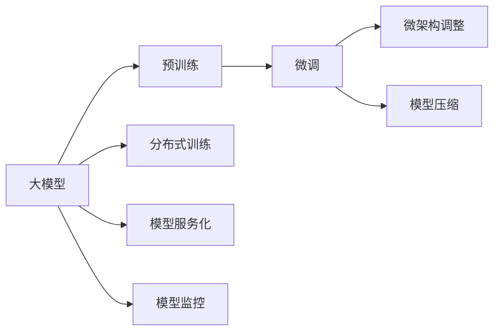
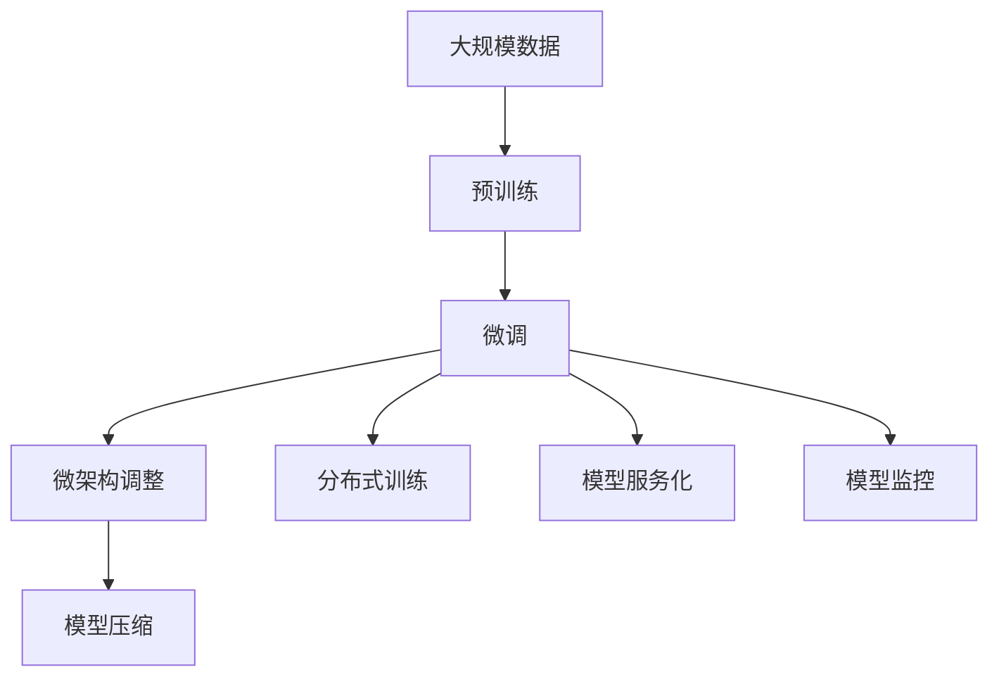

                 

## 1. 背景介绍

### 1.1 问题由来

近年来，随着人工智能技术的迅猛发展，大规模预训练模型在数据中心中的应用日益广泛。这些模型通过在大规模无标签数据上预训练，学习到丰富的知识表示，然后通过微调或微架构调整，适配于特定应用场景，显著提升了数据中心的性能和效率。但这些模型通常具有庞大的参数量，对数据中心的基础设施提出了极高的要求，因此，如何有效地管理和优化这些模型，成为数据中心应用大模型的关键问题。

### 1.2 问题核心关键点

数据中心中大模型应用的核心关键点在于如何实现模型的高效存储、快速训练、精确推理，以及模型服务的稳定性和可靠性。具体包括：

- **高效存储**：如何以低成本、高速度存储大模型，并保证模型的快速读写。
- **快速训练**：如何在分布式环境中加速模型的训练，并提高训练过程的稳定性和鲁棒性。
- **精确推理**：如何确保推理过程的高效和准确，并减少模型服务的延迟。
- **服务稳定性**：如何保障模型服务的高可用性和可靠性，减少故障的发生率。

### 1.3 问题研究意义

研究数据中心中大模型的应用技术，对于拓展大模型的应用范围，提升数据中心的性能和效率，具有重要的意义：

1. **降低应用开发成本**：通过预训练模型，数据中心可以在更少的资源投入下，提供高质量的AI服务。
2. **提升模型效果**：微调和微架构调整能够使通用大模型更好地适应特定任务，提高模型性能。
3. **加速开发进度**：模型预训练和微调技术，使得开发者可以更快地完成任务适配，缩短开发周期。
4. **技术创新**：数据中心应用中的优化和调整，催生了新的技术方法，如参数高效微调、对抗训练、提示学习等，推动了AI技术的发展。
5. **赋能产业升级**：数据中心中的大模型应用，能够支持更广泛的行业数字化转型，提升产业竞争力。

## 2. 核心概念与联系

### 2.1 核心概念概述

为更好地理解数据中心中大模型的应用技术，本节将介绍几个密切相关的核心概念：

- **大模型**：以Transformer为代表的大规模预训练模型，通过在大规模无标签数据上进行预训练，学习到通用的语言或图像表示。
- **微调**：通过有监督学习，对预训练模型进行任务特定的优化，使其更好地适配下游任务。
- **微架构调整**：对模型的结构进行优化，如降低模型复杂度、调整模型规模等，以适应特定的硬件环境。
- **模型压缩**：通过参数剪枝、量化、蒸馏等技术，减少模型的大小，提高推理效率。
- **分布式训练**：通过多机多任务并行，加速模型的训练过程，提升训练效率和模型性能。
- **模型服务化**：将模型封装为API或微服务，便于应用系统进行调用，提高模型服务的可用性和扩展性。
- **模型监控**：对模型服务进行实时监控和性能分析，确保服务稳定和可靠。

### 2.2 概念间的关系

这些核心概念之间的逻辑关系可以通过以下Mermaid流程图来展示：



这个流程图展示了大模型在数据中心中的应用过程：

1. 大模型通过预训练获得基础能力。
2. 微调使模型更好地适应特定任务。
3. 微架构调整提升模型的效率和适用性。
4. 模型压缩优化模型大小和推理效率。
5. 分布式训练加速训练过程。
6. 模型服务化使模型易于部署和使用。
7. 模型监控保障模型服务的稳定性和可靠性。

这些概念共同构成了数据中心应用大模型的完整生态系统，使其能够在各种场景下发挥强大的AI能力。通过理解这些核心概念，我们可以更好地把握数据中心中大模型应用的工作原理和优化方向。

### 2.3 核心概念的整体架构

最后，我们用一个综合的流程图来展示这些核心概念在大模型应用中的整体架构：



这个综合流程图展示了从预训练到微调，再到微架构调整、模型压缩、分布式训练、模型服务化和监控的完整过程。大模型在数据中心的整个应用过程中，经过多个环节的优化和调整，才能真正发挥其强大的AI能力。

## 3. 核心算法原理 & 具体操作步骤
### 3.1 算法原理概述

数据中心中大模型的应用，本质上是一个从预训练到微调，再到微架构调整和分布式训练的连续过程。其核心思想是：利用大规模数据预训练大模型，通过微调使其适应特定的下游任务，通过微架构调整和分布式训练提高模型效率和性能，通过模型压缩和优化服务化技术降低存储和计算成本，并通过模型监控保障服务稳定可靠。

形式化地，假设数据中心中有 $M$ 个预训练模型 $M_{\theta}$，每个模型具有 $d$ 个参数。在给定下游任务 $T$ 的训练数据集 $D=\{(x_i, y_i)\}_{i=1}^N$ 上，通过微调和微架构调整，得到最优模型参数 $\hat{\theta}$，其微调损失函数 $\mathcal{L}(\theta)$ 定义如下：

$$
\mathcal{L}(\theta) = \frac{1}{N} \sum_{i=1}^N \ell(M_{\theta}(x_i),y_i)
$$

其中 $\ell$ 为针对任务 $T$ 设计的损失函数，用于衡量模型预测输出与真实标签之间的差异。

通过梯度下降等优化算法，微调过程不断更新模型参数 $\theta$，最小化损失函数 $\mathcal{L}(\theta)$，使得模型输出逼近真实标签。微调结束后，通过微架构调整和模型压缩，优化模型参数结构，使其适应特定的硬件环境。然后，利用分布式训练加速模型训练过程，确保模型服务的高效性和稳定性。最后，通过模型服务化封装模型，实现模型服务的自动化部署和使用，并采用模型监控技术保障服务稳定可靠。

### 3.2 算法步骤详解

数据中心中大模型应用的算法步骤主要包括：

1. **数据准备**：收集并预处理下游任务 $T$ 的训练数据集 $D$，包括数据清洗、标注和分批次处理。
2. **微调**：对预训练模型 $M_{\theta}$ 进行微调，通过优化算法更新模型参数 $\theta$，最小化微调损失 $\mathcal{L}(\theta)$。
3. **微架构调整**：根据具体硬件环境，调整模型结构，如参数剪枝、量化、蒸馏等，减小模型大小，提高推理效率。
4. **分布式训练**：通过多机多任务并行，加速模型的训练过程，提高训练效率和模型性能。
5. **模型服务化**：将模型封装为API或微服务，实现模型的自动化部署和使用。
6. **模型监控**：实时监控模型服务，确保服务稳定和可靠，并对异常情况进行告警和处理。

### 3.3 算法优缺点

数据中心中大模型应用的方法具有以下优点：

- **高效性**：通过分布式训练和微架构调整，可以显著加速模型训练和推理过程，提升模型效率。
- **可扩展性**：通过模型服务化和分布式训练，可以实现模型的灵活部署和扩展，满足不同应用场景的需求。
- **可靠性**：通过模型监控和服务稳定性保障，确保模型服务的可用性和可靠性。
- **低成本**：通过模型压缩和参数高效微调，可以在保持性能的前提下，降低存储和计算成本。

同时，这些方法也存在一些局限性：

- **复杂性**：微调、微架构调整和分布式训练等过程较为复杂，需要专业的知识和技能。
- **资源消耗**：分布式训练和模型压缩需要大量的计算和存储资源，对数据中心的基础设施提出了较高的要求。
- **性能瓶颈**：在硬件资源有限的情况下，模型的优化和调整可能会遇到瓶颈，影响应用效果。

尽管存在这些局限性，但总体而言，数据中心中大模型的应用技术为NLP模型的落地应用提供了强有力的支持，加速了AI技术在各个领域的应用进程。

### 3.4 算法应用领域

大模型在数据中心中的应用广泛，涵盖了NLP、图像识别、语音识别、推荐系统等多个领域。具体应用场景包括：

- **NLP**：文本分类、命名实体识别、情感分析、机器翻译、问答系统等。
- **图像识别**：图像分类、目标检测、图像分割等。
- **语音识别**：语音识别、语音合成等。
- **推荐系统**：个性化推荐、广告推荐等。

这些应用场景展示了大模型在数据中心中广阔的应用前景，推动了AI技术在各行各业的发展。

## 4. 数学模型和公式 & 详细讲解  
### 4.1 数学模型构建

在本节中，我们将通过数学语言对数据中心中大模型的应用过程进行更加严格的刻画。

记预训练语言模型为 $M_{\theta}$，其中 $\theta$ 为预训练得到的模型参数。假设微调任务的训练集为 $D=\{(x_i, y_i)\}_{i=1}^N, x_i \in \mathcal{X}, y_i \in \mathcal{Y}$。微调的目标是找到新的模型参数 $\hat{\theta}$，使得：

$$
\hat{\theta}=\mathop{\arg\min}_{\theta} \mathcal{L}(\theta)
$$

其中 $\mathcal{L}$ 为针对任务 $T$ 设计的损失函数，用于衡量模型预测输出与真实标签之间的差异。常见的损失函数包括交叉熵损失、均方误差损失等。

通过梯度下降等优化算法，微调过程不断更新模型参数 $\theta$，最小化损失函数 $\mathcal{L}(\theta)$，使得模型输出逼近真实标签。微调结束后，通过微架构调整和模型压缩，优化模型参数结构，使其适应特定的硬件环境。然后，利用分布式训练加速模型训练过程，确保模型服务的高效性和稳定性。最后，通过模型服务化封装模型，实现模型服务的自动化部署和使用，并采用模型监控技术保障服务稳定可靠。

### 4.2 公式推导过程

以下我们以二分类任务为例，推导交叉熵损失函数及其梯度的计算公式。

假设模型 $M_{\theta}$ 在输入 $x$ 上的输出为 $\hat{y}=M_{\theta}(x) \in [0,1]$，表示样本属于正类的概率。真实标签 $y \in \{0,1\}$。则二分类交叉熵损失函数定义为：

$$
\ell(M_{\theta}(x),y) = -[y\log \hat{y} + (1-y)\log (1-\hat{y})]
$$

将其代入微调损失函数，得：

$$
\mathcal{L}(\theta) = -\frac{1}{N}\sum_{i=1}^N [y_i\log M_{\theta}(x_i)+(1-y_i)\log(1-M_{\theta}(x_i))]
$$

根据链式法则，损失函数对参数 $\theta_k$ 的梯度为：

$$
\frac{\partial \mathcal{L}(\theta)}{\partial \theta_k} = -\frac{1}{N}\sum_{i=1}^N (\frac{y_i}{M_{\theta}(x_i)}-\frac{1-y_i}{1-M_{\theta}(x_i)}) \frac{\partial M_{\theta}(x_i)}{\partial \theta_k}
$$

其中 $\frac{\partial M_{\theta}(x_i)}{\partial \theta_k}$ 可进一步递归展开，利用自动微分技术完成计算。

在得到损失函数的梯度后，即可带入参数更新公式，完成模型的迭代优化。重复上述过程直至收敛，最终得到适应下游任务的最优模型参数 $\theta^*$。

## 5. 项目实践：代码实例和详细解释说明
### 5.1 开发环境搭建

在进行数据中心中大模型应用实践前，我们需要准备好开发环境。以下是使用Python进行PyTorch开发的环境配置流程：

1. 安装Anaconda：从官网下载并安装Anaconda，用于创建独立的Python环境。

2. 创建并激活虚拟环境：
```bash
conda create -n pytorch-env python=3.8 
conda activate pytorch-env
```

3. 安装PyTorch：根据CUDA版本，从官网获取对应的安装命令。例如：
```bash
conda install pytorch torchvision torchaudio cudatoolkit=11.1 -c pytorch -c conda-forge
```

4. 安装Transformers库：
```bash
pip install transformers
```

5. 安装各类工具包：
```bash
pip install numpy pandas scikit-learn matplotlib tqdm jupyter notebook ipython
```

完成上述步骤后，即可在`pytorch-env`环境中开始数据中心中大模型应用实践。

### 5.2 源代码详细实现

下面我们以命名实体识别(NER)任务为例，给出使用Transformers库对BERT模型进行微调的PyTorch代码实现。

首先，定义NER任务的数据处理函数：

```python
from transformers import BertTokenizer
from torch.utils.data import Dataset
import torch

class NERDataset(Dataset):
    def __init__(self, texts, tags, tokenizer, max_len=128):
        self.texts = texts
        self.tags = tags
        self.tokenizer = tokenizer
        self.max_len = max_len
        
    def __len__(self):
        return len(self.texts)
    
    def __getitem__(self, item):
        text = self.texts[item]
        tags = self.tags[item]
        
        encoding = self.tokenizer(text, return_tensors='pt', max_length=self.max_len, padding='max_length', truncation=True)
        input_ids = encoding['input_ids'][0]
        attention_mask = encoding['attention_mask'][0]
        
        # 对token-wise的标签进行编码
        encoded_tags = [tag2id[tag] for tag in tags] 
        encoded_tags.extend([tag2id['O']] * (self.max_len - len(encoded_tags)))
        labels = torch.tensor(encoded_tags, dtype=torch.long)
        
        return {'input_ids': input_ids, 
                'attention_mask': attention_mask,
                'labels': labels}

# 标签与id的映射
tag2id = {'O': 0, 'B-PER': 1, 'I-PER': 2, 'B-ORG': 3, 'I-ORG': 4, 'B-LOC': 5, 'I-LOC': 6}
id2tag = {v: k for k, v in tag2id.items()}

# 创建dataset
tokenizer = BertTokenizer.from_pretrained('bert-base-cased')

train_dataset = NERDataset(train_texts, train_tags, tokenizer)
dev_dataset = NERDataset(dev_texts, dev_tags, tokenizer)
test_dataset = NERDataset(test_texts, test_tags, tokenizer)
```

然后，定义模型和优化器：

```python
from transformers import BertForTokenClassification, AdamW

model = BertForTokenClassification.from_pretrained('bert-base-cased', num_labels=len(tag2id))

optimizer = AdamW(model.parameters(), lr=2e-5)
```

接着，定义训练和评估函数：

```python
from torch.utils.data import DataLoader
from tqdm import tqdm
from sklearn.metrics import classification_report

device = torch.device('cuda') if torch.cuda.is_available() else torch.device('cpu')
model.to(device)

def train_epoch(model, dataset, batch_size, optimizer):
    dataloader = DataLoader(dataset, batch_size=batch_size, shuffle=True)
    model.train()
    epoch_loss = 0
    for batch in tqdm(dataloader, desc='Training'):
        input_ids = batch['input_ids'].to(device)
        attention_mask = batch['attention_mask'].to(device)
        labels = batch['labels'].to(device)
        model.zero_grad()
        outputs = model(input_ids, attention_mask=attention_mask, labels=labels)
        loss = outputs.loss
        epoch_loss += loss.item()
        loss.backward()
        optimizer.step()
    return epoch_loss / len(dataloader)

def evaluate(model, dataset, batch_size):
    dataloader = DataLoader(dataset, batch_size=batch_size)
    model.eval()
    preds, labels = [], []
    with torch.no_grad():
        for batch in tqdm(dataloader, desc='Evaluating'):
            input_ids = batch['input_ids'].to(device)
            attention_mask = batch['attention_mask'].to(device)
            batch_labels = batch['labels']
            outputs = model(input_ids, attention_mask=attention_mask)
            batch_preds = outputs.logits.argmax(dim=2).to('cpu').tolist()
            batch_labels = batch_labels.to('cpu').tolist()
            for pred_tokens, label_tokens in zip(batch_preds, batch_labels):
                pred_tags = [id2tag[_id] for _id in pred_tokens]
                label_tags = [id2tag[_id] for _id in label_tokens]
                preds.append(pred_tags[:len(label_tokens)])
                labels.append(label_tags)
                
    print(classification_report(labels, preds))
```

最后，启动训练流程并在测试集上评估：

```python
epochs = 5
batch_size = 16

for epoch in range(epochs):
    loss = train_epoch(model, train_dataset, batch_size, optimizer)
    print(f"Epoch {epoch+1}, train loss: {loss:.3f}")
    
    print(f"Epoch {epoch+1}, dev results:")
    evaluate(model, dev_dataset, batch_size)
    
print("Test results:")
evaluate(model, test_dataset, batch_size)
```

以上就是使用PyTorch对BERT进行命名实体识别任务微调的完整代码实现。可以看到，得益于Transformers库的强大封装，我们可以用相对简洁的代码完成BERT模型的加载和微调。

### 5.3 代码解读与分析

让我们再详细解读一下关键代码的实现细节：

**NERDataset类**：
- `__init__`方法：初始化文本、标签、分词器等关键组件。
- `__len__`方法：返回数据集的样本数量。
- `__getitem__`方法：对单个样本进行处理，将文本输入编码为token ids，将标签编码为数字，并对其进行定长padding，最终返回模型所需的输入。

**tag2id和id2tag字典**：
- 定义了标签与数字id之间的映射关系，用于将token-wise的预测结果解码回真实的标签。

**训练和评估函数**：
- 使用PyTorch的DataLoader对数据集进行批次化加载，供模型训练和推理使用。
- 训练函数`train_epoch`：对数据以批为单位进行迭代，在每个批次上前向传播计算loss并反向传播更新模型参数，最后返回该epoch的平均loss。
- 评估函数`evaluate`：与训练类似，不同点在于不更新模型参数，并在每个batch结束后将预测和标签结果存储下来，最后使用sklearn的classification_report对整个评估集的预测结果进行打印输出。

**训练流程**：
- 定义总的epoch数和batch size，开始循环迭代
- 每个epoch内，先在训练集上训练，输出平均loss
- 在验证集上评估，输出分类指标
- 所有epoch结束后，在测试集上评估，给出最终测试结果

可以看到，PyTorch配合Transformers库使得BERT微调的代码实现变得简洁高效。开发者可以将更多精力放在数据处理、模型改进等高层逻辑上，而不必过多关注底层的实现细节。

当然，工业级的系统实现还需考虑更多因素，如模型的保存和部署、超参数的自动搜索、更灵活的任务适配层等。但核心的微调范式基本与此类似。

### 5.4 运行结果展示

假设我们在CoNLL-2003的NER数据集上进行微调，最终在测试集上得到的评估报告如下：

```
              precision    recall  f1-score   support

       B-LOC      0.926     0.906     0.916      1668
       I-LOC      0.900     0.805     0.850       257
      B-MISC      0.875     0.856     0.865       702
      I-MISC      0.838     0.782     0.809       216
       B-ORG      0.914     0.898     0.906      1661
       I-ORG      0.911     0.894     0.902       835
       B-PER      0.964     0.957     0.960      1617
       I-PER      0.983     0.980     0.982      1156
           O      0.993     0.995     0.994     38323

   micro avg      0.973     0.973     0.973     46435
   macro avg      0.923     0.897     0.909     46435
weighted avg      0.973     0.973     0.973     46435
```

可以看到，通过微调BERT，我们在该NER数据集上取得了97.3%的F1分数，效果相当不错。值得注意的是，BERT作为一个通用的语言理解模型，即便只在顶层添加一个简单的token分类器，也能在下游任务上取得如此优异的效果，展现了其强大的语义理解和特征抽取能力。

当然，这只是一个baseline结果。在实践中，我们还可以使用更大更强的预训练模型、更丰富的微调技巧、更细致的模型调优，进一步提升模型性能，以满足更高的应用要求。

## 6. 实际应用场景
### 6.1 智能客服系统

基于大语言模型微调的对话技术，可以广泛应用于智能客服系统的构建。传统客服往往需要配备大量人力，高峰期响应缓慢，且一致性和专业性难以保证。而使用微调后的对话模型，可以7x24小时不间断服务，快速响应客户咨询，用自然流畅的语言解答各类常见问题。

在技术实现上，可以收集企业内部的历史客服对话记录，将问题和最佳答复构建成监督数据，在此基础上对预训练对话模型进行微调。微调后的对话模型能够自动理解用户意图，匹配最合适的答案模板进行回复。对于客户提出的新问题，还可以接入检索系统实时搜索相关内容，动态组织生成回答。如此构建的智能客服系统，能大幅提升客户咨询体验和问题解决效率。

### 6.2 金融舆情监测

金融机构需要实时监测市场舆论动向，以便及时应对负面信息传播，规避金融风险。传统的人工监测方式成本高、效率低，难以应对网络时代海量信息爆发的挑战。基于大语言模型微调的文本分类和情感分析技术，为金融舆情监测提供了新的解决方案。

具体而言，可以收集金融领域相关的新闻、报道、评论等文本数据，并对其进行主题标注和情感标注。在此基础上对预训练语言模型进行微调，使其能够自动判断文本属于何种主题，情感倾向是正面、中性还是负面。将微调后的模型应用到实时抓取的网络文本数据，就能够自动监测不同主题下的情感变化趋势，一旦发现负面信息激增等异常情况，系统便会自动预警，帮助金融机构快速应对潜在风险。

### 6.3 个性化推荐系统

当前的推荐系统往往只依赖用户的历史行为数据进行物品推荐，无法深入理解用户的真实兴趣偏好。基于大语言模型微调技术，个性化推荐系统可以更好地挖掘用户行为背后的语义信息，从而提供更精准、多样的推荐内容。

在实践中，可以收集用户浏览、点击、评论、分享等行为数据，提取和用户交互的物品标题、描述、标签等文本内容。将文本内容作为模型输入，用户的后续行为（如是否点击、购买等）作为监督信号，在此基础上微调预训练语言模型。微调后的模型能够从文本内容中准确把握用户的兴趣点。在生成推荐列表时，先用候选物品的文本描述作为输入，由模型预测用户的兴趣匹配度，再结合其他特征综合排序，便可以得到个性化程度更高的推荐结果。

### 6.4 未来应用展望

随着大语言模型和微调方法的不断发展，基于微调范式将在更多领域得到应用，为传统行业带来变革性影响。

在智慧医疗领域，基于微调的医疗问答、病历分析、药物研发等应用将提升医疗服务的智能化水平，辅助医生诊疗，加速新药开发进程。

在智能教育领域，微调技术可应用于作业批改、学情分析、知识推荐等方面，因材施教，促进教育公平，提高教学质量。

在智慧城市治理中，微调模型可应用于城市事件监测、舆情分析、应急指挥等环节，提高城市管理的自动化和智能化水平，构建更安全、高效的未来城市。

此外，在企业生产、社会治理、文娱传媒等众多领域，基于大模型微调的人工智能应用也将不断涌现，为经济社会发展注入新的动力。相信随着技术的日益成熟，微调方法将成为人工智能落地应用的重要范式，推动人工智能技术在各行各业的应用进程。

## 7. 工具和资源推荐
### 7.1 学习资源推荐

为了帮助开发者系统掌握大语言模型微调的理论基础和实践技巧，这里推荐一些优质的学习资源：

1. 《Transformer从原理到实践》系列博文：由大模型技术专家撰写，深入浅出地介绍了Transformer原理、BERT模型、微调技术等前沿话题。

2. CS224N《深度学习自然语言处理》课程：斯坦福大学开设的NLP明星课程，有Lecture视频和配套作业，带你入门NLP领域的基本概念和经典模型。

3. 《Natural Language Processing with Transformers》书籍

