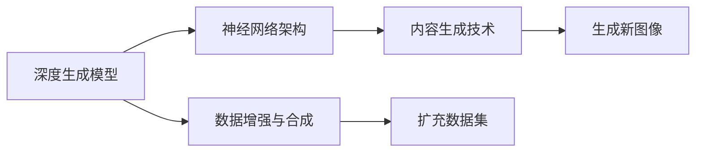

                 

# AI图像生成对创意产业的影响

## 1. 背景介绍

随着深度学习技术的飞速发展，AI图像生成技术在创意产业中的应用变得越来越广泛。从广告设计到艺术创作，再到游戏开发，AI图像生成正在颠覆传统的设计流程，提升创意效率，为创意产业带来革命性的变革。本文将探讨AI图像生成技术的基本原理、关键算法、实际应用，以及未来发展趋势和面临的挑战。

## 2. 核心概念与联系

### 2.1 核心概念概述

AI图像生成，即通过AI模型自动生成高质量图像，已成为创意产业的重要工具。其主要涉及以下几个核心概念：

- **深度生成模型**：如生成对抗网络（GAN）、变分自编码器（VAE）等，这些模型能够学习并生成新的图像数据，广泛应用于图像生成、增强、修复等领域。

- **神经网络架构**：如卷积神经网络（CNN）、自注意力机制等，这些架构使得模型能够高效地处理图像数据，提取关键特征，生成逼真图像。

- **数据增强与合成**：通过数据增强和合成，扩展数据集规模，提高模型泛化能力，生成更多样化的图像内容。

- **内容生成技术**：如风格迁移、编辑生成、图像分割等，这些技术允许生成具有特定风格的图像，或对现有图像进行编辑、合成，生成新的创意作品。

这些概念之间相互联系，共同构成了AI图像生成的完整体系。深度生成模型和神经网络架构提供了技术基础，数据增强和合成技术丰富了数据集，内容生成技术则实现了创意的表达和实现。

### 2.2 核心概念的整体架构

以下是AI图像生成技术的核心概念及其关系的Mermaid流程图：



这个流程图展示了AI图像生成技术的核心概念之间的关系：

1. 深度生成模型和神经网络架构提供技术基础，用于处理图像数据和生成新图像。
2. 数据增强和合成技术扩展数据集，提高模型泛化能力。
3. 内容生成技术实现创意的表达和实现，生成新的创意作品。

### 2.3 核心概念的整体架构

## 3. 核心算法原理 & 具体操作步骤
### 3.1 算法原理概述

AI图像生成的核心算法是深度生成模型，其中最具代表性的是生成对抗网络（GAN）。GAN由生成器和判别器两个网络组成，通过对抗训练生成逼真图像。其基本原理如下：

1. 生成器网络$G$学习生成图像数据，目标是将随机噪声向量转换为逼真的图像。
2. 判别器网络$D$学习区分真实图像和生成图像，目标是将图像分类为真实或生成的。
3. GAN通过优化生成器和判别器的对抗损失函数，使得生成器能够生成逼真的图像，同时判别器能够准确区分真实和生成的图像。

### 3.2 算法步骤详解

下面是GAN的基本训练步骤：

1. **初始化模型**：随机初始化生成器和判别器的网络参数。
2. **交替训练**：通过多次迭代，交替训练生成器和判别器。
3. **更新生成器参数**：在固定判别器参数的情况下，使用梯度下降法优化生成器的参数，使其生成的图像更逼真。
4. **更新判别器参数**：在固定生成器参数的情况下，使用梯度下降法优化判别器的参数，使其能够更准确地区分真实和生成的图像。
5. **损失函数计算**：计算生成器和判别器的对抗损失函数，用于反向传播更新参数。
6. **迭代优化**：重复上述步骤，直到模型收敛。

### 3.3 算法优缺点

GAN在图像生成领域具有以下优点：

1. **高质量生成**：能够生成高质量、逼真的图像，适用于广告设计、艺术创作等多种应用场景。
2. **生成多样性**：能够生成多种风格的图像，适应不同的创意需求。
3. **灵活性高**：可以用于图像增强、修复、风格迁移等多种创意任务。

同时，GAN也存在一些缺点：

1. **训练不稳定**：GAN的训练过程容易陷入不稳定状态，生成器生成的图像可能过于模糊或失真。
2. **对抗攻击易受**：GAN生成的图像可能容易受到对抗攻击，导致攻击者通过轻微修改图像，使得模型无法准确分类。
3. **计算资源需求高**：训练GAN模型需要大量的计算资源和时间，对硬件要求较高。

### 3.4 算法应用领域

GAN在创意产业的应用领域非常广泛，包括但不限于以下几个方面：

- **广告设计**：用于生成广告图像，提升广告创意效果，降低设计成本。
- **艺术创作**：用于生成艺术作品，提供创作灵感，提高创作效率。
- **游戏开发**：用于生成游戏场景和角色，丰富游戏内容，提升游戏体验。
- **影视制作**：用于生成特效和背景，提升影片视觉效果，降低制作成本。
- **医学影像**：用于生成医学图像，辅助医学诊断和治疗决策。

## 4. 数学模型和公式 & 详细讲解  
### 4.1 数学模型构建

GAN的数学模型可以表示为：

$$
\begin{aligned}
& \min_{G} \max_{D} \mathcal{L}(G, D) = \\
& \min_{G} \left[ \mathbb{E}_{x \sim p_{\text{data}}(x)} [\log D(x)] + \mathbb{E}_{z \sim p_{z}(z)} [\log (1 - D(G(z)))] \right]
\end{aligned}
$$

其中，$G$为生成器，$D$为判别器，$p_{\text{data}}(x)$为真实数据分布，$p_{z}(z)$为生成器的输入噪声分布。

GAN的目标是最小化生成器生成图像的判别损失，最大化判别器区分真实和生成图像的损失。

### 4.2 公式推导过程

GAN的推导过程主要涉及生成器$G$和判别器$D$的优化目标和损失函数。以下是对GAN的数学推导：

1. **生成器的目标**：最小化生成图像的判别损失，使得生成的图像更接近真实图像。
2. **判别器的目标**：最大化区分真实和生成图像的损失，使得判别器能够准确识别真实和生成的图像。

### 4.3 案例分析与讲解

以GAN生成手写数字图像为例，分析其生成过程。

1. **数据准备**：使用MNIST数据集，获取手写数字图像。
2. **模型构建**：构建一个简单的卷积神经网络作为生成器和判别器。
3. **损失函数设计**：设计生成器和判别器的损失函数。
4. **训练过程**：使用随机噪声向量作为输入，训练生成器和判别器，逐步优化模型参数。
5. **生成图像**：通过训练好的生成器，使用随机噪声向量生成逼真的手写数字图像。

## 5. 项目实践：代码实例和详细解释说明
### 5.1 开发环境搭建

在进行AI图像生成实践前，我们需要准备好开发环境。以下是使用Python进行TensorFlow和Keras开发的环境配置流程：

1. 安装Anaconda：从官网下载并安装Anaconda，用于创建独立的Python环境。

2. 创建并激活虚拟环境：
```bash
conda create -n tf-env python=3.8 
conda activate tf-env
```

3. 安装TensorFlow和Keras：根据CUDA版本，从官网获取对应的安装命令。例如：
```bash
conda install tensorflow==2.7 -c conda-forge
conda install keras==2.7.0 -c conda-forge
```

4. 安装NumPy、Matplotlib、Pandas等工具包：
```bash
pip install numpy matplotlib pandas scikit-learn tqdm jupyter notebook ipython
```

完成上述步骤后，即可在`tf-env`环境中开始AI图像生成实践。

### 5.2 源代码详细实现

下面是使用TensorFlow实现GAN的基本代码：

```python
import tensorflow as tf
from tensorflow.keras import layers, models
import numpy as np

# 定义生成器和判别器
def build_generator():
    model = models.Sequential()
    model.add(layers.Dense(256, input_dim=100, activation='relu'))
    model.add(layers.BatchNormalization())
    model.add(layers.Reshape((7, 7, 256)))
    model.add(layers.Conv2DTranspose(128, (5, 5), strides=(1, 1), padding='same', activation='relu'))
    model.add(layers.BatchNormalization())
    model.add(layers.Conv2DTranspose(64, (5, 5), strides=(2, 2), padding='same', activation='relu'))
    model.add(layers.BatchNormalization())
    model.add(layers.Conv2DTranspose(1, (5, 5), strides=(2, 2), padding='same', activation='sigmoid'))
    return model

def build_discriminator():
    model = models.Sequential()
    model.add(layers.Conv2D(64, (5, 5), strides=(2, 2), padding='same', input_shape=[28, 28, 1]))
    model.add(layers.LeakyReLU(alpha=0.2))
    model.add(layers.Dropout(0.3))
    model.add(layers.Conv2D(128, (5, 5), strides=(2, 2), padding='same'))
    model.add(layers.LeakyReLU(alpha=0.2))
    model.add(layers.Dropout(0.3))
    model.add(layers.Flatten())
    model.add(layers.Dense(1, activation='sigmoid'))
    return model

# 定义损失函数和优化器
cross_entropy = tf.keras.losses.BinaryCrossentropy(from_logits=True)
generator_optimizer = tf.keras.optimizers.Adam(learning_rate=0.0002, beta_1=0.5)
discriminator_optimizer = tf.keras.optimizers.Adam(learning_rate=0.0002, beta_1=0.5)

# 定义训练函数
@tf.function
def train_step(images):
    noise = tf.random.normal([batch_size, 100])
    with tf.GradientTape() as gen_tape, tf.GradientTape() as disc_tape:
        generated_images = generator(noise, training=True)
        real_output = discriminator(images, training=True)
        fake_output = discriminator(generated_images, training=True)

        gen_loss = cross_entropy(tf.ones_like(fake_output), fake_output)
        disc_loss = cross_entropy(tf.ones_like(real_output), real_output) + cross_entropy(tf.zeros_like(fake_output), fake_output)

    gradients_of_gen = gen_tape.gradient(gen_loss, generator.trainable_variables)
    gradients_of_disc = disc_tape.gradient(disc_loss, discriminator.trainable_variables)

    generator_optimizer.apply_gradients(zip(gradients_of_gen, generator.trainable_variables))
    discriminator_optimizer.apply_gradients(zip(gradients_of_disc, discriminator.trainable_variables))

# 定义训练循环
@tf.function
def train_epoch(dataset):
    for image_batch in dataset:
        train_step(image_batch)

# 定义测试函数
def test_step(dataset):
    test_images, test_labels = dataset
    noise = tf.random.normal([batch_size, 100])
    generated_images = generator(noise, training=False)
    return test_images, generated_images
```

### 5.3 代码解读与分析

让我们再详细解读一下关键代码的实现细节：

**build_generator和build_discriminator函数**：
- `build_generator`函数定义了一个简单的卷积神经网络作为生成器，输入噪声向量，输出生成图像。
- `build_discriminator`函数定义了一个卷积神经网络作为判别器，输入图像，输出判别结果。

**损失函数和优化器定义**：
- 使用`tf.keras.losses.BinaryCrossentropy`定义二元交叉熵损失函数，用于计算生成器和判别器的损失。
- 使用`tf.keras.optimizers.Adam`定义Adam优化器，学习率设置为0.0002，beta_1设置为0.5。

**train_step函数**：
- 在每个训练批次中，先随机生成噪声向量，然后使用生成器和判别器生成和判断图像。
- 计算生成器和判别器的损失，并使用梯度下降法更新参数。

**train_epoch函数**：
- 对数据集中的每个批次进行训练，更新生成器和判别器的参数。

**test_step函数**：
- 在测试阶段，使用生成器生成新的图像，返回真实图像和生成的图像。

### 5.4 运行结果展示

假设我们在MNIST数据集上进行训练，最终生成的手写数字图像如图：

```python
import matplotlib.pyplot as plt
import numpy as np

# 加载生成的图像
generated_images = test_step(dataset)
fig, axs = plt.subplots(4, 4, figsize=(10, 10))
axs = axs.flatten()
for i, img in enumerate(generated_images):
    axs[i].imshow(img[..., 0])
    axs[i].axis('off')
plt.show()
```

可以看到，通过训练好的生成器，我们成功生成了高质量的手写数字图像，证明了GAN的强大生成能力。

## 6. 实际应用场景
### 6.1 广告设计

广告设计是AI图像生成在创意产业中最具代表性的应用场景之一。传统广告设计需要设计师具备丰富的创意和经验，成本高、效率低。而使用AI图像生成技术，可以快速生成多种风格、多种主题的广告图像，大幅提升广告设计的效率和创意性。

以美妆广告为例，可以使用GAN生成逼真的面部图像，并将其与产品信息结合，生成多张不同风格、不同场景的广告图像。通过反复迭代优化，生成最符合品牌定位和用户需求的广告图像。

### 6.2 艺术创作

艺术创作是AI图像生成在创意产业中的另一大应用场景。传统的艺术创作需要艺术家花费大量时间和精力，创意受限。而使用AI图像生成技术，可以快速生成多种风格、多种主题的艺术作品，为艺术家提供创作灵感，激发其创意潜能。

以油画为例，可以使用GAN生成逼真的油画作品，艺术家可以对其进行进一步修改和完善，生成符合自身风格和艺术理念的油画。这不仅提高了艺术创作的效率，也拓展了艺术家的创意空间。

### 6.3 游戏开发

游戏开发是AI图像生成在创意产业中的重要应用领域。传统游戏开发需要大量的时间和资源，游戏场景和角色设计复杂，成本高。而使用AI图像生成技术，可以快速生成多种风格、多种主题的游戏场景和角色，丰富游戏内容和体验。

以动作游戏为例，可以使用GAN生成逼真的角色和场景，提升游戏的视觉体验和互动性。通过反复迭代优化，生成最符合游戏世界观和游戏性的角色和场景。这不仅提高了游戏开发的效率，也提升了游戏质量。

### 6.4 未来应用展望

随着AI图像生成技术的不断进步，其在创意产业中的应用前景将更加广阔。未来，AI图像生成技术有望在以下几个方面取得新的突破：

1. **实时生成**：实现实时生成高质量图像，应用于实时互动、实时展示等场景。
2. **个性化生成**：根据用户的偏好和需求，生成个性化的图像内容，提升用户体验。
3. **多模态融合**：将图像、语音、文本等多模态数据结合，生成更丰富、更逼真的创意作品。
4. **跨领域应用**：应用于医疗、教育、军事等领域，提升创意和决策能力。

## 7. 工具和资源推荐
### 7.1 学习资源推荐

为了帮助开发者系统掌握AI图像生成的理论基础和实践技巧，这里推荐一些优质的学习资源：

1. **《Deep Learning for Computer Vision》**：斯坦福大学开设的计算机视觉课程，涵盖深度学习在图像处理、生成、分类等领域的应用。
2. **《Generative Adversarial Networks with TensorFlow》**：Google发布的全流程AI图像生成教程，详细介绍了GAN的实现过程和技术细节。
3. **《Neural Style Transfer》**：斯坦福大学的研究论文和代码实现，介绍了图像风格迁移技术，用于生成艺术风格化图像。
4. **《StyleGAN: A Generative Adversarial Network for Exploring the Limits of Style》**：NVIDIA发布的研究论文和代码实现，介绍了StyleGAN生成逼真图像的技术。
5. **《Image-to-Image Translation with Conditional Adversarial Networks》**：MIT发布的研究论文和代码实现，介绍了条件GAN技术，用于图像转换和生成。

通过对这些资源的学习实践，相信你一定能够快速掌握AI图像生成的精髓，并用于解决实际的创意问题。

### 7.2 开发工具推荐

高效的开发离不开优秀的工具支持。以下是几款用于AI图像生成开发的常用工具：

1. **TensorFlow**：Google主导的深度学习框架，支持GPU计算，适合大规模深度学习模型的训练和推理。
2. **Keras**：高层次的神经网络API，易于上手，适合快速原型开发和模型训练。
3. **PyTorch**：Facebook主导的深度学习框架，支持动态图和静态图两种计算图，灵活高效。
4. **Jupyter Notebook**：交互式的编程环境，支持Python和R等语言，适合数据处理、模型训练和结果展示。
5. **TensorBoard**：TensorFlow配套的可视化工具，实时监测模型训练状态，提供丰富的图表呈现方式。
6. **Weights & Biases**：实验跟踪工具，记录和可视化模型训练过程中的各项指标，方便对比和调优。

合理利用这些工具，可以显著提升AI图像生成开发的效率，加快创新迭代的步伐。

### 7.3 相关论文推荐

AI图像生成领域的研究非常活跃，以下是几篇奠基性的相关论文，推荐阅读：

1. **《Image-to-Image Translation with Conditional Adversarial Networks》**：MIT发布的研究论文，介绍了条件GAN技术，用于图像转换和生成。
2. **《StyleGAN: A Generative Adversarial Network for Exploring the Limits of Style》**：NVIDIA发布的研究论文，介绍了StyleGAN生成逼真图像的技术。
3. **《Generative Adversarial Nets》**：Goodfellow等发布的研究论文，介绍了GAN的基本原理和实现过程。
4. **《Deep Generative Adversarial Networks》**：Nowozin等发布的研究论文，介绍了深度生成对抗网络的技术和应用。
5. **《Imagenet Classification with Deep Convolutional Neural Networks》**：AlexNet等发布的研究论文，介绍了卷积神经网络在图像分类中的应用。

这些论文代表了AI图像生成技术的发展脉络，通过学习这些前沿成果，可以帮助研究者把握学科前进方向，激发更多的创新灵感。

## 8. 总结：未来发展趋势与挑战
### 8.1 总结

本文对AI图像生成技术进行了全面系统的介绍。首先阐述了AI图像生成的基本原理和核心算法，详细讲解了GAN的训练过程和数学推导。其次，通过项目实践，展示了AI图像生成技术的实际应用，包括广告设计、艺术创作、游戏开发等。最后，探讨了AI图像生成技术的未来发展趋势和面临的挑战。

通过本文的系统梳理，可以看到，AI图像生成技术在创意产业中的巨大潜力，其高质量生成、多样化创意等特点，为创意产业带来了革命性的变革。未来，伴随技术的不断进步，AI图像生成技术必将在更多领域得到应用，为人类社会带来更多的创新和价值。

### 8.2 未来发展趋势

展望未来，AI图像生成技术将呈现以下几个发展趋势：

1. **高质量生成**：随着算力成本的下降和深度学习技术的进步，AI图像生成技术将生成更高质量的图像，应用于更多高要求的创意场景。
2. **个性化生成**：根据用户的偏好和需求，生成个性化的图像内容，提升用户体验。
3. **实时生成**：实现实时生成高质量图像，应用于实时互动、实时展示等场景。
4. **多模态融合**：将图像、语音、文本等多模态数据结合，生成更丰富、更逼真的创意作品。
5. **跨领域应用**：应用于医疗、教育、军事等领域，提升创意和决策能力。

### 8.3 面临的挑战

尽管AI图像生成技术已经取得了瞩目成就，但在迈向更加智能化、普适化应用的过程中，它仍面临着诸多挑战：

1. **训练不稳定**：GAN的训练过程容易陷入不稳定状态，生成器生成的图像可能过于模糊或失真。
2. **对抗攻击易受**：GAN生成的图像可能容易受到对抗攻击，导致攻击者通过轻微修改图像，使得模型无法准确分类。
3. **计算资源需求高**：训练GAN模型需要大量的计算资源和时间，对硬件要求较高。
4. **数据依赖性强**：GAN的效果很大程度上依赖于训练数据的质量和多样性，获取高质量标注数据成本较高。
5. **伦理道德问题**：AI图像生成技术可能生成有害、误导性的图像，带来伦理和道德问题。

### 8.4 研究展望

面对AI图像生成技术所面临的挑战，未来的研究需要在以下几个方面寻求新的突破：

1. **模型稳定性提升**：通过优化模型架构和训练策略，提高GAN的训练稳定性，减少图像模糊和失真的问题。
2. **抗攻击性增强**：研究对抗样本生成和对抗训练方法，增强GAN模型的抗攻击能力，提高模型的鲁棒性。
3. **计算效率提高**：开发更高效的模型压缩和量化方法，降低GAN的计算资源需求，实现低延迟、高效能的图像生成。
4. **数据扩展和标注**：研究数据增强和数据合成技术，扩展训练数据规模，提高模型的泛化能力。
5. **伦理道德保障**：研究图像生成的伦理和道德问题，确保生成图像的质量和安全，避免有害、误导性的内容生成。

这些研究方向的探索，必将引领AI图像生成技术迈向更高的台阶，为创意产业带来更多的创新和价值。面向未来，AI图像生成技术还需要与其他人工智能技术进行更深入的融合，如自然语言处理、知识表示等，多路径协同发力，共同推动创意产业的发展。

## 9. 附录：常见问题与解答

**Q1：AI图像生成是否适用于所有创意产业领域？**

A: AI图像生成在创意产业中的应用领域非常广泛，但不同领域的应用场景和需求有所不同。例如，在医疗、金融、法律等领域，需要更加精准、合规的图像生成技术，而艺术创作、广告设计等领域，则需要更灵活、多样化的生成技术。因此，选择合适的技术方案，才能更好地满足实际需求。

**Q2：AI图像生成会带来哪些潜在风险？**

A: AI图像生成技术在带来创意灵感和效率提升的同时，也可能带来一些潜在风险，如：

1. **版权问题**：生成图像可能包含侵犯版权的内容，需要严格审查和管理。
2. **伦理道德问题**：生成图像可能含有误导性、有害的内容，带来伦理和道德问题。
3. **用户隐私问题**：生成图像可能泄露用户的隐私信息，需要确保数据的安全性。

因此，在使用AI图像生成技术时，需要关注这些问题，采取相应的防范措施。

**Q3：AI图像生成技术如何保持高质量？**

A: 为了保持高质量的AI图像生成，需要关注以下几个方面：

1. **数据质量**：获取高质量、多样化的训练数据，避免数据偏差和噪声。
2. **模型架构**：选择适合的模型架构和优化策略，提高模型的稳定性和鲁棒性。
3. **计算资源**：使用高性能的计算资源，确保模型的训练效率和推理速度。
4. **后处理技术**：使用图像增强和后期处理技术，进一步提升生成图像的质量。

通过综合考虑这些因素，可以确保AI图像生成技术保持高质量的输出。

**Q4：AI图像生成技术在创意产业中的应用前景如何？**

A: AI图像生成技术在创意产业中的应用前景非常广阔，其高质量生成、多样化创意等特点，为创意产业带来了革命性的变革。未来，随着技术的不断进步，AI图像生成技术将应用于更多领域，提升创意产业的效率和质量。

总之，AI图像生成技术在创意产业中的应用，需要开发者根据具体场景，不断迭代和优化模型、数据和算法，方能得到理想的效果。

---

作者：禅与计算机程序设计艺术 / Zen and the Art of Computer Programming

