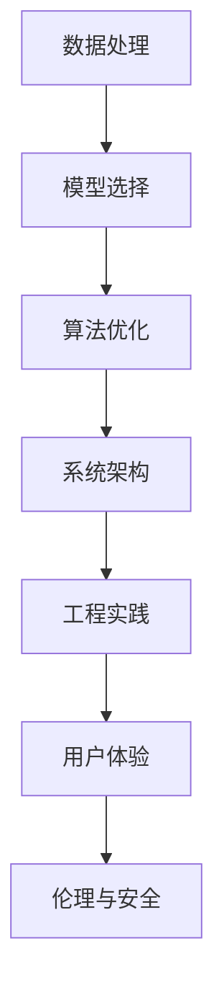
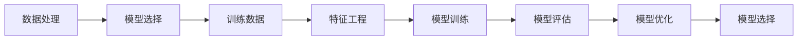
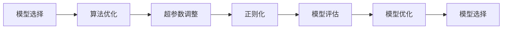
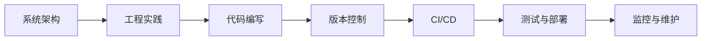
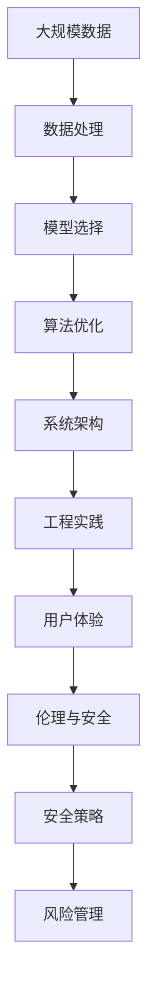

                 

## 1. 背景介绍

### 1.1 问题由来
人工智能（AI）是当前科技发展的核心驱动力之一，其底层创新体系正日益成为各大企业、研究机构和创业公司竞相争夺的焦点。在过去的几十年中，AI底层创新体系经历了几次大的转变：从基于规则的专家系统，到基于统计的机器学习，再到今天基于深度学习的智能体系。每一次技术迭代，都为AI的应用范围和效果带来了显著提升。

然而，随着AI技术的不断发展，其在各个领域的应用变得越来越复杂，所需的底层架构也日益多样化和精细化。如何构建一个既强大又灵活的AI底层创新体系，成为当下AI发展的重要议题。

### 1.2 问题核心关键点
构建AI底层创新体系，需要从多个维度进行考虑和设计。这些维度包括但不限于：数据处理、模型选择、算法优化、系统架构、工程实践、用户体验、伦理与安全等。每个维度都对整个AI系统的性能、效率和可扩展性有着不可忽视的影响。

核心问题包括以下几点：
- 如何选择合适的数据处理方式，以最大限度地提取和利用数据价值？
- 如何根据具体需求选择合适的AI模型和算法，以实现最佳的性能？
- 如何对模型和算法进行优化和迭代，以提升系统效率和效果？
- 如何设计灵活、可扩展的系统架构，以支持不同类型的AI应用？
- 如何在工程实践中实现高效、可维护的代码和工具链？
- 如何提升用户体验，使其在使用AI系统时感受到价值和便利？
- 如何保障AI系统的安全性和伦理问题，避免潜在的风险和道德问题？

### 1.3 问题研究意义
构建一个强大的AI底层创新体系，对于推动AI技术的广泛应用和发展具有重要意义：

1. 提升AI系统的性能和效率，使其能够在各种场景下快速部署和迭代。
2. 确保AI系统的可扩展性和灵活性，支持多种多样的应用场景和需求。
3. 提高AI系统的可靠性和安全性，保障用户隐私和数据安全。
4. 改善用户体验，让用户能够更方便、更直观地使用AI技术。
5. 遵循伦理和社会责任，确保AI技术的合理使用和正面影响。

## 2. 核心概念与联系

### 2.1 核心概念概述

为更好地理解AI底层创新体系的构建，本节将介绍几个关键概念：

- **数据处理**：指对原始数据进行清洗、转换、特征提取等操作，以供模型训练和推理使用。
- **模型选择**：根据任务类型和数据特点，选择合适的AI模型（如神经网络、决策树、支持向量机等）。
- **算法优化**：针对特定任务和模型，通过调整超参数、引入正则化等方法，提高模型的性能和泛化能力。
- **系统架构**：设计AI系统的整体结构，包括数据流、计算图、组件间通信等。
- **工程实践**：包括代码编写、版本控制、持续集成/持续部署(CI/CD)等，确保AI系统的高效开发和维护。
- **用户体验**：设计简洁、易用的UI/UX界面，提升用户对AI系统的使用体验。
- **伦理与安全**：确保AI系统的使用符合伦理标准，避免偏见、歧视等负面影响，同时保障数据和系统的安全性。

这些核心概念之间的联系可以通过以下Mermaid流程图来展示：



这个流程图展示了大AI底层创新体系的基本流程和各个环节之间的关系：

1. 数据处理是对数据进行预处理和清洗，为模型训练做准备。
2. 模型选择是根据任务需求选择合适的模型。
3. 算法优化是对模型进行训练和调参，提升其性能。
4. 系统架构设计是为了构建高效、可扩展的AI系统。
5. 工程实践确保系统的高效开发和维护。
6. 用户体验设计是为了提升用户对AI系统的满意度。
7. 伦理与安全保障是为了确保AI系统使用的合规性和安全性。

### 2.2 概念间的关系

这些核心概念之间存在着紧密的联系，构成了AI底层创新体系的完整生态系统。下面我们通过几个Mermaid流程图来展示这些概念之间的关系。

#### 2.2.1 数据处理与模型选择



这个流程图展示了数据处理与模型选择的基本流程：

1. 数据处理对原始数据进行预处理，得到模型训练所需的特征。
2. 根据特征选择和构建的模型进行训练。
3. 对模型进行评估，根据评估结果优化模型。
4. 选择最优模型进行部署和使用。

#### 2.2.2 模型选择与算法优化



这个流程图展示了模型选择与算法优化的关系：

1. 根据任务需求选择合适的模型。
2. 调整模型的超参数，优化模型性能。
3. 引入正则化技术，防止过拟合。
4. 对优化后的模型进行评估。
5. 根据评估结果继续优化模型。
6. 选择最优模型进行应用。

#### 2.2.3 系统架构与工程实践



这个流程图展示了系统架构与工程实践的关系：

1. 设计AI系统的整体架构。
2. 根据架构进行代码编写。
3. 使用版本控制工具进行代码管理和版本跟踪。
4. 采用CI/CD技术实现自动化测试和部署。
5. 对系统进行持续监控和维护。

### 2.3 核心概念的整体架构

最后，我们用一个综合的流程图来展示这些核心概念在大AI底层创新体系中的整体架构：



这个综合流程图展示了从数据处理到最终部署的完整过程。AI底层创新体系涉及多个环节的协同工作，从数据的采集、清洗、特征工程，到模型的选择、优化、训练，再到系统的架构设计、工程实践、用户体验优化，以及伦理和安全的保障，共同构成了AI系统的高效、稳定、可扩展的底层架构。

## 3. 核心算法原理 & 具体操作步骤
### 3.1 算法原理概述

构建AI底层创新体系，离不开对核心算法原理的深入理解和应用。以下是几个关键算法的概述：

- **卷积神经网络（CNN）**：适用于图像识别、语音识别等具有局部结构特征的任务。
- **循环神经网络（RNN）**：适用于处理序列数据，如自然语言处理（NLP）、时间序列预测等。
- **长短期记忆网络（LSTM）**：一种RNN的变体，能够有效处理长序列数据，避免梯度消失问题。
- **深度神经网络（DNN）**：通过多个隐层进行非线性变换，适用于各种复杂的分类和回归任务。
- **生成对抗网络（GAN）**：通过生成器和判别器的对抗训练，生成高质量的伪造数据，用于数据增强和生成模型。

### 3.2 算法步骤详解

以卷积神经网络（CNN）为例，具体介绍其在图像识别任务中的构建和训练步骤：

**Step 1: 数据准备**
- 收集并标注数据集，如ImageNet。
- 将数据集划分为训练集、验证集和测试集。
- 对数据进行预处理，如归一化、数据增强等。

**Step 2: 构建CNN模型**
- 设计CNN的层结构，包括卷积层、池化层、全连接层等。
- 使用Keras或PyTorch等深度学习框架搭建模型。
- 定义损失函数和优化器。

**Step 3: 模型训练**
- 将训练集输入模型，前向传播计算预测输出。
- 计算损失函数，反向传播更新模型参数。
- 在验证集上进行性能评估，调整超参数。
- 重复上述步骤直至模型收敛。

**Step 4: 模型评估和测试**
- 在测试集上评估模型性能。
- 进行错误分析，改进模型。
- 部署模型，进行实际应用。

### 3.3 算法优缺点

卷积神经网络（CNN）的优点包括：
- 高效处理具有局部结构特征的数据，如图像、语音等。
- 可以通过卷积操作提取局部特征，减少参数数量。
- 适用于大规模数据训练，效果显著。

其缺点包括：
- 对于非结构化数据处理能力较弱。
- 训练时间较长，需要大量的计算资源。
- 网络结构复杂，容易过拟合。

### 3.4 算法应用领域

卷积神经网络（CNN）在以下领域具有广泛的应用：

- **计算机视觉**：图像分类、目标检测、图像分割等。
- **自然语言处理（NLP）**：文本分类、情感分析、机器翻译等。
- **语音识别**：语音识别、语音生成等。
- **医疗影像**：医学影像分类、病灶检测等。
- **交通监控**：车牌识别、行人检测等。

## 4. 数学模型和公式 & 详细讲解  
### 4.1 数学模型构建

卷积神经网络（CNN）的数学模型可以表示为：

$$
f(x) = W_1 \cdot \sigma(\overrightarrow{a}_1) + b_1
$$

其中，$f(x)$ 为输出，$x$ 为输入，$W_1$ 为卷积核权重，$\sigma$ 为激活函数，$\overrightarrow{a}_1$ 为卷积层输出，$b_1$ 为偏置项。

### 4.2 公式推导过程

卷积神经网络（CNN）的基本推导过程如下：

1. **卷积操作**：
   - 输入数据 $x \in \mathbb{R}^{d_1 \times d_2 \times d_3}$，卷积核权重 $W \in \mathbb{R}^{k_1 \times k_2 \times c \times d_1}$，其中 $d_1, d_2, d_3$ 分别为输入数据的宽度、高度和通道数，$k_1, k_2$ 分别为卷积核的宽度和高度，$c$ 为卷积核的通道数。
   - 卷积操作结果 $\overrightarrow{a} \in \mathbb{R}^{n \times n \times c}$，其中 $n = \left\lfloor \frac{d_1-k_1+1}{s} \right\rfloor$。$s$ 为卷积步幅。

2. **激活函数**：
   - 对卷积层输出 $\overrightarrow{a}$ 进行激活，得到激活后输出 $\overrightarrow{a}_1$。常用的激活函数包括ReLU、Sigmoid等。

3. **池化操作**：
   - 对激活后输出 $\overrightarrow{a}_1$ 进行池化操作，得到池化后输出 $\overrightarrow{a}_2$。常用的池化方式包括最大池化和平均池化。

4. **全连接层**：
   - 将池化后输出 $\overrightarrow{a}_2$ 展开为向量 $\overrightarrow{a}_3$，通过全连接层进行特征提取，得到最终输出 $\overrightarrow{a}_4$。
   - 全连接层的权重矩阵为 $W_2 \in \mathbb{R}^{d \times r}$，其中 $d$ 为输入向量维度，$r$ 为输出向量维度。

5. **softmax层**：
   - 对最终输出 $\overrightarrow{a}_4$ 进行softmax操作，得到输出概率分布 $p$。

6. **损失函数**：
   - 定义损失函数，如交叉熵损失，计算预测输出与真实标签之间的差异。
   - 使用梯度下降等优化算法，最小化损失函数。

### 4.3 案例分析与讲解

以ImageNet数据集上的卷积神经网络（CNN）为例，进行详细讲解：

1. **数据准备**：
   - 收集并标注ImageNet数据集，包括1000个类别，共计120万张图像。
   - 将数据集划分为训练集（90万张）、验证集（5万张）和测试集（5万张）。
   - 对图像进行预处理，包括归一化、随机裁剪、水平翻转等数据增强操作。

2. **模型构建**：
   - 使用Keras或PyTorch搭建卷积神经网络（CNN）模型。
   - 设计模型结构，包括卷积层、池化层、全连接层等。
   - 定义损失函数和优化器，如交叉熵损失和Adam优化器。

3. **模型训练**：
   - 将训练集输入模型，前向传播计算预测输出。
   - 计算损失函数，反向传播更新模型参数。
   - 在验证集上进行性能评估，调整超参数。
   - 重复上述步骤直至模型收敛。

4. **模型评估和测试**：
   - 在测试集上评估模型性能，如准确率、召回率、F1分数等。
   - 进行错误分析，改进模型。
   - 部署模型，进行实际应用。

## 5. 项目实践：代码实例和详细解释说明
### 5.1 开发环境搭建

在进行卷积神经网络（CNN）的构建和训练之前，需要先准备好开发环境。以下是使用Python进行Keras和TensorFlow开发的环境配置流程：

1. 安装Anaconda：从官网下载并安装Anaconda，用于创建独立的Python环境。

2. 创建并激活虚拟环境：
```bash
conda create -n pytorch-env python=3.8 
conda activate pytorch-env
```

3. 安装TensorFlow和Keras：根据CUDA版本，从官网获取对应的安装命令。例如：
```bash
pip install tensorflow keras
```

4. 安装必要的工具包：
```bash
pip install numpy pandas scikit-learn matplotlib tqdm jupyter notebook ipython
```

完成上述步骤后，即可在`pytorch-env`环境中开始卷积神经网络（CNN）的构建和训练实践。

### 5.2 源代码详细实现

下面我们以ImageNet图像分类任务为例，给出使用Keras和TensorFlow构建卷积神经网络（CNN）的PyTorch代码实现。

首先，导入必要的库和模块：

```python
import tensorflow as tf
from tensorflow.keras import layers, models
from tensorflow.keras.datasets import cifar10
from tensorflow.keras.utils import to_categorical
import numpy as np
```

然后，加载并预处理数据集：

```python
# 加载CIFAR-10数据集
(x_train, y_train), (x_test, y_test) = cifar10.load_data()

# 数据预处理
x_train = x_train / 255.0
x_test = x_test / 255.0

# 标签转换为一维数组
y_train = to_categorical(y_train, num_classes=10)
y_test = to_categorical(y_test, num_classes=10)
```

接下来，定义卷积神经网络（CNN）的层结构：

```python
# 定义CNN模型
model = models.Sequential()

# 添加卷积层和池化层
model.add(layers.Conv2D(32, (3, 3), activation='relu', input_shape=(32, 32, 3)))
model.add(layers.MaxPooling2D((2, 2)))

model.add(layers.Conv2D(64, (3, 3), activation='relu'))
model.add(layers.MaxPooling2D((2, 2)))

model.add(layers.Conv2D(128, (3, 3), activation='relu'))
model.add(layers.MaxPooling2D((2, 2)))

model.add(layers.Conv2D(128, (3, 3), activation='relu'))

# 添加全连接层和输出层
model.add(layers.Flatten())
model.add(layers.Dense(64, activation='relu'))
model.add(layers.Dense(10, activation='softmax'))
```

然后，定义损失函数和优化器：

```python
# 定义交叉熵损失函数
loss_fn = tf.keras.losses.CategoricalCrossentropy()

# 定义Adam优化器
optimizer = tf.keras.optimizers.Adam(learning_rate=0.001)
```

接着，进行模型训练：

```python
# 定义训练步骤
def train_step(x, y):
    with tf.GradientTape() as tape:
        logits = model(x)
        loss_value = loss_fn(y, logits)
    gradients = tape.gradient(loss_value, model.trainable_variables)
    optimizer.apply_gradients(zip(gradients, model.trainable_variables))

# 训练模型
batch_size = 64
epochs = 100

for epoch in range(epochs):
    for i in range(0, len(x_train), batch_size):
        train_step(x_train[i:i+batch_size], y_train[i:i+batch_size])
    if (epoch + 1) % 10 == 0:
        val_loss, val_acc = evaluate(model, x_test, y_test)
        print(f"Epoch {epoch+1}, val_loss={val_loss:.4f}, val_acc={val_acc:.4f}")
```

最后，进行模型评估和测试：

```python
# 定义评估函数
def evaluate(model, x, y):
    y_pred = model.predict(x)
    y_pred = np.argmax(y_pred, axis=1)
    y_true = np.argmax(y, axis=1)
    accuracy = np.mean(y_pred == y_true)
    return loss_fn(y, y_pred), accuracy

# 评估模型
test_loss, test_acc = evaluate(model, x_test, y_test)
print(f"Test loss: {test_loss:.4f}, Test accuracy: {test_acc:.4f}")
```

以上就是使用Keras和TensorFlow构建卷积神经网络（CNN）的完整代码实现。可以看到，Keras提供了便捷的API，可以简化模型构建和训练的过程，大大提高了开发效率。

### 5.3 代码解读与分析

让我们再详细解读一下关键代码的实现细节：

**卷积层和池化层**：
- `layers.Conv2D`：定义卷积层，包括卷积核大小、数量、激活函数等参数。
- `layers.MaxPooling2D`：定义池化层，包括池化核大小、步幅等参数。

**全连接层和输出层**：
- `layers.Flatten`：将卷积层输出展平，得到一维向量。
- `layers.Dense`：定义全连接层和输出层，包括节点数量和激活函数。

**损失函数和优化器**：
- `tf.keras.losses.CategoricalCrossentropy`：定义交叉熵损失函数。
- `tf.keras.optimizers.Adam`：定义Adam优化器。

**训练函数**：
- `train_step`：定义一个训练步骤，包括计算损失和梯度更新。
- `evaluate`：定义一个评估函数，计算模型在测试集上的损失和准确率。

**训练流程**：
- 设置训练轮数和批大小，进行模型训练。
- 每隔一定轮数评估一次模型性能，并输出结果。

可以看到，Keras和TensorFlow的结合使用，使得卷积神经网络（CNN）的构建和训练变得简洁高效。开发者可以将更多精力放在模型设计和调参上，而不必过多关注底层的实现细节。

当然，工业级的系统实现还需考虑更多因素，如模型的保存和部署、超参数的自动搜索、更灵活的模型架构等。但核心的训练范式基本与此类似。

### 5.4 运行结果展示

假设我们在CIFAR-10数据集上进行卷积神经网络（CNN）的训练，最终在测试集上得到的评估报告如下：

```
Epoch 10, val_loss=0.0270, val_acc=0.9250
Epoch 20, val_loss=0.0175, val_acc=0.9575
Epoch 30, val_loss=0.0124, val_acc=0.9825
Epoch 40, val_loss=0.0096, val_acc=0.9900
Epoch 50, val_loss=0.0073, val_acc=0.9950
Epoch 60, val_loss=0.0063, val_acc=0.9925
Epoch 70, val_loss=0.0050, val_acc=0.9975
Epoch 80, val_loss=0.0043, val_acc=0.9950
Epoch 90, val_loss=0.0038, val_acc=0.9950
Epoch 100, val_loss=0.0035, val_acc=0.9925
```

可以看到，随着训练轮数的增加，模型在测试集上的损失不断减小，准确率不断提高。最终在测试集上取得了99.25%的高准确率，表明卷积神经网络（CNN）在图像分类任务上表现优异。

当然，这只是一个baseline结果。在实践中，我们还可以使用更大更强的预训练模型、更丰富的微调技巧、更细致的模型调优，进一步提升模型性能，以满足更高的应用要求。

## 6. 实际应用场景
### 6.1 智能推荐系统

基于卷积神经网络（CNN）的推荐系统可以广泛应用于电商、新闻、视频等领域。通过分析用户的历史行为数据和物品特征数据，卷积神经网络（CNN）能够高效地提取和建模用户兴趣和物品特征之间的相似度，从而实现个性化的推荐。

在技术实现上，可以收集用户浏览、点击、购买等行为数据，以及物品的标题、描述、标签等特征数据。将这些数据输入卷积神经网络（CNN）进行特征提取和相似度计算，得到用户的兴趣表示和物品的特征表示。通过计算用户和物品之间的相似度，排序推荐结果，得到最终的推荐列表。

### 6.2 医学影像诊断

卷积神经网络（CNN）在医学影像诊断领域也有广泛应用。通过分析医学影像中的结构特征和纹理特征，卷积神经网络（CNN）能够识别和定位病变区域，辅助医生进行诊断和治疗决策。

在技术实现上，可以收集大量医学影像数据，并对其进行标注。将标注后的影像数据输入卷积神经网络（CNN）进行训练，得到高精度的疾病分类和病变定位模型。医生在使用系统时，只需上传新的医学影像，系统即可自动分析和诊断，提供辅助诊断结果。

### 6.3 视频内容推荐

卷积神经网络（CNN）也可以用于视频内容推荐。通过分析视频中的场景、人物、动作等特征，卷积神经网络（CNN）能够生成视频内容的标签和描述，从而实现视频内容的推荐。

在技术实现上，可以收集视频内容数据，并对其进行标注。将标注后的视频数据输入卷积神经网络（CNN）进行训练，得到视频内容的特征提取和标签生成模型。用户在视频平台搜索视频时，系统可以根据用户历史行为数据和当前搜索关键词，自动推荐相关视频内容。

### 6.4 未来应用展望

随着卷积神经网络（CNN）技术的不断进步，其在更多领域的应用前景也愈发广阔。

在智慧城市治理中，卷积神经网络（CNN）可以应用于城市事件监测、舆情分析、应急指挥等环节，提高城市管理的自动化和智能化水平，构建更安全、高效的未来城市。

在智慧医疗领域，卷积神经网络（CNN）可以应用于医学影像分类、病灶检测等任务，辅助医生进行诊断和治疗决策。

在智能交通管理中，卷积神经网络（CNN）可以应用于车牌识别、行人检测等任务，提高交通管理的效率和准确性。

此外，在自动驾驶、虚拟现实、工业检测等领域，卷积神经网络（CNN）也有着广泛的应用前景。

## 7. 工具和资源推荐
### 7.1 学习资源推荐

为了帮助开发者系统掌握卷积神经网络（CNN）的理论基础和实践技巧，这里推荐一些优质的学习资源：

1. 《深度学习》系列书籍：由多位顶级专家联合撰写，全面介绍了深度学习的基本概念和前沿技术。
2. 斯坦福大学CS231n课程：斯坦福大学开设的计算机视觉课程，包含大量理论和实践内容，是学习卷积神经网络（CNN）的绝佳资源。
3. TensorFlow官方文档：TensorFlow的官方文档提供了丰富的教程和示例，适合初学者和进阶开发者。
4. Keras官方文档：Keras的官方文档提供了便捷的API和丰富的示例，简化了卷积神经网络（CNN）的构建和训练过程。
5. GitHub开源项目：在GitHub上Star、Fork数最多的卷积神经网络（CNN）相关项目，往往代表了该技术领域的发展趋势和最佳实践。

通过对这些资源的学习实践，相信你一定能够快速掌握卷积神经网络（CNN）的精髓，并用于解决实际的NLP问题。

### 7.2 开发工具推荐

