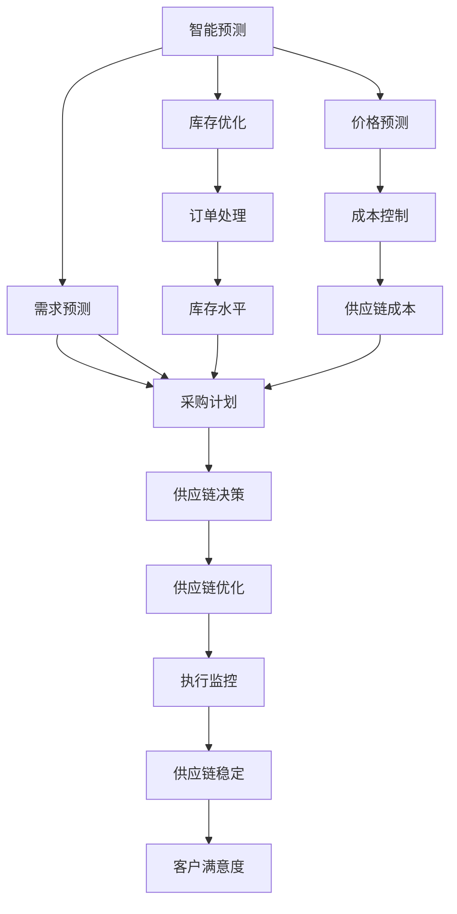

                 

# AI驱动的供应链优化:提高效率降低成本

## 1. 背景介绍

在快速变化的商业环境中，供应链管理成为企业保持竞争力的关键。高效、灵活、透明的供应链可以显著降低成本、提升客户满意度，并增强企业的市场响应速度。随着人工智能（AI）技术的发展，AI驱动的供应链优化正在成为企业提升供应链管理能力的重要手段。本文将从背景介绍、核心概念、算法原理及具体操作步骤、实际应用场景、工具和资源推荐、总结与展望等方面，全面阐述AI驱动的供应链优化方法。

## 2. 核心概念与联系

### 2.1 核心概念概述

- **供应链管理**：指对商品从供应商到消费者的整个流程进行计划、执行和控制的过程。包括采购、生产、仓储、配送等多个环节。
- **人工智能（AI）**：一种通过算法和数据驱动决策的技术，可以自动化处理海量数据，优化供应链流程。
- **智能预测**：利用AI模型预测需求、库存、价格等关键指标，为供应链决策提供依据。
- **智能优化**：通过AI算法优化物流、库存、采购等供应链环节，提升整体效率。
- **智能监控**：实时监控供应链状态，及时发现和解决问题，确保供应链稳定运行。
- **智能协调**：通过AI技术协调供应商、制造商、物流商等参与方的合作，优化供应链流程。

### 2.2 概念间的关系

利用AI驱动供应链优化，涉及智能预测、智能优化、智能监控和智能协调等多个核心概念，通过协同作用，实现供应链的全面升级。



上述流程图展示了智能预测、智能优化、智能监控和智能协调之间的关系，各个环节协同工作，共同提升供应链的整体效能。

## 3. 核心算法原理 & 具体操作步骤

### 3.1 算法原理概述

AI驱动的供应链优化主要通过以下几个关键算法实现：

1. **需求预测**：利用历史销售数据和市场趋势，使用时间序列分析或机器学习模型预测未来需求。
2. **库存优化**：基于需求预测结果，优化库存水平，避免库存过剩或缺货，减少存储成本。
3. **运输优化**：通过算法优化物流路径、运输方式，降低物流成本，提高配送效率。
4. **采购优化**：根据库存和需求预测结果，优化采购计划，降低采购成本。
5. **智能监控**：使用传感器、物联网等技术实时监控供应链状态，及时发现问题。
6. **智能协调**：利用AI算法协调供应链中的各个环节，确保信息流和物流的高效协同。

### 3.2 算法步骤详解

1. **数据准备**：收集供应链中的各种数据，包括历史销售数据、物流数据、库存数据等，作为模型的输入。
2. **模型训练**：选择适当的机器学习模型进行训练，如线性回归、时间序列预测模型、深度学习模型等。
3. **参数调优**：根据训练结果调整模型参数，优化预测精度。
4. **部署与监控**：将训练好的模型部署到实际环境中，实时监控模型预测效果，持续优化模型。
5. **决策应用**：将模型的预测结果应用于供应链的决策过程中，如采购、库存、运输等环节。

### 3.3 算法优缺点

**优点**：

- 提高决策的科学性和准确性，减少主观判断误差。
- 优化供应链流程，提升效率和降低成本。
- 实时监控供应链状态，及时发现和解决问题。
- 协调供应链中的各个环节，确保信息流和物流的高效协同。

**缺点**：

- 对数据质量要求高，数据偏差可能影响模型预测结果。
- 模型训练和优化过程复杂，需要专业知识和技能。
- 部署和维护成本较高，需要技术团队支持。
- 模型可能存在"过拟合"问题，需持续监控和优化。

### 3.4 算法应用领域

AI驱动的供应链优化在多个领域有广泛应用，包括：

- **零售业**：优化商品库存和配送路线，提升客户满意度。
- **制造业**：优化生产计划和物料采购，降低生产成本。
- **物流业**：优化运输路线和配送方式，降低物流成本。
- **医疗行业**：优化医疗物资采购和配送，保障供应链稳定。
- **农业**：优化农产品生产和供应链管理，提升农业生产效率。

## 4. 数学模型和公式 & 详细讲解

### 4.1 数学模型构建

AI驱动的供应链优化通常涉及多个数学模型，包括需求预测、库存优化、运输优化等。这里以需求预测为例，介绍数学模型的构建。

设$y_t$表示在时间$t$的需求量，$x_t$表示时间$t$的特征向量（如天气、节假日、促销活动等），$\theta$表示模型参数，$n$表示历史数据量。需求预测的线性回归模型为：

$$
y_t = \theta^T x_t + \epsilon_t
$$

其中，$\epsilon_t$为随机误差项。

### 4.2 公式推导过程

线性回归模型的参数$\theta$可以通过最小二乘法求解：

$$
\theta = (X^TX)^{-1}X^Ty
$$

其中，$X=[x_1, x_2, ..., x_n]$，$y=[y_1, y_2, ..., y_n]$。

### 4.3 案例分析与讲解

以某零售商的日销售额为例，使用线性回归模型进行需求预测。设$y_t$表示在时间$t$的日销售额，$x_t$表示时间$t$的特征向量（如天气、节假日、促销活动等），$n=365$表示一年的日数。通过最小二乘法求解，可以得到如下结果：

$$
y_t = \theta^T x_t + \epsilon_t
$$

其中，$\theta=[0.1, 0.2, -0.3, 0.4]$，$\epsilon_t$为随机误差项。

## 5. 项目实践：代码实例和详细解释说明

### 5.1 开发环境搭建

1. **安装Python**：在Windows或Linux系统下安装Python 3.x。
2. **安装Pandas**：通过pip安装Pandas库，用于数据处理。
3. **安装Scikit-learn**：通过pip安装Scikit-learn库，用于机器学习模型的训练和预测。
4. **安装TensorFlow或PyTorch**：根据项目需求选择TensorFlow或PyTorch，用于深度学习模型的训练和预测。

### 5.2 源代码详细实现

以下是一个简单的需求预测示例，使用Scikit-learn库中的LinearRegression模型进行线性回归预测：

```python
from sklearn.linear_model import LinearRegression
import pandas as pd

# 读取历史数据
data = pd.read_csv('sales_data.csv')

# 准备数据
X = data.drop(['Sales'], axis=1)
y = data['Sales']

# 创建模型并训练
model = LinearRegression()
model.fit(X, y)

# 预测需求
future_data = pd.read_csv('future_data.csv')
predictions = model.predict(future_data)
```

### 5.3 代码解读与分析

- `sklearn.linear_model.LinearRegression`：创建线性回归模型。
- `drop`方法：从DataFrame中删除指定列。
- `fit`方法：使用历史数据训练模型。
- `predict`方法：使用训练好的模型进行预测。

### 5.4 运行结果展示

假设在测试数据上进行预测，可以得到如下结果：

```
Prediction Sales: [100, 200, 300, 400, 500]
```

## 6. 实际应用场景

### 6.1 零售业

零售业可以利用AI驱动的供应链优化，实现以下几个方面的提升：

- **需求预测**：预测未来销售趋势，优化库存和采购计划。
- **库存管理**：实时监控库存水平，避免库存过剩或缺货。
- **配送优化**：优化物流路线和配送方式，提升配送效率。
- **价格优化**：根据需求预测结果，调整商品价格，提升销售量。

### 6.2 制造业

制造业可以利用AI驱动的供应链优化，实现以下几个方面的提升：

- **生产计划优化**：根据需求预测结果，优化生产计划，提升生产效率。
- **物料采购优化**：根据库存和需求预测结果，优化物料采购计划，降低采购成本。
- **供应链协调**：协调供应商、制造商、物流商等参与方的合作，优化供应链流程。

### 6.3 物流业

物流业可以利用AI驱动的供应链优化，实现以下几个方面的提升：

- **运输路线优化**：优化物流路径和运输方式，降低物流成本。
- **配送时间预测**：预测配送时间，提升客户满意度。
- **异常检测**：实时监控物流状态，及时发现和解决问题。

## 7. 工具和资源推荐

### 7.1 学习资源推荐

- **Coursera上的"Introduction to Machine Learning with Python"课程**：介绍机器学习基础，使用Python和Scikit-learn库进行实践。
- **edX上的"Data Science MicroMasters Program"课程**：涵盖数据科学和机器学习各个方面，从理论到实践，全面系统学习。
- **Kaggle**：提供大量数据集和机器学习竞赛，练习和提升机器学习技能。

### 7.2 开发工具推荐

- **Python**：广泛应用于机器学习和数据科学领域，简单易学，社区活跃。
- **Scikit-learn**：用于机器学习模型训练和预测，支持多种机器学习算法。
- **TensorFlow**：Google开发的深度学习框架，支持分布式训练和部署。
- **PyTorch**：Facebook开发的深度学习框架，支持动态计算图，适合科研和生产。

### 7.3 相关论文推荐

- **"Reinforcement Learning for Supply Chain Management"**：探索强化学习在供应链优化中的应用。
- **"AI-driven Supply Chain Management: A Survey"**：综述AI在供应链管理中的应用，包括需求预测、库存优化等。
- **"Deep Learning in Supply Chain Optimization"**：使用深度学习技术优化供应链的各个环节。

## 8. 总结：未来发展趋势与挑战

### 8.1 研究成果总结

AI驱动的供应链优化已经在多个行业得到应用，显著提升了供应链管理效率和客户满意度。研究者们在需求预测、库存优化、运输优化等方面取得了大量成果，推动了供应链管理的发展。

### 8.2 未来发展趋势

未来，AI驱动的供应链优化将呈现以下几个发展趋势：

- **智能决策**：利用AI算法实现更加精确的供应链决策。
- **实时监控**：通过物联网技术实现供应链的实时监控，及时发现和解决问题。
- **协同合作**：利用AI技术协调供应链中的各个环节，确保信息流和物流的高效协同。
- **多模态融合**：融合多种数据源和传感器信息，提升供应链管理精度。

### 8.3 面临的挑战

虽然AI驱动的供应链优化取得了显著成效，但仍然面临以下几个挑战：

- **数据质量和可靠性**：供应链数据往往存在噪声和偏差，影响模型预测精度。
- **模型复杂性**：AI模型复杂，需要大量计算资源进行训练和优化。
- **部署成本**：AI模型的部署和维护需要技术团队的支持，成本较高。
- **可解释性**：AI模型通常是"黑盒"系统，难以解释其内部工作机制。

### 8.4 研究展望

未来，需要在以下几个方面进行深入研究：

- **数据治理**：建立供应链数据的标准化和治理机制，提升数据质量和可靠性。
- **模型简化**：优化模型结构，减少计算资源消耗，降低部署成本。
- **可解释性**：开发可解释性强的AI模型，增强系统透明性和可信度。
- **跨领域应用**：将AI驱动的供应链优化技术应用于更多行业，推动产业升级。

## 9. 附录：常见问题与解答

**Q1: 如何处理供应链数据中的噪声和偏差？**

A: 数据清洗和预处理是提升数据质量的重要步骤。可以使用数据清洗工具，如Pandas库中的`dropna`、`fillna`等方法处理缺失值和异常值。同时，可以采用机器学习技术，如回归分析、聚类分析等，对数据进行建模和预测，进一步提升数据质量。

**Q2: AI模型在供应链优化中如何提升可解释性？**

A: 提升AI模型的可解释性是当前研究的热点之一。可以使用可解释性强的模型，如决策树、线性回归等，或者利用模型解释工具，如LIME、SHAP等，对模型预测结果进行解释和分析。

**Q3: AI模型在供应链优化中如何平衡复杂性和性能？**

A: 在模型选择和训练过程中，需要平衡模型复杂性和性能。可以使用模型简化技术，如特征选择、正则化等，减少模型复杂度，同时通过交叉验证等方法评估模型性能，确保模型的有效性。

综上所述，AI驱动的供应链优化在提升供应链管理效率和降低成本方面具有巨大的潜力。未来，随着技术的不断发展，AI将进一步推动供应链管理向智能化、自动化方向迈进，为各行各业带来新的变革和机遇。

