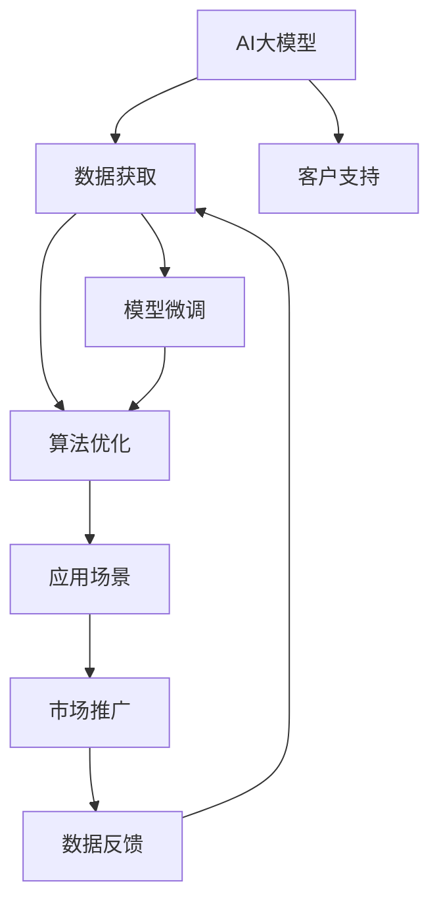

                 

## 1. 背景介绍

### 1.1 问题由来
人工智能(AI)大模型的浪潮已经席卷了全球科技行业，各种基于深度学习的大模型（如BERT、GPT-3等）正在被广泛应用于自然语言处理(NLP)、计算机视觉(CV)、语音识别(SR)等众多领域。这些大模型通过海量的数据预训练，具备了强大的数据理解和生成能力，成为了推动AI技术发展的关键引擎。

随着AI大模型的兴起，越来越多的初创公司涌现，试图在这一领域寻求突破和创新。然而，与传统软件产品相比，AI大模型创业具有更大的复杂性和风险，不仅需要强大的技术实力，还需要精心的市场和渠道策略。本文将详细探讨如何利用渠道优势，推动AI大模型创业的成功。

### 1.2 问题核心关键点
在AI大模型创业中，渠道优势（Channel Advantage）尤为重要。它涉及到的关键点包括：
- **数据获取**：如何获取大规模、高质量的训练数据。
- **算法优化**：如何改进模型算法，提升性能。
- **应用场景**：如何结合具体应用场景，进行模型微调。
- **市场推广**：如何通过渠道策略，快速推广产品。
- **客户支持**：如何提供高效、专业的客户服务，提升用户满意度。

这些关键点互相影响，共同决定着AI大模型创业的成功与否。

### 1.3 问题研究意义
研究如何利用渠道优势，对AI大模型创业具有重要意义：
- **提升竞争力**：有效利用渠道优势，可以快速获取数据、算法、应用场景等资源，缩短产品开发周期，降低创业风险。
- **加速市场扩张**：良好的渠道策略，能够快速推广产品，提升市场占有率，形成良性循环。
- **增强用户体验**：通过高效的客户支持，提升用户体验，增强用户粘性。
- **应对市场变化**：及时获取市场需求信息，灵活调整产品策略，确保长期竞争力。

## 2. 核心概念与联系

### 2.1 核心概念概述
- **AI大模型**：通过大规模数据预训练，具备强大数据理解和生成能力的深度学习模型。
- **数据获取**：收集和整理大规模、高质量的数据，用于模型训练。
- **算法优化**：通过模型微调、优化算法等手段，提升模型性能。
- **应用场景**：结合具体业务需求，进行模型微调，提升应用效果。
- **市场推广**：通过渠道策略，快速推广产品，提升市场占有率。
- **客户支持**：提供高效、专业的客户服务，提升用户满意度。

### 2.2 概念间的关系

这些核心概念之间存在着紧密的联系，形成了AI大模型创业的完整生态系统。以下通过几个Mermaid流程图来展示它们之间的关系：



这个流程图展示了大模型的核心概念及其之间的关系：
1. AI大模型通过数据获取获得基础能力。
2. 算法优化提升模型性能，结合应用场景进行微调。
3. 市场推广将模型推向市场，获取用户反馈。
4. 客户支持保障用户满意度，形成良性循环。
5. 数据反馈优化数据获取策略，形成迭代闭环。

这些概念共同构成了AI大模型创业的完整生态系统，使其能够在各种场景下发挥强大的数据理解和生成能力。通过理解这些核心概念，我们可以更好地把握AI大模型创业的关键环节，为后续深入讨论提供基础。

## 3. 核心算法原理 & 具体操作步骤
### 3.1 算法原理概述
AI大模型的核心算法是深度学习中的神经网络模型，特别是Transformer模型。这些模型通过大规模数据预训练，学习到语言的高级表示，具备强大的数据理解和生成能力。在应用场景中，通常需要通过微调来优化模型，使其适应特定任务。

### 3.2 算法步骤详解

**Step 1: 数据获取**
1. **数据收集**：从公开数据集（如IMDB、Yelp等）、商业数据（如客户评论、社交媒体数据等）、自主数据（如医疗、金融等行业数据）中收集数据。
2. **数据清洗**：去除噪声数据、处理缺失值、标注数据等，确保数据质量。
3. **数据预处理**：进行文本分词、标准化、向量化等预处理工作，方便后续模型训练。

**Step 2: 模型微调**
1. **模型选择**：选择合适的预训练模型，如BERT、GPT-3等。
2. **模型加载**：将预训练模型加载到内存中，进行微调。
3. **任务适配**：根据具体任务，添加任务适配层，如分类层、解码器等。
4. **损失函数**：选择适合任务的损失函数，如交叉熵损失、均方误差损失等。
5. **训练**：使用训练集进行模型训练，最小化损失函数。
6. **验证**：在验证集上评估模型性能，调整超参数。
7. **测试**：在测试集上评估模型性能，进行最终优化。

**Step 3: 市场推广**
1. **渠道策略**：选择合适的渠道进行产品推广，如合作伙伴、社交媒体、技术社区等。
2. **品牌建设**：通过案例展示、技术白皮书、行业报告等形式，提升品牌知名度。
3. **合作伙伴**：寻找行业内的合作伙伴，共同推广产品。
4. **用户反馈**：收集用户反馈，进行产品优化。

**Step 4: 客户支持**
1. **客服系统**：建立高效、专业的客服系统，提供技术支持。
2. **文档支持**：提供详细的用户手册、技术文档，方便用户使用。
3. **社区支持**：建立技术社区，方便用户交流、分享经验。
4. **培训支持**：提供线上、线下的培训课程，帮助用户提升使用水平。

### 3.3 算法优缺点
**优点**：
- **泛化能力强**：通过大规模数据预训练，模型具备较强的泛化能力。
- **性能优异**：模型具备强大的数据理解和生成能力，适用于多种应用场景。
- **可解释性强**：通过任务适配层，可以解释模型决策过程。

**缺点**：
- **资源消耗大**：大模型需要大量的计算资源和存储空间。
- **微调成本高**：需要收集、清洗、预处理大规模数据，微调成本较高。
- **模型复杂度高**：模型结构复杂，参数量大，难以理解和调试。

### 3.4 算法应用领域
AI大模型在以下领域具有广泛的应用前景：
- **自然语言处理**：文本分类、情感分析、问答系统等。
- **计算机视觉**：图像识别、目标检测、图像生成等。
- **语音识别**：语音合成、语音识别、语音情感分析等。
- **金融领域**：信用评分、风险评估、投资建议等。
- **医疗领域**：疾病诊断、病历分析、药物研发等。

## 4. 数学模型和公式 & 详细讲解
### 4.1 数学模型构建

假设AI大模型的输入为$x$，输出为$y$，模型为$f$。在数据集$\mathcal{D}=\{(x_i, y_i)\}_{i=1}^N$上进行微调。微调的目标是找到最优参数$\theta$，使得模型在训练集上的损失最小化。

**目标函数**：
$$
\min_{\theta} \frac{1}{N}\sum_{i=1}^N \ell(f_{\theta}(x_i), y_i)
$$

其中$\ell$为损失函数，$\theta$为模型参数。

### 4.2 公式推导过程

以分类任务为例，假设模型$f_{\theta}$的输出为概率分布$p$，真实标签为$y$。二分类交叉熵损失函数定义为：
$$
\ell(f_{\theta}(x), y) = -[y\log f_{\theta}(x) + (1-y)\log(1-f_{\theta}(x))]
$$

在训练集$\mathcal{D}=\{(x_i, y_i)\}_{i=1}^N$上，经验风险为：
$$
\mathcal{L}(\theta) = \frac{1}{N}\sum_{i=1}^N \ell(f_{\theta}(x_i), y_i)
$$

使用梯度下降等优化算法，最小化经验风险，得到最优模型参数$\theta^*$：
$$
\theta^* = \mathop{\arg\min}_{\theta} \mathcal{L}(\theta)
$$

### 4.3 案例分析与讲解

假设模型$f_{\theta}$在二分类任务上进行微调，损失函数为交叉熵损失。训练集$\mathcal{D}=\{(x_i, y_i)\}_{i=1}^N$，验证集$\mathcal{D}_{val}=\{(x_j, y_j)\}_{j=1}^M$，测试集$\mathcal{D}_{test}=\{(x_k, y_k)\}_{k=1}^K$。

1. **数据准备**：收集标注数据，分为训练集、验证集和测试集。
2. **模型加载**：加载预训练模型$f_{\theta_0}$，进行微调。
3. **任务适配**：添加分类层和交叉熵损失函数。
4. **训练**：使用训练集$\mathcal{D}$进行模型训练，最小化损失函数。
5. **验证**：在验证集$\mathcal{D}_{val}$上评估模型性能，调整超参数。
6. **测试**：在测试集$\mathcal{D}_{test}$上评估模型性能，进行最终优化。

## 5. 项目实践：代码实例和详细解释说明
### 5.1 开发环境搭建

使用Python和PyTorch进行AI大模型微调开发，需要以下开发环境：
1. 安装Anaconda：
```bash
conda create -n pytorch-env python=3.8
conda activate pytorch-env
```
2. 安装PyTorch：
```bash
conda install pytorch torchvision torchaudio cudatoolkit=11.1 -c pytorch -c conda-forge
```
3. 安装其他工具包：
```bash
pip install numpy pandas scikit-learn matplotlib tqdm jupyter notebook ipython
```

### 5.2 源代码详细实现

以下是一个简单的基于PyTorch的分类任务微调代码实现：

```python
import torch
import torch.nn as nn
import torch.optim as optim
from torch.utils.data import DataLoader
from torchvision import datasets, transforms

# 定义模型结构
class Net(nn.Module):
    def __init__(self):
        super(Net, self).__init__()
        self.fc1 = nn.Linear(28 * 28, 128)
        self.fc2 = nn.Linear(128, 10)

    def forward(self, x):
        x = torch.relu(self.fc1(x))
        x = self.fc2(x)
        return x

# 定义损失函数和优化器
net = Net()
criterion = nn.CrossEntropyLoss()
optimizer = optim.SGD(net.parameters(), lr=0.01)

# 加载数据集
train_dataset = datasets.MNIST('data/', train=True, download=True, transform=transforms.ToTensor())
test_dataset = datasets.MNIST('data/', train=False, download=True, transform=transforms.ToTensor())

# 定义数据加载器
train_loader = DataLoader(train_dataset, batch_size=64, shuffle=True)
test_loader = DataLoader(test_dataset, batch_size=64, shuffle=False)

# 训练模型
for epoch in range(10):
    running_loss = 0.0
    for i, data in enumerate(train_loader, 0):
        inputs, labels = data
        optimizer.zero_grad()
        outputs = net(inputs)
        loss = criterion(outputs, labels)
        loss.backward()
        optimizer.step()
        running_loss += loss.item()
    print('Epoch %d loss: %.3f' % (epoch + 1, running_loss / len(train_loader)))

# 测试模型
correct = 0
total = 0
with torch.no_grad():
    for data in test_loader:
        inputs, labels = data
        outputs = net(inputs)
        _, predicted = torch.max(outputs.data, 1)
        total += labels.size(0)
        correct += (predicted == labels).sum().item()
print('Accuracy of the network on the 10000 test images: %d %%' % (100 * correct / total))
```

### 5.3 代码解读与分析

以上代码展示了基于PyTorch的简单分类任务微调过程。

**数据准备**：使用PyTorch内置的MNIST数据集，进行数据预处理。

**模型定义**：定义一个简单的线性神经网络结构，包含两个全连接层。

**损失函数和优化器**：使用交叉熵损失函数和随机梯度下降优化器。

**数据加载器**：定义训练集和测试集的数据加载器，方便模型训练和测试。

**模型训练**：使用训练集进行模型训练，每轮训练后输出损失值。

**模型测试**：使用测试集评估模型性能，输出准确率。

## 6. 实际应用场景
### 6.1 智能客服系统

智能客服系统通过AI大模型进行问答、情感分析、意图识别等，能够24小时不间断提供服务，提升客户满意度。具体流程如下：

1. **数据准备**：收集历史客服对话数据，标注意图和问题。
2. **模型训练**：使用标注数据训练模型，进行分类、意图识别等任务。
3. **模型微调**：根据实际应用场景，进行模型微调，提升性能。
4. **系统部署**：将微调后的模型集成到智能客服系统中，实时处理客户咨询。
5. **效果评估**：定期评估系统性能，进行模型优化。

### 6.2 金融舆情监测

金融舆情监测系统通过AI大模型进行情感分析、舆情识别等，帮助金融机构实时掌握市场动态，防范风险。具体流程如下：

1. **数据准备**：收集金融领域的新闻、评论等数据，标注情感和主题。
2. **模型训练**：使用标注数据训练模型，进行情感分析、舆情识别等任务。
3. **模型微调**：根据实际需求，进行模型微调，提升性能。
4. **系统部署**：将微调后的模型集成到舆情监测系统中，实时监测舆情变化。
5. **效果评估**：定期评估系统性能，进行模型优化。

### 6.3 个性化推荐系统

个性化推荐系统通过AI大模型进行用户兴趣分析、物品推荐等，提升用户推荐体验。具体流程如下：

1. **数据准备**：收集用户行为数据，提取物品标题、描述等信息。
2. **模型训练**：使用用户行为数据训练模型，进行用户兴趣分析、物品推荐等任务。
3. **模型微调**：根据实际需求，进行模型微调，提升性能。
4. **系统部署**：将微调后的模型集成到推荐系统中，实时推荐商品、文章等。
5. **效果评估**：定期评估系统性能，进行模型优化。

### 6.4 未来应用展望

未来AI大模型将在更多领域得到应用，如智慧医疗、智能教育、智慧城市等。具体展望如下：

1. **智慧医疗**：通过AI大模型进行疾病诊断、病历分析、药物研发等，提升医疗水平。
2. **智能教育**：通过AI大模型进行作业批改、学情分析、知识推荐等，提升教育质量。
3. **智慧城市**：通过AI大模型进行城市事件监测、舆情分析、应急指挥等，提升城市管理水平。
4. **工业制造**：通过AI大模型进行质量检测、故障诊断、生产调度等，提升生产效率。
5. **农业领域**：通过AI大模型进行土壤分析、病虫害预测、农作物识别等，提升农业生产水平。

## 7. 工具和资源推荐
### 7.1 学习资源推荐

以下是一些学习资源，帮助开发者掌握AI大模型的开发和微调技巧：

1. **Transformer模型系列论文**：包括Attention is All You Need、BERT等，帮助理解大模型的原理和实现。
2. **PyTorch官方文档**：详细介绍PyTorch框架的使用方法，提供丰富的教程和示例代码。
3. **Kaggle竞赛**：参与Kaggle等数据科学竞赛，提升实战能力。
4. **Coursera、edX等在线课程**：学习深度学习、自然语言处理等领域的知识。
5. **Google AI、DeepMind等博客**：分享最新的研究成果和应用案例。

### 7.2 开发工具推荐

以下是一些常用的开发工具，帮助开发者提升AI大模型的开发效率：

1. **PyTorch**：基于Python的深度学习框架，支持动态计算图，适合快速迭代研究。
2. **TensorFlow**：由Google主导的深度学习框架，支持大规模工程应用。
3. **TensorBoard**：TensorFlow配套的可视化工具，用于实时监测模型训练状态。
4. **Weights & Biases**：模型训练的实验跟踪工具，记录和可视化模型训练过程中的各项指标。
5. **Jupyter Notebook**：支持Python代码块的在线编辑和运行，方便分享和协作。

### 7.3 相关论文推荐

以下是一些前沿的AI大模型和微调论文，帮助开发者紧跟技术发展：

1. **Attention is All You Need**：介绍Transformer模型的原理和实现。
2. **BERT: Pre-training of Deep Bidirectional Transformers for Language Understanding**：介绍BERT模型的原理和预训练方法。
3. **Parameter-Efficient Transfer Learning for NLP**：介绍参数高效微调方法。
4. **AdaLoRA: Adaptive Low-Rank Adaptation for Parameter-Efficient Fine-Tuning**：介绍自适应低秩适应的微调方法。
5. **Prefix-Tuning: Optimizing Continuous Prompts for Generation**：介绍基于连续型Prompt的微调范式。

## 8. 总结：未来发展趋势与挑战
### 8.1 总结

本文详细介绍了AI大模型微调的方法和流程，以及如何利用渠道优势推动大模型创业成功。通过梳理数据获取、算法优化、应用场景、市场推广和客户支持等环节，展现了AI大模型创业的完整生态系统。这些关键点互相影响，共同决定着创业的成功与否。

### 8.2 未来发展趋势

未来AI大模型将继续快速发展，表现出以下趋势：

1. **模型规模扩大**：大规模预训练模型不断涌现，参数量达到数十亿，提升模型的泛化能力和性能。
2. **多模态融合**：将图像、语音、文本等多模态信息进行融合，提升模型的应用场景和性能。
3. **实时计算**：通过优化模型结构和计算图，实现实时推理，提升应用效率。
4. **知识图谱整合**：将符号化的知识图谱与模型结合，增强模型的推理能力和知识整合能力。
5. **零样本学习**：利用大模型的语言理解能力，实现零样本学习，提升模型在不同领域的应用能力。

### 8.3 面临的挑战

尽管AI大模型技术取得显著进展，但在创业过程中仍面临以下挑战：

1. **数据获取困难**：获取大规模、高质量的数据，是预训练模型的基础，但成本高昂。
2. **算法复杂度高**：模型结构复杂，参数量大，难以理解和调试。
3. **资源消耗大**：大模型需要大量的计算资源和存储空间。
4. **模型鲁棒性不足**：面对不同领域的数据，模型泛化能力有限。
5. **市场推广困难**：缺乏有效的渠道策略，难以快速推广产品。

### 8.4 研究展望

未来的研究需要在以下方面取得突破：

1. **数据高效获取**：研究无监督学习和半监督学习等方法，提升数据获取效率。
2. **模型高效优化**：开发参数高效微调方法，优化模型结构和计算图，提升计算效率。
3. **多模态融合**：研究多模态融合方法，提升模型的应用场景和性能。
4. **知识图谱整合**：将符号化的知识图谱与模型结合，增强模型的推理能力和知识整合能力。
5. **模型鲁棒性提升**：研究模型鲁棒性提升方法，提升模型的泛化能力和鲁棒性。

## 9. 附录：常见问题与解答

**Q1: AI大模型的训练需要多少数据？**

A: AI大模型的训练需要大规模的数据，通常使用成百上千甚至数百万的数据集进行预训练。这些数据集可以来自公开数据集、商业数据或自主数据。

**Q2: AI大模型的微调需要哪些步骤？**

A: AI大模型的微调一般包括以下步骤：数据准备、模型加载、任务适配、损失函数、训练、验证、测试。其中，数据准备是关键，需要收集、清洗、预处理大规模数据。

**Q3: AI大模型在实际应用中如何优化？**

A: 实际应用中，AI大模型可以通过参数高效微调、多模态融合、实时计算等方法进行优化，提升性能和应用效率。

**Q4: 如何选择合适的AI大模型？**

A: 选择合适的AI大模型需要考虑模型的规模、性能、应用场景等因素。一般选择已经在大规模数据上预训练过的模型，如BERT、GPT-3等。

**Q5: 如何提升AI大模型的可解释性？**

A: 提升AI大模型的可解释性可以通过任务适配层、数据可视化、模型解释器等方法，帮助用户理解模型的决策过程。

---

作者：禅与计算机程序设计艺术 / Zen and the Art of Computer Programming

